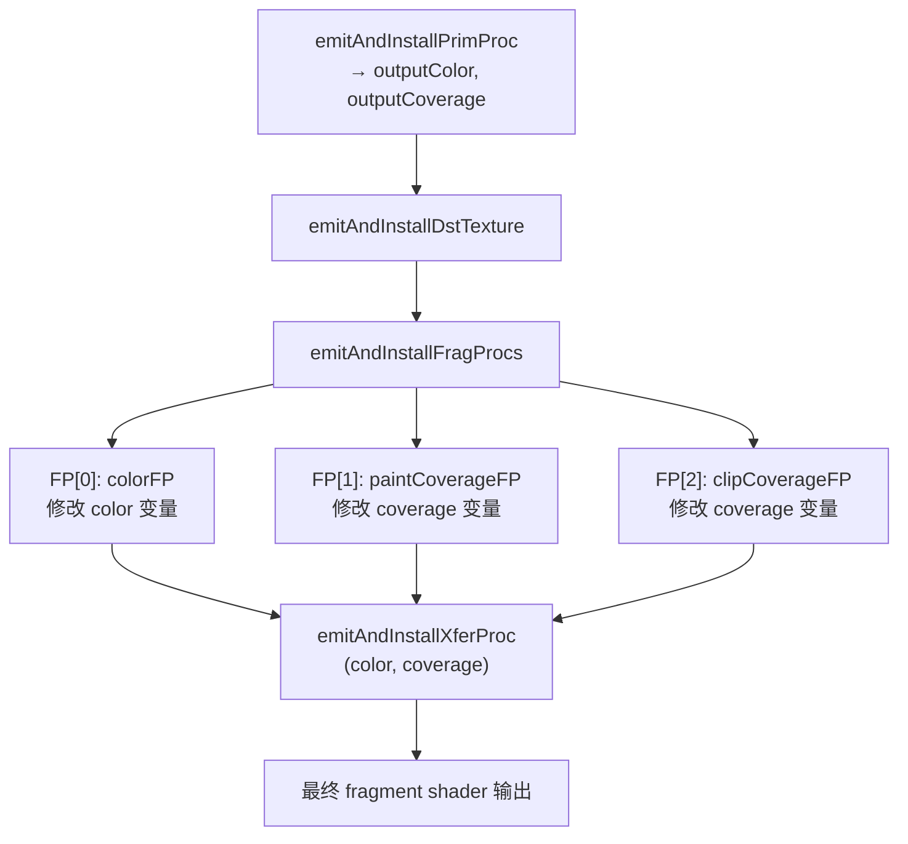
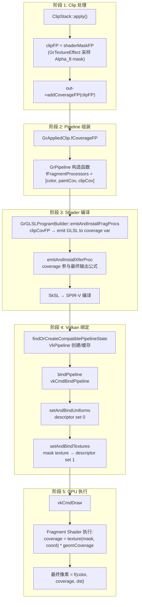
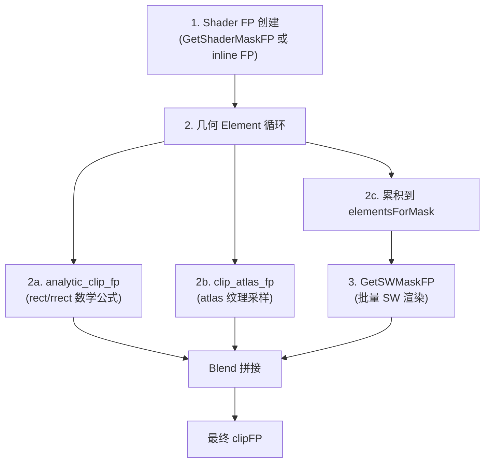
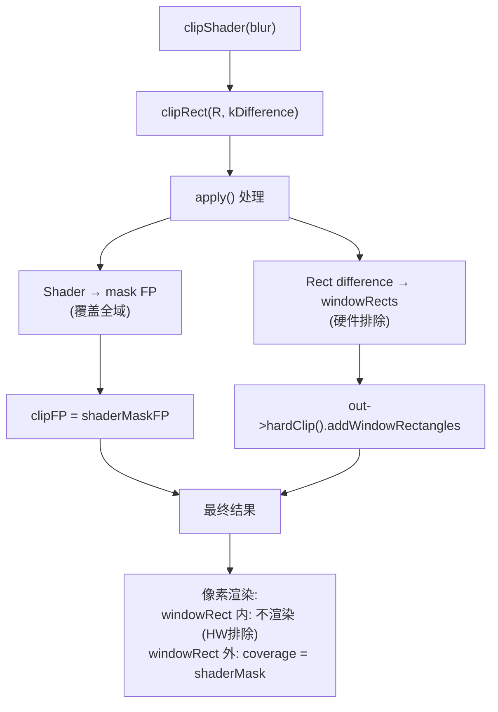
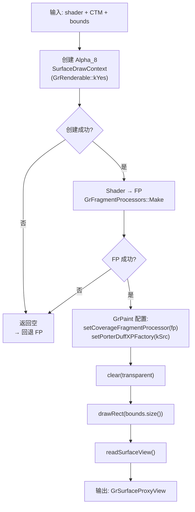
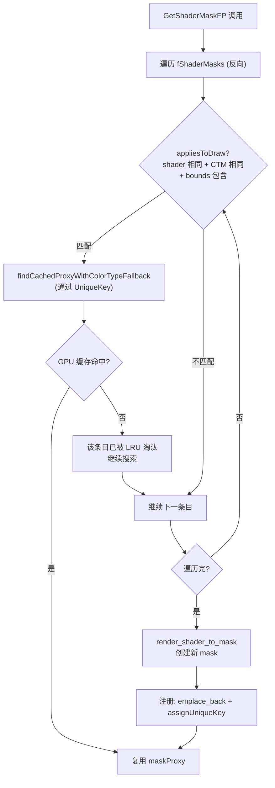
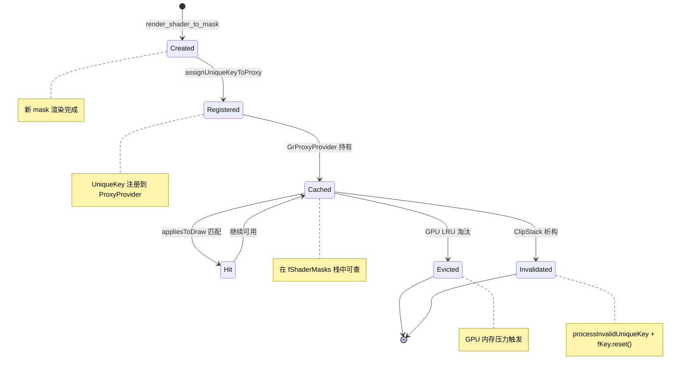
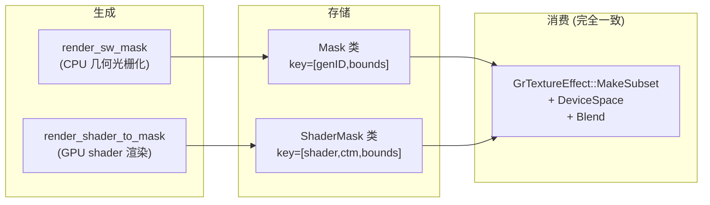

# ClipShader Mask 使用方案

---

## 目录

- [Part 1: Vulkan GPU 管线中 ClipShader Mask 的消费流程](#part-1-vulkan-gpu-管线中-clipshader-mask-的消费流程)
- [Part 2: 方案对 clipShader 接口及 apply() Shader 拼接的处理](#part-2-方案对-clipshader-接口及-apply-shader-拼接的处理)
- [Part 3: GPU Mask 渲染使用方案](#part-3-gpu-mask-渲染使用方案)

---

## Part 1: Vulkan GPU 管线中 ClipShader Mask 的消费流程

> 本节覆盖 GPU 路径中，从 `ClipStack::apply()` 产出 coverage FP 之后，它在 Ganesh/Vulkan 后端中如何被编译为 SPIR-V 着色器代码、绑定到 Vulkan pipeline、最终参与像素渲染的完整链路。

### 完整链路总览


---

### 1.1 存储: GrAppliedClip::fCoverageFP

**位置**: `src/gpu/ganesh/GrAppliedClip.h:118-138, 164`

```cpp
// line 118: 查询是否有 coverage FP
int hasCoverageFragmentProcessor() const { return fCoverageFP != nullptr; }

// line 131-138: 添加 coverage FP（多个通过 Compose 组合）
void addCoverageFP(std::unique_ptr<GrFragmentProcessor> fp) {
    if (fCoverageFP == nullptr) {
        fCoverageFP = std::move(fp);
    } else {
        // Compose this coverage FP with the previously-added coverage.
        fCoverageFP = GrFragmentProcessor::Compose(std::move(fp), std::move(fCoverageFP));
    }
}

// line 164: 私有存储
std::unique_ptr<GrFragmentProcessor> fCoverageFP;
```

**关键设计**:

- `ClipStack::apply()` 的最终输出通过 `out->addCoverageFP(clipFP)` 存入此字段
- 多个 coverage FP（如 clip shader mask + 几何 coverage）通过 `GrFragmentProcessor::Compose()` 组合为单一 FP
- 这是 clip coverage 进入渲染管线的唯一入口

---

### 1.2 组装: GrPipeline 构造

**位置**: `src/gpu/ganesh/GrPipeline.cpp:41-62`

```cpp
GrPipeline::GrPipeline(const InitArgs& args, GrProcessorSet&& processors,
                       GrAppliedClip&& appliedClip)
        : GrPipeline(args, processors.refXferProcessor(), appliedClip.hardClip()) {
    SkASSERT(processors.isFinalized());
    // Copy GrFragmentProcessors from GrProcessorSet to Pipeline
    fNumColorProcessors = processors.hasColorFragmentProcessor() ? 1 : 0;
    int numTotalProcessors = fNumColorProcessors +
                             (processors.hasCoverageFragmentProcessor() ? 1 : 0) +
                             (appliedClip.hasCoverageFragmentProcessor() ? 1 : 0);
    fFragmentProcessors.reset(numTotalProcessors);

    int currFPIdx = 0;
    if (processors.hasColorFragmentProcessor()) {
        fFragmentProcessors[currFPIdx++] = processors.detachColorFragmentProcessor();
    }
    if (processors.hasCoverageFragmentProcessor()) {
        fFragmentProcessors[currFPIdx++] = processors.detachCoverageFragmentProcessor();
    }
    if (appliedClip.hasCoverageFragmentProcessor()) {
        fFragmentProcessors[currFPIdx++] = appliedClip.detachCoverageFragmentProcessor();
    }
}
```

**FP 数组排列** (`src/gpu/ganesh/GrPipeline.h:114-117`):

```cpp
int numColorFragmentProcessors() const { return fNumColorProcessors; }
bool isColorFragmentProcessor(int idx) const { return idx < fNumColorProcessors; }
bool isCoverageFragmentProcessor(int idx) const { return idx >= fNumColorProcessors; }
```

**数组布局**:

```
fFragmentProcessors[] = [colorFP, paintCoverageFP, clipCoverageFP]
                         ├─ color ─┤├──────── coverage ─────────┤
                         idx < fNumColorProcessors  │  idx >= fNumColorProcessors
```

- `fNumColorProcessors` 作为 color/coverage 的分界线
- Clip coverage FP 永远在数组**最后**（在 paint coverage FP 之后）

---

### 1.3 着色器代码生成: GrGLSLProgramBuilder

**位置**: `src/gpu/ganesh/glsl/GrGLSLProgramBuilder.cpp:61-151`

`emitAndInstallProcs()` 是着色器代码生成的主入口 (line 61-81):

```cpp
bool GrGLSLProgramBuilder::emitAndInstallProcs() {
    SkString inputColor;
    SkString inputCoverage;
    // 1. GeometryProcessor → 输出初始 color + coverage
    if (!this->emitAndInstallPrimProc(&inputColor, &inputCoverage)) {
        return false;
    }
    // 2. DST 纹理 (若需要读 dst)
    if (!this->emitAndInstallDstTexture()) {
        return false;
    }
    // 3. Fragment Processors → 分叉到 color 或 coverage 变量
    if (!this->emitAndInstallFragProcs(&inputColor, &inputCoverage)) {
        return false;
    }
    // 4. XferProcessor → 用 coverage 调制最终输出
    if (!this->emitAndInstallXferProc(inputColor, inputCoverage)) {
        return false;
    }
    // ...
}
```

**Coverage FP 代码生成的关键分叉** (line 135-151):

```cpp
bool GrGLSLProgramBuilder::emitAndInstallFragProcs(SkString* color, SkString* coverage) {
    int fpCount = this->pipeline().numFragmentProcessors();
    for (int i = 0; i < fpCount; ++i) {
        // 关键分叉: isColorFP → 输出到 color; 否则 → 输出到 coverage
        SkString* inOut = this->pipeline().isColorFragmentProcessor(i) ? color : coverage;
        SkString output;
        const GrFragmentProcessor& fp = this->pipeline().getFragmentProcessor(i);
        fFPImpls.push_back(fp.makeProgramImpl());
        output = this->emitRootFragProc(fp, *fFPImpls.back(), *inOut, output);
        *inOut = std::move(output);
    }
    return true;
}
```

**语义**: Clip coverage FP 的 GLSL 代码被 emit 到 `coverage` 变量中，最终作为 `args.fInputCoverage` 传入 XferProcessor。



---

### 1.4 XferProcessor 应用 Coverage

**位置**: `src/gpu/ganesh/GrXferProcessor.cpp:117-217`

XferProcessor 接收 `coverage` 变量后，分两条路径应用:

#### 路径 A: 无 DST 读取 (willReadDstColor = false)

**位置**: `src/gpu/ganesh/effects/GrPorterDuffXferProcessor.cpp:73-130`

```cpp
static void append_color_output(/* ... */,
        BlendFormula::OutputType outputType,
        const char* output, const char* inColor, const char* inCoverage) {
    switch (outputType) {
        case kNone_OutputType:
            // output = half4(0.0)
            break;
        case kCoverage_OutputType:
            // output = inCoverage          ← coverage 直接作为输出
            break;
        case kModulate_OutputType:
            // output = inColor * inCoverage ← 最常见: 颜色 × coverage
            break;
        case kSAModulate_OutputType:
            // output = inColor.a * inCoverage
            break;
        case kISAModulate_OutputType:
            // output = (1 - inColor.a) * inCoverage
            break;
        case kISCModulate_OutputType:
            // output = (1 - inColor) * inCoverage
            break;
    }
}
```

此路径依赖**硬件混合** (Vulkan blend state)，shader 输出 `primaryOutput` 和可选 `secondaryOutput`，由 `VkPipelineColorBlendAttachmentState` 执行最终 src/dst blend。

#### 路径 B: 有 DST 读取 (willReadDstColor = true)

**位置**: `src/gpu/ganesh/GrXferProcessor.cpp:194-217`

```cpp
void ProgramImpl::DefaultCoverageModulation(GrGLSLXPFragmentBuilder* fragBuilder,
                                            const char* srcCoverage,
                                            const char* dstColor,
                                            const char* outColor,
                                            const char* outColorSecondary,
                                            const GrXferProcessor& proc) {
    if (srcCoverage) {
        // 核心公式: outColor = coverage * blendResult + (1 - coverage) * dstColor
        fragBuilder->codeAppendf("%s = %s * %s + (half4(1.0) - %s) * %s;",
                                 outColor,       // 最终输出
                                 srcCoverage,    // ← clip coverage 在此
                                 outColor,       // blend(src, dst) 结果
                                 srcCoverage,    // 1 - coverage
                                 dstColor);      // 原始 dst
    }
}
```

**语义**: Coverage 作为 blend result 与 dst 之间的**插值权重**:

- `coverage = 1.0` → 完全使用 blend 结果（像素在 clip 内）
- `coverage = 0.0` → 保留原始 dst（像素在 clip 外）
- `0 < coverage < 1` → 平滑过渡（clip 边缘 anti-aliasing）

---

### 1.5 Vulkan Pipeline 绑定

**位置**: `src/gpu/ganesh/vk/GrVkOpsRenderPass.cpp:645-692`

```cpp
bool GrVkOpsRenderPass::onBindPipeline(const GrProgramInfo& programInfo,
                                        const SkRect& drawBounds) {
    // 1. 获取/创建 VkPipeline (含编译好的 SPIR-V shader modules)
    fCurrentPipelineState = fGpu->resourceProvider().findOrCreateCompatiblePipelineState(
            fRenderTarget, programInfo, compatibleRenderPass, ...);

    // 2. 绑定 VkPipeline
    fCurrentPipelineState->bindPipeline(fGpu, currentCB);
    //   → vkCmdBindPipeline(VK_PIPELINE_BIND_POINT_GRAPHICS, pipeline)

    // 3. 设置所有 FP uniform (含 clip coverage FP 的 uniform) + 绑定 descriptor set 0
    fCurrentPipelineState->setAndBindUniforms(fGpu, colorAttachmentDimensions,
                                              programInfo, currentCB);

    // 4. 动态状态
    GrVkPipeline::SetDynamicViewportState(...);
    GrVkPipeline::SetDynamicScissorRectState(...);
    GrVkPipeline::SetDynamicBlendConstantState(...);
}
```

**Uniform 绑定详情** (`src/gpu/ganesh/vk/GrVkPipelineState.cpp:96-130`):

```cpp
bool GrVkPipelineState::setAndBindUniforms(/* ... */) {
    // GP uniform 数据
    fGPImpl->setData(fDataManager, *gpu->caps()->shaderCaps(), programInfo.geomProc());

    // 遍历所有 FP (含 clip coverage FP) 设置 uniform 数据
    for (int i = 0; i < programInfo.pipeline().numFragmentProcessors(); ++i) {
        const auto& fp = programInfo.pipeline().getFragmentProcessor(i);
        fp.visitWithImpls([&](const GrFragmentProcessor& fp,
                              GrFragmentProcessor::ProgramImpl& impl) {
            impl.setData(fDataManager, fp);  // ← clip mask FP 的坐标变换等 uniform
        }, *fFPImpls[i]);
    }

    // XP uniform 数据
    fXPImpl->setData(fDataManager, programInfo.pipeline().getXferProcessor());

    // 上传到 GPU buffer + 绑定 descriptor set 0 (uniform buffer)
    auto [uniformBuffer, success] = fDataManager.uploadUniforms(gpu, fPipeline->layout(), commandBuffer);
    commandBuffer->bindDescriptorSets(gpu, fPipeline->layout(), kUniformDSIdx, ...);
}
```

---

### 1.6 纹理绑定 (Coverage FP 的 Mask 纹理)

**位置**: `src/gpu/ganesh/vk/GrVkPipelineState.cpp:132-244`

```cpp
bool GrVkPipelineState::setAndBindTextures(GrVkGpu* gpu,
                                           const GrGeometryProcessor& geomProc,
                                           const GrPipeline& pipeline,
                                           const GrSurfaceProxy* const geomProcTextures[],
                                           GrVkCommandBuffer* commandBuffer) {
    // ...
    // 遍历所有 FP 的 GrTextureEffect（含 clip coverage FP 的 mask 纹理）
    pipeline.visitTextureEffects([&](const GrTextureEffect& te) {
        GrSamplerState samplerState = te.samplerState();
        auto* texture = static_cast<GrVkTexture*>(te.texture());
        samplerBindings[currTextureBinding++] = {samplerState, texture};
    });

    // 为每个纹理创建 VkDescriptorImageInfo
    for (int i = 0; i < fNumSamplers; ++i) {
        VkDescriptorImageInfo imageInfo;
        imageInfo.sampler = sampler->sampler();             // VkSampler
        imageInfo.imageView = textureView->imageView();     // VkImageView (mask 纹理)
        imageInfo.imageLayout = VK_IMAGE_LAYOUT_SHADER_READ_ONLY_OPTIMAL;

        VkWriteDescriptorSet writeInfo;
        writeInfo.dstSet = *descriptorSet->descriptorSet();
        writeInfo.descriptorType = VK_DESCRIPTOR_TYPE_COMBINED_IMAGE_SAMPLER;
        writeInfo.pImageInfo = &imageInfo;

        // 写入 descriptor set
        GR_VK_CALL(gpu->vkInterface(),
                   UpdateDescriptorSets(gpu->device(), 1, &writeInfo, 0, nullptr));
    }

    // 绑定 sampler descriptor set (set 1)
    commandBuffer->bindDescriptorSets(gpu, fPipeline->layout(), kSamplerDSIdx, ...);
}
```

**Vulkan Descriptor Set 布局**:

```
Set 0: Uniform Buffer (所有 FP/GP/XP 的 uniform 数据)
Set 1: Combined Image Samplers (所有纹理，含 clip mask 纹理)
```

---

### 1.7 GPU 执行: Fragment Shader 中的代码结构

生成的 GLSL (编译为 SPIR-V) 结构如下:

```glsl
void main() {
    // === GeometryProcessor 输出 ===
    half4 outputColor = ...;       // 顶点插值颜色
    half4 outputCoverage = ...;    // 几何覆盖率 (如 edge AA)

    // === Color FP 链 (修改 outputColor) ===
    outputColor = colorFP_0(outputColor);  // paint shader 等

    // === Coverage FP 链 (修改 outputCoverage) ===
    // paint coverage FP
    outputCoverage = coverageFP_0(outputCoverage);
    // clip coverage FP ← ClipShader Mask 在此采样
    outputCoverage = coverageFP_1(outputCoverage);
    //   内部: sample(maskTexture, transformedCoord) * inputCoverage

    // === XferProcessor 应用 coverage ===
    // 路径 A (无 DST 读取, 硬件 blend):
    //   sk_FragColor = outputColor * outputCoverage;  // primaryOutput
    //   硬件执行: finalPixel = src*srcFactor + dst*dstFactor
    //
    // 路径 B (有 DST 读取, shader blend):
    //   half4 blendResult = customBlend(outputColor, dstColor);
    //   sk_FragColor = outputCoverage * blendResult + (1-outputCoverage) * dstColor;
}
```

---

### 1.8 对比表: Color FP vs Coverage FP 在管线中的差异


| 维度                 | Color FP                                      | Coverage FP (clip)                                                    |
| -------------------- | --------------------------------------------- | --------------------------------------------------------------------- |
| **数组位置**         | `fFragmentProcessors[0..fNumColorProcessors)` | `fFragmentProcessors[fNumColorProcessors..)`                          |
| **代码生成输出变量** | `color` SkString                              | `coverage` SkString                                                   |
| **传入 XP 的参数**   | `args.fInputColor`                            | `args.fInputCoverage`                                                 |
| **语义作用**         | 决定像素颜色                                  | 调制最终输出 (乘/lerp)                                                |
| **XP 中的使用**      | `append_color_output(inColor, ...)`           | `append_color_output(..., inCoverage)` 或 `DefaultCoverageModulation` |
| **Vulkan 绑定**      | 共享 descriptor set                           | 共享 descriptor set (同一 set 1)                                      |
| **纹理**             | paint shader 纹理                             | mask 纹理 (Alpha_8, ClampToBorder, Nearest)                           |

---

### 1.9 端到端流程总结



---

## Part 2: 方案对 clipShader 接口及 apply() Shader 拼接的处理

> 本节分析 GPU 路径中 Mask 方案是否完整覆盖了 clipShader 的所有接口和边界情况。

### 2.1 Path 1 (addShader): 无需修改

**位置**: `src/gpu/ganesh/ClipStack.cpp:932-943`

```cpp
void ClipStack::SaveRecord::addShader(sk_sp<SkShader> shader) {
    SkASSERT(shader);
    SkASSERT(this->canBeUpdated());
    if (!fShader) {
        fShader = std::move(shader);
    } else {
        fShader = SkShaders::Blend(SkBlendMode::kSrcIn, std::move(shader), fShader);
    }
}
```

**分析**:

- 多次 `clipShader()` 调用通过 `kSrcIn` 合并为单个组合 shader
- Mask 方案只需处理合并后的单个 `fShader`
- **无需修改**: 合并逻辑与 Mask/FP 模式选择正交

---

### 2.2 Path 2 (apply): 决策层插入点

**位置**: `src/gpu/ganesh/ClipStack.cpp:1335-1348`

**现有代码**:

```cpp
if (cs.shader()) {
    static const GrColorInfo kCoverageColorInfo{GrColorType::kUnknown, kPremul_SkAlphaType, nullptr};
    GrFPArgs args(sdc, &kCoverageColorInfo, sdc->surfaceProps(), GrFPArgs::Scope::kDefault);
    clipFP = GrFragmentProcessors::Make(cs.shader(), args, *fCTM);
    if (clipFP) {
        clipFP = GrFragmentProcessor::MulInputByChildAlpha(std::move(clipFP));
    }
}
```

**方案修改后**:

```cpp
if (cs.shader()) {
    bool usedMask = false;

    if (ShouldUseShaderMask(cs.shader().get(), draw.outerBounds())) {
        auto [success, fp] = GetShaderMaskFP(
            rContext, &fShaderMasks, cs.shader(), *fCTM,
            draw.outerBounds(), std::move(clipFP));
        if (success) {
            clipFP = std::move(fp);
            usedMask = true;
        }
    }

    if (!usedMask) {
        // 原始 FP 模式 (回退路径)
        static const GrColorInfo kCoverageColorInfo{...};
        GrFPArgs args(sdc, &kCoverageColorInfo, sdc->surfaceProps(), GrFPArgs::Scope::kDefault);
        clipFP = GrFragmentProcessors::Make(cs.shader(), args, *fCTM);
        if (clipFP) {
            clipFP = GrFragmentProcessor::MulInputByChildAlpha(std::move(clipFP));
        }
    }
}
```

---

### 2.3 FP 拼接顺序

apply() 中 FP 的创建和拼接按以下顺序进行:



**关键**: Shader FP 最先创建，作为 `clipFP` 初始值。后续所有几何 FP 通过 `Blend<kDstIn>` 与之组合，语义为 coverage 相乘（交集）。

---

### 2.4 边界情况完整性分析


| 边界情况                         | 处理方式                                                                                                                               | 是否有遗漏             |
| -------------------------------- | -------------------------------------------------------------------------------------------------------------------------------------- | ---------------------- |
| **kDifference op**               | Window rects 独立处理几何排除 (line 1465-1471)；shader coverage 仅参与乘法，不受 difference 影响                                       | 无遗漏                 |
| **Save/Restore**                 | ShaderMask 基于内容的 key (shaderHash + ctmHash + bounds)，可跨 save 层复用                                                            | 无遗漏                 |
| **CTM 变化**                     | CTM 包含在 UniqueKey 中，CTM 变化自动产生新 key，旧 mask 不会被错误复用                                                                | 无遗漏                 |
| **空 clip 状态**                 | `cs.state() == ClipState::kEmpty` 在 line 1328 早期返回 `kClippedOut`，不进入 shader 处理                                              | 无遗漏                 |
| **Shader → FP 失败**             | `GrFragmentProcessors::Make` 返回 nullptr → `clipFP` 为空 → 后续 `MulInputByChildAlpha` 不执行 → 等价于忽略 clip shader                | 无遗漏（匹配现有行为） |
| **Shader → Mask 失败**           | `render_shader_to_mask` 返回空 → `GrFPFailure` → `usedMask = false` → 回退到 FP 模式 → 若 FP 也失败则同上                              | 无遗漏                 |
| **不同 outerBounds 的多次 draw** | `appliesToDraw` 检查 `fBounds.contains(drawBounds)` → 大 bounds mask 可服务小 draw                                                     | 无遗漏                 |
| **与 hard clips 交互**           | Scissor (line 1511) 和 window rects (line 1514) 独立于 coverage FP，不受 mask 方案影响                                                 | 无遗漏                 |
| **kWideOpen 状态 + 仅 shader**   | `cs.state() == ClipState::kWideOpen` 且 `!cs.shader()` 返回 kUnclipped (line 1330-1332)；有 shader 时进入 kBOnly 分支 (line 1355-1362) | 无遗漏                 |

**深入分析 kDifference + Shader 交互**:



Shader mask 提供全域 coverage，window rects 在硬件层面排除区域。两者正交，无冲突。

---

## Part 3: GPU Mask 渲染使用方案

> 基于 SW mask 的 "生成→存储→消费" 模式，设计 GPU 路径的对应方案。

### 3.1 生成: render_shader_to_mask



**核心参数选择**:


| 参数            | 值                      | 理由                                 |
| --------------- | ----------------------- | ------------------------------------ |
| ColorType       | `GrColorType::kAlpha_8` | 仅需 coverage，单通道节省 75% 内存   |
| SampleCnt       | 1                       | 单采样足够，mask 本身不需要 MSAA     |
| Mipmapped       | kNo                     | 逐像素采样，无需 mip                 |
| Budgeted        | kYes                    | 纳入 GPU 内存预算管理                |
| BackingFit      | kApprox                 | 允许稍大纹理，提高池化复用率         |
| XP Blend        | kSrc                    | 直接写入 (replace)，不与现有内容混合 |
| drawRect matrix | Identity                | CTM 已嵌入 FP，drawRect 使用单位矩阵 |

---

### 3.2 存储: ShaderMask Cache

**UniqueKey 结构**:

```
┌───────────────────────────────────────────────────┐
│ UniqueKey (6 × uint32_t = 24 bytes)               │
├───────────┬───────────┬───────────────────────────┤
│ [0]       │ [1]       │ [2]   [3]   [4]   [5]    │
│ shaderHash│ ctmHash   │ left  right top   bottom  │
├───────────┼───────────┼───────────────────────────┤
│ Hash32(   │ Hash32(   │ bounds 四边坐标            │
│  serialize│  SkMatrix │                           │
│  Data)    │  9×float) │                           │
└───────────┴───────────┴───────────────────────────┘
```

**缓存组织**:

```cpp
// ClipStack 成员
mutable ShaderMask::Stack fShaderMasks;  // SkTBlockList<ShaderMask, 1>

// 注册到 GrProxyProvider
proxyProvider->assignUniqueKeyToProxy(mask.key(), maskProxy.asTextureProxy());
```

**缓存查找逻辑**:



---

### 3.3 消费: TextureEffect FP

**位置参考**: `src/gpu/ganesh/ClipStack.cpp:1683-1699` (GetSWMaskFP 的包装模式)

**包装步骤**:

```cpp
// 1. 采样器配置
GrSamplerState samplerState(
    GrSamplerState::WrapMode::kClampToBorder,  // 边界外 = 0 (透明)
    GrSamplerState::Filter::kNearest);          // 逐像素 (mask 精确)

// 2. 坐标变换: device space → mask texture space
auto m = SkMatrix::Translate(-maskBounds.fLeft, -maskBounds.fTop);

// 3. 子集和域
auto subset = SkRect::Make(drawBounds);
subset.offset(-maskBounds.fLeft, -maskBounds.fTop);
auto domain = subset.makeInset(0.5, 0.5);  // 防止边缘纹理越界

// 4. 创建 TextureEffect
auto fp = GrTextureEffect::MakeSubset(
    std::move(maskProxy),
    kPremul_SkAlphaType,
    m,               // 坐标变换矩阵
    samplerState,
    subset,          // 有效采样区域
    domain,          // 纹理过滤域
    *context->priv().caps());

// 5. 标记为 DeviceSpace (坐标不受 local matrix 影响)
fp = GrFragmentProcessor::DeviceSpace(std::move(fp));

// 6. 与现有 clipFP 组合
fp = GrBlendFragmentProcessor::Make<SkBlendMode::kDstIn>(
    std::move(fp),       // src: mask coverage
    std::move(clipFP));  // dst: 已有 coverage
```

**坐标变换图示**:

```
Device Space:                    Mask Texture Space:
┌────────────────────┐          ┌────────────┐
│                    │          │ (0,0)      │
│    ┌──────────┐   │   --->   │ ┌──────────┐
│    │ draw     │   │ Translate│ │  mask     │
│    │ bounds   │   │ (-L,-T)  │ │  pixels   │
│    └──────────┘   │          │ └──────────┘
│  (L,T)            │          │            (W,H)
└────────────────────┘          └────────────┘
```

---

### 3.4 集成点: apply() 中替换 inline shader FP

集成位置与方式:

```mermaid
flowchart TD
    A["apply() line 1335"] --> B{cs.shader() 存在?}
    B -->|否| Z["跳过 shader 处理"]
    B -->|是| C["ShouldUseShaderMask(shader, bounds)"]
    C -->|否: 简单 shader| D["原始 FP 模式<br/>GrFragmentProcessors::Make<br/>→ MulInputByChildAlpha"]
    C -->|是: 复杂 shader| E["GetShaderMaskFP"]
    E --> F{success?}
    F -->|是| G["clipFP = mask texture FP"]
    F -->|否| D
    D --> H["继续几何 Element 循环<br/>(line 1410+)"]
    G --> H
```

**与现有几何 FP 的组合**: Mask FP 作为初始 `clipFP`，后续几何 FP 通过 `Blend<kDstIn>` 链式累加:

```
clipFP (初始 = shaderMaskFP 或 shaderInlineFP)
  → analytic_clip_fp(elem1, clipFP)  → Blend<kDstIn>(analyticFP, clipFP)
  → clip_atlas_fp(elem2, clipFP)     → Blend<kDstIn>(atlasFP, clipFP)
  → GetSWMaskFP(remaining, clipFP)   → Blend<kDstIn>(swMaskFP, clipFP)
  → out->addCoverageFP(clipFP)
```

---

### 3.5 生命周期管理



**失效触发**:

1. **ClipStack 析构**: 遍历 `fShaderMasks`，对每个 mask 调用 `invalidate(proxyProvider)`
2. **GPU 缓存 LRU**: `GrProxyProvider` 在内存压力下自动淘汰最久未用的纹理
3. **Key 不匹配**: shader/CTM/bounds 变化导致查找时跳过旧条目（自然失效）

---

### 3.6 SW vs GPU Mask 对比表


| 维度         | SW Mask (GetSWMaskFP)                                              | GPU Shader Mask (GetShaderMaskFP)              |
| ------------ | ------------------------------------------------------------------ | ---------------------------------------------- |
| **生成**     | `render_sw_mask`: CPU 光栅化几何 path                              | `render_shader_to_mask`: GPU 渲染 shader       |
| **渲染器**   | SkDraw + SkRasterClip + SkBlitter                                  | SurfaceDrawContext + GrPaint + FP              |
| **输入**     | Element* 数组 (几何形状)                                           | sk_sp\<SkShader\> + CTM                        |
| **格式**     | Alpha_8 纹理 (上传到 GPU)                                          | Alpha_8 纹理 (GPU 原生渲染)                    |
| **缓存 Key** | `[genID, left, right, top, bottom]` (20 bytes)                     | `[shaderHash, ctmHash, L, R, T, B]` (24 bytes) |
| **缓存粒度** | 绑定 SaveRecord genID                                              | 基于内容 (shader + CTM)                        |
| **跨层复用** | 否 (genID 变化即失效)                                              | 是 (内容相同即可复用)                          |
| **查找匹配** | `m.genID() == current.genID() && m.appliesToDraw(current, bounds)` | `m.appliesToDraw(shader, ctm, bounds)`         |
| **消费 FP**  | `GrTextureEffect::MakeSubset` + `DeviceSpace` + `Blend<kDstIn>`    | 同左 (完全一致的包装逻辑)                      |
| **采样器**   | `kClampToBorder` + `kNearest`                                      | 同左                                           |
| **坐标变换** | `Translate(-bounds.fLeft, -bounds.fTop)`                           | 同左                                           |
| **失败回退** | `GrFPFailure(clipFP)` → stencil mask                               | `GrFPFailure(clipFP)` → inline FP              |
| **适用场景** | 复杂几何 + AA + 无 stencil                                         | 复杂 shader + 多次复用                         |
| **位置**     | ClipStack.cpp:1643-1700                                            | ClipStack.cpp (新增，参照左列)                 |

**共同模式抽象**:



---

## 附录: 关键源文件引用


| 文件                                                   | 行号         | 内容                                                    |
| ------------------------------------------------------ | ------------ | ------------------------------------------------------- |
| `src/gpu/ganesh/GrAppliedClip.h`                       | 118-138, 164 | `fCoverageFP` 存储、`addCoverageFP()` 组合接口          |
| `src/gpu/ganesh/GrPipeline.h`                          | 114-117      | `fNumColorProcessors` 分界 + `isColorFP`/`isCoverageFP` |
| `src/gpu/ganesh/GrPipeline.cpp`                        | 41-62        | FP 数组组装 (clip coverage 在最后)                      |
| `src/gpu/ganesh/glsl/GrGLSLProgramBuilder.cpp`         | 61-81        | `emitAndInstallProcs` shader 代码生成主流程             |
| `src/gpu/ganesh/glsl/GrGLSLProgramBuilder.cpp`         | 135-151      | `emitAndInstallFragProcs` color/coverage 分叉           |
| `src/gpu/ganesh/GrXferProcessor.cpp`                   | 117-167      | `emitCode` 两条路径 (willReadDstColor 分叉)             |
| `src/gpu/ganesh/GrXferProcessor.cpp`                   | 194-217      | `DefaultCoverageModulation` coverage 插值公式           |
| `src/gpu/ganesh/effects/GrPorterDuffXferProcessor.cpp` | 73-130       | `append_color_output` 中 coverage 使用                  |
| `src/gpu/ganesh/vk/GrVkOpsRenderPass.cpp`              | 645-692      | `onBindPipeline` Vulkan pipeline 绑定                   |
| `src/gpu/ganesh/vk/GrVkPipelineState.cpp`              | 96-130       | `setAndBindUniforms` uniform + descriptor set 0         |
| `src/gpu/ganesh/vk/GrVkPipelineState.cpp`              | 132-244      | `setAndBindTextures` 纹理 descriptor set 1              |
| `src/gpu/ganesh/ClipStack.cpp`                         | 932-943      | `addShader` kSrcIn 合并                                 |
| `src/gpu/ganesh/ClipStack.cpp`                         | 1335-1348    | `apply()` shader → FP 转换 (修改点)                     |
| `src/gpu/ganesh/ClipStack.cpp`                         | 1410-1553    | `apply()` 几何 Element 循环 + FP 拼接                   |
| `src/gpu/ganesh/ClipStack.cpp`                         | 1643-1700    | `GetSWMaskFP` TextureEffect 包装 (GPU mask 参照)        |
