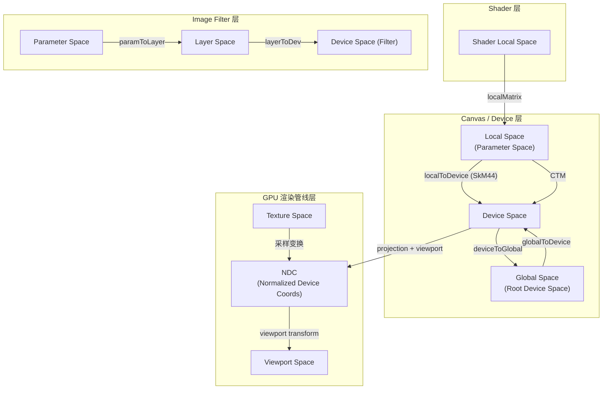
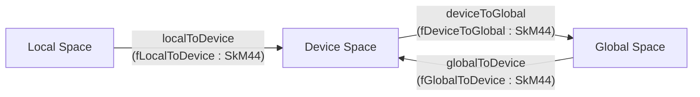
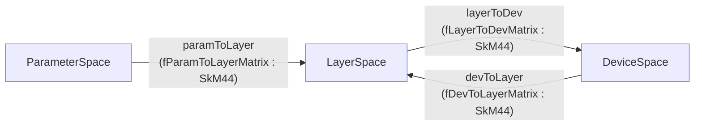
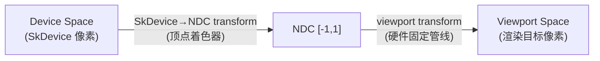
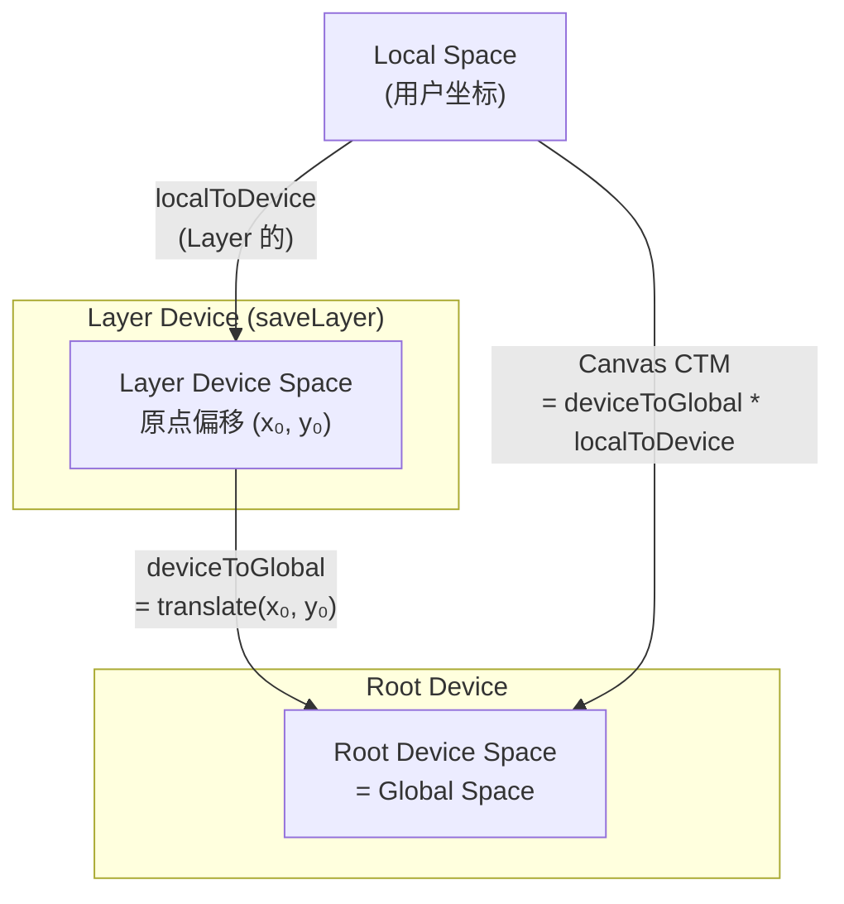
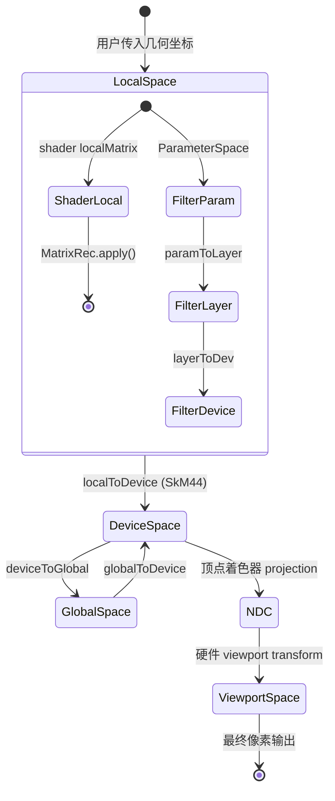

# Skia 坐标空间体系

> 本文档系统梳理 Skia 中以 `localToDevice` 为核心的完整坐标空间架构。
> 涵盖 Canvas/Device 层、Shader 层、Image Filter 层、GPU 渲染管线层四个维度。

---

## 总览图



---

## 3. Canvas/Device 层：三大核心空间

### 3.1 Local Space（本地空间 / Parameter Space）

| 属性 | 说明 |
|------|------|
| **定义** | 用户调用 `canvas->drawRect(rect)` 时，`rect` 坐标所处的坐标系 |
| **何时出现** | 每次 draw/clip 调用传入的几何坐标都处于此空间 |
| **特征** | 用户直接操作的空间；受 `concat()` / `translate()` 等变换影响后映射到 Device Space |

用户通过 `canvas->concat(matrix)` 改变的正是 Local → Device 的映射关系。

---

### 3.2 Device Space（设备空间）

| 属性 | 说明 |
|------|------|
| **定义** | 当前 SkDevice 的像素坐标系 |
| **何时出现** | 经过 `localToDevice` 变换后的坐标所在空间 |
| **特征** | 每个 SkDevice 都有自己独立的设备空间 |

**子分类：**

| 子类型 | 说明 |
|--------|------|
| Root Device Space | 根设备（最终输出表面）的像素坐标，等同于 Global Space |
| Layer Device Space | `saveLayer` 创建的临时设备的像素坐标，原点可能偏移 |

---

### 3.3 Global Space（全局空间 / Canvas Space）

| 属性 | 说明 |
|------|------|
| **定义** | 根 Canvas 的坐标系，等同于 Root Device Space |
| **何时出现** | 当存在多个 Device（因 `saveLayer`）时，需要统一参考坐标系 |
| **特征** | 对根设备 Global = Device；对 Layer 设备 Global ≠ Device |

---

### 3.4 三者的变换关系



**核心公式（源码注释 `src/core/SkDevice.h:555`）：**

```
deviceToGlobal * localToDevice = Canvas CTM (全局 CTM)
```

即：Canvas 的 CTM 等于先做 localToDevice（得到 Device Space），再做 deviceToGlobal（得到 Global Space）。

**为什么需要三个空间：**

当 `saveLayer` 创建新 Device 时，该 Device 的像素坐标原点可能相对根设备产生偏移。此时：
- `localToDevice` 只映射到当前设备的局部像素空间
- `deviceToGlobal` 补偿该偏移，将局部像素坐标映射回根设备空间
- 两者组合才等于用户看到的完整 CTM

---

## 4. Shader 层：着色器坐标空间

### 4.1 Shader Local Space（着色器本地空间）

| 属性 | 说明 |
|------|------|
| **定义** | 着色器内部求值使用的坐标系 |
| **何时出现** | 通过 `SkShader::makeWithLocalMatrix()` 或 paint 设置 shader 时 |
| **使用方式** | localMatrix 在 CTM 之前应用，用于控制 shader 的平铺/缩放/旋转 |

### 4.2 MatrixRec — CTM 与 Shader 的关系

`SkShaders::MatrixRec`（定义于 `src/shaders/SkShaderBase.h:57`）负责追踪从 shader 空间到 device 空间的完整变换链。


**关键字段与方法：**

| 字段/方法 | 含义 |
|-----------|------|
| `fCTM` | Canvas 的当前变换矩阵 |
| `fTotalLocalMatrix` | 所有 localMatrix 的累积（含已应用的） |
| `fPendingLocalMatrix` | 尚未应用到管线的 localMatrix |
| `fCTMApplied` | 标记 CTM 是否已应用，避免重复变换 |
| `totalMatrix()` | 返回 `fCTM * fTotalLocalMatrix`，即 shader 空间 → device 空间的完整矩阵 |
| `hasPendingMatrix()` | 是否还有未应用的变换 |

**工作流程：**
1. 从根 shader 开始，MatrixRec 初始化为 CTM
2. 遍历 shader 树时，每遇到 localMatrix 就 `concat()` 进去
3. 叶子 shader 调用 `apply()` 将 pending matrix 的逆注入 raster pipeline
4. 标记 `fCTMApplied = true` 防止重复注入

---

## 5. Image Filter 层：滤镜坐标空间

### 5.1 ParameterSpace（参数空间）

| 属性 | 说明 |
|------|------|
| **定义** | 与 Canvas 的 Local Space 相同 |
| **何时出现** | `SkImageFilter::Make*()` 的参数值（如 blur 的 sigma）定义于此空间 |
| **实现** | `skif::ParameterSpace<T>` 模板类（`src/core/SkImageFilterTypes.h:108`） |

### 5.2 LayerSpace（滤镜层空间）

| 属性 | 说明 |
|------|------|
| **定义** | 整个滤镜 DAG 共享的运算空间 |
| **何时出现** | 滤镜内部处理、中间结果计算 |
| **特征** | 所有滤镜节点在同一 LayerSpace 协作；可能相对于 Device Space 有额外变换 |
| **实现** | `skif::LayerSpace<T>` 模板类（`src/core/SkImageFilterTypes.h:151`） |

### 5.3 DeviceSpace（设备空间）

| 属性 | 说明 |
|------|------|
| **定义** | 根设备的最终像素坐标 |
| **何时出现** | 滤镜最终输出目标 |
| **实现** | `skif::DeviceSpace<T>` 模板类（`src/core/SkImageFilterTypes.h:127`） |

### 5.4 Mapping 对象

`skif::Mapping`（`src/core/SkImageFilterTypes.h:564`）负责三种空间之间的类型安全转换：



**CTM 分解策略（`MatrixCapability`）：**

| 级别 | 含义 |
|------|------|
| `kTranslate` | 滤镜仅支持平移，其余放入 layerToDev |
| `kScaleTranslate` | 滤镜支持缩放+平移 |
| `kComplex` | 滤镜能处理任意仿射/透视 |

---

## 6. GPU 层：渲染管线坐标空间

### 6.1 Texture Space（纹理空间）

| 属性 | 说明 |
|------|------|
| **定义** | 纹理图像内部的坐标系 |
| **何时出现** | 纹理采样时 |
| **特征** | 原点由 `GrSurfaceOrigin` 控制（`include/gpu/ganesh/GrTypes.h:76`） |

| 枚举值 | 含义 |
|--------|------|
| `kTopLeft_GrSurfaceOrigin` | (0,0) 在左上角（OpenGL 需翻转） |
| `kBottomLeft_GrSurfaceOrigin` | (0,0) 在左下角（OpenGL 原生） |

### 6.2 NDC（Normalized Device Coordinates，归一化设备坐标）

| 属性 | 说明 |
|------|------|
| **定义** | GPU 光栅化使用的归一化坐标，通常 [-1, 1] 范围 |
| **何时出现** | 顶点着色器输出 / 光栅化阶段 |
| **Y 轴方向** | 由 `Caps::ndcYAxisPointsDown()` 决定（`src/gpu/graphite/Caps.h:265`） |

| Backend | NDC Y 轴方向 | 说明 |
|---------|-------------|------|
| Vulkan | 向下 ↓ | `fNDCYAxisPointsDown = true` |
| Metal / D3D / WebGPU | 向上 ↑ | 需要翻转以匹配 Skia 约定 |
| OpenGL | 向上 ↑ | (-1,-1) 在左下 |

### 6.3 Viewport Space（视口空间）

| 属性 | 说明 |
|------|------|
| **定义** | 由 viewport 设置定义的像素坐标 |
| **何时出现** | NDC → 最终像素位置的变换 |
| **实现** | viewport 矩阵将 NDC 映射到实际渲染目标像素（`src/gpu/graphite/ContextUtils.h:49-52`） |



---

## 7. 变换矩阵类型

| 类型 | 维度 | 存储方式 | 适用场景 | 头文件 |
|------|------|----------|----------|--------|
| `SkMatrix` | 3×3 | 行主序 | 2D 仿射/透视变换 | `include/core/SkMatrix.h` |
| `SkM44` | 4×4 | 列主序 | 3D 变换，现代主力 | `include/core/SkM44.h` |

**类型转换：**

| 方向 | 方法 | 说明 |
|------|------|------|
| SkM44 → SkMatrix | `SkM44::asM33()` | 丢弃 Z 行列，降维 |
| SkMatrix → SkM44 | `SkM44(SkMatrix)` | Z 轴设为恒等 |

**Skia 内部同时维护两种缓存（`src/core/SkDevice.h:544-551`）：**
```cpp
SkM44    fLocalToDevice;      // 4x4 主矩阵
SkMatrix fLocalToDevice33;    // 3x3 缓存，避免每次转换
```

---

## 8. localToDevice 接口详解

### 8.1 SkDevice — 核心持有者

> 源码: `src/core/SkDevice.h` (L173-216, L544-560)

**成员变量：**

| 成员 | 类型 | 含义 |
|------|------|------|
| `fLocalToDevice` | `SkM44` | Local → Device 的 4×4 变换 |
| `fLocalToDevice33` | `SkMatrix` | 上述的 3×3 缓存 |
| `fDeviceToGlobal` | `SkM44` | Device → Global 变换 |
| `fGlobalToDevice` | `SkM44` | Global → Device 变换（与上者互逆） |
| `fLocalToDeviceDirty` | `bool` | 脏标记，子类可延迟计算 |

**读接口：**

| 方法 | 返回类型 | 说明 |
|------|----------|------|
| `localToDevice44()` | `const SkM44&` | 4×4 完整变换 |
| `localToDevice()` | `const SkMatrix&` | 3×3 缓存版本 |
| `deviceToGlobal()` | `const SkM44&` | Device → Global |
| `globalToDevice()` | `const SkM44&` | Global → Device |
| `getRelativeTransform(const SkDevice&)` | `SkM44` | 当前设备 → 目标设备的变换 |

**写接口：**

| 方法 | 说明 |
|------|------|
| `setLocalToDevice(const SkM44&)` | 直接设置 Local→Device，更新缓存和脏标记 |
| `setGlobalCTM(const SkM44& ctm)` | 从全局 CTM 反推 Local→Device |

---

### 8.2 SkCanvas — 用户侧接口

> 源码: `include/core/SkCanvas.h` (L2264-2288)

| 方法 | 说明 |
|------|------|
| `getLocalToDevice()` | 返回 `SkM44`，当前 Local → Device |
| `getLocalToDeviceAs3x3()` | 返回 `SkMatrix`，丢弃 Z 信息 |
| `concat(const SkM44&)` | 前乘变换：`localToDevice = localToDevice * m` |
| `setMatrix(const SkM44&)` | 设置全局 CTM（内部调用 `setGlobalCTM`） |
| `translate(dx, dy)` | 前乘平移 |
| `scale(sx, sy)` | 前乘缩放 |
| `rotate(degrees)` | 前乘旋转 |
| `save()` / `restore()` | 通过 MCRec 栈保存/恢复变换状态 |

---

### 8.3 setGlobalCTM 实现

> 源码: `src/core/SkDevice.cpp` (L76-83)

```cpp
void SkDevice::setGlobalCTM(const SkM44& ctm) {
    fLocalToDevice = ctm;
    fLocalToDevice.normalizePerspective();
    // Map from the global CTM state to this device's coordinate system.
    fLocalToDevice.postConcat(fGlobalToDevice);
    fLocalToDevice33 = fLocalToDevice.asM33();
    fLocalToDeviceDirty = true;
}
```

**解读：**
```
localToDevice = ctm.postConcat(globalToDevice)
             = globalToDevice * ctm
```

即：全局 CTM 右乘 `globalToDevice`，得到当前设备的本地变换。
这确保了 `deviceToGlobal * localToDevice = ctm` 的恒等关系成立。

---

## 9. Layer/SaveLayer 与多设备空间

### 9.1 saveLayer 创建新设备

当调用 `canvas->saveLayer()` 时：
1. 创建新的 SkDevice，分配独立的绘制表面
2. 新设备建立自己的 Device Space（原点在 layer bounds 的左上角）
3. `fDeviceToGlobal` 记录新设备原点相对于根设备的偏移

### 9.2 空间关系图



### 9.3 restore 合成流程

当 `canvas->restore()` 时：
1. 通过 `getRelativeTransform(parentDevice)` 计算 Layer Device → Parent Device 的变换
2. 将 Layer 内容按此变换绘制到父设备
3. 应用 saveLayer 指定的 paint（alpha、blend mode、image filter 等）

```cpp
// getRelativeTransform 实现核心逻辑:
// result = dstDevice.globalToDevice * srcDevice.deviceToGlobal
```

---

## 10. 典型使用场景

| 场景 | 涉及的空间 | 使用的变换 |
|------|-----------|-----------|
| `canvas->drawRect()` | Local → Device | `localToDevice` |
| `canvas->clipPath()` | Local → Device | clip 存储时记录当前 `localToDevice` |
| `saveLayer()` | Device ↔ Global | `deviceToGlobal` / `globalToDevice` |
| Shader 求值 | Shader Local → Device | `MatrixRec` (localMatrix + CTM) |
| Image Filter | Parameter → Layer → Device | `skif::Mapping` 对象 |
| GPU 光栅化 | Device → NDC → Viewport | viewport + projection |
| 命中测试/逆变换 | Device → Local | `localToDevice.invert()` |
| Layer 合成 | Layer Device → Parent Device | `getRelativeTransform()` |

---

## 11. 常用矩阵操作速查

| 操作 | 方法 | 含义 |
|------|------|------|
| 变换点 | `mapPoint()`, `mapRect()` | Local → Device 方向 |
| 求逆 | `invert()` | Device → Local 方向 |
| 前乘 | `preConcat(m)` | `result = this * m`（先应用 m） |
| 后乘 | `postConcat(m)` | `result = m * this`（后应用 m） |
| 判断恒等 | `isIdentity()` | 无变换 |
| 判断轴对齐 | `preservesAxisAlignment()` (SkMatrix) | 仅平移/缩放/90°旋转 |
| 维度转换 | `asM33()` / `SkM44(SkMatrix)` | 4×4 ↔ 3×3 |
| 像素对齐检测 | `isPixelAlignedToGlobal()` | deviceToGlobal 是否为整数平移 |
| 透视归一化 | `normalizePerspective()` | 确保透视分量规范化 |

---

## 附录 A: 完整变换链状态机



---

## 附录 B: 关键源文件索引

| 文件 | 角色 |
|------|------|
| `src/core/SkDevice.h` (L173-216, L544-560) | localToDevice 定义与接口 |
| `src/core/SkDevice.cpp` (L76-83) | `setGlobalCTM` 实现 |
| `include/core/SkCanvas.h` (L2264-2288) | Canvas 变换用户接口 |
| `src/core/SkCanvas.cpp` | `concat` / `setMatrix` 实现 |
| `include/core/SkM44.h` | 4×4 矩阵类 |
| `include/core/SkMatrix.h` | 3×3 矩阵类 |
| `src/core/SkImageFilterTypes.h` (L84-151, L564) | ParameterSpace / LayerSpace / DeviceSpace / Mapping |
| `include/core/SkShader.h` | `makeWithLocalMatrix` 接口 |
| `src/shaders/SkLocalMatrixShader.h` | shader localMatrix 实现 |
| `src/shaders/SkShaderBase.h` (L37-158) | `MatrixRec` — shader CTM 跟踪 |
| `include/gpu/ganesh/GrTypes.h` (L76) | `GrSurfaceOrigin` / Texture Space |
| `src/gpu/graphite/Caps.h` (L253-265) | `ndcYAxisPointsDown()` / NDC 方向 |
| `src/gpu/graphite/ContextUtils.h` (L49-52) | NDC / Viewport 变换说明 |
