# Clip Mask 消费管线参考

> 本文档聚焦: ClipStack 生成 SW mask / stencil mask 之后，这些 mask 如何被管线消费使用。
> **不包含** mask 生成过程 (render_sw_mask / StencilMaskHelper 内部逻辑)。
>
> 涉及源码:
> - `src/gpu/ganesh/GrAppliedClip.h` (167行)
> - `src/gpu/ganesh/GrPipeline.cpp` (146行) / `GrPipeline.h` (257行)
> - `src/gpu/ganesh/GrProgramInfo.cpp` (97行) / `GrProgramInfo.h`
> - `src/gpu/ganesh/GrStencilSettings.cpp` (291行) / `GrStencilSettings.h`
> - `src/gpu/ganesh/GrUserStencilSettings.h` (261行)
> - `src/gpu/ganesh/GrOpsRenderPass.cpp` (343行)
> - `src/gpu/ganesh/glsl/GrGLSLProgramBuilder.cpp`
> - `src/gpu/ganesh/GrXferProcessor.cpp`
> - `src/gpu/ganesh/gl/GrGLGpu.cpp`

---

## 类型速查

### 1. 裁剪输出

| 类型 | 含义 |
|------|------|
| `GrAppliedClip` | 裁剪结果容器: hardClip (stencil/scissor) + coverageFP (SW mask) |
| `GrAppliedHardClip` | 硬件裁剪子集: scissor + window rects + stencilStackID |
| `GrDstSampleFlags` | 目标采样标志 (kNone / kAsInputAttachment / kRequiresTextureBarrier) |

### 2. 管线

| 类型 | 含义 |
|------|------|
| `GrPipeline` | GPU 渲染管线: XP + FPs + flags + 硬件状态 |
| `GrPipeline::InputFlags` | 外部输入标志 (kConservativeRaster / kWireframe / kSnapVertices) |
| `GrPipeline::Flags` | 内部标志 (kHasStencilClip / kScissorTestEnabled) |
| `GrProgramInfo` | 描述一次 draw 所需全部状态 (pipeline + stencil + geomProc) |
| `GrProcessorSet` | 持有 color FP + coverage FP + XP 的容器 |

### 3. Stencil

| 类型 | 含义 |
|------|------|
| `GrUserStencilSettings` | 编译期常量: 抽象 stencil 操作 (独立于 clip 状态) |
| `GrStencilSettings` | 运行时: 解析后的硬件 stencil 设置 (包含 clip bit) |
| `GrStencilSettings::Face` | 单面硬件 stencil 参数 (ref/test/testMask/passOp/failOp/writeMask) |
| `GrStencilTest` | 硬件测试枚举: Always / Never / Greater / GEqual / Less / LEqual / Equal / NotEqual |
| `GrStencilOp` | 硬件操作枚举: Keep / Zero / Replace / Invert / IncWrap / DecWrap / IncClamp / DecClamp |
| `GrUserStencilTest` | 抽象测试: kAlwaysIfInClip / kEqualIfInClip / kLessIfInClip / ... |
| `GrUserStencilOp` | 抽象操作: kKeep / kZero / ... / kZeroClipBit / kSetClipBit / kInvertClipBit |

### 4. Fragment Processor

| 类型 | 含义 |
|------|------|
| `GrFragmentProcessor` | Fragment Processor 基类 (shader 中的可组合变换单元) |
| `GrTextureEffect` | 纹理采样 FP (SW mask 的直接消费者) |
| `GrBlendFragmentProcessor` | 混合两个 FP 的结果 (此处用 kDstIn 合并 coverage) |
| `GrXferProcessor` | 最终混合器: 将 color + coverage 与 framebuffer dst 合并 |

### 5. GPU 执行

| 类型 | 含义 |
|------|------|
| `GrOpsRenderPass` | 渲染 pass 抽象: bindPipeline → setScissor → draw |
| `GrGLSLProgramBuilder` | Shader 程序构建器: 遍历 FP 数组生成 GLSL |
| `GrGLSLProgramDataManager` | Uniform 数据管理器 |
| `GrGLGpu` | OpenGL 后端 GPU 实现 |

---

## 架构位置

### Clip Mask 消费在 Skia 渲染管线中的位置

| 项目 | 说明 |
|------|------|
| 起点 | `ClipStack::apply()` 输出 `GrAppliedClip` (含 coverageFP 和/或 stencilStackID) |
| 转接 | `GrPipeline` 构造: 提取 FP 到数组、设置 kHasStencilClip flag |
| 解析 | `GrProgramInfo::nonGLStencilSettings()` / GL 后端 `flushGLState()`: 解析 clip bit |
| 终点 | GPU 硬件执行: shader coverage modulation + stencil test |

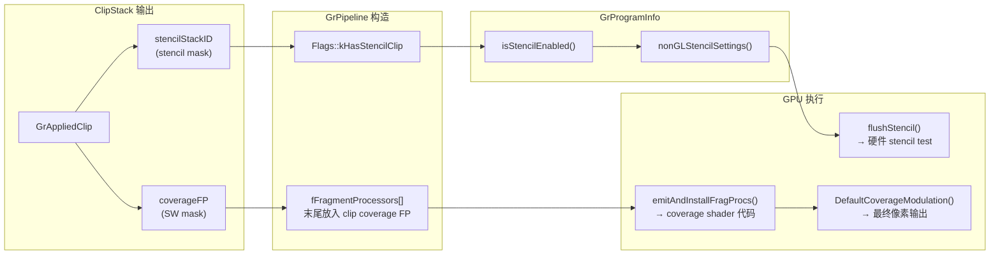

---

## 两条并行消费路径总览

ClipStack 生成的 mask 通过两条完全不同的机制被消费:

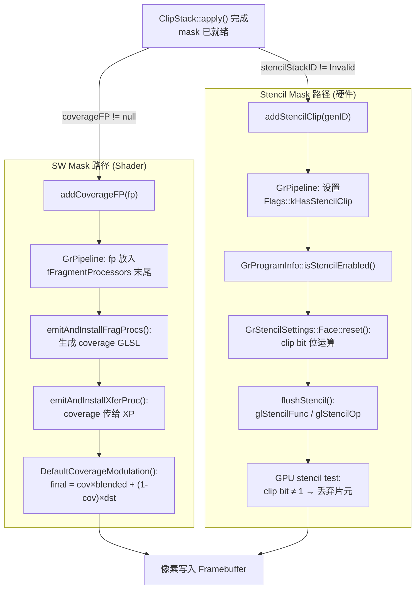

**核心区别**: SW mask 通过 shader 中的 alpha 乘法实现连续衰减 (0.0~1.0)；stencil mask 通过硬件固定功能做二值 pass/fail 判定。两者可同时作用于同一 draw。

---

## 1. GrAppliedClip — 载体

ClipStack 将生成的 mask 信息写入 `GrAppliedClip`，作为后续管线的唯一消费接口。

### 1.1 `addCoverageFP()` — SW mask FP 注入 (line 131-138)

```cpp
void addCoverageFP(std::unique_ptr<GrFragmentProcessor> fp) {
    if (fCoverageFP == nullptr) {
        fCoverageFP = std::move(fp);
    } else {
        // 多个 coverage FP 通过 Compose 级联
        fCoverageFP = GrFragmentProcessor::Compose(std::move(fp), std::move(fCoverageFP));
    }
}
```

ClipStack 在 `apply()` 末尾 (ClipStack.cpp:1548) 调用:
```cpp
out->addCoverageFP(std::move(clipFP));
```

`clipFP` 可能包含:
- analytic FP (凸多边形/圆角矩形解析裁剪)
- atlas FP (GrModulateAtlasCoverageEffect)
- SW mask FP (GrTextureEffect + GrBlendFP<kDstIn>)
- 以上多个通过 `Compose` / `Make<kDstIn>` 级联的组合

---

### 1.2 `addStencilClip()` — stencil ID 注入 (line 76-79)

```cpp
void addStencilClip(uint32_t stencilStackID) {
    SkASSERT(SK_InvalidGenID == fStencilStackID);
    fStencilStackID = stencilStackID;
}
```

设置后 `hasStencilClip()` 返回 true (line 51):
```cpp
bool hasStencilClip() const { return SK_InvalidGenID != fStencilStackID; }
```

---

### 1.3 两种注入机制的本质区别

| 维度 | `addCoverageFP()` | `addStencilClip()` |
|------|------|------|
| **存储** | `std::unique_ptr<GrFragmentProcessor>` | `uint32_t stencilStackID` |
| **信息量** | 完整 shader 子树 (可含纹理引用) | 一个 ID (引用 stencil buffer 中已有内容) |
| **精度** | 连续 0.0~1.0 (8-bit alpha) | 二值 pass/fail (1 clip bit) |
| **累积方式** | `GrFragmentProcessor::Compose()` 级联 | 只能设置一次 (单 ID) |
| **下游消费** | 进入 `GrPipeline::fFragmentProcessors[]` | 设置 `GrPipeline::Flags::kHasStencilClip` |
| **执行层** | 可编程管线 (fragment shader) | 固定功能管线 (stencil test 硬件) |

---

## 2. GrPipeline — 转接层

`GrPipeline` 从 `GrAppliedClip` 中提取两种 mask 信息，分别存储为 FP 数组元素和 flag。

### 2.1 Coverage FP 进入 `fFragmentProcessors[]` (GrPipeline.cpp line 41-62)

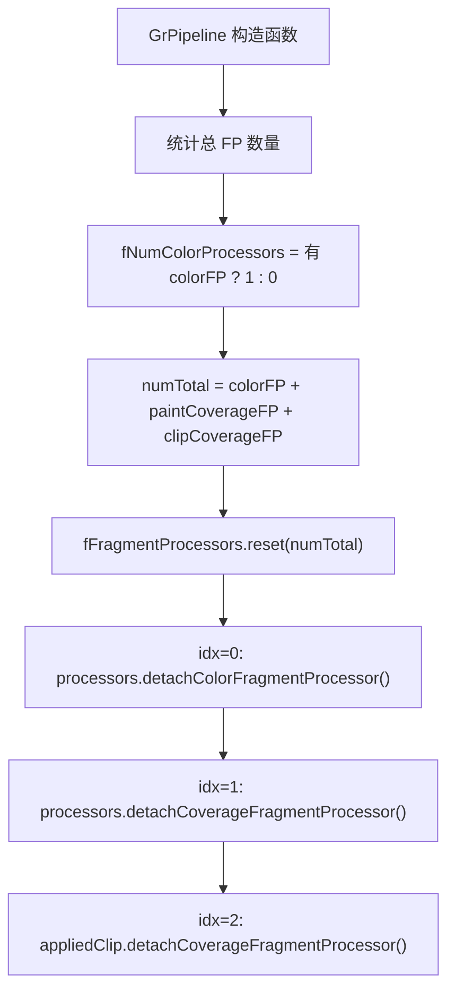

关键: clip coverage FP **始终排在数组末尾**，确保最后执行。

---

### 2.2 `kHasStencilClip` flag 设置 (GrPipeline.cpp line 31-33)

```cpp
if (hardClip.hasStencilClip()) {
    fFlags |= Flags::kHasStencilClip;
}
```

这是一个 1-bit flag (GrPipeline.h line 225):
```cpp
enum class Flags : uint8_t {
    kHasStencilClip = (kLastInputFlag << 1),    // = 0x10
    kScissorTestEnabled = (kLastInputFlag << 2), // = 0x20
};
```

后续通过 `pipeline.hasStencilClip()` (GrPipeline.h line 189-191) 查询。

---

### 2.3 FP 数组布局

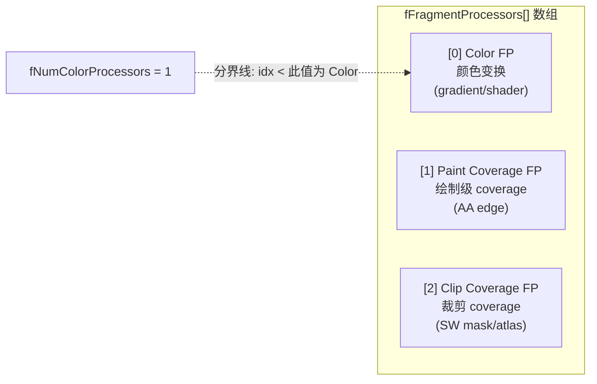

**分区规则** (GrPipeline.h line 114-117, 233-244):

| 索引范围 | 类型 | 来源 | Shader 输出目标 |
|------|------|------|------|
| `[0, fNumColorProcessors)` | Color FP | `GrProcessorSet` | `color` 变量 |
| `[fNumColorProcessors, end)` | Coverage FP | `GrProcessorSet` + `GrAppliedClip` | `coverage` 变量 |

```cpp
bool isColorFragmentProcessor(int idx) const { return idx < fNumColorProcessors; }
bool isCoverageFragmentProcessor(int idx) const { return idx >= fNumColorProcessors; }
```

---

## 3. SW Mask 消费 — Shader 路径

SW mask 的本质是一张 **Alpha_8 纹理** (每像素 8-bit，表示该像素在 clip 内的程度 0~255)。这张纹理的消费方式是：在 fragment shader 中对它做纹理采样，采样得到的 alpha 值作为 clip coverage，最终通过 `final = coverage × blendedColor + (1-coverage) × dstColor` 公式控制像素输出。

**没有独立于 shader 的 "mask 使用" 机制** — mask 纹理的消费完全内嵌在 fragment shader 的 coverage 计算中。FP (Fragment Processor) 就是 Skia 对 "shader 中一段纹理采样+计算代码" 的抽象封装。

### 3.1 `emitAndInstallFragProcs()` — color vs coverage 分流 (GrGLSLProgramBuilder.cpp line 135-151)

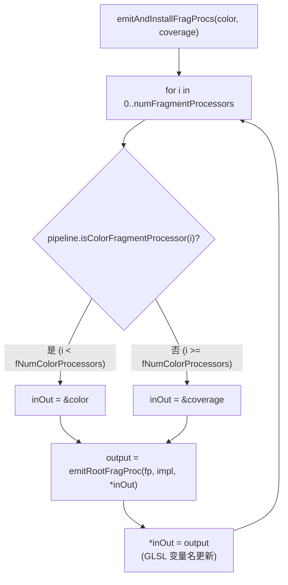

对于 clip coverage FP (数组中最后一个，索引 >= fNumColorProcessors):
- 输入: 之前 paint coverage FP 的输出 (如 AA edge coverage)
- 输出: 更新后的 `coverage` GLSL 变量

---

### 3.2 GrTextureEffect — mask 纹理的逐像素采样

这是 SW mask 被实际"使用"的地方。对于每一个光栅化的片元 (pixel)，shader 执行以下操作:

1. **坐标变换**: 将片元的 device 坐标 (屏幕像素位置) 转换为 mask 纹理坐标
2. **纹理采样**: 从 Alpha_8 mask 纹理中读取该位置的 alpha 值 (0~255 → 0.0~1.0)
3. **输出**: 这个 alpha 值就是该片元的 clip coverage

**直观理解**: mask 纹理中白色 (255) 的像素 = clip 内，黑色 (0) = clip 外，灰色 = 边缘过渡。shader 逐像素读取这张"裁剪遮罩图"来决定每个像素被裁剪多少。

ClipStack 创建 GrTextureEffect 时的配置 (ClipStack.cpp line 1683-1695):

| 参数 | 值 | 含义 |
|------|------|------|
| WrapMode | `kClampToBorder` | mask 边界外返回 0 (完全被裁剪) |
| Filter | `kNearest` | 逐像素精确采样 (mask 与屏幕像素 1:1 对应) |
| matrix | `Translate(-maskBounds.fLeft, -maskBounds.fTop)` | device 坐标 → mask 纹理坐标 |
| subset/domain | mask 有效区域 | 防止越界采样产生伪影 |

生成的 GLSL 代码 (概念性):
```glsl
// 每个片元执行:
// 1. 将当前片元的 device 坐标转换为 mask 纹理坐标
float2 maskCoord = deviceCoord - float2(maskBounds.left, maskBounds.top);
// 2. 从 mask 纹理采样 → 得到该像素的 clip coverage (0.0 = 裁掉, 1.0 = 保留)
half maskAlpha = sample(u_maskTexture, maskCoord).r;
// 3. maskAlpha 就是这个像素"在 clip 内的程度"
```

**关键**: `GrTextureEffect` 是 Skia 对上述 "坐标变换 + 纹理采样" 的封装。它不是一个抽象概念，而是会被编译成真实的 GPU shader 纹理采样指令 (`texture()` / `texelFetch()`)。

---

### 3.3 GrBlendFP<kDstIn> — coverage 乘法 (ClipStack.cpp line 1698)

```cpp
fp = GrBlendFragmentProcessor::Make<SkBlendMode::kDstIn>(std::move(fp), std::move(clipFP));
```

`kDstIn` 语义: `result = dst.a * src`，此处:
- `src` = 之前的 clipFP (analytic / atlas 等)
- `dst` = 新的 SW mask FP

效果: `output_coverage = mask_alpha × previous_coverage`

---

### 3.4 XferProcessor `DefaultCoverageModulation()` — 最终公式 (GrXferProcessor.cpp line 194-217)

```cpp
void DefaultCoverageModulation(GrGLSLXPFragmentBuilder* fragBuilder,
                               const char* srcCoverage,
                               const char* dstColor,
                               const char* outColor,
                               const char* outColorSecondary,
                               const GrXferProcessor& proc) {
    if (srcCoverage) {
        fragBuilder->codeAppendf("%s = %s * %s + (half4(1.0) - %s) * %s;",
                                 outColor,       // 最终输出
                                 srcCoverage,    // coverage (来自 FP chain)
                                 outColor,       // blended color (src op dst)
                                 srcCoverage,    // 1 - coverage
                                 dstColor);      // framebuffer dst
    }
}
```

**最终公式:**

```
final = coverage × blendedColor + (1 - coverage) × dstColor
```

| coverage 值 | 效果 |
|------|------|
| 1.0 | 完全绘制 blendedColor (clip 内) |
| 0.0 | 完全保留 dstColor (clip 外) |
| 0.5 | 50% 混合 (边缘抗锯齿过渡) |

对于 LCD 文本 (sub-pixel AA)，还有 per-channel 处理 (line 201-205):
```cpp
fragBuilder->codeAppendf("half3 lerpRGB = mix(%s.aaa, %s.aaa, %s.rgb);",
                         dstColor, outColor, srcCoverage);
```

---

### 3.5 完整 GPU Shader 数据流

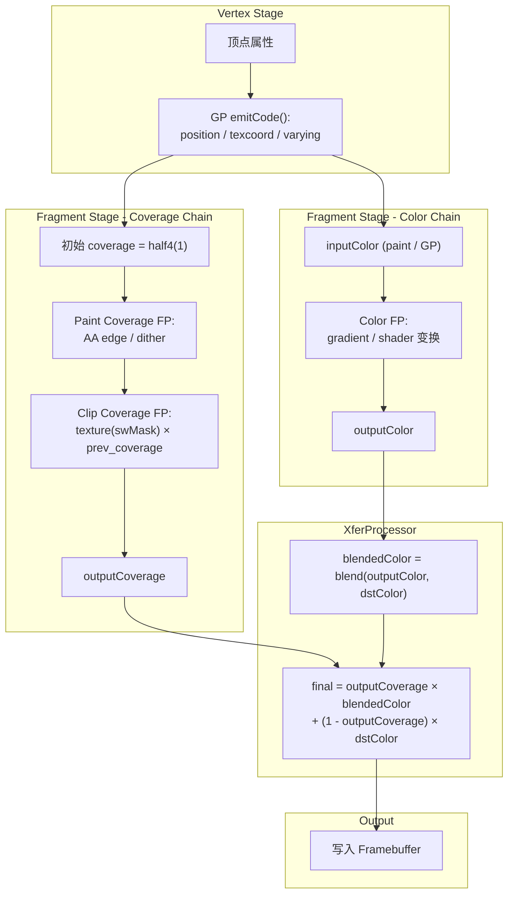

**关键观察:**
- Coverage chain 中 clip FP 在最后，与 paint coverage 相乘: `final_cov = aa_edge × clip_mask`
- 多个 clip FP 通过 `GrFragmentProcessor::Compose()` 级联 (GrAppliedClip.h line 131-137)
- `emitAndInstallXferProc()` 将 coverage 变量名传给 XP (GrGLSLProgramBuilder.cpp line 435):
  ```cpp
  coverageIn.size() ? coverageIn.c_str() : "float4(1)"
  ```

---

## 4. Stencil Mask 消费 — 硬件路径

Stencil mask 已经渲染在 stencil buffer 中 (clip bit = 1 表示"在 clip 内")。消费阶段通过设置 stencil test 参数让硬件自动丢弃 clip 外的像素。

### 4.1 `GrProgramInfo::nonGLStencilSettings()` — clip bit 解析入口 (GrProgramInfo.cpp line 57-65)

```cpp
GrStencilSettings GrProgramInfo::nonGLStencilSettings() const {
    GrStencilSettings stencil;
    if (this->isStencilEnabled()) {
        stencil.reset(*fUserStencilSettings, this->pipeline().hasStencilClip(), 8);
    }
    return stencil;
}
```

`isStencilEnabled()` (GrProgramInfo.h line 40-43):
```cpp
bool isStencilEnabled() const {
    return fUserStencilSettings != &GrUserStencilSettings::kUnused ||
           fPipeline->hasStencilClip();
}
```

**含义**: 即使 Op 不使用用户 stencil (kUnused)，只要 pipeline 有 stencil clip，就必须启用 stencil test。

---

### 4.2 `GrStencilSettings::Face::reset()` — clip bit 位运算 (GrStencilSettings.cpp line 174-218)

这是 stencil mask 消费的核心: 将抽象的 `GrUserStencilSettings` 转换为包含 clip bit 测试的硬件参数。

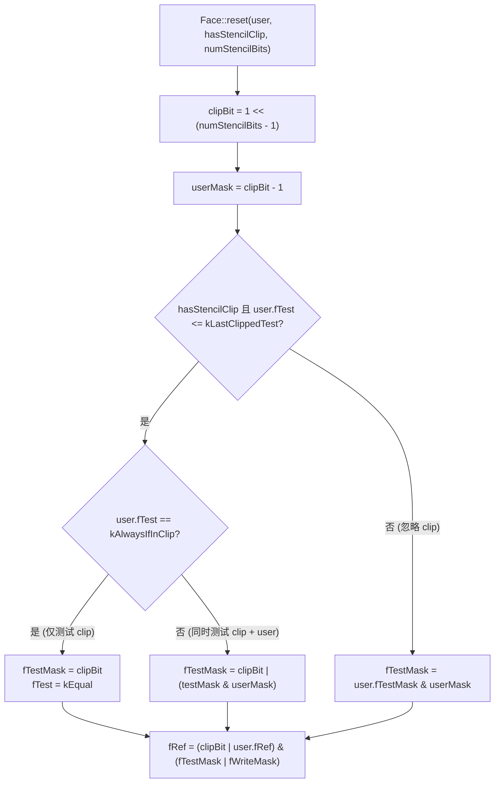

**解读 `kAlwaysIfInClip` (最常见情况):**

当 Op 使用默认 stencil (kAlwaysIfInClip) 且有 stencil clip 时:
- `fTest = kEqual` — 比较 stencil buffer 与 ref
- `fTestMask = clipBit` — 仅检查最高位
- `fRef = clipBit` — ref 值中 clip bit = 1

效果: `(stencil_buffer & clipBit) == (ref & clipBit)` → 仅 clip bit = 1 的像素通过

---

### 4.3 Stencil Buffer 位布局

```
N-bit stencil buffer (通常 N=8):

bit:  [7]    [6] [5] [4] [3] [2] [1] [0]
       ↑      ↑───────────────────────────↑
    clip bit            user bits (7 bits)

clipBit  = 1 << (N-1) = 0x80
userMask = clipBit - 1 = 0x7F
```

| 位域 | 含义 | 由谁写入 |
|------|------|------|
| bit[N-1] (clip bit) | 像素是否在 clip 内 (1=内, 0=外) | StencilMaskHelper (mask 生成阶段) |
| bit[0..N-2] (user bits) | 临时计算空间 | Op 自己的 stencil 逻辑 (如 path rendering) |

---

### 4.4 `GrUserStencilSettings` 双索引数组 — `fCWFlags[hasStencilClip]`

`GrUserStencilSettings` 的编译期构造 (GrUserStencilSettings.h line 156-163):
```cpp
constexpr explicit GrUserStencilSettings(...)
    : fCWFlags{(uint16_t)(Attrs::Flags(false) | kSingleSided_StencilFlag),   // [0] 无 clip
               (uint16_t)(Attrs::Flags(true) | kSingleSided_StencilFlag)}    // [1] 有 clip
    , ...
```

运行时通过 `hasStencilClip` 索引选择正确的 flags (GrUserStencilSettings.h line 189-191):
```cpp
uint16_t flags(bool hasStencilClip) const {
    return fCWFlags[hasStencilClip] & fCCWFlags[hasStencilClip];
}
```

**关键语义**: 同一个 `GrUserStencilSettings` 在有/无 stencil clip 时行为不同:
- `kAlwaysIfInClip` + 无 clip → `IsDisabled = true` (不需要 stencil test)
- `kAlwaysIfInClip` + 有 clip → `IsDisabled = false` (需要测试 clip bit)

这就是 `GrStencilSettings::reset()` (line 30-57) 中 `user.fCWFlags[hasStencilClip]` 选择的含义:
```cpp
uint16_t cwFlags = user.fCWFlags[hasStencilClip];
if (cwFlags & kSingleSided_StencilFlag) {
    fFlags = cwFlags;
    if (!this->isDisabled()) {
        fCWFace.reset(user.fCWFace, hasStencilClip, numStencilBits);
    }
}
```

---

### 4.5 GL 后端 `flushStencil()` — 硬件指令 (GrGLGpu.cpp line 2692-2723)

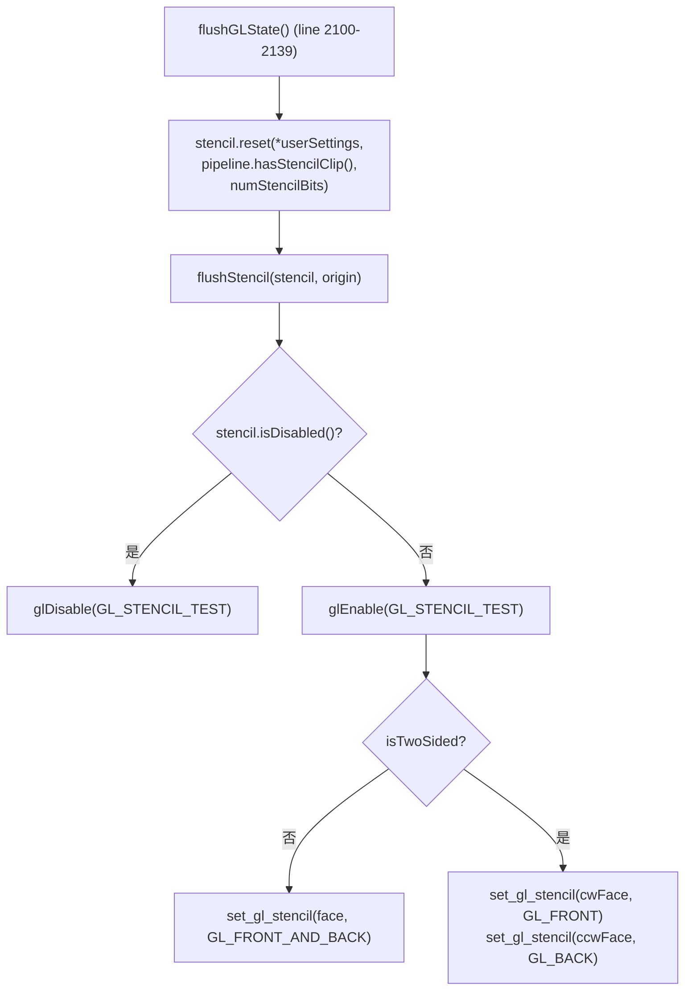

`set_gl_stencil()` 调用 (推断自标准 GL API):
```
glStencilFuncSeparate(face, test, ref, testMask)
glStencilOpSeparate(face, sfail, dpfail, dppass)
glStencilMaskSeparate(face, writeMask)
```

对于典型的 `kAlwaysIfInClip` + hasStencilClip = true + 8-bit stencil:
- `test = GL_EQUAL`
- `ref = 0x80` (clip bit = 1)
- `testMask = 0x80` (只检查 clip bit)
- GPU 硬件: 对每个光栅化片元检查 `(stencil[x,y] & 0x80) == (0x80 & 0x80)` → clip bit 为 1 才通过

---

## 5. 两条路径的对比与协作

### 对比表

| 维度 | SW Mask (Shader 路径) | Stencil Mask (硬件路径) |
|------|------|------|
| **机制** | Fragment shader 中的 coverage alpha 乘法 | 硬件 stencil test (固定功能管线) |
| **精度** | 8-bit (256 级半透明) | 1-bit (pass / fail) |
| **AA 支持** | 天然支持 coverage-based AA | 需要 MSAA 才有边缘平滑 |
| **执行时机** | 片元着色器内 (在 rasterization 后) | rasterization 后、着色前 (early-z/stencil) |
| **带宽开销** | 额外纹理采样 (Alpha_8 texture fetch) | 零额外带宽 (stencil 与 RT 同附件) |
| **Pipeline 存储** | `fFragmentProcessors[]` 数组末尾 | `Flags::kHasStencilClip` 1-bit flag |
| **注入函数** | `GrAppliedClip::addCoverageFP()` | `GrAppliedHardClip::addStencilClip()` |
| **适用场景** | 单采样 + 需要 AA / stencil 不可用 | MSAA/DMSAA 可用 + stencil 可用 |

### 协作场景: 同一 draw 同时有两种 mask

一个 draw 可以同时携带 stencil clip 和 coverage FP。常见场景:
- Stencil clip 处理复杂路径裁剪 (多元素交叉)
- Coverage FP 处理 analytic clip (圆角矩形平滑边缘)

两者独立生效:
1. GPU stencil test 先执行 → clip bit ≠ 1 的片元被硬件丢弃
2. 幸存片元进入 fragment shader → coverage FP 计算平滑 alpha
3. XferProcessor 用 coverage 做最终混合

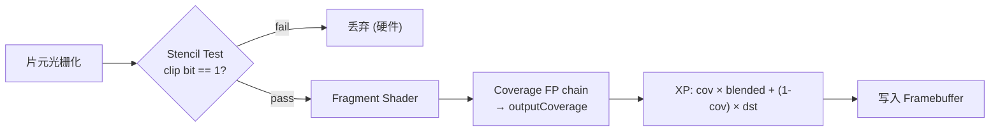

---

## 附录 A: Stencil Buffer 状态机

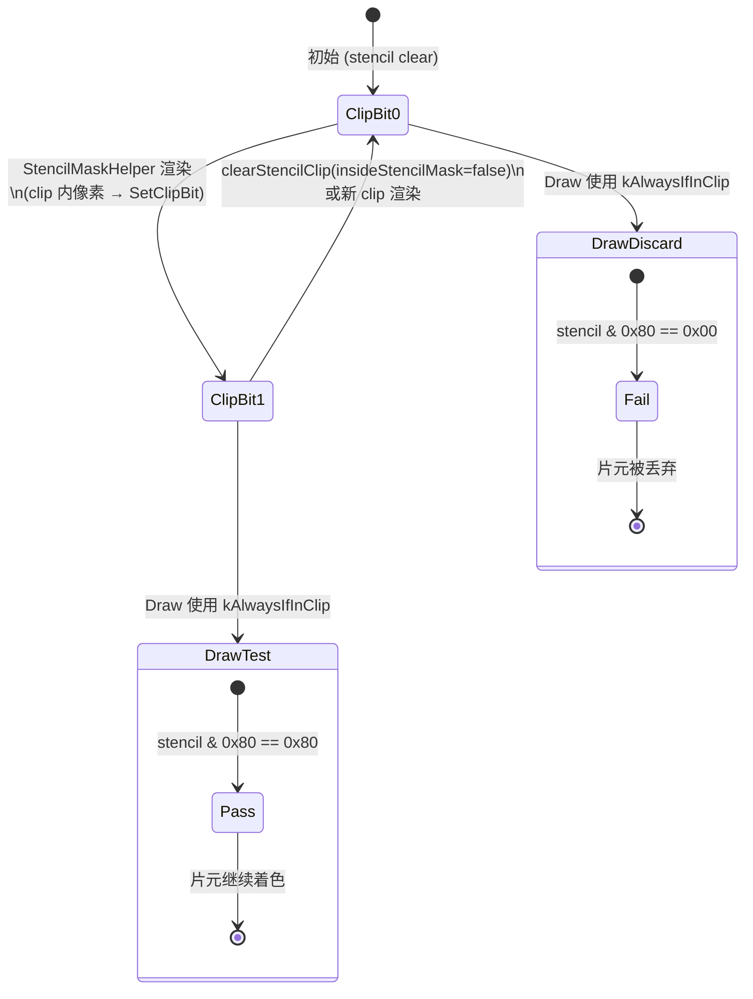

---

## 附录 B: 从 GrAppliedClip 到 GPU 状态的完整类型转换链

### SW Mask 路径

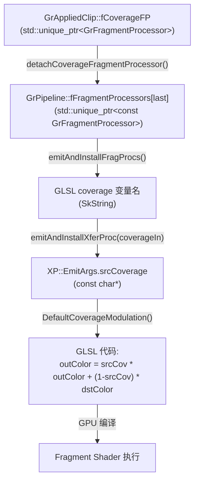

### Stencil Mask 路径

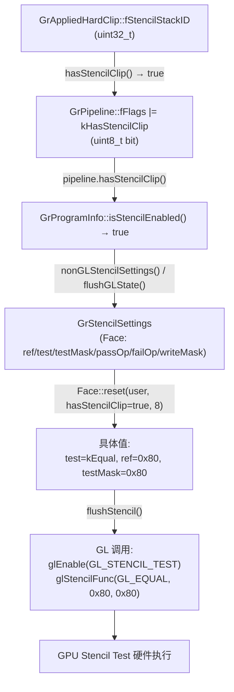

---

## 附录 C: 源码行号速查

| 文件 | 行号 | 功能 |
|------|------|------|
| `ClipStack.cpp` | 1546-1548 | `out->addCoverageFP(clipFP)` — SW mask 注入起点 |
| `ClipStack.cpp` | 1683-1698 | GrTextureEffect + GrBlendFP 创建 |
| `GrAppliedClip.h` | 50-51 | `stencilStackID()` / `hasStencilClip()` |
| `GrAppliedClip.h` | 76-79 | `addStencilClip()` |
| `GrAppliedClip.h` | 118-138 | `hasCoverageFP()` / `detachCoverageFP()` / `addCoverageFP()` |
| `GrPipeline.cpp` | 23-39 | 构造: 从 hardClip 设置 kHasStencilClip flag |
| `GrPipeline.cpp` | 41-62 | 构造: 收集 FP 到 fFragmentProcessors[] |
| `GrPipeline.h` | 189-191 | `hasStencilClip()` 查询 |
| `GrPipeline.h` | 224-247 | Flags 定义 + fFragmentProcessors 存储 |
| `GrProgramInfo.h` | 40-43 | `isStencilEnabled()` 定义 |
| `GrProgramInfo.cpp` | 57-65 | `nonGLStencilSettings()` — clip bit 解析 |
| `GrStencilSettings.cpp` | 30-57 | `reset(user, hasStencilClip, bits)` — 全局调度 |
| `GrStencilSettings.cpp` | 174-218 | `Face::reset()` — clip bit 位运算核心 |
| `GrUserStencilSettings.h` | 156-163 | `fCWFlags[2]` 双索引构造 |
| `GrUserStencilSettings.h` | 189-191 | `flags(hasStencilClip)` 运行时选择 |
| `GrUserStencilSettings.h` | 205-208 | `fCWFlags[2]` / `fCCWFlags[2]` 存储 |
| `GrOpsRenderPass.cpp` | 71-129 | `bindPipeline()` — stencil 验证 + onBindPipeline |
| `GrGLGpu.cpp` | 2100-2139 | `flushGLState()` — stencil.reset + flushStencil |
| `GrGLGpu.cpp` | 2692-2723 | `flushStencil()` — GL stencil 硬件指令 |
| `GrGLSLProgramBuilder.cpp` | 135-151 | `emitAndInstallFragProcs()` — color/coverage 分流 |
| `GrGLSLProgramBuilder.cpp` | 405-441 | `emitAndInstallXferProc()` — coverage 传给 XP |
| `GrXferProcessor.cpp` | 194-217 | `DefaultCoverageModulation()` — 最终公式 |
