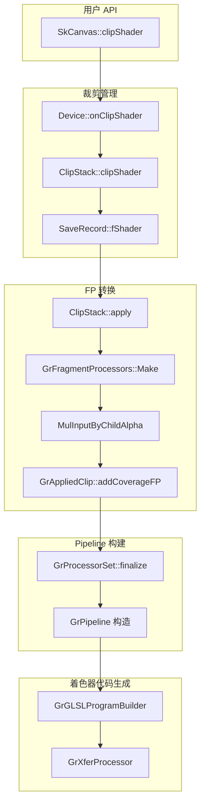
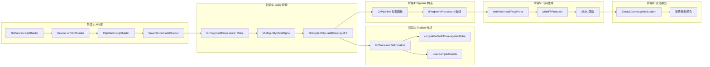
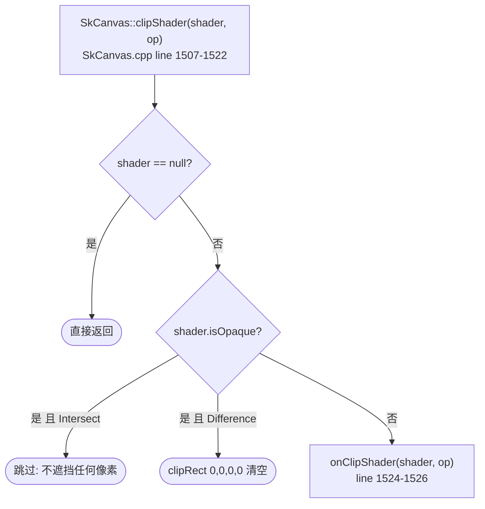
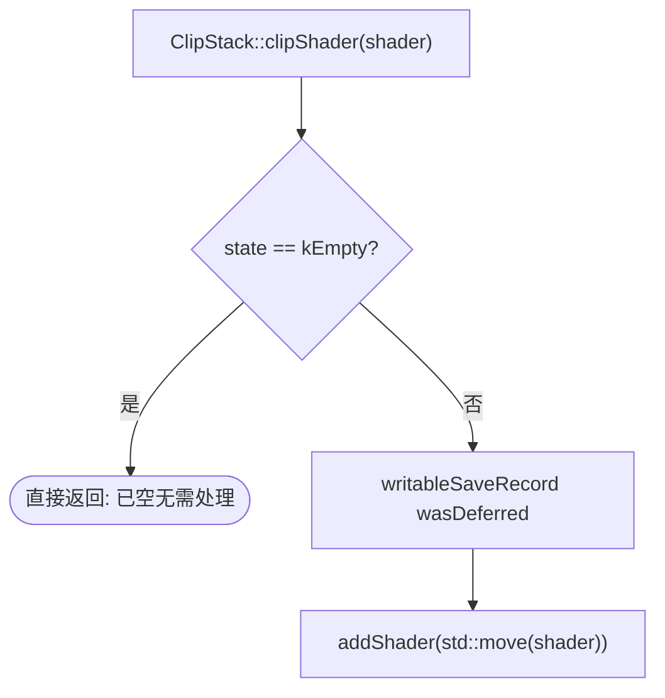
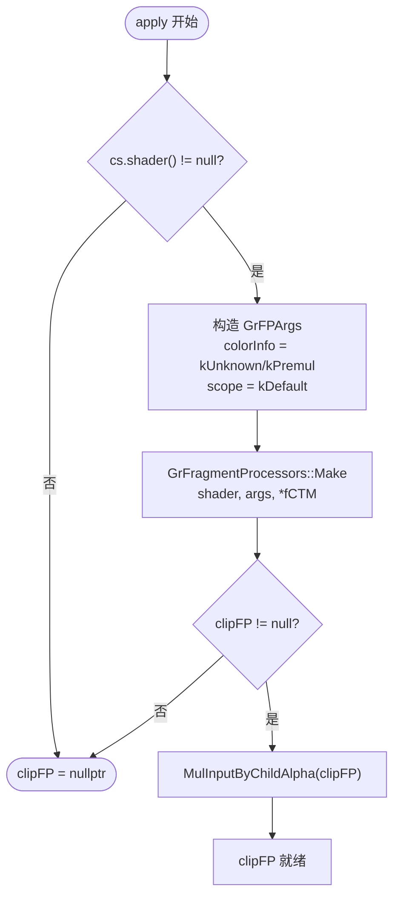
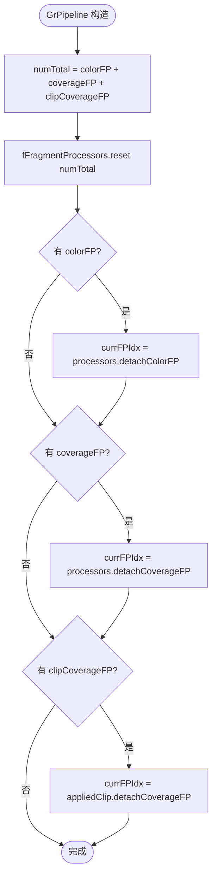
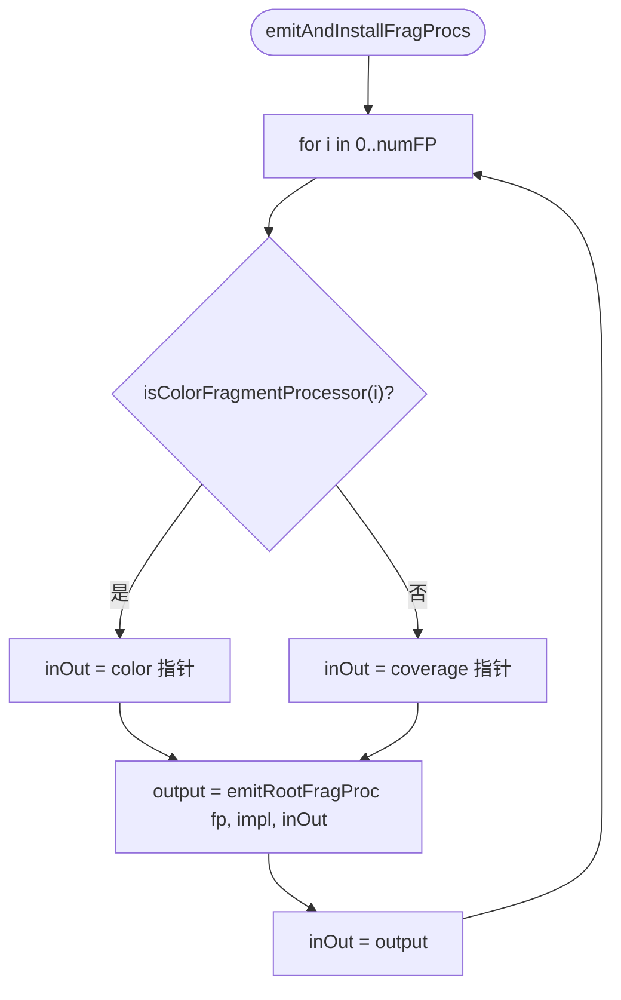
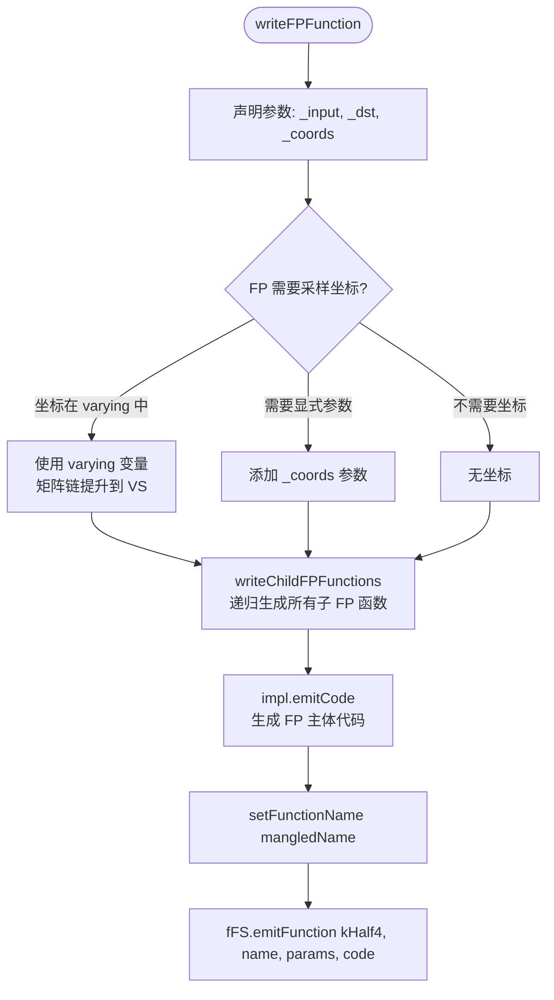
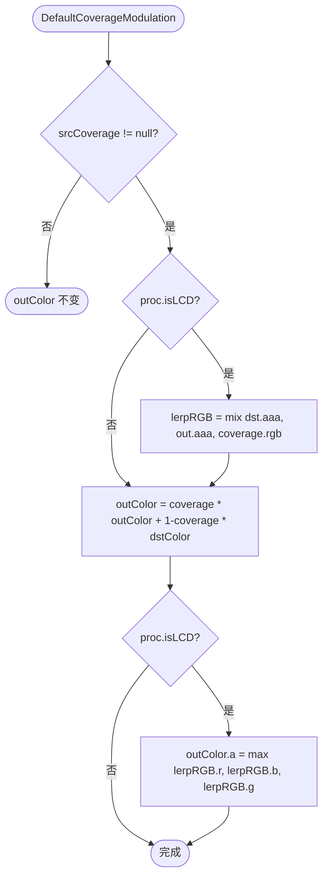

# Clip Shader 管线函数实现参考

> 涉及源码:
> - `src/core/SkCanvas.cpp` (clipShader: line 1507-1526)
> - `src/gpu/ganesh/Device.h` (onClipShader: line 341-343)
> - `src/gpu/ganesh/ClipStack.cpp` (addShader: 932-943, apply: 1335-1348/1546-1549, clipShader: 1569-1578)
> - `src/gpu/ganesh/GrFragmentProcessors.cpp` (Make: line 1115-1136)
> - `src/gpu/ganesh/GrAppliedClip.h` (addCoverageFP: line 131-138, fCoverageFP: line 164)
> - `src/gpu/ganesh/GrProcessorSet.cpp` (finalize clip 分析: line 133-138)
> - `src/gpu/ganesh/GrPipeline.cpp` (构造函数: line 41-62)
> - `src/gpu/ganesh/glsl/GrGLSLProgramBuilder.cpp` (emitAndInstallFragProcs: 135-151, writeFPFunction: 245-328)
> - `src/gpu/ganesh/GrXferProcessor.cpp` (DefaultCoverageModulation: line 194-217)

---

## 类型速查

### Shader / FP 转换

| 类型 | 含义 |
|------|------|
| `SkShader` | Skia 着色器基类，描述颜色/覆盖率的空间分布 |
| `SkShaderBase` | SkShader 内部实现基类，提供 `type()` 分派 |
| `sk_sp<SkShader>` | 智能指针包装的 SkShader |
| `GrFragmentProcessor` | GPU 片段处理器，在像素级执行着色逻辑 |
| `GrFPArgs` | FP 构造参数包 (colorInfo, surfaceProps, scope) |
| `GrColorInfo` | 颜色空间 + alpha 类型信息 |
| `SkShaders::MatrixRec` | Shader 坐标变换记录 |

### Pipeline / 分析

| 类型 | 含义 |
|------|------|
| `GrAppliedClip` | 裁剪结果容器，持有 hardClip + coverageFP |
| `GrProcessorSet` | 处理器集合，持有 color/coverage FP + XP |
| `GrProcessorSet::Analysis` | finalize 后的属性分析结果 |
| `GrPipeline` | GPU 渲染管线，持有最终 FP 数组 + XP + 状态 |
| `GrProcessorAnalysisCoverage` | coverage 类型枚举 (kNone/kSingleChannel/kLCD) |

### 代码生成

| 类型 | 含义 |
|------|------|
| `GrGLSLProgramBuilder` | SkSL 程序构建器，协调 VS/FS 代码生成 |
| `GrGLSLFragmentShaderBuilder` (`fFS`) | 片段着色器代码拼接器 |
| `GrFragmentProcessor::ProgramImpl` | FP 的代码生成实现 |
| `GrShaderVar` | SkSL 变量声明 (名称 + 类型) |
| `SkSLType` | SkSL 类型枚举 (kHalf4, kFloat2 等) |

### 混合输出

| 类型 | 含义 |
|------|------|
| `GrXferProcessor` | 传输处理器，执行最终 src/dst 混合 |
| `GrXferProcessor::ProgramImpl` | XP 的代码生成实现 |
| `GrGLSLXPFragmentBuilder` | XP 专用的片段着色器代码拼接器 |

---

## Clip Shader 在 Skia 工程中的架构位置

| 项目 | 说明 |
|------|------|
| 归属层 | Ganesh (GPU) 渲染后端 |
| 入口 API | `SkCanvas::clipShader()` |
| 存储 | `ClipStack::SaveRecord::fShader` |
| 消费者 | `ClipStack::apply()` → `GrAppliedClip` → `GrPipeline` → `GrGLSLProgramBuilder` |
| 最终产物 | SkSL 片段着色器中的 coverage FP 函数 |



---

## 完整链路图

从 `SkCanvas::clipShader()` 到最终像素输出的 6 阶段端到端流程:



---

## 1. SkCanvas → ClipStack 存储

### 1.1 `SkCanvas::clipShader()` (line 1507-1522)



- 不透明 shader + Intersect: 不改变任何像素可见性，直接跳过
- 不透明 shader + Difference: 遮挡所有像素，等价于清空裁剪区

---

### 1.2 `Device::onClipShader()` (line 341-343)

```cpp
void onClipShader(sk_sp<SkShader> shader) override {
    fClip.clipShader(std::move(shader));
}
```

直接转发到 `ClipStack::clipShader()`。

---

### 1.3 `ClipStack::clipShader()` (line 1569-1578)



注: Shader 不影响几何遮罩和元素，仅修改 `SaveRecord::fShader`。

---

### 1.4 `SaveRecord::addShader()` (line 932-943)

多次 `clipShader` 的合并策略:

| 情况 | 处理方式 |
|------|----------|
| 首次设置 (`fShader == null`) | `fShader = shader` |
| 后续叠加 (`fShader != null`) | `fShader = SkShaders::Blend(kSrcIn, newShader, fShader)` |

`kSrcIn` 混合等价于 `newShader.alpha * fShader.alpha`，即多个 clip shader 的覆盖率相乘。

---

## 2. ClipStack::apply() — SkShader → GrFragmentProcessor

### 2.1 Shader 转 FP (line 1335-1348)

在 `apply()` 方法开头，clip shader 被转换为 GPU 可执行的 Fragment Processor:



---

### 2.2 `GrFragmentProcessors::Make()` (line 1115-1136)

根据 shader 类型分派到对应的 `make_shader_fp()`:

```cpp
auto base = as_SB(shader);
switch (base->type()) {
    // 对每种 ShaderType 调用对应的 make_shader_fp()
    SK_ALL_SHADERS(M)
}
```

每种 SkShader 子类型 (Color, Gradient, Image, Blend 等) 都有对应的 FP 工厂函数。

---

### 2.3 `MulInputByChildAlpha` 包装

包装后的 FP 语义: `output = inputCoverage * clipShader.alpha`

作用: 确保 clip shader 的 alpha 与上游几何覆盖率正确相乘，而非替换。

---

### 2.4 `GrAppliedClip::addCoverageFP()` (line 131-138)

在 `apply()` 末尾 (line 1546-1549) 将 clipFP 存入 `GrAppliedClip`:

```cpp
if (clipFP) {
    out->addCoverageFP(std::move(clipFP));
}
```

`addCoverageFP` 的合并逻辑:

| 情况 | 处理方式 |
|------|----------|
| `fCoverageFP == null` | 直接存入 |
| `fCoverageFP != null` | `Compose(newFP, existingFP)` — 串联组合 |

这意味着几何裁剪生成的 analytic FP 与 clip shader FP 会被组合成一条 FP 链。

---

## 3. GrProcessorSet::finalize() — 属性分析

### 3.1 Coverage FP 属性提取 (line 133-138)

绘制操作提交前，`finalize()` 分析 clip coverage FP 的属性:

```cpp
if (clip && clip->hasCoverageFragmentProcessor()) {
    hasCoverageFP = true;
    const GrFragmentProcessor* clipFP = clip->coverageFragmentProcessor();
    analysis.fCompatibleWithCoverageAsAlpha &= clipFP->compatibleWithCoverageAsAlpha();
    coverageUsesLocalCoords |= clipFP->usesSampleCoords();
}
```

---

### 3.2 分析项影响

| 分析项 | 含义 | 影响 |
|--------|------|------|
| `compatibleWithCoverageAsAlpha` | coverage 可否作为单通道 alpha 使用 | 决定 XP 能否做 LCD 等优化 |
| `usesSampleCoords` | FP 是否需要采样坐标 | 需要 → `usesLocalCoords = true` → 顶点着色器需要传递坐标 |

Clip shader 通常需要采样坐标（依赖像素位置计算覆盖率），因此会强制管线传递 local coords。

---

## 4. GrPipeline 构造 — FP 数组合并

### 4.1 构造函数逻辑 (line 41-62)



---

### 4.2 数组布局

```
fFragmentProcessors:
┌─────────────────────────────────────────────────────────────────┐
│ [0..fNumColorProcessors-1]  │  [fNumColorProcessors..end]       │
│     color FPs               │     coverage FPs (含 clip FP)     │
└─────────────────────────────────────────────────────────────────┘
```

`fNumColorProcessors` 在后续代码生成中用于区分: color FP 输出累积到 `color` 变量，coverage FP 输出累积到 `coverage` 变量。

---

## 5. GrGLSLProgramBuilder — SkSL 代码生成

### 5.1 `emitAndInstallFragProcs()` (line 135-151)



对于 clip shader FP，它位于 coverage 区域，输出被赋值给 `coverage` 变量。多个 coverage FP 串行执行，前一个的输出作为下一个的输入。

---

### 5.2 `writeFPFunction()` (line 245-328)

为每个 FP 生成独立的 SkSL 函数:



坐标处理的三种情况:

| varying 类型 | 处理 |
|------|------|
| `kVoid` | FP 不使用坐标 |
| `kFloat2` | 直接指向 varying 变量 |
| `kFloat3` | 需要在 FS 中做透视除法 `_coords = varying.xy / varying.z` |

---

## 6. GrXferProcessor — coverage 最终混合

### 6.1 `DefaultCoverageModulation()` (line 194-217)

使用 coverage 值对最终颜色进行调制:



---

### 6.2 核心公式

**非 LCD 情况**:
```
finalColor = coverage * blendedColor + (1 - coverage) * dstColor
```

其中 `coverage` = 几何覆盖率 × clip shader alpha × 其他 coverage FP 贡献。

**LCD 情况** (子像素渲染):
- coverage 为 RGB 三通道独立值
- alpha 取 `max(lerpRGB.r, lerpRGB.b, lerpRGB.g)` 保证正确合成

---

## 附录: 生成着色器伪代码结构

以下是包含 clip shader 时，生成的片段着色器逻辑伪代码:

```glsl
// ===== 由 GrGLSLProgramBuilder 生成 =====

// Color FP 函数 (例如 paint shader)
half4 ColorFP_func(half4 _input) {
    // paint shader 逻辑...
    return paintColor;
}

// Clip Shader FP 函数 (由 clipShader 转换而来)
half4 ClipShaderFP_func(half4 _input, float2 _coords) {
    // 执行 SkShader 逻辑, 返回 clip 覆盖率
    half4 shaderColor = /* shader evaluation at _coords */;
    return shaderColor;
}

// MulInputByChildAlpha 包装
half4 MulInputByChildAlpha_func(half4 _input) {
    half4 child = ClipShaderFP_func(half4(1), _coords);
    return _input * child.a;  // 几何 coverage × clip shader alpha
}

void main() {
    // --- Color 阶段 ---
    half4 color = ColorFP_func(inputColor);

    // --- Coverage 阶段 ---
    half4 coverage = half4(1);  // 初始 = 几何 coverage (来自 GeometryProcessor)
    // 如果有其他 coverage FP (如 analytic clip):
    coverage = AnalyticClipFP_func(coverage);
    // Clip shader FP (带 MulInputByChildAlpha 包装):
    coverage = MulInputByChildAlpha_func(coverage);

    // --- XferProcessor: DefaultCoverageModulation ---
    half4 blended = xfer(color, dstColor);  // blend mode 计算
    outputColor = coverage * blended + (1 - coverage) * dstColor;
}
```

**关键洞察**:
1. Clip shader 被包装为 `MulInputByChildAlpha`，使其输出 = `上游coverage × shader.alpha`
2. 多个 coverage FP 串联执行，形成 coverage 衰减链
3. 最终 XferProcessor 用 coverage 在 blended 颜色和 dst 颜色间插值，实现半透明裁剪效果
