# SaveRecord 机制详解

> 源码: `src/gpu/ganesh/ClipStack.cpp` (lines 829-1158)
> 头文件: `src/gpu/ganesh/ClipStack.h` (lines 230-307)
> 关联文档: [`ClipStack.cn.md`](./ClipStack.cn.md)

---

## 类型速查

SaveRecord 字段和方法中涉及的所有非基础类型:

### 自身 & 容器

| 类型 | 含义 |
|------|------|
| `SaveRecord::Stack` | `SkTBlockList<SaveRecord, 2>` — 预分配 2 个 SaveRecord 的块链表 |
| `RawElement::Stack` | `SkTBlockList<RawElement, 1>` — 预分配 1 个 RawElement 的块链表 |
| `Mask::Stack` | `SkTBlockList<Mask, 1>` — 预分配 1 个 Mask 的块链表 |
| `ClipState` | 枚举: `kEmpty` / `kWideOpen` / `kDeviceRect` / `kDeviceRRect` / `kComplex` |
| `ClipGeometry` | 枚举: `kEmpty` / `kAOnly` / `kBOnly` / `kBoth` |

### 几何/渲染

| 类型 | 含义 |
|------|------|
| `SkIRect` | 整数像素矩形 (left/top/right/bottom) |
| `SkClipOp` | `kIntersect` / `kDifference` |
| `GrAA` | `kYes` / `kNo` — 抗锯齿策略 |
| `GrShape` | 统一几何形状容器 (rect/rrect/path/empty) |
| `SkShader` | 着色器基类 (clip shader 用于软件遮罩生成) |
| `GrProxyProvider` | GPU 纹理代理管理器 (用于遮罩缓存失效) |
| `UniqueKey` | GPU 资源唯一标识键 |

---

## SaveRecord 在 Skia 工程中的架构位置

| 维度 | 说明 |
|------|------|
| **归属** | `skgpu::ganesh::ClipStack` 内部类 |
| **上游调用者** | `ClipStack::save()` / `restore()` / `clip()` / `replaceClip()` / `writableSaveRecord()` |
| **下游被管理者** | `RawElement::Stack`(元素栈) / `Mask::Stack`(遮罩栈) |
| **接口模式** | 实现 common clip type interface: `op()` / `outerBounds()` / `contains()` |

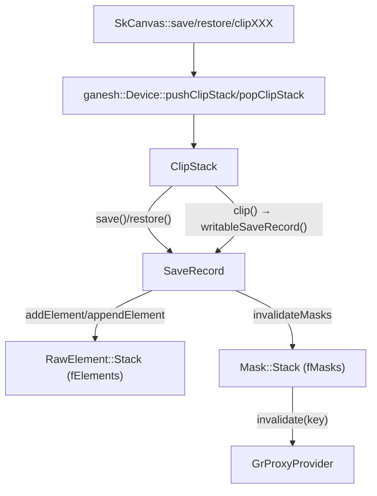

---

## 架构总览

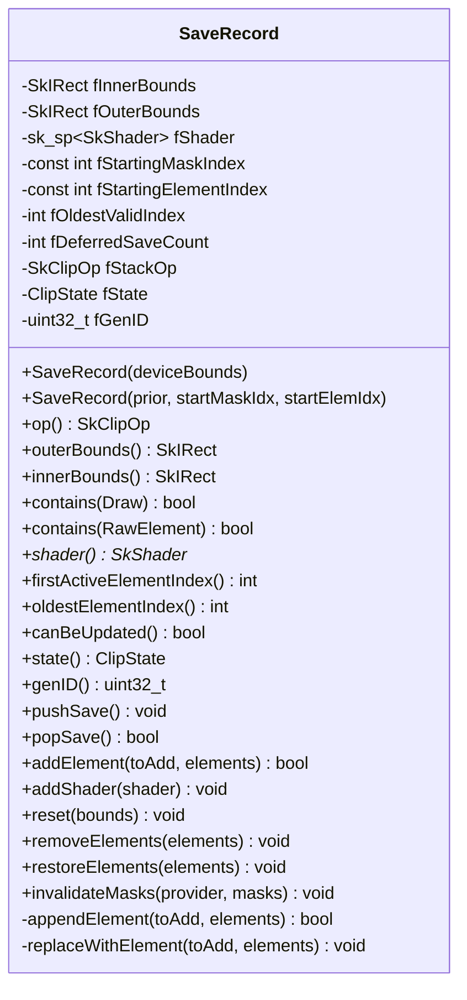

---

## 1. 核心概念: 延迟保存机制 (Deferred Save)

### 1.1 问题背景与设计动机

Canvas 绘制模式中，`save()`/`restore()` 调用极为频繁:
- 每个 `drawXXX` 前后可能有一对 save/restore
- Layer 边界、变换隔离都需要 save/restore
- **统计数据** (`ClipStack.cpp:1163-1168`): 98% 的绘制操作只使用 ≤1 个元素 + ≤2 个 SaveRecord

绝大多数 save/restore 对之间**没有任何裁剪修改**。如果每次 save 都分配新 SaveRecord，会产生大量无意义的内存分配和状态拷贝。

**解决方案**: 延迟分配 — 只在 save 之后**真正发生裁剪修改**时才创建新 SaveRecord。

---

### 1.2 双层延迟架构 (SkCanvas 层 + ClipStack 层)

延迟发生在两个层次:

| 层次 | 计数器 | 实体化触发 |
|------|--------|-----------|
| **SkCanvas** | `MCRec::fDeferredSaveCount` | 首次 clip/transform 操作 → `checkForDeferredSave()` |
| **ClipStack** | `SaveRecord::fDeferredSaveCount` | 首次裁剪修改 → `writableSaveRecord()` 检测 `canBeUpdated()==false` |

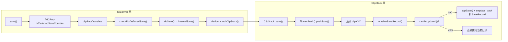

**双层延迟的效果**: 大量空 save/restore 对的开销降为零 (仅整数加减)。

---

### 1.3 fDeferredSaveCount 状态转换详解

`fDeferredSaveCount` 的值域和含义:

| 值 | 含义 | 允许的操作 |
|----|------|-----------|
| `0` | 活跃记录，无待定 save | `canBeUpdated()=true`，可直接修改 |
| `>0` (如 1,2,3...) | 有 N 次 save 尚未实体化 | `canBeUpdated()=false`，修改前需创建新记录 |
| `-1` | popSave 信号: 该记录应被删除 | `popSave()` 返回 `false` |

状态转换:

```mermaid
stateDiagram-v2
    [*] --> 活跃_0: 构造时 fDeferredSaveCount=0
    活跃_0 --> 延迟_N: pushSave() → count=1,2,3...
    延迟_N --> 延迟_N: pushSave() → count++
    延迟_N --> 活跃_0: popSave() 且 count>0 后 count=0
    延迟_N --> 延迟_N: popSave() 且 count>1 后 count--
    活跃_0 --> 待删除: popSave() → count=-1
    待删除 --> [*]: ClipStack::restore() 删除该记录
    延迟_N --> 新记录实体化: writableSaveRecord() 检测 count>0
    新记录实体化 --> 活跃_0: popSave() 使旧记录 count--; 新记录 count=0
```

---

### 1.4 writableSaveRecord() 实体化逻辑 (line 1555-1567)

```cpp
SaveRecord& ClipStack::writableSaveRecord(bool* wasDeferred) {
    SaveRecord& current = fSaves.back();
    if (current.canBeUpdated()) {
        // fDeferredSaveCount == 0, 直接修改
        *wasDeferred = false;
        return current;
    } else {
        // fDeferredSaveCount > 0, 需要实体化
        SkAssertResult(current.popSave());  // 旧记录 count--
        *wasDeferred = true;
        return fSaves.emplace_back(current, fMasks.count(), fElements.count());
    }
}
```

**关键点**:
- 新 SaveRecord 通过嵌套构造函数继承前一个记录的 bounds/state/shader/stackOp
- `fStartingElementIndex = fElements.count()` — 当前元素数作为新记录的起始索引
- `fStartingMaskIndex = fMasks.count()` — 当前遮罩数作为新记录的起始索引
- 新记录的 `fGenID = kInvalidGenID` — 直到有元素被添加才分配真正的 genID

---

### 1.5 完整时序: 5 步操作序列追踪双层计数器

追踪一个完整操作序列中两层计数器的变化:

```
操作序列: save → save → restore → clipRect(R) → restore
```

| 步骤 | 操作 | SkCanvas.fDeferredSaveCount | SR[0].fDeferredSaveCount | fSaves 栈 |
|------|------|---------------------------|--------------------------|-----------|
| 初始 | — | 0 | 0 | [SR0(WideOpen)] |
| 1 | `save()` | — | 1 (pushSave) | [SR0] |
| 2 | `save()` | — | 2 (pushSave) | [SR0] |
| 3 | `restore()` | — | 1 (popSave→true) | [SR0] — 无变化 |
| 4 | `clipRect(R)` | — | 0 (popSave in writableSaveRecord) | [SR0, SR1] — SR1 新建 |
| 5 | `restore()` | — | SR1.popSave→false | [SR0] — SR1 被删除 |

> 注: 步骤 4 中 `writableSaveRecord()` 检测 `canBeUpdated()==false` (count=1>0)，执行 `popSave()` 使 SR0.count 降为 0，然后 `emplace_back` 创建 SR1。

---

## 2. 核心概念: 元素有效性与失效生命周期

### 2.1 fInvalidatedByIndex 语义 — 记录"谁"使我失效

每个 `RawElement` 有一个 `int fInvalidatedByIndex` 字段 (`ClipStack.h:189`):

| 值 | 含义 |
|----|------|
| `-1` | 有效 (初始值) |
| `≥ 0` | 已失效，值 = 使我失效的 SaveRecord 的 `firstActiveElementIndex()` |

**为什么存储索引而不是布尔?**

因为需要支持**恢复** (restore)。当一个 SaveRecord 被弹出时，它曾经使失效的旧元素应该恢复有效。通过比较索引可以精确判断: "这个失效标记是否是由已被删除的那个 SaveRecord 造成的?"

---

### 2.2 markInvalid() — 失效标记策略 (line 502-505)

```cpp
void ClipStack::RawElement::markInvalid(const SaveRecord& current) {
    SkASSERT(!this->isInvalid());
    fInvalidatedByIndex = current.firstActiveElementIndex();
}
```

**语义**: 将 `fInvalidatedByIndex` 设为当前 SaveRecord 的 `fStartingElementIndex`。

**为什么用 `fStartingElementIndex` 而不是具体的新元素索引?**

因为在 `appendElement()` 的循环中，新元素尚未被放入栈，它的最终索引位置还不确定 (可能复用失效位置)。而 `fStartingElementIndex` 是稳定的: 它标识了"当前这一层 SaveRecord 的元素范围起点"，不会随栈的修改而变化。

---

### 2.3 restoreValid() — 恢复条件与判定逻辑 (line 507-511)

```cpp
void ClipStack::RawElement::restoreValid(const SaveRecord& current) {
    if (current.firstActiveElementIndex() < fInvalidatedByIndex) {
        fInvalidatedByIndex = -1;
    }
}
```

**判定逻辑解读**:

- `current` = 刚刚成为新栈顶的 SaveRecord (被 pop 的记录的**前一个**)
- `current.firstActiveElementIndex()` = 新栈顶的 `fStartingElementIndex`
- 如果新栈顶的起始索引 **<** 失效标记值 → 说明使我失效的 SaveRecord 已经被删除了 → 恢复有效

**直觉**: 失效标记值对应的是某个更高层 SaveRecord 的起始索引。如果那个更高层已经被 restore 掉了 (它的元素都被移除了)，那么它对我的失效也应该被撤销。

**具体场景**:

```
fSaves: [SR0(startIdx=0), SR1(startIdx=3), SR2(startIdx=5)]
元素 E1 被 SR2 标记失效: E1.fInvalidatedByIndex = 5

restore SR2 后:
  fSaves: [SR0, SR1]
  SR1.restoreElements() → 对 E1 调用 restoreValid(SR1)
  SR1.firstActiveElementIndex() = 3
  3 < 5 → 恢复! E1.fInvalidatedByIndex = -1
```

---

### 2.4 索引范围: fStartingElementIndex / fOldestValidIndex

这两个索引定义了 SaveRecord 的"可见元素窗口":

```
fElements:  [E0] [E1] [E2] [E3] [E4] [E5] [E6]
             ^              ^                  ^
             |              |                  |
     fOldestValidIndex   fStartingElementIndex  count-1
     (扫描起点)          (拥有权起点)           (栈顶)
```

| 字段 | 含义 | 可变性 |
|------|------|--------|
| `fStartingElementIndex` | 该 SaveRecord 拥有的第一个元素索引 (由该记录添加) | `const` — 构造时确定 |
| `fOldestValidIndex` | 当前仍可能有效的最老元素索引 | 随 `appendElement` / `replaceWithElement` 更新 |

**重要区别**:
- "拥有"的元素 = `[fStartingElementIndex, count-1]` — restore 时只删除这些
- "可见"的元素 = `[fOldestValidIndex, count-1]` — 包括更低层 SaveRecord 的未失效元素

---

### 2.5 ElementIter 如何跳过失效元素 (ClipStack.h:348-386)

```cpp
ElementIter& operator++() {
    do {
        fRemaining--;
        ++fItem;
    } while(fRemaining > 0 && (*fItem).isInvalid());
    return *this;
}
```

迭代器从栈顶向下遍历 `count - oldestElementIndex()` 个元素，自动跳过 `isInvalid()` 为 true 的元素。这意味着失效元素在遍历时完全透明，不参与裁剪应用。

---

### 2.6 完整生命周期图解 (3 个 SaveRecord 场景)

场景: 三层 SaveRecord，展示失效、跳过和恢复的完整过程。

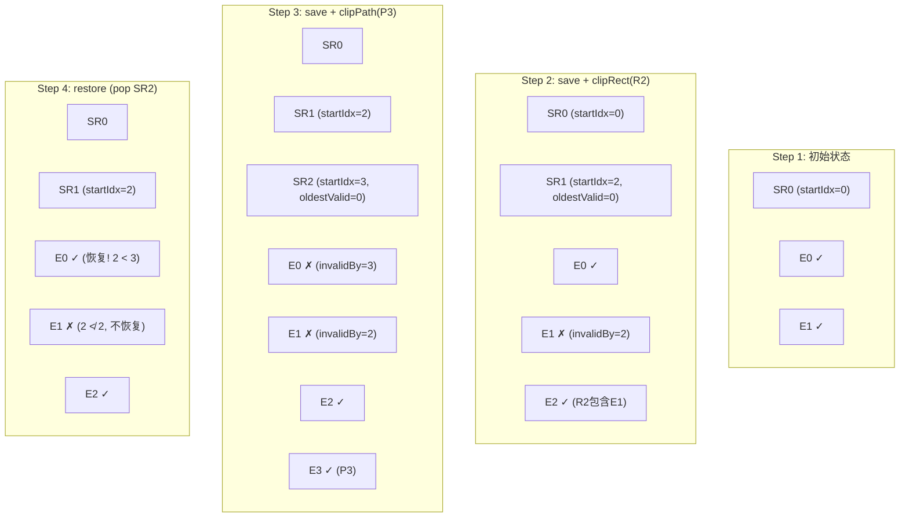

**解读 Step 4**:
- SR2 被 pop → `removeElements` 删除 E3 (index≥3)
- SR1 成为新栈顶 → `restoreElements()` 遍历 E0..E2
- E0: `SR1.firstActiveElementIndex()=2`, `fInvalidatedByIndex=3` → 2 < 3 → **恢复有效**
- E1: `SR1.firstActiveElementIndex()=2`, `fInvalidatedByIndex=2` → 2 ≮ 2 → **保持失效**

---

## 3. 核心概念: 边界算术 (Bounds Arithmetic)

### 3.1 innerBounds 与 outerBounds 的语义 (含 fStackOp 影响)

SaveRecord 维护两个**聚合**边界矩形，代表整个裁剪栈从 `fOldestValidIndex` 到栈顶所有有效元素的净效果:

| 字段 | fStackOp == kIntersect 时 | fStackOp == kDifference 时 |
|------|--------------------------|---------------------------|
| `fInnerBounds` | 内部区域保证**完全被覆盖** (full coverage) | 内部区域保证 **0 coverage** (完全被裁去) |
| `fOuterBounds` | 外部区域保证 **0 coverage** (完全裁去) | 外部区域保证 **full coverage** (完全保留) |

**直觉解释**:

- **Intersect 模式** (只保留某区域内): outerBounds 是"保留区域的外轮廓"，innerBounds 是"保证完全保留的内核"
- **Difference 模式** (挖去某区域): outerBounds 是"被挖去区域的外轮廓"，innerBounds 是"保证完全被挖去的内核"

**不变量**: `fInnerBounds ⊆ fOuterBounds ⊆ deviceBounds` (或 inner 为空)

---

### 3.2 fStackOp 切换条件 (line 1107-1110)

```cpp
if (fStackOp == SkClipOp::kDifference && toAdd.op() == SkClipOp::kIntersect) {
    fStackOp = SkClipOp::kIntersect;
}
```

**规则**: `fStackOp` 默认为 `kIntersect`，仅当**所有**有效元素都是 `kDifference` 时才为 `kDifference`。一旦有任何 `kIntersect` 元素加入，立即切回 `kIntersect`。

**原因**: 当所有元素都是 difference 时，有一个隐式的"设备边界全覆盖"作为基础。加入 intersect 元素后，基础变成了有限区域。

---

### 3.3 subtract() 辅助函数 (line 210-220)

```cpp
SkIRect subtract(const SkIRect& a, const SkIRect& b, bool exact) {
    SkIRect diff;
    if (SkRectPriv::Subtract(a, b, &diff) || !exact) {
        return diff;
    } else {
        return a;
    }
}
```

| `exact` 参数 | 行为 |
|:---:|------|
| `true` | 只有当 A-B 能**精确**表示为一个矩形时才返回差集；否则返回原始 A (保守估计) |
| `false` | 返回 A 中被 B 排除后的最大子矩形 (即使不精确也接受) |

**何时用 `exact=true`?** 更新 outerBounds 时 — 宁可保守也不能遗漏覆盖区域。

**何时用 `exact=false`?** 更新 innerBounds 时 — 可以缩小保证区域，只要不扩大。

---

### 3.4 四种 op 组合 — Worked Examples (具体数值)

假设设备边界为 `[0, 0, 100, 100]`。

#### Case 1: Intersect(stack) + Intersect(toAdd)

```
当前状态: fOuterBounds=[10,10,90,90], fInnerBounds=[20,20,80,80]
新元素:   toAdd.outerBounds=[30,0,70,100], toAdd.innerBounds=[40,10,60,90]

更新:
  fOuterBounds = intersect([10,10,90,90], [30,0,70,100]) = [30,10,70,90]
  fInnerBounds = intersect([20,20,80,80], [40,10,60,90]) = [40,20,60,80]
```

**直觉**: 两个 intersect 的组合就是两个区域的公共部分。

#### Case 2: Intersect(stack) + Difference(toAdd)

```
当前状态: fOuterBounds=[0,0,100,100], fInnerBounds=[10,10,90,90]
新元素:   toAdd.outerBounds=[40,0,60,100], toAdd.innerBounds=[45,0,55,100]
(从中间竖直切一刀)

更新:
  fOuterBounds = subtract([0,0,100,100], [45,0,55,100], exact=true)
               = [0,0,100,100]  (无法精确表示为单矩形，保留原值)
  fInnerBounds = subtract([10,10,90,90], [40,0,60,100], exact=false)
               = [60,10,90,90] 或 [10,10,40,90]  (取 A 中排除 B 后的最大子矩形)
```

**直觉**: difference 从保留区域中挖去一块。outer 可能无法缩小 (保守)，但 inner 肯定要缩小 (保证区域变小了)。

#### Case 3: Difference(stack) + Intersect(toAdd)

```
当前状态: fStackOp=kDifference, fOuterBounds=[30,30,70,70], fInnerBounds=[40,40,60,60]
(表示中心区域被挖去)
新元素:   toAdd.op=Intersect, outer=[0,0,80,80], inner=[10,10,70,70]

更新 (镜像 Case 2):
  fOuterBounds = subtract(toAdd.outer, fInnerBounds, exact=true)
               = subtract([0,0,80,80], [40,40,60,60], exact=true)
               = [0,0,80,80]  (无法精确表示)
  fInnerBounds = subtract(toAdd.inner, oldOuter, exact=false)
               = subtract([10,10,70,70], [30,30,70,70], exact=false)
               = [10,10,30,70]  (排除旧 outer 后的子矩形)

同时: fStackOp 切换为 kIntersect (见 §3.2)
```

#### Case 4: Difference(stack) + Difference(toAdd)

```
当前状态: fStackOp=kDifference, fOuterBounds=[20,20,40,40], fInnerBounds=[25,25,35,35]
新元素:   toAdd.op=Difference, outer=[60,60,80,80], inner=[65,65,75,75]

更新:
  fOuterBounds = join([20,20,40,40], [60,60,80,80]) = [20,20,80,80]
  fInnerBounds = 比较面积: 旧=10×10=100, 新=10×10=100 → 保留旧值 [25,25,35,35]
```

**直觉**: 多个 difference 挖的洞越多，"可能被影响的区域" (outer) 越大；但"保证被挖掉的区域" (inner) 取最大的一个。

---

### 3.5 contains() 判定与边界的关系

```cpp
bool SaveRecord::contains(const Draw& draw) const {
    return fInnerBounds.contains(draw.outerBounds());
}
```

**语义**: 如果绘制完全落在 `fInnerBounds` 内:
- kIntersect 模式: 绘制完全被保留 → 无需裁剪
- kDifference 模式: 绘制完全被裁去 → 整个绘制被剪掉

这是一个**快速判定**，避免了逐元素遍历。

---

## 4. 核心概念: GenID 与遮罩缓存失效

### 4.1 GenID 分配规则与特殊值

| 常量 | 值 | 含义 |
|------|-----|------|
| `kInvalidGenID` | 0 | 新建但未添加任何元素的 SaveRecord |
| `kEmptyGenID` | 1 | 裁剪状态为空 (所有绘制都被裁掉) |
| `kWideOpenGenID` | 2 | 裁剪状态为全开 (无裁剪) |
| 正常 ID | ≥3 | 由 `next_gen_id()` 原子递增分配 |

`genID()` 方法的返回逻辑:

```cpp
uint32_t genID() const {
    if (fState == kEmpty) return kEmptyGenID;       // 1
    if (fState == kWideOpen) return kWideOpenGenID;  // 2
    return fGenID;                                   // 实际分配的 ID (≥3)
}
```

**设计意图**: Empty 和 WideOpen 不需要遮罩，所以用固定 ID 标识；只有 Complex/DeviceRect/DeviceRRect 状态才需要真正的 genID。

---

### 4.2 Mask UniqueKey 构造方式 (line 792-809)

```cpp
Mask::Mask(const SaveRecord& current, const SkIRect& drawBounds)
    : fBounds(drawBounds), fGenID(current.genID()) {
    UniqueKey::Builder builder(&fKey, kDomain, 5, "clip_mask");
    builder[0] = fGenID;
    builder[1] = drawBounds.fLeft;
    builder[2] = drawBounds.fRight;
    builder[3] = drawBounds.fTop;
    builder[4] = drawBounds.fBottom;
}
```

**UniqueKey = (genID, left, right, top, bottom)**

相同的 genID + 相同的绘制边界 → 相同的裁剪元素集 → 可复用遮罩。

---

### 4.3 三种失效触发路径

| 触发路径 | 代码位置 | 场景 |
|----------|---------|------|
| **restore()** | `ClipStack.cpp:1226` | SaveRecord 被弹出时，删除属于该记录的所有 mask |
| **clip()** (修改已有活跃记录) | `ClipStack.cpp:1637-1638` | `wasDeferred==false` 且 `addElement` 成功 → genID 已变，旧 mask 失效 |
| **replaceClip()** | `ClipStack.cpp:1586` | 直接重置 SaveRecord → 所有旧 mask 失效 |

---

### 4.4 完整缓存生命周期追踪

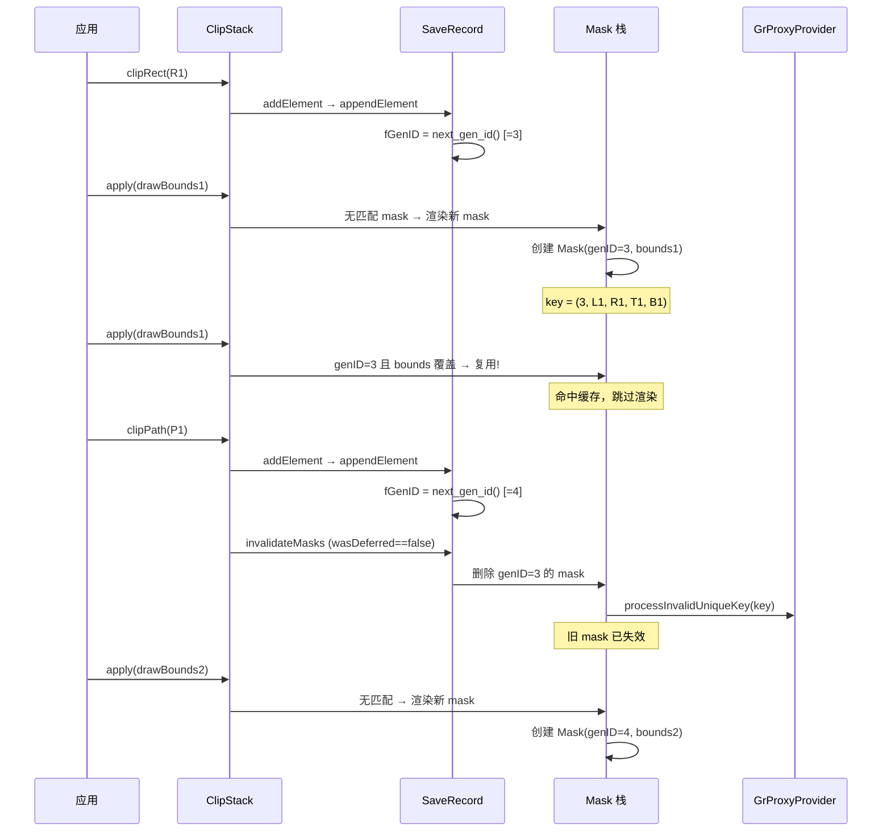

---

## 5. 构造与重置

### 5.1 根构造函数 (line 829-839)

```cpp
SaveRecord::SaveRecord(const SkIRect& deviceBounds)
    : fInnerBounds(deviceBounds)
    , fOuterBounds(deviceBounds)
    , fShader(nullptr)
    , fStartingMaskIndex(0)
    , fStartingElementIndex(0)
    , fOldestValidIndex(0)
    , fDeferredSaveCount(0)
    , fStackOp(SkClipOp::kIntersect)
    , fState(ClipState::kWideOpen)
    , fGenID(kInvalidGenID) {}
```

仅用于 ClipStack 初始化时的第一个 SaveRecord。设备全边界 = WideOpen = 无裁剪。

---

### 5.2 嵌套构造函数 (line 841-859)

```cpp
SaveRecord::SaveRecord(const SaveRecord& prior, int startingMaskIndex, int startingElementIndex)
    : fInnerBounds(prior.fInnerBounds)
    , fOuterBounds(prior.fOuterBounds)
    , fShader(prior.fShader)
    , fStartingMaskIndex(startingMaskIndex)
    , fStartingElementIndex(startingElementIndex)
    , fOldestValidIndex(prior.fOldestValidIndex)
    , fDeferredSaveCount(0)
    , fStackOp(prior.fStackOp)
    , fState(prior.fState)
    , fGenID(kInvalidGenID) {}
```

由 `writableSaveRecord()` 调用。新记录继承前一个的全部聚合状态，但:
- 拥有独立的元素/mask 起始索引
- genID 为 invalid (直到首次添加元素)
- deferredSaveCount 为 0 (这是一个活跃记录)

---

### 5.3 reset() (line 922-930)

```cpp
void SaveRecord::reset(const SkIRect& bounds) {
    SkASSERT(this->canBeUpdated());
    fOldestValidIndex = fStartingElementIndex;
    fOuterBounds = bounds;
    fInnerBounds = bounds;
    fStackOp = SkClipOp::kIntersect;
    fState = ClipState::kWideOpen;
    fShader = nullptr;
}
```

由 `replaceClip()` 调用。将 SaveRecord 重置为 WideOpen 状态，但保留 `fStartingElementIndex` (因为是 const)。所有"我拥有的"旧元素已被外部 `removeElements()` 清理。

---

## 6. 状态查询方法

### 6.1 genID() (line 861-872)

见 [§4.1 GenID 分配规则](#41-genid-分配规则与特殊值)。

---

### 6.2 state() (line 874-880)

```cpp
ClipState SaveRecord::state() const {
    if (fShader && fState != ClipState::kEmpty) {
        return ClipState::kComplex;
    }
    return fState;
}
```

有 shader 时强制返回 Complex (即使几何上可能是 DeviceRect)。原因: shader 需要额外的 fragment processor 处理，不能走简单的 scissor 快速路径。

---

### 6.3 contains(Draw) / contains(RawElement) (line 882-888)

```cpp
bool contains(const Draw& draw) const {
    return fInnerBounds.contains(draw.outerBounds());
}
bool contains(const RawElement& element) const {
    return fInnerBounds.contains(element.outerBounds());
}
```

纯边界判定。语义见 [§3.5 contains() 判定与边界的关系](#35-contains-判定与边界的关系)。

---

## 7. 元素栈管理

### 7.1 removeElements() (line 890-894)

```cpp
void SaveRecord::removeElements(RawElement::Stack* elements) {
    while (elements->count() > fStartingElementIndex) {
        elements->pop_back();
    }
}
```

**语义**: 删除所有属于本 SaveRecord 及其之上的元素。在 `restore()` 和 `replaceClip()` 中调用。

---

### 7.2 restoreElements() (line 896-909)

```cpp
void SaveRecord::restoreElements(RawElement::Stack* elements) {
    int i = elements->count() - 1;
    for (RawElement& e : elements->ritems()) {
        if (i < fOldestValidIndex) {
            break;
        }
        e.restoreValid(*this);
        --i;
    }
}
```

**调用时机**: `ClipStack::restore()` 弹出上层 SaveRecord 后，对新栈顶调用。

**逻辑**: 从栈顶向下遍历到 `fOldestValidIndex`，对每个元素尝试恢复有效性。恢复条件见 [§2.3](#23-restorevalid--恢复条件与判定逻辑-line-507-511)。

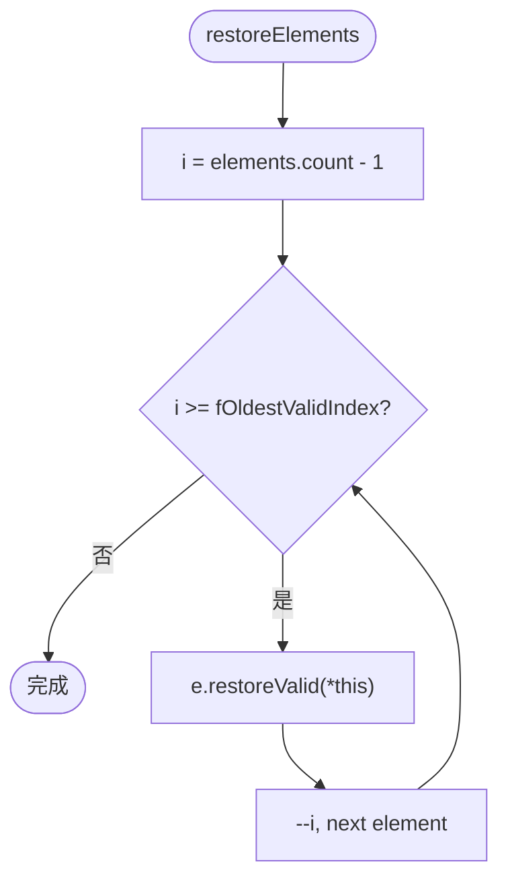

---

### 7.3 invalidateMasks() (line 911-920)

```cpp
void SaveRecord::invalidateMasks(GrProxyProvider* proxyProvider, Mask::Stack* masks) {
    while (masks->count() > fStartingMaskIndex) {
        masks->back().invalidate(proxyProvider);
        masks->pop_back();
    }
}
```

弹出并失效属于本 SaveRecord 的所有 Mask。通过 `processInvalidUniqueKey` 通知 GPU 释放纹理资源。

---

## 8. addElement() — 元素入栈总控 (line 945-1040)

### 8.1 前置校验 (SkASSERT 语义)

```cpp
SkASSERT((toAdd.shape().isEmpty() || !toAdd.outerBounds().isEmpty()) &&
         (toAdd.innerBounds().isEmpty() || toAdd.outerBounds().contains(toAdd.innerBounds())));
SkASSERT(this->canBeUpdated());
```

两个不变量:
1. 非空 shape 必须有非空 outerBounds; 非空 innerBounds 必须被 outerBounds 包含
2. 只有活跃记录 (deferCount==0) 才能被修改

---

### 8.2 快速退出: kEmpty 已空 / shape 为空

```cpp
if (fState == ClipState::kEmpty) {
    return false;  // 已空，再裁也是空
}
if (toAdd.shape().isEmpty()) {
    SkASSERT(toAdd.op() == SkClipOp::kIntersect);
    fState = ClipState::kEmpty;
    return true;  // 空形状 intersect = 全空
}
```

---

### 8.3 get_clip_geometry 几何关系四路分支

调用 `get_clip_geometry(*this, toAdd)` 对比 SaveRecord 的聚合边界与新元素:

| 结果 | 含义 | 动作 |
|------|------|------|
| `kEmpty` | 组合后为空 | `fState = kEmpty`, return true |
| `kAOnly` | 新元素不比已有栈更严格 | return false (不记录) |
| `kBOnly` | 新元素完全取代已有栈 | `replaceWithElement()` |
| `kBoth` | 需要保留两者 | 继续处理 |

---

### 8.4 kBoth 分支: op 组合边界更新 (line 995-1031)

当结果为 kBoth 时:
1. 如果 `fState == kWideOpen` → 也走 `replaceWithElement()` (WideOpen + kBoth 相当于 kBOnly)
2. 否则根据 op 组合更新边界 (见 [§3.4 四种 op 组合](#34-四种-op-组合--worked-examples-具体数值))
3. 然后调用 `appendElement()`

---

### 8.5 完整流程图

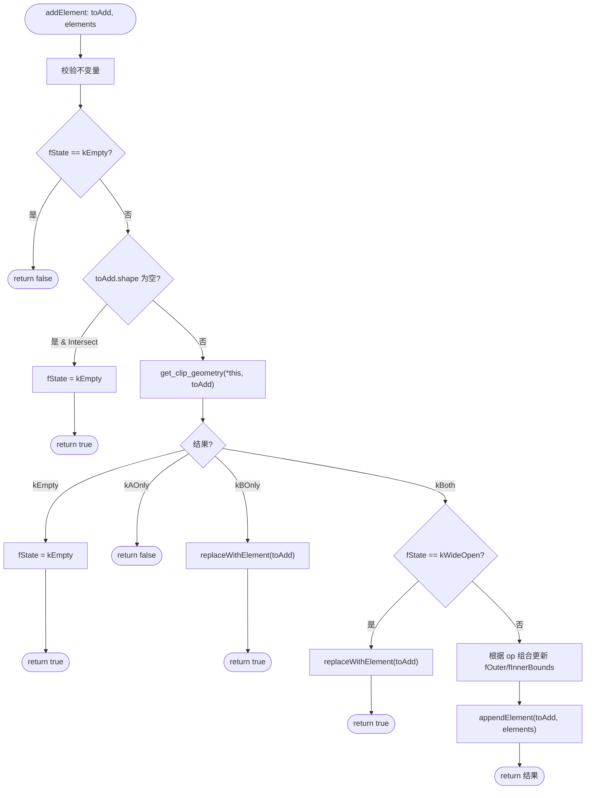

---

## 9. appendElement() — 栈维护核心 (line 1042-1133)

### 9.1 三指针初始值与语义

```cpp
int i = elements->count() - 1;
int youngestValid = fStartingElementIndex - 1;
int oldestValid = elements->count();
RawElement* oldestActiveInvalid = nullptr;
int oldestActiveInvalidIndex = elements->count();
```

| 指针 | 初始值 | 最终语义 |
|------|--------|---------|
| `youngestValid` | `fStartingElementIndex - 1` (比起始索引小1 = "无") | 循环后: 最年轻的仍有效元素索引 |
| `oldestValid` | `elements->count()` (比栈顶大 = "无") | 循环后: 最古老的仍有效元素索引 |
| `oldestActiveInvalid` | `nullptr` | 循环后: 最古老的**活动区**失效元素指针 (可复用) |
| `oldestActiveInvalidIndex` | `elements->count()` | 循环后: 上述元素的索引 |

**"活动区"** = `[fStartingElementIndex, count-1]`，即本 SaveRecord 拥有的元素。

---

### 9.2 逆序遍历: updateForElement 交互详解

```cpp
for (RawElement& existing : elements->ritems()) {
    if (i < fOldestValidIndex) break;
    existing.updateForElement(&toAdd, *this);
    // ... 判定分支
    --i;
}
```

遍历方向: 从栈顶 (最新) 到 `fOldestValidIndex` (最旧有效)。

对每个 `existing` 元素，调用 `updateForElement(&toAdd, *this)`，这个方法会:
1. 计算 `get_clip_geometry(existing, toAdd)` → 四种结果
2. 根据结果可能标记 existing 或 toAdd 失效
3. 在 kBoth 情况下尝试 `combine()` 合并形状

---

### 9.3 循环体四路判定

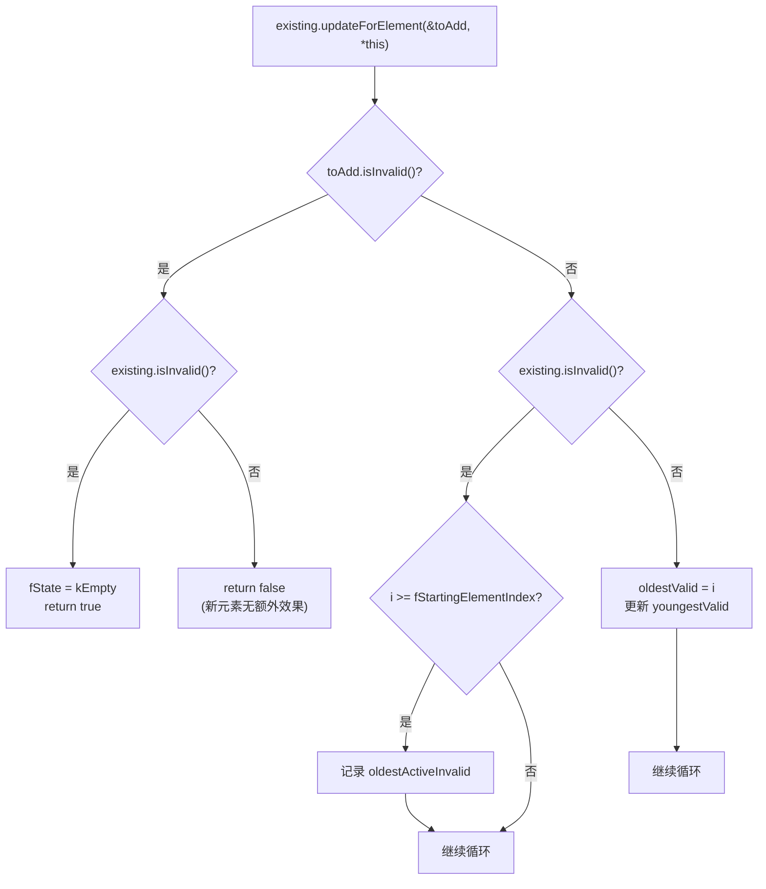

**四种情况解读**:

| toAdd | existing | 含义 | 动作 |
|-------|----------|------|------|
| 失效 | 失效 | 整个裁剪为空 | `fState=kEmpty`, return true |
| 失效 | 有效 | 新元素被旧元素完全覆盖 | return false (丢弃 toAdd) |
| 有效 | 失效 | 新元素使旧元素冗余 | 记录可复用位置 |
| 有效 | 有效 | 两者都需要保留 | 更新 valid 指针 |

---

### 9.4 Post-loop 状态更新 (line 1095-1110)

```cpp
// 1. 更新 fOldestValidIndex
fOldestValidIndex = std::min(oldestValid, oldestActiveInvalidIndex);

// 2. 更新 fState
fState = (oldestValid == elements->count()) ? toAdd.clipType() : ClipState::kComplex;

// 3. 可能切换 fStackOp
if (fStackOp == kDifference && toAdd.op() == kIntersect) {
    fStackOp = kIntersect;
}
```

**解读**:
- 如果 `oldestValid == elements->count()` 说明循环中没找到任何仍有效的旧元素 → 只有 toAdd 一个有效元素 → state 取 toAdd 的 clipType
- 否则有多个有效元素 → state = kComplex
- `fOldestValidIndex` 取 oldestValid 和 oldestActiveInvalidIndex 中较小的 (因为复用位置也需要在遍历范围内)

---

### 9.5 栈清理与元素放置 (line 1112-1128)

```cpp
int targetCount = youngestValid + 1;
if (!oldestActiveInvalid || oldestActiveInvalidIndex >= targetCount) {
    targetCount++;
    oldestActiveInvalid = nullptr;
}
while (elements->count() > targetCount) {
    elements->pop_back();
}
if (oldestActiveInvalid) {
    *oldestActiveInvalid = std::move(toAdd);
} else if (elements->count() < targetCount) {
    elements->push_back(std::move(toAdd));
} else {
    elements->back() = std::move(toAdd);
}
```

**三种放置策略**:

| 条件 | 策略 | 解释 |
|------|------|------|
| `oldestActiveInvalid` 有值且在 targetCount 内 | 复用失效位 | 避免栈增长，将新元素写入旧失效元素的位置 |
| 栈 count < targetCount | push_back | 栈被缩小过头，需要追加 |
| 栈 count == targetCount | 覆写 back() | 正好在栈顶位置写入 |

**targetCount 计算逻辑**:
- `youngestValid + 1` = 最年轻有效元素之后的位置
- 如果没有可复用的失效位 (或它在 targetCount 之外)，需要额外一个位置给 toAdd

---

### 9.6 Worked Example: 6 元素场景完整追踪

**初始状态**:
```
fStartingElementIndex = 2, fOldestValidIndex = 1
Elements: [E0✓, E1✓, E2✓, E3✓, E4✓, E5✓]  (count=6)
                  ^oldestValid  ^startingIdx
```

**操作**: `appendElement(toAdd)` — 假设 toAdd 是 Intersect 且:
- E5: updateForElement → kBoth, combine 失败 → 两者有效
- E4: updateForElement → kBOnly → E4.markInvalid()
- E3: updateForElement → kAOnly → toAdd.markInvalid() ... 等等不行 toAdd 失效了就停

让我换一个更有代表性的场景:

**操作**: `appendElement(toAdd)` — toAdd 比 E4 更严格但不影响其他:
- E5: updateForElement → kBoth (两者不可简化) → 两者有效 → youngestValid=5, oldestValid=5
- E4: updateForElement → kBOnly (toAdd 取代 E4) → E4.markInvalid() → oldestActiveInvalid=&E4, index=4
- E3: updateForElement → kBoth → 两者有效 → oldestValid=3
- E2: updateForElement → kBoth → 两者有效 → oldestValid=2
- E1: updateForElement → kBoth → 两者有效 → oldestValid=1
- (i=0 < fOldestValidIndex=1 → break)

**循环结束后**:
```
youngestValid = 5
oldestValid = 1
oldestActiveInvalid = &E4 (index=4)
oldestActiveInvalidIndex = 4
```

**Post-loop 更新**:
```
fOldestValidIndex = min(1, 4) = 1
fState = kComplex (oldestValid=1 ≠ count=6)
targetCount = youngestValid + 1 = 6
oldestActiveInvalidIndex(4) < targetCount(6) → 使用复用策略
```

**清理与放置**:
```
elements->count() == 6 == targetCount → 无需 pop
*oldestActiveInvalid = std::move(toAdd)  → E4 的位置被 toAdd 覆写
```

**最终状态**:
```
Elements: [E0✓, E1✓, E2✓, E3✓, toAdd✓, E5✓]  (count=6, E4 被复用)
fOldestValidIndex = 1
fState = kComplex
fGenID = next_gen_id()
```

---

## 10. replaceWithElement() (line 1135-1158)

```cpp
void SaveRecord::replaceWithElement(RawElement&& toAdd, RawElement::Stack* elements) {
    fInnerBounds = toAdd.innerBounds();
    fOuterBounds = toAdd.outerBounds();
    fStackOp = toAdd.op();
    fState = toAdd.clipType();

    int targetCount = fStartingElementIndex + 1;
    while (elements->count() > targetCount) {
        elements->pop_back();
    }
    if (elements->count() < targetCount) {
        elements->push_back(std::move(toAdd));
    } else {
        elements->back() = std::move(toAdd);
    }

    fOldestValidIndex = fStartingElementIndex;
    fGenID = next_gen_id();
}
```

**语义**: 新元素完全取代本 SaveRecord 的所有活动元素。

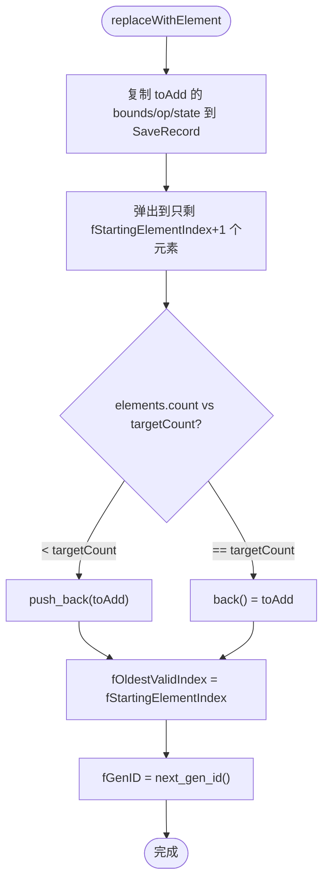

**调用时机**: `addElement()` 中 kBOnly 或 kWideOpen+kBoth 时使用。效果是将整个活动元素栈压缩为单个元素。

**对更低层 SaveRecord 的影响**: `fOldestValidIndex = fStartingElementIndex` 意味着本记录不再"看到"更低层的元素。但那些元素并未被删除 (它们属于更低层的 SaveRecord)，restore 时会恢复可见性。

---

## 11. addShader() (line 932-943)

```cpp
void SaveRecord::addShader(sk_sp<SkShader> shader) {
    SkASSERT(shader);
    SkASSERT(this->canBeUpdated());
    if (!fShader) {
        fShader = std::move(shader);
    } else {
        fShader = SkShaders::Blend(SkBlendMode::kSrcIn, std::move(shader), fShader);
    }
}
```

多个 shader 通过 `kSrcIn` 混合合并 (乘法语义: 总覆盖率 = shader1 × shader2 × ...)。

**注意**: 添加 shader 不会改变 genID，也不会使 mask 失效。这是因为 shader 不影响几何裁剪逻辑。

---

## 12. ClipStack 公共 API 交互

### 12.1 save() / restore() 完整流程

#### save() (line 1208-1211)

```cpp
void ClipStack::save() {
    fSaves.back().pushSave();  // fDeferredSaveCount++
}
```

仅递增计数器，无内存分配。

#### restore() (line 1213-1231)

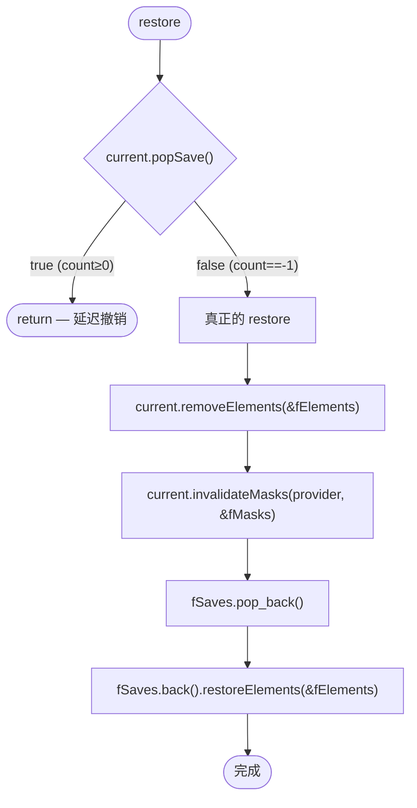

**restore 四步**:
1. **removeElements**: 删除本 SaveRecord 拥有的元素 (index ≥ fStartingElementIndex)
2. **invalidateMasks**: 释放本 SaveRecord 的遮罩纹理
3. **pop_back**: 销毁 SaveRecord 本身
4. **restoreElements**: 新栈顶恢复被旧记录 invalidate 的元素

---

### 12.2 clip() 中的 SaveRecord 协作 (line 1595-1641)

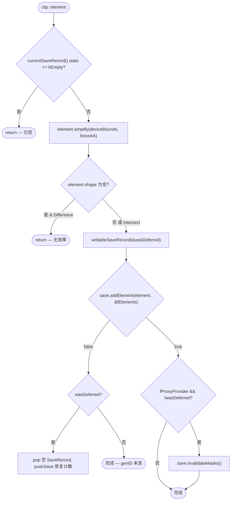

**关键回滚逻辑**: 如果 `wasDeferred=true` (创建了新 SaveRecord) 但 `addElement` 返回 false (元素没有实际效果)，则回滚: 删除空的新 SaveRecord，恢复旧记录的计数器。

---

### 12.3 replaceClip() 与 reset (line 1580-1593)

```cpp
void ClipStack::replaceClip(const SkIRect& rect) {
    bool wasDeferred;
    SaveRecord& save = this->writableSaveRecord(&wasDeferred);

    if (!wasDeferred) {
        save.removeElements(&fElements);
        save.invalidateMasks(fProxyProvider, &fMasks);
    }

    save.reset(fDeviceBounds);
    if (rect != fDeviceBounds) {
        this->clipRect(SkMatrix::I(), SkRect::Make(rect), GrAA::kNo, SkClipOp::kIntersect);
    }
}
```

**流程**: 获取可写 SaveRecord → 清理旧元素和遮罩 → 重置为 WideOpen → 如果 rect 不等于设备全边界，再添加一个 intersect rect。

---

## 附录 A: SaveRecord 生命周期状态机

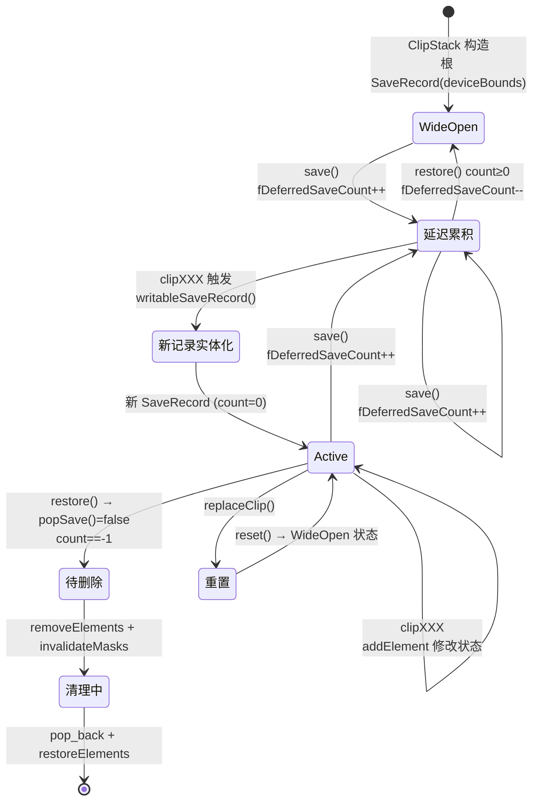

---

## 附录 B: appendElement Worked Example (6 元素完整追踪表)

**场景**: 4 个已有元素，添加新元素 `N`。

初始:
```
fStartingElementIndex = 1, fOldestValidIndex = 0
Elements: [E0✓(Intersect), E1✓(Intersect), E2✓(Difference), E3✓(Intersect)]
index:      0                1                2                 3
```

**添加 N (Intersect, 包含 E3 但与其他不可简化)**:

| 遍历 i | existing | updateForElement 结果 | toAdd状态 | existing状态 | 更新 |
|---------|----------|----------------------|-----------|-------------|------|
| 3 | E3 | kBOnly (N比E3严格) | 有效 | **失效** | oldestActiveInvalid=E3, idx=3 |
| 2 | E2 | kBoth (不可简化) | 有效 | 有效 | youngestValid=2, oldestValid=2 |
| 1 | E1 | kBoth (不可简化) | 有效 | 有效 | oldestValid=1 |
| 0 | E0 | kBoth (不可简化) | 有效 | 有效 | oldestValid=0 |

**Post-loop 计算**:
```
youngestValid = 2 (在活动区 [1,3] 内最年轻的有效)
  等等更正: youngestValid 在循环中只有当 i > youngestValid 且有效时才更新
  初始 youngestValid = fStartingElementIndex - 1 = 0
  i=3: E3 失效 → 不更新
  i=2: E2 有效, 2 > 0 → youngestValid = 2
  i=1: E1 有效, 1 > 2? 否 → 不更新
  i=0: < fOldestValidIndex(0) 时不 break (只有 < 时才 break), i==0 时处理
  实际 i=0: E0 有效, 0 > 2? 否 → 不更新

最终: youngestValid = 2, oldestValid = 0, oldestActiveInvalidIndex = 3

fOldestValidIndex = min(0, 3) = 0
fState = kComplex (oldestValid=0 ≠ count=4)
targetCount = youngestValid + 1 = 3
oldestActiveInvalidIndex(3) >= targetCount(3) → 不复用, targetCount++ → 4
oldestActiveInvalid = nullptr
```

**清理**:
```
elements->count() == 4 == targetCount → 无需 pop
oldestActiveInvalid == nullptr, count == targetCount → elements->back() = toAdd
```

**最终**:
```
Elements: [E0✓, E1✓, E2✓, N✓]  (E3 位置被 N 覆写)
fOldestValidIndex = 0
fState = kComplex
fGenID = next_gen_id()
```

---

## 附录 C: 典型使用序列 (sequenceDiagram)

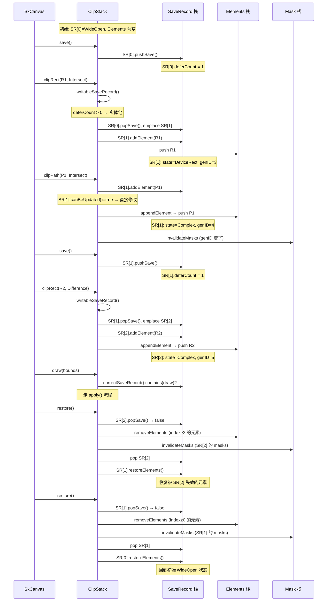
