# Ganesh ClipStack 函数实现参考

> 源码: `src/gpu/ganesh/ClipStack.cpp` (1702行)
> 头文件: `src/gpu/ganesh/ClipStack.h`
> 子文档: [`ClipStack.SaveRecord.cn.md`](./ClipStack.SaveRecord.cn.md) — SaveRecord 延迟保存/元素生命周期/边界算术/缓存失效机制

---

## 类型速查

阅读后续函数流程图前，建议先熟悉以下类型。按职责分为 7 组。

### 1. ClipStack 自身定义的类型

| 类型 | 含义 |
|------|------|
| `ClipState` | 枚举 (`kEmpty` / `kWideOpen` / `kDeviceRect` / `kDeviceRRect` / `kComplex`) |
| `Element` | 公共结构体，包含 `fShape` + `fLocalToDevice` + `fOp` + `fAA` |
| `RawElement` | 内部类，继承 Element 增加边界/失效管理 |
| `SaveRecord` | 内部类，保存点 + 元素生命周期管理 |
| `Mask` | 内部类，SW 遮罩缓存 |
| `Draw` | 内部类，封装绘制边界用于裁剪判定 |
| `ElementIter` | 迭代器类 |
| `ClipGeometry` | 匿名命名空间枚举 (`kEmpty` / `kAOnly` / `kBOnly` / `kBoth`) |

### 2. 几何/数学类型 (Skia Core)

| 类型 | 含义 |
|------|------|
| `SkMatrix` | 3×3 变换矩阵 |
| `SkRect` | 浮点矩形 |
| `SkIRect` | 整数矩形 |
| `SkRRect` | 圆角矩形 |
| `SkPath` | 路径 |
| `SkPoint` | 2D 点 |
| `GrShape` | 形状统一封装 (Rect / RRect / Path / Arc / Point / Line) |
| `GrQuad` | 四边形 (4 个 2D 点) |

### 3. 裁剪操作/策略相关

| 类型 | 含义 |
|------|------|
| `SkClipOp` | 裁剪操作枚举 (`kIntersect` / `kDifference`) |
| `GrAA` | 抗锯齿开关 (`kYes` / `kNo`) |
| `GrAAType` | AA 类型 (`kNone` / `kCoverage` / `kMSAA`) |
| `GrClipEdgeType` | 裁剪边缘类型 (`kFillAA` / `kFillBW` / `kInverseFillAA` / `kInverseFillBW`) |
| `GrClip` | 裁剪接口基类 |
| `GrClip::Effect` | `apply` 返回值 (`kClippedOut` / `kClipped` / `kUnclipped`) |
| `GrClip::PreClipResult` | `preApply` 返回值 |
| `GrAppliedClip` | 裁剪应用结果输出容器 |
| `GrWindowRectangles` | 窗口矩形排除列表 |
| `GrWindowRectsState` | 窗口矩形状态 |
| `SkRegion::Op` | 区域操作 (`kReplace` / `kIntersect` / `kDifference`) |

### 4. 渲染管线/上下文

| 类型 | 含义 |
|------|------|
| `GrRecordingContext` | GPU 录制上下文 |
| `GrDirectContext` | GPU 直接上下文 (可执行命令) |
| `SurfaceDrawContext` | 渲染目标绘制上下文 |
| `GrDrawOp` | 绘制操作基类 |
| `GrDrawOp::ClipResult` | Op 内部裁剪结果 |
| `GrCaps` | GPU 能力查询 |
| `GrShaderCaps` | Shader 能力查询 |

### 5. Fragment Processor (着色器)

| 类型 | 含义 |
|------|------|
| `GrFragmentProcessor` | Fragment Processor 基类 |
| `GrFPResult` | FP 创建结果 (success/failure + fp) |
| `GrFPArgs` | FP 创建参数包 |
| `GrTextureEffect` | 纹理采样 FP |
| `GrBlendFragmentProcessor` | 混合 FP |
| `GrConvexPolyEffect` | 凸多边形解析裁剪 FP |
| `GrRRectEffect` | 圆角矩形解析裁剪 FP |
| `SkShader` / `sk_sp<SkShader>` | 着色器 + 智能指针 |

### 6. 纹理/代理/资源

| 类型 | 含义 |
|------|------|
| `GrProxyProvider` | 纹理代理工厂 |
| `GrSurfaceProxyView` | 代理 + origin + swizzle 组合视图 |
| `GrSurfaceProxy` / `GrTextureProxy` / `GrRenderTargetProxy` | 代理类型 |
| `GrBackendFormat` | 后端纹理格式 |
| `GrColorType` | 颜色格式 (`kAlpha_8` 等) |
| `GrSurfaceOrigin` | 纹理原点方向 (`kTopLeft` / `kBottomLeft`) |
| `GrRenderable` | 是否可渲染 |
| `GrProtected` | 是否受保护内存 |
| `skgpu::Mipmapped` | 是否 mipmap |
| `skgpu::Budgeted` | 是否纳入 GPU 内存预算 |
| `skgpu::Swizzle` | 颜色通道重排 |
| `SkBackingFit` | 纹理分配策略 (`kExact` / `kApprox`) |
| `UniqueKey` / `UniqueKey::Domain` / `UniqueKey::Builder` | 资源缓存键 |
| `GrSamplerState` | 纹理采样器状态 |
| `GrSWMaskHelper` | SW 遮罩光栅化工具 |
| `StencilMaskHelper` | Stencil 遮罩渲染工具 |
| `GrTDeferredProxyUploader` | 延迟纹理上传器 |
| `AtlasPathRenderer` | Atlas 路径渲染器 |

### 7. 容器/工具

| 类型 | 含义 |
|------|------|
| `SkTBlockList<T, N>` | 分块链表 (元素/遮罩/保存记录的存储) |
| `STArray<N, T>` | 栈分配小数组 |
| `TArray<T>` | 动态数组 |
| `SkTaskGroup` | 多线程任务组 |
| `SkBlendMode` | 混合模式枚举 |

---

## ClipStack 在 Skia 工程中的架构位置

| 属性 | 说明 |
|------|------|
| **归属** | `skgpu::ganesh::Device` 持有 `ClipStack` 实例 |
| **接口** | 实现 `GrClip` 接口，提供 `apply()` / `preApply()` / `getConservativeBounds()` |
| **上游** | `SkCanvas.clipRect/clipRRect/clipPath` → `Device.clipXxx` → `ClipStack::clip()` |
| **下游** | `apply()` → `GrAppliedClip` (scissor / window rect / stencil / coverage FP) |

**裁剪策略优先级** (从高到低):

1. Op 内部裁剪 (`clipToShape`)
2. HW scissor / window rectangles
3. 解析 Fragment Processor (analytic FP)
4. Atlas 路径渲染器
5. Stencil 遮罩
6. SW 遮罩 (软件光栅化)

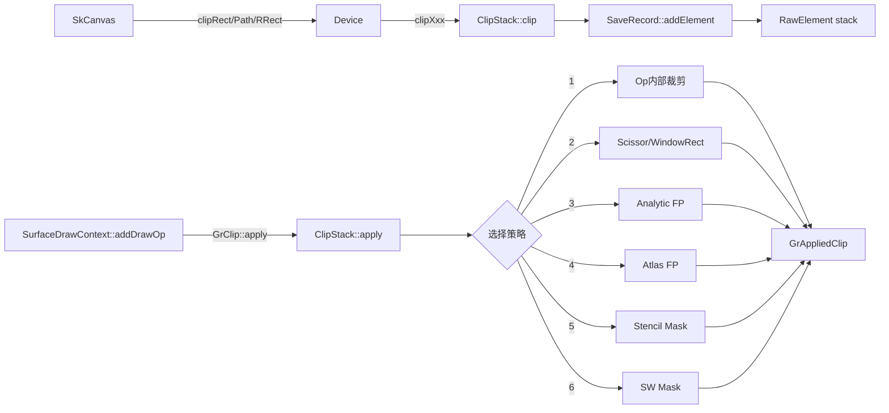

---

## 架构总览

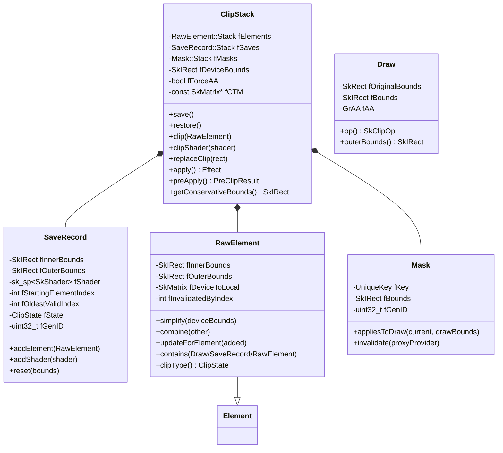

---

## 1. 匿名命名空间工具函数

### 1.1 `get_clip_geometry()` (line 93-159)

模板函数，判断两个裁剪形状 A 和 B 在给定 op 组合下的几何关系。

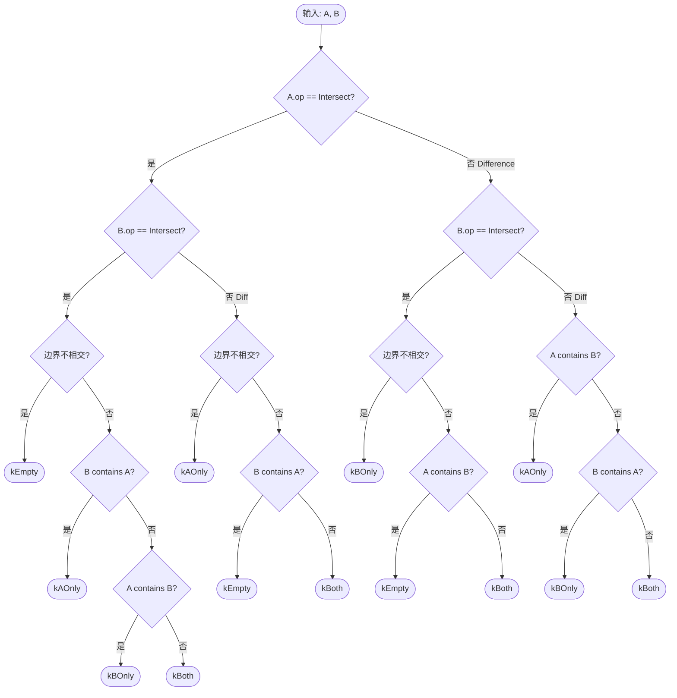

**返回值含义**:
- `kEmpty` — 组合后裁剪区为空
- `kAOnly` — 只需要 A（B 冗余）
- `kBOnly` — 只需要 B（A 冗余）
- `kBoth` — 两者都需要保留

---

### 1.2 `shape_contains_rect()` (line 166-208)

判断凸形 `a`（在 `aToDevice` 空间中）是否完全包含矩形 `b`（在 `bToDevice` 空间中）。

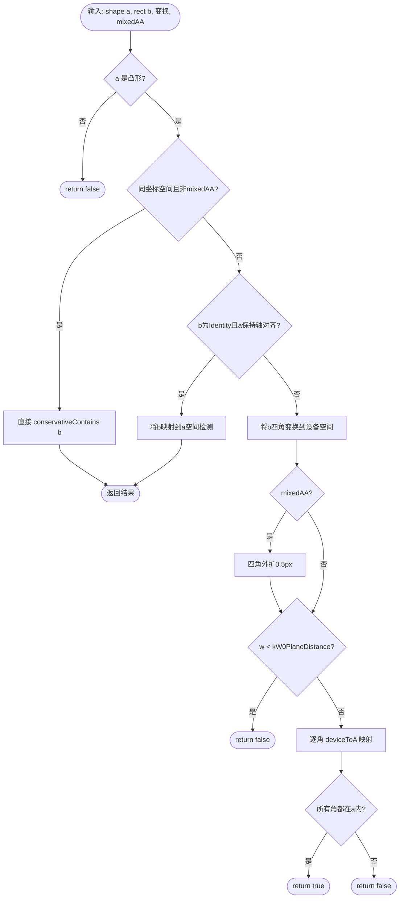

---

### 1.3 `subtract()` (line 210-220)

矩形减法: 计算 `a - b` 的最大子矩形。

**实现** (简短函数，文字描述):
1. 调用 `SkRectPriv::Subtract(a, b, &diff)` 尝试精确减法
2. 若精确成功或不需要精确结果(`!exact`) → 返回 `diff`
3. 否则返回原始 `a`（减法不可精确表示时保守返回全部）

---

### 1.4 `get_clip_edge_type()` (line 222-228)

从 `(op, aa)` 映射到 `GrClipEdgeType`。

| op | aa | 结果 |
|----|-----|------|
| Intersect | Yes | `kFillAA` |
| Intersect | No | `kFillBW` |
| Difference | Yes | `kInverseFillAA` |
| Difference | No | `kInverseFillBW` |

**语义说明** — `GrClipEdgeType` 由两个维度组合:

| 维度 | 值 | 含义 |
|------|-----|------|
| Fill 方向 | `Fill` | 保留几何图元**内部**像素 (对应 `kIntersect`) |
| | `InverseFill` | 保留几何图元**外部**像素 (对应 `kDifference`) |
| 抗锯齿 | `AA` | 边缘平滑过渡 (coverage 渐变 0→1) |
| | `BW` | 边缘硬切 (二值 0 或 1) |

此类型传给解析裁剪 FP 工厂 (`GrConvexPolyEffect`、`GrRRectEffect` 等)，决定 FP 输出 coverage 的方向和边缘质量。

---

### 1.5 `next_gen_id()` (line 234-244)

原子递增生成唯一 gen ID。保留值: 0=Invalid, 1=Empty, 2=WideOpen, >=3 为有效 ID。

**实现**: 使用 `std::atomic<uint32_t>` 的 `fetch_add`，若结果 < 3 则重试。

---

### 1.6 `analytic_clip_fp()` (line 256-277)

尝试为裁剪元素创建解析 Fragment Processor（无需光栅化遮罩）。

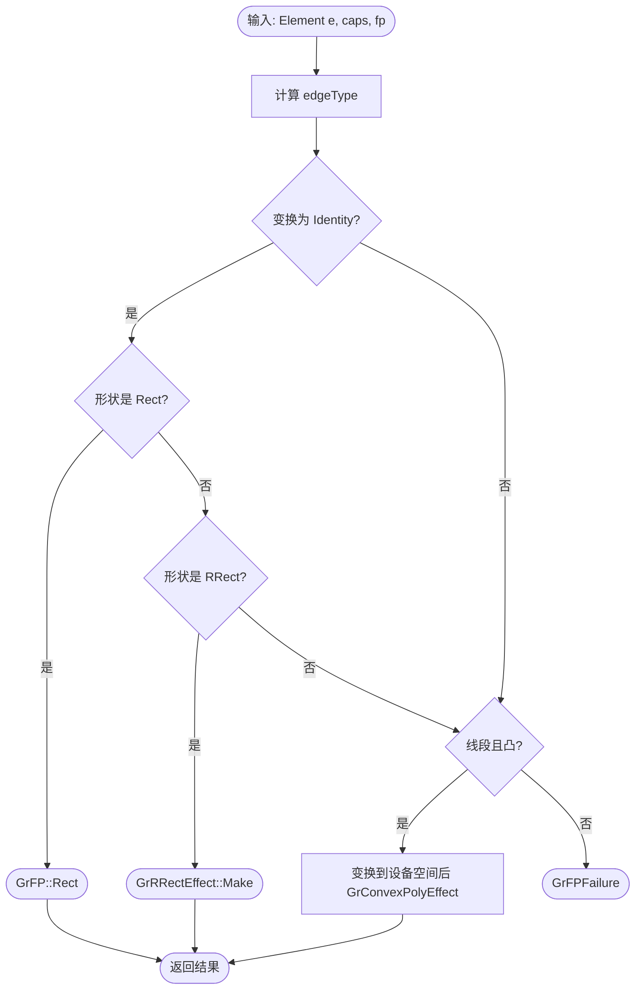

---

### 1.7 `clip_atlas_fp()` (line 282-299)

尝试通过 Atlas 路径渲染器创建裁剪 FP。

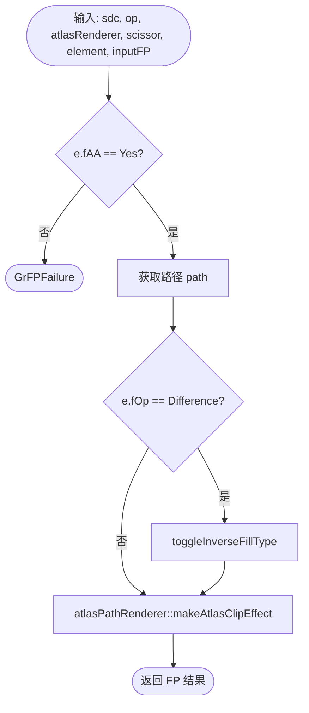

---

### 1.8 `draw_to_sw_mask()` (line 301-347)

将单个裁剪元素绘制到 SW 遮罩 helper。

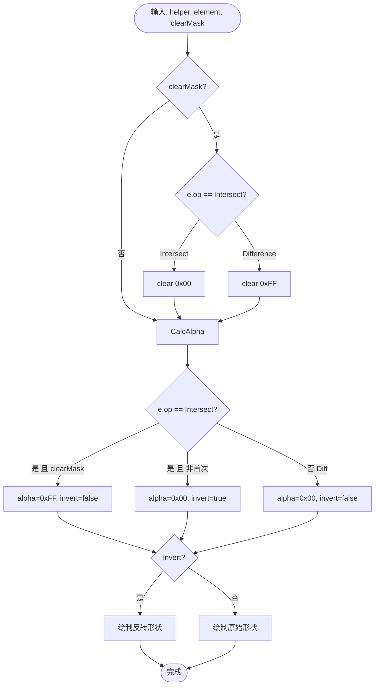

**设计原理** — 为什么 Intersect 非首元素用 invert 绘制？

所有元素统一使用 `kReplace_Op`（像素覆写），没有乘法/min 混合模式可用。在此约束下：

| 策略 | 操作 | 效果 | 正确性 |
|------|------|------|--------|
| ❌ 正向画形状 (alpha=0xFF) | 形状内像素 → 0xFF | 覆盖先前元素累积值，丢失历史信息 | 等价于 Union |
| ✅ 反转画形状 (alpha=0x00) | 形状外像素 → 0x00，内部不触及 | 外部清零 + 内部保留 = 交集语义 | 正确 |

直觉对照：
- "与形状求交" 的语义 = "消除形状外部" 而非 "填充形状内部"
- 用 invert+0x00 **擦除外部** 而非用 direct+0xFF **填充内部**，恰好绕开了 Replace 无法"保持原值"的限制

对比首元素 (`clearMask=true`): mask 初始全零无历史信息，正向画 alpha=0xFF 直接标记形状内部即可。

---

### 1.9 `render_sw_mask()` (line 349-418)

渲染完整 SW 遮罩，支持多线程。

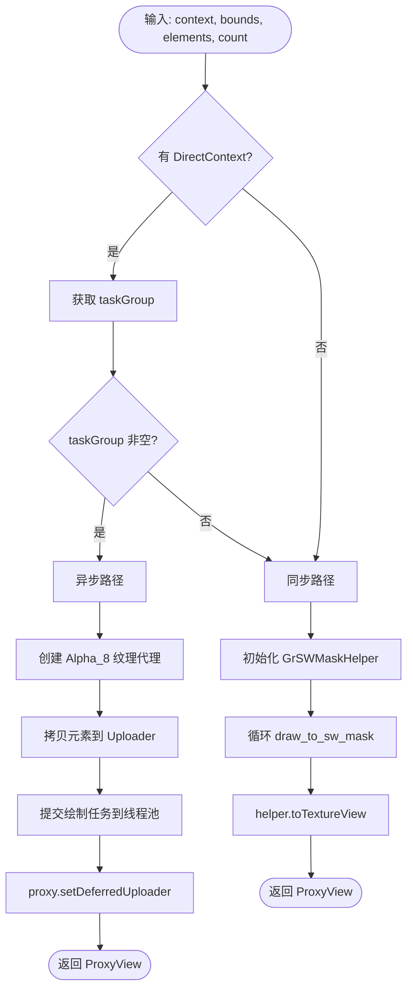

---

### 1.10 `render_stencil_mask()` (line 420-445)

渲染 stencil 遮罩。

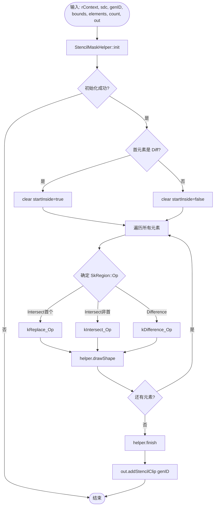

**SW Mask vs Stencil Mask 对比**

两者是 Skia 裁剪遮罩的两种渲染策略，功能等价但实现路径完全不同：

| 维度 | SW Mask (`render_sw_mask`) | Stencil Mask (`render_stencil_mask`) |
|------|---------------------------|--------------------------------------|
| 渲染位置 | CPU 软件光栅化 | GPU 模板缓冲区 |
| 输出形式 | Alpha_8 纹理 (GrSurfaceProxyView) | 写入 stencil buffer，无纹理返回 |
| 消费方式 | Fragment shader 采样纹理 | 硬件 stencil test 自动裁剪 |
| 多线程 | 支持（TaskGroup 异步渲染） | 不支持（GPU 命令流顺序执行） |
| Op 实现方式 | 全部使用 kReplace_Op + alpha/invert 技巧 | 直接使用 kIntersect/kDifference/kReplace Op |
| AA 支持 | 天然支持（alpha 覆盖率精确到像素） | 不支持 AA（stencil 仅 0/1 二值） |

**选择策略** (见 `ClipStack::apply()` line 1520-1543):

```
if (非 MSAA 表面 && 需要 AA) || (stencil 不可用):
    → 使用 SW Mask
else:
    → 使用 Stencil Mask
```

**本质区别**：
- SW Mask 将裁剪结果编码为**纹理中的 alpha 值**，后续绘制时在 fragment shader 中与 alpha 相乘实现裁剪
- Stencil Mask 利用 GPU 硬件的**模板测试**功能，在光栅化阶段直接丢弃不通过的像素，无需额外纹理
- SW Mask 因为只有 `kReplace_Op` 可用，不得不用 invert 技巧模拟交集（见 1.8 设计原理）；Stencil Mask 的 helper 原生支持 Intersect/Difference op，逻辑更直接

**SW Mask 使用 CPU 光栅化的设计原因**：

SW Mask 选择 CPU 而非 GPU 渲染，并非技术限制，而是架构权衡的最优选择：

| 设计考量 | 说明 |
|---------|------|
| 可并行化 | SW Mask 通过 `SkTaskGroup` 在后台线程异步渲染，不阻塞 GPU 命令流录制 |
| 任意路径通用性 | CPU scanline 算法 (`SkDraw` → `SkScan` → `SkA8Blitter`) 可处理任意复杂度的路径，无需 PathRenderer 适配 |
| 无 GPU 资源依赖 | 不需要 renderable RenderTarget、stencil buffer 或 MSAA 支持 |
| 精确 AA 覆盖率 | Alpha_8 纹理天然编码亚像素覆盖率 (0-255)，比 stencil 的 0/1 二值更精确 |
| 适用场景 | 非 MSAA 表面上的 AA 裁剪 —— 此时 stencil 无法提供 AA，GPU 渲染反而需要额外 resolve pass |

核心洞察：SW Mask 的 CPU 计算代价被以下因素抵消：
1. 裁剪遮罩通常尺寸较小（scissorBounds 限定）
2. 后台线程并行不阻塞主线程
3. 结果可缓存复用（`fMasks` 池），避免重复计算

**Stencil Mask 的 GPU 渲染管线**（源码: `StencilMaskHelper.cpp`, 520行）：

Stencil Mask **完全运行在 GPU 上**，通过 `StencilMaskHelper` 驱动硬件 stencil buffer：

```mermaid
flowchart TD
    Entry["StencilMaskHelper::drawShape()"] --> IsRect{shape.isRect()?}
    IsRect -->|Yes| DrawRect["drawRect()<br/>sdc→stencilRect()"]
    IsRect -->|No| DrawPath["drawPath()"]
    DrawPath --> FindPR["getPathRenderer()<br/>DrawType::kStencil"]
    FindPR --> GetPass["get_stencil_passes(op, stencilSupport, fillInverted)"]
    GetPass --> CanDirect{drawDirectToClip?}
    CanDirect -->|Yes| Direct["draw_path() with clip stencil settings"]
    CanDirect -->|No| TwoPass["Pass 1: stencil_path() / draw_path(&gDrawToStencil)<br/>Pass 2: cover rect with clip stencil passes"]
    DrawRect --> Done["clip bit 已写入 stencil buffer"]
    Direct --> Done
    TwoPass --> Done
```

**Stencil Settings 查表机制** (`gUserToClipTable[inverted][op][pass]`):

| Op | Normal Fill (pass 0) | Inverse Fill (pass 0) | 需要 Pass 1? |
|----|---------------------|----------------------|-------------|
| kDifference | `gUserToClipDiff` (EqualIfInClip → SetClip) | `gUserToClipIsect` | 否 |
| kIntersect | `gUserToClipIsect` (LessIfInClip → SetClip) | `gUserToClipDiff` | 否 |
| kUnion | `gUserToClipUnion` (NotEqual → SetClip/Keep) | `gInvUserToClipUnionPass0` + `gZeroUserBits` | Inverse 需要 |
| kXOR | `gUserToClipXorPass0` (InvertClipBit) + `gZeroUserBits` | `gInvUserToClipXorPass0` + `gZeroUserBits` | 是 |
| kReverseDiff | `gUserToClipRDiffPass0` + `gZeroUserBits` | `gInvUserToClipRDiffPass0` + `gZeroUserBits` | 是 |
| kReplace | `gUserToClipReplace` (NotEqual → SetClip) | `gInvUserToClipReplace` (Equal → SetClip) | 否 |

**多 Pass 机制详解**：

当路径不能直接写入 clip bit（`drawDirectToClip = false`）时，采用两阶段渲染：
1. **Pass 1 — 写入 user stencil bits**: 使用 `gDrawToStencil`（IncMaybeClamp）标记路径覆盖区域
2. **Pass 2+ — 应用 clip 逻辑**: 遍历 `gUserToClipTable[inv][op]` 中的 pass 数组，用全屏矩形 cover 整个 scissor 区域，根据 user bits 的值修改 clip bit

不能直接写入的条件：
- PathRenderer 的 `StencilSupport` 为 `kStencilOnly`（不支持任意 stencil settings）
- 路径使用 inverse fill

**调用链对比图**：

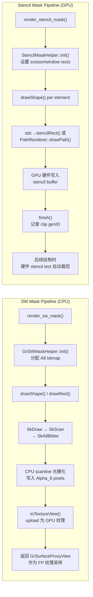

**关键源码引用**：
- `GrSWMaskHelper::init()` (line 120-136): 分配 `SkAutoPixmapStorage` 作为 A8 位图，设置 `SkA8Blitter_Choose` 作为 blitter
- `StencilMaskHelper::drawPath()` (line 417-489): 查找 PathRenderer → 获取 stencil passes → 多 pass 渲染
- `get_stencil_passes()` (line 274-295): 根据 op/stencilSupport/fillInverted 决定 direct draw 还是两阶段
- `ClipStack::apply()` (line 1520-1543): 选择 SW Mask 还是 Stencil Mask 的决策点

---

## 2. Draw 内部类 (line 451-482)

### 2.1 设计意义：统一的裁剪推理参与者

ClipStack 的核心推理引擎是模板函数 `get_clip_geometry<A, B>()`（line 92-159），它接受 Element、SaveRecord 或 Draw 的任意组合，通过 `op()` / `outerBounds()` / `contains()` 三个接口统一判定两个几何体的空间关系。

> Internally, a lot of clip reasoning is based on an op, outer bounds, and whether a shape
> contains another (possibly just conservatively based on inner/outer device-space bounds).
>
> Element and SaveRecord store this information directly, but a draw fits the same definition
> with an implicit intersect op and empty inner bounds.
>
> — `ClipStack.h:120-126`

Draw 是一个**适配器**：将原始的 `drawBounds` 矩形包装为与裁剪元素相同的接口，使 `get_clip_geometry()` 无需为绘制操作编写特殊分支。

Draw 的"弱性"体现在：
- **无 innerBounds** — 绘制区域内部形状未知（可能是任意 Path）
- **op 固定为 kIntersect** — 绘制操作永远是"取交集"语义
- **`contains()` 始终返回 false** — 无法保证完全覆盖任何区域

这种不对称反映了根本事实：clip 形状在 push 时已完全确定，而 draw 的精确形状在裁剪推理阶段仍不可知。

### 2.2 统一接口对比

| 方法 | Draw | RawElement | SaveRecord |
|------|------|-----------|------------|
| `op()` | 固定 `kIntersect` | 存储的 `fOp` | 聚合的 `fStackOp` |
| `outerBounds()` | 像素取整的 drawBounds | 设备空间形状外包围盒 | 所有元素的聚合边界 |
| `contains(Draw)` | N/A | 两级测试（innerBounds + 精确几何） | 仅 innerBounds 判定 |
| `contains(RawElement)` | 始终 false | innerBounds 或 shape 测试 | 仅 innerBounds 判定 |
| `contains(SaveRecord)` | 始终 false | innerBounds 判定 | — |

### 2.3 类结构

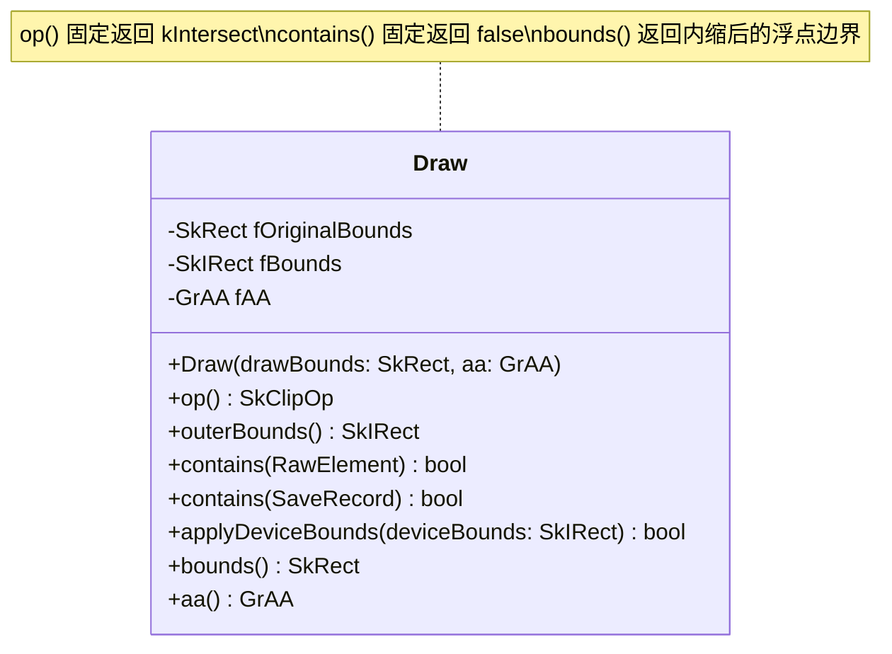

### 2.4 构造函数 (line 453-461)

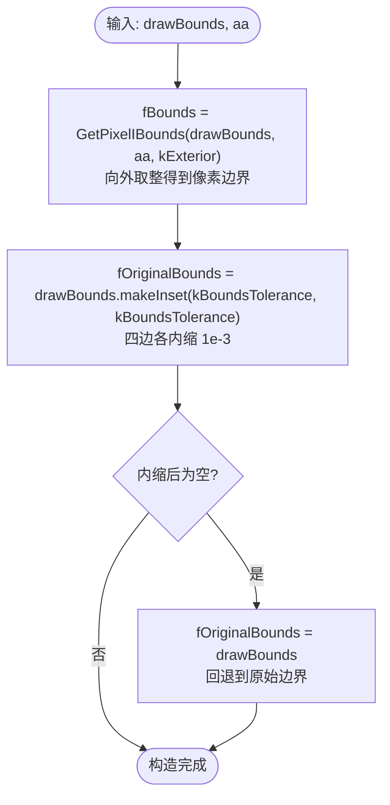

### 2.5 kBoundsTolerance 的作用

**值**: `1e-3f`，定义于 `GrClip.h:110`

> This is the maximum distance that a draw may extend beyond a clip's boundary and still count
> as "on the other side". We leave some slack because floating point rounding error is likely to
> blame. The rationale for 1e-3 is that in the coverage case (and barring unexpected rounding),
> as long as coverage stays within 0.5 * 1/256 of its intended value it shouldn't have any effect
> on the final pixel values.
>
> — `GrClip.h:103-110`

**在 Draw 中的效果**：

- 构造时将 `drawBounds` 四边各内缩 `1e-3`，得到 `fOriginalBounds`
- 当 `RawElement::contains(Draw)` 使用 `fOriginalBounds` 做精确几何测试时，即使 draw 边界"刚好超出 clip 边界一点点"（≤1e-3），也会被判定为 "contained"
- 效果：避免对这类 draw 施加不必要的裁剪开销——浮点误差范围内的微小溢出不影响最终像素值
- **安全保护**：若内缩导致矩形为空（说明 drawBounds 本身极小），回退到未内缩的原始 bounds

### 2.6 使用流程

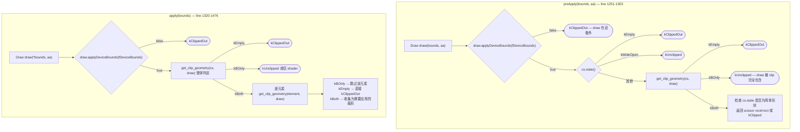

### 2.7 包含关系语义

#### Clip → Draw 方向

**`SaveRecord::contains(Draw)`** (line 882-884):

仅做一次 innerBounds 快检——判断 draw 的像素边界是否完全在 SaveRecord 的内边界内：

```cpp
bool ClipStack::SaveRecord::contains(const ClipStack::Draw& draw) const {
    return fInnerBounds.contains(draw.outerBounds());
}
```

**`RawElement::contains(Draw)`** (line 513-523):

两级测试，先快后精：

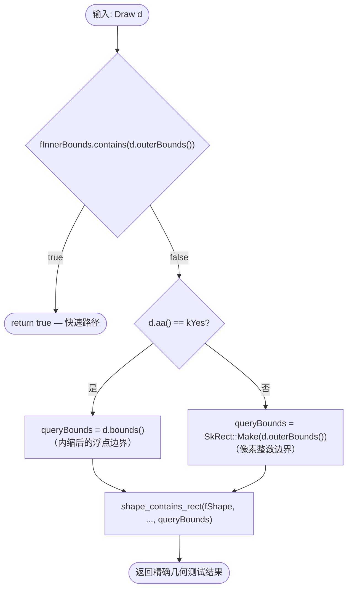

对于 AA draw 使用内缩后的 `fOriginalBounds`（即 `d.bounds()`），这正是 `kBoundsTolerance` 发挥作用之处。

#### Draw → Clip 方向

Draw 的 `contains()` 始终返回 false。原因：Draw 只有 `outerBounds`（外包围盒），没有 innerBounds，无法保证其绘制区域完全覆盖任何 clip 形状。在 `get_clip_geometry()` 中，当 `b.contains(a)` 的 b 是 Draw 时永远不会命中 `kAOnly` 分支。

### 2.8 ClipGeometry 结果映射（当 B=Draw 时）

| 结果 | 条件 | 含义 | 后续动作 |
|------|------|------|----------|
| `kEmpty` | `outerBounds` 不相交 | Draw 完全在 clip 外 | 跳过绘制 |
| `kBOnly` | Clip `contains(Draw)` | Draw 完全在 clip 内 | 无需裁剪（仅可能需要 shader） |
| `kAOnly` | `Draw.contains(Clip)` — 不可能 | — | `SkASSERT(false)` (line 1278) |
| `kBoth` | 部分重叠 | 需要实际裁剪 | scissor / FP / mask |

> 当 A 是 Difference-op 元素时走不同分支：bounds 不相交 → `kAOnly`（A 的全覆盖区域保留），A `contains` B → `kEmpty`（B 在 A 的零覆盖区域内）。

### 2.9 字段说明

| 字段 | 类型 | 语义 |
|------|------|------|
| `fOriginalBounds` | `SkRect` | 内缩 `kBoundsTolerance` 后的浮点边界，供精确几何测试使用（`bounds()` 返回此值） |
| `fBounds` | `SkIRect` | 向外取整的像素边界，用于快速 bounds 判定和 scissor（`outerBounds()` 返回此值） |
| `fAA` | `GrAA` | 抗锯齿标志，决定 `RawElement::contains(Draw)` 中使用哪种 queryBounds |

---

## 3. RawElement 方法

### 3.1 构造函数 (line 487-499)

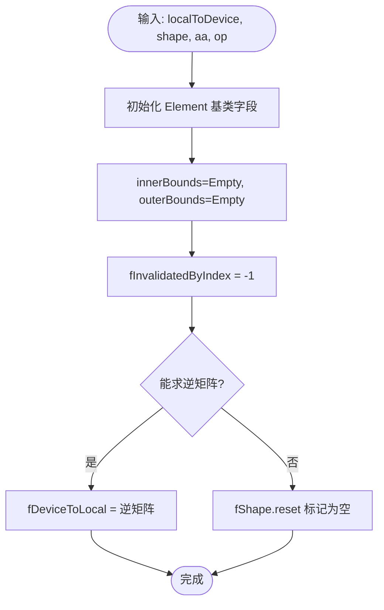

**字段语义** — `fLocalToDevice` (SkMatrix):

`fLocalToDevice` 是裁剪操作发生时 CTM（当前变换矩阵）的快照。它定义了 `fShape` 从局部坐标空间到设备像素坐标空间的变换。

| 方面 | 说明 |
|------|------|
| **来源** | `Device.clipRect/clipRRect/clipPath` 传入的 `localToDevice()` 或 `globalToDevice().asM33()` |
| **存储时机** | 裁剪元素创建时一次性捕获，之后不再随 CTM 变化 |
| **逆矩阵** | 构造时计算 `fDeviceToLocal = fLocalToDevice.invert()`；若不可逆则形状标记为空 |
| **核心用途** | ① 将 `fShape.bounds()` 映射到设备空间计算 outerBounds<br>② `shape_contains_rect()` 在不同坐标空间间做包含测试<br>③ `asPath().makeTransform()` 转换路径到设备空间生成 FP<br>④ 传给 `GrSWMaskHelper` / `StencilMaskHelper` 绘制遮罩 |
| **优化** | `isIdentity()` 时可走快速路径（直接使用设备空间 rect/rrect）；`preservesAxisAlignment()` 时 rect/rrect 可直接变换而无需退化为 path |

设计意图：clip 形状始终保持在局部坐标系中（`fShape`），按需通过 `fLocalToDevice` 变换到设备空间。这使得不同变换状态下推入的裁剪元素可以正确共存。

#### Inner/Outer Bounds 概念图解

`fInnerBounds` 和 `fOuterBounds` 是 RawElement 和 SaveRecord 共有的一对保守包围盒，用于快速判断裁剪效果：

```text
┌──────────────── outerBounds ────────────────┐
│                                             │
│    ╭─── shape 实际边缘 ───╮                  │
│    │  ┌── innerBounds ──┐ │                 │
│    │  │ 确定全覆盖区域   │ │                 │
│    │  └─────────────────┘ │                 │
│    ╰──────────────────────╯                 │
│                                             │
│         不确定区域（需逐像素判定）            │
└─────────────────────────────────────────────┘
              外部 = 确定无覆盖
```

**定义**：
- **outerBounds**：形状的最大可能范围（保守外扩）。外部像素**一定不受**该裁剪影响
- **innerBounds**：形状完全覆盖的最小确定区域（保守内缩）。内部像素的裁剪效果**完全确定**

**语义随 Op 变化**（SaveRecord 级别）：

| | Intersect 裁剪 | Difference 裁剪 |
|---|---|---|
| innerBounds **内部** | full coverage（完全通过） | 0 coverage（完全剔除） |
| outerBounds **外部** | 0 coverage（完全剔除） | full coverage（完全通过） |
| 两者**之间** | 需要逐像素/逐元素判定 | 需要逐像素/逐元素判定 |

**计算方式**（见 3.6 `simplify()`）：

| 形状类型 | outerBounds | innerBounds |
|---------|-------------|-------------|
| 非 AA 轴对齐矩形 | `round(shapeBounds)` | == outerBounds（精确） |
| AA 矩形 | `GetPixelIBounds(exterior)` 向外取整 | `GetPixelIBounds(interior)` 向内取整 |
| 圆角矩形 | 外接矩形 | `SkRRectPriv::InnerBounds()` 内接矩形 |
| 复杂路径 | 路径包围盒 | 空（无法快速计算） |

**优化作用**：
1. **Scissor-only**：innerBounds == outerBounds → 形状是精确矩形，硬件 scissor 即可
2. **包含跳过**：draw bounds ⊆ innerBounds → 该元素对 draw 无实际裁剪效果
3. **Window Rectangles**：difference 裁剪时 innerBounds 可作为硬件 window rect 排除区域
4. **早期终止**：outerBounds 不与 draw 相交 → 跳过该元素

> 边界更新的组合规则见附录"边界追踪"小节。

---

### 3.2 `markInvalid()` / `restoreValid()` (line 502-511)

**markInvalid** (单行): 设置 `fInvalidatedByIndex = current.firstActiveElementIndex()`

**restoreValid**: 若当前 SaveRecord 的 `firstActiveElementIndex` < `fInvalidatedByIndex`，则重置为 -1（恢复有效）

---

### 3.3 `contains(const Draw&)` (line 513-523)

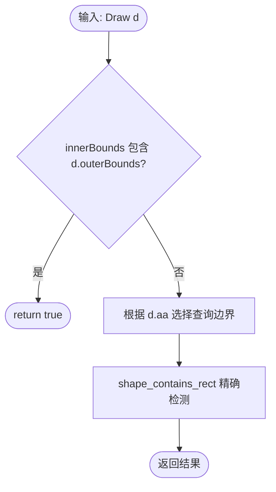

---

### 3.4 `contains(const SaveRecord&)` (line 525-534)

与 `contains(Draw)` 逻辑相同，但使用 `s.outerBounds()` 的 `SkRect` 版本作为查询边界。

---

### 3.5 `contains(const RawElement&)` (line 536-561)

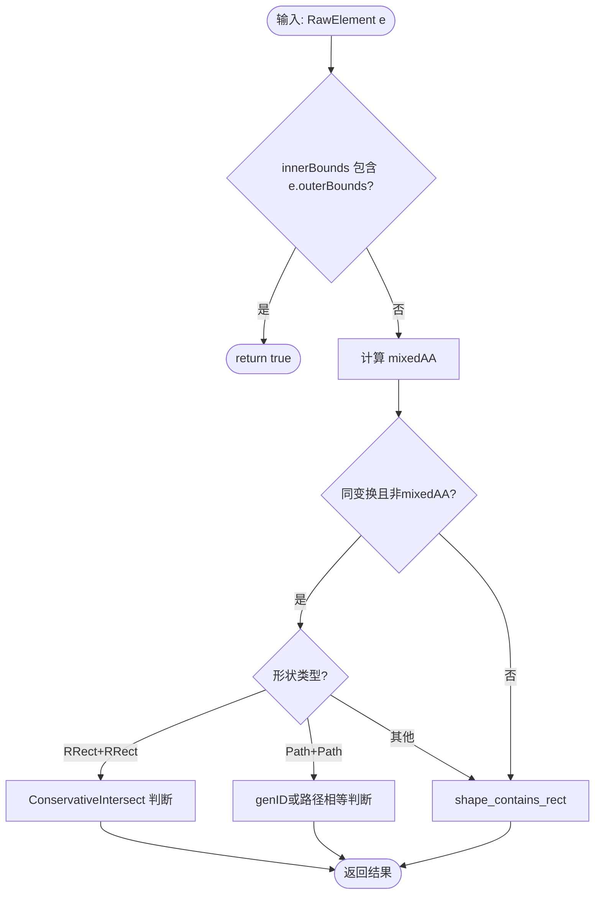

---

### 3.6 `simplify()` (line 564-646)

**职责总述**: `simplify()` 在 `clip()` 中被调用，负责将用户输入的原始裁剪形状规范化为 GPU 友好的内部表示——完成后元素携带精确的设备空间边界、确定的 AA 策略，以及尽可能简化的几何形状，为后续 stencil/scissor 决策提供基础。

**五阶段处理流程**:

1. **反转修正** — 若 shape 带 inverted 标记（如 inverse-fill path），翻转 `SkClipOp`（Intersect↔Difference）并清除 inverted 位，使后续逻辑无需处理反转语义
2. **几何简化** — 调用 `fShape.simplify()` 执行退化检测：空路径归零、line/point 路径退化为 empty、convex 路径可能降级为 Rect/RRect
3. **可见性裁剪** — 将 shape.bounds() 经 `fLocalToDevice` 映射到设备空间，与 `deviceBounds` 求交；若完全不相交则标记为 empty 并提前返回（剔除不可见元素）
4. **AA 策略升级** — 当 `forceAA=true` 且矩形/圆角矩形在设备空间中非轴对齐时，将 `fAA` 从 kNo 升级为 kYes，保证旋转裁剪边缘质量
5. **轴对齐优化** — 若 `fLocalToDevice` 保持轴对齐：Rect 直接替换为设备空间坐标 + identity 变换（启用 scissor-only 快速路径）；RRect 变换到设备空间并计算 `fInnerBounds`（最大内接矩形）用于 contains 快速判定

**设计动机**:
- 减少后续 stencil 操作：简单矩形可直接走 scissor，无需 stencil buffer
- 启用 scissor-only 快速路径：轴对齐 Rect + identity 变换是最优裁剪表示
- 剔除不可见元素：提前终止避免后续无谓的 GPU 状态设置
- `fInnerBounds` 支持 O(1) "被裁剪区完全包含" 判定，跳过整个裁剪栈遍历

**前置/后置条件** (`SkASSERT` 语义):
- 前置：`fShape` 已通过构造函数设置，`fLocalToDevice` 有效
- 后置 (正常完成)：`fOuterBounds ⊆ deviceBounds`、`fInnerBounds ⊆ fOuterBounds`、shape 非 inverted
- 后置 (empty)：`fOuterBounds` 为空、shape 已 reset

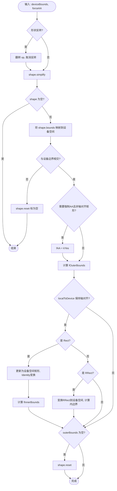

---

### 3.7 `combine()` (line 648-724)

尝试合并两个 intersect 元素为单个元素。

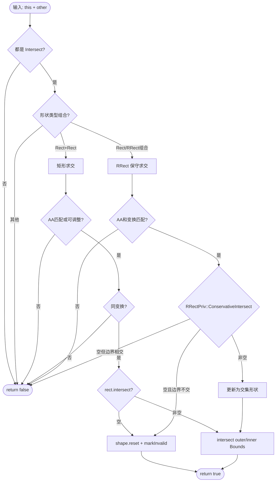

---

### 3.8 `updateForElement()` (line 727-759)

新元素加入时更新已有元素。

```mermaid
flowchart TD
    Start([输入: this, added, current]) --> CheckValid{this 已失效?}
    CheckValid -->|是| Skip([跳过])
    CheckValid -->|否| GetGeometry[get_clip_geometry this, added]

    GetGeometry --> GeoResult{几何关系?}
    GeoResult -->|kEmpty| MarkBoth[标记 this 和 added 均失效]
    GeoResult -->|kAOnly| MarkAdded[标记 added 失效]
    GeoResult -->|kBOnly| MarkThis[标记 this 失效]
    GeoResult -->|kBoth| TryCombine{added.combine this?}
    TryCombine -->|成功| MarkThis2[标记 this 失效]
    TryCombine -->|失败| KeepBoth([保留两者])

    MarkBoth --> End([完成])
    MarkAdded --> End
    MarkThis --> End
    MarkThis2 --> End
```

---

### 3.9 `clipType()` (line 762-787)

从 Shape 类型映射到 `ClipState`。

| Shape 类型 | 条件 | ClipState |
|-----------|------|-----------|
| Empty | — | `kEmpty` |
| Rect | Intersect + Identity | `kDeviceRect` |
| Rect | 其他 | `kComplex` |
| RRect | Intersect + Identity | `kDeviceRRect` |
| RRect | 其他 | `kComplex` |
| Path | — | `kComplex` |

#### ClipState 状态机

```mermaid
stateDiagram-v2
    [*] --> WideOpen : 初始化
    WideOpen --> DeviceRect : 添加 Identity Intersect Rect
    WideOpen --> DeviceRRect : 添加 Identity Intersect RRect
    WideOpen --> Complex : 添加其他元素
    WideOpen --> Empty : 交集为空

    DeviceRect --> Complex : 添加更多元素
    DeviceRect --> Empty : 交集为空
    DeviceRRect --> Complex : 添加更多元素
    DeviceRRect --> Empty : 交集为空

    Complex --> Empty : 交集为空
    Complex --> WideOpen : reset
    DeviceRect --> WideOpen : reset
    DeviceRRect --> WideOpen : reset
    Empty --> WideOpen : reset
```

#### ClipState 直觉理解

`ClipState` 描述的是当前 SaveRecord **化简后** 裁剪区域的"形状复杂度"，决定了 `apply()` 能否走快速路径。可以类比为："我能用多简单的方式告诉 GPU 哪些像素可以画？"

##### kEmpty — 全部被裁掉，什么都不画

```
┌────────────────────────────┐
│ Device (屏幕/纹理)          │
│                            │
│   ╳ ╳ ╳ ╳ ╳ ╳ ╳ ╳ ╳ ╳    │  ← 所有像素都被剔除
│   ╳ ╳ ╳ ╳ ╳ ╳ ╳ ╳ ╳ ╳    │
│   ╳ ╳ ╳ ╳ ╳ ╳ ╳ ╳ ╳ ╳    │
│                            │
└────────────────────────────┘
```

**何时出现**: 两个不重叠的 clipRect 求交，或裁剪形状本身为空。
**GPU 行为**: `apply()` 直接返回 `kClippedOut`，draw op 被跳过，零开销。

对应代码场景:
```cpp
canvas->clipRect({0,0,100,100});
canvas->clipRect({200,200,300,300});  // 与上一个不相交 → kEmpty
canvas->drawRect(...);                // 这次绘制完全被跳过
```

##### kWideOpen — 无裁剪，整个画布都能画

```
┌────────────────────────────┐
│ Device                     │
│ ░░░░░░░░░░░░░░░░░░░░░░░░░ │
│ ░░░░░░░░░░░░░░░░░░░░░░░░░ │  ← 全部可绘制
│ ░░░░░░░░░░░░░░░░░░░░░░░░░ │
│ ░░░░░░░░░░░░░░░░░░░░░░░░░ │
│ ░░░░░░░░░░░░░░░░░░░░░░░░░ │
└────────────────────────────┘
```

**何时出现**: 初始状态（新 save），或所有裁剪被 restore 移除后。
**GPU 行为**: `apply()` 不设置任何裁剪状态，draw op 直接执行。

对应代码场景:
```cpp
canvas->save();
// 没有调用任何 clipXxx → kWideOpen
canvas->drawCircle(...);  // 不受裁剪约束
canvas->restore();
```

##### kDeviceRect — 一个轴对齐矩形（最常见的裁剪）

```
┌────────────────────────────┐
│ Device                     │
│                            │
│    ┌──────────────┐        │
│    │▓▓▓▓▓▓▓▓▓▓▓▓│        │  ← 只有矩形内可绘制
│    │▓▓▓▓▓▓▓▓▓▓▓▓│        │
│    │▓▓▓▓▓▓▓▓▓▓▓▓│        │
│    └──────────────┘        │
│                            │
└────────────────────────────┘
```

**条件**: 单个 Rect + kIntersect op + identity 变换（无旋转/缩放/平移偏差）。
**GPU 行为**: 直接用硬件 scissor test（`glScissor`），零额外开销。
**为何重要**: Skia 统计显示 98% 的绘制走这条路径。

对应代码场景:
```cpp
canvas->clipRect({50, 50, 200, 150});  // → kDeviceRect
canvas->drawPath(path);  // scissor 裁剪，极快
```

##### kDeviceRRect — 一个设备坐标圆角矩形

```
┌────────────────────────────┐
│ Device                     │
│                            │
│      ╭────────────╮        │
│      │▓▓▓▓▓▓▓▓▓▓│        │  ← 圆角矩形内可绘制
│      │▓▓▓▓▓▓▓▓▓▓│        │
│      │▓▓▓▓▓▓▓▓▓▓│        │
│      ╰────────────╯        │
│                            │
└────────────────────────────┘
```

**条件**: 单个 RRect + kIntersect op + identity 变换。
**GPU 行为**: Scissor（外接矩形）+ 一个 Analytic RRect Fragment Processor 处理圆角边缘。
**典型来源**: `clipRRect()` 用于圆角卡片、对话气泡等 UI 元素。

对应代码场景:
```cpp
SkRRect rrect = SkRRect::MakeRectXY({10,10,300,200}, 20, 20);
canvas->clipRRect(rrect);  // → kDeviceRRect
canvas->drawImage(img, 0, 0);  // 图片被圆角裁剪
```

##### kComplex — 需要复杂裁剪管线

```
┌────────────────────────────┐
│ Device                     │
│     ╱╲                     │
│    ╱▓▓╲     ┌───┐         │
│   ╱▓▓▓▓╲   │   │         │  ← 多个形状/变换/路径组合
│   ╲▓▓▓▓╱   │   │         │
│    ╲▓▓╱     └───┘         │
│     ╲╱        ↑ Difference │
│               (挖洞)       │
└────────────────────────────┘
```

**触发条件**(满足任一):
- 多个裁剪元素需组合
- 带旋转/缩放的变换（非 identity）
- 任意 Path 形状（非 Rect/RRect）
- 使用了 kDifference 操作
- 附加了 ClipShader

**GPU 行为**: 按优先级尝试 Window Rects → Analytic FP → Atlas → Stencil → SW Mask（参见"裁剪方式分析"附录）。

对应代码场景:
```cpp
// 场景 A: 多元素
canvas->clipRect({0,0,200,200});
canvas->clipPath(trianglePath);  // 两个元素 → kComplex

// 场景 B: 带变换
canvas->rotate(45);
canvas->clipRect({0,0,100,100});  // 旋转后的 rect → kComplex

// 场景 C: Difference
canvas->clipRect({0,0,300,300});
canvas->clipRect({50,50,100,100}, SkClipOp::kDifference);  // 挖洞 → kComplex
```

##### 状态复杂度递增关系

```
kEmpty < kWideOpen < kDeviceRect < kDeviceRRect < kComplex
  │         │            │             │             │
  │         │            │             │             └─ 需要遮罩/多 FP/stencil
  │         │            │             └─ 1 个 analytic FP
  │         │            └─ 硬件 scissor（几乎免费）
  │         └─ 完全不裁剪
  └─ 完全不绘制
```

> **设计意图**: ClipState 存在的意义是让 `apply()` 在常见简单场景（98% 是 kDeviceRect 或更简单）下避免进入复杂的遮罩分配逻辑，直接走硬件快速路径。

##### 各状态语义

| 状态 | 含义 | 触发条件 |
|------|------|----------|
| `kEmpty` | 裁剪区域完全为空，所有绘制都会被剔除 | 元素交集结果为空集；Shape 类型为 `GrShape::Type::kEmpty` |
| `kWideOpen` | 无裁剪约束，整个设备区域均可绘制 | SaveRecord 初始状态；`reset()` 后 |
| `kDeviceRect` | 裁剪为设备空间的轴对齐矩形 | 单个 Rect 元素 + `kIntersect` op + identity 变换 |
| `kDeviceRRect` | 裁剪为设备空间的圆角矩形 | 单个 RRect 元素 + `kIntersect` op + identity 变换 |
| `kComplex` | 需要复杂处理的裁剪状态 | 多个有效元素；Path；非 identity 变换；Difference op；附带 Shader |

##### 状态决定的渲染策略

ClipState 是 `apply()` / `preApply()` 的核心分派依据：

| 状态 | `preApply()` 返回 | `apply()` 行为 | GPU 开销 |
|------|-------------------|----------------|----------|
| `kEmpty` | `Effect::kClippedOut` | 跳过绘制 | 零 |
| `kWideOpen` | `Effect::kUnclipped` | 不设置任何裁剪 | 零 |
| `kDeviceRect` | 返回 rect 作为 `PreClipResult` | Scissor test | 极低 |
| `kDeviceRRect` | 返回 rrect 作为 `PreClipResult` | Analytic RRect FP + Scissor | 低 |
| `kComplex` | `Effect::kClipped` | Window Rects / Analytic FP / Atlas / Stencil Mask / SW Mask（按优先级尝试） | 中→高 |

##### 状态查询入口

外部通过 `Device.h` 的便捷方法查询 ClipState：

```cpp
// src/gpu/ganesh/Device.h:291-300
bool isClipEmpty() const    { return fClip.currentClipState() == ClipState::kEmpty; }
bool isClipRect() const     { auto s = fClip.currentClipState();
                              return s == ClipState::kDeviceRect || s == ClipState::kWideOpen; }
bool isClipWideOpen() const { return fClip.currentClipState() == ClipState::kWideOpen; }
```

> **注意**: `isClipRect()` 将 `kWideOpen` 也视为 "rect"，因为 wide-open 等价于设备边界矩形。

##### Shader 对状态的覆盖

`SaveRecord::state()` (line 874-880) 在返回状态前会检查 shader：

```cpp
ClipState state() const {
    if (fShader && fState != ClipState::kEmpty) {
        return ClipState::kComplex;  // shader 存在时强制升级为 Complex
    }
    return fState;
}
```

即使几何上只是简单的 DeviceRect，一旦附加了 clip shader，对外暴露的状态就是 `kComplex`，因为 shader 裁剪需要 fragment processor 参与。

---

## 4. Mask 方法

### 4.1 `Mask()` 构造函数 (line 792-809)

```mermaid
flowchart TD
    Start([输入: current SaveRecord, drawBounds]) --> StoreBounds[保存 fBounds = drawBounds]
    StoreBounds --> StoreGenID[保存 fGenID = current.genID]
    StoreGenID --> BuildKey[构建 UniqueKey: domain + genID + 4个边界值]
    BuildKey --> End([完成])
```

Key 由 5 个 uint32_t 组成: `[genID, left, right, top, bottom]`

---

### 4.2 `appliesToDraw()` (line 811-816)

判断遮罩是否可复用: `fGenID == current.genID() && fBounds.contains(drawBounds)`

即同一 SaveRecord 的更大遮罩可以覆盖更小的绘制区域。

---

### 4.3 `invalidate()` (line 818-824)

使遮罩 key 失效:
1. 调用 `proxyProvider->processInvalidUniqueKey()` 释放 GPU 资源
2. 重置 `fKey`

---

## 5. SaveRecord 方法

> 本节已迁移至独立文档: [`ClipStack.SaveRecord.cn.md`](./ClipStack.SaveRecord.cn.md)
>
> SaveRecord 是 ClipStack 的核心管理单元，负责延迟保存、元素生命周期管理、聚合边界追踪和 genID 缓存失效。涵盖 13 个方法的完整实现分析。

---

## 6. ClipStack 公共方法

### 6.1 构造函数 / 析构函数 (line 1185-1206)

**构造**: 初始化栈增量大小，推入一个 WideOpen 的根 SaveRecord。

**析构**: 遍历所有 Mask 调用 `invalidate()` 释放 GPU 资源。

**字段语义** — `fCTM` (const SkMatrix*):

`fCTM` 是指向外部矩阵的只读指针，代表 ClipStack 所属 Device 的当前变换矩阵（CTM）。该指针的生命周期必须长于 ClipStack 本身（头文件注释: "The ctm must outlive the ClipStack"）。

| 方面 | 说明 |
|------|------|
| **类型** | `const SkMatrix*` — 指针而非拷贝，始终指向 Device 的活跃 CTM |
| **来源** | `Device` 构造函数传入 `&this->localToDevice()` (`Device.cpp:307`) |
| **使用位置** | 仅在 `apply()` (line 1342): `GrFragmentProcessors::Make(cs.shader(), args, *fCTM)` |
| **用途** | 将 clip shader 的坐标空间变换到设备空间，生成正确的 fragment processor |
| **与 fLocalToDevice 的区别** | `fCTM` 是 ClipStack 级别的全局指针，始终反映 Device 最新 CTM；`fLocalToDevice` 是每个 Element 创建时的 CTM 快照（值拷贝） |

设计意图：clip shader 不像几何裁剪元素那样在添加时就被固定坐标，它需要在 `apply()` 时使用当前活跃 CTM 来做坐标变换。因此 `fCTM` 存储为指针，确保总能获取最新变换状态。

---

### 6.2 `save()` / `restore()` 与 SaveRecord 生命周期 (line 1208-1231)

> 完整的双层延迟架构、restore 弹出流程和生命周期状态机见 [`ClipStack.SaveRecord.cn.md` §1 和 §12](./ClipStack.SaveRecord.cn.md)。

#### 调用链：SkCanvas 的双层延迟机制

SkCanvas 的 `save()` **不会立即**调用到 `ClipStack::save()`。中间有一个 Canvas 级别的延迟保存机制：

```cpp
// src/core/SkCanvas.cpp:448-452
int SkCanvas::save() {
    fSaveCount += 1;
    fMCRec->fDeferredSaveCount += 1;  // 仅递增计数器，不调用 Device
    return this->getSaveCount() - 1;
}
```

真正触发 Device 调用的是 `checkForDeferredSave()`，它在**任何 clip/transform 操作之前**被调用：

```cpp
// src/core/SkCanvas.cpp:426-430
void SkCanvas::checkForDeferredSave() {
    if (fMCRec->fDeferredSaveCount > 0) {
        this->doSave();   // → internalSave() → device->pushClipStack()
    }
}

// src/core/SkCanvas.cpp:1380-1384 (clipRect 示例)
void SkCanvas::clipRect(const SkRect& rect, SkClipOp op, bool doAA) {
    ...
    this->checkForDeferredSave();  // ← 此处触发
    ...
    this->onClipRect(rect, op, edgeStyle);
}
```

完整调用路径：

```text
SkCanvas::save()
  → fMCRec->fDeferredSaveCount++           [仅计数，立即返回]

... 后续首次 clip/transform 操作 ...

SkCanvas::clipRect() / translate() / etc.
  → checkForDeferredSave()
    → doSave()                              [src/core/SkCanvas.cpp:454-460]
      → fMCRec->fDeferredSaveCount--
      → internalSave()                      [src/core/SkCanvas.cpp:491-495]
        → new MCRec(fMCRec)                 [推入新的 Matrix-Clip 记录]
        → topDevice()->pushClipStack()      [调用 Device 虚函数]
          → Device::pushClipStack()         [src/gpu/ganesh/Device.h:268]
            → fClip.save()
              → ClipStack::save()           [src/gpu/ganesh/ClipStack.cpp:1208-1211]
                → fSaves.back().pushSave()  [ClipStack 的第二层延迟]
```

类似地，`SkCanvas::restore()` 也有对称的延迟逻辑：

```cpp
// src/core/SkCanvas.cpp:462-477
void SkCanvas::restore() {
    if (fMCRec->fDeferredSaveCount > 0) {
        // 对应的 save 从未实体化，直接递减计数
        fSaveCount -= 1;
        fMCRec->fDeferredSaveCount -= 1;
    } else {
        // save 已被实体化（checkForDeferredSave 曾触发过），需要真正 restore
        this->internalRestore();  // → topDevice()->popClipStack() → fClip.restore()
    }
}
```

入口定义在 `Device.h:268-269`:
```cpp
void pushClipStack() override { fClip.save(); }
void popClipStack() override { fClip.restore(); }
```

> **双层延迟总结**：SkCanvas 层的延迟避免了无意义的 MCRec 分配和 Device 调用；ClipStack 层的延迟进一步避免了无意义的 SaveRecord 分配。只有当 save 后真的发生 clip 修改时，两层延迟才逐步被"实体化"。

#### save() 的延迟策略 (line 1208-1211)

`save()` **不创建** 新 SaveRecord，只递增当前栈顶的延迟计数器：

```cpp
void ClipStack::save() {
    fSaves.back().pushSave();  // fDeferredSaveCount++
}
```

新 SaveRecord 的真正创建被推迟到首次裁剪操作时（见 6.7 `writableSaveRecord()`）。

**设计动机**：Canvas 的 save/restore 调用极为频繁（每次 drawXXX 前后、Layer 边界等），但绝大多数 save/restore 对之间**没有任何裁剪修改**。延迟策略使得这些空 save/restore 的成本为零（仅一次整数加减）。

#### SaveRecord 实际创建时机

当 `save()` 后首次发生裁剪操作（`clipRect`/`clipRRect`/`clipPath`/`clipShader`），`writableSaveRecord()` 检测到 `canBeUpdated() == false`（即 `fDeferredSaveCount > 0`），此时才真正实体化新 SaveRecord：

```text
Canvas.clipRect(R)
  → ClipStack::clip(shape, ctm, op)
    → writableSaveRecord(&wasDeferred)
      → current.canBeUpdated()? → NO (fDeferredSaveCount > 0)
      → current.popSave()          // 递减旧记录的延迟计数
      → fSaves.emplace_back(current, maskIdx, elemIdx)  // 嵌套构造
    → save.addElement(element)     // 元素归属到新 SaveRecord
```

新 SaveRecord 继承前一个记录的 bounds/state/shader，并记录 `fStartingElementIndex` = 当前元素数（用于 restore 时识别"我的元素"范围）。

#### restore() 弹出逻辑 (line 1213-1231)

```mermaid
flowchart TD
    Start([restore]) --> PopSave{current.popSave 返回 true?<br/>即 fDeferredSaveCount ≥ 0}
    PopSave -->|是: 延迟保存撤销| End([return — 无实际操作])
    PopSave -->|否: fDeferredSaveCount == -1| Real[真正的 restore]
    Real --> Step1["current.removeElements(&fElements)<br/>弹出 index ≥ fStartingElementIndex 的元素"]
    Step1 --> Step2["current.invalidateMasks(provider, &fMasks)<br/>释放该层级的遮罩纹理"]
    Step2 --> Step3["fSaves.pop_back()<br/>销毁当前 SaveRecord"]
    Step3 --> Step4["fSaves.back().restoreElements(&fElements)<br/>恢复被该层级 invalidate 的元素有效性"]
    Step4 --> End2([完成])
```

**关键点**：`popSave()` 返回 `false` 意味着这个 SaveRecord 确实被实体化过（有真正的裁剪操作），所以 restore 时需要做清理。如果从未实体化（全是延迟 save/restore），代价只是计数器递减。

#### 完整生命周期状态图

```mermaid
stateDiagram-v2
    [*] --> 栈顶活跃: ClipStack 构造<br/>根 SaveRecord(deviceBounds)

    栈顶活跃 --> 延迟累积: save()<br/>fDeferredSaveCount++
    延迟累积 --> 延迟累积: save()<br/>fDeferredSaveCount++
    延迟累积 --> 栈顶活跃: restore() 且 count≥0<br/>fDeferredSaveCount--

    延迟累积 --> 新记录创建: clipXXX 操作<br/>writableSaveRecord() 实体化
    新记录创建 --> 栈顶活跃: 新 SaveRecord 成为栈顶

    栈顶活跃 --> 记录销毁: restore() 且 count==-1
    记录销毁 --> 栈顶活跃: pop_back 后<br/>前一个记录恢复为栈顶
```

> 延迟保存的完整时序示例见附录"延迟保存机制"小节。

---

### 6.4 `getConservativeBounds()` (line 1233-1249)

```mermaid
flowchart TD
    Start([getConservativeBounds]) --> CheckState{current.state?}
    CheckState -->|kEmpty| RetEmpty([return MakeEmpty])
    CheckState -->|kWideOpen| RetDevice([return fDeviceBounds])
    CheckState -->|其他| CheckOp{current.op?}
    CheckOp -->|Difference| RetSubtract([subtract deviceBounds, innerBounds])
    CheckOp -->|Intersect| RetOuter([return outerBounds])
```

---

### 6.5 `preApply()` (line 1251-1303)

保守预检查裁剪效果，避免不必要的 apply() 开销。

```mermaid
flowchart TD
    Start([输入: drawBounds, aa]) --> CreateDraw[创建 Draw 对象]
    CreateDraw --> ApplyDevice{与设备边界相交?}
    ApplyDevice -->|否| ClippedOut1([kClippedOut])
    ApplyDevice -->|是| CheckState{cs.state?}

    CheckState -->|kEmpty| ClippedOut2([kClippedOut])
    CheckState -->|kWideOpen| Unclipped1([kUnclipped])
    CheckState -->|其他| GetGeometry[get_clip_geometry cs, draw]

    GetGeometry --> GeoResult{几何关系?}
    GeoResult -->|kEmpty| ClippedOut3([kClippedOut])
    GeoResult -->|kBOnly| CheckShader{有 shader?}
    CheckShader -->|是| Clipped([kClipped])
    CheckShader -->|否| Unclipped2([kUnclipped])

    GeoResult -->|kBoth| CheckSimple{cs.state 类型?}
    CheckSimple -->|kDeviceRect| RetRect([返回 rect + aa])
    CheckSimple -->|kDeviceRRect| RetRRect([返回 rrect + aa])
    CheckSimple -->|kComplex| Clipped2([kClipped])
```

---

### 6.6 `apply()` (line 1305-1553)

**核心方法**: 对绘制应用裁剪。这是整个文件最复杂的函数。

```mermaid
flowchart TD
    Start([输入: rContext, sdc, op, aa, out, bounds]) --> InitProxy[确保 fProxyProvider 已设置]
    InitProxy --> CreateDraw[创建 Draw, 应用设备边界]
    CreateDraw --> DeviceClip{与设备边界相交?}
    DeviceClip -->|否| ClippedOut([kClippedOut])
    DeviceClip -->|是| CheckState{cs.state?}

    CheckState -->|kEmpty| ClippedOut
    CheckState -->|kWideOpen| Unclipped([kUnclipped])
    CheckState -->|其他| ConvertShader[转换 clip shader 为 FP]

    ConvertShader --> GetGeometry[get_clip_geometry cs, draw]
    GetGeometry --> GeoResult{几何关系?}
    GeoResult -->|kEmpty| ClippedOut
    GeoResult -->|kBOnly 有clipFP| AddFP1([添加 FP, kClipped])
    GeoResult -->|kBOnly 无clipFP| Unclipped
    GeoResult -->|kBoth| CalcScissor[计算初始 scissorBounds]

    CalcScissor --> ElementLoop[遍历所有有效元素]
```

**元素遍历阶段**:

```mermaid
flowchart TD
    ElementLoop([遍历元素]) --> CheckValid{元素有效?}
    CheckValid -->|否| NextElement
    CheckValid -->|是| PerElementGeo[get_clip_geometry e, draw]

    PerElementGeo --> EGeo{结果?}
    EGeo -->|kEmpty| RetClippedOut([kClippedOut])
    EGeo -->|kBOnly| NextElement[下一元素]
    EGeo -->|kBoth| TryOpClip{Op内部裁剪?}

    TryOpClip -->|成功| Handled[标记 fullyApplied]
    TryOpClip -->|失败| TryHW{尝试 HW 方法}

    TryHW --> IsIntersect{e.op?}
    IsIntersect -->|Intersect| CheckInnerOuter{inner==outer 或 inner含scissor?}
    IsIntersect -->|Difference| TryWindowRect{可用 windowRect?}

    CheckInnerOuter -->|是| Handled2[fullyApplied]
    CheckInnerOuter -->|否| TryAnalytic
    TryWindowRect -->|是| AddWindow[添加 windowRect]
    TryWindowRect -->|否| TryAnalytic

    TryAnalytic{剩余 analyticFP 配额 > 0?}
    TryAnalytic -->|是| DoAnalytic[analytic_clip_fp]
    TryAnalytic -->|否| ToMask

    DoAnalytic --> AnalyticOK{成功?}
    AnalyticOK -->|是| Handled3[fullyApplied, 减配额]
    AnalyticOK -->|否| TryAtlas[clip_atlas_fp]
    TryAtlas --> AtlasOK{成功?}
    AtlasOK -->|是| Handled3
    AtlasOK -->|否| ToMask[加入 elementsForMask]

    Handled & Handled2 & Handled3 --> NextElement
    ToMask --> NextElement
    NextElement --> ElementLoop
```

**最终组装阶段**:

```mermaid
flowchart TD
    LoopDone([遍历结束]) --> NeedScissor{scissorIsNeeded?}
    NeedScissor -->|否| RetUnclipped([kUnclipped])
    NeedScissor -->|是| SetScissor[设置 scissor 到 out]

    SetScissor --> HasWindowRects{有 windowRects?}
    HasWindowRects -->|是| AddWindowRects[添加到 out]
    HasWindowRects -->|否| CheckMaskElements

    AddWindowRects --> CheckMaskElements{elementsForMask 非空?}
    CheckMaskElements -->|否| FinalFP
    CheckMaskElements -->|是| ChooseMaskType{stencil可用且非AA需求?}

    ChooseMaskType -->|stencil可用| RenderStencil[render_stencil_mask]
    ChooseMaskType -->|需SW mask| GetSWMask[GetSWMaskFP]
    GetSWMask --> SWSuccess{成功?}
    SWSuccess -->|否| StencilFallback{stencil可用?}
    StencilFallback -->|是| RenderStencil
    StencilFallback -->|否| WarnClippedOut([警告并 kClippedOut])

    RenderStencil --> FinalFP
    SWSuccess -->|是| FinalFP

    FinalFP{有 clipFP?}
    FinalFP -->|是| AddCoverageFP[out.addCoverageFP]
    FinalFP -->|否| Done

    AddCoverageFP --> Done([return kClipped])
```

---

### 6.7 `writableSaveRecord()` (line 1555-1567)

> 实体化逻辑详见 [`ClipStack.SaveRecord.cn.md` §1.4](./ClipStack.SaveRecord.cn.md)。

```mermaid
flowchart TD
    Start([writableSaveRecord]) --> CanUpdate{current.canBeUpdated?}
    CanUpdate -->|是| RetCurrent[wasDeferred=false, 返回当前记录]
    CanUpdate -->|否| Undefer[popSave + 创建新记录]
    Undefer --> RetNew[wasDeferred=true, 返回新记录]
```

---

### 6.8 `clipShader()` (line 1569-1578)

```mermaid
flowchart TD
    Start([输入: shader]) --> CheckEmpty{state == kEmpty?}
    CheckEmpty -->|是| End([直接返回])
    CheckEmpty -->|否| GetWritable[writableSaveRecord]
    GetWritable --> AddShader[save.addShader shader]
    AddShader --> End2([完成, 不失效遮罩])
```

---

### 6.9 `replaceClip()` (line 1580-1593)

**用途**: 将裁剪状态**强制替换**为指定矩形，无视当前裁剪栈的任何历史。相当于 "忘掉之前所有 clip 操作，从头开始只用这个矩形"。

**调用链**: `SkCanvas::internal_private_resetClip()` → `SkCanvas::onResetClip()` → `Device::replaceClip(rect)` → `ClipStack::replaceClip(rect)`

**典型使用场景**: Android framework 的 `setDeviceClipRestriction` 重置裁剪约束时使用。应用层一般不直接调用。

```mermaid
flowchart TD
    Start([输入: rect]) --> GetWritable[writableSaveRecord]
    GetWritable --> WasDeferred{wasDeferred?}
    WasDeferred -->|否| Remove[removeElements + invalidateMasks]
    WasDeferred -->|是| Reset
    Remove --> Reset[save.reset deviceBounds]
    Reset --> CheckRect{rect != deviceBounds?}
    CheckRect -->|是| ClipRect[this->clipRect Identity, rect, NoAA, Intersect]
    CheckRect -->|否| End([完成 — WideOpen 状态])
    ClipRect --> End
```

**逐步逻辑**:

1. **获取可写 SaveRecord** — `writableSaveRecord(&wasDeferred)` 确保有活跃记录可修改。如果存在延迟 save 则实体化新记录。

2. **清理旧状态 (仅非 deferred 情况)** — 如果 `wasDeferred == false`，说明记录已经被修改过 (有活动元素/遮罩)，需要先清理：
   - `removeElements`: 删除该 SaveRecord 拥有的所有元素
   - `invalidateMasks`: 释放该记录的遮罩缓存

   如果 `wasDeferred == true`，新建的记录还是空的，无需清理。

3. **重置为 WideOpen** — `save.reset(fDeviceBounds)` 将 SaveRecord 恢复到全设备边界、kWideOpen 状态。

4. **应用目标矩形 (如有必要)** — 如果 `rect` 不等于设备全边界，则通过正常的 `clipRect` 路径添加一个 Intersect 元素。如果 `rect == deviceBounds`，则 WideOpen 本身就是期望状态，无需额外操作。

**与 `clip()` 的区别**:

| | `clip()` | `replaceClip()` |
|---|----------|-----------------|
| 语义 | 在现有裁剪上**追加**约束 | **丢弃**所有历史，重新设定 |
| 旧元素 | 保留 (可能被新元素 invalidate) | 全部删除 |
| 遮罩缓存 | 仅在 genID 变化时失效 | 无条件全部失效 |
| 结果状态 | 可能 Complex | 最多 DeviceRect (单个 intersect rect) |

**设计意图**: replaceClip 本质是一个 "先 reset 再 clip" 的原子操作。分两步实现 (reset + clipRect) 复用了现有的元素添加逻辑，避免代码重复。

---

### 6.10 `clip()` (line 1595-1641)

内部统一裁剪入口，处理延迟保存和元素添加。

```mermaid
flowchart TD
    Start([输入: RawElement]) --> CheckEmpty{state == kEmpty?}
    CheckEmpty -->|是| End([直接返回])
    CheckEmpty -->|否| Simplify[element.simplify deviceBounds, forceAA]

    Simplify --> ShapeEmpty{shape 为空?}
    ShapeEmpty -->|是| CheckDiffOp{op == Difference?}
    CheckDiffOp -->|是| End2([return 空diff无效果])
    CheckDiffOp -->|否| ContinueToAdd[继续添加使栈变空]

    ShapeEmpty -->|否| ContinueToAdd
    ContinueToAdd --> GetWritable[writableSaveRecord]
    GetWritable --> AddElement{save.addElement?}

    AddElement -->|返回false| HandleNotAdded{wasDeferred?}
    HandleNotAdded -->|是| RevertSave[弹出空SaveRecord, 恢复计数]
    HandleNotAdded -->|否| End3([断言genID未变])

    AddElement -->|返回true| InvalidateOldMasks{fProxyProvider 且 非wasDeferred?}
    InvalidateOldMasks -->|是| DoInvalidate[save.invalidateMasks]
    InvalidateOldMasks -->|否| End4([完成])
    DoInvalidate --> End4
    RevertSave --> End5([完成])
```

---

### 6.11 `GetSWMaskFP()` (line 1643-1700)

静态方法: 获取或创建 SW 遮罩 FP。

```mermaid
flowchart TD
    Start([输入: context, masks, current, bounds, elements, count, clipFP]) --> SearchCache[逆序搜索已有 Mask]
    SearchCache --> Found{找到匹配 Mask?}

    Found -->|是| LookupProxy[proxyProvider 查找缓存纹理]
    LookupProxy --> HasProxy{找到代理?}
    HasProxy -->|是| UseExisting[使用已有 maskProxy]
    HasProxy -->|否| SearchCache

    Found -->|否| RenderNew[render_sw_mask 渲染新遮罩]
    RenderNew --> RenderOK{渲染成功?}
    RenderOK -->|否| RetFail([GrFPFailure])
    RenderOK -->|是| Register[创建 Mask 对象, 注册 UniqueKey]

    UseExisting --> WrapFP
    Register --> WrapFP[创建 GrTextureEffect]
    WrapFP --> DeviceSpace[GrFP::DeviceSpace 包装]
    DeviceSpace --> BlendDstIn[GrBlendFP::kDstIn 与 clipFP 混合]
    BlendDstIn --> RetSuccess([GrFPSuccess])
```

**纹理坐标配置**:
- 使用 `Translate(-maskBounds.left, -maskBounds.top)` 将设备坐标映射到遮罩左上角
- subset 和 domain 确保采样不超出有效区域

---

## 附录: 类型关系图

```mermaid
flowchart TD
    subgraph 公共接口
        GrClip[GrClip 接口]
        ClipStack[ClipStack]
    end

    subgraph 内部数据
        SaveRecord[SaveRecord]
        RawElement[RawElement]
        Mask[Mask]
        Draw[Draw]
    end

    subgraph 输出
        GrAppliedClip[GrAppliedClip]
        Scissor[Scissor]
        WindowRects[WindowRects]
        StencilClip[StencilClip]
        CoverageFP[CoverageFP]
    end

    subgraph 策略函数
        analytic_clip_fp
        clip_atlas_fp
        render_sw_mask
        render_stencil_mask
        draw_to_sw_mask
    end

    GrClip --> ClipStack
    ClipStack --> SaveRecord
    ClipStack --> RawElement
    ClipStack --> Mask

    ClipStack -->|apply| GrAppliedClip
    GrAppliedClip --> Scissor
    GrAppliedClip --> WindowRects
    GrAppliedClip --> StencilClip
    GrAppliedClip --> CoverageFP

    CoverageFP -.-> analytic_clip_fp
    CoverageFP -.-> clip_atlas_fp
    CoverageFP -.-> render_sw_mask
    StencilClip -.-> render_stencil_mask
    render_sw_mask -.-> draw_to_sw_mask
```

---

## 附录: SaveRecord 作用与使用方式

> 本节已迁移至独立文档 [`ClipStack.SaveRecord.cn.md`](./ClipStack.SaveRecord.cn.md)，包含完整的设计分析、worked examples、元素所有权图解和时序图。

---

## 附录: 裁剪方式分析

### 支持的裁剪形状

ClipStack 提供 4 种裁剪入口方法 (`ClipStack.h:53-96`):

| 方法 | 形状类型 | 性能特点 | 最优渲染策略 |
|------|---------|---------|-------------|
| `clipRect()` | SkRect | 最快 — 轴对齐可用 scissor | HW Scissor |
| `clipRRect()` | SkRRect | 快 — 解析 FP 可用 | GrRRectEffect |
| `clipPath()` | SkPath | 可变 — 取决于复杂度 | Analytic/Atlas/Mask |
| `clipShader()` | SkShader | 特殊 — 直接乘算 coverage | Fragment Processor |

### 两种裁剪操作 (ClipOp)

每个几何裁剪元素携带一个 `SkClipOp`：

- **kIntersect** — 保留形状内部区域（取交集），是默认的裁剪语义
- **kDifference** — 移除形状内部区域（挖洞），用于创建"开口"

Shader 裁剪不使用 ClipOp，它直接以 `kSrcIn` 混合模式乘算 coverage。

### 几何裁剪 vs Shader 裁剪

| 维度 | 几何裁剪 (Rect/RRect/Path) | Shader 裁剪 |
|------|--------------------------|------------|
| 操作类型 | shape + ClipOp | coverage 乘算 |
| 包含分析 | 参与（可简化/合并/失效） | 不参与 |
| 失效标记 | 可被后续元素 invalidate | 不可失效 |
| 形状合并 | Rect+Rect / RRect+RRect 可合并 | 多 shader 以 kSrcIn 混合 |
| 影响 bounds | 更新 inner/outerBounds | 不改变 bounds |
| 渲染策略 | 多级降级(scissor→FP→mask) | 始终作为 FP |

### 多裁剪组合规则

当栈中有多个元素时，通过 `get_clip_geometry()` (`ClipStack.cpp:93-159`) 判断组合结果:

```mermaid
flowchart TD
    subgraph "Intersect + Intersect"
        II1{bounds 不相交?} -->|是| II_Empty([kEmpty])
        II1 -->|否| II2{B⊇A?}
        II2 -->|是| II_AOnly([kAOnly])
        II2 -->|否| II3{A⊇B?}
        II3 -->|是| II_BOnly([kBOnly])
        II3 -->|否| II_Both([kBoth])
    end

    subgraph "Intersect + Difference"
        ID1{bounds 不相交?} -->|是| ID_AOnly([kAOnly])
        ID1 -->|否| ID2{B⊇A?}
        ID2 -->|是| ID_Empty([kEmpty])
        ID2 -->|否| ID_Both([kBoth])
    end

    subgraph "Difference + Intersect"
        DI1{bounds 不相交?} -->|是| DI_BOnly([kBOnly])
        DI1 -->|否| DI2{A⊇B?}
        DI2 -->|是| DI_Empty([kEmpty])
        DI2 -->|否| DI_Both([kBoth])
    end

    subgraph "Difference + Difference"
        DD1{A⊇B?} -->|是| DD_AOnly([kAOnly])
        DD1 -->|否| DD2{B⊇A?}
        DD2 -->|是| DD_BOnly([kBOnly])
        DD2 -->|否| DD_Both([kBoth])
    end
```

**SaveRecord 边界更新** (`ClipStack.cpp:995-1031`):

| stackOp | toAdd.op | outerBounds 更新 | innerBounds 更新 |
|---------|----------|-----------------|-----------------|
| Intersect | Intersect | 求交 | 求交 |
| Intersect | Difference | subtract(outer, toAdd.inner) | subtract(inner, toAdd.outer) |
| Difference | Intersect | subtract(toAdd.outer, inner) | subtract(toAdd.inner, outer) |
| Difference | Difference | union | 取较大者 |

### 渲染策略优先级

`apply()` (`ClipStack.cpp:1305-1552`) 按以下优先级逐级降级:

```mermaid
flowchart TD
    Element([裁剪元素]) --> P1{Op 自行裁剪?}
    P1 -->|成功| Done([fullyApplied])
    P1 -->|失败| P2{HW Scissor 可用?}

    P2 -->|"Intersect 且 inner==outer"| Done
    P2 -->|否| P2b{Window Rect 可用?}

    P2b -->|"Difference 且 caps 支持"| AddWR([添加 WindowRect])
    P2b -->|否| P3{Analytic FP 配额 > 0?}

    P3 -->|是| TryFP[analytic_clip_fp]
    P3 -->|否| ToMask([加入 mask 列表])

    TryFP -->|成功| Done
    TryFP -->|失败| P4[clip_atlas_fp]

    P4 -->|成功| Done
    P4 -->|失败| ToMask

    ToMask --> MaskChoice{Stencil 可用?}
    MaskChoice -->|是| Stencil([render_stencil_mask])
    MaskChoice -->|否| SWMask([GetSWMaskFP])
```

**关键限制常量** (`ClipStack.cpp:1179-1183`):
- `kMaxAnalyticFPs = 4` — 最多 4 个解析 FP
- `kNumStackMasks = 4` — 每个 SW mask 最多容纳 4 个元素

### 各裁剪方式实现原理

#### 1. HW Scissor（硬件剪刀测试）

最简单的裁剪方式，GPU 光栅化器内置支持。

| 项目 | 说明 |
|------|------|
| 原理 | 设置一个轴对齐矩形，GPU 在光栅化阶段自动丢弃矩形外的所有 fragment |
| GPU 机制 | `glScissor()` / `vkCmdSetScissor()` — 硬件级 per-fragment 丢弃 |
| 适用场景 | 单个 Intersect Rect + identity 变换（即 `ClipState::kDeviceRect`） |
| 开销 | 几乎为零，是 GPU 流水线固有能力 |
| 限制 | 只能处理单个轴对齐矩形 |

> `apply()` 始终会设置 scissor 为所有裁剪元素的保守外接矩形 (line 1511)，即使后续还需其他方式配合。

---

#### 2. Window Rectangles（窗口矩形排除）

一种 GPU 硬件扩展（`GL_EXT_window_rectangles`），用于高效排除多个矩形区域。

| 项目 | 说明 |
|------|------|
| 原理 | 在 scissor 之上定义最多 **8 个矩形排除区**，GPU 丢弃落在这些矩形 **内部** 的 fragment |
| GPU 机制 | `glWindowRectanglesEXT(GL_EXCLUSIVE, n, rects)` — 硬件级测试 |
| 适用场景 | **仅用于 kDifference** 操作（"挖洞"），当被减区域有非空 innerBounds 时 |
| 开销 | 极低，与 scissor 处于同一硬件阶段 |
| 限制 | ① 需 GPU 驱动支持扩展 ② 最多 8 个矩形 ③ 只能用于矩形形状的 Difference ④ 不支持 FBO 0 (默认帧缓冲) |

```
┌─────────────────────────────────────────────┐
│              Scissor 区域                    │
│                                             │
│    ┌──────────┐         ┌──────────┐        │
│    │ Window   │         │ Window   │        │
│    │ Rect 1   │         │ Rect 2   │        │
│    │(被排除)  │         │(被排除)  │        │
│    └──────────┘         └──────────┘        │
│                                             │
│  → 只有 Scissor 内且 Window Rects 外的      │
│    fragment 会被渲染                         │
└─────────────────────────────────────────────┘
```

> **源码**: `GrWindowRectangles.h` 定义容器（最多 8 个 `SkIRect`），`GrWindowRectsState.h` 封装 Mode（Exclusive/Inclusive）。`GrGLGpu::flushWindowRectangles()` 负责下发到 GL 驱动。

---

#### 3. Analytic Fragment Processor（解析片段处理器）

在 fragment shader 中用数学公式判定每个像素是否在裁剪形状内。

| 项目 | 说明 |
|------|------|
| 原理 | 将裁剪形状转为 shader 代码，每个 fragment 计算 `sk_FragCoord` 到形状边界的距离/包含关系，输出 coverage 值 (0.0~1.0) |
| 支持形状 | Rect → `GrFragmentProcessor::Rect()`；RRect → `GrRRectEffect::Make()`；凸多边形 → `GrConvexPolyEffect::Make()` |
| 适用场景 | 简单几何形状（Rect/RRect/凸 Path），配额未用尽时 |
| 开销 | 低 — 仅增加少量 shader ALU 指令，无额外纹理/缓冲区 |
| 限制 | ① 最多同时 4 个 (`kMaxAnalyticFPs = 4`) ② 不支持凹路径 ③ 需要形状变换到设备坐标 |

**Edge Type** 通过 `GrClipEdgeType` 控制：
- `kFillAA` / `kFillBW` — 形状内部为 coverage=1（AA 版有边缘平滑）
- `kInverseFillAA` / `kInverseFillBW` — 形状外部为 coverage=1（用于 Difference）

多个 Analytic FP 以链式组合：每个 FP 将前一个 FP 的输出作为输入 coverage 乘算。

---

#### 4. Clip Atlas（裁剪图集）

将复杂路径预渲染到一张共享的 GPU 纹理图集中，绘制时采样该纹理获取 coverage。

| 项目 | 说明 |
|------|------|
| 原理 | `AtlasPathRenderer` 将 clip path 细分(tessellate)为覆盖信息并写入一张大纹理的某个区域；绘制时用纹理坐标查找对应区域采样 alpha 值作为 coverage |
| GPU 机制 | 纹理采样 — 一次 texture fetch per fragment |
| 适用场景 | 复杂 AA 路径（analytic FP 无法处理），且路径尺寸适中 |
| 开销 | 中等 — 首次需 tessellation 写入；后续复用时仅采样开销 |
| 限制 | ① 仅 AA 路径 (`GrAA::kYes`) ② 路径边界 ≤ 256×256（MSAA 下 ≤ 128×128）③ 图集已满或被当前 op 占用时失败 ④ 需 `AtlasPathRenderer` 可用 |

> 图集通过 path + matrix 组合键缓存，相同裁剪路径在不同绘制间可复用。

---

#### 5. Stencil Mask（模板缓冲遮罩）

利用 GPU 模板缓冲区（stencil buffer）存储裁剪形状的覆盖信息。

| 项目 | 说明 |
|------|------|
| 原理 | 先将裁剪形状绘制到 stencil buffer（标记哪些像素被覆盖），再在正式绘制时开启 stencil test，仅通过测试的像素才会被着色 |
| GPU 机制 | 两遍绘制：① stencil pass（写 stencil）② color pass（读 stencil + 绘制） |
| 适用场景 | 多个复杂元素需要组合，且渲染目标支持 stencil |
| 开销 | 中高 — 需额外 draw call 写 stencil；stencil 读取本身开销不大 |
| 限制 | ① 渲染目标必须有 stencil buffer (`canUseStencil()`) ② 单采样+需AA时无法使用（需走 SW Mask） |

**Stencil 组合操作**（`StencilMaskHelper`, line 427）:
- 第一个 Intersect 元素 → `kReplace_Op`（直接写入）
- 后续 Intersect → `kIntersect_Op`（与已有 stencil 求交）
- Difference → `kDifference_Op`（从 stencil 中减去）

> 通过 genID 机制进行缓存失效：stencil 内容不变时可跨 draw call 复用。

---

#### 6. SW Mask（软件遮罩）

最终兜底方案：在 CPU 上光栅化裁剪形状生成 alpha 纹理，上传到 GPU 作为 coverage 贴图。

| 项目 | 说明 |
|------|------|
| 原理 | 使用 `GrSWMaskHelper` 在 CPU 端将裁剪路径绘制为 Alpha8 位图 → 上传为 GPU 纹理 → fragment shader 采样该纹理作为 coverage |
| GPU 机制 | 纹理采样（与 Atlas 类似，但生成方式为 CPU 光栅化） |
| 适用场景 | ① 单采样表面 + 需要 AA 的遮罩（stencil 无法提供 AA） ② stencil 不可用 |
| 开销 | 最高 — CPU 光栅化 + 纹理上传 + 采样 |
| 限制 | 占用纹理内存；CPU 光栅化成本随路径复杂度线性增长 |

**SW Mask 绘制逻辑** (`draw_to_sw_mask`, line 301-347):
- 第一个 Intersect: 底色 0x00，形状填充 0xFF
- 第一个 Difference: 底色 0xFF，形状填充 0x00
- 后续 Intersect: 反向填充 0x00（擦除形状外部）
- 后续 Difference: 正向填充 0x00（擦除形状内部）

最终结果通过 `GrBlendFragmentProcessor`（`kDstIn` 模式）与其他 coverage 组合。

> 支持后台线程光栅化 (`SkTaskGroup`, line 389-402)，减少主线程阻塞。

---

#### 方法对比总结

| 方法 | 硬件要求 | 支持形状 | 额外内存 | 相对开销 |
|------|---------|---------|---------|---------|
| HW Scissor | 无（所有 GPU） | 轴对齐矩形 | 无 | ★☆☆☆☆ |
| Window Rects | GL_EXT 扩展 | 矩形（Difference） | 无 | ★☆☆☆☆ |
| Analytic FP | 无 | Rect/RRect/凸多边形 | 无 | ★★☆☆☆ |
| Clip Atlas | Atlas 渲染器 | 任意 AA 路径 | 图集纹理 | ★★★☆☆ |
| Stencil Mask | Stencil buffer | 任意形状 | Stencil 附件 | ★★★★☆ |
| SW Mask | 无 | 任意形状 | Alpha 纹理 | ★★★★★ |

---

### 性能数据

经验统计 (`ClipStack.cpp:1163-1183`):
- **98%** 的绘制操作只有 ≤1 个裁剪元素 + 1 个 SaveRecord，走 scissor-only 路径
- **0.2-0.3%** 需要遮罩渲染
- 栈增量: 元素 8、SaveRecord 8、Mask 4

---

## 附录: render_sw_mask GPU 化可行性分析

本附录分析将 `render_sw_mask` (line 349-418) 中的 CPU 光栅化路径改为 GPU 离屏渲染的可行性、设计方案与权衡。

---

### 1. 当前 SW Mask 工作流程

#### `render_sw_mask` (line 349-418)

```mermaid
flowchart TD
    A[入口: render_sw_mask] --> B{有 SkTaskGroup?}
    B -->|是| C[创建 Alpha8 纹理代理<br/>GrRenderable::kNo]
    C --> D[复制 Element 数组到 Uploader]
    D --> E[提交后台任务:<br/>GrSWMaskHelper 光栅化]
    E --> F[setDeferredUploader<br/>延迟上传像素到 GPU]
    F --> G[返回 GrSurfaceProxyView]
    B -->|否| H[同步: GrSWMaskHelper::init]
    H --> I[逐元素调用 draw_to_sw_mask]
    I --> J[helper.toTextureView<br/>上传到 GPU 纹理]
    J --> G
```

#### `draw_to_sw_mask` (line 301-347)

每个元素使用 **kReplace** 语义绘制到 SW buffer:

| 场景 | clearMask | alpha | invert | 效果 |
|------|-----------|-------|--------|------|
| 第 1 个 Intersect | ✓ | 0xFF | false | 清零后直接填充形状 |
| 后续 Intersect | ✗ | 0x00 | true | 反向填充 0x00 擦除外部 |
| Difference (任意) | — | 0x00 | false | 正向填充 0x00 擦除形状 |

核心问题: **CPU 光栅化 + 纹理上传** 是整个路径中最昂贵的步骤。

---

### 2. GPU 替代方案设计

使用 `SurfaceDrawContext::Make(kAlpha_8)` 创建可渲染的离屏 RenderTarget，直接在 GPU 上绘制裁剪遮罩:

```mermaid
flowchart TD
    A[入口: render_gpu_mask] --> B[SurfaceDrawContext::Make<br/>colorType=kAlpha_8]
    B --> C{sdc != nullptr?}
    C -->|否| D[Fallback → render_sw_mask]
    C -->|是| E[遍历 elements]
    E --> F[draw_element_to_gpu_mask<br/>逐元素 GPU 绘制]
    F --> G[返回 sdc->readSurfaceView]
```

核心思路: 将 SW 的 `GrSWMaskHelper::drawShape()` 映射为 GPU 的 `SurfaceDrawContext::drawShape()` 调用，保持相同的 clear/alpha/invert 逻辑。

---

### 3. 算法映射表

| SW 操作 | SW 实现 | GPU 等效实现 |
|---------|---------|-------------|
| 清零 (Intersect 首元素) | `helper->clear(0x00)` | `sdc->clear(SK_PMColor4fTRANSPARENT)` |
| 清满 (Difference 首元素) | `helper->clear(0xFF)` | `sdc->clear({1,1,1,1})` (Alpha-8 下只有 A 通道) |
| 直接填充 0xFF | `drawShape(shape, alpha=0xFF)` | `sdc->drawShape(paint{color=1.0}, blendMode=kSrc)` |
| 直接填充 0x00 | `drawShape(shape, alpha=0x00)` | `sdc->drawShape(paint{color=0.0}, blendMode=kSrc)` |
| 反向填充 0x00 | `drawShape(inverted, alpha=0x00)` | `sdc->drawShape(invertedShape, paint{color=0.0}, blendMode=kSrc)` |

关键: SW 中使用 kReplace 语义（每像素独立写入）→ GPU 等效为 `SkBlendMode::kSrc`（完全覆盖目标）。

> Coverage AA 公式: `final = src * coverage + dst * (1-coverage)` — 在 kSrc blend mode 下仍然天然支持 AA 平滑边缘，因为 coverage 由光栅化阶段计算。

---

### 4. GPU 实现伪代码

```cpp
// 新增函数: 替代 render_sw_mask
GrSurfaceProxyView render_gpu_mask(GrRecordingContext* context,
                                   const SkIRect& bounds,
                                   const ClipStack::Element** elements,
                                   int count) {
    SkASSERT(count > 0);

    // 尝试创建 Alpha-8 可渲染离屏表面
    auto sdc = skgpu::ganesh::SurfaceDrawContext::Make(
        context,
        GrColorType::kAlpha_8,
        /*colorSpace=*/nullptr,
        SkBackingFit::kApprox,
        bounds.size(),
        SkSurfaceProps(),
        "ClipStack_RenderGpuMask",
        /*sampleCnt=*/1,             // 或 MSAA: caps->internalMultisampleCount(format)
        skgpu::Mipmapped::kNo,
        GrProtected::kNo,
        kMaskOrigin,
        skgpu::Budgeted::kYes);

    if (!sdc) {
        // Alpha-8 不可渲染 → 回退 SW 路径
        return render_sw_mask(context, bounds, elements, count);
    }

    // 逐元素绘制
    for (int i = 0; i < count; ++i) {
        draw_element_to_gpu_mask(sdc.get(), *elements[i], /*clearMask=*/(i == 0), bounds);
    }

    return sdc->readSurfaceView();
}

void draw_element_to_gpu_mask(SurfaceDrawContext* sdc,
                              const ClipStack::Element& e,
                              bool clearMask,
                              const SkIRect& bounds) {
    // 1. Clear (与 SW 逻辑一致)
    if (clearMask) {
        if (e.fOp == SkClipOp::kIntersect) {
            sdc->clear(SK_PMColor4fTRANSPARENT);  // 0x00
        } else {
            sdc->clear({1, 1, 1, 1});             // 0xFF
        }
    }

    // 2. 确定 alpha 和 invert
    float alpha;
    bool invert;
    if (e.fOp == SkClipOp::kIntersect) {
        alpha  = clearMask ? 1.0f : 0.0f;
        invert = !clearMask;
    } else {
        alpha  = 0.0f;
        invert = false;
    }

    // 3. 构建 Paint
    GrPaint paint;
    paint.setColor4f({alpha, alpha, alpha, alpha});  // Alpha-8: 只有 A 通道有效
    paint.setPorterDuffXPFactory(SkBlendMode::kSrc); // kReplace 语义

    // 4. 绘制形状
    GrShape shape = e.fShape;
    if (invert) {
        shape.setInverted(true);
    }

    GrStyledShape styledShape(shape, GrStyle::SimpleFill());
    sdc->drawShape(/*clip=*/nullptr,
                   std::move(paint),
                   e.fAA,
                   SkMatrix::Translate(-bounds.fLeft, -bounds.fTop) * e.fLocalToDevice,
                   styledShape);
}
```

---

### 5. 可行性评估

#### 5.1 Alpha-8 Renderability 限制

**核心约束**: 并非所有 GPU/驱动组合都支持 Alpha-8 格式作为 RenderTarget。

| 平台 | 支持情况 | 源码引用 |
|------|---------|---------|
| OpenGL (Core 3.0+) | ✓ 支持 | `GrGLCaps.cpp:1798` — `alpha8IsRenderable = version >= 3.0` |
| OpenGL (Core Profile) | ✗ 移除 ALPHA8 | `GrGLCaps.cpp:1796` — "Core profile removes ALPHA8" |
| OpenGL ES | ✗ 不支持渲染 | `GrGLCaps.cpp:1808` — 仅在 GL (非 ES) 下设置 `msaaRenderFlags` |
| Vulkan | 取决于 `VkFormatProperties::optimalTilingFeatures` | 多数桌面驱动支持 |
| Metal | ✓ `A8Unorm` 可渲染 | Apple GPU 原生支持 |
| Dawn/WebGPU | 有限 | 取决于 adapter |

**Fallback 策略**: `SurfaceDrawContext::Make()` 返回 `nullptr` 时直接回退到 `render_sw_mask`，无功能损失。

#### 5.2 坐标变换

SW 路径中 `GrSWMaskHelper::init(bounds)` 隐式设置了偏移坐标系（以 bounds.fLeft/fTop 为原点）。GPU 路径需要在 drawShape 调用时显式应用 `SkMatrix::Translate(-bounds.fLeft, -bounds.fTop)` 前置变换。

#### 5.3 PathRenderer 选择

GPU 绘制路径需要 `GrPathRenderer` 来处理非简单形状。在离屏 mask 场景下:
- **MSAA PathRenderer**: 最通用，但需要 MSAA surface
- **Tessellation PathRenderer**: 适合凸/简单路径
- **Stencil-then-Cover**: 可用于复杂路径
- **Atlas PathRenderer**: 不适用（Atlas 本身就是另一条优化路径）

由于这是裁剪遮罩（通常形状有限），大多数情况 Tessellation 或默认 PathRenderer 即可处理。

---

### 6. 性能对比表

| 维度 | SW Mask | GPU Mask (本方案) | Stencil Mask |
|------|---------|------------------|--------------|
| 光栅化位置 | CPU | GPU | GPU (stencil buffer) |
| 纹理上传 | 需要 (CPU→GPU) | **不需要** | 不需要 |
| 输出格式 | Alpha-8 纹理 | Alpha-8 RT | Stencil bits |
| AA 支持 | ✓ (CPU AA) | ✓ (coverage AA / MSAA) | ✗ (二值) |
| 多采样 | ✗ | ✓ 可选 MSAA | 有限 |
| 后台线程 | ✓ (SkTaskGroup) | ✗ (GPU 单线程提交) | ✗ |
| 复杂路径开销 | 线性 (CPU 扫描线) | 依赖 PathRenderer | 依赖 stencil fill |
| 硬件兼容性 | ★★★★★ 全平台 | ★★★☆☆ 需 Alpha-8 renderable | ★★★★☆ 需 stencil buffer |
| 主要优势 | 通用性最强 | 避免 CPU→GPU 上传 | 无额外纹理分配 |
| 主要劣势 | CPU 开销 + 上传延迟 | 平台限制 | 无 AA |

---

### 7. 决策流程图

```mermaid
flowchart TD
    A[需要渲染 Clip Mask] --> B{元素可走<br/>Analytic FP / Atlas?}
    B -->|是| C[使用 FP / Atlas<br/>无需 mask]
    B -->|否| D{需要 AA?}
    D -->|否| E{有 Stencil Buffer?}
    E -->|是| F[render_stencil_mask<br/>line 420-445]
    E -->|否| G[→ 考虑 GPU/SW mask]
    D -->|是| H{Alpha-8 Renderable?<br/>caps->isFormatRenderable}
    H -->|是| I[render_gpu_mask<br/>GPU 离屏渲染]
    H -->|否| J{有 SkTaskGroup?}
    J -->|是| K[render_sw_mask<br/>后台线程 + 延迟上传]
    J -->|否| L[render_sw_mask<br/>同步光栅化]

    style I fill:#2d5,stroke:#1a3,color:#fff
    style F fill:#58d,stroke:#36b,color:#fff
    style K fill:#f92,stroke:#c60,color:#fff
    style L fill:#f55,stroke:#c33,color:#fff
```

---

### 8. 关键源码引用

| 文件 | 行号 | 说明 |
|------|------|------|
| `src/gpu/ganesh/ClipStack.cpp` | 301-347 | `draw_to_sw_mask` — 单元素 SW 绘制逻辑 |
| `src/gpu/ganesh/ClipStack.cpp` | 349-418 | `render_sw_mask` — SW mask 完整流程 |
| `src/gpu/ganesh/ClipStack.cpp` | 420-445 | `render_stencil_mask` — Stencil 路径对比 |
| `src/gpu/ganesh/SurfaceDrawContext.cpp` | 218-257 | `SurfaceDrawContext::Make(colorType)` — 创建可渲染离屏表面 |
| `src/gpu/ganesh/gl/GrGLCaps.cpp` | 1794-1811 | Alpha-8 renderability 判断逻辑 |
| `src/gpu/ganesh/GrSWMaskHelper.cpp` | — | SW 光栅化 helper 实现 |
| `src/gpu/ganesh/SurfaceDrawContext.h` | — | `drawShape()` 接口声明 |

---

### 9. 结论与建议

**可行性: ✓ 可行，推荐作为条件优化路径**

1. **不应完全替代** `render_sw_mask` — Alpha-8 renderable 不是全平台保证
2. **推荐实现策略**: 在 `render_sw_mask` 入口前增加 GPU 路径尝试，失败时 fallback
3. **预期收益**:
   - 消除 CPU→GPU 纹理上传延迟（尤其对大面积 mask）
   - 可利用 GPU MSAA 获得更高质量 AA
   - 减少 CPU 负载（对 CPU-bound 场景有利）
4. **预期风险**:
   - 增加 GPU 内存占用（离屏 RT 可能比 upload-only 纹理更大）
   - 丢失后台线程并行能力（GPU 命令需在渲染线程提交）
   - 需要可用的 PathRenderer（clip shape 通常简单，风险低）

---

## 附录: Clip Shader 与 Paint Shader 的关系

本附录分析 `clipShader()` 传入的 shader 与绘制用 `SkPaint::setShader()` 的关系——它们是同一类型 (`sk_sp<SkShader>`)，但在管线中承担不同角色。

---

### 1. 结论

**clipShader() 接收的就是普通 SkShader，与 SkPaint::setShader() 使用的完全相同的类型。**

- `SkCanvas::clipShader(sk_sp<SkShader>)` 的参数类型 = `SkPaint::setShader()` 的参数类型
- 同一个 shader 实例可以同时用于裁剪和绘制
- 区别不在于 shader 本身，而在于 **管线消费方式**: ClipStack 只提取 shader 输出的 alpha 通道作为 coverage

---

### 2. 关键代码: apply() 中 shader → FP 的转换 (line 1337-1348)

```cpp
// ClipStack.cpp:1337-1348
if (cs.shader()) {
    static const GrColorInfo kCoverageColorInfo{GrColorType::kUnknown, kPremul_SkAlphaType,
                                                nullptr};
    GrFPArgs args(
            sdc, &kCoverageColorInfo, sdc->surfaceProps(), GrFPArgs::Scope::kDefault);
    clipFP = GrFragmentProcessors::Make(cs.shader(), args, *fCTM);
    if (clipFP) {
        // The initial input is the coverage from the geometry processor, so this ensures it
        // is multiplied properly with the alpha of the clip shader.
        clipFP = GrFragmentProcessor::MulInputByChildAlpha(std::move(clipFP));
    }
}
```

核心要点:
- `kCoverageColorInfo` 使用 `GrColorType::kUnknown` + `kPremul_SkAlphaType` — 告诉 shader 编译器输出将被视为 coverage（非颜色）
- `MulInputByChildAlpha` — 只取 child FP 的 alpha 输出，乘以几何 coverage 输入

---

### 3. Clip Shader vs Paint Shader 对比

| 维度 | Clip Shader | Paint Shader |
|------|-------------|--------------|
| **C++ 类型** | `sk_sp<SkShader>` | `sk_sp<SkShader>` |
| **使用通道** | 仅 alpha → coverage | 全部 RGBA → 颜色输出 |
| **GrColorInfo** | `kUnknown` + `kPremul_SkAlphaType` (无色彩空间) | 目标 surface 的完整 colorInfo |
| **包装方式** | `MulInputByChildAlpha` (提取 alpha) | 直接作为颜色 FP |
| **输出位置** | coverage 管线 (与几何 coverage 相乘) | color 管线 (参与 blend) |
| **坐标变换** | 使用 save 时的 CTM (`*fCTM`) | 使用绘制时的当前 CTM |
| **组合方式** | 多个 clip shader 用 `kSrcIn` 混合 | 被 ColorFilter / Blender 后处理 |

---

### 4. 多个 Clip Shader 的组合: addShader() (line 932-943)

```cpp
// ClipStack.cpp:932-943
void ClipStack::SaveRecord::addShader(sk_sp<SkShader> shader) {
    SkASSERT(shader);
    SkASSERT(this->canBeUpdated());
    if (!fShader) {
        fShader = std::move(shader);
    } else {
        // The total coverage is computed by multiplying the coverage from each element (shape or
        // shader), but since multiplication is associative, we can use kSrcIn blending to make
        // a new shader that represents 'shader' * 'fShader'
        fShader = SkShaders::Blend(SkBlendMode::kSrcIn, std::move(shader), fShader);
    }
}
```

组合语义:
- `kSrcIn` blend: `output.alpha = src.alpha × dst.alpha` — 等价于 alpha 相乘
- 多次 `clipShader()` 调用会逐步将新 shader 包装到 blend 树中
- 最终在 `apply()` 阶段整棵 blend 树被一次性转换为 FP 链

---

### 5. Clip Shader 从存储到最终 Coverage 的完整流程

```mermaid
flowchart TD
    A["SkCanvas::clipShader(shader)"] --> B["ClipStack::clipShader()"]
    B --> C{"SaveRecord 已有 fShader?"}
    C -->|否| D["fShader = shader"]
    C -->|是| E["fShader = SkShaders::Blend(<br/>kSrcIn, shader, fShader)<br/><i>alpha 相乘</i>"]
    D --> F["存储在 SaveRecord::fShader"]
    E --> F

    F --> G["apply() 被调用"]
    G --> H{"cs.shader() != null?"}
    H -->|否| I["clipFP = nullptr<br/>无 shader coverage"]
    H -->|是| J["创建 GrColorInfo:<br/>kUnknown + kPremul"]
    J --> K["GrFragmentProcessors::Make(<br/>shader, args, CTM)"]
    K --> L["MulInputByChildAlpha(clipFP)<br/>提取 alpha 通道"]
    L --> M["clipFP 进入 coverage 管线"]

    M --> N["与几何裁剪 coverage 相乘"]
    N --> O["最终 coverage 传给 blend"]
    O --> P["coverage × srcColor<br/>写入 framebuffer"]
```

---

### 6. 实际应用示例

```cpp
// 同一个 shader 可以同时用于裁剪和绘制
auto gradient = SkGradientShader::MakeLinear(...);

// 用作 clip: 只有 alpha > 0 的区域可见
canvas->clipShader(gradient);

// 用作 paint: 产生渐变颜色
SkPaint paint;
paint.setShader(gradient);
canvas->drawRect(rect, paint);
// 结果: 渐变颜色 × 渐变alpha(coverage)
```

关键观察: 虽然 shader 相同，但渐变的 RGB 通道只由 paint shader 路径使用，clip shader 路径只使用 alpha 通道。对于不透明渐变 (alpha=1.0 everywhere)，clip shader 实际上不产生任何裁剪效果。

---

## 附录: Clip Shader 生成的 GPU Shader 与交换律分析

本附录分析 `ClipStack.cpp:1336-1347` 中 clip shader 转为 GPU Fragment Processor 后最终生成什么样的 SkSL/GLSL 代码，以及多个 clip 元素之间的组合操作是否满足交换律。

---

### 1. Shader 生成链路

从 `cs.shader()` 到最终 GPU 着色器代码的完整转换路径：

```
cs.shader() [SkShader*]
    │
    ▼ GrFragmentProcessors::Make(shader, args, ctm)
    │
GrFragmentProcessor (shaderFP)    ← 将 SkShader 转为 FP 树
    │
    ▼ GrFragmentProcessor::MulInputByChildAlpha(shaderFP)
    │
GrBlendFragmentProcessor<kSrcIn>(src=nullptr, dst=shaderFP)
    │
    ▼ 代码生成
    │
SkSL: blend_src_in(input, child)
    = input * child.a
    = coverage_from_geometry × shader_alpha
```

**源码对应:**

| 步骤 | 源码位置 | 说明 |
|------|----------|------|
| SkShader → FP | `ClipStack.cpp:1342` | `GrFragmentProcessors::Make(cs.shader(), args, *fCTM)` |
| 包装为 SrcIn | `ClipStack.cpp:1346` | `GrFragmentProcessor::MulInputByChildAlpha(std::move(clipFP))` |
| MulInputByChildAlpha 实现 | `GrFragmentProcessor.cpp:217-223` | `GrBlendFragmentProcessor::Make<SkBlendMode::kSrcIn>(nullptr, fp)` |
| blend_src_in 定义 | `sksl_gpu.sksl:78` | `half4 blend_src_in(half4 src, half4 dst) { return src*dst.a; }` |

**生成的等效 SkSL:**

```glsl
// clipFP 经过 MulInputByChildAlpha 包装后的语义：
half4 clipShaderOutput(half4 inputCoverage) {
    half4 shaderColor = evaluate_clip_shader();  // 运行用户的 SkShader
    return blend_src_in(inputCoverage, shaderColor);
    // 即: return inputCoverage * shaderColor.a;
}
```

核心语义: **输入 coverage × clip shader 的 alpha 值** = 最终 coverage。RGB 通道被丢弃，只有 alpha 通道参与裁剪。

---

### 2. 多元素组合方式 — analytic_clip_fp 如何串联

当存在多个几何 clip 元素（Rect/RRect/ConvexPoly）时，`analytic_clip_fp` 使用 `kModulate` 混合模式将它们串联：

**源码对应:** `GrFragmentProcessor.cpp:650-655`

```cpp
// GrFragmentProcessor::Rect() 的返回方式：
auto rectFP = GrSkSLFP::Make(effect, "Rect", nullptr, ...);
return GrBlendFragmentProcessor::Make<SkBlendMode::kModulate>(
    std::move(rectFP),    // src: 当前元素的 coverage
    std::move(inputFP));  // dst: 之前累积的 clipFP
```

**对应 SkSL:**

```glsl
// blend_modulate 定义于 sksl_gpu.sksl:115
half4 blend_modulate(half4 src, half4 dst) { return src * dst; }
```

**组合语义:** 每个新的 clip 元素的 coverage 与之前所有元素的累积 coverage 做逐分量乘法。对于 coverage（标量 alpha），等效于：

```
final_coverage = elem1_coverage × elem2_coverage × ... × elemN_coverage
```

---

### 3. Shader 树图示

以一个典型场景为例: clip shader + 2 个 Rect intersect clip：

```mermaid
flowchart BT
    subgraph "最终 clipFP (传入 addCoverageFP)"
        ROOT["GrBlendFP&lt;kModulate&gt;<br/>blend_modulate(src, dst)"]
    end

    subgraph "Rect2 coverage"
        RECT2["GrSkSLFP 'Rect'<br/>计算 rect2 的 AA coverage"]
    end

    subgraph "之前累积的 clipFP"
        MID["GrBlendFP&lt;kModulate&gt;<br/>blend_modulate(src, dst)"]
    end

    subgraph "Rect1 coverage"
        RECT1["GrSkSLFP 'Rect'<br/>计算 rect1 的 AA coverage"]
    end

    subgraph "Clip Shader"
        SRCIN["GrBlendFP&lt;kSrcIn&gt;<br/>blend_src_in(input, child)"]
        SHADER["用户 SkShader FP<br/>输出 half4 color"]
    end

    INPUT["Geometry Processor<br/>输出 input coverage"]

    SHADER --> SRCIN
    INPUT --> SRCIN
    SRCIN --> MID
    RECT1 --> MID
    MID --> ROOT
    RECT2 --> ROOT
```

**数据流（自底向上）：**

1. Geometry Processor 产生初始 coverage（如三角形光栅化的覆盖率）
2. `blend_src_in`: coverage × shader.alpha → 应用 clip shader
3. `blend_modulate`: 与 Rect1 coverage 相乘 → 应用第一个 rect clip
4. `blend_modulate`: 与 Rect2 coverage 相乘 → 应用第二个 rect clip
5. 最终值作为 coverage FP 传给绘制 pipeline

---

### 4. 交换律分析

**问题: 多个 clip 元素交换处理顺序，最终结果是否相同？**

#### 4.1 纯 Intersect 场景 — 满足交换律 ✓

当所有元素都是 `SkClipOp::kIntersect` 时：

- 每个元素产生 coverage ∈ [0, 1]
- 组合方式: `blend_modulate` = 逐分量乘法
- 数学表达: `c_final = c₁ × c₂ × ... × cₙ`

**标量乘法满足交换律:** `a × b = b × a`

因此无论 clip 元素以什么顺序处理，最终 coverage 完全相同。

#### 4.2 含 Difference 场景 — 仍满足交换律 ✓

当存在 `SkClipOp::kDifference` 元素时：

- Difference 使用 `GrClipEdgeType::kInverseFillAA`（见 `ClipStack.cpp:222-227`）
- InverseFill 的 coverage 语义: `1 - original_coverage`
- 即: 元素形状内部 coverage = 0，外部 = 1

**关键问题:** Difference 元素的 coverage 计算依赖于 `edgeType`，它在 FP 内部对覆盖率做 `1 - c` 变换。当与 Intersect 元素混合时：

```
场景 A: 先 Intersect(rect1), 再 Difference(rect2)
  = rect1_cov × (1 - rect2_cov)

场景 B: 先 Difference(rect2), 再 Intersect(rect1)
  = (1 - rect2_cov) × rect1_cov
```

虽然上面两个场景在纯乘法层面仍然满足交换律（`a × b = b × a`），但实际上 **Difference 在 Skia 实现中并不通过 `kModulate` 组合** — 它使用 `kInverseFill` edge type 让 FP 本身产生反转的 coverage。因此：

- Intersect 之间: `blend_modulate(coverageA, coverageB)` — 满足交换律
- Difference 元素: FP 本身输出 `1 - shape_coverage`，与其他元素通过 `kModulate` 组合
- 最终效果在数学上满足交换律，因为 `(1 - c_diff) × c_int = c_int × (1 - c_diff)`

#### 4.3 不同 FP 组合模式 — 仍满足交换律 ✓

ClipStack 中有两种 FP 代码结构来实现 clip coverage 乘法：

| 形状 | 实现类 | 组合方式 | 源码位置 |
|------|--------|----------|----------|
| Rect | `GrFragmentProcessor::Rect()` | `GrBlendFragmentProcessor::Make<kModulate>(shapeFP, inputFP)` | `GrFragmentProcessor.cpp:654` |
| Circle | `GrFragmentProcessor::Circle()` | `GrBlendFragmentProcessor::Make<kModulate>(inputFP, circleFP)` | `GrFragmentProcessor.cpp:705` |
| RRect | `CircularRRectEffect` | `registerChild(inputFP)` + shader 内 `return invokeChild(0) * alpha` | `GrRRectEffect.cpp:115, 303-305` |
| ConvexPoly | `GrConvexPolyEffect` | `registerChild(inputFP)` + shader 内 `return invokeChild(0) * alpha` | `GrConvexPolyEffect.cpp:141-143, 182` |

**`CircularRRectEffect` 的 shader 逻辑 (`GrRRectEffect.cpp:299-305`):**

```cpp
if (GrClipEdgeType::kInverseFillAA == crre.fEdgeType) {
    alpha = 1.0 - alpha;  // Difference: 反转 coverage
}
SkString inputSample = this->invokeChild(/*childIndex=*/0, args);
return inputSample * alpha;
```

**`GrConvexPolyEffect` 的 shader 逻辑 (`GrConvexPolyEffect.cpp:114-143`):**

```cpp
// 1. 为每条边计算到 fragment 的有符号距离，逐边累乘
float alpha = 1.0;
for (int i = 0; i < edgeCount; ++i) {
    edge = dot(float3(edgeArray[i]), sk_FragCoord.xy1);
    alpha *= saturate(edge);   // AA: 平滑过渡
    // alpha *= step(0.5, edge);  // 非 AA: 二值跳变
}
// 2. Inverse fill: 反转 coverage
if (inverseFill) alpha = 1.0 - alpha;
// 3. 组合: child × 本地 coverage
SkString inputSample = this->invokeChild(/*childIndex=*/0, args);
return inputSample * half(alpha);
```

与 `CircularRRectEffect` 的唯一区别在于 coverage 计算方式（半平面距离累乘 vs 圆角距离），
最终组合公式完全相同：`child_output × local_alpha`。

虽然代码结构不同（parent-child 嵌套 vs 兄弟级 blend），数学操作完全等价：

- `kModulate` 模式: `output = FP_A_output × FP_B_output`（两个 FP 平级）
- `registerChild` 模式: `output = child_output × local_alpha`（一个包裹另一个）

**`GrBlendFragmentProcessor` 的 shader 生成流程 (`GrBlendFragmentProcessor.cpp`):**

构造阶段 — 注册两个 child FP (`GrBlendFragmentProcessor.cpp:54-64`):
```cpp
BlendFragmentProcessor(std::unique_ptr<GrFragmentProcessor> src,
                       std::unique_ptr<GrFragmentProcessor> dst,
                       SkBlendMode mode, bool shareBlendLogic)
        : fMode(mode), fShareBlendLogic(shareBlendLogic) {
    this->setIsBlendFunction();
    this->registerChild(std::move(src));    // Child 0: src (如 rectFP)
    this->registerChild(std::move(dst));    // Child 1: dst (如 inputFP)
}
```

shader 生成阶段 — `emitCode` (`GrBlendFragmentProcessor.cpp:225-268`):
```cpp
void emitCode(EmitArgs& args) override {
    // 1. 调用两个 child FP，获取各自的输出颜色变量名
    SkString srcColor = this->invokeChild(0, args);   // → child0 的 SkSL 表达式
    SkString dstColor = this->invokeChild(1, args);   // → child1 的 SkSL 表达式

    // 2. shareBlendLogic=false (模板版本): 使用硬编码的 SkSL built-in blend 函数
    fragBuilder->codeAppendf("return %s(%s, %s);",
                             skgpu::BlendFuncName(mode),  // → "blend_modulate"
                             srcColor.c_str(),
                             dstColor.c_str());
}
```

最终生成的 SkSL 代码: `return blend_modulate(srcColor, dstColor);`

`blend_modulate` 的定义 (`sksl_gpu.sksl:115`):
```glsl
$pure half4 blend_modulate(half4 src, half4 dst) { return src * dst; }
```

> **模板 vs 非模板 `Make` 的区别:**
>
> | 调用方式 | `shareBlendLogic` | shader 实现 |
> |----------|-------------------|-------------|
> | `Make<SkBlendMode::kModulate>(src, dst)` | `false` | 直接调用 `blend_modulate()` built-in |
> | `Make(src, dst, mode)` | `true` | 通过 `GrGLSLBlend::BlendExpression()` 动态生成 |
>
> ClipStack 使用模板版本，编译期确定 blend mode，生成更简洁的 shader。

> **`registerChild` 的 `sampleUsage` 参数 (`SkSLSampleUsage.h:18-31`):**
>
> `CircularRRectEffect` 调用 `registerChild(std::move(inputFP))` 时未指定 sampleUsage，
> 默认使用 `SampleUsage::PassThrough()`。`SampleUsage::Kind` 枚举定义了 child FP 的坐标采样方式：
>
> | Kind | 含义 | 坐标来源 |
> |------|------|----------|
> | `kPassThrough` | child 使用与 parent 相同的坐标 | `args.fSampleCoord`（不变） |
> | `kUniformMatrix` | child 坐标经 uniform 矩阵变换 | `matrix × parentCoord` |
> | `kExplicit` | parent 显式传入自定义坐标 | 由 parent shader 计算 |
> | `kFragCoord` | child 使用设备坐标 | `sk_FragCoord.xy` |
>
> **对交换律的影响：无。** `sampleUsage` 只决定 child 在哪个坐标点求值（WHERE to sample），
> 不改变颜色值的数学运算（WHAT to compute）。在 clip 场景中，所有 FP 都对同一 fragment
> 求值，`kPassThrough` 确保 child 在同一像素位置计算颜色，然后 parent 将结果乘以
> 本地 coverage alpha — 这仍是标量乘法，交换律不受影响。

ClipStack 链式调用 (`ClipStack.cpp:1476`) 将 `clipFP` 依次传入每个元素：
```
clipFP = analytic_clip_fp(element_1, caps, nullptr)        → coverage_1
clipFP = analytic_clip_fp(element_2, caps, clipFP)         → coverage_1 × coverage_2
clipFP = analytic_clip_fp(element_3, caps, clipFP)         → coverage_1 × coverage_2 × coverage_3
```

无论 `analytic_clip_fp` 内部用哪种代码模式，每一层的语义都是 `前序结果 × 本地coverage`，最终结果是所有 coverage 的连乘。由于乘法同时满足交换律和结合律，元素顺序不影响结果。

> **为什么 `analytic_clip_fp` 用 `kModulate`，而 `addShader` 用 `kSrcIn`？**
>
> 两者的 SkSL 定义 (`sksl_gpu.sksl:78,115`):
> ```glsl
> $pure half4 blend_src_in(half4 src, half4 dst)  { return src * dst.a; }  // kSrcIn: 只取 dst 的 alpha
> $pure half4 blend_modulate(half4 src, half4 dst) { return src * dst; }   // kModulate: 四通道逐分量相乘
> ```
>
> **根本原因：coverage 信息的存放位置不同，选择不同 blend mode 来正确提取它。**
>
> ---
>
> **场景 1: `analytic_clip_fp` 用 `kModulate` (`GrFragmentProcessor.cpp:654`)**
>
> Rect/Circle FP 的 shader 返回 `half4(coverage)` (`GrFragmentProcessor.cpp:641`)，
> 即 `(c, c, c, c)` — 四通道全部填充 coverage。另一个参与者 `inputFP` 是真实颜色 `(r, g, b, a)`。
>
> ```
> kModulate(rectFP, inputFP):  (c,c,c,c) × (r,g,b,a) = (cr, cg, cb, ca) ✓ 颜色被 coverage 缩放
> kSrcIn(rectFP, inputFP):    (c,c,c,c) × a          = (ca, ca, ca, ca) ✗ 颜色丢失!
> kDstIn(rectFP, inputFP):    (r,g,b,a) × c          = (rc, gc, bc, ac) ✓ 也正确
> ```
>
> `kModulate` 是最自然的选择：两个 FP 逐分量相乘。因为 Rect FP 四通道均匀，效果等于标量乘。
>
> ---
>
> **场景 2: `addShader` 用 `kSrcIn` (`ClipStack.cpp:941`)**
>
> clip shader 最终被 `MulInputByChildAlpha` 包裹 (`ClipStack.cpp:1346`)：
> ```cpp
> clipFP = GrFragmentProcessor::MulInputByChildAlpha(std::move(clipFP));
> // 实现 (GrFragmentProcessor.cpp:222):
> return GrBlendFragmentProcessor::Make<SkBlendMode::kSrcIn>(/*src=*/nullptr, std::move(fp));
> ```
>
> `MulInputByChildAlpha` **只读取 child FP 的 `.a` 通道**，clip shader 的 RGB 通道完全不会被使用。
> 因此组合两个 clip shader 时，只需保证 **alpha 通道正确相乘**：
>
> ```
> kSrcIn(shader1, shader2):  result.a = shader1.a × shader2.a  ✓ alpha 正确相乘
>                            result.rgb = shader1.rgb × shader2.a  (无所谓，下游不读)
> ```
>
> 用 `kModulate` 也能得到正确的 `.a`，但会多做无意义的 RGB×RGB 运算。
> `kSrcIn` 更精确地表达了意图："用 dst 的 alpha（coverage）去 mask src"。
>
> ---
>
> **总结对比：**
>
> | 场景 | blend mode | 原因 |
> |------|-----------|------|
> | `analytic_clip_fp`: Rect/Circle FP × inputFP | `kModulate` | FP 输出 `half4(c)` 四通道均匀，需要对真实颜色做全通道缩放 |
> | `addShader`: clip shader × clip shader | `kSrcIn` | 下游只读 alpha，只需 `.a` 正确相乘即可 |
>
> 两者最终数学效果相同（coverage 标量乘法），交换律在两种情况下都成立。

#### 4.4 Clip Shader 与几何元素的顺序

`ClipStack.cpp:1336-1347` 中 clip shader **总是最先处理**（在遍历几何元素之前），然后几何元素的 coverage 通过 `kModulate` 逐个累积到 `clipFP` 上：

```cpp
// 1. 先处理 clip shader (line 1336-1348)
clipFP = MulInputByChildAlpha(shaderFP);

// 2. 再遍历几何元素 (line 1476-1478)
std::tie(fullyApplied, clipFP) = analytic_clip_fp(e, caps, std::move(clipFP));
// analytic_clip_fp 内部: kModulate(newElementFP, clipFP)
```

由于 `kModulate` 是乘法，clip shader 无论放在链的哪个位置，最终结果相同。

#### 4.5 浮点精度考量

| 性质 | 理论上 | 浮点实践中 |
|------|--------|------------|
| 交换律 `a×b = b×a` | ✓ | ✓ (IEEE 754 保证) |
| 结合律 `(a×b)×c = a×(b×c)` | ✓ | ✗ (可能有 ULP 级别偏差) |

IEEE 754 浮点乘法**严格满足交换律**（bit-exact 相同结果）。但结合律不保证 — 不同的括号化方式可能产生最后一位有效位的差异。这意味着：

- 交换两个元素的位置: **结果完全一致**（交换律）
- 改变三个以上元素的整体分组方式: **可能有 ±1 ULP 偏差**（结合律不严格）

---

### 5. 结论

| 场景 | 满足交换律 | 说明 |
|------|:----------:|------|
| 纯 Intersect 几何元素 | ✓ | `blend_modulate` = 标量乘法，交换律严格成立 |
| Intersect + Difference 混合 | ✓ | Difference 通过 InverseFill 产生 `1-c`，但最终组合仍是乘法 |
| Clip Shader + 几何元素 | ✓ | Shader alpha 与几何 coverage 通过乘法组合 |
| 浮点交换律 | ✓ | IEEE 754 乘法交换律 bit-exact |
| 浮点结合律 | ≈ | 不同分组可能有 ±1 ULP 偏差，实际不可察觉 |

**总结:** 在 Skia ClipStack 的 analytic FP 路径中，所有 clip 元素间的组合操作本质上都是标量乘法（`blend_modulate`），**严格满足交换律**。元素处理顺序不影响最终 coverage 值。唯一的非严格性来自浮点结合律 — 当元素数量 ≥ 3 时，不同的嵌套顺序理论上可能产生极微小的精度差异（1 ULP），但这在视觉上完全不可感知。
