# GrAHardwareBufferImageGenerator - Android 硬件缓冲区图像生成器

> 源文件: `src/gpu/ganesh/GrAHardwareBufferImageGenerator.h`, `src/gpu/ganesh/GrAHardwareBufferImageGenerator.cpp`

## 概述

`GrAHardwareBufferImageGenerator` 是 Skia Ganesh 后端中用于将 Android 原生硬件缓冲区（`AHardwareBuffer`）转换为 GPU 纹理的图像生成器。它允许创建绑定到已有 AHB 的 `SkImage`，支持在不同进程间共享 GPU 纹理数据。该类仅在 Android 平台（API 26+）上可用。

## 架构位置

```
SkImage (公共 API)
    |
GrTextureGenerator (抽象基类)
    |
GrAHardwareBufferImageGenerator (本文件)
    |
GrAHardwareBufferUtils (平台工具)
    |
AHardwareBuffer (Android NDK)
```

该类将 Android 硬件缓冲区集成到 Skia 的延迟纹理生成管线中，仅支持 OpenGL 和 Vulkan 后端。

## 主要类与结构体

### `GrAHardwareBufferImageGenerator`

继承自 `GrTextureGenerator`。

| 成员 | 类型 | 说明 |
|------|------|------|
| `fHardwareBuffer` | `AHardwareBuffer*` | Android 硬件缓冲区指针（持有引用） |
| `fBufferFormat` | `uint32_t` | 原生缓冲区格式 |
| `fIsProtectedContent` | `bool` | 是否为受保护内容 |
| `fSurfaceOrigin` | `GrSurfaceOrigin` | 纹理原点方向 |

## 公共 API 函数

### `Make()`

```cpp
static std::unique_ptr<GrAHardwareBufferImageGenerator> Make(
    AHardwareBuffer*, SkAlphaType, sk_sp<SkColorSpace>, GrSurfaceOrigin);
```

工厂方法。从 AHB 描述中获取宽高和格式信息，检测受保护内容标志，创建生成器实例。内部通过 `AHardwareBuffer_acquire` 持有引用。

### `DeleteGLTexture()`

```cpp
static void DeleteGLTexture(void* ctx);
```

GL 纹理释放回调。

## 内部实现细节

### `makeView()`

核心方法，通过懒代理（lazy proxy）创建纹理视图：

1. 验证上下文状态，确保是 DirectContext。
2. 通过 `GrAHardwareBufferUtils::GetBackendFormat` 获取后端格式。
3. 创建 `AutoAHBRelease` RAII 对象管理 AHB 引用计数。
4. 使用 `proxyProvider->createLazyProxy` 创建懒代理，其回调在需要时：
   - 调用 `GrAHardwareBufferUtils::MakeBackendTexture` 创建后端纹理。
   - 通过 `resourceProvider->wrapBackendTexture` 包装为 `GrTexture`（可缓存，只读）。
   - 设置释放回调以在纹理销毁时清理外部资源。

### `onGenerateTexture()`

生成纹理时的策略：
- 若仅需绘制且不需要 MipMap，直接返回 `makeView()` 的结果。
- 否则创建副本，支持 MipMap 生成。副本的预算状态取决于 `GrImageTexGenPolicy`。

### `onIsValid()`

验证生成器是否有效：必须有 Ganesh 录制器，且后端为 OpenGL 或 Vulkan。

### AHB 引用计数管理

构造函数 `AHardwareBuffer_acquire`，析构函数 `AHardwareBuffer_release`。`makeView` 中为懒代理的回调额外获取一次引用，通过 `AutoAHBRelease` 移动语义管理。

## 依赖关系

- **上游依赖**: `GrTextureGenerator`、`GrRecordingContext`、`GrProxyProvider`。
- **平台依赖**: `<android/hardware_buffer.h>`、`GrAHardwareBufferUtils`、`AHardwareBufferUtils`。
- **条件编译**: `SK_BUILD_FOR_ANDROID && __ANDROID_API__ >= 26`。
- **被依赖**: 通过 `SkImage` 工厂函数间接使用。

## 设计模式与设计决策

1. **懒代理模式**: 纹理创建延迟到实际需要时执行，避免在录制阶段过早消耗 GPU 资源。
2. **可缓存包装**: 使用 `GrWrapCacheable::kYes` 允许资源缓存复用包装的纹理，避免每次调用都重新创建。
3. **RAII 引用管理**: `AutoAHBRelease` 确保 AHB 引用在异常路径上也能正确释放。
4. **平台隔离**: 整个实现被 `SK_BUILD_FOR_ANDROID` 条件编译包围。

## 性能考量

- 懒代理避免了录制阶段的 GPU 资源创建开销。
- 可缓存的纹理包装减少了重复导入同一 AHB 的成本。
- `kRead_GrIOType` 标记纹理为只读，允许 GPU 进行优化。
- 受保护内容支持 DRM 场景但可能限制某些 GPU 操作。

## 相关文件

- `include/private/gpu/ganesh/GrTextureGenerator.h` - 纹理生成器基类
- `include/android/GrAHardwareBufferUtils.h` - AHB Ganesh 工具
- `include/android/AHardwareBufferUtils.h` - AHB 通用工具
- `src/gpu/ganesh/GrProxyProvider.h` - 代理提供者
- `src/gpu/ganesh/GrResourceProvider.h` - 资源提供者

---

## 函数详细说明

本章节按源代码顺序详细说明 `GrAHardwareBufferImageGenerator.cpp` 中的所有函数（共 6 个主要函数，包括 `AutoAHBRelease` 辅助类和 lambda 回调）。

### 函数导航

| 分组 | 函数数量 | 行号范围 | 主要用途 |
|------|---------|---------|---------|
| [一、工厂方法](#一工厂方法行-36-51) | 1 | 36-51 | 创建生成器实例 |
| [二、构造与析构](#二构造与析构行-53-66) | 2 | 53-66 | 对象生命周期管理 |
| [三、纹理视图创建](#三纹理视图创建行-70-177) | 3 | 70-177 | 懒代理纹理创建（含辅助类和 lambda） |
| [四、纹理生成与验证](#四纹理生成与验证行-179-220) | 2 | 179-220 | 虚函数重载实现 |

---

## 一、工厂方法（行 36-51）

### 1. GrAHardwareBufferImageGenerator::Make

**位置**: 行 36-51

**函数签名**:
```cpp
static std::unique_ptr<GrAHardwareBufferImageGenerator> Make(
    AHardwareBuffer* graphicBuffer,
    SkAlphaType alphaType,
    sk_sp<SkColorSpace> colorSpace,
    GrSurfaceOrigin surfaceOrigin);
```

**功能说明**：

`Make` 是静态工厂方法，用于从 Android 硬件缓冲区创建 `GrAHardwareBufferImageGenerator` 实例。该方法执行以下操作：

1. 通过 `AHardwareBuffer_describe()` 获取硬件缓冲区的元数据（宽、高、格式、使用标志）。
2. 根据硬件缓冲区格式使用 `AHardwareBufferUtils::GetSkColorTypeFromBufferFormat()` 转换为 Skia 的 `SkColorType`。
3. 检查 `AHARDWAREBUFFER_USAGE_PROTECTED_CONTENT` 标志以确定是否为受保护内容（DRM 场景）。
4. 构造并返回生成器实例。

该方法是连接 Android NDK 和 Skia 管线的桥接点，负责格式转换和元数据提取。

**参数说明**：

- `graphicBuffer`: Android 硬件缓冲区指针，必须有效且包含图像数据
- `alphaType`: 图像 Alpha 通道类型（预乘、非预乘或不透明）
- `colorSpace`: 图像颜色空间（可为 nullptr）
- `surfaceOrigin`: 纹理原点方向（顶部或底部），对应 GPU 坐标系统

**实现流程**：

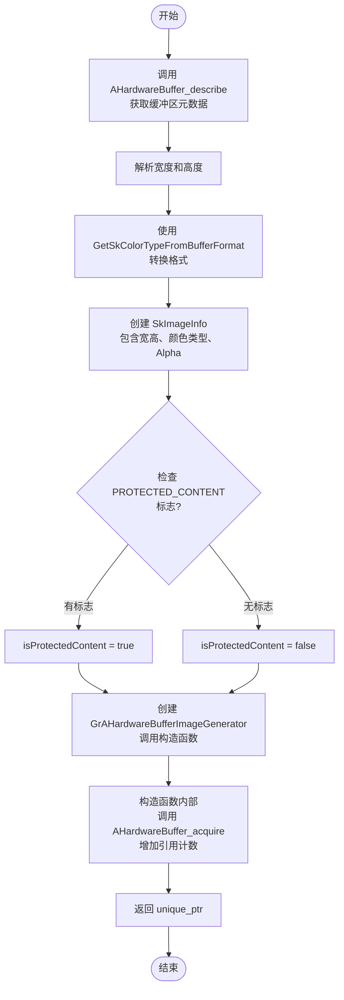

**关键逻辑点**：

- **格式转换**：硬件缓冲区使用 NDK 格式常量（如 `AHARDWAREBUFFER_FORMAT_R8G8B8A8_UNORM`），需转换为 Skia 的 `SkColorType`。
- **受保护内容检测**：通过位掩码检查 `AHARDWAREBUFFER_USAGE_PROTECTED_CONTENT` 标志，用于 DRM 场景。
- **引用计数**：`Make` 创建实例后，构造函数立即调用 `AHardwareBuffer_acquire()` 持有引用。

**调用关系**：

- 被 `SkImage::MakeFromAHardwareBuffer()` 公共 API 调用
- 调用 `AHardwareBuffer_describe()`（Android NDK）
- 调用 `AHardwareBufferUtils::GetSkColorTypeFromBufferFormat()`
- 调用构造函数 `GrAHardwareBufferImageGenerator()`

**性能考量**：

- `AHardwareBuffer_describe()` 是轻量级操作，仅读取缓冲区元数据。
- 工厂方法不涉及 GPU 操作，仅在 CPU 侧执行。

---

## 二、构造与析构（行 53-66）

### 2. GrAHardwareBufferImageGenerator（构造函数）

**位置**: 行 53-62

**函数签名**:
```cpp
GrAHardwareBufferImageGenerator(
    const SkImageInfo& info,
    AHardwareBuffer* hardwareBuffer,
    SkAlphaType alphaType,
    bool isProtectedContent,
    uint32_t bufferFormat,
    GrSurfaceOrigin surfaceOrigin);
```

**功能说明**：

构造函数初始化 `GrAHardwareBufferImageGenerator` 对象。它执行以下操作：

1. 通过初始化列表调用基类 `GrTextureGenerator` 构造函数，传入图像信息。
2. 保存硬件缓冲区指针和其元数据（格式、受保护内容标志、原点方向）。
3. 立即调用 `AHardwareBuffer_acquire()` 为硬件缓冲区增加引用计数，确保对象生命周期内缓冲区保持有效。

该构造函数是 RAII 模式的第一部分，负责获取资源（硬件缓冲区引用）。

**参数说明**：

- `info`: 图像的元数据（宽、高、颜色类型、Alpha 类型、颜色空间）
- `hardwareBuffer`: Android 硬件缓冲区指针
- `alphaType`: Alpha 类型（已由 `Make` 验证）
- `isProtectedContent`: 是否为受保护内容标志
- `bufferFormat`: 原生硬件缓冲区格式（NDK 格式常量）
- `surfaceOrigin`: GPU 纹理原点方向

**实现流程**：

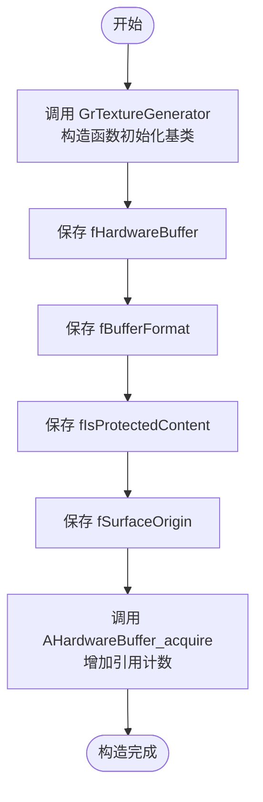

**关键逻辑点**：

- **引用计数**：构造函数立即调用 `AHardwareBuffer_acquire()`，确保对象持有有效的硬件缓冲区引用。
- **RAII 配对**：每个 `acquire()` 必须由析构函数中的 `release()` 配对，保证引用计数正确。
- **成员初始化**：所有成员都通过初始化列表初始化，避免默认构造和赋值的开销。

**调用关系**：

- 被 `Make()` 工厂方法调用
- 调用 `GrTextureGenerator::GrTextureGenerator()` 基类构造函数
- 调用 `AHardwareBuffer_acquire()`

---

### 3. ~GrAHardwareBufferImageGenerator（析构函数）

**位置**: 行 64-66

**函数签名**:
```cpp
~GrAHardwareBufferImageGenerator();
```

**功能说明**：

析构函数清理 `GrAHardwareBufferImageGenerator` 对象占用的资源。它执行以下操作：

1. 调用 `AHardwareBuffer_release()` 释放在构造函数中获取的硬件缓冲区引用。
2. 减少硬件缓冲区的引用计数。当引用计数归零时，Android 系统自动回收缓冲区内存。

该析构函数是 RAII 模式的第二部分，负责释放资源。它确保即使在异常路径上（如对象出作用域或被删除），硬件缓冲区引用也能正确释放。

**实现流程**：

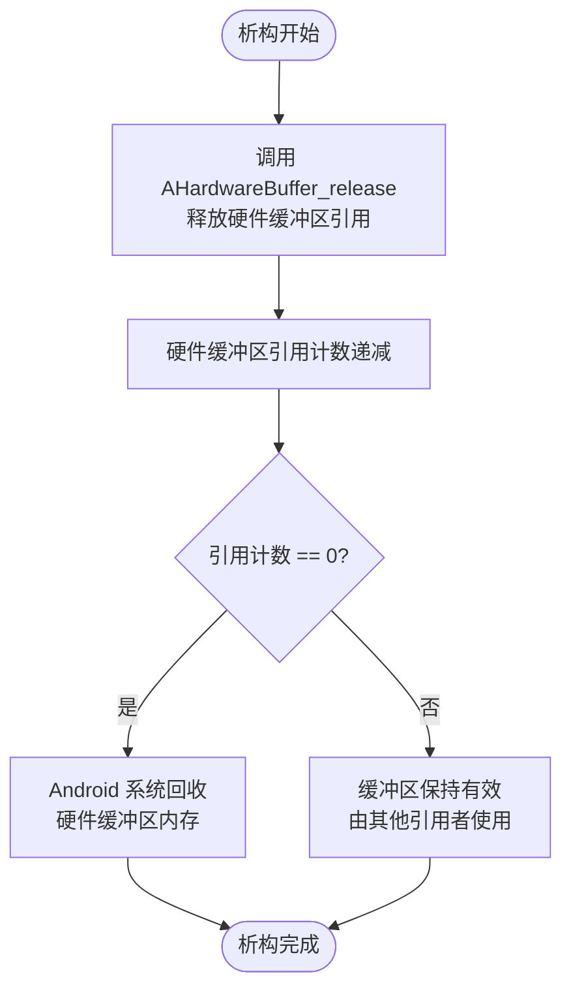

**关键逻辑点**：

- **引用计数管理**：硬件缓冲区采用引用计数模型，多个对象可同时持有引用。
- **异常安全**：析构函数不抛异常，使用 noexcept（隐含）保证异常安全。
- **资源回收**：当生成器销毁时，已创建的 GPU 纹理仍可通过 lambda 回调的 `AutoAHBRelease` 继续持有缓冲区引用。

**调用关系**：

- 在对象销毁时自动调用（栈对象出作用域、unique_ptr 释放、delete 调用）
- 调用 `AHardwareBuffer_release()`

---

## 三、纹理视图创建（行 70-177）

### 4. GrAHardwareBufferImageGenerator::makeView

**位置**: 行 70-177

**函数签名**:
```cpp
GrSurfaceProxyView GrAHardwareBufferImageGenerator::makeView(
    GrRecordingContext* context);
```

**功能说明**：

`makeView` 是本类的核心方法，负责创建一个 `GrSurfaceProxyView` 来表示硬件缓冲区对应的 GPU 纹理。该方法使用 **懒代理（lazy proxy）** 模式延迟纹理创建，直到实际需要时才创建。

主要功能包括：

1. **验证上下文**：检查录制上下文是否有效且未被丢弃，确保为 `DirectContext`。
2. **获取后端格式**：通过 `GrAHardwareBufferUtils::GetBackendFormat()` 将硬件缓冲区格式转换为 Skia 后端格式。
3. **创建 RAII 管理器**：定义并实例化 `AutoAHBRelease` 辅助类，以便在 lambda 回调中安全管理硬件缓冲区引用。
4. **创建懒代理**：调用 `proxyProvider->createLazyProxy()` 创建一个延迟执行的代理，其 lambda 回调将在需要时创建真实的 GPU 纹理。
5. **包装为视图**：创建 `GrSurfaceProxyView` 包含代理、原点方向和读取 Swizzle。

**参数说明**：

- `context`: 录制上下文，用于访问代理提供者和后端信息

**实现流程**：

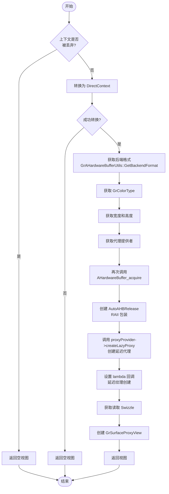

**关键逻辑点**：

- **懒代理模式**：避免在录制阶段创建 GPU 资源，延迟到实际使用时创建，优化性能。
- **两次 acquire()**：第一次在构造函数中获取一般引用，第二次在 `makeView` 中为 lambda 回调获取额外引用。
- **AutoAHBRelease 辅助类**：使用 RAII 和移动语义确保 lambda 捕获的硬件缓冲区引用在回调执行或销毁时正确释放。
- **格式转换**：硬件缓冲区格式转换为后端格式（如 OpenGL 或 Vulkan 格式）。
- **只读标记**：代理被标记为 `kRead_GrIOType`，表示纹理是只读的，允许 GPU 进行优化。

**调用关系**：

- 被 `onGenerateTexture()` 虚函数重载调用
- 调用 `GrAHardwareBufferUtils::GetBackendFormat()`
- 调用 `SkColorTypeToGrColorType()`
- 调用 `proxyProvider->createLazyProxy()`
- 调用 `context->priv().caps()->getReadSwizzle()`

---

### 4.1 AutoAHBRelease 辅助类（行 95-113）

**位置**: 行 95-113（嵌入在 `makeView` 方法内）

**功能说明**：

`AutoAHBRelease` 是一个 RAII 辅助类，负责在 lambda 回调中安全管理 `AHardwareBuffer*` 指针的生命周期。它通过移动语义和标准的 RAII 模式确保硬件缓冲区引用在所有情况下（正常或异常）都能正确释放。

该类的设计特点：
- **禁用拷贝**：拷贝构造被删除（除了注释中说的 std::function 必需的拷贝构造被断言禁用），防止意外的引用重复。
- **支持移动**：移动构造和移动赋值允许 lambda 捕获时将引用转移到回调中。
- **RAII 析构**：析构函数自动释放持有的引用。

**成员**：

- `fAhb`: 持有的 `AHardwareBuffer*` 指针

**各方法说明**：

#### AutoAHBRelease::AutoAHBRelease(AHardwareBuffer* ahb)

**位置**: 行 97

**构造函数**：
```cpp
AutoAHBRelease(AHardwareBuffer* ahb) : fAhb(ahb) {}
```

简单初始化 `fAhb` 成员。

**流程**：
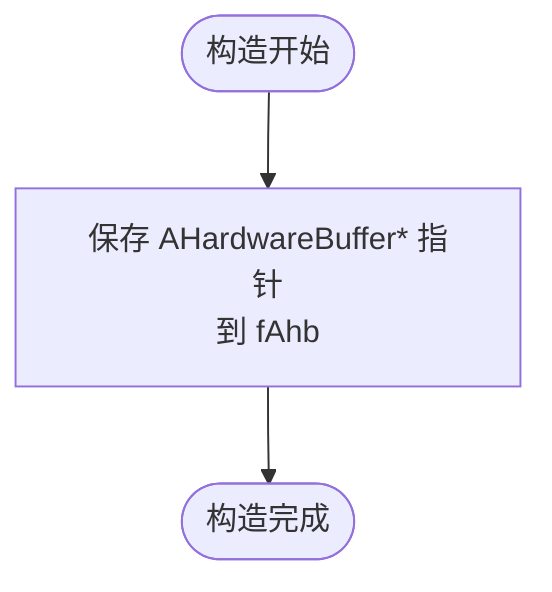

#### AutoAHBRelease::AutoAHBRelease(const AutoAHBRelease&)

**位置**: 行 99

**拷贝构造函数**（已禁用）：
```cpp
AutoAHBRelease(const AutoAHBRelease&) { SkASSERT(0); }
```

此构造函数被声明但包含断言，禁止任何拷贝构造调用。这是因为 `std::function` 需要可拷贝性，但我们的场景中 lambda 应该通过移动语义传递，而不是拷贝。

#### AutoAHBRelease::AutoAHBRelease(AutoAHBRelease&& that)

**位置**: 行 100

**移动构造函数**：
```cpp
AutoAHBRelease(AutoAHBRelease&& that) : fAhb(that.fAhb) { that.fAhb = nullptr; }
```

实现移动语义：
1. 从源对象 `that` 获取硬件缓冲区指针。
2. 将源对象的指针设置为 nullptr，防止其析构时释放已转移的引用。

**流程**：
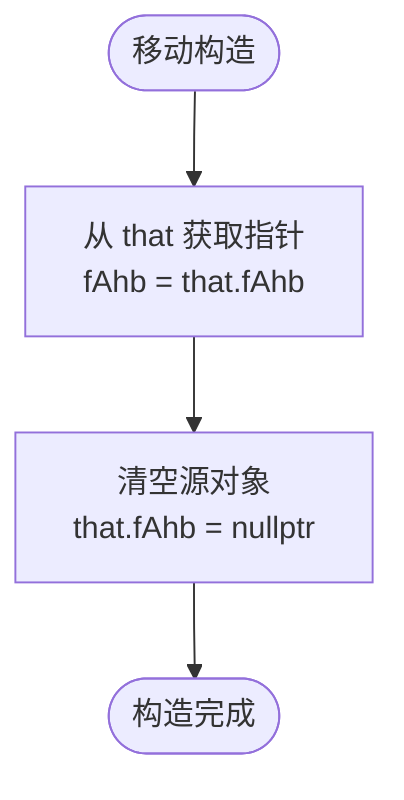

#### ~AutoAHBRelease()

**位置**: 行 101

**析构函数**：
```cpp
~AutoAHBRelease() { fAhb ? AHardwareBuffer_release(fAhb) : void(); }
```

如果 `fAhb` 非空（即持有有效引用），调用 `AHardwareBuffer_release()` 释放。条件运算符 `? :` 避免对空指针调用释放函数。

**流程**：
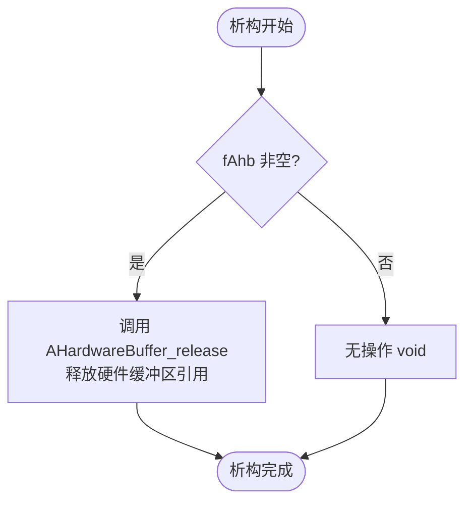

#### AutoAHBRelease::operator=(AutoAHBRelease&& that)

**位置**: 行 103-106

**移动赋值运算符**：
```cpp
AutoAHBRelease& operator=(AutoAHBRelease&& that) {
    fAhb = std::exchange(that.fAhb, nullptr);
    return *this;
}
```

实现移动赋值：
1. 使用 `std::exchange` 原子地获取源对象的指针并将其设置为 nullptr。
2. 返回 `*this` 支持链式赋值。

这里没有显式释放原有的 `fAhb`，因为在这个上下文中（lambda 捕获），通常每个 `AutoAHBRelease` 只被赋值一次。

**流程**：
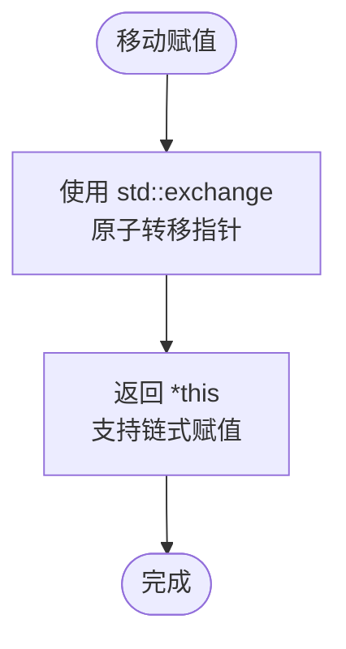

#### AutoAHBRelease::get() const

**位置**: 行 109

**获取指针方法**：
```cpp
AHardwareBuffer* get() const { return fAhb; }
```

返回当前持有的 `AHardwareBuffer*` 指针，用于 lambda 回调中访问硬件缓冲区。

**拷贝赋值运算符删除**：

**位置**: 行 107

```cpp
AutoAHBRelease& operator=(const AutoAHBRelease&) = delete;
```

显式删除拷贝赋值运算符，确保不能通过赋值进行拷贝。

---

### 4.2 Lambda 回调函数（行 116-162）

**位置**: 行 116-162（嵌入在 `createLazyProxy` 调用中）

**功能说明**：

这个 lambda 是 `createLazyProxy` 的回调函数，负责延迟创建 GPU 纹理。当代理首次被使用时（如用于渲染），该 lambda 才会执行，创建真实的后端纹理并包装为 `GrTexture`。

**Lambda 签名**：
```cpp
[direct, buffer = AutoAHBRelease(hardwareBuffer)](
    GrResourceProvider* resourceProvider,
    const GrSurfaceProxy::LazySurfaceDesc& desc)
    -> GrSurfaceProxy::LazyCallbackResult {
    // 实现...
}
```

**捕获列表**：
- `direct`: 按值捕获直接上下文
- `buffer = AutoAHBRelease(hardwareBuffer)`: 通过 `AutoAHBRelease` 移动语义捕获硬件缓冲区引用

**参数说明**：

- `resourceProvider`: 资源提供者，用于创建和包装 GPU 资源
- `desc`: 懒代理描述，包含维度、格式、受保护内容标志等

**实现流程**：

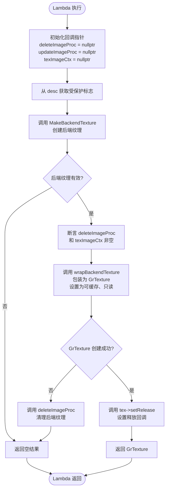

**详细步骤说明**：

1. **初始化回调指针**（行 120-122）：设置三个回调指针为 nullptr，稍后由 `MakeBackendTexture` 填充。

2. **获取受保护标志**（行 124）：从 `desc.fProtected` 读取是否需要受保护的纹理（DRM）。

3. **创建后端纹理**（行 125-135）：调用 `GrAHardwareBufferUtils::MakeBackendTexture()` 从硬件缓冲区创建后端纹理（如 OpenGL 纹理或 Vulkan 镜像）。参数包括：
   - `direct`: 直接上下文
   - `buffer.get()`: 硬件缓冲区指针（从 `AutoAHBRelease` 获取）
   - `desc.fDimensions`: 纹理维度
   - `deleteImageProc`, `updateImageProc`, `texImageCtx`: 由函数填充的回调和上下文
   - `isProtected`: 受保护标志
   - `desc.fFormat`: 后端格式
   - `false`: 不强制 RGB 转换

4. **验证后端纹理**（行 136-138）：检查 `backendTex.isValid()`，若失败返回空结果。

5. **验证回调**（行 139）：断言 `deleteImageProc` 和 `texImageCtx` 已正确填充。

6. **包装为 GrTexture**（行 150-151）：调用 `resourceProvider->wrapBackendTexture()` 将后端纹理包装为 Skia 的 `GrTexture` 对象。关键参数：
   - `kBorrow_GrWrapOwnership`: 纹理所有权仍在外部（AHB），Skia 仅借用
   - `GrWrapCacheable::kYes`: 允许纹理缓存，避免重复导入同一 AHB
   - `kRead_GrIOType`: 标记为只读，允许 GPU 优化

7. **错误处理**（行 152-155）：若 `wrapBackendTexture` 失败，调用 `deleteImageProc` 清理后端纹理并返回空结果。

8. **设置释放回调**（行 157-159）：调用 `tex->setRelease()` 设置释放回调，当纹理销毁时自动调用 `deleteImageProc` 清理后端纹理资源。

9. **返回结果**（行 161）：返回创建的 `GrTexture`。

**关键逻辑点**：

- **懒执行**：Lambda 直到代理被实际使用时才执行，避免提前消耗 GPU 资源。
- **引用管理**：通过值捕获 `AutoAHBRelease` 对象，lambda 获得硬件缓冲区的独立引用，生命周期独立于原始生成器。
- **删除回调**：`deleteImageProc` 回调确保后端纹理在 `GrTexture` 销毁时被正确清理。
- **可缓存包装**：使用 `GrWrapCacheable::kYes` 允许资源缓存复用已包装的纹理，避免重复导入成本。

**调用关系**：

- 被 `createLazyProxy` 作为回调在第一次使用代理时调用
- 调用 `GrAHardwareBufferUtils::MakeBackendTexture()`
- 调用 `resourceProvider->wrapBackendTexture()`
- 调用 `GrTexture::setRelease()`

**性能考量**：

- 懒执行避免了提前创建纹理的开销。
- 可缓存包装减少了重复导入同一 AHB 的成本，尤其在多帧渲染中受益明显。

---

## 四、纹理生成与验证（行 179-220）

### 5. GrAHardwareBufferImageGenerator::onGenerateTexture

**位置**: 行 179-207

**函数签名**:
```cpp
GrSurfaceProxyView GrAHardwareBufferImageGenerator::onGenerateTexture(
    GrRecordingContext* context,
    const SkImageInfo& info,
    skgpu::Mipmapped mipmapped,
    GrImageTexGenPolicy texGenPolicy);
```

**功能说明**：

`onGenerateTexture` 是 `GrTextureGenerator` 基类的纯虚函数重载，负责生成满足特定需求的纹理代理。该方法实现纹理生成策略，根据调用者的需求决定是直接返回原始代理还是创建副本以支持 MipMap。

**参数说明**：

- `context`: 录制上下文
- `info`: 所需的图像信息
- `mipmapped`: 是否需要 MipMap（`kYes` 或 `kNo`）
- `texGenPolicy`: 纹理生成策略（`kDraw` 或 `kNew_Uncached_Unbudgeted`）

**实现流程**：

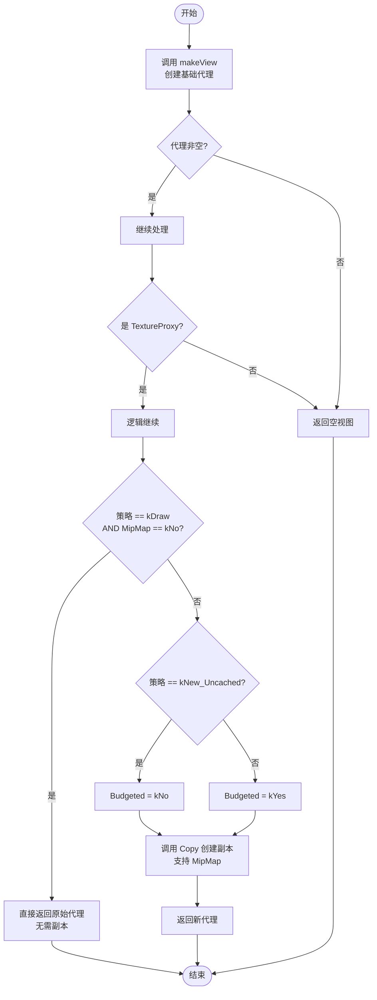

**关键逻辑点**：

- **两种策略**：
  - **kDraw 策略**：若调用者仅用于绘制且不需要 MipMap，直接返回 `makeView()` 的懒代理，避免创建副本。
  - **kNew_Uncached_Unbudgeted 或其他策略**：创建副本支持 MipMap 和预算管理。

- **副本创建**：通过 `GrSurfaceProxyView::Copy()` 创建新的纹理副本，该副本可以生成 MipMap 链。

- **预算管理**：根据 `texGenPolicy` 决定副本是否纳入 GPU 内存预算（`Budgeted::kYes` 或 `kNo`）。

- **断言验证**：通过 `SkASSERT` 确保返回的代理是 TextureProxy 类型。

**调用关系**：

- 被 Skia 纹理生成管线调用，通常源于 `SkImage::getTexture()` 或类似接口
- 调用 `makeView()`
- 调用 `GrSurfaceProxyView::Copy()`

**性能考量**：

- kDraw 策略避免了不必要的副本创建，直接使用懒代理。
- 仅当需要 MipMap 时才创建副本，减少内存开销。

---

### 6. GrAHardwareBufferImageGenerator::onIsValid

**位置**: 行 209-220

**函数签名**:
```cpp
bool GrAHardwareBufferImageGenerator::onIsValid(SkRecorder* recorder) const;
```

**功能说明**：

`onIsValid` 是 `GrTextureGenerator` 基类的纯虚函数重载，用于验证该生成器是否与给定的录制器兼容。该方法执行一系列检查以确保生成器能在给定的上下文中正常工作。

Android 硬件缓冲区纹理仅支持 Ganesh 后端中的 OpenGL 和 Vulkan 后端，不支持其他后端（如 Metal、CPU）。

**参数说明**：

- `recorder`: Skia 录制器指针，可能为 nullptr

**实现流程**：

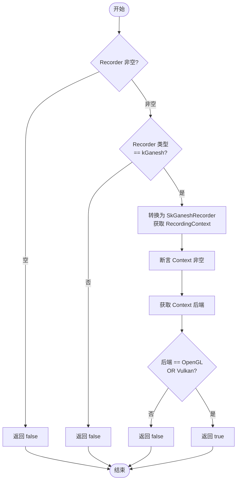

**详细步骤说明**：

1. **检查 Recorder 非空**（行 210-211）：若 `recorder` 为 nullptr，直接返回 false。

2. **检查 Recorder 类型**（行 213-214）：检查 `recorder->type()` 是否为 `SkRecorder::Type::kGanesh`。只有 Ganesh 录制器支持 AHB 纹理。

3. **转换并获取上下文**（行 216）：将 `recorder` 强制转换为 `SkGaneshRecorder*`，获取其内部的 `RecordingContext`。

4. **验证上下文**（行 217）：断言获取的上下文非空。

5. **检查后端**（行 218-219）：检查 `ctx->backend()` 是否为 `GrBackendApi::kOpenGL` 或 `GrBackendApi::kVulkan`。这两个后端支持 AHB 纹理导入。

6. **返回结果**：仅当所有检查通过时返回 true，否则返回 false。

**关键逻辑点**：

- **三层验证**：
  1. Recorder 必须存在
  2. 必须是 Ganesh 类型的 Recorder
  3. 后端必须是 OpenGL 或 Vulkan

- **后端限制**：AHB 纹理是 Android 平台特性，只有部分 Skia 后端支持。Metal 和 CPU 后端不支持。

- **静态检查**：该方法是 const 方法，不修改对象状态，仅进行检查。

**调用关系**：

- 被 Skia 管线调用，以决定是否使用该生成器
- 调用 `recorder->type()`
- 调用 `static_cast<SkGaneshRecorder*>()`
- 调用 `ctx->backend()`

**性能考量**：

- 该方法进行的都是轻量级检查（指针比较、枚举对比），无 GPU 操作。
- 通常在创建 SkImage 时调用一次，不在关键渲染路径上。

---

## 综合调用关系图

以下是 `GrAHardwareBufferImageGenerator` 的完整函数调用关系和数据流：

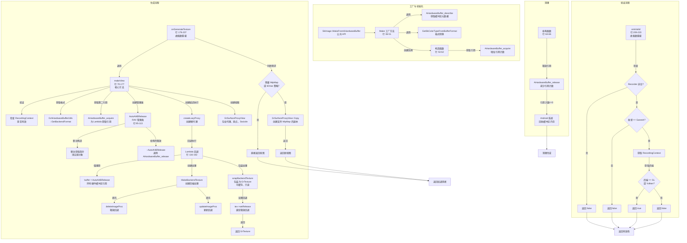

**关键流程说明**：

1. **初始化阶段**：`Make` 工厂方法从 AHB 描述创建生成器，构造函数获取引用计数。

2. **纹理生成阶段**：
   - `onGenerateTexture` 调用 `makeView` 创建基础代理。
   - `makeView` 创建懒代理，设置 lambda 回调。
   - Lambda 被调用时创建真实的后端纹理，通过 `AutoAHBRelease` 管理引用。
   - 返回包装的 `GrTexture`。

3. **生成策略阶段**：根据 `texGenPolicy` 和 `mipmapped` 决定是否创建副本。

4. **验证阶段**：`onIsValid` 检查 Recorder 类型和后端兼容性。

5. **清理阶段**：析构函数释放引用，当引用计数归零时 Android 系统回收内存。

---

## 深入主题说明

### 懒代理模式（Lazy Proxy Pattern）

**什么是懒代理？**

懒代理是 Skia 中的一种优化模式，延迟实际资源（如 GPU 纹理）的创建直到第一次真正需要时。在 `GrAHardwareBufferImageGenerator` 中：

1. **创建阶段**：`createLazyProxy()` 立即返回一个代理对象，但不创建真实的 GPU 纹理。
2. **使用阶段**：当渲染引擎首次使用该代理时，回调 lambda 函数才执行，此时创建真实纹理。

**为什么使用懒代理？**

- **性能优化**：避免在录制阶段创建不必要的 GPU 资源。在复杂渲染场景中，可能有许多代理最终不被使用。
- **延迟决策**：允许渲染引擎根据实际需求决定是否创建纹理，如是否需要 MipMap 或其他处理。
- **资源复用**：懒代理支持资源缓存，同一 AHB 重复使用时可复用已创建的纹理。

**示例场景**：

假设应用加载 10 个图像，但只显示其中 3 个。使用懒代理可避免为未显示的 7 个图像创建 GPU 纹理，节省显存。

### RAII 引用管理（RAII Reference Management）

**引用计数机制**：

Android 的 `AHardwareBuffer` 采用引用计数模型：
- `AHardwareBuffer_acquire()`：增加引用计数
- `AHardwareBuffer_release()`：减少引用计数，计数为 0 时系统回收内存

**GrAHardwareBufferImageGenerator 中的引用计数**：

```
对象创建：
  Make() → 构造函数 → acquire() [ref_count = 1]

makeView() 调用：
  acquire() [ref_count = 2]
  → AutoAHBRelease 捕获引用
  → Lambda 回调持有引用

对象销毁：
  ~析构函数 → release() [ref_count = 1]

Lambda 回调销毁：
  ~AutoAHBRelease → release() [ref_count = 0]
  → 系统回收缓冲区
```

**AutoAHBRelease 的作用**：

`AutoAHBRelease` 是一个 RAII 包装器，确保：
1. **异常安全**：即使 lambda 抛异常，析构函数仍被调用，引用正确释放。
2. **移动语义**：通过值捕获和移动构造，lambda 获得独立的引用，生命周期完全由 lambda 控制。
3. **禁用拷贝**：防止意外的引用重复，只允许移动。

**关键代码**：

```cpp
// 在 makeView 中：
AHardwareBuffer_acquire(hardwareBuffer);  // 第二次 acquire

class AutoAHBRelease {
    // 允许移动，禁用拷贝
    AutoAHBRelease(AutoAHBRelease&& that) : fAhb(that.fAhb) {
        that.fAhb = nullptr;  // 转移所有权
    }
    ~AutoAHBRelease() {
        fAhb ? AHardwareBuffer_release(fAhb) : void();  // 条件释放
    }
};

// Lambda 通过值捕获
[..., buffer = AutoAHBRelease(hardwareBuffer)](...) {
    // Lambda 获得 buffer 的所有权
    // 销毁时自动释放
}
```

### Lambda 捕获和值语义（Lambda Capture & Value Semantics）

**为什么通过值捕获 AutoAHBRelease？**

在 `makeView` 中：
```cpp
sk_sp<GrTextureProxy> texProxy = proxyProvider->createLazyProxy(
    [direct, buffer = AutoAHBRelease(hardwareBuffer)](...) { ... },
    ...
);
```

- `buffer = AutoAHBRelease(hardwareBuffer)`：创建临时 `AutoAHBRelease` 对象，通过移动构造转移到 lambda 捕获列表。
- **值捕获的好处**：
  1. Lambda 获得硬件缓冲区的独立引用，不依赖于原始生成器对象。
  2. 生成器销毁不影响 lambda 持有的引用。
  3. Lambda 销毁时自动释放引用。

**典型场景**：

```
时间线：
T0: 创建生成器        → acquire() [ref_count = 1]
T1: 调用 makeView     → acquire() [ref_count = 2]
                      → Lambda 捕获 AutoAHBRelease [ref_count = 2]
T2: 销毁生成器        → release() [ref_count = 1]
                      → 生成器不存在，但 Lambda 仍持有引用
T3: 首次渲染          → Lambda 执行，创建纹理
T4: 纹理销毁          → Lambda 的 AutoAHBRelease 析构
                      → release() [ref_count = 0]
                      → 系统回收缓冲区
```

### 可缓存包装（Cacheable Wrapping）

**什么是 GrWrapCacheable::kYes？**

在 lambda 回调中：
```cpp
sk_sp<GrTexture> tex = resourceProvider->wrapBackendTexture(
    backendTex,
    kBorrow_GrWrapOwnership,
    GrWrapCacheable::kYes,  // 可缓存
    kRead_GrIOType);
```

- **kYes**：创建的 `GrTexture` 可被资源缓存保存，重复使用。
- **kNo**：每次使用都创建新的 `GrTexture`。

**为什么重要？**

考虑在多帧动画中重复使用同一 AHB：

```
帧 1: 首次使用 AHB
  → Lambda 执行，创建后端纹理
  → wrapBackendTexture(..., kYes) 创建 GrTexture
  → 纹理放入缓存

帧 2-N: 再次使用 AHB
  → 缓存直接返回已存在的 GrTexture
  → 无需重复导入，性能大幅提升
```

**性能收益**：

- 首次使用：创建纹理 + 缓存，成本较高
- 后续使用：直接从缓存获取，成本低廉
- 特别是高帧率渲染时，收益明显

### Android 硬件缓冲区基础（AHardwareBuffer Basics）

**AHardwareBuffer 是什么？**

`AHardwareBuffer` 是 Android NDK 提供的共享内存机制，允许：
1. **跨进程共享**：不同进程的 GPU 可访问同一缓冲区。
2. **CPU-GPU 共享**：CPU 和 GPU 可同时访问。
3. **硬件加速**：利用 GPU 直接访问物理内存。

**AHB 的用途**：

```
应用场景：
  1. 视频硬件解码 → AHB → GPU 纹理（直接访问，无拷贝）
  2. 相机捕获     → AHB → GPU 纹理
  3. 进程间纹理共享 → 一个进程创建 AHB，另一进程导入并使用
```

**与 GrAHardwareBufferImageGenerator 的关系**：

```
AHardwareBuffer (Android NDK)
    ↓
GrAHardwareBufferImageGenerator (Skia Ganesh)
    ↓
GPU 纹理（OpenGL / Vulkan）
    ↓
SkImage / 渲染管线
```

**受保护内容（Protected Content）**：

```cpp
bool isProtected = 0 != (bufferDesc.usage & AHARDWAREBUFFER_USAGE_PROTECTED_CONTENT);
```

- **含义**：DRM（数字版权管理）保护的内容，如流媒体或付费视频。
- **限制**：受保护纹理只能在受保护的渲染路径上使用，不能读回 CPU。
- **GPU 限制**：某些 GPU 操作（如 MipMap 生成、格式转换）可能不支持受保护纹理。

---

## 总结

`GrAHardwareBufferImageGenerator` 是 Skia 中集成 Android 硬件缓冲区的关键组件。它通过以下设计实现高效的纹理导入：

1. **懒代理模式**：延迟纹理创建，优化性能。
2. **RAII 引用管理**：确保硬件缓冲区引用在所有情况下正确释放。
3. **可缓存包装**：支持纹理复用，减少重复导入成本。
4. **移动语义**：在 lambda 捕获中实现引用所有权转移。
5. **后端兼容性**：仅支持 OpenGL 和 Vulkan，不支持其他后端。

理解这些设计有助于正确使用和优化涉及 Android 硬件缓冲区的 Skia 渲染管线。
