# GrAppliedClip 函数实现参考

> 源码: `src/gpu/ganesh/GrAppliedClip.h` (168行)
> (无 .cpp 实现文件，全为内联实现)

---

## 类型速查

阅读后续函数实现前，建议先熟悉以下类型。按职责分为 5 组。

### 1. 自身类型

| 类型 | 含义 |
|------|------|
| `GrAppliedHardClip` | 硬件裁剪结果容器 (scissor + window rects + stencil) |
| `GrAppliedClip` | 完整裁剪结果容器 (硬件裁剪 + 覆盖 FP) |

### 2. 裁剪状态

| 类型 | 含义 |
|------|------|
| `GrScissorState` | 剪刀矩形状态，内含 RT 尺寸 + 当前剪刀矩形 |
| `GrWindowRectsState` | 窗口矩形排除列表状态 |
| `GrWindowRectangles` | 窗口矩形集合 (最多 `kMaxWindows` 个排除矩形) |
| `SK_InvalidGenID` | 无效 generation ID 常量，表示无 stencil 裁剪 |

### 3. 片段处理器

| 类型 | 含义 |
|------|------|
| `GrFragmentProcessor` | GPU 片段处理器基类，用于软件覆盖裁剪 |
| `GrVisitProxyFunc` | 纹理代理访问回调函数类型 |

### 4. 几何类型

| 类型 | 含义 |
|------|------|
| `SkIRect` | 整数矩形 (剪刀区域) |
| `SkRect` | 浮点矩形 (绘制边界) |
| `SkISize` | 整数尺寸 (渲染目标维度) |

### 5. 容器工具

| 类型 | 含义 |
|------|------|
| `std::unique_ptr<GrFragmentProcessor>` | FP 独占所有权指针 |

---

## GrAppliedClip 在 Skia 工程中的架构位置

| 属性 | 说明 |
|------|------|
| **归属** | `src/gpu/ganesh/` — Ganesh GPU 后端裁剪子系统 |
| **接口** | 数据容器类，无虚函数，由 `GrClip::apply()` 填充 |
| **上游** | `GrClip::apply()` / `GrHardClip::apply()` 产生裁剪结果并写入本类 |
| **下游** | `GrPipeline` 构造时消费 `GrAppliedClip`，将裁剪状态固化到渲染管线 |

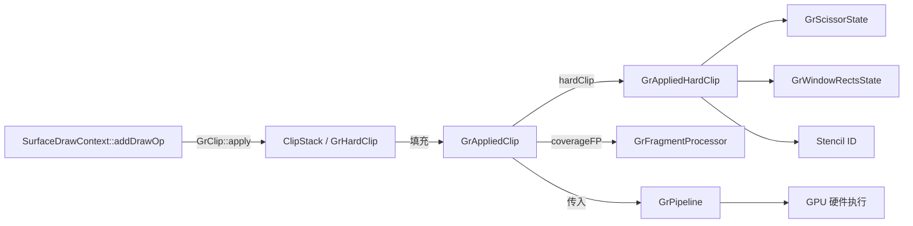

---

## 架构总览

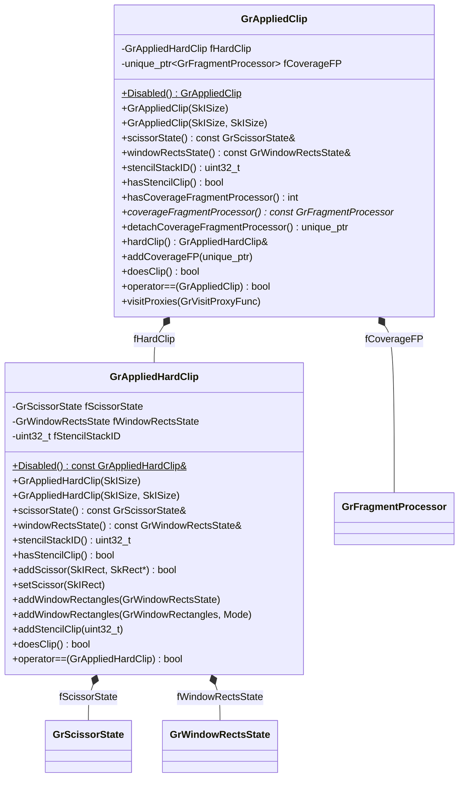

---

## 1. GrAppliedHardClip 方法 (line 29-96)

### 1.1 `Disabled()` (line 31-37)

静态工厂方法，返回一个"禁用裁剪"的单例常量引用。

**实现**: 构造一个超大尺寸 `{1<<29, 1<<29}` 的实例作为 `static const`，因为 scissor 覆盖整个 RT 时 `enabled()` 返回 false，等效于无裁剪。

---

### 1.2 构造函数 (line 39-43)

| 构造函数 | 行为 |
|----------|------|
| `GrAppliedHardClip(SkISize rtDims)` | 用 RT 尺寸初始化 `fScissorState`，scissor 默认覆盖全 RT (即禁用) |
| `GrAppliedHardClip(SkISize logicalRTDims, SkISize backingStoreDims)` | 用 backing store 尺寸初始化 scissor，然后立即 `set()` 为 logical 尺寸矩形 (处理 approximate-fit RT) |

#### 参数详解: rtDims / logicalRTDims / backingStoreDims

| 参数 | 含义 | 来源 |
|------|------|------|
| `rtDims` | Render Target 的逻辑尺寸，即用户请求的绘制区域大小 | `SurfaceDrawContext::dimensions()` |
| `logicalRTDims` | 同 rtDims，强调"逻辑"语义——用户可见的有效绘制区域 | `SurfaceDrawContext::dimensions()` |
| `backingStoreDims` | GPU 实际分配的后备存储尺寸，可能 ≥ logicalRTDims | `GrSurfaceProxy::backingStoreDimensions()` |

#### SkBackingFit 机制

Skia 在分配 GPU Render Target 时，通过 `SkBackingFit` 枚举控制内存分配策略：

| 模式 | 行为 | 适用场景 |
|------|------|----------|
| `SkBackingFit::kExact` | backing store = logical dims，精确分配 | 最终呈现目标、用户纹理 |
| `SkBackingFit::kApprox` | backing store ≥ logical dims，取近似更大尺寸 | 中间临时 RT（可被缓存复用） |

**Approx 模式的 GetApproxSize 规则**:
- 尺寸 ≤ 16px → 保持 16px（最小分配单位）
- 尺寸 ≤ 1024px → 向上取到下一个 2 的幂次（如 800 → 1024）
- 尺寸 > 1024px → 取 `ceil(size × 4/3)` 或下一个 2 的幂次，两者较小值

**数值示例**: 用户请求 800×600 的 RT，使用 `kApprox` fit：
- 800 → next power-of-2 = 1024
- 600 → next power-of-2 = 1024
- 结果: logicalRTDims = {800, 600}，backingStoreDims = {1024, 1024}

#### 双参数构造函数的工作流程

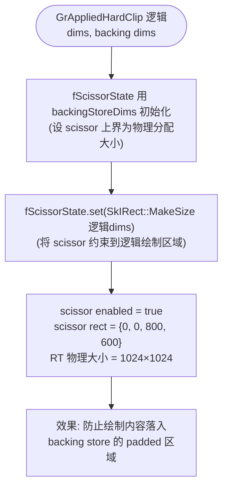

**为什么需要两步初始化？** `GrScissorState` 的 `set()` 方法会验证新矩形是否在 RT 尺寸范围内。若直接用 logicalRTDims 初始化后 set(logicalRTDims)，scissor 不会被标记为 enabled（因为它覆盖整个 RT）。用更大的 backingStoreDims 初始化后再 set(logicalRTDims)，scissor 才会正确启用——因为它不再覆盖整个后备存储。

#### 调用来源

此双参数构造函数的典型调用点在 `SurfaceDrawContext.cpp:1915`：

```cpp
GrAppliedClip(this->dimensions(), this->asSurfaceProxy()->backingStoreDimensions())
```

当 `SurfaceDrawContext` 的底层代理使用 `kApprox` fit 时，`dimensions()` 返回逻辑尺寸，`backingStoreDimensions()` 返回实际 GPU 分配尺寸。两者不等时，构造函数自动启用 scissor 将绘制约束到逻辑区域内。

---

### 1.3 访问器 (line 48-51)

简单 getter，直接返回内部字段:

| 方法 | 返回 |
|------|------|
| `scissorState()` | `fScissorState` 的 const 引用 |
| `windowRectsState()` | `fWindowRectsState` 的 const 引用 |
| `stencilStackID()` | `fStencilStackID` |
| `hasStencilClip()` | `fStencilStackID != SK_InvalidGenID` |

---

### 1.4 `addScissor()` (line 58-60)

将传入矩形与当前 scissor 求交，同时收紧绘制边界。

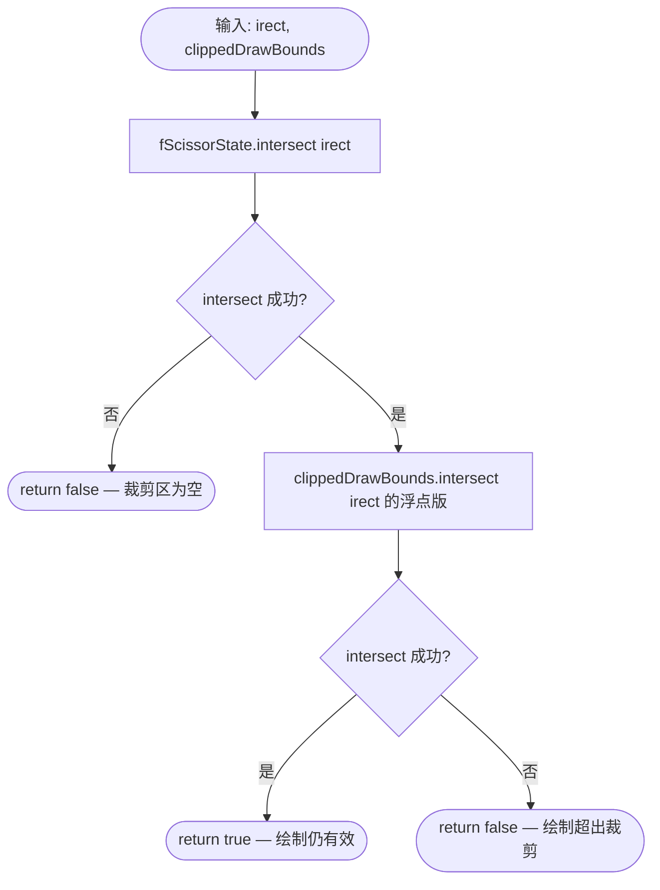

**设计说明 — 为什么是求交集而非替换？**

GPU 硬件（OpenGL / Vulkan）对每个 viewport 仅支持**一个** scissor 矩形。然而 Skia 的裁剪栈中可能积累多个矩形裁剪约束——用户连续调用 `clipRect()`、Render Target 逻辑边界、以及 GrReducedClip 分析出的裁剪窗口等。在最终提交 draw call 之前，必须在 CPU 端将这些约束合并为单个矩形，其数学语义天然就是**交集**（所有约束同时满足的区域）。

与 `setScissor()`（直接覆盖）的对比：
- `setScissor()` 用于初始化或重置场景，调用者已确保传入的是最终矩形。
- `addScissor()` 用于增量累积场景，需要兼容已有约束，因此采用 intersect 语义。

当交集结果为空矩形时，函数返回 `false`，通知调用方该绘制命令可被完全跳过（early-out 优化）。

---

### 1.5 `setScissor()` (line 62-64)

直接设置 scissor 为给定矩形 (替换而非求交)。

**实现**: 调用 `fScissorState.set(irect)`。

---

### 1.6 `addWindowRectangles()` (line 66-74)

两个重载，添加窗口矩形排除区域:

| 重载 | 行为 |
|------|------|
| `addWindowRectangles(const GrWindowRectsState&)` | 直接赋值整个 state |
| `addWindowRectangles(const GrWindowRectangles&, Mode)` | 用 windows + mode 构造 state |

两者均断言 `!fWindowRectsState.enabled()` — 仅允许设置一次。

---

### 1.7 `addStencilClip()` (line 76-79)

设置模板裁剪的 stack ID。

**实现**: 断言当前为 `SK_InvalidGenID` (仅允许设置一次)，然后赋值 `fStencilStackID = stencilStackID`。

---

### 1.8 `doesClip()` (line 81-83)

判断此硬件裁剪是否实际生效。

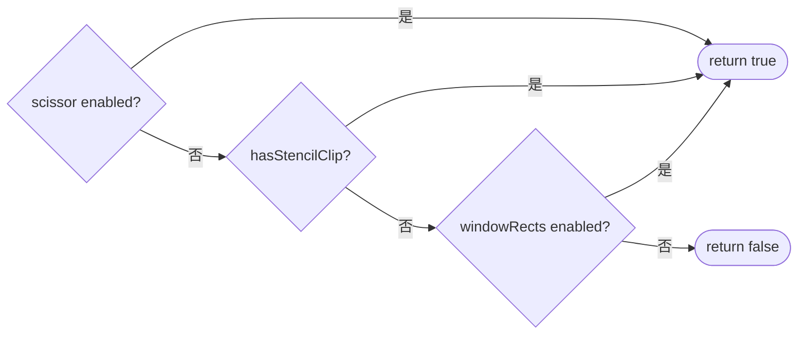

---

### 1.9 `operator==` / `operator!=` (line 85-90)

逐字段比较:

```
fScissorState == that.fScissorState &&
fWindowRectsState == that.fWindowRectsState &&
fStencilStackID == that.fStencilStackID
```

`operator!=` 取反实现。

---

## 2. GrAppliedClip 方法 (line 101-165)

### 2.1 `Disabled()` (line 103-105)

静态工厂方法，返回禁用状态的 `GrAppliedClip` (按值返回，不可复制但可移动)。

**实现**: `return GrAppliedClip({1 << 29, 1 << 29})`。

---

### 2.2 构造函数 (line 107-112)

| 构造函数 | 行为 |
|----------|------|
| `GrAppliedClip(SkISize rtDims)` | 用 RT 尺寸构造内部 `fHardClip` |
| `GrAppliedClip(SkISize logicalRTDims, SkISize backingStoreDims)` | 转发双尺寸给 `fHardClip` |
| 移动构造 | `= default` |
| 拷贝构造 | `= delete` (因 `unique_ptr` 不可拷贝) |

---

### 2.3 委托访问器 (line 114-117)

全部委托给 `fHardClip`:

| 方法 | 委托目标 |
|------|----------|
| `scissorState()` | `fHardClip.scissorState()` |
| `windowRectsState()` | `fHardClip.windowRectsState()` |
| `stencilStackID()` | `fHardClip.stencilStackID()` |
| `hasStencilClip()` | `fHardClip.hasStencilClip()` |

---

### 2.4 Coverage FP 访问器 (line 118-126)

| 方法 | 行为 |
|------|------|
| `hasCoverageFragmentProcessor()` | 返回 `fCoverageFP != nullptr` (注: 返回类型为 `int`) |
| `coverageFragmentProcessor()` | 断言非空后返回裸指针 `fCoverageFP.get()` |
| `detachCoverageFragmentProcessor()` | 断言非空后移动返回 `unique_ptr` (所有权转移) |

---

### 2.5 `hardClip()` (line 128-129)

两个重载，返回内部 `fHardClip` 的 const/non-const 引用，允许外部直接操作硬件裁剪。

---

### 2.6 `addCoverageFP()` (line 131-138)

添加覆盖片段处理器。若已有 FP 则组合。

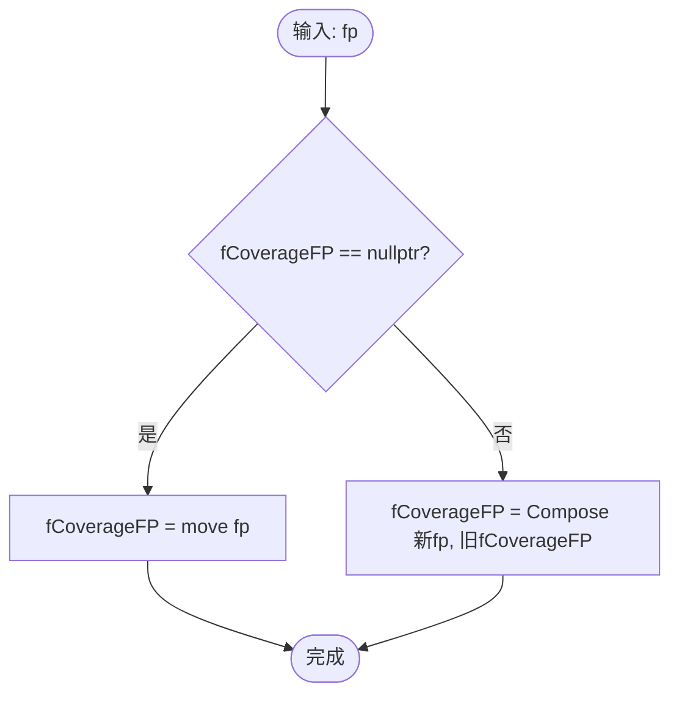

**组合语义**: `GrFragmentProcessor::Compose(new, old)` 将新旧 FP 合成一个，最终覆盖值为二者乘积。

---

### 2.7 `doesClip()` (line 140-142)

判断是否存在任何形式的裁剪:

```
return fHardClip.doesClip() || fCoverageFP != nullptr;
```

---

### 2.8 `operator==` / `operator!=` (line 144-154)

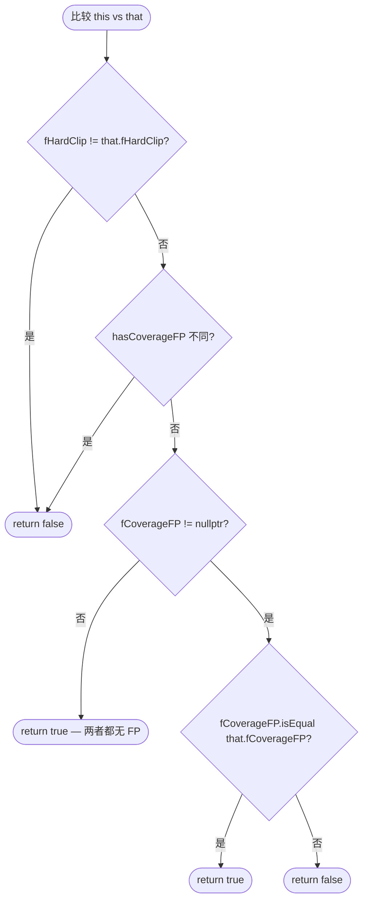

---

### 2.9 `visitProxies()` (line 156-160)

遍历内部覆盖 FP 持有的纹理代理。

**实现**: 若 `fCoverageFP != nullptr`，调用 `fCoverageFP->visitProxies(func)`；否则无操作。用于 GrPipeline 的资源追踪。

---

## 附录: 完整数据流

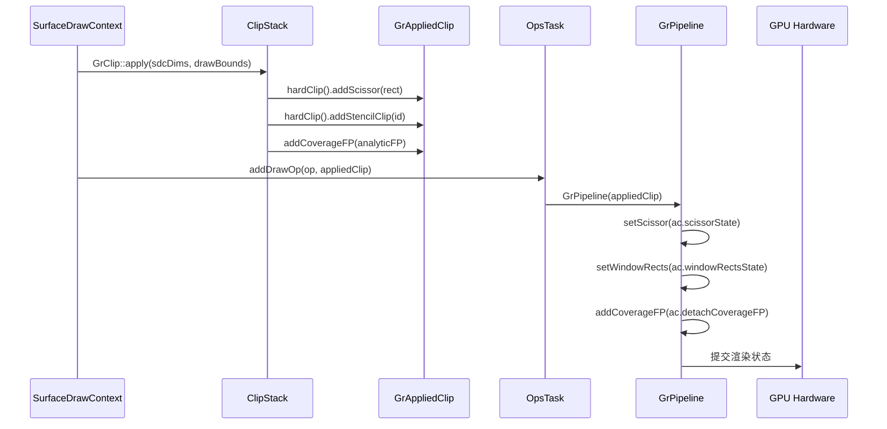

---

## 附录: 硬件裁剪 vs 软件裁剪决策

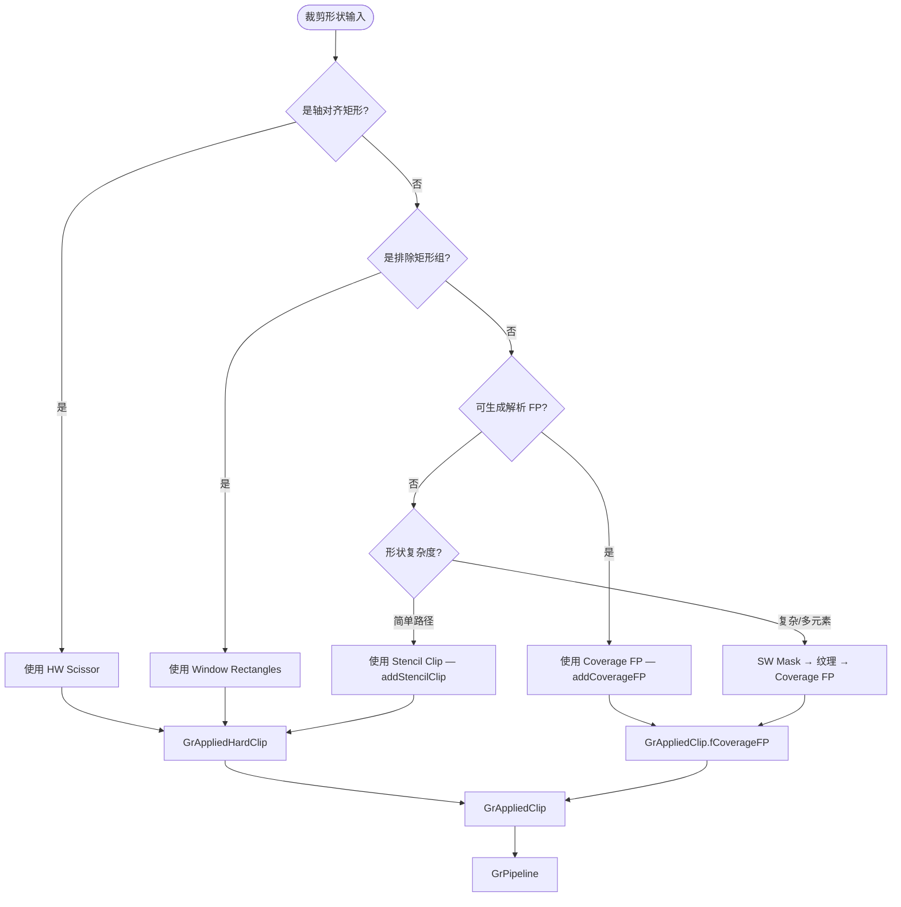

---

## 附录: Scissor vs Window Rectangles 硬件机制对比

### 对比表格

| 维度 | Scissor | Window Rectangles |
|------|---------|-------------------|
| 硬件支持 | 所有 GPU 必备，核心功能 | 扩展功能 `GL_EXT_window_rectangles` |
| 矩形数量 | 仅 1 个 | 最多 8 个 |
| 语义模式 | Inclusive（仅保留矩形内像素） | Inclusive 或 Exclusive（排除矩形内像素） |
| 适用场景 | 轴对齐矩形 intersect 裁剪 | 多矩形 difference 裁剪（挖洞） |
| GL API | `glScissor(x, y, w, h)` | `glWindowRectanglesEXT(mode, count, rects)` |
| 渲染目标限制 | 无限制 | 仅离屏 Render Target（非默认帧缓冲） |
| 性能开销 | 极低，硬件光栅化阶段直接丢弃 | 低，光栅化后逐片元测试 |

### Scissor 机制

Scissor 是 GPU 管线中最基础的硬件裁剪能力：

- **原理**: 在光栅化阶段，GPU 对每个片元执行包含测试——仅当片元坐标落在 scissor 矩形内时才继续处理
- **API**: `glScissor(x, y, width, height)` + `glEnable(GL_SCISSOR_TEST)`
- **在 Skia 中的表示**: `GrAppliedHardClip::fScissorState`，由 `GrScissorState` 封装，记录是否启用及矩形范围
- **典型来源**: `SkClipOp::kIntersect` + 轴对齐矩形 → 直接映射为 scissor

### Window Rectangles 机制

Window Rectangles 是一种 GPU 扩展裁剪能力，用于处理 scissor 无法表达的"排除"语义：

- **原理**: 定义最多 8 个矩形区域，以 Exclusive 模式（丢弃矩形内片元）或 Inclusive 模式（丢弃矩形外片元）执行测试
- **API**: `glWindowRectanglesEXT(GLenum mode, GLsizei count, const GLint *box)`
  - `mode = GL_EXCLUSIVE_EXT`: 片元落入任一矩形即被丢弃
  - `mode = GL_INCLUSIVE_EXT`: 片元不在任何矩形内即被丢弃
- **在 Skia 中的表示**: `GrAppliedHardClip::fWindowRectsState`，由 `GrWindowRectsState` 封装
- **典型来源**: `SkClipOp::kDifference` + 轴对齐矩形 → 映射为 Exclusive 模式的 window rect

### 协作关系

Scissor 和 Window Rectangles 在管线中协同工作，分别处理不同裁剪语义：

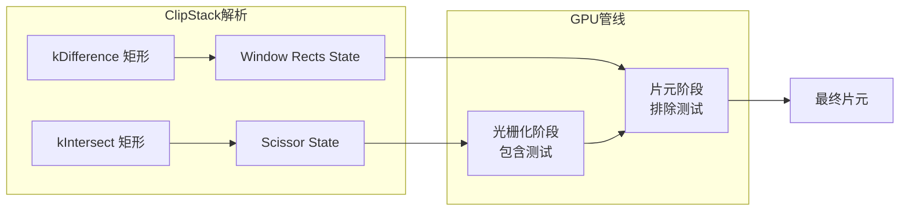

在 `ClipStack.cpp:1465` 附近的逻辑中，ClipStack 会将符合条件的 difference 矩形收集到 window rects 列表中，与 scissor 共同构成硬件裁剪方案。两者的分工为：

- **Scissor**: 确定绘制的最大外边界（所有 intersect 矩形的交集）
- **Window Rects**: 在 scissor 区域内"挖洞"（排除 difference 矩形覆盖的区域）

### 降级策略

当硬件无法满足 window rectangles 需求时，Skia 会采用以下降级路径：

| 降级条件 | 回退方案 |
|----------|----------|
| GPU 不支持 `GL_EXT_window_rectangles` | 使用 stencil clip 实现 difference 裁剪 |
| difference 矩形数量超过 8 个 | 超出部分回退到 stencil clip |
| 渲染目标为默认帧缓冲（on-screen） | 使用 stencil clip 或 coverage FP |
| 矩形非轴对齐（旋转/倾斜） | 无法使用 window rects，回退到 coverage FP 或 stencil |

降级优先级：Window Rectangles > Stencil Clip > Coverage Fragment Processor（SW Mask）

---

## 附录: Render Target 尺寸模型 (SkBackingFit)

### 概念图

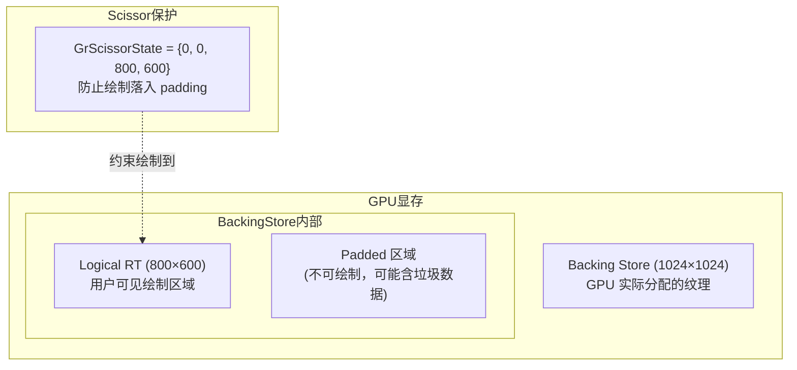

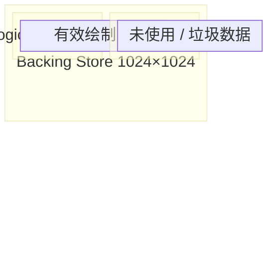

### GetApproxSize 规则

Skia 在 `GrResourceProvider::MakeApprox()` 中调用 `GetApproxSize` 确定 backing store 尺寸：

| 输入尺寸范围 | 计算规则 | 示例 |
|-------------|----------|------|
| ≤ 16 | 固定 16px | 5 → 16 |
| 17 ~ 1024 | 向上取下一个 2 的幂次 | 513 → 1024, 100 → 128 |
| > 1024 | min(next_pow2, ceil(size × 4/3)) | 1200 → min(2048, 1600) = 1600 |

**最小保证**: 任何维度最低为 16px，避免极小分配导致的 GPU 驱动低效。

### 为什么需要区分 logical dims 与 backing store dims

1. **防止绘制越界**: Approx-fit RT 的 backing store 比逻辑 RT 大。若不加 scissor 保护，片元着色器可能写入 padding 区域——这些区域在纹理复用时可能泄漏到其他 RT。

2. **GrScissorState 的 relaxTest() 优化**: 当 scissor 矩形等于整个 RT 尺寸时，`GrScissorState::enabled()` 返回 false（无需设置硬件 scissor）。对于 Exact-fit RT，单参数构造函数创建的 scissor 覆盖全 RT，自动禁用——零开销。对于 Approx-fit RT，双参数构造函数确保 scissor 小于 backing store，因此保持启用状态。

3. **纹理缓存复用**: `kApprox` 模式的核心目的是让 Skia 的 `GrResourceCache` 可以将同一块 GPU 内存复用给不同尺寸（但不超过 backing store）的临时 RT，减少内存分配/释放开销。

### 完整尺寸传递链

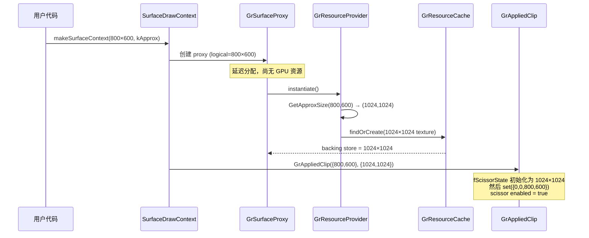
