# GrDrawingManager 函数实现参考

> 源码: `src/gpu/ganesh/GrDrawingManager.cpp` (1072行)
> 头文件: `src/gpu/ganesh/GrDrawingManager.h`

---

## 类型速查

阅读后续函数流程图前，建议先熟悉以下类型。按职责分为 7 组。

### 1. 自身类型

| 类型 | 含义 |
|------|------|
| `GrDrawingManager` | GPU 渲染任务管理器，负责 DAG 构建、排序、执行和资源调度 |
| `SurfaceIDKeyTraits` | 内部结构体，为 GrHashMapWithCache 提供 InvalidKey |

### 2. 上下文/录制

| 类型 | 含义 |
|------|------|
| `GrRecordingContext` | GPU 录制上下文 (可录制命令但不可直接执行) |
| `GrDirectContext` | GPU 直接上下文 (可执行命令、提交 GPU) |
| `GrArenas` | 录制期间 Op 的内存 arena |
| `GrOnFlushResourceProvider` | flush 期间提供给回调对象的资源接口 |
| `GrOnFlushCallbackObject` | flush 回调接口 (如 atlas 管理器) |

### 3. 渲染任务

| 类型 | 含义 |
|------|------|
| `GrRenderTask` | 渲染任务基类，DAG 中的节点 |
| `OpsTask` | 绘制操作任务 (最常见的 RenderTask) |
| `GrTextureResolveRenderTask` | MSAA resolve 或 mipmap 重新生成任务 |
| `GrCopyRenderTask` | 像素拷贝任务 |
| `GrTransferFromRenderTask` | GPU→CPU 异步回读任务 |
| `GrWaitRenderTask` | GPU 信号量等待任务 |
| `GrBufferTransferRenderTask` | buffer→buffer 拷贝任务 |
| `GrBufferUpdateRenderTask` | CPU data→buffer 更新任务 |
| `GrWritePixelsRenderTask` | CPU→texture 写入任务 |
| `GrDDLTask` | DDL 回放任务 |

### 4. GPU/资源管理

| 类型 | 含义 |
|------|------|
| `GrGpu` | GPU 后端抽象 (Vulkan/GL/Metal/Dawn) |
| `GrGpuBuffer` | GPU buffer 基类 |
| `GrCaps` | GPU 能力查询 |
| `GrResourceAllocator` | 渲染任务间资源生命周期规划与分配 |
| `GrResourceCache` | GPU 资源缓存 |
| `GrBufferAllocPool::CpuBufferCache` | CPU 侧 buffer 缓存 (跨 flush 复用) |
| `GrOpFlushState` | flush 期间 Op 执行状态 |
| `skgpu::TokenTracker` | flush/draw token 追踪器 |

### 5. Surface/Proxy

| 类型 | 含义 |
|------|------|
| `GrSurfaceProxy` | GPU surface 延迟实例化代理 |
| `GrRenderTargetProxy` | 渲染目标代理 |
| `GrTextureProxy` | 纹理代理 |
| `GrSurfaceProxyView` | Proxy + origin + swizzle 组合视图 |

### 6. 路径渲染

| 类型 | 含义 |
|------|------|
| `PathRenderer` | 路径渲染器基类 (`skgpu::ganesh::PathRenderer`) |
| `PathRendererChain` | 路径渲染器责任链 |
| `AtlasPathRenderer` | Atlas 路径渲染器 (将小路径渲染到 atlas) |
| `SoftwarePathRenderer` | 软件路径渲染器 (CPU 光栅化后上传) |

### 7. 同步/回调/工具

| 类型 | 含义 |
|------|------|
| `GrFlushInfo` | flush 参数 (信号量数量 + 完成回调) |
| `GrSemaphore` | GPU 信号量 |
| `skgpu::MutableTextureState` | 可变纹理状态 (layout/queue 转换) |
| `GrDeferredDisplayList` | 延迟显示列表 (DDL) |
| `SkData` | 不可变数据块 |
| `SkIRect` | 整数矩形 |
| `GrHashMapWithCache` | 带缓存的哈希映射 |
| `skia_private::TArray` | Skia 动态数组 |
| `SkTInternalLList` | 侵入式双向链表 |
| `GrSemaphoresSubmitted` | 信号量提交结果枚举 (`kYes`/`kNo`) |

---

## GrDrawingManager 在 Skia 工程中的架构位置

**核心职责**: 管理 GPU 渲染任务的有向无环图 (DAG)，协调任务创建、依赖排序、资源分配和批量执行，是 Ganesh 录制-回放架构的中枢调度器。

| 属性 | 说明 |
|------|------|
| **归属** | `GrRecordingContext` 持有唯一的 `GrDrawingManager` 实例 |
| **接口** | 管理渲染任务 DAG：创建任务、排序、资源分配、执行 |
| **上游** | `SurfaceDrawContext` / `Device` → 录制 Op → 创建 OpsTask |
| **下游** | `GrOpFlushState` → `GrGpu` → 后端命令提交 |

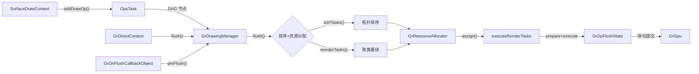

---

## 架构总览

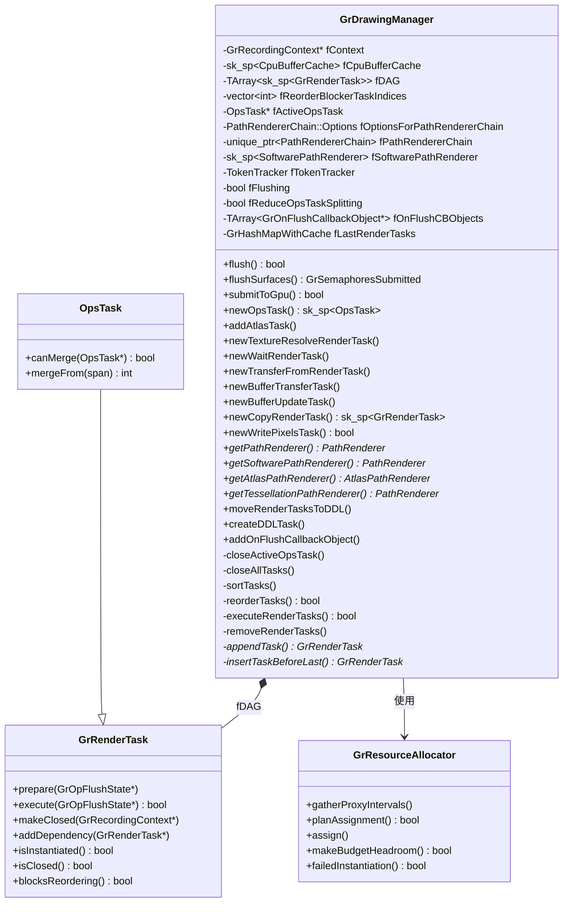

---

## 1. 生命周期与回调

### 1.1 `GrDrawingManager()` (line 65-73)

构造函数，初始化上下文指针和路径渲染器选项。

| 参数 | 含义 |
|------|------|
| `rContext` | 录制上下文指针 |
| `optionsForPathRendererChain` | 路径渲染器链配置 |
| `reduceOpsTaskSplitting` | 是否启用聚类重排减少 OpsTask 分裂 |

初始化列表将 `fPathRendererChain` 和 `fSoftwarePathRenderer` 设为 nullptr，由后续懒加载。

---

### 1.2 `~GrDrawingManager()` (line 75-78)

析构函数：关闭所有任务 → 移除所有渲染任务。

---

### 1.3 `wasAbandoned()` (line 80-82)

直接委托给 `fContext->abandoned()`，检查上下文是否已丢弃。

---

### 1.4 `freeGpuResources()` (line 84-95)

释放 GPU 资源：

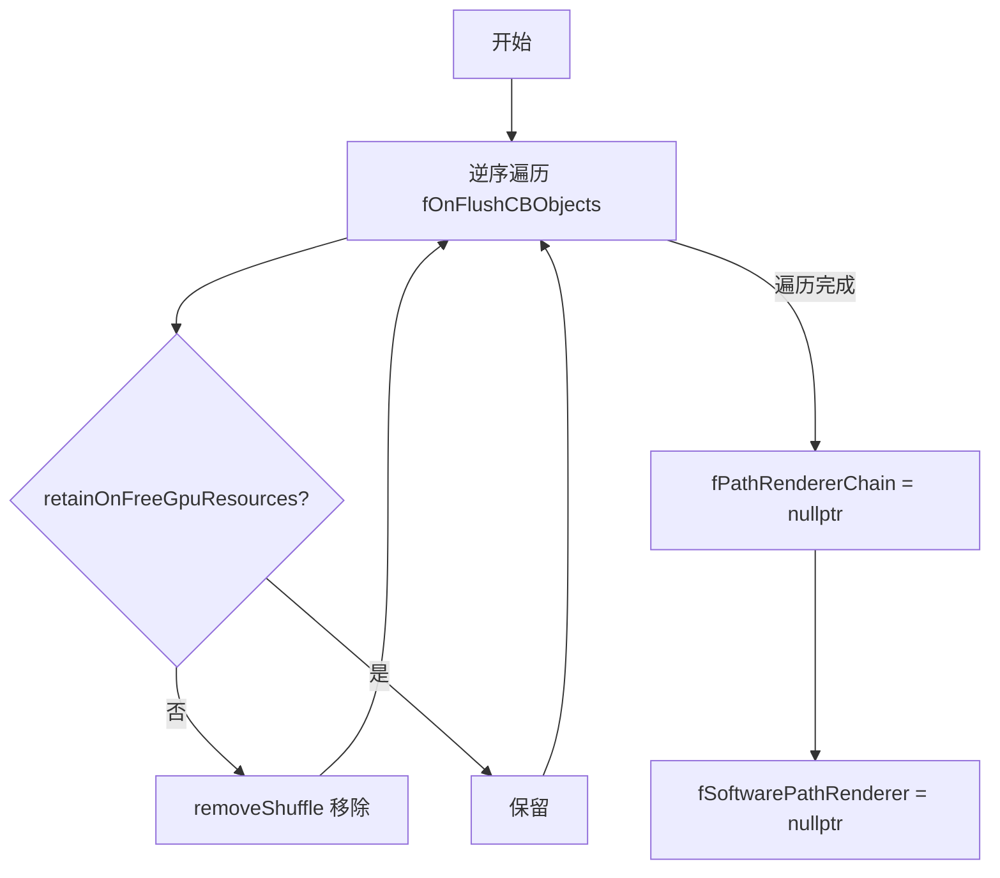

---

### 1.5 `addOnFlushCallbackObject()` (line 553-555)

将 `GrOnFlushCallbackObject*` 追加到 `fOnFlushCBObjects` 数组。

---

### 1.6 `testingOnly_removeOnFlushCallbackObject()` (line 558-564)

仅 `GPU_TEST_UTILS` 编译。在回调数组中查找指定对象并用 `removeShuffle` 移除。

---

## 2. 核心 Flush 流程

### 2.1 `flush()` (line 98-230)

最核心的函数，执行整个渲染管线：关闭任务 → 排序 → 资源分配 → 执行 → 清理。

**源码 — 入口 guard 逻辑:**

```cpp
if (fFlushing || this->wasAbandoned()) {
    if (info.fSubmittedProc) {
        info.fSubmittedProc(info.fSubmittedContext, false);
    }
    if (info.fFinishedProc) {
        info.fFinishedProc(info.fFinishedContext);
    }
    return false;
}
// ...
// 短路优化: 若指定了 proxy 列表但全部未被 DAG 使用，直接返回
if (!proxies.empty() && !info.fNumSemaphores && !info.fFinishedProc &&
    access == SkSurfaces::BackendSurfaceAccess::kNoAccess && !newState) {
    bool allUnused = std::all_of(proxies.begin(), proxies.end(), [&](GrSurfaceProxy* proxy) {
        bool used = std::any_of(fDAG.begin(), fDAG.end(), [&](auto& task) {
            return task && task->isUsed(proxy);
        });
        return !used;
    });
    if (allUnused) { /* ... */ return false; }
}
```

```mermaid
flowchart TD
    Start([flush 开始]) --> Guard{fFlushing 或 abandoned?}
    Guard -->|是| CallProcs1[调用 submitted/finished 回调]
    CallProcs1 --> RetFalse1([return false])

    Guard -->|否| ShortCircuit{proxies 非空且无信号量/回调?}
    ShortCircuit -->|是| CheckUnused{所有 proxy 都未被 DAG 使用?}
    CheckUnused -->|是| CallSubmit[调用 submitted 回调]
    CallSubmit --> RetFalse2([return false])
    CheckUnused -->|否| Continue1[继续]
    ShortCircuit -->|否| Continue1

    Continue1 --> GetDirect[获取 DirectContext + GPU]
    GetDirect --> SetFlushing["fFlushing = true"]
    SetFlushing --> CloseAll["closeAllTasks()"]
    CloseAll --> Sort["sortTasks()"]
    Sort --> InitCache{fCpuBufferCache 为空?}
    InitCache -->|是| CreateCache["创建 CpuBufferCache"]
    InitCache -->|否| Skip1[跳过]
    CreateCache --> CreateFlushState
    Skip1 --> CreateFlushState

    CreateFlushState["创建 GrOpFlushState"] --> PreFlush["调用 onFlushCBObjects.preFlush()"]
    PreFlush --> PreFlushOK{preFlush 全部成功?}

    PreFlushOK -->|否| SkipExec[跳过执行]
    PreFlushOK -->|是| CheckReorder{fReduceOpsTaskSplitting?}
    CheckReorder -->|是| Reorder["reorderTasks(&resourceAllocator)"]
    Reorder --> ReorderOK{重排成功?}
    ReorderOK -->|否| ResetAlloc["resourceAllocator.reset()"]
    ReorderOK -->|是| AssignRes["resourceAllocator.assign()"]
    ResetAlloc --> GatherDefault["逐任务 gatherProxyIntervals"]
    GatherDefault --> PlanAssign["planAssignment()"]
    PlanAssign --> AssignRes
    CheckReorder -->|否| GatherDefault

    AssignRes --> CheckFail{failedInstantiation?}
    CheckFail -->|否| Execute["executeRenderTasks(&flushState)"]
    CheckFail -->|是| SkipExec

    Execute --> RemoveTasks["removeRenderTasks()"]
    SkipExec --> RemoveTasks
    RemoveTasks --> ExecFlushInfo["gpu->executeFlushInfo()"]
    ExecFlushInfo --> Purge1{cachePurgeNeeded?}
    Purge1 -->|是| DoPurge1["resourceCache->purgeAsNeeded()"]
    Purge1 -->|否| PostFlush
    DoPurge1 --> PostFlush["调用 onFlushCBObjects.postFlush()"]
    PostFlush --> Purge2["resourceCache->purgeAsNeeded()"]
    Purge2 --> SetNotFlushing["fFlushing = false"]
    SetNotFlushing --> RetTrue([return true])
```

---

### 2.2 `submitToGpu()` (line 232-243)

将已编码的 GPU 命令提交给 GPU 执行。

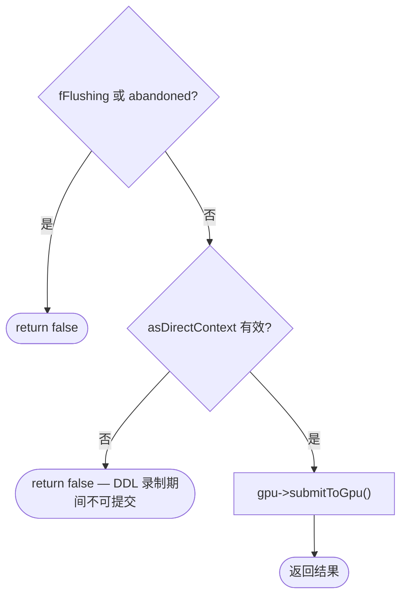

---

### 2.3 `executeRenderTasks()` (line 245-309)

遍历 DAG 中所有已实例化任务，先 prepare 后 execute，并设置批量提交阈值防止 OOM。

**源码 — 核心执行循环:**

```cpp
// prepare 阶段: 收集绘制命令
for (const auto& renderTask : fDAG) {
    if (!renderTask || !renderTask->isInstantiated()) { continue; }
    SkASSERT(renderTask->deferredProxiesAreInstantiated());
    renderTask->prepare(flushState);
}

// 上传所有数据到 GPU
flushState->preExecuteDraws();

// execute 阶段: 设阈值防止 Vulkan OOM
static constexpr int kMaxRenderTasksBeforeFlush = 100;
static constexpr int kMaxRenderPassesBeforeFlush = 100;
int numRenderTasksExecuted = 0;

for (const auto& renderTask : fDAG) {
    if (!renderTask->isInstantiated()) { continue; }
    if (renderTask->execute(flushState)) {
        anyRenderTasksExecuted = true;
    }
    if (++numRenderTasksExecuted >= kMaxRenderTasksBeforeFlush ||
        flushState->gpu()->getCurrentSubmitRenderPassCount() >= kMaxRenderPassesBeforeFlush) {
        flushState->gpu()->submitToGpu();
        numRenderTasksExecuted = 0;
    }
}
```

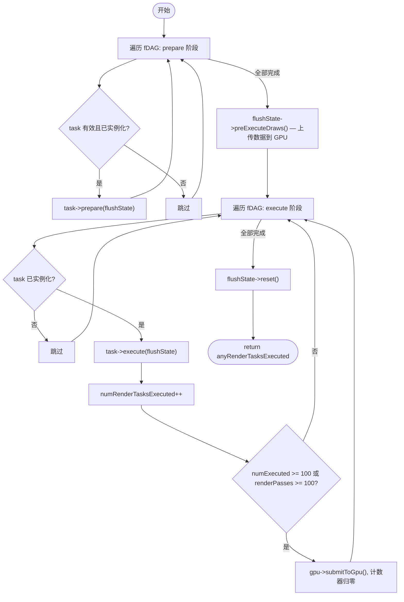

---

### 2.4 `flushSurfaces()` (line 516-551)

公共 flush 入口，flush 后额外处理 MSAA resolve 和 mipmap 重生成。

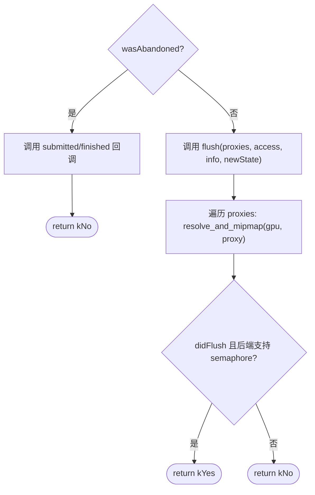

---

### 2.5 `resolve_and_mipmap()` (line 485-514)

静态辅助函数，在 flush 后为指定 proxy 执行 MSAA resolve 和 mipmap 重生成。

**源码:**

```cpp
static void resolve_and_mipmap(GrGpu* gpu, GrSurfaceProxy* proxy) {
    if (!proxy->isInstantiated()) { return; }

    // MSAA resolve: 客户端期望 flush 后 backing texture 已完全 resolve
    if (proxy->requiresManualMSAAResolve()) {
        auto* rtProxy = proxy->asRenderTargetProxy();
        SkASSERT(rtProxy);
        if (rtProxy->isMSAADirty()) {
            gpu->resolveRenderTarget(rtProxy->peekRenderTarget(), rtProxy->msaaDirtyRect());
            gpu->submitToGpu();
            rtProxy->markMSAAResolved();
        }
    }
    // Mipmap 重生成: 防止 backend texture 被 steal 时 mip 过期
    if (auto* textureProxy = proxy->asTextureProxy()) {
        if (textureProxy->mipmapsAreDirty()) {
            gpu->regenerateMipMapLevels(textureProxy->peekTexture());
            textureProxy->markMipmapsClean();
        }
    }
}
```

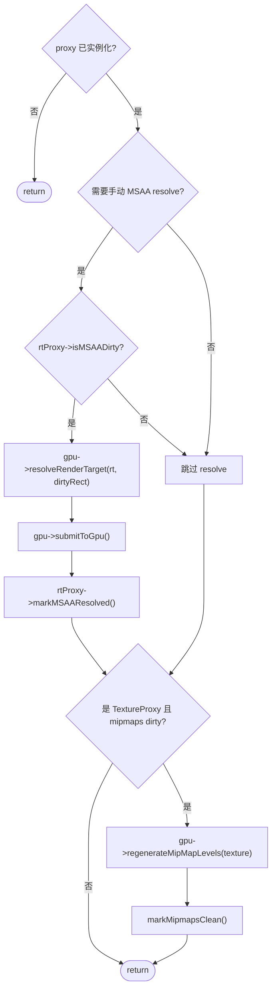

---

## 3. DAG 管理

### 3.1 `closeActiveOpsTask()` (line 689-698)

关闭当前活跃的 OpsTask 并将 `fActiveOpsTask` 置空。

---

### 3.2 `closeAllTasks()` (line 451-457)

遍历 fDAG，对每个非空 task 调用 `makeClosed(fContext)`。

---

### 3.3 `removeRenderTasks()` (line 311-325)

清理已执行完毕的 DAG：

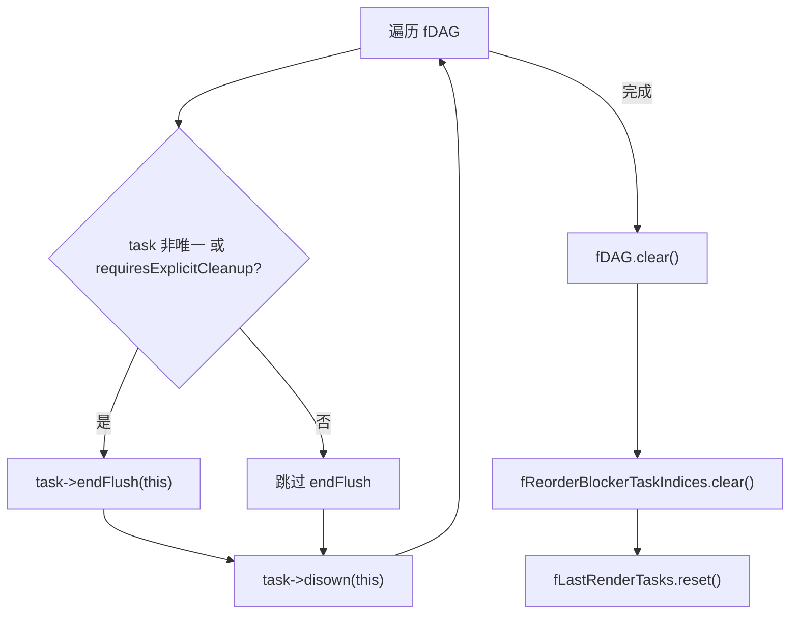

---

### 3.4 `appendTask()` (line 475-483)

将任务追加到 DAG 末尾。如果任务 `blocksReordering()`，记录其索引到 `fReorderBlockerTaskIndices`。

---

### 3.5 `insertTaskBeforeLast()` (line 459-473)

将任务插入到 DAG 倒数第二位置 (在 fActiveOpsTask 之前)。

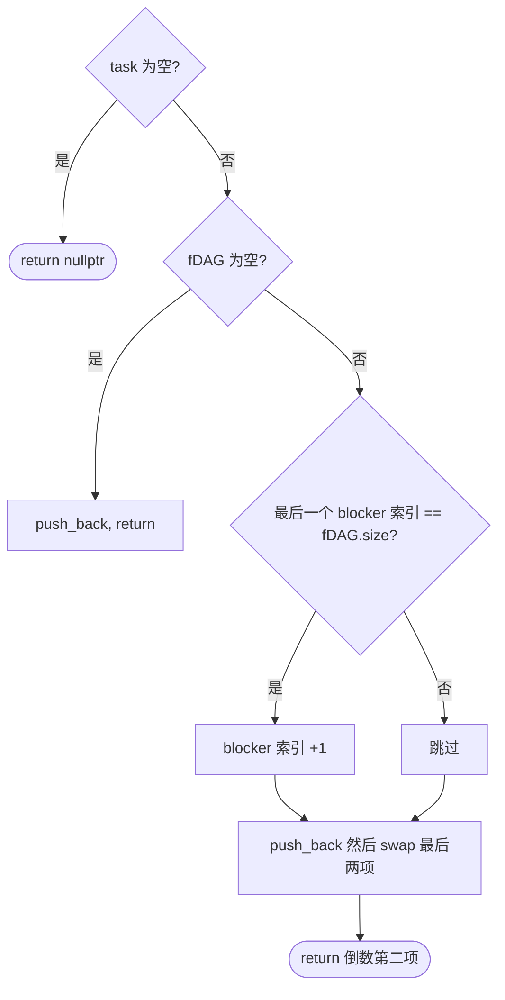

---

## 4. 排序与重排

### 4.1 `sortTasks()` (line 327-376)

对 DAG 进行拓扑排序，以 `fReorderBlockerTaskIndices` 为分区边界分段排序。

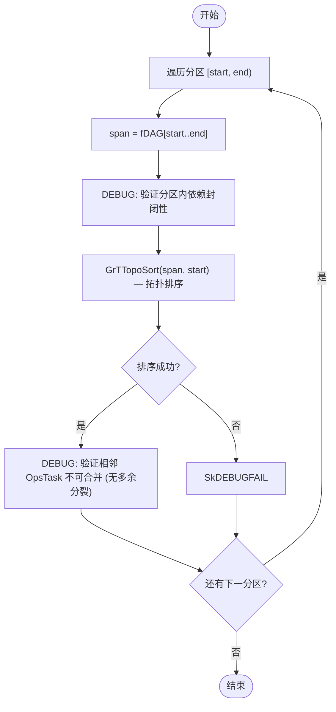

**分区规则**: 以 `blocksReordering()` 的任务为分隔符，每个分区内的任务可安全拓扑排序而不跨越 barrier。

---

### 4.2 `reorderTasks()` (line 392-449)

尝试聚类重排以减少 render pass 切换，并验证内存预算。

**源码 — 聚类 + 预算验证 + 合并逻辑:**

```cpp
// 阶段 1: 分区聚类
SkTInternalLList<GrRenderTask> llist;
for (size_t i = 0, start = 0, end; start < SkToSizeT(fDAG.size()); ++i, start = end + 1) {
    end = i == fReorderBlockerTaskIndices.size() ? fDAG.size() : fReorderBlockerTaskIndices[i];
    SkSpan span(fDAG.begin() + start, end - start);
    SkTInternalLList<GrRenderTask> subllist;
    if (GrClusterRenderTasks(span, &subllist)) { clustered = true; }
    if (i < fReorderBlockerTaskIndices.size()) {
        subllist.addToTail(fDAG[fReorderBlockerTaskIndices[i]].get());
    }
    llist.concat(std::move(subllist));
}
if (!clustered) { return false; }

// 阶段 2: 验证预算
for (GrRenderTask* task : llist) { task->gatherProxyIntervals(resourceAllocator); }
if (!resourceAllocator->planAssignment()) { return false; }
if (!resourceAllocator->makeBudgetHeadroom()) { /* stats++ */ return false; }

// 阶段 3: 应用新顺序并合并相邻 OpsTask
reorder_array_by_llist(llist, &fDAG);
int newCount = 0;
for (int i = 0; i < fDAG.size(); i++) {
    if (auto opsTask = fDAG[i]->asOpsTask()) {
        int removeCount = opsTask->mergeFrom(nextTasks);
        // ... disown removed tasks
        i += removeCount;
    }
    fDAG[newCount++] = std::move(task);
}
fDAG.resize_back(newCount);
```

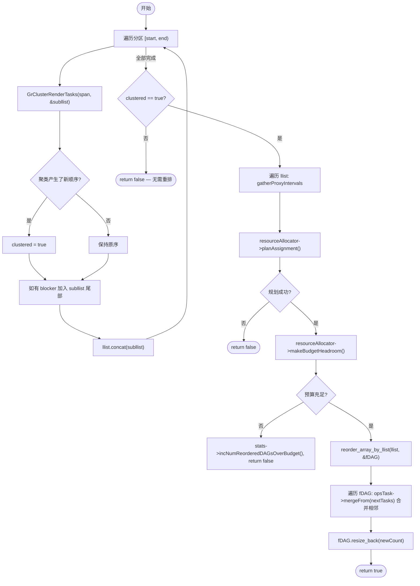

---

### 4.3 `reorder_array_by_llist()` (line 381-390)

静态模板辅助函数，将数组按链表顺序重排而不触发 sk_sp 的 ref/unref。

**源码:**

```cpp
template <typename T>
static void reorder_array_by_llist(const SkTInternalLList<T>& llist, TArray<sk_sp<T>>* array) {
    int i = 0;
    for (T* t : llist) {
        // Release the pointer that used to live here so it doesn't get unreffed.
        [[maybe_unused]] T* old = array->at(i).release();
        array->at(i++).reset(t);
    }
    SkASSERT(i == array->size());
}
```

**设计意图**: 聚类算法使用 `SkTInternalLList` 表示新顺序，而 DrawingManager 使用 `TArray<sk_sp<>>` 存储 DAG。此函数通过 release + reset 避免中间状态的引用计数变化。

---

## 5. OpsTask 创建

### 5.1 `newOpsTask()` (line 700-718)

创建新的 OpsTask 并设为活跃任务。

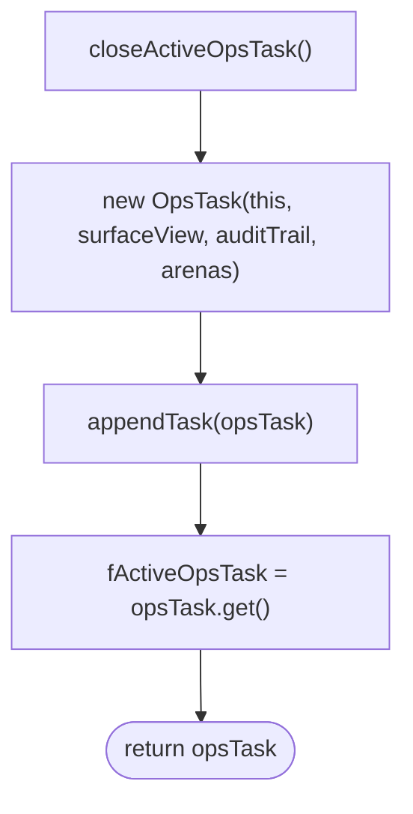

---

### 5.2 `addAtlasTask()` (line 720-744)

将 atlas 渲染任务添加到 DAG，处理旧 atlas 的依赖关闭。

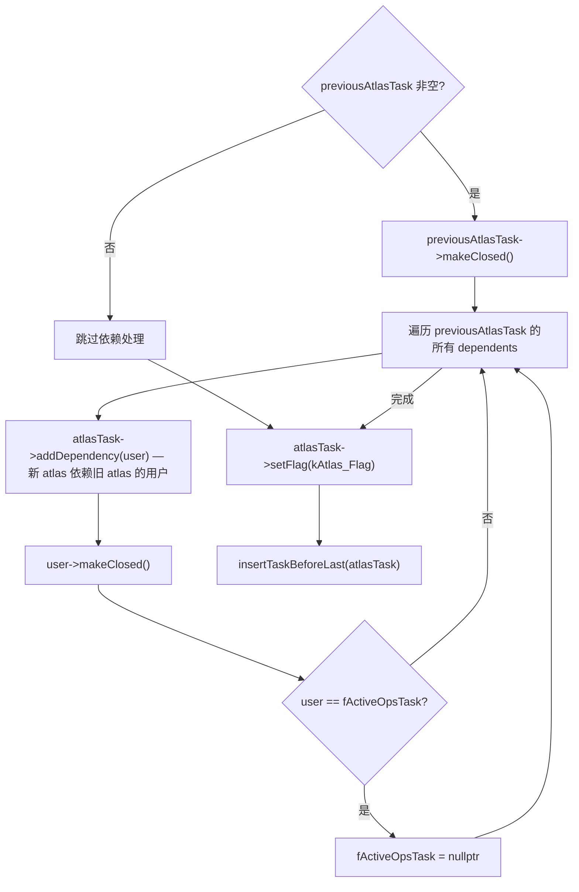

---

## 6. Texture Resolve

### 6.1 `newTextureResolveRenderTaskBefore()` (line 746-759)

在活跃任务前插入一个空的 TextureResolveRenderTask（不关闭当前 OpsTask）。调用方需自行调用 `addProxy()`。

---

### 6.2 `newTextureResolveRenderTask()` (line 761-791)

为指定 proxy 创建 MSAA resolve 任务并追加到 DAG 末尾。

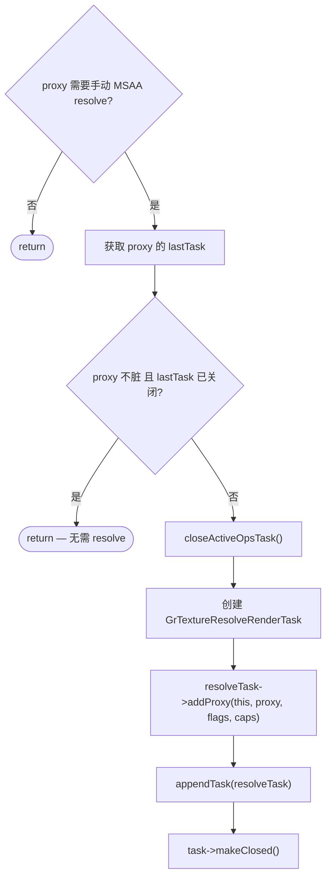

---

## 7. 同步与数据传输

### 7.1 `newWaitRenderTask()` (line 793-836)

创建 GPU 信号量等待任务，根据 proxy 与活跃 OpsTask 关系选择两条路径。

**源码 — 路径分支判断:**

```cpp
if (fActiveOpsTask && (fActiveOpsTask->target(0) == proxy.get())) {
    // 路径 A: 活跃 OpsTask 目标与 wait 目标相同
    this->insertTaskBeforeLast(waitTask);
    waitTask->addDependenciesFromOtherTask(fActiveOpsTask);
    fActiveOpsTask->addDependency(waitTask.get());
} else {
    // 路径 B: 关闭活跃任务，追加 wait 到 DAG 末尾
    if (GrRenderTask* lastTask = this->getLastRenderTask(proxy.get())) {
        waitTask->addDependency(lastTask);
    }
    this->setLastRenderTask(proxy.get(), waitTask.get());
    this->closeActiveOpsTask();
    this->appendTask(waitTask);
}
waitTask->makeClosed(fContext);
```

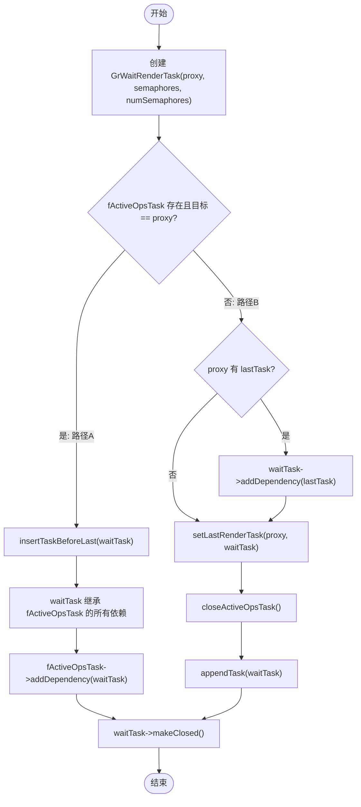

**路径 A**: 活跃 OpsTask 与 wait 目标相同 → 在活跃任务前插入，保持活跃任务打开。已有 Ops 会被 semaphore 阻塞（为正确性让步）。
**路径 B**: 目标不同或无活跃任务 → 关闭活跃任务，追加 wait 到 DAG 末尾。

---

### 7.2 `newTransferFromRenderTask()` (line 838-864)

创建 GPU→CPU 回读任务：关闭活跃任务 → appendTask → addDependency(srcProxy, Mipmapped::kNo) → makeClosed。

---

### 7.3 `newBufferTransferTask()` (line 866-897)

创建 buffer→buffer 拷贝任务：验证 buffer 类型 → closeActiveOpsTask → GrBufferTransferRenderTask::Make → appendTask → makeClosed。

由于 buffer 依赖不被追踪，此任务构成重排硬边界 (blocksReordering)。

---

### 7.4 `newBufferUpdateTask()` (line 899-925)

创建 SkData→buffer 更新任务：验证条件 → closeActiveOpsTask → GrBufferUpdateRenderTask::Make → appendTask → makeClosed。

同样构成重排硬边界。

---

## 8. 拷贝与写入

### 8.1 `newCopyRenderTask()` (line 927-973)

创建像素拷贝任务，处理依赖关系。

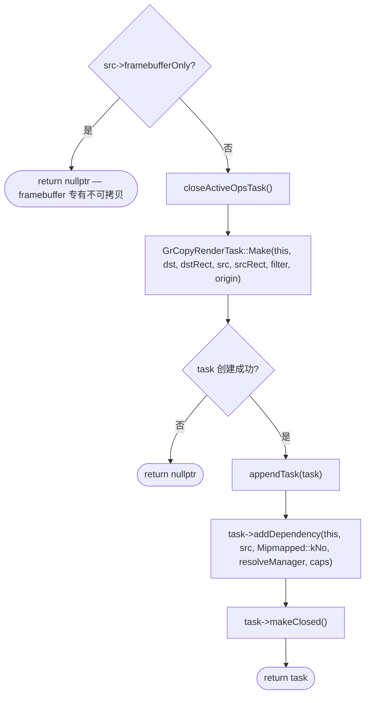

---

### 8.2 `newWritePixelsTask()` (line 975-1014)

创建 CPU→texture 写入任务。

```mermaid
flowchart TD
    A["closeActiveOpsTask()"] --> B{caps 不偏好 VRAM 使用? (preferVRAMUseOverFlushes == false)}
    B -->|是| C["flushSurfaces({}, NoAccess, {}, nullptr) — ANGLE 平台先清空"]
    B -->|否| D[跳过]
    C --> D
    D --> E["GrWritePixelsTask::Make(this, dst, rect, srcColorType, dstColorType, levels, count)"]
    E --> F["appendTask(task)"]
    F --> G{task 非空?}
    G -->|否| H([return false])
    G -->|是| I["task->makeClosed()"]
    I --> J([return true])
```

---

## 9. 路径渲染器

### 9.1 `getPathRenderer()` (line 1022-1047)

查找能绘制指定路径的渲染器。

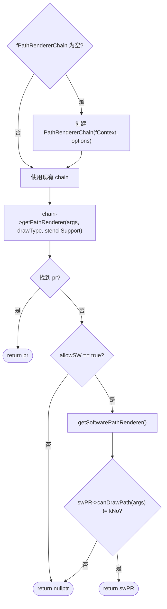

---

### 9.2 `getSoftwarePathRenderer()` (line 1049-1056)

懒加载创建 SoftwarePathRenderer 实例并返回。使用 `proxyProvider` 和 `allowPathMaskCaching` 选项。

---

### 9.3 `getAtlasPathRenderer()` (line 1058-1064)

懒加载 PathRendererChain 后委托获取 AtlasPathRenderer。可能返回 nullptr。

---

### 9.4 `getTessellationPathRenderer()` (line 1066-1072)

懒加载 PathRendererChain 后委托获取 TessellationPathRenderer。可能返回 nullptr。

---

## 10. RenderTask 映射与 DDL

### 10.1 `setLastRenderTask()` (line 566-578)

更新 proxy → lastRenderTask 映射表。

| 条件 | 操作 |
|------|------|
| `task` 非空 | `fLastRenderTasks.set(key, task)` |
| `task` 为空且 key 存在 | `fLastRenderTasks.remove(key)` |
| `task` 为空且 key 不存在 | 无操作 |

DEBUG 模式下验证旧 task 已关闭或与新 task 相同。

---

### 10.2 `getLastRenderTask()` (line 580-583)

通过 proxy 的 UniqueID 在 `fLastRenderTasks` 中查找，未找到返回 nullptr。

---

### 10.3 `getLastOpsTask()` (line 585-588)

获取 proxy 的 lastRenderTask 后调用 `asOpsTask()` 转换，失败返回 nullptr。

---

### 10.4 `moveRenderTasksToDDL()` (line 590-613)

将当前 DAG 中的任务转移到 DDL 中。

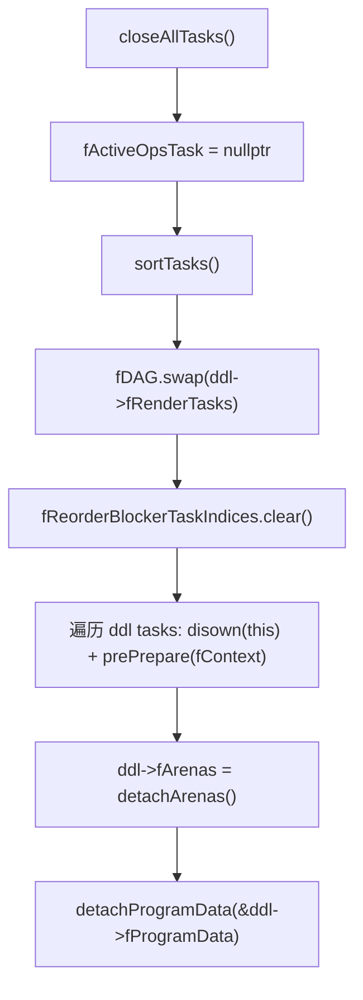

---

### 10.5 `createDDLTask()` (line 615-652)

创建 DDL 回放任务。

```mermaid
flowchart TD
    A{fActiveOpsTask 非空?} -->|是| B["fActiveOpsTask->makeClosed(), 置空"]
    A -->|否| C[继续]
    B --> C
    C --> D{DDL target proxy isMSAADirty?}
    D -->|是| E["newDest->markMSAADirty(nativeRect)"]
    D -->|否| F[跳过]
    E --> G{newDest 是 mipmapped TextureProxy?}
    F --> G
    G -->|是| H["markMipmapsDirty()"]
    G -->|否| I[跳过]
    H --> J["ddl->fLazyProxyData->fReplayDest = newDest.get()"]
    I --> J
    J --> K["appendTask(GrDDLTask(this, newDest, ddl))"]
```

---

## 11. 调试验证

### 11.1 `validate()` (line 655-686)

仅 `SK_DEBUG` 模式编译。验证 DAG 一致性：

| 验证项 | 规则 |
|------|------|
| fActiveOpsTask 存在时 | DAG 非空、未关闭、位于 DAG 末尾 |
| 非活跃任务 | 必须已关闭 (除 activeResolveTask 和 atlas 任务外) |
| DAG 末尾 | 若有 atlas flag 则 fActiveOpsTask 应为空；若已关闭则 fActiveOpsTask 应为空 |
| DAG 为空 | fActiveOpsTask 必须为空 |

---

## 附录: RenderTask 生成来源

本节从"谁调用了 GrDrawingManager"的视角，展示每种 RenderTask 的完整生成路径。

### 总览表格

| Task 类型 | 触发用户 API | 中间调用者 | DrawingManager 方法 |
|-----------|------------|-----------|-------------------|
| OpsTask | 任意绘制操作 (drawRect, drawPath…) | `SurfaceFillContext::getOpsTask()` → `replaceOpsTask()` | `newOpsTask()` |
| GrTextureResolveRenderTask (Before) | 隐式 (依赖追踪自动插入) | `GrRenderTask::addDependency()` → `GrTextureResolveManager` | `newTextureResolveRenderTaskBefore()` |
| GrTextureResolveRenderTask (Append) | `SurfaceFillContext::resolveMSAA()` | 直接调用 DrawingManager | `newTextureResolveRenderTask()` |
| GrWaitRenderTask | `SkSurface::wait()` / GPU 信号量同步 | `SurfaceDrawContext::waitOnSemaphores()` | `newWaitRenderTask()` |
| GrTransferFromRenderTask | `asyncReadPixels` 系列 | `SurfaceContext::transferPixels()` | `newTransferFromRenderTask()` |
| GrBufferTransferRenderTask | `SkMesh::Buffer::update()` | `GrMeshBuffer::onUpdate()` (GPU 支持 buffer-to-buffer) | `newBufferTransferTask()` |
| GrBufferUpdateRenderTask | `SkMesh::Buffer::update()` | `GrMeshBuffer::onUpdate()` (GPU 不支持 b2b) | `newBufferUpdateTask()` |
| GrCopyRenderTask | 图像拷贝/缩放 | `SurfaceContext::copyScaled()` | `newCopyRenderTask()` |
| GrWritePixelsRenderTask | `Surface::writePixels()` | `SurfaceContext::writePixels()` | `newWritePixelsTask()` |
| GrDDLTask | `Surface::draw(DDL)` | `SkSurface_Ganesh::draw()` → `GrDirectContextPriv` | `createDDLTask()` |
| AtlasRenderTask | 路径绘制 (atlas 路径渲染器) | `AtlasPathRenderer::onDrawPath()` | `addAtlasTask()` |

### 全景调用链

```mermaid
flowchart LR
    subgraph UserAPI["用户 API 层"]
        A1["drawRect / drawPath / ..."]
        A2["SkSurface::wait()"]
        A3["asyncReadPixels()"]
        A4["SkMesh::Buffer::update()"]
        A5["Surface::writePixels()"]
        A6["Surface::draw(DDL)"]
        A7["drawPath (atlas)"]
        A8["copyScaled / rescale"]
        A9["resolveMSAA (隐式)"]
        A10["依赖追踪 (隐式)"]
    end

    subgraph Middle["Surface / Context 层"]
        B1["SurfaceFillContext::replaceOpsTask()"]
        B2["SurfaceDrawContext::waitOnSemaphores()"]
        B3["SurfaceContext::transferPixels()"]
        B4["GrMeshBuffer::onUpdate()"]
        B5["SurfaceContext::writePixels()"]
        B6["SkSurface_Ganesh::draw()"]
        B7["AtlasPathRenderer::onDrawPath()"]
        B8["SurfaceContext::copyScaled()"]
        B9["SurfaceFillContext::resolveMSAA()"]
        B10["GrRenderTask::addDependency()"]
    end

    subgraph DM["GrDrawingManager"]
        C1["newOpsTask()"]
        C2["newWaitRenderTask()"]
        C3["newTransferFromRenderTask()"]
        C4a["newBufferTransferTask()"]
        C4b["newBufferUpdateTask()"]
        C5["newWritePixelsTask()"]
        C6["createDDLTask()"]
        C7["addAtlasTask()"]
        C8["newCopyRenderTask()"]
        C9["newTextureResolveRenderTask()"]
        C10["newTextureResolveRenderTaskBefore()"]
    end

    A1 --> B1 --> C1
    A2 --> B2 --> C2
    A3 --> B3 --> C3
    A4 --> B4 --> C4a
    A4 --> B4 --> C4b
    A5 --> B5 --> C5
    A6 --> B6 --> C6
    A7 --> B7 --> C7
    A8 --> B8 --> C8
    A9 --> B9 --> C9
    A10 --> B10 --> C10
```

### 各 Task 生成路径说明

#### OpsTask

用户的所有绘制操作 (drawRect/drawPath/drawImage 等) 最终通过 `SurfaceFillContext::getOpsTask()` 获取当前活跃的 OpsTask。当不存在活跃 task 时，调用 `replaceOpsTask()` → `GrDrawingManager::newOpsTask()` 创建新实例并插入 DAG。

> 关键路径: `src/gpu/ganesh/SurfaceFillContext.cpp:141`

#### GrTextureResolveRenderTask (Before — 依赖追踪插入)

当一个 RenderTask 对某个 MSAA/mipmap 纹理形成依赖时，`GrRenderTask::addDependency()` 检测到需要 resolve，通过 `GrTextureResolveManager` 调用 `newTextureResolveRenderTaskBefore()` 在依赖方 **之前** 插入 resolve task。

> 关键路径: `src/gpu/ganesh/GrRenderTask.cpp:196`

#### GrTextureResolveRenderTask (Append — 显式追加)

`SurfaceFillContext::resolveMSAA()` 在完成 MSAA 绘制后显式调用 `newTextureResolveRenderTask()` 追加到 DAG 末尾。

> 关键路径: `src/gpu/ganesh/SurfaceFillContext.cpp:88`

#### GrWaitRenderTask

用户调用 `SkSurface::wait()` 传入 GPU 信号量，经由 `SurfaceDrawContext::waitOnSemaphores()` 直接调用 `newWaitRenderTask()` 插入等待节点。

> 关键路径: `src/gpu/ganesh/SurfaceDrawContext.cpp:1523`

#### GrTransferFromRenderTask

`asyncReadPixels` 系列接口需要将 GPU 数据传回 CPU buffer，经 `SurfaceContext::transferPixels()` 调用 `newTransferFromRenderTask()`。

> 关键路径: `src/gpu/ganesh/SurfaceContext.cpp:1395`

#### GrBufferTransferRenderTask / GrBufferUpdateRenderTask

`SkMesh::Buffer::update()` 更新 mesh buffer 数据时，`GrMeshBuffer::onUpdate()` 根据 GPU 是否支持 buffer-to-buffer copy 分别走 `newBufferTransferTask()`（GPU 端 copy）或 `newBufferUpdateTask()`（CPU 端 updateData）。

> 关键路径: `src/gpu/ganesh/GrMeshBuffers.cpp:68` (transfer) / `src/gpu/ganesh/GrMeshBuffers.cpp:98` (update)

#### GrCopyRenderTask

图像拷贝/缩放操作通过 `SurfaceContext::copyScaled()` 调用 `newCopyRenderTask()`，支持 src/dst 不同尺寸的 GPU copy/blit。

> 关键路径: `src/gpu/ganesh/SurfaceContext.cpp:1122`

#### GrWritePixelsRenderTask

`Surface::writePixels()` 将 CPU 像素数据上传到 GPU texture，经 `SurfaceContext::writePixels()` 调用 `newWritePixelsTask()`。

> 关键路径: `src/gpu/ganesh/SurfaceContext.cpp:582`

#### GrDDLTask

`SkSurface::draw(DDL)` 回放预录制的显示列表 (Display List)，经 `SkSurface_Ganesh::draw()` → `GrDirectContextPriv::createDDLTask()` 调用 `GrDrawingManager::createDDLTask()` 将整个 DDL 的 task 子图嫁接到主 DAG。

> 关键路径: `src/gpu/ganesh/surface/SkSurface_Ganesh.cpp:413`

#### AtlasRenderTask (via addAtlasTask)

`AtlasPathRenderer` 在处理路径绘制时，将路径光栅化到 atlas texture。`onDrawPath()` 调用 `GrDrawingManager::addAtlasTask()` 注册 atlas task（与普通 task 不同，不关闭当前 OpsTask）。

> 关键路径: `src/gpu/ganesh/ops/AtlasPathRenderer.cpp:275`

---

## 附录: Flush 状态机

```mermaid
stateDiagram-v2
    [*] --> Idle : 初始状态

    Idle --> Flushing : flush() 调用
    Flushing --> Idle : flush 完成 (fFlushing=false)

    state Flushing {
        [*] --> CloseAll
        CloseAll --> Sort : closeAllTasks()
        Sort --> ResourceAlloc : sortTasks() / reorderTasks()
        ResourceAlloc --> Execute : assign()
        Execute --> Cleanup : executeRenderTasks()
        Cleanup --> PostFlush : removeRenderTasks()
        PostFlush --> [*] : postFlush callbacks
    }

    Idle --> Abandoned : context abandoned
    Flushing --> Abandoned : context abandoned (guard)
```

---

## 附录: 渲染管线执行流程

```mermaid
flowchart TB
    subgraph "录制阶段 — Op 收集"
        A[SurfaceDrawContext] -->|addDrawOp| B[OpsTask 收集 GrOp]
        C[newCopyRenderTask] --> D[GrCopyRenderTask]
        E[newWaitRenderTask] --> F[GrWaitRenderTask]
        G[newBufferTransferTask] --> H["GrBufferTransferRenderTask (reorder barrier)"]
    end

    subgraph "flush 阶段 — 排序与资源分配"
        I["closeAllTasks()"] --> J["sortTasks() — 拓扑排序"]
        J --> K{"fReduceOpsTaskSplitting?"}
        K -->|是| L["reorderTasks() — 聚类+合并+预算验证"]
        K -->|否| M["默认拓扑序 + gatherProxyIntervals"]
        L --> N["GrResourceAllocator::assign() — 分配 scratch 资源"]
        M --> N
    end

    subgraph "执行阶段 — GPU 命令提交"
        N --> O["prepare 循环 — 收集绘制命令"]
        O --> P["preExecuteDraws() — 批量上传 vertex/index 数据"]
        P --> Q["execute 循环 — 逐 task 执行"]
        Q --> R{"每 100 个 task 或 100 个 render pass"}
        R -->|达到阈值| S["gpu->submitToGpu() — 防 Vulkan OOM"]
        R -->|未达到| Q
        S --> Q
    end

    subgraph "清理阶段 — 资源回收"
        Q -->|全部完成| T["flushState->reset()"]
        T --> U["removeRenderTasks() — 清空 DAG"]
        U --> V["executeFlushInfo() — 信号量 + 回调"]
        V --> W["purgeAsNeeded() — 释放可回收资源"]
        W --> X["postFlush callbacks"]
    end
```
