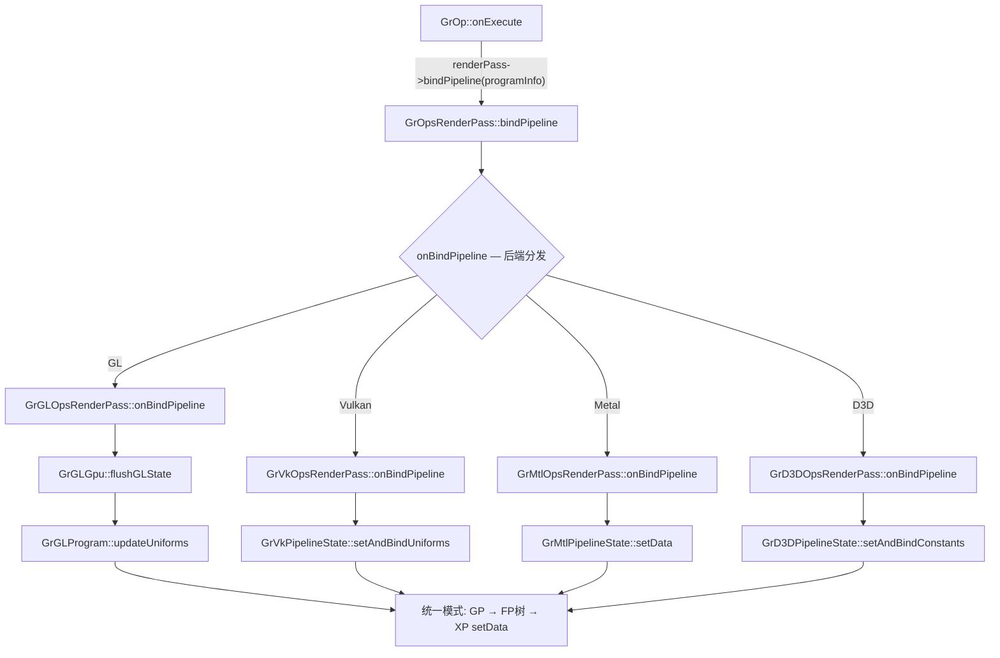
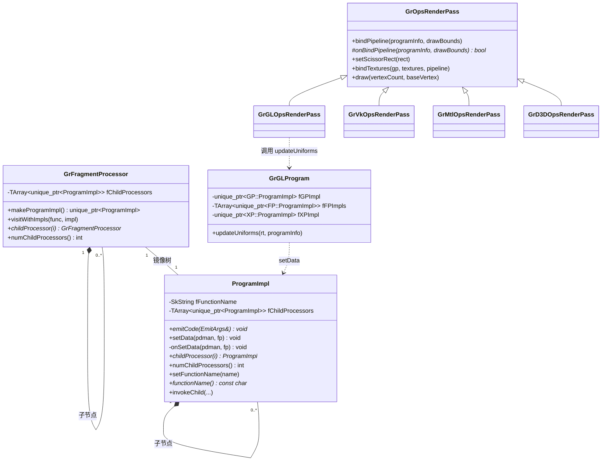
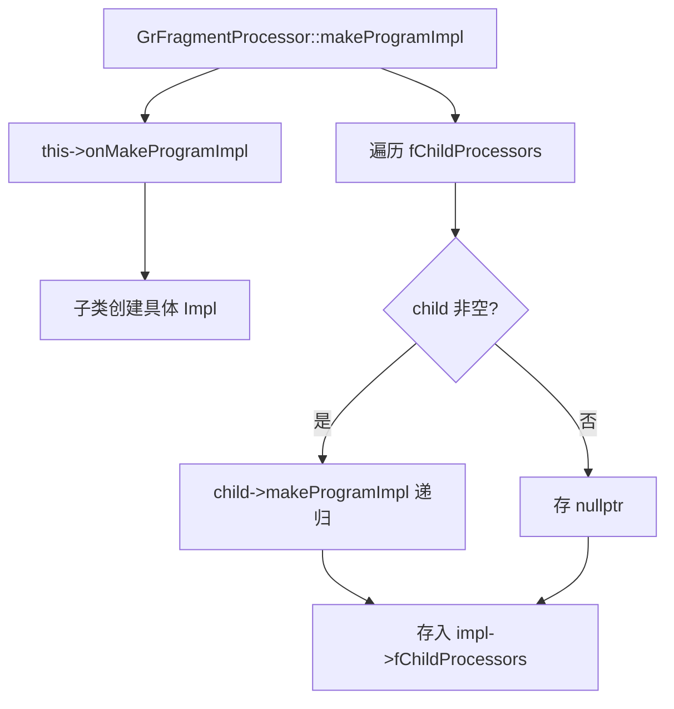
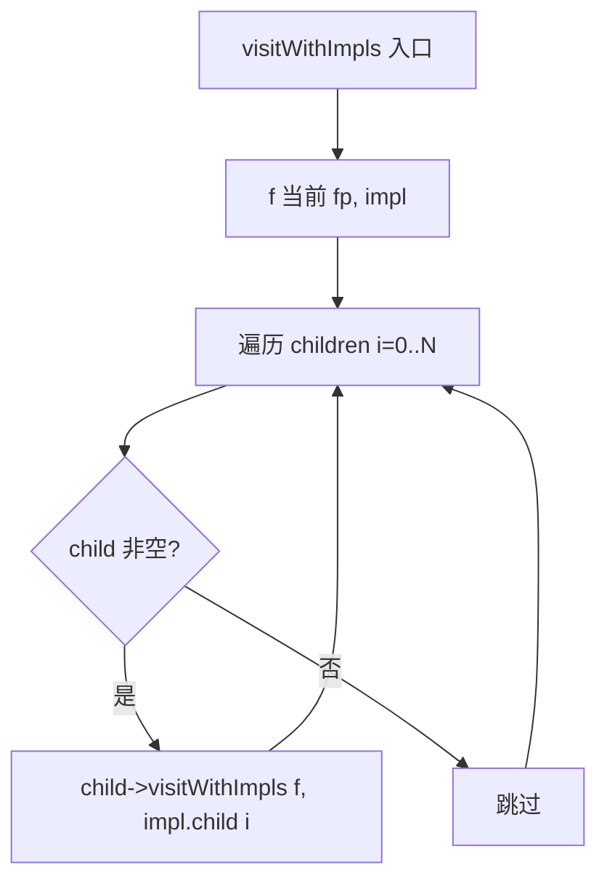
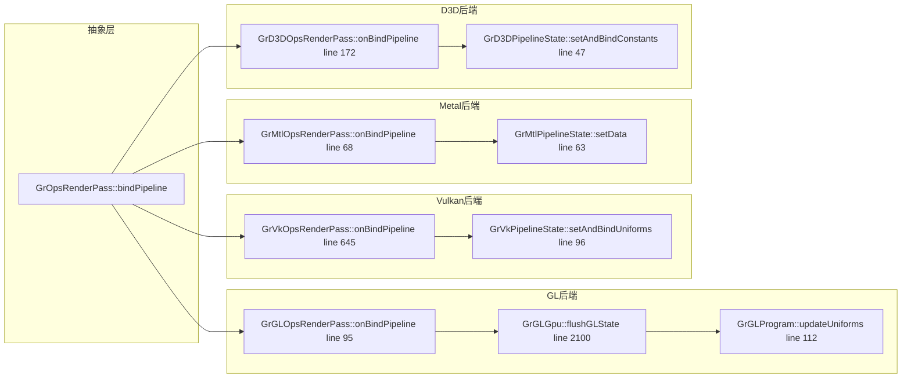
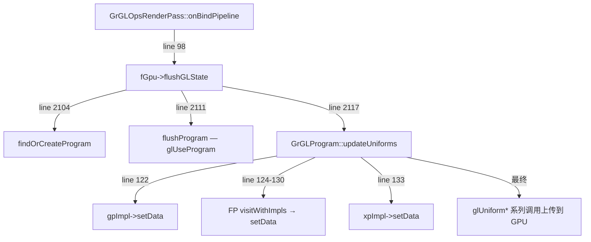
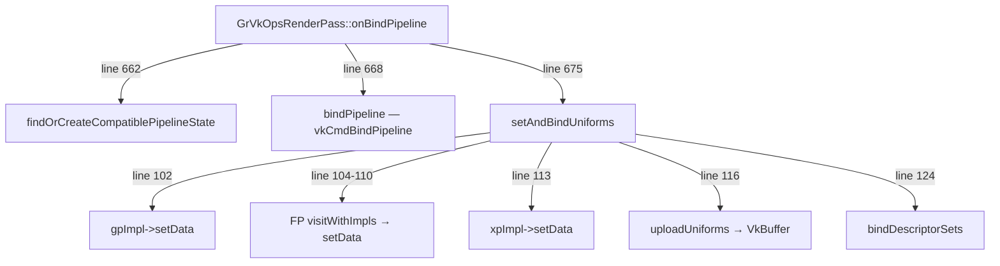
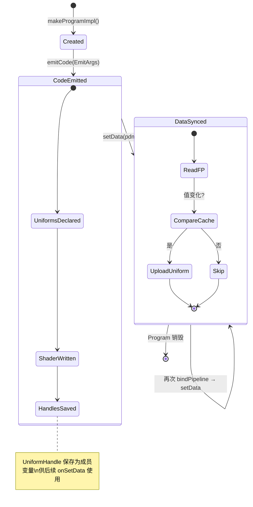

# GrFragmentProcessor::ProgramImpl 函数实现参考

> 源码: `src/gpu/ganesh/GrFragmentProcessor.h` (line 483-662) + `src/gpu/ganesh/GrFragmentProcessor.cpp` (line 80-90, 130-138, 862-865)
> 抽象层: `src/gpu/ganesh/GrOpsRenderPass.h` (line 59-96)
> 后端实现: `gl/GrGLProgram.cpp` · `vk/GrVkPipelineState.cpp` · `mtl/GrMtlPipelineState.mm` · `d3d/GrD3DPipelineState.cpp`

---

## 类型速查

### 1. 核心类型 (ProgramImpl 自身)

| 类型 | 含义 |
|------|------|
| `GrFragmentProcessor::ProgramImpl` | FP 的 GPU 端镜像对象，负责代码生成 (emitCode) 和数据同步 (onSetData) |
| `ProgramImpl::EmitArgs` | emitCode 的参数包：fragBuilder / uniformHandler / caps / fp / inputColor / destColor / sampleCoord |
| `ProgramImpl::Iter` | ProgramImpl 树的前序遍历迭代器 |
| `UniformHandle` | uniform 变量的不透明句柄 (typedef → `GrGLSLUniformHandler::UniformHandle`) |
| `SamplerHandle` | 纹理采样器的不透明句柄 (typedef → `GrGLSLUniformHandler::SamplerHandle`) |

### 2. Processor 三件套

| 类型 | 含义 |
|------|------|
| `GrFragmentProcessor` (FP) | CPU 端 fragment processor，描述一个着色效果，支持树结构 (child FP) |
| `GrGeometryProcessor` (GP) | CPU 端 geometry processor，描述顶点属性和变换 |
| `GrXferProcessor` (XP) | CPU 端 transfer/blend processor，描述最终混合模式 |
| `GrGeometryProcessor::ProgramImpl` | GP 的 GPU 端镜像，`setData()` 为纯虚函数 |
| `GrXferProcessor::ProgramImpl` | XP 的 GPU 端镜像，`onSetData()` 默认空实现 |

### 3. 代码生成 (Program 构建时)

| 类型 | 含义 |
|------|------|
| `GrGLSLProgramBuilder` | Shader 程序构建器，驱动 emitCode 流程 |
| `GrGLSLFPFragmentBuilder` | Fragment shader 代码拼接接口 |
| `GrGLSLUniformHandler` | Uniform 声明与管理接口 |
| `GrShaderCaps` | 目标 GPU 的 shader 能力描述 |

### 4. 数据同步 (每次 bindPipeline)

| 类型 | 含义 |
|------|------|
| `GrGLSLProgramDataManager` | Uniform 数据上传接口 (set1f / set2f / setMatrix4f 等) |
| `GrProgramInfo` | 本次 draw 的完整 pipeline 描述 (GP + Pipeline + stencil) |
| `GrPipeline` | FP 链 + XP + blend + stencil clip 等渲染状态 |

### 5. 渲染管线抽象

| 类型 | 含义 |
|------|------|
| `GrOpsRenderPass` | 后端无关的渲染通道抽象，定义 bindPipeline/draw 协议 |
| `GrGLOpsRenderPass` | GL 后端实现 |
| `GrVkOpsRenderPass` | Vulkan 后端实现 |
| `GrMtlOpsRenderPass` | Metal 后端实现 |
| `GrD3DOpsRenderPass` | Direct3D 12 后端实现 |

### 6. 后端 PipelineState / Program

| 类型 | 含义 |
|------|------|
| `GrGLProgram` | GL: 编译后的 shader program + uniform 管理 |
| `GrVkPipelineState` | Vulkan: pipeline + descriptor + uniform buffer 管理 |
| `GrMtlPipelineState` | Metal: pipeline + uniform buffer 管理 |
| `GrD3DPipelineState` | D3D12: pipeline + root constant buffer 管理 |

---

## GrFragmentProcessor::ProgramImpl 在 Skia 工程中的架构位置

| 维度 | 说明 |
|------|------|
| 归属 | Ganesh GPU backend / Processor uniform 同步子系统 |
| 接口 | `GrOpsRenderPass::bindPipeline()` — 抽象协议触发点 |
| 上游 | GrOp → GrOpsRenderPass → 后端 OpsRenderPass → PipelineState/Program |
| 下游 | 各 FP 子类的 Impl (GrRRectEffect::Impl, GrConvexPolyEffect::Impl, GrTextureEffect::Impl 等) |



---

## 架构总览



---

## 1. 创建阶段

### 1.1 `makeProgramImpl()` (line 130-138)

递归创建 FP 的 ProgramImpl 镜像树。每个 FP 节点生成一个对应的 ProgramImpl，子节点结构完全对称。



**源码:**

```cpp
std::unique_ptr<ProgramImpl> GrFragmentProcessor::makeProgramImpl() const {
    std::unique_ptr<ProgramImpl> impl = this->onMakeProgramImpl();
    impl->fChildProcessors.push_back_n(fChildProcessors.size());
    for (int i = 0; i < fChildProcessors.size(); ++i) {
        impl->fChildProcessors[i] = fChildProcessors[i]
            ? fChildProcessors[i]->makeProgramImpl()
            : nullptr;
    }
    return impl;
}
```

**调用时机**: 在 `GrGLSLProgramBuilder::emitAndInstallFragProcs()` 中，构建 GPU program 时一次性创建全部 ProgramImpl。

---

## 2. 代码生成阶段 (Program 构建时，一次性)

### 2.1 `emitCode(EmitArgs&)` (纯虚)

子类必须实现。在 shader 编译期写入 SkSL 代码，声明所需的 uniform 变量。

| 参数 | 含义 |
|------|------|
| `args.fFragBuilder` | Fragment shader 拼接器 — 用 `codeAppendf()` 写 SkSL |
| `args.fUniformHandler` | Uniform 声明器 — 用 `addUniform()` 注册 uniform，返回 `UniformHandle` |
| `args.fShaderCaps` | 目标设备能力 (floatIs32Bits 等) |
| `args.fFp` | 当前 FP 实例引用 (可用 `cast<T>()` 下转) |
| `args.fInputColor` | 输入颜色变量名 (SkSL 代码中引用) |
| `args.fDestColor` | 目标颜色变量名 (仅 blend FP 有效) |
| `args.fSampleCoord` | 采样坐标变量名 |

**关键约定**: `emitCode` 中声明的 UniformHandle 需保存为成员变量，后续在 `onSetData` 中通过该 handle 上传数据。

---

### 2.2 `invokeChild()` (line 606-610)

在当前 FP 的 shader 代码中插入对子 FP 的函数调用。自动处理坐标传递和名称修饰 (mangling)。

---

### 2.3 `setFunctionName()` / `functionName()` (line 546-553)

设置/获取当前 FP 在 shader 中的入口函数名 (带 mangling)。由 `GrGLSLProgramBuilder` 在 emitCode 过程中自动设置。

---

## 3. 数据同步阶段 (每次 bindPipeline)

### 3.1 `setData()` (line 862-865)

公共入口函数，直接调用 `onSetData`。不递归 — 递归由调用方 (`visitWithImpls`) 负责。

```cpp
void ProgramImpl::setData(const GrGLSLProgramDataManager& pdman,
                          const GrFragmentProcessor& processor) {
    this->onSetData(pdman, processor);
}
```

---

### 3.2 `onSetData()` (line 654)

虚函数，子类可选覆写。从 FP 读取 CPU 端数据，通过 `pdman` 上传到 GPU uniform。

**默认实现**: 空 — 无需 uniform 的 FP 不必覆写。

**典型子类实现 (CircularRRectEffect::Impl):**

```cpp
void CircularRRectEffect::Impl::onSetData(const GrGLSLProgramDataManager& pdman,
                                           const GrFragmentProcessor& processor) {
    const CircularRRectEffect& crre = processor.cast<CircularRRectEffect>();
    const SkRRect& rrect = crre.fRRect;
    if (rrect != fPrevRRect) {                    // 仅值变化时上传 (优化)
        SkRect rect = rrect.getBounds();
        SkScalar radius = SkRRectPriv::GetSimpleRadii(rrect).fX;
        rect.inset(radius, radius);
        pdman.set4f(fInnerRectUniform,            // 使用 emitCode 中注册的 handle
                    rect.fLeft, rect.fTop, rect.fRight, rect.fBottom);
        pdman.set2f(fRadiusPlusHalfUniform,
                    radius + 0.5f, 1.0f / (radius + 0.5f));
        fPrevRRect = rrect;
    }
}
```

---

### 3.3 `visitWithImpls()` (line 80-90)

前序并行遍历 FP 树和 ProgramImpl 树，对每个节点对 (fp, impl) 执行回调。



**源码:**

```cpp
void GrFragmentProcessor::visitWithImpls(
        const std::function<void(const GrFragmentProcessor&, ProgramImpl&)>& f,
        ProgramImpl& impl) const {
    f(*this, impl);
    SkASSERT(impl.numChildProcessors() == this->numChildProcessors());
    for (int i = 0; i < this->numChildProcessors(); ++i) {
        if (const auto* child = this->childProcessor(i)) {
            child->visitWithImpls(f, *impl.childProcessor(i));
        }
    }
}
```

---

## 4. 触发链 — 跨后端统一路径

### 4.1 抽象层: `GrOpsRenderPass::bindPipeline()` (line 71)

定义了 static state 和 dynamic state 的分离协议:

| 类别 | 设置时机 | 示例 |
|------|----------|------|
| Static state | `bindPipeline()` 时 | uniform 数据、pipeline 状态、stencil |
| Dynamic state | 可在 draw 之间更新 | scissor rect、texture bindings |

> **核心结论: `onSetData` 在 `bindPipeline()` 时触发，不是 per-draw。**
> 只有当 pipeline 变更 (不同的 GrProgramInfo) 时才会调用 `onBindPipeline`，从而触发 setData。

---

### 4.2 各后端 onBindPipeline → setData 统一模式



**统一模式 (所有后端内部结构完全一致):**

```
1. gpImpl->setData(pdman, shaderCaps, geomProc)     // GP: 纯虚，必须实现
2. for each FP in pipeline:
       fp.visitWithImpls([](fp, impl) {
           impl.setData(pdman, fp)                   // FP: 树遍历，每个节点调用 onSetData
       }, fpImpl)
3. pipeline.setDstTextureUniforms(pdman, handles)    // dst texture uniform
4. xpImpl->setData(pdman, xferProc)                  // XP: 可选 onSetData
5. 后端特定上传: uploadUniforms / flush / bind descriptor
```

---

### 4.3 GL 后端路径详解



---

### 4.4 Vulkan 后端路径详解



---

## 5. ProgramImpl 两个虚函数的职责对比

| 维度 | `emitCode(EmitArgs&)` | `onSetData(pdman, fp)` |
|------|----------------------|----------------------|
| 纯虚/可选 | **纯虚** — 必须实现 | **可选** — 默认空实现 |
| 调用时机 | Program 构建时 (一次) | 每次 bindPipeline (多次) |
| 职责 | 生成 SkSL shader 代码 + 声明 uniform | 从 FP 读取数据，上传 uniform 值 |
| 输出 | shader 源码写入 fragBuilder | pdman.set*() 调用写入 GPU buffer |
| 频率 | 一次 (缓存后复用) | 每帧/每 pipeline bind |
| 关联 | 注册 UniformHandle → 保存为成员 | 使用保存的 UniformHandle 上传值 |

---

## 6. GP/FP/XP 三类 Processor setData 对比

| 维度 | GP (GeometryProcessor) | FP (FragmentProcessor) | XP (XferProcessor) |
|------|------------------------|------------------------|--------------------|
| ProgramImpl 中的接口 | `setData(pdman, caps, gp)` **纯虚** | `setData(pdman, fp)` → `onSetData()` **可选** | `setData(pdman, xp)` → `onSetData()` **可选** |
| 遍历方式 | 单一实例直接调用 | `visitWithImpls` 前序遍历整棵树 | 单一实例直接调用 |
| 执行顺序 | **第 1** | **第 2** (按 pipeline 中的 FP 顺序) | **第 3** |
| 典型 uniform | RT adjustment, 变换矩阵 | 效果参数 (radius, color, rect 等) | blend 常量 |

---

## 附录

### 附录A: ProgramImpl 生命周期状态图



---

### 附录B: Static State vs Dynamic State 区分

`GrOpsRenderPass` 协议将渲染状态分为两类:

| 类别 | 设置函数 | 内容 | 是否触发 setData |
|------|----------|------|-----------------|
| Static state | `bindPipeline()` | Shader program / uniform 数据 / stencil / blend | **是** |
| Dynamic state | `setScissorRect()` | Scissor 矩形 | 否 |
| Dynamic state | `bindTextures()` | 纹理绑定 | 否 |
| Dynamic state | `bindBuffers()` | 顶点/索引缓冲区 | 否 |

> 设计原则: Static state 变更代价高 (需要重新上传全部 uniform)，所以 Skia 尽量将多个 draw 合并到同一 pipeline 下。Dynamic state 可以在 draw 之间低成本切换。

---

### 附录C: 各后端对应类名/方法名/行号对照表

| 后端 | OpsRenderPass::onBindPipeline | PipelineState/Program 类 | setData 入口方法 | 源文件:行号 |
|------|-------------------------------|--------------------------|-----------------|------------|
| GL | `GrGLOpsRenderPass::onBindPipeline` | `GrGLProgram` | `updateUniforms()` | `gl/GrGLOpsRenderPass.cpp:95` → `gl/GrGLProgram.cpp:112` |
| Vulkan | `GrVkOpsRenderPass::onBindPipeline` | `GrVkPipelineState` | `setAndBindUniforms()` | `vk/GrVkOpsRenderPass.cpp:645` → `vk/GrVkPipelineState.cpp:96` |
| Metal | `GrMtlOpsRenderPass::onBindPipeline` | `GrMtlPipelineState` | `setData()` | `mtl/GrMtlOpsRenderPass.mm:68` → `mtl/GrMtlPipelineState.mm:63` |
| D3D | `GrD3DOpsRenderPass::onBindPipeline` | `GrD3DPipelineState` | `setAndBindConstants()` | `d3d/GrD3DOpsRenderPass.cpp:172` → `d3d/GrD3DPipelineState.cpp:47` |

所有后端内部均遵循完全相同的 GP → FP (树遍历) → XP 调用顺序。

---

### 附录D: 典型子类实现示例 — CircularRRectEffect::Impl

文件: `src/gpu/ganesh/effects/GrRRectEffect.cpp`

**emitCode (line 171-305)** — 声明 uniform + 写 SkSL:

```cpp
void CircularRRectEffect::Impl::emitCode(EmitArgs& args) {
    const CircularRRectEffect& crre = args.fFp.cast<CircularRRectEffect>();
    GrGLSLUniformHandler* uniformHandler = args.fUniformHandler;

    // 注册 uniform 并保存 handle
    fInnerRectUniform = uniformHandler->addUniform(
        &crre, kFragment_GrShaderFlag, SkSLType::kFloat4, "innerRect", &rectName);
    fRadiusPlusHalfUniform = uniformHandler->addUniform(
        &crre, kFragment_GrShaderFlag, SkSLType::kHalf2, "radiusPlusHalf", &radiusPlusHalfName);

    // 写 SkSL 代码 (使用声明的 uniform 变量名)
    fragBuilder->codeAppendf("float2 dxy0 = %s.LT - sk_FragCoord.xy;", rectName);
    // ... 距离计算 + alpha 生成逻辑 ...
}
```

**onSetData (line 308-338)** — 读取 FP 状态并上传 uniform 值:

```cpp
void CircularRRectEffect::Impl::onSetData(const GrGLSLProgramDataManager& pdman,
                                           const GrFragmentProcessor& processor) {
    const CircularRRectEffect& crre = processor.cast<CircularRRectEffect>();
    const SkRRect& rrect = crre.fRRect;
    if (rrect != fPrevRRect) {               // 缓存优化: 仅值变化时上传
        SkRect rect = rrect.getBounds();
        SkScalar radius = SkRRectPriv::GetSimpleRadii(rrect).fX;
        rect.inset(radius, radius);
        pdman.set4f(fInnerRectUniform,       // 使用 emitCode 中保存的 handle
                    rect.fLeft, rect.fTop, rect.fRight, rect.fBottom);
        pdman.set2f(fRadiusPlusHalfUniform,
                    radius + 0.5f, 1.0f / (radius + 0.5f));
        fPrevRRect = rrect;
    }
}
```

**成员变量 (充当 emitCode ↔ onSetData 的桥梁):**

```cpp
GrGLSLProgramDataManager::UniformHandle fInnerRectUniform;
GrGLSLProgramDataManager::UniformHandle fRadiusPlusHalfUniform;
SkRRect fPrevRRect;  // 缓存上次上传的值
```
