# GrFragmentProcessors 函数实现参考

> 源码: `src/gpu/ganesh/GrFragmentProcessors.cpp` (1138行)
> 头文件: `src/gpu/ganesh/GrFragmentProcessors.h`

---

## 类型速查

阅读后续函数流程图前，建议先熟悉以下类型。按职责分为 7 组。

### 1. 自身类型

| 类型 | 含义 |
|------|------|
| `GrFPResult` | `std::tuple<bool, std::unique_ptr<GrFragmentProcessor>>`，表示创建结果 (success + fp) |
| `GrFPArgs` | FP 创建参数包 (SurfaceDrawContext + ColorInfo + SurfaceProps + Scope) |
| `GrFPArgs::Scope` | 枚举，区分调用场景 (`kDefault` / `kRuntimeEffect`) |
| `GrFragmentProcessor` | Fragment Processor 基类，GPU 着色器片段 |

### 2. 效果源类型

| 类型 | 含义 |
|------|------|
| `SkShaderBase` | Shader 内部基类，定义 `ShaderType` 枚举 + `type()` |
| `SkColorFilterBase` | ColorFilter 内部基类，定义 `Type` 枚举 + `type()` |
| `SkBlenderBase` | Blender 内部基类，定义 `BlenderType` 枚举 + `type()` |
| `SkMaskFilterBase` | MaskFilter 内部基类，定义 `Type` 枚举 (`kShader`/`kBlur`/`kEmboss`/`kSDF`/`kTable`) |
| `SkRuntimeEffect` | 运行时效果对象，持有 SkSL 代码 + uniforms + children |
| `ChildPtr` | `SkRuntimeEffect::ChildPtr`，子效果引用 (shader / colorFilter / blender) |
| `ChildType` | `SkRuntimeEffect::ChildType` 枚举 (`kShader` / `kColorFilter` / `kBlender`) |

### 3. Shader 子类型 (SK_ALL_SHADERS + SK_ALL_GRADIENTS)

| 类型 | 含义 |
|------|------|
| `SkBlendShader` | 混合两个 shader (src + dst + blendMode) |
| `SkCTMShader` | 带 CTM 的代理 shader |
| `SkColorShader` | 纯色 shader |
| `SkColorFilterShader` | shader + colorFilter 组合 |
| `SkCoordClampShader` | 坐标钳位 shader (clamp UV 到 subset) |
| `SkEmptyShader` | 空 shader (始终返回 nullptr) |
| `SkGradientBaseShader` | 渐变 shader 基类，分派到 4 种渐变子类型 |
| `SkImageShader` | 图像纹理 shader |
| `SkLocalMatrixShader` | 局部矩阵包装 shader |
| `SkPerlinNoiseShader` | Perlin 噪声 shader |
| `SkPictureShader` | Picture → 纹理缓存 shader |
| `SkRuntimeShader` | SkSL 运行时 shader |
| `SkTransformShader` | 变换 shader (GPU 不支持, 返回 nullptr) |
| `SkTriColorShader` | 三角形颜色 shader (GPU 不支持, 返回 nullptr) |
| `SkWorkingColorSpaceShader` | 工作颜色空间 shader |
| `SkConicalGradient` | 锥形渐变 (Strip / Radial / Focal 三种子类型) |
| `SkLinearGradient` | 线性渐变 |
| `SkRadialGradient` | 径向渐变 |
| `SkSweepGradient` | 扫描渐变 |

### 4. ColorFilter 子类型 (SK_ALL_COLOR_FILTERS)

| 类型 | 含义 |
|------|------|
| `SkBlendModeColorFilter` | 混合模式颜色过滤 (color + blendMode) |
| `SkColorSpaceXformColorFilter` | 颜色空间转换过滤 |
| `SkComposeColorFilter` | 组合过滤 (inner + outer) |
| `SkGaussianColorFilter` | 高斯过滤 (alpha → exp 衰减) |
| `SkMatrixColorFilter` | 矩阵过滤 (RGBA 或 HSLA 域) |
| `SkRuntimeColorFilter` | SkSL 运行时过滤 |
| `SkTableColorFilter` | 查表过滤 (256 色表) |
| `SkWorkingFormatColorFilter` | 工作格式包装过滤 |

### 5. Fragment Processor 输出类型

| 类型 | 含义 |
|------|------|
| `GrSkSLFP` | SkSL 片段处理器 (运行时效果的 GPU 实现) |
| `GrBlendFragmentProcessor` | 混合两个 FP 的片段处理器 |
| `GrTextureEffect` | 纹理采样片段处理器 |
| `GrColorSpaceXformEffect` | 颜色空间转换片段处理器 |
| `GrMatrixEffect` | 矩阵变换片段处理器 (修改本地坐标) |
| `GrPerlinNoise2Effect` | Perlin 噪声片段处理器 |
| `ColorTableEffect` | 颜色查表片段处理器 |

### 6. 渲染上下文 / 资源

| 类型 | 含义 |
|------|------|
| `SurfaceDrawContext` | `skgpu::ganesh::SurfaceDrawContext`，渲染目标绘制上下文 |
| `GrRecordingContext` | GPU 录制上下文 |
| `GrProxyProvider` | 纹理代理工厂 |
| `GrSurfaceProxyView` | 代理 + origin + swizzle 组合视图 |
| `GrCaps` | GPU 能力查询 |
| `GrShaderCaps` | Shader 能力查询 |
| `GrColorInfo` | 颜色信息 (colorType + alphaType + colorSpace) |
| `GrSamplerState` | 纹理采样器状态 (wrap mode + filter) |
| `UniqueKey` | `skgpu::UniqueKey`，资源缓存唯一键 |

### 7. 数学 / 工具

| 类型 | 含义 |
|------|------|
| `SkMatrix` | 3×3 变换矩阵 |
| `MatrixRec` | `SkShaders::MatrixRec`，shader 矩阵传播记录 (concat / applied / applyForFragmentProcessor) |
| `SkColorSpaceXformSteps` | 颜色空间转换步骤序列 |
| `SkPMColor4f` | 预乘浮点 RGBA 颜色 |
| `STArray` | `skia_private::STArray<N, T>`，栈分配小数组 |
| `SkTileMode` | 平铺模式枚举 (`kClamp` / `kRepeat` / `kMirror` / `kDecal`) |
| `SkData` | 不可变字节缓冲 (uniforms 存储) |

---

## GrFragmentProcessors 在 Skia 工程中的架构位置

| 属性 | 说明 |
|------|------|
| **归属** | 命名空间 `GrFragmentProcessors`，位于 `src/gpu/ganesh/` |
| **接口** | 提供 `Make()` 重载 (SkShader / SkColorFilter / SkBlender / SkMaskFilter) + `MakeChildFP()` + `IsSupported()` |
| **上游** | `SkPaint` 持有的效果对象 (shader, colorFilter, blender, maskFilter) |
| **下游** | 生成的 FP Tree → `GrPipeline` → GPU Shader 代码 |

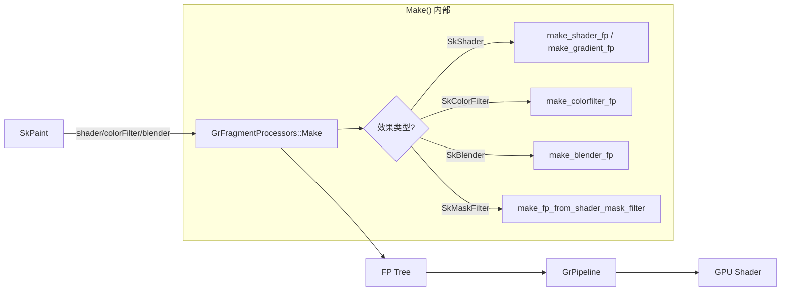

---

## 架构总览

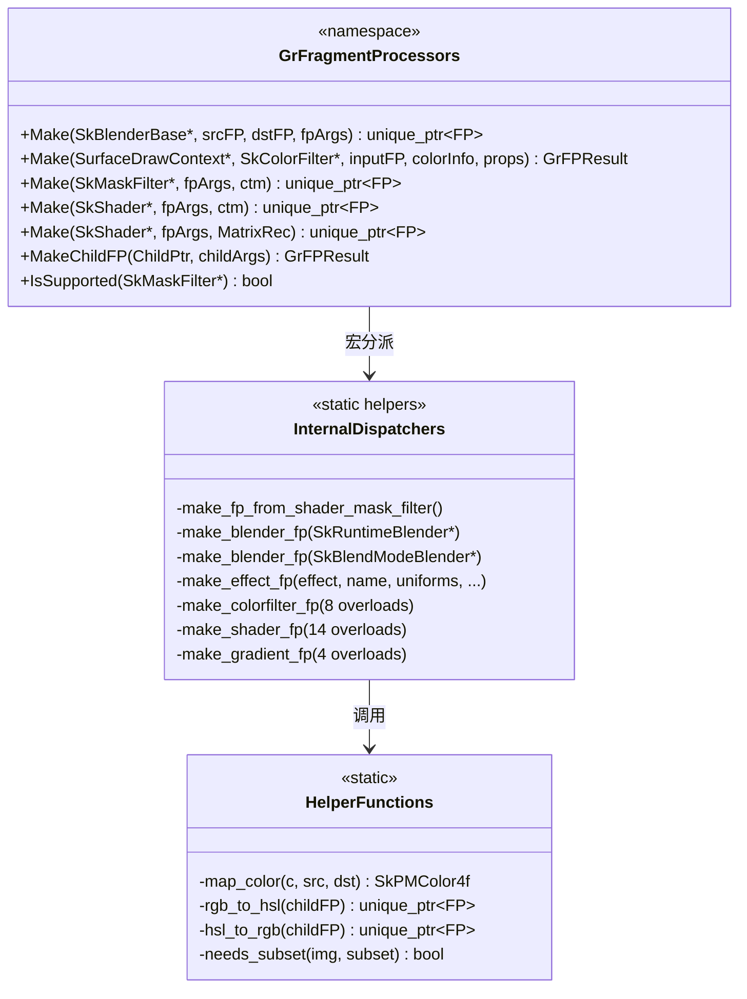

---

## 1. MaskFilter 处理

### 1.1 `make_fp_from_shader_mask_filter()` (line 109-117)

将 `SkShaderMaskFilterImpl` 转换为 FP：递归调用 `Make(shader)` 后包装为 `MulInputByChildAlpha`。

| 步骤 | 操作 |
|------|------|
| 1 | `static_cast` 到 `SkShaderMaskFilterImpl*` |
| 2 | 调用 `Make(shaderMF->shader(), args, ctm)` 获取 child FP |
| 3 | 用 `GrFragmentProcessor::MulInputByChildAlpha()` 包装 |

---

### 1.2 `Make(SkMaskFilter*)` (line 119-136)

公开入口，按 `MaskFilterBase::Type` 分派。

| Type | 处理 |
|------|------|
| `kShader` | → `make_fp_from_shader_mask_filter()` |
| `kBlur` / `kEmboss` / `kSDF` / `kTable` | → `nullptr` (不支持) |

---

### 1.3 `IsSupported()` (line 138-153)

判断 MaskFilter 是否有 GPU 实现。仅 `kShader` 返回 `true`。

---

## 2. Runtime Effects 与子对象处理

### 2.1 `MakeChildFP()` (line 157-195)

将 `SkRuntimeEffect::ChildPtr` 按类型转换为 FP。

```mermaid
flowchart TD
    Start([ChildPtr]) --> HasType{type 有值?}
    HasType -->|否 null| Null([GrFPNullableSuccess&#40;nullptr&#41;])
    HasType -->|是| Switch{ChildType?}
    Switch -->|kShader| Shader["MatrixRec(I), markTotalMatrixInvalid<br/>Make(child.shader(), childArgs, mRec)"]
    Switch -->|kColorFilter| CF["Make(sdc, child.colorFilter(),<br/>nullptr, dstColorInfo, props)"]
    Switch -->|kBlender| Blend["Make(as_BB(child.blender()),<br/>nullptr, DestColor(), childArgs)"]
    Shader --> Check1{fp != null?}
    CF --> Check2{success?}
    Blend --> Check3{fp != null?}
    Check1 -->|是| S1([GrFPSuccess])
    Check1 -->|否| F1([GrFPFailure])
    Check2 -->|是| S2([GrFPSuccess])
    Check2 -->|否| F2([GrFPFailure])
    Check3 -->|是| S3([GrFPSuccess])
    Check3 -->|否| F3([GrFPFailure])
```

---

### 2.2 `make_effect_fp()` (line 197-221)

为 SkRuntimeEffect 创建 `GrSkSLFP`。处理子对象迭代和 uniform 传递。

```mermaid
flowchart TD
    Start([effect, uniforms, inputFP, destColorFP, children]) --> Loop["遍历 children"]
    Loop --> Each["MakeChildFP(child, childArgs)"]
    Each --> OK{success?}
    OK -->|否| Fail([GrFPFailure&#40;inputFP&#41;])
    OK -->|是| Push["childFPs.push_back(childFP)"]
    Push --> More{还有 child?}
    More -->|是| Each
    More -->|否| Build["GrSkSLFP::MakeWithData(<br/>effect, name, colorSpace,<br/>inputFP, destColorFP, uniforms, childFPs)"]
    Build --> Result([GrFPSuccess&#40;fp&#41;])
```

---

### 2.3 `make_blender_fp(SkRuntimeBlender*)` (line 223-251)

运行时 Blender → FP。检查 `CanDraw` → 转换 uniforms → 委托 `make_effect_fp()`。

---

### 2.4 `make_blender_fp(SkBlendModeBlender*)` (line 253-260)

固定混合模式 Blender → `GrBlendFragmentProcessor::Make(srcFP, dstFP, mode)`。一行委托。

---

## 3. Blender 分派

### 3.1 `Make(SkBlenderBase*)` (line 262-280)

公开入口，使用 `SK_ALL_BLENDERS` 宏进行类型分派。

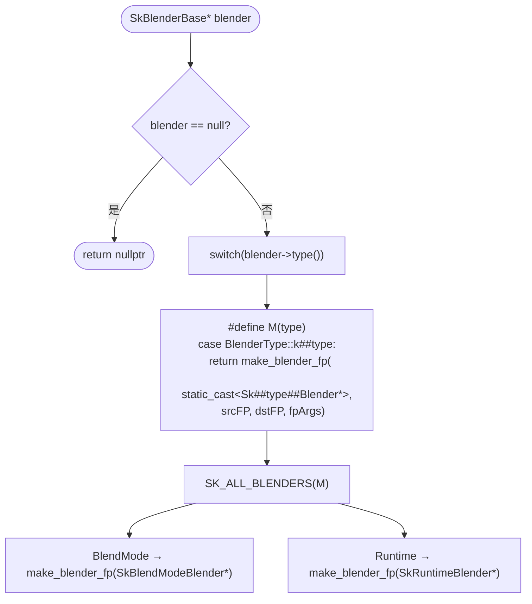

> **宏分派模式说明**: `SK_ALL_BLENDERS(M)` 展开为 `M(BlendMode) M(Runtime)`。每个分支 `static_cast` 到具体子类后调用对应重载。此模式在 ColorFilter 和 Shader 的分派中复用。

---

## 4. ColorFilter 处理

### 4.1 `map_color()` (line 282-286)

辅助函数，将颜色从 `src` 色彩空间转换到 `dst` 色彩空间并预乘。

---

### 4.2 `make_colorfilter_fp(SkBlendModeColorFilter*)` (line 287-321)

```mermaid
flowchart TD
    Start([BlendModeColorFilter]) --> IsDst{mode == kDst?}
    IsDst -->|是| PassThrough([return inputFP 不变])
    IsDst -->|否| MapColor["map_color(filter.color, sRGB, dstCS)"]
    MapColor --> MakeColor["colorFP = MakeColor(pmColor)"]
    MakeColor --> Blend["xferFP = GrBlendFragmentProcessor::Make(<br/>colorFP, inputFP, mode)"]
    Blend --> Check{xferFP == null?}
    Check -->|是| DebugFail([GrFPFailure])
    Check -->|否| Success([GrFPSuccess&#40;xferFP&#41;])
```

---

### 4.3 `make_colorfilter_fp(SkComposeColorFilter*)` (line 323-345)

```mermaid
flowchart TD
    Start([ComposeColorFilter: inner + outer]) --> Clone["inputClone = inputFP->clone()"]
    Clone --> Inner["Make(sdc, inner, inputFP, ...)"]
    Inner --> InnerOK{innerSuccess?}
    InnerOK -->|否| Fail1([GrFPFailure&#40;inputClone&#41;])
    InnerOK -->|是| Outer["Make(sdc, outer, innerFP, ...)"]
    Outer --> OuterOK{outerSuccess?}
    OuterOK -->|否| Fail2([GrFPFailure&#40;inputClone&#41;])
    OuterOK -->|是| Success([GrFPSuccess&#40;outerFP&#41;])
```

---

### 4.4 `make_colorfilter_fp(SkColorSpaceXformColorFilter*)` (line 347-356)

一行委托: `GrColorSpaceXformEffect::Make(inputFP, src, kPremul, dst, kPremul)`。

---

### 4.5 `make_colorfilter_fp(SkGaussianColorFilter*)` (line 358-373)

使用内置 SkSL 代码: `factor = exp(-factor*factor*4) - 0.018`。创建 `GrSkSLFP`。

---

### 4.6 `rgb_to_hsl()` (line 375-384)

辅助函数，创建 RGB→HSL 转换 FP (内置 `$rgb_to_hsl` SkSL intrinsic)。

---

### 4.7 `hsl_to_rgb()` (line 386-395)

辅助函数，创建 HSL→RGB 转换 FP (内置 `$hsl_to_rgb` SkSL intrinsic)。

---

### 4.8 `make_colorfilter_fp(SkMatrixColorFilter*)` (line 397-422)

```mermaid
flowchart TD
    Start([MatrixColorFilter]) --> Domain{filter->domain()?}
    Domain -->|kRGBA| RGBA["GrFragmentProcessor::ColorMatrix(<br/>inputFP, matrix,<br/>unpremulInput=true,<br/>clampRGB=filter.clamp,<br/>premulOutput=true)"]
    Domain -->|kHSLA| ToHSL["fp = rgb_to_hsl(inputFP)"]
    ToHSL --> Matrix["fp = ColorMatrix(fp, matrix,<br/>unpremul=false, clamp=false, premul=false)"]
    Matrix --> ToRGB["fp = hsl_to_rgb(fp)"]
    RGBA --> Success([GrFPSuccess])
    ToRGB --> Success
```

---

### 4.9 `make_colorfilter_fp(SkRuntimeColorFilter*)` (line 424-441)

转换 uniforms → 创建 `GrFPArgs(Scope::kRuntimeEffect)` → 委托 `make_effect_fp()`。

---

### 4.10 `make_colorfilter_fp(SkTableColorFilter*)` (line 443-452)

`ColorTableEffect::Make(inputFP, ctx, bitmap)` — 可能失败 (返回 `GrFPFailure`)。

---

### 4.11 `make_colorfilter_fp(SkWorkingFormatColorFilter*)` (line 454-478)

```mermaid
flowchart TD
    Start([WorkingFormatColorFilter]) --> GetCS["workingCS = filter->workingFormat(dstCS, &workingAT)"]
    GetCS --> BuildInfo["dst = {colorType, alphaType, dstCS}<br/>working = {colorType, workingAT, workingCS}"]
    BuildInfo --> Wrap["Make(sdc, filter->child(),<br/>GrColorSpaceXformEffect::Make(inputFP, dst→working),<br/>working, props)"]
    Wrap --> OK{ok?}
    OK -->|是| WrapBack["GrColorSpaceXformEffect::Make(fp, working→dst)"]
    OK -->|否| Fail([GrFPFailure&#40;fp&#41;])
    WrapBack --> Success([GrFPSuccess])
```

---

### 4.12 `Make(SkColorFilter*)` (line 480-503)

公开入口，使用 `SK_ALL_COLOR_FILTERS` 宏分派。特殊处理: `kNoop` 直接返回 `GrFPFailure`。

---

## 5. Shader 处理 (非渐变)

### 5.1 `make_shader_fp(SkBlendShader*)` (line 505-515)

递归调用 `Make(dst)` 和 `Make(src)` → `GrBlendFragmentProcessor::Make(srcFP, dstFP, mode)`。

---

### 5.2 `make_shader_fp(SkColorFilterShader*)` (line 517-536)

先 `Make(shader)` 得到 shaderFP，再 `Make(colorFilter, shaderFP)` 叠加 filter。

---

### 5.3 `make_shader_fp(SkColorShader*)` (line 538-548)

sRGB → dst 色彩空间转换后 → `GrFragmentProcessor::MakeColor(premulColor)`。

---

### 5.4 `make_shader_fp(SkCoordClampShader*)` (line 550-587)

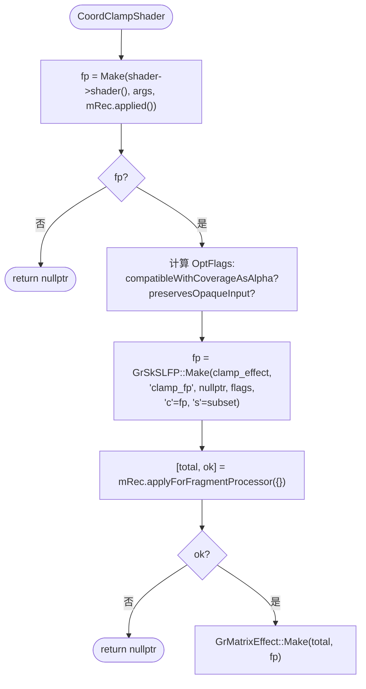

---

### 5.5 `make_shader_fp(SkCTMShader*)` (line 589-606)

反转 CTM → `Make(proxyShader, args, ctm)` → `GrMatrixEffect::Make(ctmInv)` → `DeviceSpace()`。

---

### 5.6 `make_shader_fp(SkEmptyShader*)` (line 608-612)

直接返回 `nullptr`。

---

### 5.7 `make_shader_fp(SkImageShader*)` (line 618-652)

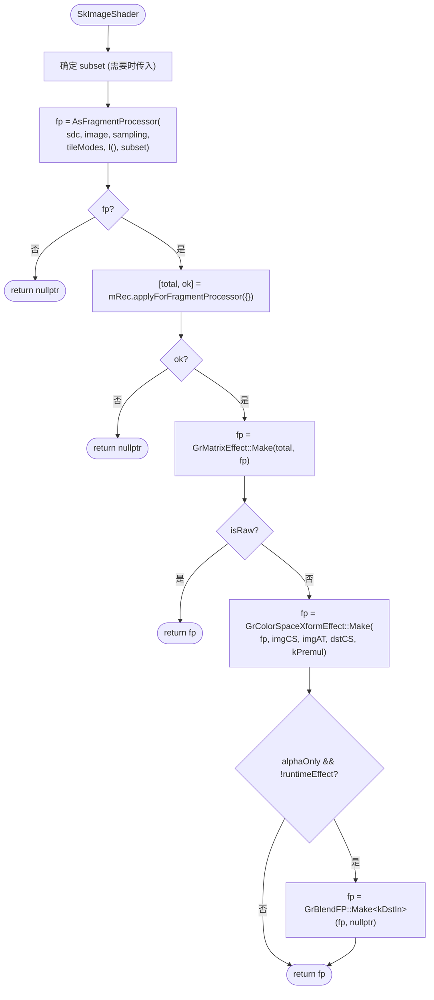

---

### 5.8 `make_shader_fp(SkLocalMatrixShader*)` (line 654-658)

一行委托: `Make(wrappedShader, args, mRec.concat(localMatrix))`。

---

### 5.9 `make_shader_fp(SkPerlinNoiseShader*)` (line 660-707)

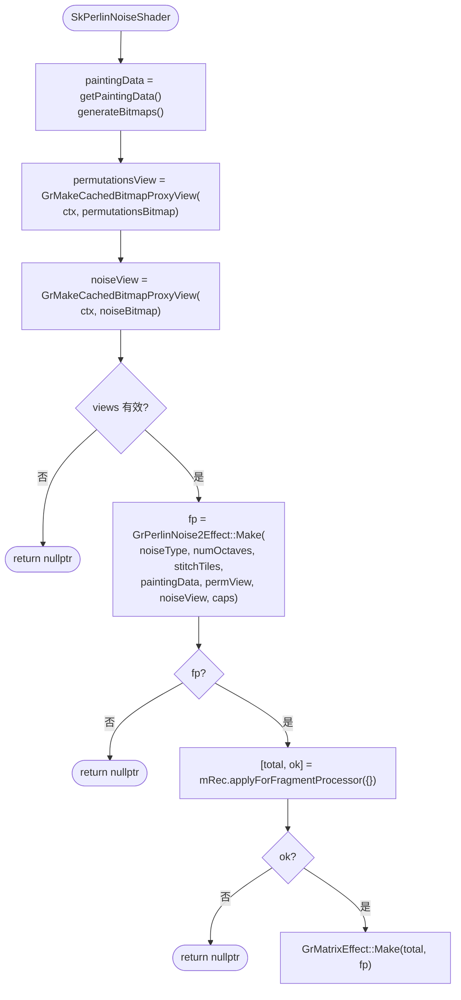

---

### 5.10 `make_shader_fp(SkPictureShader*)` (line 709-791)

最复杂的 Shader 处理，涉及 UniqueKey 缓存查找/创建。

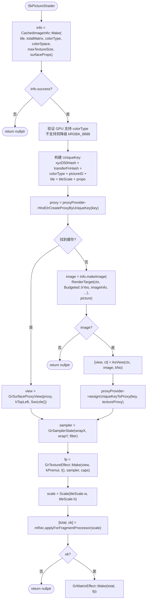

---

### 5.11 `make_shader_fp(SkRuntimeShader*)` (line 793-827)

检查 `CanDraw` → 转换 uniforms → `make_effect_fp()` → `mRec.applyForFragmentProcessor` → `GrMatrixEffect`。

---

### 5.12 `make_shader_fp(SkTransformShader*)` (line 829-833)

直接返回 `nullptr` (GPU 不支持)。

---

### 5.13 `make_shader_fp(SkTriColorShader*)` (line 835-839)

直接返回 `nullptr` (GPU 不支持)。

---

### 5.14 `make_shader_fp(SkWorkingColorSpaceShader*)` (line 841-870)

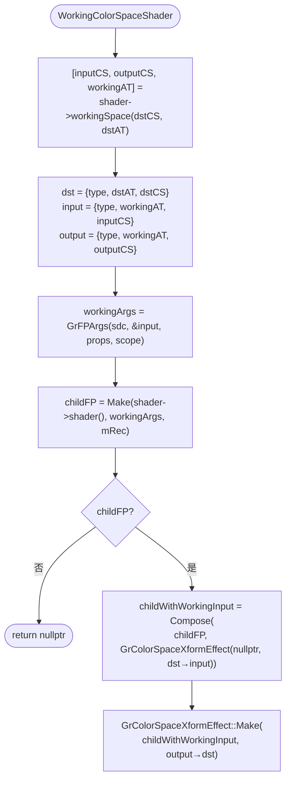

---

## 6. Gradient 处理

### 6.1 `make_gradient_fp(SkConicalGradient*)` (line 874-1034)

最复杂的渐变实现，根据 `SkConicalGradient::Type` 分三种子类型生成不同的 SkSL layout FP。

```mermaid
flowchart TD
    Start([SkConicalGradient]) --> Switch{shader->getType()?}

    Switch -->|kStrip| Strip["SkSL: t = r0² - p.y²<br/>若 t≥0: t = p.x + sqrt(t)<br/>否则: v = -1 (丢弃)"]
    Strip --> StripFP["GrSkSLFP::Make('TwoPointConicalStripLayout',<br/>r0_2 = (startRadius/centerX1)²)"]

    Switch -->|kRadial| Radial["SkSL: t = length(p) * lengthScale - r0"]
    Radial --> RadialFP["GrSkSLFP::Make('TwoPointConicalRadialLayout',<br/>r0, lengthScale=±1)"]
    RadialFP --> RadialMatrix["手动计算梯度矩阵:<br/>Translate(-startCenter) · Scale(1/dr)"]

    Switch -->|kFocal| Focal["SkSL: 复杂的 x_t 计算<br/>isFocalOnCircle: dot(p,p)/p.x<br/>isWellBehaved: length(p)-p.x*invR1<br/>else: sqrt(p.x²-p.y²)-p.x*invR1"]
    Focal --> FocalFP["GrSkSLFP::Make('TwoPointConicalFocalLayout',<br/>6个 Specialize 参数 + invR1 + fx)"]

    StripFP --> Final["GrGradientShader::MakeGradientFP(<br/>*shader, args, mRec, layoutFP, matrix)"]
    RadialMatrix --> Final
    FocalFP --> Final
```

---

### 6.2 `make_gradient_fp(SkLinearGradient*)` (line 1036-1040)

一行委托: `GrGradientShader::MakeLinear(*shader, args, mRec)`。

---

### 6.3 `make_gradient_fp(SkRadialGradient*)` (line 1042-1054)

SkSL layout: `return float4(length(coord), 1, 0, 0)` → `GrGradientShader::MakeGradientFP()`。

---

### 6.4 `make_gradient_fp(SkSweepGradient*)` (line 1056-1095)

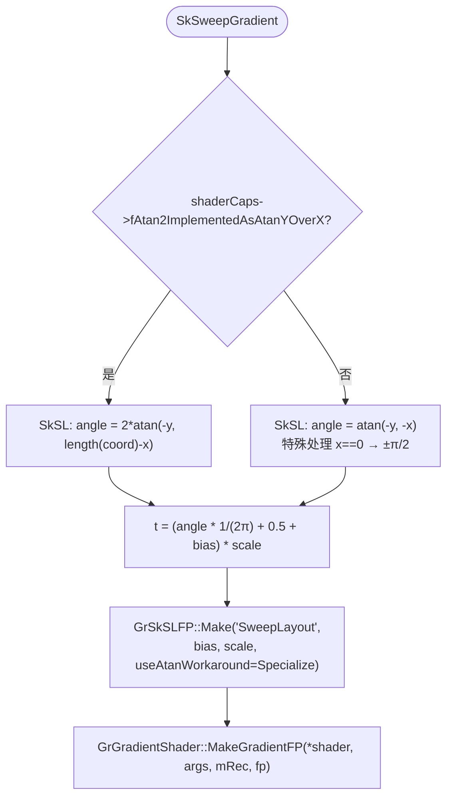

---

### 6.5 `make_shader_fp(SkGradientBaseShader*)` (line 1097-1113)

渐变 shader 的中间分派层，使用 `SK_ALL_GRADIENTS` 宏分派到 4 种具体渐变类型。

| GradientType | 目标函数 |
|------|------|
| `kConical` | `make_gradient_fp(SkConicalGradient*)` |
| `kLinear` | `make_gradient_fp(SkLinearGradient*)` |
| `kRadial` | `make_gradient_fp(SkRadialGradient*)` |
| `kSweep` | `make_gradient_fp(SkSweepGradient*)` |
| `kNone` | `SkDEBUGFAIL` + `nullptr` |

---

## 7. Shader 入口分派

### 7.1 `Make(SkShader*, GrFPArgs, SkMatrix)` (line 1115-1119)

简单包装: 构造 `MatrixRec(ctm)` 后调用下方重载。

---

### 7.2 `Make(SkShader*, GrFPArgs, MatrixRec)` (line 1121-1137)

完整的 Shader 类型分派入口，使用 `SK_ALL_SHADERS` 宏。

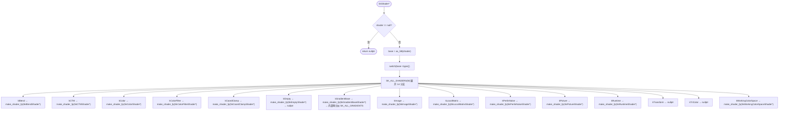

---

## 附录 A: Shader 类型分派完整图

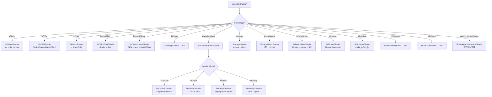

---

## 附录 B: Conical Gradient 三种子类型

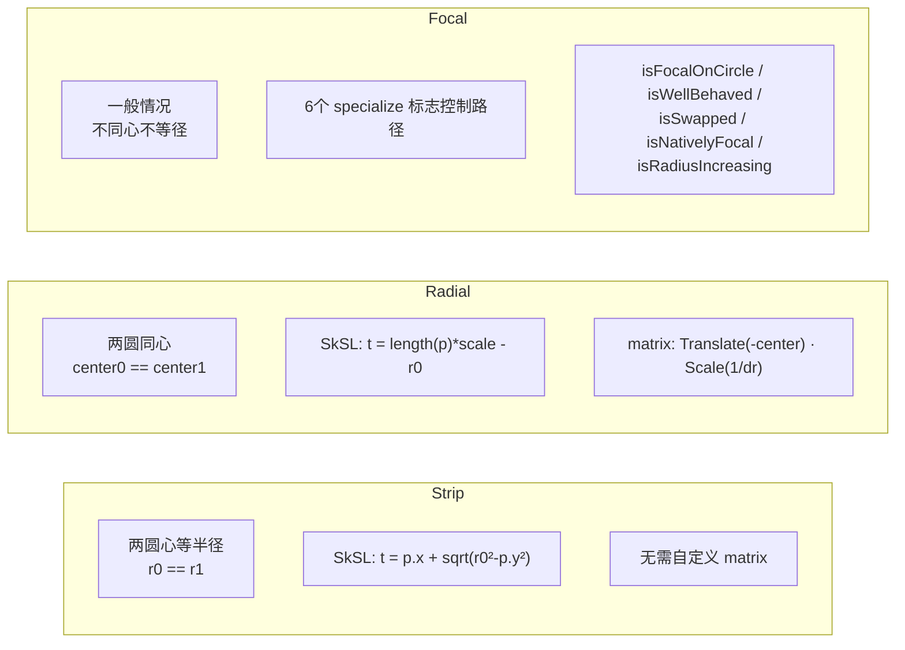

**几何关系**: 锥形渐变由两个圆定义 (center0, r0) 和 (center1, r1)。渐变参数 `t` 从 0 (第一个圆) 到 1 (第二个圆) 线性插值，圆的位置和半径决定了哪种子类型最高效。

---

## 附录 C: ColorFilter 类型分派图

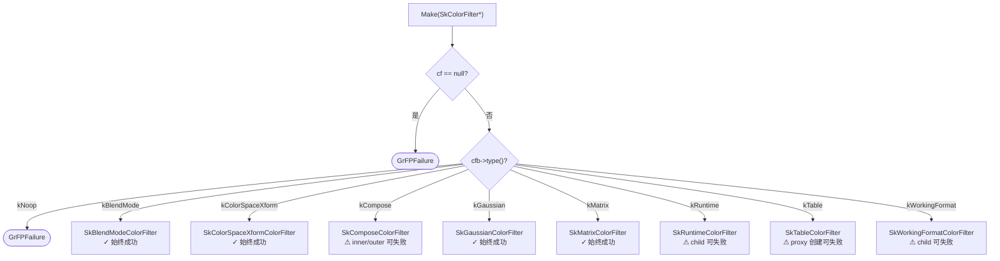

---

## 附录 D: MatrixRec 变换传播模型

`SkShaders::MatrixRec` 负责在 shader 递归过程中累积和传播本地坐标变换。

```mermaid
stateDiagram-v2
    [*] --> Created: MatrixRec(ctm)
    Created --> Concatenated: concat(localMatrix)
    Concatenated --> Concatenated: concat(另一个 localMatrix)
    Concatenated --> Applied: applied()
    Applied --> Final: applyForFragmentProcessor(extraMatrix)

    state Created {
        totalMatrix = ctm
        totalMatrixIsValid = true
    }

    state Concatenated {
        totalMatrix = ctm · local₁ · local₂ · ...
    }

    state Applied {
        totalMatrix 已消费
        后续子 shader 看到 Identity
    }

    state Final {
        返回 [combinedMatrix, ok]
        用于 GrMatrixEffect::Make()
    }
```

**关键方法**:

| 方法 | 行为 |
|------|------|
| `concat(m)` | 返回新 MatrixRec，totalMatrix 右乘 m |
| `applied()` | 返回新 MatrixRec，标记已应用 (子 shader 不再看到父变换) |
| `applyForFragmentProcessor(extra)` | 返回最终矩阵 (totalMatrix · extra) + 成功标志 |
| `markTotalMatrixInvalid()` | 标记 totalMatrix 无效 (用于 RuntimeEffect child) |
| `totalMatrix()` | 获取当前累积矩阵 (用于 PictureShader 等需要知道最终变换的场景) |
