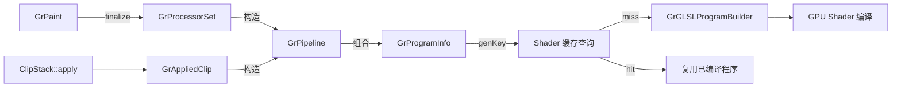
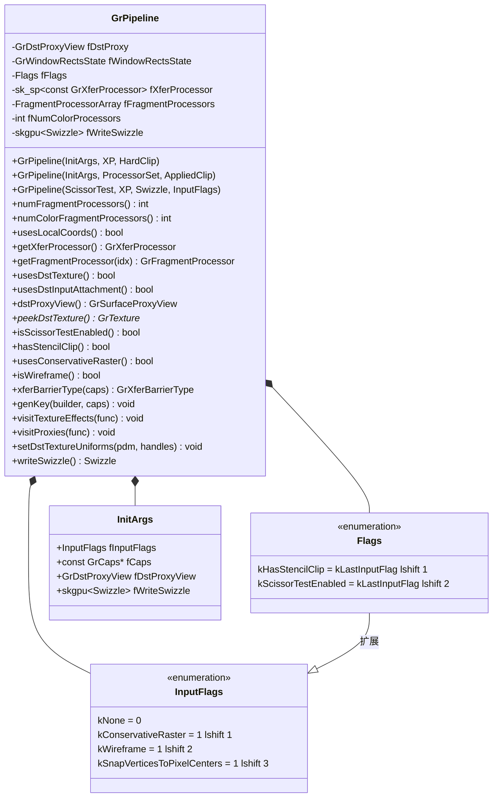
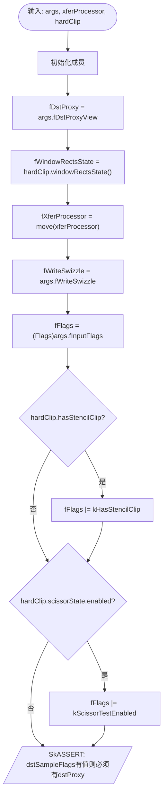
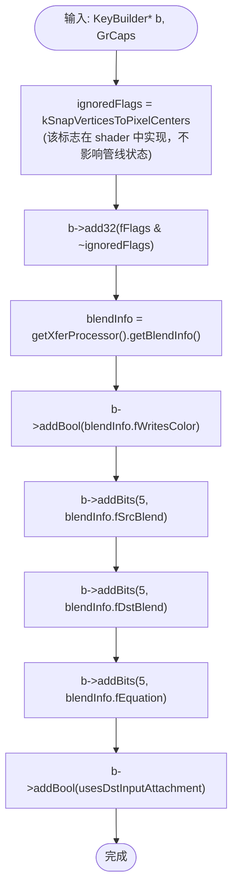
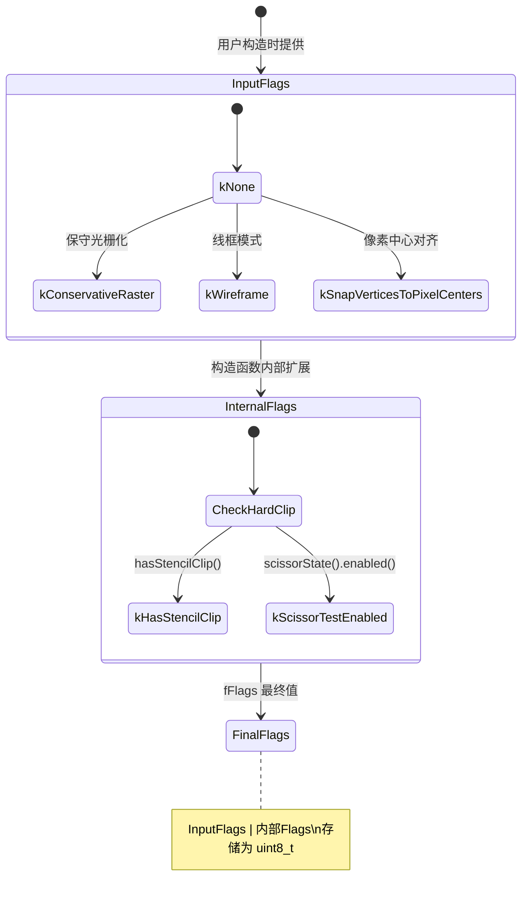
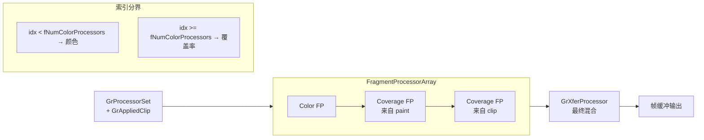
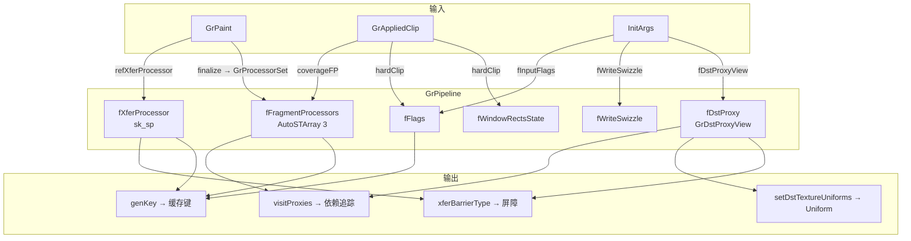

# Ganesh GrPipeline 函数实现参考

> 源码: `src/gpu/ganesh/GrPipeline.cpp` (145行)
> 头文件: `src/gpu/ganesh/GrPipeline.h` (256行)

---

## 类型速查

阅读后续函数流程图前，建议先熟悉以下类型。按职责分为 7 组。

### 1. GrPipeline 自身定义的类型

| 类型 | 含义 |
|------|------|
| `InputFlags` | 公共输入标志枚举 (`kNone` / `kConservativeRaster` / `kWireframe` / `kSnapVerticesToPixelCenters`) |
| `Flags` | 内部标志枚举，扩展 InputFlags (`kHasStencilClip` / `kScissorTestEnabled`) |
| `InitArgs` | 构造参数结构体，含 `fInputFlags` / `fCaps` / `fDstProxyView` / `fWriteSwizzle` |
| `FragmentProcessorArray` | 内部类型别名，`AutoSTArray<3, unique_ptr<const GrFragmentProcessor>>` |

### 2. 裁剪相关

| 类型 | 含义 |
|------|------|
| `GrAppliedClip` | 已应用的裁剪结果容器（含 scissor / stencil / coverage FP） |
| `GrAppliedHardClip` | 硬件裁剪子集（stencil + scissor + window rects） |
| `GrScissorTest` | 剪刀测试开关枚举 (`kEnabled` / `kDisabled`) |
| `GrScissorState` | 剪刀矩形状态 |
| `GrWindowRectsState` | 窗口矩形排除区域状态 |

### 3. 处理器

| 类型 | 含义 |
|------|------|
| `GrProcessorSet` | 处理器集合，持有颜色/覆盖率 FP 和 XP |
| `GrFragmentProcessor` | 片段处理器基类 |
| `GrTextureEffect` | 纹理采样片段处理器 |
| `GrXferProcessor` | 混合(传输)处理器基类 |
| `GrPorterDuffXPFactory` | Porter-Duff 混合处理器工厂 |

### 4. 纹理/代理/资源

| 类型 | 含义 |
|------|------|
| `GrSurfaceProxy` | GPU 表面代理基类 |
| `GrSurfaceProxyView` | 代理 + origin + swizzle 组合视图 |
| `GrTextureProxy` | 纹理代理 |
| `GrTexture` | 实际 GPU 纹理对象 |
| `GrDstProxyView` | 目标纹理代理视图（含 offset + sample flags） |
| `GrDstSampleFlags` | 目标采样标志 (`kNone` / `kRequiresTextureBarrier` / `kAsInputAttachment`) |
| `GrTextureType` | 纹理类型 (`k2D` / `kRectangle` / `kExternal`) |
| `skgpu::Mipmapped` | Mipmap 开关 (`kYes` / `kNo`) |

### 5. 混合/屏障

| 类型 | 含义 |
|------|------|
| `skgpu::BlendInfo` | 混合信息结构（含 src/dst blend coeff + equation + writesColor） |
| `skgpu::BlendCoeff` | 混合系数枚举 |
| `skgpu::BlendEquation` | 混合方程枚举 |
| `GrXferBarrierType` | 混合屏障类型 (`kNone` / `kTexture` / `kBlend`) |
| `SkBlendMode` | Skia 混合模式枚举 |

### 6. GPU 能力/Uniform

| 类型 | 含义 |
|------|------|
| `GrCaps` | GPU 能力查询接口 |
| `GrGLSLProgramDataManager` | GLSL uniform 数据管理器 |
| `GrGLSLBuiltinUniformHandles` | 内置 uniform 句柄集合（含 `fDstTextureCoordsUni`） |

### 7. 容器/工具

| 类型 | 含义 |
|------|------|
| `sk_sp<T>` | Skia 引用计数智能指针 |
| `skia_private::AutoSTArray<N, T>` | 栈分配小数组（N 以内在栈上，超出则堆分配） |
| `skgpu::Swizzle` | 颜色通道重排 |
| `skgpu::KeyBuilder` | 着色器缓存键构建器 |
| `GrVisitProxyFunc` | 代理遍历回调函数类型 |
| `SkIPoint` | 整数 2D 点 |

---

## GrPipeline 在 Skia 工程中的架构位置

| 属性 | 说明 |
|------|------|
| **归属** | `GrProgramInfo` 持有 `GrPipeline` 引用，Op 构造时创建 |
| **接口** | 不可变管线状态对象，提供 fragment processor / XP / flags 等查询 |
| **上游** | `GrPaint` → `GrProcessorSet` + `GrAppliedClip` → `GrPipeline` 构造 |
| **下游** | `GrPipeline` → `GrProgramInfo` → `GrGLSLProgramBuilder` → GPU Shader 编译 |



---

## 架构总览



---

## 1. 构造函数

### 1.1 `GrPipeline(InitArgs, XP, HardClip)` (line 23-39)

从初始化参数、混合处理器和硬件裁剪构造管线。此为基础构造函数，被其他构造函数委托调用。



---

### 1.2 `GrPipeline(InitArgs, ProcessorSet, AppliedClip)` (line 41-62)

从处理器集合和应用裁剪构造完整管线。此为最常用的构造函数。

```mermaid
flowchart TD
    Start([输入: args, processors, appliedClip]) --> Delegate["委托调用构造函数 1.1\n(args, processors.refXP, appliedClip.hardClip)"]
    Delegate --> AssertFin[/"SkASSERT: processors.isFinalized()"/]
    AssertFin --> CalcColor["fNumColorProcessors =\nprocessors.hasColorFP ? 1 : 0"]
    CalcColor --> CalcTotal["numTotalProcessors =\ncolor + coverage(paint) + coverage(clip)"]
    CalcTotal --> Alloc["fFragmentProcessors.reset(numTotalProcessors)"]
    Alloc --> CopyColor{有 Color FP?}
    CopyColor -->|是| DetachColor["array[0] = detachColorFP"]
    CopyColor -->|否| CopyCoverage
    DetachColor --> CopyCoverage{有 Coverage FP(paint)?}
    CopyCoverage -->|是| DetachCov["array[idx++] = detachCoverageFP"]
    CopyCoverage -->|否| CopyClip
    DetachCov --> CopyClip{有 Coverage FP(clip)?}
    CopyClip -->|是| DetachClip["array[idx++] = detachClipCoverageFP"]
    CopyClip -->|否| End([完成])
    DetachClip --> End
```

**处理器在数组中的排列顺序**:

| 索引范围 | 来源 | 类型 |
|----------|------|------|
| `[0, fNumColorProcessors)` | `GrProcessorSet` | 颜色处理器 |
| `[fNumColorProcessors, ...)` | `GrProcessorSet` | 绘制覆盖率处理器 |
| `[..., numTotal)` | `GrAppliedClip` | 裁剪覆盖率处理器 |

---

### 1.3 `GrPipeline(ScissorTest, XP, Swizzle, InputFlags)` (line 71-82)

简单构造函数，用于无裁剪状态的基本绘制。

**实现**:
1. 初始化空 `fWindowRectsState`
2. `fFlags = (Flags)inputFlags`
3. 存储 `xp` 和 `writeSwizzle`
4. 若 `scissorTest == kEnabled`，设置 `fFlags |= kScissorTestEnabled`

另有一个内联委托版本 (`.h` line 89-96) 接受 `SkBlendMode`，通过 `GrPorterDuffXPFactory::MakeNoCoverageXP(blend)` 转换后调用此构造函数。

---

## 2. 键生成与屏障

### 2.1 `genKey()` (line 84-101)

生成用于着色器缓存的管线唯一键。Vulkan 和 Metal 使用此键缓存对应的 pipeline 对象。



**键编码布局**:

| 字段 | 位宽 | 说明 |
|------|------|------|
| flags | 32 bit | 管线标志（去除 SnapVertices） |
| writesColor | 1 bit | 是否写入颜色 |
| srcBlend | 5 bit | 源混合系数 |
| dstBlend | 5 bit | 目标混合系数 |
| equation | 5 bit | 混合方程 |
| inputAttach | 1 bit | 是否使用输入附件 |

---

### 2.2 `xferBarrierType()` (line 64-69)

确定当前管线所需的传输屏障类型。

| 条件 | 返回值 |
|------|--------|
| `dstSampleFlags` 含 `kRequiresTextureBarrier` | `kTexture_GrXferBarrierType` |
| 其他 | 委托给 `getXferProcessor().xferBarrierType(caps)` |

---

## 3. 遍历访问

### 3.1 `visitTextureEffects()` (line 103-108)

遍历所有片段处理器中的纹理效果。

**实现**: 对 `fFragmentProcessors` 数组中每个 FP 调用其 `visitTextureEffects(func)` 方法，递归遍历 FP 树中所有 `GrTextureEffect` 节点。

**用途**: 收集纹理采样器信息用于着色器代码生成。

---

### 3.2 `visitProxies()` (line 110-118)

遍历管线使用的所有纹理代理。

```mermaid
flowchart TD
    Start([输入: GrVisitProxyFunc]) --> LoopFP["遍历 fFragmentProcessors"]
    LoopFP --> CallFP["对每个 fp 调用 fp->visitProxies(func)"]
    CallFP --> CheckDst{usesDstTexture()?}
    CheckDst -->|是| VisitDst["func(dstProxyView().proxy(), Mipmapped::kNo)"]
    CheckDst -->|否| End([完成])
    VisitDst --> End
```

**注意**: 遍历范围包括裁剪覆盖率 FP 中使用的代理。

---

## 4. Uniform 设置

### 4.1 `setDstTextureUniforms()` (line 120-145)

设置目标纹理坐标 uniform，用于需要读取目标颜色的混合模式。

```mermaid
flowchart TD
    Start([输入: pdm, builtinHandles]) --> GetTex["dstTexture = peekDstTexture()"]
    GetTex --> HasTex{dstTexture != null?}
    HasTex -->|否| AssertNoUni[/"SkASSERT: uniform handle 无效"/]
    HasTex -->|是| HasUni{fDstTextureCoordsUni.isValid()?}
    HasUni -->|否| End([完成])
    HasUni -->|是| InitScale["scaleX = 1.0, scaleY = 1.0"]
    InitScale --> CheckType{textureType == kRectangle?}
    CheckType -->|是 矩形纹理| RectScale["scaleX = height\n(像素坐标，存高度用于翻转)"]
    CheckType -->|否 普通纹理| NormScale["scaleX = 1/width\nscaleY = 1/height\n(归一化坐标)"]
    RectScale --> SetUni
    NormScale --> SetUni
    SetUni["pdm.set4f(uni,\n  offset.fX,\n  offset.fY,\n  scaleX,\n  scaleY)"]
    SetUni --> End([完成])
    AssertNoUni --> End
```

**Uniform vec4 各分量含义**:

| 分量 | 普通纹理 (2D) | 矩形纹理 (Rectangle) |
|------|---------------|----------------------|
| x | `dstTextureOffset.fX` | `dstTextureOffset.fX` |
| y | `dstTextureOffset.fY` | `dstTextureOffset.fY` |
| z (scaleX) | `1.0 / width` (归一化) | `height` (用于底部原点翻转) |
| w (scaleY) | `1.0 / height` (归一化) | `1.0` (未修改) |

---

## 附录 A: Flags 状态图



---

## 附录 B: Fragment Processor 管线布局



---

## 附录 C: 数据流与类型关系


