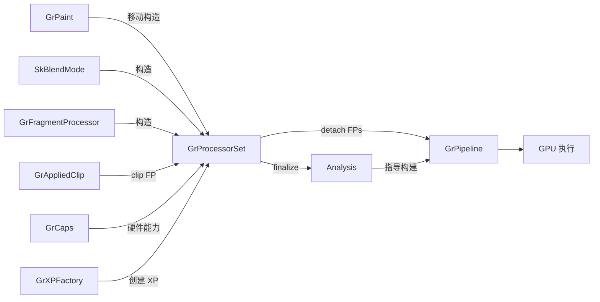
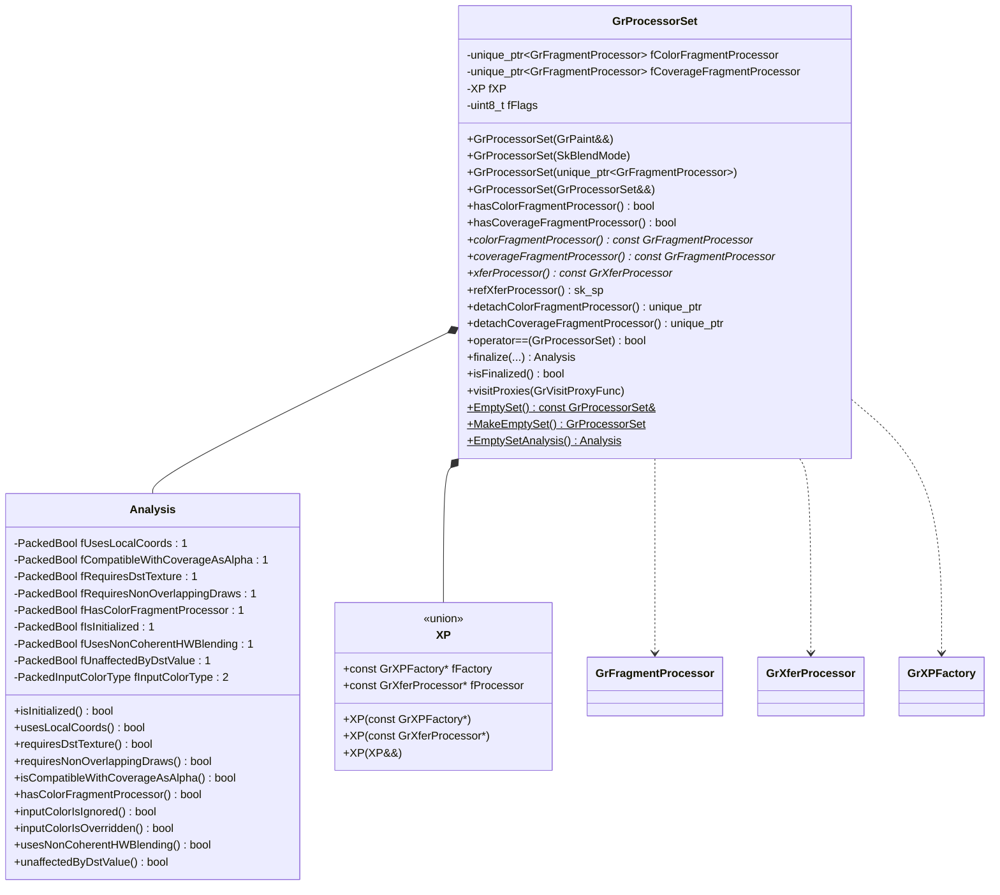
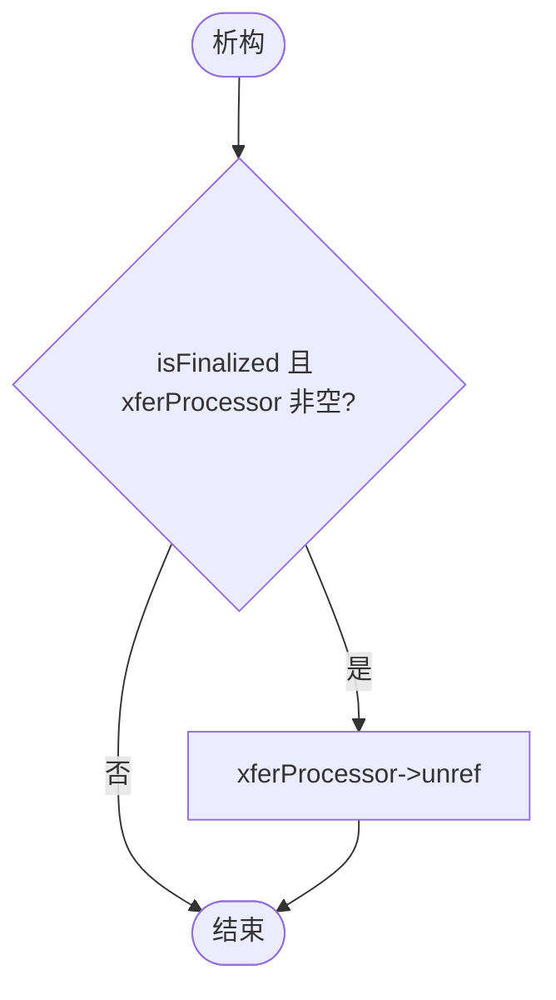
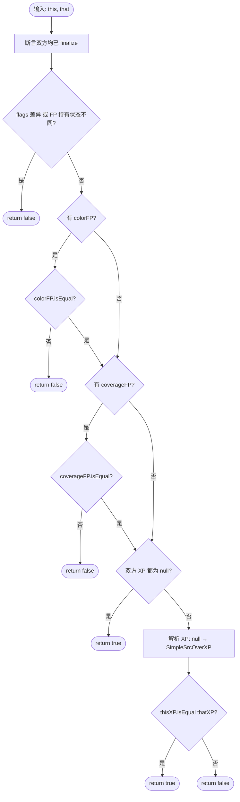
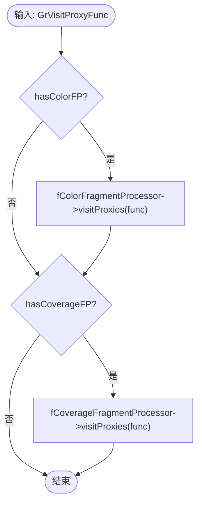
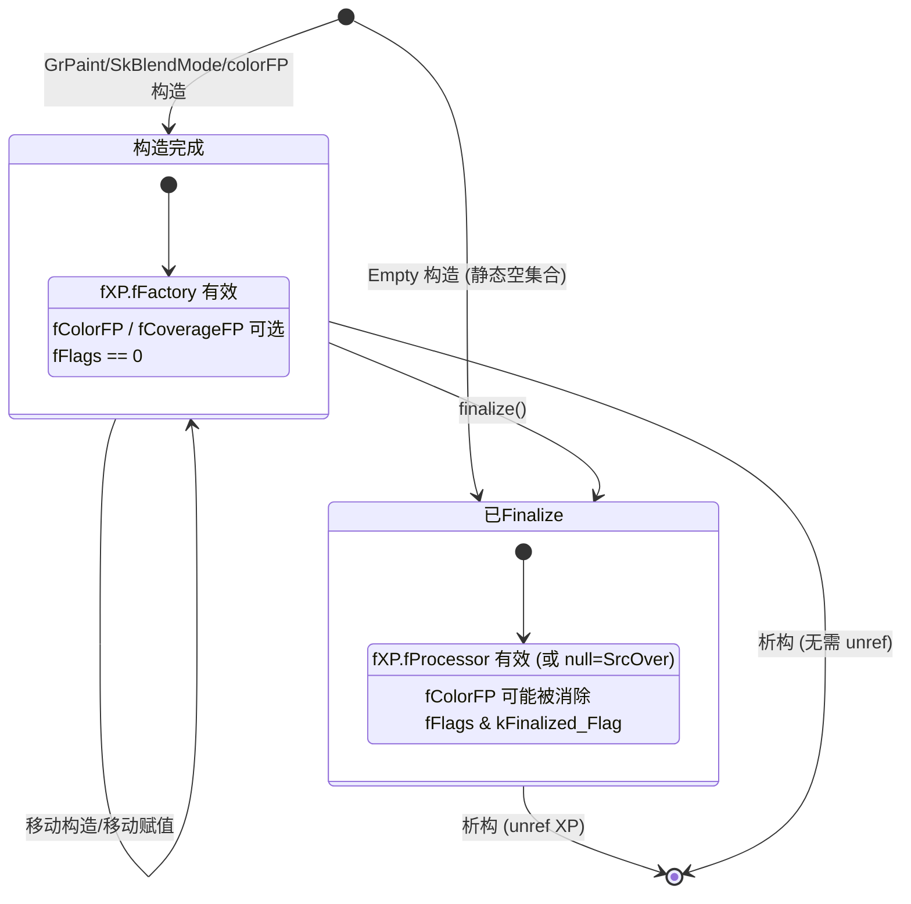

# GrProcessorSet 函数实现参考

> 源码: `src/gpu/ganesh/GrProcessorSet.cpp` (206行)
> 头文件: `src/gpu/ganesh/GrProcessorSet.h` (201行)

---

## 类型速查

阅读后续函数流程图前，建议先熟悉以下类型。按职责分为 7 组。

### 1. 自身类型

| 类型 | 含义 |
|------|------|
| `GrProcessorSet` | 处理器集合，管理颜色/覆盖 FP 和传输处理器 |
| `Analysis` | 嵌套类，`finalize()` 返回的分析结果，紧凑位字段 ≤ 4 字节 |
| `XP` | 私有联合体，finalize 前存 `GrXPFactory*`，finalize 后存 `GrXferProcessor*` |
| `Empty` | 私有枚举 (`kEmpty`)，空集合构造标记 |
| `InputColorType` | Analysis 内部枚举 (`kOriginal` / `kOverridden` / `kIgnored`) |
| `Flags` | 私有枚举 (`kFinalized_Flag = 0x1`) |
| `PackedBool` | `uint32_t` 别名，用于位字段打包 |
| `PackedInputColorType` | `uint32_t` 别名，用于 InputColorType 位字段 |

### 2. 处理器类型

| 类型 | 含义 |
|------|------|
| `GrFragmentProcessor` | 片段处理器基类，执行逐像素颜色/覆盖计算 |
| `GrXferProcessor` | 传输处理器，定义源与目标颜色的混合方式 |
| `GrXPFactory` | 传输处理器工厂，延迟创建 XP 实例 |
| `GrPorterDuffXPFactory` | Porter-Duff 混合工厂，提供 `SimpleSrcOverXP()` |
| `GrPorterDuffXferProcessor` | Porter-Duff 传输处理器实现 |

### 3. 分析类型

| 类型 | 含义 |
|------|------|
| `GrProcessorAnalysisColor` | 输入颜色分析（已知/未知/不透明等） |
| `GrProcessorAnalysisCoverage` | 输入覆盖分析枚举 (`kNone` / `kSingleChannel` / `kLCD`) |
| `GrColorFragmentProcessorAnalysis` | 颜色 FP 链分析器，追踪输出颜色属性 |
| `GrXPFactory::AnalysisProperties` | XP 工厂分析属性位标志 |

### 4. 渲染上下文

| 类型 | 含义 |
|------|------|
| `GrCaps` | GPU 硬件能力查询接口 |
| `GrAppliedClip` | 已应用的裁剪结果（可能附带 coverage FP） |
| `GrUserStencilSettings` | 用户模板测试设置 |
| `GrClampType` | 颜色钳位类型 |

### 5. 输入源

| 类型 | 含义 |
|------|------|
| `GrPaint` | 用户绘制状态，携带颜色/覆盖 FP 和 XP 工厂 |
| `SkBlendMode` | 混合模式枚举 (SrcOver / Multiply 等) |

### 6. 资源/代理

| 类型 | 含义 |
|------|------|
| `GrVisitProxyFunc` | 代理遍历回调函数类型 |
| `GrXferBarrierType` | 传输屏障类型枚举 |

### 7. 容器/工具

| 类型 | 含义 |
|------|------|
| `sk_sp<T>` | Skia 智能指针 (引用计数) |
| `std::unique_ptr<T>` | 独占所有权指针 |
| `SkPMColor4f` | 预乘 RGBA 浮点颜色 |
| `SkString` | Skia 字符串类 |
| `SkRefCnt` | 引用计数基类 |

---

## GrProcessorSet 在 Skia 工程中的架构位置

| 属性 | 说明 |
|------|------|
| **归属** | `GrDrawOp` 子类持有 `GrProcessorSet` 实例 |
| **接口** | 提供 `finalize()` 分析接口，供 Op 在记录阶段调用 |
| **上游** | `GrPaint` (用户绘制状态) → 移动构造 → `GrProcessorSet` |
| **下游** | `GrProcessorSet` → finalize → `GrPipeline` 构建 |



---

## 架构总览



---

## 1. 静态工厂 / 空集合

### 1.1 `EmptySet()` (line 15-18)

返回全局静态空集合的常量引用。使用 `Empty::kEmpty` 构造标记，确保 `isFinalized() == true`。

| 步骤 | 操作 |
|------|------|
| 1 | 声明 `static GrProcessorSet gEmpty(Empty::kEmpty)` |
| 2 | 返回 `gEmpty` 的 const 引用 |

**特点**: 全局单例，避免重复创建空集合。

---

### 1.2 `MakeEmptySet()` (line 20-22)

返回一个新的空集合值对象（非引用）。

| 步骤 | 操作 |
|------|------|
| 1 | 构造 `GrProcessorSet(Empty::kEmpty)` |
| 2 | 按值返回（移动语义） |

---

## 2. 构造 / 移动 / 析构

### 2.1 `GrProcessorSet(GrPaint&&)` (line 24-29)

从 `GrPaint` 移动构造，接管所有处理器和 XP 工厂。

| 步骤 | 操作 |
|------|------|
| 1 | 初始化 `fXP` 为 `paint.getXPFactory()` |
| 2 | 移动 `paint.fColorFragmentProcessor` → `fColorFragmentProcessor` |
| 3 | 移动 `paint.fCoverageFragmentProcessor` → `fCoverageFragmentProcessor` |
| 4 | DEBUG: 标记 `paint.fAlive = false` |

---

### 2.2 `GrProcessorSet(SkBlendMode)` (line 31)

从混合模式构造，仅设置 XP 工厂，无 FP。

| 步骤 | 操作 |
|------|------|
| 1 | `fXP` = `GrXPFactory::FromBlendMode(mode)` |

---

### 2.3 `GrProcessorSet(unique_ptr<GrFragmentProcessor>)` (line 33-37)

从单个颜色 FP 构造，XP 工厂为 null（默认 SrcOver）。

| 步骤 | 操作 |
|------|------|
| 1 | `fXP` 初始化为 `(const GrXPFactory*)nullptr` |
| 2 | 断言 `colorFP` 非空 |
| 3 | 移动 `colorFP` → `fColorFragmentProcessor` |

---

### 2.4 `GrProcessorSet(GrProcessorSet&&)` (line 39-43)

移动构造，转移所有成员。

| 步骤 | 操作 |
|------|------|
| 1 | 移动 `fColorFragmentProcessor` |
| 2 | 移动 `fCoverageFragmentProcessor` |
| 3 | 移动 `fXP` (联合体内部将源置 nullptr) |
| 4 | 复制 `fFlags` |

---

### 2.5 `~GrProcessorSet()` (line 45-49)

析构函数，负责释放 finalize 后的 XP 引用。



**说明**: finalize 后 `fXP.fProcessor` 通过 `release()` 获得裸指针所有权，需手动 `unref()`。未 finalize 时 `fXP.fFactory` 为非拥有指针，无需释放。

---

## 3. 比较与调试

### 3.1 `operator==()` (line 80-112)

比较两个已 finalize 的处理器集合是否等价。



**关键细节**:
- flags 比较时排除 `kFinalized_Flag`（双方必然都置位）
- XP 为 null 等价于 `GrPorterDuffXPFactory::SimpleSrcOverXP()`

---

### 3.2 `dumpProcessors()` (line 52-77)

仅在 `GPU_TEST_UTILS` 下编译的调试方法，拼接处理器信息字符串。

| 步骤 | 条件 | 输出 |
|------|------|------|
| 1 | `hasColorFragmentProcessor()` | "Color Fragment Processor:\n" + dumpTreeInfo |
| 2 | 否则 | "No color fragment processor.\n" |
| 3 | `hasCoverageFragmentProcessor()` | "Coverage Fragment Processor:\n" + dumpTreeInfo |
| 4 | 否则 | "No coverage fragment processors.\n" |
| 5 | `isFinalized()` 且有 XP | "Xfer Processor: {name}\n" |
| 6 | `isFinalized()` 且无 XP | "Xfer Processor: SrcOver\n" |
| 7 | 未 finalize | "XP Factory dumping not implemented.\n" |

---

## 4. 核心分析: finalize()

### 4.1 `finalize()` (line 114-196)

处理器集合的核心方法。分析输入颜色/覆盖/裁剪/硬件能力，优化处理器链，创建 XP 实例，并返回 Analysis 结果。**只可调用一次**。

```mermaid
flowchart TD
    Start([输入: colorInput, coverageInput, clip, userStencil, caps, clampType, overrideInputColor]) --> AssertNotFinalized[断言未 finalize]

    AssertNotFinalized --> InitCovAlpha["analysis.fCompatibleWithCoverageAsAlpha = (coverageInput != LCD)"]

    InitCovAlpha --> ColorAnalysis["GrColorFragmentProcessorAnalysis<br/>分析颜色 FP 链"]

    ColorAnalysis --> CheckCovFP{有 coverageFP?}
    CheckCovFP -->|是| CovCompat{"coverageFP.compatible<br/>WithCoverageAsAlpha?"}
    CovCompat -->|否| SetCovFalse["fCompatibleWithCoverageAsAlpha = false"]
    CovCompat -->|是| CovLocalCoords["coverageUsesLocalCoords |= usesSampleCoords"]
    SetCovFalse --> CovLocalCoords
    CheckCovFP -->|否| CheckClipFP

    CovLocalCoords --> CheckClipFP{clip 有 coverageFP?}
    CheckClipFP -->|是| ClipCompat["fCompatibleWithCoverageAsAlpha &= clipFP 兼容性<br/>coverageUsesLocalCoords |= clipFP.usesSampleCoords"]
    CheckClipFP -->|否| CalcEliminate

    ClipCompat --> CalcEliminate["colorFPsToEliminate = colorAnalysis.initialProcessorsToEliminate<br/>设置 fInputColorType"]

    CalcEliminate --> CalcOutputCov{"确定 outputCoverage"}
    CalcOutputCov --> CovLCD{coverageInput == LCD?}
    CovLCD -->|是| OutLCD["outputCoverage = LCD"]
    CovLCD -->|否| CovHasFP{hasCoverageFP 或 SingleChannel?}
    CovHasFP -->|是| OutSingle["outputCoverage = SingleChannel"]
    CovHasFP -->|否| OutNone["outputCoverage = None"]

    OutLCD & OutSingle & OutNone --> GetXPProps["props = GrXPFactory::GetAnalysisProperties<br/>(xpFactory, outputColor, outputCoverage, caps, clampType)"]

    GetXPProps --> SetAnalysisFlags["设置 analysis 标志位:<br/>fRequiresDstTexture<br/>fCompatibleWithCoverageAsAlpha<br/>fRequiresNonOverlappingDraws<br/>fUsesNonCoherentHWBlending<br/>fUnaffectedByDstValue"]

    SetAnalysisFlags --> IgnoresColor{props 含 kIgnoresInputColor?}
    IgnoresColor -->|是| IgnorePath["colorFPsToEliminate = 全部<br/>fInputColorType = kIgnored<br/>fUsesLocalCoords = coverageUsesLocalCoords"]
    IgnoresColor -->|否| NormalPath["fCompatibleWithCoverageAsAlpha &= colorAnalysis 兼容性<br/>fUsesLocalCoords = coverageUsesLocalCoords || colorAnalysis.usesLocalCoords"]

    IgnorePath & NormalPath --> ElimFP{colorFPsToEliminate > 0?}
    ElimFP -->|是| NullColorFP["fColorFragmentProcessor = nullptr"]
    ElimFP -->|否| KeepFP[保留 colorFP]

    NullColorFP & KeepFP --> RecordHasColor["analysis.fHasColorFragmentProcessor = hasColorFP"]

    RecordHasColor --> MakeXP["xp = GrXPFactory::MakeXferProcessor<br/>(xpFactory, outputColor, outputCoverage, caps, clampType)"]

    MakeXP --> StoreXP["fXP.fProcessor = xp.release()"]
    StoreXP --> SetFinalized["fFlags |= kFinalized_Flag<br/>analysis.fIsInitialized = true"]
    SetFinalized --> DebugAssert["DEBUG: 验证 fRequiresNonOverlappingDraws 一致性"]
    DebugAssert --> Return([return analysis])
```



**关键逻辑说明**:

1. **Coverage-as-Alpha 兼容性**: LCD 覆盖始终不兼容；逐一检查 coverage FP 和 clip FP
2. **颜色 FP 消除**: 如果颜色分析发现前置 FP 产生常量输出，可以消除并用 `overrideInputColor` 替代；如果 XP 忽略输入颜色，则消除全部颜色 FP
3. **输出覆盖推导**: LCD > SingleChannel > None 优先级
4. **XP 创建**: 从工厂创建实例后，联合体从 `fFactory` 语义切换为 `fProcessor` 语义

---

## 5. 代理遍历

### 5.1 `visitProxies()` (line 198-205)

遍历所有 FP 引用的纹理代理，用于资源追踪和依赖管理。



---

## 附录: GrProcessorSet 生命周期状态机



---

## 附录: Analysis 位字段布局

```
┌─────────────────────────────────────────────────┐
│            uint32_t (4 bytes / 32 bits)          │
├───┬───┬───┬───┬───┬───┬───┬───┬─────┬──────────┤
│ 0 │ 1 │ 2 │ 3 │ 4 │ 5 │ 6 │ 7 │ 8-9 │ 10-31   │
├───┼───┼───┼───┼───┼───┼───┼───┼─────┼──────────┤
│ U │ C │ D │ N │ H │ I │ B │ A │ ICT │ (unused) │
│ L │ C │ T │ O │ C │ N │ L │ U │     │          │
│ C │ A │ X │ D │ F │ I │ D │ D │     │          │
│   │ A │   │   │ P │ T │   │ V │     │          │
└───┴───┴───┴───┴───┴───┴───┴───┴─────┴──────────┘

ULC = fUsesLocalCoords
CCA = fCompatibleWithCoverageAsAlpha
DTX = fRequiresDstTexture
NOD = fRequiresNonOverlappingDraws
HCP = fHasColorFragmentProcessor
INI = fIsInitialized
BLD = fUsesNonCoherentHWBlending
UDV = fUnaffectedByDstValue
ICT = fInputColorType (2 bits: 00=Original, 01=Overridden, 10=Ignored)
```
