# GrSWMaskHelper 函数实现参考

> 源码: `src/gpu/ganesh/GrSWMaskHelper.cpp` (153行)
> 头文件: `src/gpu/ganesh/GrSWMaskHelper.h`

---

## 类型速查

阅读后续函数流程图前，建议先熟悉以下类型。按职责分为 6 组。

### 1. 自身类型

| 类型 | 含义 |
|------|------|
| `GrSWMaskHelper` | 软件蒙版生成辅助类，继承 `SkNoncopyable` |

### 2. 几何/形状

| 类型 | 含义 |
|------|------|
| `GrShape` | 形状统一封装 (Rect / RRect / Path / Arc / Point / Line) |
| `GrStyledShape` | 带样式 (描边/路径效果) 的形状 |
| `SkRect` | 浮点矩形 |
| `SkRRect` | 圆角矩形 |
| `SkPath` | 路径 |
| `SkMatrix` | 3×3 变换矩阵 |
| `SkIRect` | 整数矩形 |
| `SkVector` / `SkPoint` | 2D 向量 / 点 |

### 3. 渲染上下文

| 类型 | 含义 |
|------|------|
| `GrRecordingContext` | GPU 录制上下文 |
| `GrSurfaceProxyView` | 代理 + origin + swizzle 组合纹理视图 |
| `GrMippedBitmap` | 位图包装，用于上传到 GPU |

### 4. 绘制工具

| 类型 | 含义 |
|------|------|
| `skcpu::Draw` | CPU 端绘制器 (定义于 `SkDraw.h`) |
| `SkRasterClip` | 光栅剪切区域 |
| `SkAutoPixmapStorage` | 自动管理的像素存储 |
| `SkPaint` | 画笔 (颜色/混合/AA 等属性) |
| `SkBlendMode` | 混合模式枚举 (`kSrc` 等) |

### 5. 枚举/标志

| 类型 | 含义 |
|------|------|
| `GrAA` | 抗锯齿开关 (`kYes` / `kNo`) |
| `SkBackingFit` | 纹理分配策略 (`kExact` / `kApprox`) |
| `skgpu::Mipmapped` | 是否生成 mipmap |

### 6. 其他

| 类型 | 含义 |
|------|------|
| `SkImageInfo` | 图像格式描述 (宽/高/颜色类型/Alpha类型) |
| `SkStrokeRec` | 描边记录 (宽度/端点/连接) |
| `GrStyle` | 形状样式 (描边 + 路径效果) |

---

## GrSWMaskHelper 在 Skia 工程中的架构位置

| 属性 | 说明 |
|------|------|
| **归属** | `src/gpu/ganesh/` 独立辅助类 |
| **接口** | 提供 `init()` → `draw*()` → `toTextureView()` 三阶段 API |
| **上游** | `ClipStack::apply` (render_sw_mask) / `SoftwarePathRenderer` |
| **下游** | 输出 `GrSurfaceProxyView` 供 `GrTextureEffect` / `GrAppliedClip` 消费 |

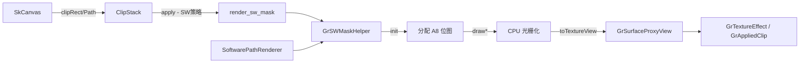

---

## 架构总览

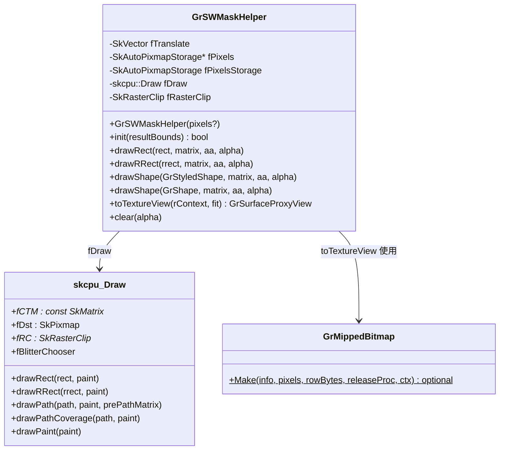

---

## 1. 静态辅助函数

### 1.1 `get_paint()` (line 33-40)

构造用于蒙版绘制的 `SkPaint`。

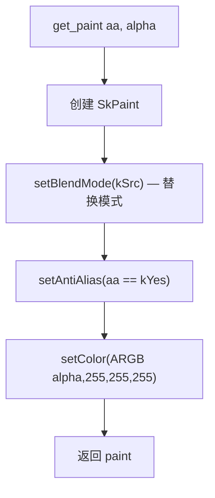

| 设置项 | 值 | 说明 |
|--------|-----|------|
| BlendMode | `kSrc` | 直接替换目标像素，无混合 |
| AntiAlias | 由 `GrAA` 决定 | 控制边缘抗锯齿 |
| Color | `ARGB(alpha, 0xFF, 0xFF, 0xFF)` | unpremul 颜色，A8 位图只取 alpha 通道 |

---

## 2. 初始化

### 2.1 `GrSWMaskHelper()` 构造函数 (头文件 line 48-49)

```cpp
GrSWMaskHelper(SkAutoPixmapStorage* pixels = nullptr)
        : fPixels(pixels ? pixels : &fPixelsStorage) { }
```

若外部传入 `pixels` 指针则使用外部存储，否则使用内部 `fPixelsStorage`。允许调用者复用已分配的内存。

---

### 2.2 `init()` (line 120-136)

初始化位图和绘制器，准备后续 `draw*` 调用。

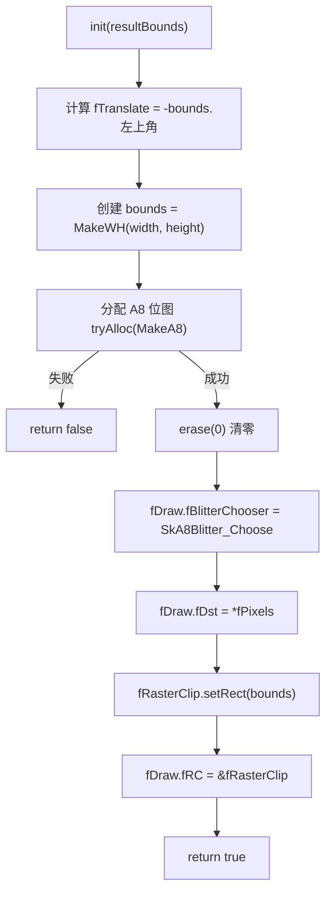

关键点:
- `fTranslate` 将绘制坐标原点移至 `resultBounds` 左上角，使位图从 (0,0) 开始
- 使用 `SkA8Blitter_Choose` 专为 Alpha8 格式优化的 blitter

---

### 2.3 `clear()` (头文件 line 73-75)

```cpp
void clear(uint8_t alpha) {
    fPixels->erase(SkColorSetARGB(alpha, 0xFF, 0xFF, 0xFF));
}
```

用指定 alpha 值填充整个位图。常用于重置蒙版状态。

---

## 3. 绘制函数

### 3.1 `drawRect()` (line 45-51)

绘制单个矩形到累积位图。

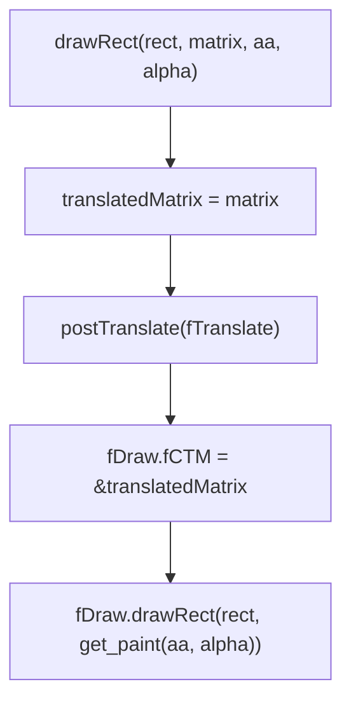

---

### 3.2 `drawRRect()` (line 53-60)

绘制单个圆角矩形到累积位图。逻辑与 `drawRect` 相同，仅调用不同的绘制方法。

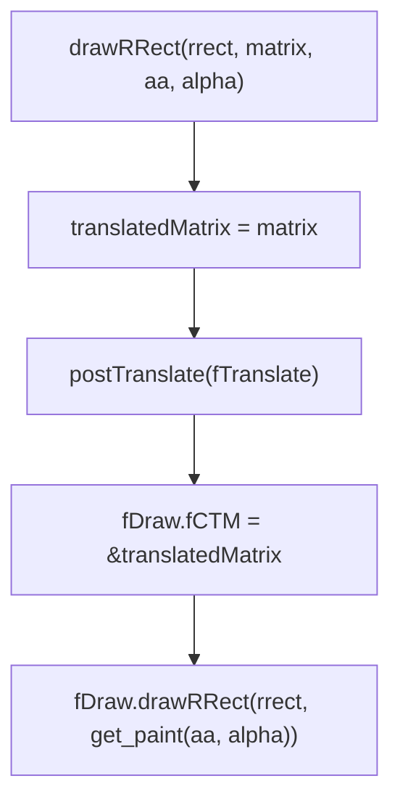

---

### 3.3 `drawShape(const GrStyledShape&, ...)` (line 65-82)

绘制带样式 (描边/路径效果) 的形状。

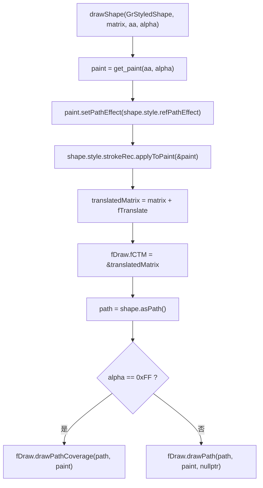

关键点:
- 将形状的路径效果和描边信息应用到 paint
- `alpha == 0xFF` 时走 `drawPathCoverage` 优化路径，专为覆盖率计算设计，性能更好
- 其他 alpha 值走通用 `drawPath`

---

### 3.4 `drawShape(const GrShape&, ...)` (line 84-118)

绘制简单填充形状，包含形状类型分派和反转逻辑。

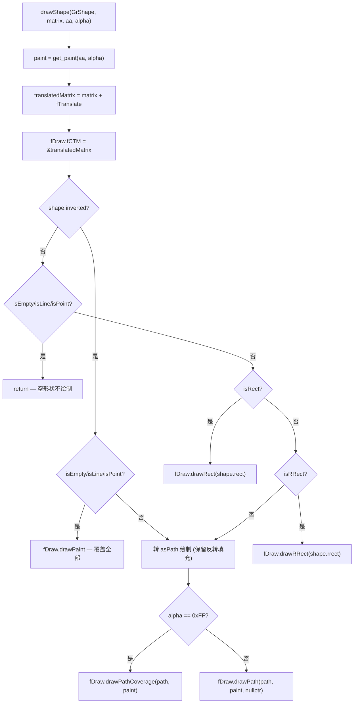

形状类型分派优先级:

| 优先级 | 条件 | 处理 |
|--------|------|------|
| 1 | inverted + 空形状 | `drawPaint` 覆盖全部 |
| 2 | 非 inverted + 空形状 | 跳过 |
| 3 | `isRect()` | `drawRect` 快速路径 |
| 4 | `isRRect()` | `drawRRect` 快速路径 |
| 5 | 复杂/反转形状 | `asPath()` → drawPath/drawPathCoverage |

---

## 4. 纹理输出

### 4.1 `toTextureView()` (line 138-153)

将 CPU 端位图上传到 GPU 并返回纹理代理视图。

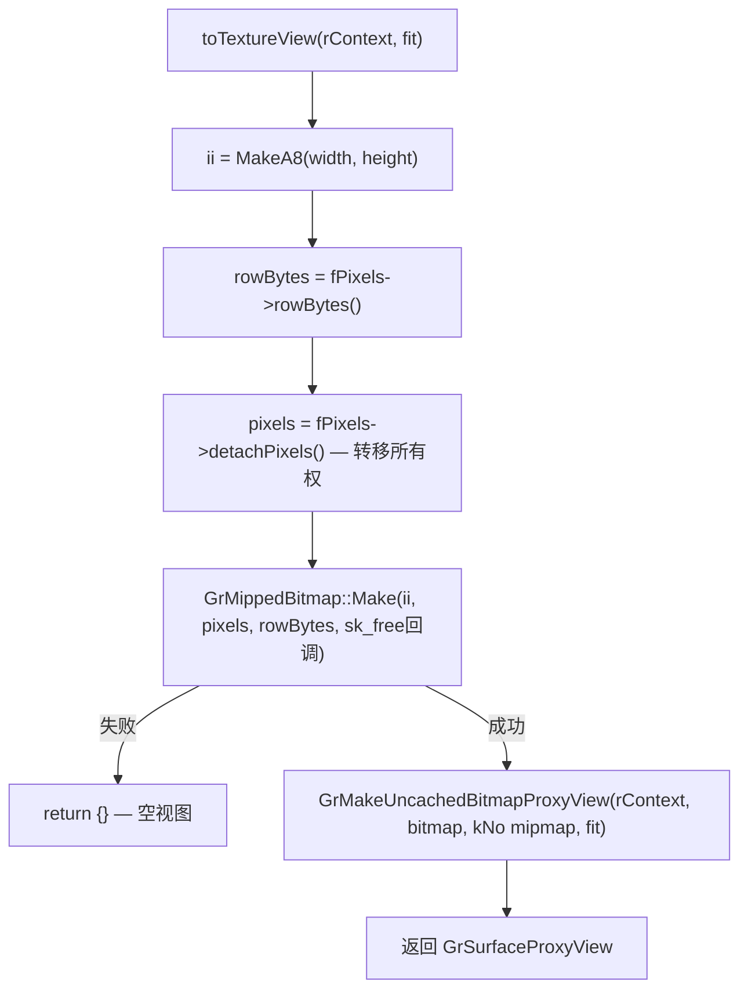

关键点:
- `detachPixels()` 将像素数据所有权从 `SkAutoPixmapStorage` 转移出来
- 释放回调使用 `sk_free` 确保正确释放
- 不生成 mipmap (`skgpu::Mipmapped::kNo`)，蒙版纹理不需要多级纹理
- 使用未缓存的纹理代理 (uncached)，蒙版通常一次性使用

---

## 附录: 使用流程

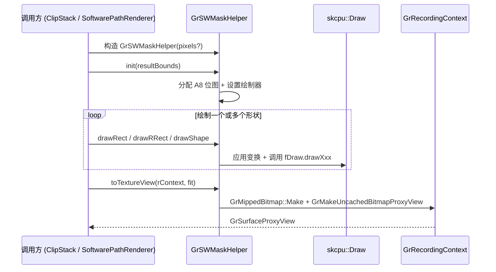

---

## 附录: 与 ClipStack 的交互

在 `ClipStack.cpp` 的 `render_sw_mask` 函数中，`GrSWMaskHelper` 被用于软件渲染裁剪蒙版:

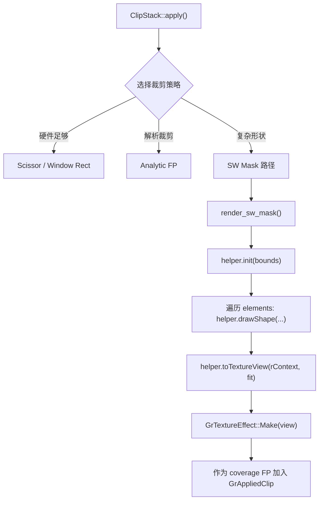

---

## 附录: SW Mask vs GPU Mask 策略选择

ClipStack 并非只有 SW mask 一条路径。实际上 SW mask 是**最后的备选方案**，GPU stencil 才是处理复杂裁剪的主力。

### 裁剪策略优先级

ClipStack 在 `apply()` 中按优先级从高到低选择策略:

| 优先级 | 策略 | 实现方式 | 适用场景 |
|--------|------|----------|----------|
| 1 | **Analytic FP** | Fragment Processor 解析计算 | 简单形状 (rect/rrect/convex) |
| 2 | **Atlas** | 预渲染到 atlas 纹理 | 可复用的裁剪形状 |
| 3 | **Stencil Mask** | GPU stencil buffer | 复杂形状 + MSAA/DynamicMSAA 支持 |
| 4 | **SW Mask** | CPU 光栅化 → 上传纹理 | Stencil 不可用或需 AA 但无 MSAA |

### SW Mask 触发条件

参考 `ClipStack.cpp:1519-1543`，SW mask 仅在以下条件触发:

```
条件 A: (numSamples <= 1) AND (无 DynamicMSAA) AND (mask 需要 AA)
条件 B: Stencil buffer 不可用

触发 SW mask = 条件 A OR 条件 B
```

| 条件 | 含义 | 说明 |
|------|------|------|
| `numSamples <= 1` | 非 MSAA 渲染目标 | Stencil 只能做硬边裁剪 |
| `!canUseDynamicMSAA()` | 无动态 MSAA 支持 | 否则可用 MSAA stencil 做 AA |
| `maskRequiresAA` | 裁剪元素需要抗锯齿 | 曲线/斜边等需要平滑边缘 |
| `stencilUnavailable` | Stencil buffer 不可用 | 硬件/配置限制 |

### Stencil Mask 路径 (GPU)

当 SW mask 条件不满足时，回退到 GPU stencil:

- 实现: `StencilMaskHelper` (`src/gpu/ganesh/StencilMaskHelper.h`)
- 工作方式: 使用 GPU stencil buffer 进行 boolean 运算
- API: `init()` → `drawShape()` (带 `SkRegion::Op`) → `finish()`
- 输出: 结果存储在 stencil buffer 的 clip bit 中

与 `GrSWMaskHelper` 的对比:

| 属性 | GrSWMaskHelper (SW) | StencilMaskHelper (GPU) |
|------|---------------------|------------------------|
| 执行位置 | CPU | GPU |
| 输出 | A8 纹理 (coverage) | Stencil clip bit |
| AA 支持 | 天然支持 (光栅化 AA) | 需要 MSAA |
| 适用条件 | 无 MSAA + 需 AA | 有 MSAA 或不需 AA |
| 性能特征 | 大 mask 慢 (CPU bound) | GPU 并行，大面积高效 |

### 大 Mask 效率问题分析

**潜在问题**: 当裁剪区域很大时，CPU 光栅化 A8 位图确实会成为瓶颈。

**缓解措施**:

1. **触发条件窄** — 仅在无 MSAA + 需 AA + 有复杂形状时才走 SW 路径，现代 GPU 大多支持 MSAA
2. **并行渲染** — `render_sw_mask()` (line 349-418) 在有 `TaskGroup` 时将光栅化任务分发到线程池，不阻塞 GPU 提交
3. **延迟上传** — 使用 `GrTDeferredProxyUploader` 实现异步渲染 + 延迟上传，GPU 可继续处理其他工作
4. **近似分配** — 使用 `SkBackingFit::kApprox` 减少纹理分配开销
5. **形状快速路径** — `GrSWMaskHelper::drawShape` 对 rect/rrect 有专门快速路径，避免通用 path 光栅化

### 策略选择决策树

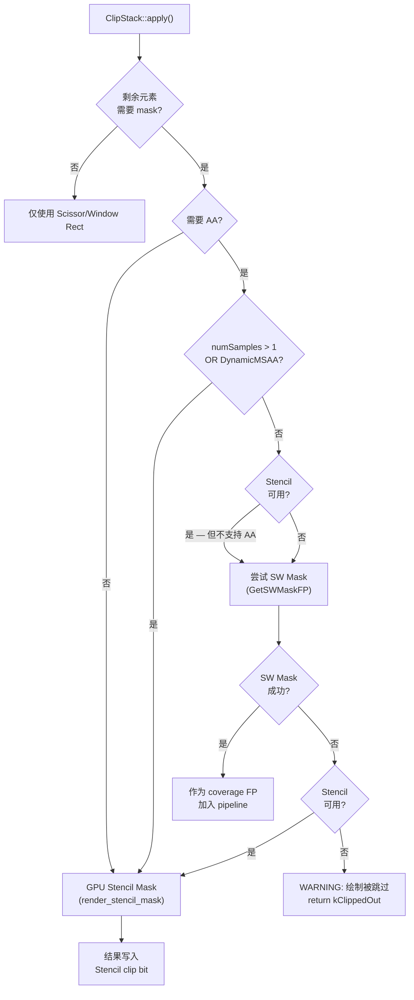

> **关键洞察**: SW mask 是一个"兜底"策略。在典型的 GPU 渲染管线中，绝大多数裁剪操作通过 Analytic FP 或 Stencil 完成，SW mask 只在特定硬件配置 (无 MSAA 的低端设备) 下才会被触发。
