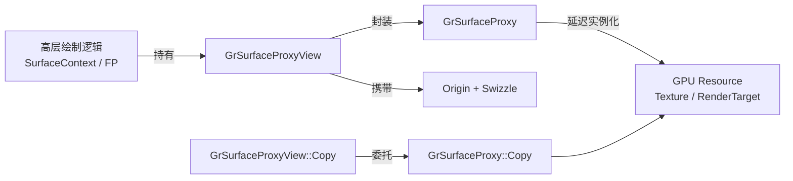
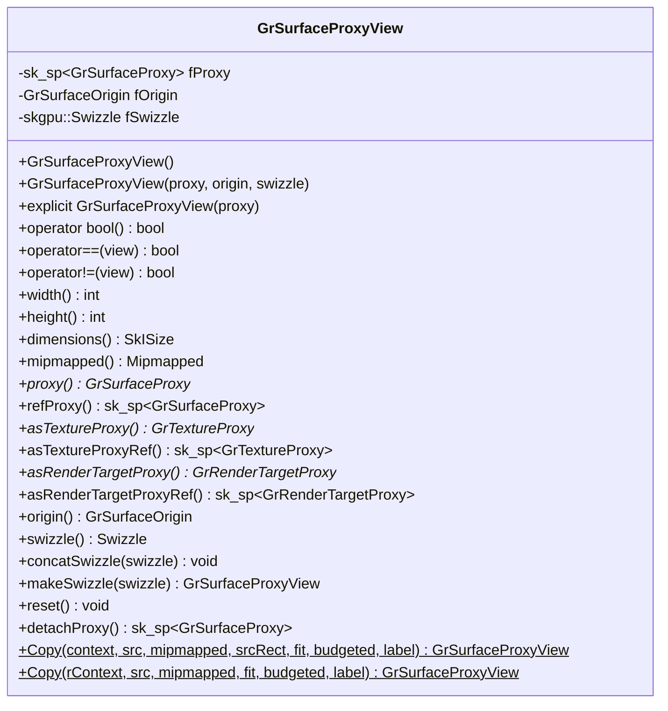
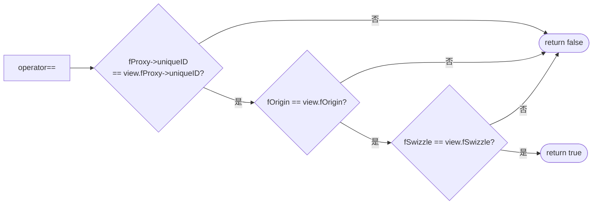
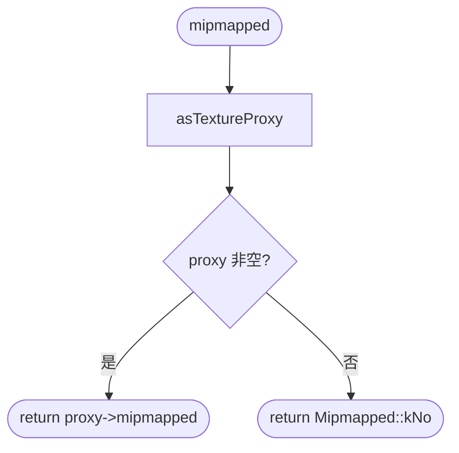
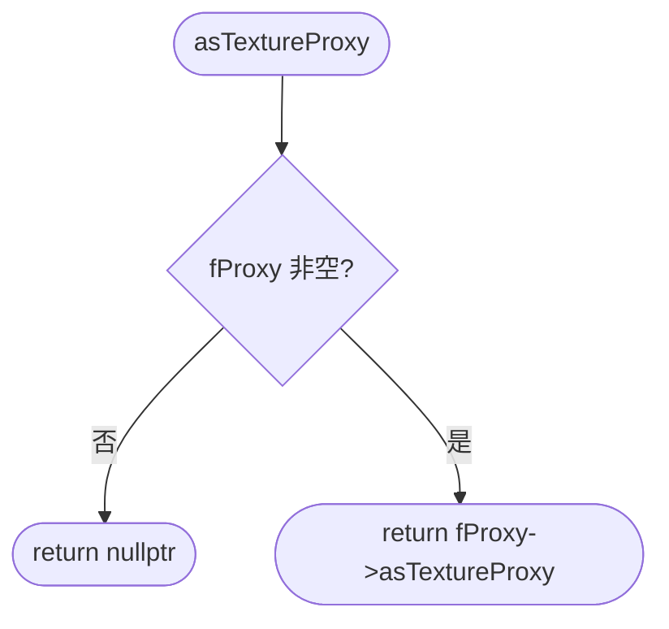
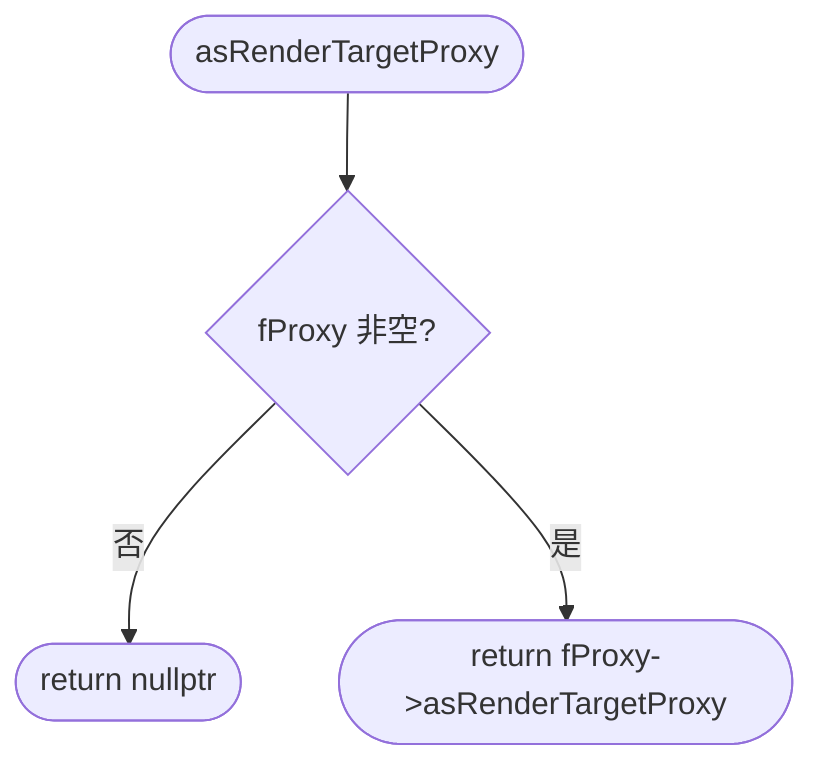
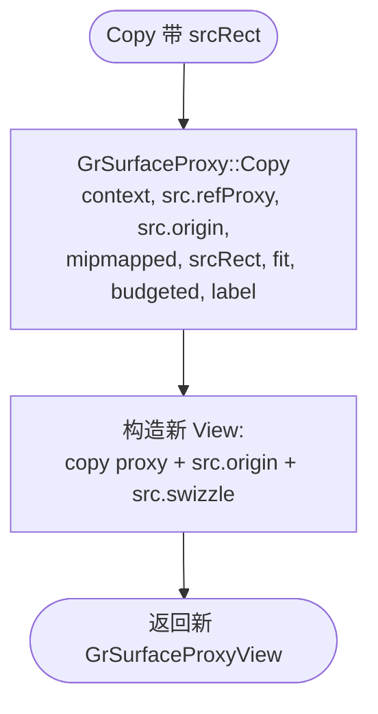
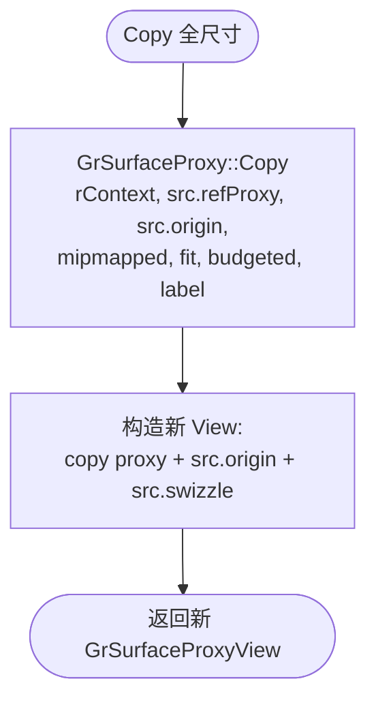

# GrSurfaceProxyView 函数实现参考

> 源码: `src/gpu/ganesh/GrSurfaceProxyView.cpp` (84行)
> 头文件: `src/gpu/ganesh/GrSurfaceProxyView.h` (115行)

---

## 类型速查

阅读后续函数流程图前，建议先熟悉以下类型。按职责分为 3 组。

### 1. 自身类型

| 类型 | 含义 |
|------|------|
| `GrSurfaceProxyView` | 封装 proxy + origin + swizzle 的轻量级视图值类型 |

### 2. 代理/资源

| 类型 | 含义 |
|------|------|
| `GrSurfaceProxy` | GPU surface 的延迟实例化代理基类 |
| `GrTextureProxy` | 纹理代理，`GrSurfaceProxy` 子类 |
| `GrRenderTargetProxy` | 渲染目标代理，`GrSurfaceProxy` 子类 |
| `GrRecordingContext` | GPU 录制上下文，用于资源创建和拷贝操作 |
| `sk_sp<T>` | Skia 引用计数智能指针 |

### 3. 视图属性

| 类型 | 含义 |
|------|------|
| `GrSurfaceOrigin` | 纹理原点方向枚举 (`kTopLeft_GrSurfaceOrigin` / `kBottomLeft_GrSurfaceOrigin`) |
| `skgpu::Swizzle` | 颜色通道重排 (如 RGBA → BGRA)，支持 `Concat` 组合 |
| `skgpu::Mipmapped` | 是否具有 mipmap (`kYes` / `kNo`) |
| `skgpu::Budgeted` | 是否纳入 GPU 内存预算 (`kYes` / `kNo`) |
| `SkBackingFit` | 纹理分配策略 (`kExact` / `kApprox`) |
| `SkIRect` | 整数矩形，用于指定拷贝源区域 |
| `SkISize` | 整数尺寸 (width × height) |

---

## GrSurfaceProxyView 在 Skia 工程中的架构位置

| 属性 | 说明 |
|------|------|
| **归属** | `src/gpu/ganesh/` 资源管理层 |
| **设计** | 轻量值类型，将 surface proxy 与访问方式 (origin + swizzle) 组合为统一视图描述符 |
| **上游** | `SurfaceContext`、`SurfaceFillContext`、`GrFragmentProcessor`、`GrOpsTask` 等高层绘制组件 |
| **下游** | `GrSurfaceProxy` → `GrTextureProxy` / `GrRenderTargetProxy` → 底层 GPU 资源 |



---

## 架构总览



---

## 1. 构造与运算符

### 1.1 默认构造 / 三参构造 / 单参显式构造 (header line 36-43)

头文件中的 inline 构造函数:

| 构造形式 | 行号 | 语义 |
|----------|------|------|
| `GrSurfaceProxyView()` | header line 36 | 默认构造，proxy 为空 |
| `GrSurfaceProxyView(proxy, origin, swizzle)` | header line 38-39 | 完整指定三个字段 |
| `explicit GrSurfaceProxyView(proxy)` | header line 42-43 | 仅指定 proxy，origin 默认 `kTopLeft`，swizzle 默认 |
| 移动构造 / 拷贝构造 | header line 45-46 | `= default` |

---

### 1.2 `operator bool()` (header line 48)

```cpp
explicit operator bool() const { return SkToBool(fProxy.get()); }
```

检查视图是否有效 — proxy 非空即为 true。

---

### 1.3 `operator==()` (line 15-18)



比较 proxy 的 `uniqueID`（非指针地址） + origin + swizzle 三者全部一致才相等。

---

### 1.4 `operator!=()` (header line 54)

```cpp
bool operator!=(const GrSurfaceProxyView& other) const { return !(*this == other); }
```

取反 `operator==` 结果。

---

## 2. 属性查询

### 2.1 `width()` / `height()` / `dimensions()` (header line 56-58)

```cpp
int width() const { return this->proxy()->width(); }
int height() const { return this->proxy()->height(); }
SkISize dimensions() const { return this->proxy()->dimensions(); }
```

直接转发到 `fProxy` 对应方法，inline 无开销。

---

### 2.2 `mipmapped()` (line 20-25)



逻辑: 尝试转为 `GrTextureProxy`，成功则返回其 mipmap 状态；否则返回 `kNo`（RenderTarget 无 mipmap）。

---

### 2.3 `proxy()` / `refProxy()` (header line 62-63)

| 方法 | 返回类型 | 语义 |
|------|----------|------|
| `proxy()` | `GrSurfaceProxy*` | 裸指针访问，不增加引用计数 |
| `refProxy()` | `sk_sp<GrSurfaceProxy>` | 增加引用计数的共享指针 |

---

### 2.4 `asTextureProxy()` / `asTextureProxyRef()` (line 27-36)



`asTextureProxyRef()` (line 34-36) 在 `asTextureProxy()` 结果上包装 `sk_ref_sp<GrTextureProxy>`。

---

### 2.5 `asRenderTargetProxy()` / `asRenderTargetProxyRef()` (line 38-47)



`asRenderTargetProxyRef()` (line 45-47) 在 `asRenderTargetProxy()` 结果上包装 `sk_ref_sp<GrRenderTargetProxy>`。

---

### 2.6 `origin()` / `swizzle()` (header line 71-72)

```cpp
GrSurfaceOrigin origin() const { return fOrigin; }
skgpu::Swizzle swizzle() const { return fSwizzle; }
```

直接返回字段值，inline 访问器。

---

## 3. Swizzle 操作

### 3.1 `concatSwizzle()` (line 49-51)

```cpp
void GrSurfaceProxyView::concatSwizzle(skgpu::Swizzle swizzle) {
    fSwizzle = skgpu::Swizzle::Concat(fSwizzle, swizzle);
}
```

原地修改: 将新 swizzle 追加到现有 swizzle 末尾（组合语义）。

---

### 3.2 `makeSwizzle() const&` (line 53-55)

```cpp
GrSurfaceProxyView GrSurfaceProxyView::makeSwizzle(skgpu::Swizzle swizzle) const& {
    return {fProxy, fOrigin, skgpu::Swizzle::Concat(fSwizzle, swizzle)};
}
```

左值版本: 拷贝 `fProxy`（引用计数+1），返回带新 swizzle 的新视图。

---

### 3.3 `makeSwizzle() &&` (line 57-59)

```cpp
GrSurfaceProxyView GrSurfaceProxyView::makeSwizzle(skgpu::Swizzle swizzle) && {
    return {std::move(fProxy), fOrigin, skgpu::Swizzle::Concat(fSwizzle, swizzle)};
}
```

右值版本: 移动 `fProxy`（零拷贝），返回带新 swizzle 的新视图。原对象 proxy 变为空。

---

## 4. 静态 Copy 工厂方法

### 4.1 `Copy(context, src, mipmapped, srcRect, fit, budgeted, label)` (line 63-73)



复制源 proxy 的指定矩形区域，新视图继承原始 origin 和 swizzle。

---

### 4.2 `Copy(rContext, src, mipmapped, fit, budgeted, label)` (line 75-84)



复制源 proxy 的全部内容（无 srcRect 参数），其余逻辑与 4.1 相同。

**共享模式**: 两个 Copy 重载都委托 `GrSurfaceProxy::Copy` 完成实际拷贝，并保持视图属性 (origin + swizzle) 不变。

---

## 5. 其他方法

### 5.1 `reset()` (line 61)

```cpp
void GrSurfaceProxyView::reset() { *this = {}; }
```

通过赋值默认构造对象来重置: proxy 置空、origin 恢复 `kTopLeft`、swizzle 恢复默认。

---

### 5.2 `detachProxy()` (header line 101)

```cpp
sk_sp<GrSurfaceProxy> detachProxy() { return std::move(fProxy); }
```

转移 proxy 所有权。调用后视图的 proxy 为空，但 origin 和 swizzle 仍可查询。

---

## 附录 A: GrSurfaceOrigin 对坐标系的影响

`GrSurfaceOrigin` 决定了纹理坐标 Y 轴的方向:

```text
kTopLeft_GrSurfaceOrigin          kBottomLeft_GrSurfaceOrigin
┌──────────────────┐              ┌──────────────────┐
│ (0,0)            │              │                  │
│   ┌─────┐        │              │   ┌─────┐        │
│   │ img │        │              │   │ img │        │
│   └─────┘        │              │   └─────┘        │
│            (w,h) │              │ (0,0)            │
└──────────────────┘              └──────────────────┘
    Y↓ (顶左原点)                      Y↑ (底左原点, OpenGL 默认)
```

| 场景 | 典型 Origin |
|------|------------|
| Skia 图片/CPU surface | `kTopLeft` |
| OpenGL FBO / RenderTarget | `kBottomLeft` |
| Vulkan / Metal / D3D | `kTopLeft` |

`GrSurfaceProxyView` 携带 origin 信息使得采样器和渲染管线能正确处理 Y 翻转，无需创建 surface 副本。

---

## 附录 B: Swizzle 组合示例 (Concat 语义)

`skgpu::Swizzle::Concat(a, b)` 的语义是 "先应用 a，再应用 b"，即 `result[i] = a[b[i]]`:

```text
示例 1: Concat("bgra", "rgba") = "bgra"
  b = rgba (恒等) → 结果就是 a 本身

示例 2: Concat("rgba", "bgra") = "bgra"
  b = bgra → result[0]=a[2]=b, result[1]=a[1]=g, result[2]=a[0]=r, result[3]=a[3]=a

示例 3: Concat("bgra", "bgra") = "rgba"
  b = bgra → result[0]=a[2]=r, result[1]=a[1]=g, result[2]=a[0]=b, result[3]=a[3]=a
  (两次 bgra 互为逆操作)
```

**使用场景**:
- 图片加载时检测格式为 BGRA → 初始 swizzle 设为 "bgra"
- 后续 shader 要求通道重排 → `concatSwizzle` 追加新映射
- 最终 GPU 采样时一次性应用组合后的 swizzle
