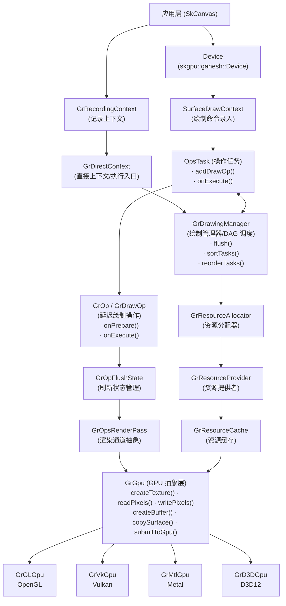

# Ganesh - Skia GPU 渲染后端核心

## 目录

- [概述](#概述)
- [架构图](#架构图)
- [文件分类索引](#文件分类索引)
  - [1. 核心上下文与记录 — Context/Recording 层](#1-核心上下文与记录--contextrecording-层)
  - [2. GPU 与硬件抽象 — GPU/Caps/Backend 层](#2-gpu-与硬件抽象--gpucapsbackend-层)
  - [3. Surface 与 RenderTarget — 表面/纹理/代理体系](#3-surface-与-rendertarget--表面纹理代理体系)
  - [4. 资源管理与缓存 — Resource/Cache/Provider 层](#4-资源管理与缓存--resourcecacheprovider-层)
  - [5. 缓冲区与顶点数据 — Buffer/Mesh/Vertex 层](#5-缓冲区与顶点数据--buffermeshvertex-层)
  - [6. 渲染任务与执行 — RenderTask/DrawingManager 层](#6-渲染任务与执行--rendertaskdrawingmanager-层)
  - [7. 着色器与处理器 — Processor/Shader 层](#7-着色器与处理器--processorshader-层)
  - [8. 管线与绘制状态 — Pipeline/State 层](#8-管线与绘制状态--pipelinestate-层)
  - [9. 裁剪与遮罩 — Clip/Mask 层](#9-裁剪与遮罩--clipmask-层)
  - [10. 路径渲染 — PathRenderer 层](#10-路径渲染--pathrenderer-层)
  - [11. 图集与文本 — Atlas 层](#11-图集与文本--atlas-层)
  - [12. 图像生成器与纹理加载 — ImageGenerator/Texture 层](#12-图像生成器与纹理加载--imagegeneratortexture-层)
  - [13. 像素与颜色 — Pixel/Color 层](#13-像素与颜色--pixelcolor-层)
  - [14. 效果工具 — Effect Utilities](#14-效果工具--effect-utilities)
  - [15. 延迟显示列表 (DDL) — Deferred Display List](#15-延迟显示列表-ddl--deferred-display-list)
  - [16. 内存管理 — Memory Management](#16-内存管理--memory-management)
  - [17. 绘制工具 — Drawing Utilities](#17-绘制工具--drawing-utilities)
  - [18. SPIR-V 支持 — SPIR-V Uniform/Varying](#18-spir-v-支持--spir-v-uniformvarying)
  - [19. 测试与调试 — Test/Debug/Utilities](#19-测试与调试--testdebugutilities)
- [关键类与函数](#关键类与函数)
  - [1. 上下文层 (Context Layer)](#1-上下文层-context-layer)
  - [2. GPU 抽象层 (GPU Abstraction Layer)](#2-gpu-抽象层-gpu-abstraction-layer)
  - [3. 绘制管理与调度 (Drawing Management)](#3-绘制管理与调度-drawing-management)
  - [4. 操作体系 (Op System)](#4-操作体系-op-system)
  - [5. 资源管理 (Resource Management)](#5-资源管理-resource-management)
  - [6. 代理体系 (Proxy System)](#6-代理体系-proxy-system)
  - [7. 处理器体系 (Processor System)](#7-处理器体系-processor-system)
  - [8. 表面上下文 (Surface Context)](#8-表面上下文-surface-context)
- [依赖关系](#依赖关系)
  - [上游依赖（被本模块使用的模块）](#上游依赖被本模块使用的模块)
  - [下游依赖（使用本模块的模块）](#下游依赖使用本模块的模块)
  - [外部依赖](#外部依赖)
- [设计模式分析](#设计模式分析)
  - [1. 代理模式 (Proxy Pattern)](#1-代理模式-proxy-pattern)
  - [2. 命令模式 (Command Pattern)](#2-命令模式-command-pattern)
  - [3. 策略模式 (Strategy Pattern)](#3-策略模式-strategy-pattern)
  - [4. 模板方法模式 (Template Method / NVI)](#4-模板方法模式-template-method--nvi)
  - [5. 观察者模式 (Observer Pattern)](#5-观察者模式-observer-pattern)
  - [6. 工厂模式 (Factory Pattern)](#6-工厂模式-factory-pattern)
- [数据流](#数据流)
  - [绘制命令的完整生命周期](#绘制命令的完整生命周期)
  - [资源分配流程](#资源分配流程)
- [平台特定说明](#平台特定说明)
  - [OpenGL / OpenGL ES (`gl/`)](#opengl--opengl-es-gl)
  - [Vulkan (`vk/`)](#vulkan-vk)
  - [Metal (`mtl/`)](#metal-mtl)
  - [Direct3D 12 (`d3d/`)](#direct3d-12-d3d)
  - [Mock (`mock/`)](#mock-mock)
- [相关文档与参考](#相关文档与参考)
  - [内部文档](#内部文档)
  - [关键设计概念](#关键设计概念)
  - [与 Graphite 的关系](#与-graphite-的关系)
  - [参考链接](#参考链接)
- [SkPaint SkSL Shader → Vulkan Pipeline State 完整流程分析](#skpaint-sksl-shader--vulkan-pipeline-state-完整流程分析)
  - [总览](#总览)
  - [阶段 1: SkPaint → GrPaint（Shader 转为 Fragment Processor）](#阶段-1-skpaint--grpaintshader-转为-fragment-processor)
  - [阶段 2: GrPaint → GrPipeline → GrProgramInfo](#阶段-2-grpaint--grpipeline--grprograminfo)
  - [阶段 3: SkSL 代码生成（Processor → SkSL 文本）](#阶段-3-sksl-代码生成processor--sksl-文本)
  - [阶段 4: SkSL → SPIR-V 编译](#阶段-4-sksl--spir-v-编译)
  - [阶段 5: 组装并创建 VkPipeline](#阶段-5-组装并创建-vkpipeline)
  - [阶段 6: 绘制时的绑定](#阶段-6-绘制时的绑定)
  - [缓存机制](#缓存机制)
  - [关键文件索引](#关键文件索引)
- [GrProcessor 派生类型完整列表](#grprocessor-派生类型完整列表)
  - [GrGeometryProcessor](#grgeometryprocessor)
  - [GrXferProcessor](#grxferprocessor)
  - [GrFragmentProcessor](#grfragmentprocessor)

## 概述

Ganesh 是 Skia 图形库中历史最悠久、功能最完善的 GPU 渲染后端。该目录 (`src/gpu/ganesh`) 包含约 263 个文件，构成了 Skia GPU 加速渲染的核心实现。Ganesh 的名字来源于印度教中消除障碍之神，寓意着它为 Skia 提供了跨越 CPU 与 GPU 之间鸿沟的桥梁。

Ganesh 采用延迟渲染 (deferred rendering) 架构，将绘制命令记录为操作 (GrOp) 并组织成有向无环图 (DAG)，在刷新 (flush) 时统一提交到底层图形 API 执行。这种设计允许系统在提交前对操作进行重排序、合并和优化，从而最大限度地减少 GPU 状态切换和 draw call 次数。

Ganesh 支持多种图形 API 后端，包括 OpenGL/OpenGL ES (`gl/`)、Vulkan (`vk/`)、Metal (`mtl/`)、Direct3D 12 (`d3d/`) 以及用于测试的 Mock 后端 (`mock/`)。每个后端通过继承核心抽象类（如 `GrGpu`、`GrCaps`、`GrOpsRenderPass`）来提供特定于平台的实现。

资源管理是 Ganesh 的另一个核心职责。它通过 `GrResourceCache` 实现了一套完善的 GPU 资源缓存和回收机制，支持 scratch key（临时键）和 unique key（唯一键）两种缓存策略。代理模式 (Proxy Pattern) 的广泛使用（`GrSurfaceProxy` 及其子类）使得资源可以延迟分配，直到真正需要时才实例化底层 GPU 资源。

Ganesh 的着色器处理流水线由 `GrProcessor` 体系（包括 `GrFragmentProcessor`、`GrGeometryProcessor`、`GrXferProcessor`）和 GLSL 代码生成器 (`glsl/`) 共同完成。它能够根据绘制状态动态生成、编译和缓存着色器程序，并通过 `GrPipeline` 和 `GrProgramInfo` 来封装完整的渲染管线状态。

## 架构图



## 文件分类索引

> 本节列出 `src/gpu/ganesh/` 根目录下的所有源文件（不含子目录），按功能分类。子目录文件请参见各子目录的 README。

### 1. 核心上下文与记录 — Context/Recording 层

| 文件 | 说明 |
|------|------|
| Device.h / Device.cpp / Device_drawTexture.cpp | Ganesh GPU 设备抽象，SkCanvas 到 GPU 的桥接 |
| GrDirectContext.cpp / GrDirectContextPriv.h / GrDirectContextPriv.cpp | 直接上下文核心实现，管理 GPU 资源生命周期 |
| GrRecordingContext.cpp / GrRecordingContextPriv.h / GrRecordingContextPriv.cpp | 记录上下文，支持非 GPU 线程录制绘制命令 |
| GrContext_Base.cpp / GrBaseContextPriv.h | 上下文基类，提供通用上下文功能 |
| GrImageContext.cpp / GrImageContextPriv.h | 图像上下文，用于跨线程图像访问 |
| GrContextThreadSafeProxy.cpp / GrContextThreadSafeProxyPriv.h | 线程安全代理，允许在非 GPU 线程查询上下文信息 |
| GrDDLContext.cpp | 延迟显示列表上下文 |
| SkGaneshRecorder.h | Ganesh 录制器接口 |

### 2. GPU 与硬件抽象 — GPU/Caps/Backend 层

| 文件 | 说明 |
|------|------|
| GrGpu.h / GrGpu.cpp | GPU 硬件抽象基类，定义所有底层图形 API 交互接口 |
| GrCaps.h / GrCaps.cpp | GPU 能力查询，检测硬件特性与限制 |
| GrShaderCaps.h / GrShaderCaps.cpp | 着色器能力查询 |
| GrBackendSurface.cpp / GrBackendSurfacePriv.h | 后端 Surface 封装（纹理/渲染目标的跨后端表示） |
| GrBackendSemaphore.cpp / GrBackendSemaphorePriv.h | 后端信号量，用于 GPU 同步 |
| GrBackendUtils.h / GrBackendUtils.cpp | 后端工具函数 |
| GrDriverBugWorkarounds.cpp | GPU 驱动 bug 的变通处理 |
| GrSemaphore.h | GPU 信号量抽象接口 |
| GrAutoLocaleSetter.h | 本地化设置辅助（用于着色器编译） |

### 3. Surface 与 RenderTarget — 表面/纹理/代理体系

| 文件 | 说明 |
|------|------|
| GrSurface.h / GrSurface.cpp | GPU Surface 基类 |
| GrRenderTarget.h / GrRenderTarget.cpp | 渲染目标 |
| GrTexture.h / GrTexture.cpp | GPU 纹理 |
| GrAttachment.h / GrAttachment.cpp | 渲染附件（深度/模板缓冲） |
| GrSurfaceProxy.h / GrSurfaceProxy.cpp / GrSurfaceProxyPriv.h | Surface 代理基类，延迟资源分配 |
| GrTextureProxy.h / GrTextureProxy.cpp / GrTextureProxyPriv.h / GrTextureProxyCacheAccess.h | 纹理代理 |
| GrRenderTargetProxy.h / GrRenderTargetProxy.cpp | 渲染目标代理 |
| GrTextureRenderTargetProxy.h / GrTextureRenderTargetProxy.cpp | 纹理+渲染目标复合代理 |
| GrSurfaceProxyView.h / GrSurfaceProxyView.cpp | 代理视图，包含 origin/swizzle 信息 |
| GrDstProxyView.h | 目标代理视图（用于混合时读取目标） |
| SurfaceContext.h / SurfaceContext.cpp | Surface 上下文基类 |
| SurfaceDrawContext.h / SurfaceDrawContext.cpp | Surface 绘制上下文，高级绘制命令录入 |
| SurfaceFillContext.h / SurfaceFillContext.cpp | Surface 填充上下文 |

### 4. 资源管理与缓存 — Resource/Cache/Provider 层

| 文件 | 说明 |
|------|------|
| GrGpuResource.h / GrGpuResource.cpp / GrGpuResourcePriv.h / GrGpuResourceCacheAccess.h | GPU 资源基类与缓存访问 |
| GrResourceCache.h / GrResourceCache.cpp | GPU 资源缓存，LRU 淘汰策略 |
| GrResourceProvider.h / GrResourceProvider.cpp / GrResourceProviderPriv.h | GPU 资源工厂，创建或从缓存查找资源 |
| GrProxyProvider.h / GrProxyProvider.cpp | 代理对象工厂 |
| GrResourceAllocator.h / GrResourceAllocator.cpp | 刷新时资源分配器，寄存器分配算法 |
| GrManagedResource.h / GrManagedResource.cpp | 后端管理资源基类 |
| GrThreadSafeCache.h / GrThreadSafeCache.cpp | 线程安全资源缓存 |
| GrThreadSafePipelineBuilder.h / GrThreadSafePipelineBuilder.cpp | 线程安全管线构建器 |
| GrClientMappedBufferManager.h / GrClientMappedBufferManager.cpp | 客户端映射缓冲区管理器 |
| GrHashMapWithCache.h | 带缓存的哈希映射 |
| GrResourceHandle.h | 类型安全的资源句柄模板 |

### 5. 缓冲区与顶点数据 — Buffer/Mesh/Vertex 层

| 文件 | 说明 |
|------|------|
| GrBuffer.h | GPU 缓冲区抽象接口 |
| GrGpuBuffer.h / GrGpuBuffer.cpp | GPU 缓冲区实现 |
| GrCpuBuffer.h | CPU 端缓冲区 |
| GrBufferAllocPool.h / GrBufferAllocPool.cpp | 缓冲区分配池 |
| GrRingBuffer.h / GrRingBuffer.cpp | 环形缓冲区 |
| GrStagingBufferManager.h / GrStagingBufferManager.cpp | 暂存缓冲区管理 |
| GrMeshBuffers.h / GrMeshBuffers.cpp | 网格缓冲区辅助 |
| GrMeshDrawTarget.h / GrMeshDrawTarget.cpp | 网格绘制目标接口 |
| GrVertexChunkArray.h / GrVertexChunkArray.cpp | 顶点数据块数组 |
| GrEagerVertexAllocator.h / GrEagerVertexAllocator.cpp | 即时顶点分配器 |
| GrSimpleMesh.h | 简单网格数据结构 |
| GrDrawIndirectCommand.h | 间接绘制命令结构体（DrawIndirect / DrawIndexedIndirect） |

### 6. 渲染任务与执行 — RenderTask/DrawingManager 层

| 文件 | 说明 |
|------|------|
| GrDrawingManager.h / GrDrawingManager.cpp | 绘制管理器，DAG 调度核心 |
| GrRenderTask.h / GrRenderTask.cpp | 渲染任务基类 |
| GrCopyRenderTask.h / GrCopyRenderTask.cpp | 拷贝渲染任务 |
| GrBufferTransferRenderTask.h / GrBufferTransferRenderTask.cpp | 缓冲区传输任务 |
| GrBufferUpdateRenderTask.h / GrBufferUpdateRenderTask.cpp | 缓冲区更新任务 |
| GrTextureResolveRenderTask.h / GrTextureResolveRenderTask.cpp | 纹理解析任务（MSAA/MipMap） |
| GrTransferFromRenderTask.h / GrTransferFromRenderTask.cpp | 从 GPU 传输数据任务 |
| GrWritePixelsRenderTask.h / GrWritePixelsRenderTask.cpp | 像素写入任务 |
| GrWaitRenderTask.h / GrWaitRenderTask.cpp | 等待信号量任务 |
| GrDDLTask.h / GrDDLTask.cpp | 延迟显示列表任务 |
| GrRenderTaskCluster.h / GrRenderTaskCluster.cpp | 渲染任务聚类/重排 |
| GrTTopoSort.h | 模板拓扑排序工具，用于渲染任务 DAG 调度 |
| GrOpsRenderPass.h / GrOpsRenderPass.cpp | 渲染通道抽象 |
| GrOnFlushResourceProvider.h / GrOnFlushResourceProvider.cpp | 刷新时资源提供者 |

### 7. 着色器与处理器 — Processor/Shader 层

| 文件 | 说明 |
|------|------|
| GrProcessor.h / GrProcessor.cpp | 处理器基类（ClassID、内存池管理） |
| GrFragmentProcessor.h / GrFragmentProcessor.cpp | 片段处理器基类 |
| GrFragmentProcessors.h / GrFragmentProcessors.cpp | 片段处理器工厂函数集合 |
| GrGeometryProcessor.h / GrGeometryProcessor.cpp | 几何处理器基类（顶点属性布局） |
| GrXferProcessor.h / GrXferProcessor.cpp | 混合传输处理器（源与目标颜色混合） |
| GrShaderVar.h / GrShaderVar.cpp | 着色器变量声明 |
| GrProgramDesc.h / GrProgramDesc.cpp | 程序描述符（着色器缓存 key） |
| GrProgramInfo.h / GrProgramInfo.cpp | 程序信息（Pipeline+GP+渲染状态打包） |
| GrUniformDataManager.h / GrUniformDataManager.cpp | Uniform 数据管理 |
| GrProcessorAnalysis.h / GrProcessorAnalysis.cpp | 处理器组合分析 |
| GrProcessorSet.h / GrProcessorSet.cpp | 处理器集合（从 GrPaint 接管） |
| GrDefaultGeoProcFactory.h / GrDefaultGeoProcFactory.cpp | 默认几何处理器工厂 |
| GrFPArgs.h | 片段处理器构建参数 |

### 8. 管线与绘制状态 — Pipeline/State 层

| 文件 | 说明 |
|------|------|
| GrPipeline.h / GrPipeline.cpp | 不可变渲染管线对象 |
| GrPaint.h / GrPaint.cpp | GPU 绘制参数（FP 链 + XP 工厂） |
| GrOpsTypes.h | 操作类型定义 |
| GrOpFlushState.h / GrOpFlushState.cpp | 操作刷新状态管理 |
| GrSamplerState.h | 纹理采样状态（过滤/寻址模式） |
| GrScissorState.h | 裁剪矩形状态 |
| GrWindowRectsState.h | 窗口矩形状态 |
| GrWindowRectangles.h | 窗口矩形集合 |
| GrStencilSettings.h / GrStencilSettings.cpp | 模板测试设置 |
| GrUserStencilSettings.h | 用户自定义模板设置 |

### 9. 裁剪与遮罩 — Clip/Mask 层

| 文件 | 说明 |
|------|------|
| ClipStack.h / ClipStack.cpp | 裁剪栈实现 |
| GrClip.h | 裁剪接口基类 |
| GrAppliedClip.h | 已应用的裁剪状态 |
| GrFixedClip.h / GrFixedClip.cpp | 固定裁剪（裁剪矩形+窗口矩形） |
| StencilClip.h | 模板裁剪 |
| StencilMaskHelper.h / StencilMaskHelper.cpp | 模板遮罩辅助 |
| GrSWMaskHelper.h / GrSWMaskHelper.cpp | 软件遮罩辅助 |

### 10. 路径渲染 — PathRenderer 层

| 文件 | 说明 |
|------|------|
| PathRenderer.h / PathRenderer.cpp | 路径渲染器基类 |
| PathRendererChain.h / PathRendererChain.cpp | 路径渲染器链，选择最优渲染策略 |

### 11. 图集与文本 — Atlas 层

| 文件 | 说明 |
|------|------|
| GrAtlasTypes.h / GrAtlasTypes.cpp | 图集类型定义 |
| GrDrawOpAtlas.h / GrDrawOpAtlas.cpp | 绘制操作图集管理 |
| GrDynamicAtlas.h / GrDynamicAtlas.cpp | 动态图集 |
| GrDistanceFieldGenFromVector.h / GrDistanceFieldGenFromVector.cpp | 从矢量路径生成距离场 |

### 12. 图像生成器与纹理加载 — ImageGenerator/Texture 层

| 文件 | 说明 |
|------|------|
| GrAHardwareBufferImageGenerator.h / GrAHardwareBufferImageGenerator.cpp | Android HardwareBuffer 图像生成器 |
| GrAHardwareBufferUtils.cpp | Android HardwareBuffer 工具函数 |
| GrBackendTextureImageGenerator.h / GrBackendTextureImageGenerator.cpp | 后端纹理图像生成器 |
| GrPromiseImageTexture.cpp | Promise 图像纹理 |
| GrYUVABackendTextures.cpp | YUVA 后端纹理 |
| GrYUVATextureProxies.h / GrYUVATextureProxies.cpp | YUVA 纹理代理 |

### 13. 像素与颜色 — Pixel/Color 层

| 文件 | 说明 |
|------|------|
| GrPixmap.h | GPU 像素映射 |
| GrImageInfo.h / GrImageInfo.cpp | 图像信息（尺寸、颜色类型、alpha 类型） |
| GrColorInfo.h / GrColorInfo.cpp | 颜色信息（颜色类型+颜色空间） |
| GrColorSpaceXform.h / GrColorSpaceXform.cpp | 颜色空间转换 |
| GrColor.h | 颜色类型定义 |
| GrDataUtils.h / GrDataUtils.cpp | 像素数据工具（压缩格式、颜色转换） |
| GrSurfaceCharacterization.cpp | Surface 特征描述 |

### 14. 效果工具 — Effect Utilities

| 文件 | 说明 |
|------|------|
| GrBlurUtils.h / GrBlurUtils.cpp | 模糊效果工具 |
| GrStyle.h / GrStyle.cpp | 绘制样式（描边/填充参数） |

### 15. 延迟显示列表 (DDL) — Deferred Display List

| 文件 | 说明 |
|------|------|
| GrDeferredDisplayList.cpp / GrDeferredDisplayListPriv.h | 延迟显示列表 |
| GrDeferredDisplayListRecorder.cpp | 延迟显示列表录制器 |
| GrDeferredUpload.h | 延迟上传接口 |
| GrDeferredProxyUploader.h | 延迟代理上传器 |

### 16. 内存管理 — Memory Management

| 文件 | 说明 |
|------|------|
| GrMemoryPool.h / GrMemoryPool.cpp | 内存池（处理器内存分配） |
| GrNonAtomicRef.h | 非原子引用计数模板 |

### 17. 绘制工具 — Drawing Utilities

| 文件 | 说明 |
|------|------|
| GrCanvas.h / GrCanvas.cpp | Ganesh Canvas 辅助 |
| SkGr.h / SkGr.cpp | SkPaint 到 GrPaint 转换工具 |

### 18. SPIR-V 支持 — SPIR-V Uniform/Varying

| 文件 | 说明 |
|------|------|
| GrSPIRVUniformHandler.h / GrSPIRVUniformHandler.cpp | SPIR-V Uniform 处理器 |
| GrSPIRVVaryingHandler.h / GrSPIRVVaryingHandler.cpp | SPIR-V Varying 处理器 |

### 19. 测试与调试 — Test/Debug/Utilities

| 文件 | 说明 |
|------|------|
| GrDrawOpTest.h / GrDrawOpTest.cpp | 绘制操作测试工具 |
| GrProcessorUnitTest.h / GrProcessorUnitTest.cpp | 处理器单元测试框架 |
| GrTestUtils.h / GrTestUtils.cpp | 测试工具函数 |
| TestFormatColorTypeCombination.h | 测试用格式/颜色类型组合 |
| GrAuditTrail.h / GrAuditTrail.cpp | 审计跟踪（调试用操作记录） |
| GrTracing.h | GPU 追踪宏 |
| GrUtil.h / GrUtil.cpp | 通用工具函数 |
| GrNativeRect.h | 原生矩形类型转换 |
| GrTextureResolveManager.h | 纹理解析管理器 |
| GrPersistentCacheUtils.h / GrPersistentCacheUtils.cpp | 持久缓存工具 |
| GrDrawIndirectCommand.h | 间接绘制命令结构 |
| GrTTopoSort.h | 拓扑排序模板 |

## 关键类与函数

### 1. 上下文层 (Context Layer)

#### GrDirectContext (`GrDirectContext.cpp`)
- **职责**: Ganesh 的主要入口点，代表一个与 GPU 直接关联的上下文。管理 GPU 资源的生命周期、执行绘制命令的刷新和提交。
- **关键方法**:
  - 构造/析构: 初始化 `GrGpu`、`GrResourceCache`、`GrDrawingManager` 等核心子系统
  - `flushAndSubmit()`: 刷新所有待执行的绘制操作并提交到 GPU
  - `resetGLTextureBindings()`: 重置 GL 纹理绑定状态
  - `threadSafeProxy()`: 获取线程安全代理
- **继承关系**: `GrDirectContext` -> `GrRecordingContext` -> `GrContext_Base`

#### GrRecordingContext (`GrRecordingContext.cpp`)
- **职责**: 记录上下文，支持在非 GPU 线程上录制绘制命令。是 `GrDirectContext` 的基类。
- **关键方法**:
  - `priv().drawingManager()`: 获取绘制管理器
  - `priv().proxyProvider()`: 获取代理提供者

### 2. GPU 抽象层 (GPU Abstraction Layer)

#### GrGpu (`GrGpu.h`, `GrGpu.cpp`)
- **职责**: GPU 硬件抽象基类，定义了所有与底层图形 API 交互的接口。各后端（GL/Vulkan/Metal/D3D）继承此类。
- **关键方法**:
  - `createTexture()`: 创建 GPU 纹理资源
  - `createBuffer()`: 创建 GPU 缓冲区
  - `readPixels()` / `writePixels()`: 像素数据读写
  - `copySurface()`: 表面拷贝
  - `getOpsRenderPass()`: 获取渲染通道对象
  - `executeFlushInfo()`: 执行刷新操作（信号量、状态更新）
  - `submitToGpu()`: 向 GPU 提交命令
  - `wrapBackendTexture()`: 包装外部纹理
  - `resolveRenderTarget()`: 解析 MSAA 渲染目标
- **NVI 模式**: 公共方法调用 `on*` 虚函数（如 `onCreateTexture`），由子类实现具体逻辑

#### GrCaps (`GrCaps.h`, `GrCaps.cpp`)
- **职责**: 查询和表示 GPU 的硬件能力和特性。每个后端有自己的 Caps 子类。
- **关键能力查询**:
  - `maxTextureSize()` / `maxRenderTargetSize()`: 最大纹理/渲染目标尺寸
  - `isFormatTexturable()` / `isFormatRenderable()`: 格式支持查询
  - `mipmapSupport()` / `anisoSupport()`: MipMap 和各向异性过滤支持
  - `advancedBlendEquationSupport()`: 高级混合方程支持
  - `semaphoreSupport()`: 信号量支持
  - `shaderCaps()`: 获取着色器能力 (`GrShaderCaps`)
  - 众多驱动 workaround 标志（如 `avoidStencilBuffers`, `avoidReorderingRenderTasks`）

#### GrOpsRenderPass (`GrOpsRenderPass.h`, `GrOpsRenderPass.cpp`)
- **职责**: 抽象渲染通道。封装了一组针对同一渲染目标的命令（绘制、清除、丢弃）。
- **关键方法**:
  - `begin()` / `end()`: 渲染通道的开始与结束
  - `bindPipeline()`: 绑定管线状态
  - `setScissorRect()`: 设置裁剪矩形
  - `bindTextures()`: 绑定纹理
  - `draw()` / `drawIndexed()` / `drawInstanced()`: 各类绘制调用

### 3. 绘制管理与调度 (Drawing Management)

#### GrDrawingManager (`GrDrawingManager.h`, `GrDrawingManager.cpp`)
- **职责**: 管理绘制操作的 DAG（有向无环图），负责任务的创建、排序、重排和执行。是 Ganesh 渲染调度的核心。
- **关键方法**:
  - `newOpsTask()`: 创建新的操作任务
  - `flush()`: 刷新指定代理的待执行操作
  - `flushSurfaces()`: 刷新 Surface 上的所有操作
  - `sortTasks()`: 对 DAG 进行拓扑排序
  - `reorderTasks()`: 尝试重排任务以减少渲染通道切换
  - `executeRenderTasks()`: 执行所有渲染任务
  - `getPathRenderer()`: 获取适合的路径渲染器
  - `newCopyRenderTask()`: 创建拷贝渲染任务
  - `newWritePixelsTask()`: 创建像素写入任务
- **内部数据**: 维护 `fDAG`（任务列表）、`fActiveOpsTask`（当前活跃任务）、路径渲染器链

#### GrRenderTask (`GrRenderTask.h`, `GrRenderTask.cpp`)
- **职责**: 渲染任务基类，参与 DAG 调度。每个任务针对一个或多个 `GrSurfaceProxy`。
- **关键方法**:
  - `makeClosed()`: 关闭任务，不再接受新依赖
  - `prepare()` / `execute()`: 准备和执行任务
  - `addDependency()`: 添加依赖关系
  - `makeSkippable()`: 标记为可跳过
  - `gatherProxyIntervals()`: 收集代理使用区间（供资源分配器使用）
- **子类**: `OpsTask`、`GrCopyRenderTask`、`GrWritePixelsRenderTask`、`GrTransferFromRenderTask`、`GrDDLTask` 等

#### OpsTask (`ops/OpsTask.h`, `ops/OpsTask.cpp`)
- **职责**: 最核心的渲染任务子类，管理一组 GrOp 并在刷新时将它们提交到 `GrOpsRenderPass`。
- **关键方法**:
  - `addOp()` / `addDrawOp()`: 添加操作
  - `onPrepare()` / `onExecute()`: 准备几何数据并执行绘制
  - `discard()`: 丢弃内容
  - `resetForFullscreenClear()`: 全屏清除优化

### 4. 操作体系 (Op System)

#### GrOp (`ops/GrOp.h`, `ops/GrOp.cpp`)
- **职责**: 所有 Ganesh 延迟 GPU 操作的基类。支持操作合并 (merge) 和链接 (chain) 以减少 draw call。
- **关键方法**:
  - `combineIfPossible()`: 尝试合并两个操作
  - `onPrepareDraws()`: 准备绘制数据（子类实现）
  - `onExecute()`: 执行绘制（子类实现）
  - `bounds()`: 获取操作的设备空间边界

#### 关键 Op 子类:
| 类名 | 文件 | 职责 |
|------|------|------|
| `FillRectOp` | `ops/FillRectOp.h/cpp` | 矩形填充绘制 |
| `TextureOp` | `ops/TextureOp.h/cpp` | 纹理绘制（最常用的操作之一） |
| `AtlasTextOp` | `ops/AtlasTextOp.h/cpp` | 文本图集绘制 |
| `ClearOp` | `ops/ClearOp.h/cpp` | 渲染目标清除 |
| `FillRRectOp` | `ops/FillRRectOp.h/cpp` | 圆角矩形填充 |
| `DashOp` | `ops/DashOp.h/cpp` | 虚线绘制 |
| `DrawMeshOp` | `ops/DrawMeshOp.h/cpp` | SkMesh 自定义网格绘制 |
| `ShadowRRectOp` | `ops/ShadowRRectOp.h/cpp` | 阴影绘制 |

### 5. 资源管理 (Resource Management)

#### GrResourceCache (`GrResourceCache.h`, `GrResourceCache.cpp`)
- **职责**: 管理所有 `GrGpuResource` 实例的生命周期。支持 scratch key（临时资源复用）和 unique key（内容缓存）两种缓存键。
- **关键特性**:
  - 基于预算的自动清理机制
  - 线程安全的资源回收（通过 `GrClientMappedBufferManager`）
  - LRU 淘汰策略
  - 支持跨上下文的资源共享

#### GrResourceProvider (`GrResourceProvider.h`, `GrResourceProvider.cpp`)
- **职责**: GPU 资源的工厂类，负责创建或从缓存中查找具体的 GPU 资源。
- **关键方法**:
  - `findByUniqueKey<T>()`: 按唯一键查找资源
  - `createTexture()`: 创建纹理
  - `createBuffer()`: 创建缓冲区
  - `wrapBackendTexture()`: 包装外部后端纹理

#### GrProxyProvider (`GrProxyProvider.h`, `GrProxyProvider.cpp`)
- **职责**: 代理对象的工厂类，负责创建和管理 `GrSurfaceProxy` 实例。
- **关键方法**:
  - `assignUniqueKeyToProxy()`: 为代理分配唯一键
  - `findProxyByUniqueKey()`: 按唯一键查找代理
  - `createProxy()`: 创建各类代理

#### GrResourceAllocator (`GrResourceAllocator.h`, `GrResourceAllocator.cpp`)
- **职责**: 在刷新时为代理显式分配 GPU 资源。采用寄存器分配算法，通过分析代理的使用区间来最大化资源复用。
- **关键方法**:
  - `addInterval()`: 添加资源使用区间
  - `planAssignment()`: 规划资源分配
  - `assign()`: 执行实际分配
  - `makeBudgetHeadroom()`: 确保预算空间

### 6. 代理体系 (Proxy System)

#### GrSurfaceProxy (`GrSurfaceProxy.h`, `GrSurfaceProxy.cpp`)
- **职责**: GPU Surface 的延迟表示。允许在资源实际分配之前引用和操作 Surface。
- **关键特性**:
  - 支持延迟实例化 (lazy instantiation)
  - `ResolveFlags`: 控制 MSAA 解析和 MipMap 重新生成
  - `LazyInstantiationKeyMode`: 控制代理与底层资源的键同步方式

#### GrTextureProxy (`GrTextureProxy.h`)
- **职责**: 纹理代理，延迟表示一个 `GrTexture`。

#### GrRenderTargetProxy (`GrRenderTargetProxy.h`)
- **职责**: 渲染目标代理，延迟表示一个 `GrRenderTarget`。

#### GrTextureRenderTargetProxy (`GrTextureRenderTargetProxy.h`)
- **职责**: 同时作为纹理和渲染目标的代理（多重继承自上述两个代理类）。

### 7. 处理器体系 (Processor System)

Ganesh 的着色器处理流水线由三类处理器（GrFragmentProcessor、GrGeometryProcessor、GrXferProcessor）协同完成，它们共享 `GrProcessor` 基类，通过 `GrPipeline` 和 `GrProgramInfo` 组装为完整的渲染管线。

#### 7.1 GrProcessor 基类

**文件**: `src/gpu/ganesh/GrProcessor.h`（140 行）

`GrProcessor` 是所有处理器的抽象根类，定义了处理器体系的基础设施：

- **ClassID 枚举**: 包含 72 种处理器类型（如 `kBlendFragmentProcessor_ClassID`、`kPorterDuffXferProcessor_ClassID`、`kCircleGeometryProcessor_ClassID` 等），用于运行时类型识别和 GrProgramDesc 的 key 编码
- **内存管理**: 使用线程局部内存池（`"Dynamically allocated GrProcessors are managed by a per-thread memory pool"`），重载了 `operator new` 和 `operator delete`，支持 footer 大小的额外分配（`operator new(size_t object_size, size_t footer_size)`）
- **不可变性约束**: 处理器构造后不可修改，确保 pipeline 状态的确定性
- **纯虚接口**: `name()` 返回处理器名称，`classID()` 返回类型标识
- 禁止拷贝构造和赋值

#### 7.2 GrFragmentProcessor（片段处理器）

**文件**: `src/gpu/ganesh/GrFragmentProcessor.h`（681 行）

GrFragmentProcessor（FP）是最复杂的处理器类型，负责提供自定义片段着色器代码，处理颜色和覆盖率计算。

**子处理器树结构**:
- 通过 `registerChild(std::unique_ptr<GrFragmentProcessor>, SkSL::SampleUsage)` 注册子 FP，形成树状层次结构
- `cloneAndRegisterAllChildProcessors()` 从源 FP 克隆所有子处理器
- 子 FP 支持多种采样模式（passthrough、uniform matrix、explicit coords）

**优化标志**（`OptimizationFlags`）:
| 标志 | 值 | 含义 |
|------|-----|------|
| `kCompatibleWithCoverageAsAlpha` | 0x1 | 可以安全地将 coverage 作为 alpha 处理 |
| `kPreservesOpaqueInput` | 0x2 | 不透明输入产生不透明输出 |
| `kConstantOutputForConstantInput` | 0x4 | 常量输入产生常量输出（可在 CPU 端折叠） |

这些标志允许管线分析阶段（`GrProcessorSet::Analysis`）进行优化决策，例如跳过不必要的混合操作。

**ProgramImpl 嵌套类**（第 483-662 行）:
```
GrFragmentProcessor::ProgramImpl
    ├── emitCode(EmitArgs&)          // 纯虚：向 ShaderBuilder 追加 SkSL 片段
    ├── setData(UniformDataManager, FP)  // 设置 uniform 数据
    ├── invokeChild()                // 调用子 FP 的着色器代码
    └── EmitArgs {
            GrGLSLFragmentBuilder*   // fragment shader builder
            GrGLSLUniformHandler*    // uniform 管理器
            const GrShaderCaps*      // 着色器能力
            SkString inputColor      // 输入颜色变量名
            SkString destColor       // 目标颜色变量名
            SkString sampleCoord     // 采样坐标
        }
```

**关键子类**:
| 子类 | 文件 | 职责 |
|------|------|------|
| `GrTextureEffect` | `effects/GrTextureEffect.h` | 纹理采样（最常用的 FP） |
| `GrSkSLFP` | `effects/GrSkSLFP.h` | 封装 SkRuntimeEffect 的 SkSL 代码 |
| `BlendFragmentProcessor` | `effects/GrBlendFragmentProcessor.h` | 两个 FP 的混合组合 |
| `GrMatrixEffect` | `effects/GrMatrixEffect.h` | 坐标矩阵变换 |
| `GrBicubicEffect` | `effects/GrBicubicEffect.h` | 双三次插值纹理采样 |
| `GrYUVtoRGBEffect` | `effects/GrYUVtoRGBEffect.h` | YUV → RGB 颜色空间转换 |
| `GrConvexPolyEffect` | `effects/GrConvexPolyEffect.h` | 凸多边形裁剪 |

**克隆机制**: `clone()` 纯虚方法支持 FP 深拷贝（包括子 FP 树），用于 pipeline 的独占所有权语义。

#### 7.3 GrGeometryProcessor（几何处理器）

**文件**: `src/gpu/ganesh/GrGeometryProcessor.h`（583 行）

GrGeometryProcessor（GP）定义顶点/实例属性布局，并生成顶点着色器代码。每个 GrMeshDrawOp 关联一个 GP 实例。

**Attribute 系统**:
- `Attribute` 类（第 78-139 行）：描述单个顶点属性的 CPU 类型（`GrVertexAttribType`）、GPU 类型（`SkSLType`）和名称
  - 支持显式偏移量（`offset()` 返回 `std::optional<size_t>`）
  - `AlignOffset()` 保证 4 字节对齐
  - `asShaderVar()` 转换为 GrShaderVar 用于着色器声明
- `AttributeSet`（第 146-189 行）：管理属性集合，提供迭代器和 stride 计算
  - `initImplicit()`：属性紧密排列，自动计算偏移
  - `initExplicit()`：使用显式偏移量
  - `addToKey()`：将属性信息编码到 GrProgramDesc key

**纹理采样器**:
- `TextureSampler`（第 480-507 行）：持有 `GrSamplerState`（过滤/寻址模式）、`GrBackendFormat` 和 `skgpu::Swizzle`
- 允许几何处理器级别的纹理访问（如文本图集采样）

**ProgramImpl 嵌套类**（第 273-470 行）:
```
GrGeometryProcessor::ProgramImpl
    ├── emitCode(EmitArgs&)           // 返回 tuple<FPCoordsMap, GrShaderVar>
    ├── setData(UniformDataManager, GP, FPCoordsMap)  // 设置 uniform
    ├── WriteOutputPosition()         // 写入顶点位置输出
    ├── WriteLocalCoord()             // 写入本地坐标输出
    ├── ComputeMatrixKey()            // 计算矩阵变换的 key
    └── EmitArgs {
            GrGLSLVertexBuilder*      // vertex shader builder
            GrGLSLFragmentBuilder*    // fragment shader builder
            GrGLSLVaryingHandler*     // varying 管理器
            GrGLSLUniformHandler*     // uniform 管理器
        }
```

**关键子类**:
| 子类 | 职责 |
|------|------|
| `GrBitmapTextGeoProc` | 位图文本渲染的顶点处理 |
| `GrDistanceFieldA8TextGeoProc` | 距离场文本渲染 |
| `GrBezierEffect` | 贝塞尔曲线渲染 |
| `GrTessellationShader` | GPU 细分曲面着色 |
| `GrPathTessellationShader` | 路径细分着色 |

#### 7.4 GrXferProcessor（混合传输处理器）

**文件**: `src/gpu/ganesh/GrXferProcessor.h`（381 行）

GrXferProcessor（XP）负责源颜色与目标颜色的最终混合，是管线的最后一个阶段。

**两种工作模式**:

1. **读取目标模式（Dst Read / Shader Blending）**: 当后端 API 允许或提供了目标纹理时，XP 读取目标颜色并在着色器中执行混合。子类提供混合代码，基类负责应用 coverage。
2. **不读取目标模式（Hardware Fixed-Function Blending）**: 子类完全控制固定功能混合状态（blend factor/equation）和 secondary output（dual-source blending），并负责自行应用 coverage。

**GrXPFactory 工厂**（第 200-268 行）:
- 静态方法 `MakeXferProcessor()` 创建 XP 实例
- `GetAnalysisProperties()` 返回 `AnalysisProperties` 位掩码，包含：
  - `kReadsDstInShader`：需要在着色器中读取目标颜色
  - `kCompatibleWithCoverageAsAlpha`：兼容 coverage-as-alpha 优化
  - `kRequiresDstTexture`：需要目标纹理
  - `kRequiresNonOverlappingDraws`：要求非重叠绘制
  - `kUsesNonCoherentHWBlending`：使用非一致性硬件混合
  - `kUnaffectedByDstValue`：输出不受目标值影响
- `FromBlendMode()` 根据 SkBlendMode 获取对应的 XPFactory

**屏障类型**（`GrXferBarrierType`）:
| 类型 | 说明 |
|------|------|
| `kNone` | 无需屏障 |
| `kTexture` | 读写同一纹理时需要纹理屏障 |
| `kBlend` | 使用高级混合扩展时需要混合屏障 |

**ProgramImpl 嵌套类**（第 280-378 行）:
- `emitOutputsForBlendState()`：为硬件混合模式生成输出代码（纯虚）
- `emitBlendCodeForDstRead()`：为着色器混合模式生成混合代码（纯虚）
- `EmitArgs` 包含 output primary/secondary 颜色、dst texture sampler 等

**关键子类**:
- `PorterDuffXferProcessor`：实现经典的 Porter-Duff 混合模式
- `CoverageSetOpXP`：用于 stencil-then-cover 路径的 coverage 操作

#### 7.5 处理器如何组装为管线

处理器通过以下数据流组装为完整的渲染管线：

```
GrPaint
  │  color FPs + coverage FPs + XP factory
  ▼
GrProcessorSet          ← 从 GrPaint 接管所有处理器（move 语义）
  │  finalize() 分析处理器组合
  ▼
GrPipeline              ← 不可变管线对象
  │  持有 FP 数组 + XP + 窗口裁剪状态
  ▼
GrProgramInfo           ← 打包 Pipeline + GP + 图元类型 + 模板设置
  │  用于着色器编译和 API 状态设置
  ▼
着色器编译 + VkPipeline 创建
```

**GrProcessorSet**（`src/gpu/ganesh/GrProcessorSet.h`，201 行）:
- 构造函数 `GrProcessorSet(GrPaint&&)` 通过 move 语义从 GrPaint 接管 color FP、coverage FP 和 XP factory
- `finalize()` 方法执行管线分析，返回 `Analysis` 对象
- `Analysis` 是一个紧凑的位域结构（`sizeof(Analysis) <= sizeof(uint32_t)`），包含：
  - `usesLocalCoords()`：是否需要本地坐标
  - `requiresDstTexture()`：是否需要目标纹理
  - `isCompatibleWithCoverageAsAlpha()`：是否兼容 coverage-as-alpha
  - `inputColorIsIgnored()` / `inputColorIsOverridden()`：输入颜色的处理方式
  - `usesNonCoherentHWBlending()`：是否使用非一致性硬件混合

**GrPipeline**（`src/gpu/ganesh/GrPipeline.h`，257 行）:
- 不可变对象，持有构建着色器程序和设置 API 状态所需的全部信息
- `fFragmentProcessors`：类型为 `skia_private::AutoSTArray<3, std::unique_ptr<const GrFragmentProcessor>>`
  - 栈上预分配 3 个槽位（color FP、paint coverage FP、clip coverage FP）
  - 超出时自动堆分配
- `fNumColorProcessors`（`int`）：标记 color FP 和 coverage FP 的分界点
  - `[0, fNumColorProcessors)` 为 color FP
  - `[fNumColorProcessors, total)` 为 coverage FP
- 查询方法：`numColorFragmentProcessors()`、`isColorFragmentProcessor(idx)`、`isCoverageFragmentProcessor(idx)`

**GrProgramInfo**（`src/gpu/ganesh/GrProgramInfo.h`，97 行）:
- 不可变容器，打包渲染所需的全部状态信息：
  - `fPipeline`：GrPipeline 指针
  - `fGeomProc`：GrGeometryProcessor 指针
  - `fPrimitiveType`：图元类型（triangles/points/lines）
  - `fUserStencilSettings`：用户模板设置
  - `fNumSamples` / `fTargetsNumSamples`：MSAA 采样数
  - `fBackendFormat`：后端格式
  - `fOrigin`：Surface 原点（kTopLeft / kBottomLeft）
  - `fRenderPassXferBarriers`：渲染通道传输屏障
  - `fColorLoadOp`：颜色加载操作
  - `fTargetHasVkResolveAttachmentWithInput`：Vulkan 特有标志

##### 具体代码路径：以 FillRectOp 为例

上面的架构图展示了 `GrPaint → GrProcessorSet → GrPipeline → GrProgramInfo` 的抽象链路，下面以最常见的 `FillRectOp` 为例，追踪这条链路在代码中的**完整执行路径**。

**GrSimpleMeshDrawOpHelper 的驱动角色**

大多数 `GrMeshDrawOp` 并不自己管理上述转换链路，而是委托给 `GrSimpleMeshDrawOpHelper`（以下简称 Helper）。Helper 内部持有 `GrProcessorSet`（从 GrPaint move 而来），并提供两个关键静态方法驱动后续转换：
- `CreatePipeline()`（`GrSimpleMeshDrawOpHelper.cpp:114`）— 将 `GrProcessorSet` 转换为 `GrPipeline`
- `CreateProgramInfo()`（`GrSimpleMeshDrawOpHelper.cpp:169`）— 先调用 `CreatePipeline()`，再将其与 `GrGeometryProcessor` 打包为 `GrProgramInfo`

**FillRectOp 完整调用链**

```
Step 1: GrPaint 进入 Op
────────────────────────────────────────────────────────────────
FillRectOpImpl::Make(context, GrPaint&& paint, ...)      // FillRectOp.cpp:95
  → Helper::FactoryHelper<FillRectOpImpl>(context, std::move(paint), ...)
    → FillRectOpImpl 构造函数接收 GrProcessorSet*        // FillRectOp.cpp:110

Step 2: GrPaint → GrProcessorSet
────────────────────────────────────────────────────────────────
FactoryHelper 内部：GrProcessorSet(std::move(paint))     // GrProcessorSet.cpp:24
  → fXP = paint.getXPFactory()                           // 取走 XPFactory
  → fColorFragmentProcessor = std::move(paint.fColorFP)  // 取走 color FP
  → fCoverageFragmentProcessor = std::move(paint.fCovFP) // 取走 coverage FP
  // 此后 GrPaint 已被掏空（fAlive = false）

Step 3: finalize() — 分析优化 + 创建 XferProcessor
────────────────────────────────────────────────────────────────
FillRectOpImpl::finalize(caps, clip, clampType)          // FillRectOp.cpp:152
  → fHelper.finalizeProcessors(...)
    → GrProcessorSet::finalize(colorInput, coverageInput, clip, ...)
                                                          // GrProcessorSet.cpp:114
      内部工作：
      (a) 分析 color FP 链，计算 outputColor 属性
      (b) 分析 coverage 信息（FP + clip + LCD）
      (c) GrXPFactory::GetAnalysisProperties() 获取 XP 优化属性
      (d) GrXPFactory::MakeXferProcessor() 创建真正的 GrXferProcessor
      (e) 返回 Analysis 对象（是否需要 dst texture、是否兼容 coverage-as-alpha 等）
      // finalize() 之后 GrProcessorSet 才能被传入 GrPipeline

Step 4: GrProcessorSet → GrPipeline
────────────────────────────────────────────────────────────────
FillRectOpImpl::onCreateProgramInfo(caps, arena, ...)    // FillRectOp.cpp:231
  → fHelper.createProgramInfoWithStencil(...)            // FillRectOp.cpp:244
    → GrSimpleMeshDrawOpHelper::CreatePipeline(...)      // GrSimpleMeshDrawOpHelper.cpp:114
      → arena->make<GrPipeline>(pipelineArgs,
                                 std::move(processorSet),
                                 std::move(appliedClip))  // GrSimpleMeshDrawOpHelper.cpp:128
        → GrPipeline 构造函数                             // GrPipeline.cpp:41
          (a) processors.refXferProcessor() → 获取 XP
          (b) detachColorFragmentProcessor() → fFragmentProcessors[0]
          (c) detachCoverageFragmentProcessor() → fFragmentProcessors[1]
          (d) appliedClip.detachCoverageFragmentProcessor() → fFragmentProcessors[2]
          (e) fNumColorProcessors 记录 color/coverage 分界点

Step 5: GrPipeline → GrProgramInfo
────────────────────────────────────────────────────────────────
紧接 Step 4，在 CreateProgramInfo() 内部：
  → CreateProgramInfo(caps, arena, pipeline, writeView,
                       usesMSAASurface, geometryProcessor, ...)
                                                          // GrSimpleMeshDrawOpHelper.cpp:191
    → arena->make<GrProgramInfo>(caps, targetView, usesMSAASurface,
                                  pipeline, stencilSettings,
                                  geomProc, primitiveType, ...)
                                                          // GrProgramInfo.cpp:25
    // GrProgramInfo 将 pipeline + geomProc + 渲染状态打包为不可变对象

Step 6: 使用 GrProgramInfo 绑定管线并绘制
────────────────────────────────────────────────────────────────
FillRectOpImpl::onExecute(flushState, chainBounds)       // FillRectOp.cpp:328
  → flushState->bindPipelineAndScissorClip(*fProgramInfo, chainBounds)
                                                          // FillRectOp.cpp:345
  → flushState->bindBuffers(indexBuffer, nullptr, vertexBuffer)
  → flushState->bindTextures(fProgramInfo->geomProc(), nullptr, fProgramInfo->pipeline())
  → QuadPerEdgeAA::IssueDraw(...)                        // 发起实际绘制调用
```

**GrPipeline 构造的关键细节**（`GrPipeline.cpp:41-62`）

`GrPipeline(InitArgs, GrProcessorSet&&, GrAppliedClip&&)` 构造函数首先断言 `processors.isFinalized()`（即 Step 3 必须已完成），然后：
1. 调用委托构造函数 `GrPipeline(args, processors.refXferProcessor(), appliedClip.hardClip())`，设置 XP 和硬裁剪
2. 计算 `fNumColorProcessors`（color FP 的数量，0 或 1）
3. 分配 `fFragmentProcessors` 数组，按顺序 detach：color FP → coverage FP → clip coverage FP
4. `fNumColorProcessors` 作为分界点，使得后续可以区分哪些是 color processor、哪些是 coverage processor

**GrProcessorSet::finalize() 的关键作用**（`GrProcessorSet.cpp:114-163`）

在 GrProcessorSet 能被传入 GrPipeline 之前，**必须**先调用 `finalize()`。这个方法完成以下工作：
1. **分析 color FP 链**：通过 `GrColorFragmentProcessorAnalysis` 计算输出颜色属性，尝试消除可被优化掉的前置 FP（`initialProcessorsToEliminate`）
2. **分析 coverage 信息**：综合 coverage FP、clip FP 和输入 coverage 类型，确定最终 coverage 输出类型
3. **获取 XP 分析属性**：调用 `GrXPFactory::GetAnalysisProperties()` 确定是否需要 dst texture、是否兼容 coverage-as-alpha 等
4. **创建 GrXferProcessor**：调用 `GrXPFactory::MakeXferProcessor()` 创建真正的 XP 实例并存储
5. **设置 finalized 标志**：`fFinalized = true`，此后 GrProcessorSet 才能被 GrPipeline 接受
6. **返回 Analysis 对象**：Op 使用 Analysis 来决定后续优化策略（如是否需要 non-overlapping draws）

#### 7.6 处理器的着色器代码生成（ProgramImpl 模式）

每个 Processor 类型都遵循"定义与实现分离"的设计模式：

```
Processor（描述 what）          ProgramImpl（实现 how）
┌─────────────────────┐      ┌──────────────────────────┐
│ • 定义输入/输出       │      │ • emitCode(EmitArgs&)     │
│ • 声明优化标志        │─────>│   向 ShaderBuilder 追加   │
│ • 配置属性/采样器     │ make │   SkSL 代码片段           │
│ • makeProgramImpl()  │──────│ • setData()               │
│                     │      │   绘制时上传 uniform 数据  │
└─────────────────────┘      └──────────────────────────┘
```

- **`makeProgramImpl()`** 是工厂方法，每次调用创建新的 ProgramImpl 实例
- **`ProgramImpl::emitCode(EmitArgs&)`** 在编译时被调用，向 GrGLSLShaderBuilder 追加 SkSL 代码片段
- **`ProgramImpl::setData()`** 在每次绘制时被调用，将 processor 的参数上传为 uniform 数据
- 这种分离使得同一个 Processor 定义可以在不同后端（GL/Vulkan/Metal）共享代码生成逻辑

### 8. 表面上下文 (Surface Context)

#### SurfaceDrawContext (`SurfaceDrawContext.h`, `SurfaceDrawContext.cpp`)
- **职责**: 绘制命令的高级录入接口。将 SkCanvas 级别的绘制操作转换为 GrOp 并添加到 OpsTask。
- **关键方法**:
  - `drawRect()` / `fillRectToRect()`: 矩形绘制
  - `drawRRect()` / `drawOval()`: 圆角矩形/椭圆绘制
  - `drawPath()`: 路径绘制（选择合适的 PathRenderer）
  - `drawTexture()`: 纹理绘制
  - `drawGlyphRunList()`: 文本绘制

#### SurfaceFillContext (`SurfaceFillContext.h`)
- **职责**: `SurfaceDrawContext` 的基类，提供基础的填充操作。

## 依赖关系

### 上游依赖（被本模块使用的模块）

| 模块 | 路径 | 说明 |
|------|------|------|
| Skia Core | `src/core/` | SkCanvas、SkPaint、SkPath 等核心类型 |
| GPU 通用层 | `src/gpu/` | 通用 GPU 工具（Swizzle、BlendFormula、ResourceKey 等） |
| SkSL | `src/sksl/` | 着色器语言编译器 |
| 文本渲染 | `src/text/gpu/` | StrikeCache、TextBlobRedrawCoordinator |
| 图像基类 | `src/image/` | SkImage_Base、SkSurface_Base |

### 下游依赖（使用本模块的模块）

| 模块 | 路径 | 说明 |
|------|------|------|
| 公共 API | `include/gpu/ganesh/` | GrDirectContext、GrBackendSurface 等公共头文件 |
| Android 集成 | `src/gpu/ganesh/GrAHardwareBufferUtils.cpp` | AHardwareBuffer 支持 |
| 图像工厂 | `src/gpu/ganesh/image/` | GPU 图像创建 |
| Surface 工厂 | `src/gpu/ganesh/surface/` | GPU Surface 创建 |

### 外部依赖

| 外部库 | 说明 |
|--------|------|
| OpenGL / OpenGL ES | GL 后端图形 API |
| Vulkan | Vulkan 后端图形 API |
| Metal | Metal 后端图形 API (Apple 平台) |
| Direct3D 12 | D3D 后端图形 API (Windows) |
| SPIRV-Cross | SPIR-V 着色器交叉编译 |

## 设计模式分析

### 1. 代理模式 (Proxy Pattern)

Ganesh 广泛使用代理模式来延迟 GPU 资源的分配。`GrSurfaceProxy` 体系是整个架构的基石:

```
GrSurfaceProxy (基类)
    |-- GrTextureProxy          (纹理代理)
    |-- GrRenderTargetProxy     (渲染目标代理)
    +-- GrTextureRenderTargetProxy (纹理+渲染目标代理)
```

代理允许在录制阶段引用尚未分配的 GPU 资源。在刷新时，`GrResourceAllocator` 根据使用区间统一分配实际资源，从而实现资源的最大化复用。

### 2. 命令模式 (Command Pattern)

`GrOp` 体系是典型的命令模式实现。每个绘制操作被封装为一个 `GrOp` 对象，包含执行所需的全部参数:

```
GrOp (基类)
    |-- GrDrawOp (绘制操作)
    |   |-- GrMeshDrawOp (网格绘制)
    |   |   |-- FillRectOp, TextureOp, AtlasTextOp, ...
    |   +-- ClearOp, DrawableOp, ...
    +-- ...
```

### 3. 策略模式 (Strategy Pattern)

路径渲染采用策略模式。`PathRendererChain` 维护一组 `PathRenderer` 实例，根据路径的特性选择最优渲染策略:

```
PathRenderer (基类)
    |-- AAConvexPathRenderer        (AA 凸路径)
    |-- AAHairLinePathRenderer      (AA 细线)
    |-- AALinearizingConvexPathRenderer (AA 线性化凸路径)
    |-- DefaultPathRenderer         (默认模板路径)
    |-- SmallPathRenderer           (小路径图集)
    |-- TessellationPathRenderer    (GPU 细分)
    |-- AtlasPathRenderer           (图集路径)
    |-- TriangulatingPathRenderer   (CPU 三角化)
    +-- SoftwarePathRenderer        (软件回退)
```

### 4. 模板方法模式 (Template Method / NVI)

`GrGpu` 类使用 Non-Virtual Interface (NVI) 模式。公共接口方法执行通用的验证和记账逻辑，然后委托给 `on*` 虚函数:

```cpp
// GrGpu.h 中的公共方法
sk_sp<GrTexture> createTexture(...);  // 公共，非虚

// 由子类实现的私有虚方法
virtual sk_sp<GrTexture> onCreateTexture(...) = 0;  // 私有，纯虚
```

### 5. 观察者模式 (Observer Pattern)

`GrOnFlushCallbackObject` 允许外部组件在刷新事件发生时收到通知。`GrDrawingManager` 维护一组回调对象，在刷新的不同阶段调用它们。

### 6. 工厂模式 (Factory Pattern)

`GrResourceProvider` 和 `GrProxyProvider` 都是工厂模式的实现，分别负责创建 GPU 资源和资源代理。`GrResourceProvider` 会先在 `GrResourceCache` 中查找可复用的资源，找不到时才创建新资源。

## 数据流

### 绘制命令的完整生命周期

```
1. 录制阶段 (Recording)
   SkCanvas::drawRect()
       |
       v
   Device::drawRect()
       |
       v
   SurfaceDrawContext::drawRect()
       |  - 将 SkPaint 转换为 GrPaint
       |  - 选择 PathRenderer (如需要)
       v
   SurfaceDrawContext::addDrawOp()
       |  - 创建 GrOp (如 FillRectOp)
       |  - 应用裁剪 (GrAppliedClip)
       v
   OpsTask::addDrawOp()
       |  - 尝试与已有 Op 合并 (combineIfPossible)
       |  - 添加到操作链

2. 刷新阶段 (Flush)
   GrDirectContext::flushAndSubmit()
       |
       v
   GrDrawingManager::flush()
       |
       +-- closeAllTasks()        // 关闭所有活跃任务
       |
       +-- sortTasks()            // DAG 拓扑排序
       |
       +-- reorderTasks()         // 尝试重排以减少渲染通道
       |       |
       |       v
       |   GrResourceAllocator::planAssignment()  // 规划资源分配
       |   GrResourceAllocator::assign()          // 执行实际分配
       |
       +-- executeRenderTasks()   // 执行所有任务
               |
               v
           for each GrRenderTask:
               task->prepare(flushState)   // 准备几何数据
               task->execute(flushState)   // 执行绘制命令
                   |
                   v
               GrGpu::getOpsRenderPass()   // 获取渲染通道
               GrOpsRenderPass::begin()
               for each GrOp:
                   op->onPrepareDraws()    // 写入顶点/索引数据
                   op->onExecute()         // 发出绘制调用
               GrOpsRenderPass::end()

3. 提交阶段 (Submit)
   GrGpu::submitToGpu()
       |
       v
   后端特定提交 (如 glFlush, vkQueueSubmit, ...)
```

### 资源分配流程

```
录制时:
    GrProxyProvider::createProxy()
        -> 创建 GrSurfaceProxy (仅记录尺寸、格式等元信息)
        -> 代理加入 DAG 的依赖图

刷新时:
    GrResourceAllocator::addInterval()
        -> 为每个代理记录使用区间 [startOp, endOp]

    GrResourceAllocator::planAssignment()
        -> 遍历排序后的区间列表
        -> 对于新区间: 从空闲池分配 Register 或创建新 Register
        -> 对于已完成的区间: 将 Register 回收到空闲池

    GrResourceAllocator::assign()
        -> 为每个 Register 分配实际的 GrSurface
        -> 优先复用 GrResourceCache 中的 scratch 资源
        -> 必要时通过 GrResourceProvider 创建新资源
        -> 将 GrSurface 关联到对应的 GrSurfaceProxy
```

## 平台特定说明

### OpenGL / OpenGL ES (`gl/`)

- 最成熟的后端，支持 OpenGL 3.x+ 和 OpenGL ES 2.0+
- 通过 `GrGLCaps` 检测大量驱动特定 workaround
- 支持 EGL (`gl/egl/`)、GLX (`gl/glx/`)、Epoxy (`gl/epoxy/`) 等窗口系统集成
- WebGL 支持通过 Emscripten 编译
- 即时命令执行模式（命令直接映射到 GL 调用）
- Android 特定: `AHardwareBufferGL.cpp` 提供 AHardwareBuffer 互操作

### Vulkan (`vk/`)

- 面向现代 GPU 的低开销后端
- 显式命令缓冲区管理 (`GrVkCommandBuffer`)
- 描述符集管理 (`GrVkDescriptorSetManager`)
- 支持 VkPipeline 缓存和预编译
- 支持 `VK_KHR_swapchain` 等常用扩展
- 需要手动管理图像布局转换和屏障
- Android 特定: `AHardwareBufferVk.cpp` 提供 AHardwareBuffer 互操作

### Metal (`mtl/`)

- Apple 平台 (macOS/iOS/tvOS) 专用后端
- 使用 Objective-C++ (.mm 文件)
- 支持 Metal Feature Set 查询
- 利用 Metal 的隐式命令排序减少屏障开销
- 支持 GPU 帧捕获调试

### Direct3D 12 (`d3d/`)

- Windows 平台后端
- 使用 AMD D3D12 Memory Allocator (`GrD3DAMDMemoryAllocator`)
- 支持描述符堆管理
- 支持根签名和管线状态对象

### Mock (`mock/`)

- 仅用于测试，不进行实际 GPU 操作
- 通过 `GrMockGpu` 和 `GrMockCaps` 模拟 GPU 行为
- 允许在无 GPU 环境下运行单元测试

## 相关文档与参考

### 内部文档
- `src/gpu/ganesh/gradients/README.md`: 渐变实现的说明文档
- `include/gpu/ganesh/`: Ganesh 公共 API 头文件，包含使用说明注释

### 关键设计概念

1. **延迟渲染 (Deferred Rendering)**: Ganesh 不立即执行绘制，而是将操作记录为 GrOp 对象，在 flush 时统一执行。这使得操作重排和合并成为可能。

2. **DAG 调度**: 渲染任务组织为有向无环图。`GrDrawingManager` 通过拓扑排序确定执行顺序，并尝试重排以减少渲染通道切换。

3. **资源代理**: `GrSurfaceProxy` 允许延迟资源分配到 flush 时刻，`GrResourceAllocator` 类似寄存器分配算法实现资源复用。

4. **操作合并**: `GrOp::combineIfPossible()` 允许相邻的兼容操作合并为一个 draw call，显著减少 GPU 状态切换。

5. **Scratch 与 Unique Key**: scratch key 用于临时资源的格式匹配复用（如临时渲染目标），unique key 用于内容相同的资源缓存（如纹理）。

### 与 Graphite 的关系

Ganesh 是 Skia 的第一代 GPU 后端（2011 年至今）。Skia 团队正在开发新一代 GPU 后端 Graphite (`src/gpu/graphite/`)，它采用了更现代的设计理念：
- 更显式的命令录制模型
- 更好的多线程支持
- 更紧密地对齐 Vulkan/Metal/D3D12 等现代图形 API 的设计范式

Ganesh 目前仍是 Skia 中功能最完善、使用最广泛的 GPU 后端，广泛应用于 Chrome、Android、Flutter 等大型项目中。

### 参考链接
- Skia 官方文档: https://skia.org
- Skia GPU 架构概述: https://skia.org/docs/dev/design/
- Skia 源码仓库: https://skia.googlesource.com/skia

---

## SkPaint SkSL Shader → Vulkan Pipeline State 完整流程分析

### 总览

整个流程可以分为 **6 个阶段**：

```
SkPaint (SkShader/SkRuntimeEffect)
    → GrPaint (GrFragmentProcessor 链)                    [阶段 1]
        → GrPipeline / GrProgramInfo                      [阶段 2]
            → SkSL 代码生成 (各 Processor 的 ProgramImpl)  [阶段 3]
                → SkSL → SPIR-V 编译                      [阶段 4]
                    → VkPipeline 组装与创建                [阶段 5]
                        → 绘制时绑定与状态设置             [阶段 6]
```

#### 完整函数调用栈（以 `drawRect` 为例）

##### 1. 录制阶段（Recording）—— 构建 Op 并入队

```
SkCanvas::drawRect()                                    // src/core/SkCanvas.cpp:1697
  → SkCanvas::onDrawRect()                              // src/core/SkCanvas.cpp:2043
    → Device::drawRect()                                // src/gpu/ganesh/Device.cpp:553
      → SkPaintToGrPaint()                              // src/gpu/ganesh/SkGr.cpp:561
      │   (将 SkPaint 转换为 GrPaint, 构建 GrFragmentProcessor 链)
      → SurfaceDrawContext::drawRect()                  // src/gpu/ganesh/SurfaceDrawContext.cpp:686
        → FillRectOp::Make()                            // src/gpu/ganesh/ops/FillRectOp.cpp:498
        → SurfaceDrawContext::addDrawOp()               // src/gpu/ganesh/SurfaceDrawContext.cpp:1900
          → GrProcessorSet::finalize()                  // src/gpu/ganesh/GrProcessorSet.cpp:114
            (确定最终的混合模式, 优化 Processor 链)
```

##### 2. 刷新阶段（Flush）—— 创建 Pipeline 和 ProgramInfo

```
GrDrawingManager::flush()                               // src/gpu/ganesh/GrDrawingManager.cpp:98
  → OpsTask::onExecute()                                // src/gpu/ganesh/ops/OpsTask.cpp:558
    → GrOp::execute()                                   // src/gpu/ganesh/ops/GrOp.cpp:62
      → FillRectOp::onCreateProgramInfo()               // src/gpu/ganesh/ops/FillRectOp.cpp:231
        → GrSimpleMeshDrawOpHelper::CreateProgramInfo()  // src/gpu/ganesh/ops/GrSimpleMeshDrawOpHelper.cpp:169
          → CreatePipeline()                            // src/gpu/ganesh/ops/GrSimpleMeshDrawOpHelper.cpp:114
          │   (组装 GrPipeline: InputFlags + GrProcessorSet + GrAppliedClip)
          → new GrProgramInfo()                         // src/gpu/ganesh/GrProgramInfo.cpp:25
              (捆绑 GrPipeline + GrGeometryProcessor + 渲染目标信息)
```

##### 2b. 刷新阶段（Flush）—— Vulkan 后端执行：编译着色器、创建并绑定 VkPipeline、发出绘制命令

```
GrOpFlushState::bindPipelineAndScissorClip()            // src/gpu/ganesh/GrOpFlushState.h:227
  → GrVkOpsRenderPass::onBindPipeline()                 // src/gpu/ganesh/vk/GrVkOpsRenderPass.cpp:645
    → GrVkResourceProvider::findOrCreateCompatiblePipelineState()
    │                                                   // src/gpu/ganesh/vk/GrVkResourceProvider.cpp:275
    → GrVkPipelineStateBuilder::CreatePipelineState()   // src/gpu/ganesh/vk/GrVkPipelineStateBuilder.cpp:48
      → GrGLSLProgramBuilder::emitAndInstallProcs()     // src/gpu/ganesh/glsl/GrGLSLProgramBuilder.cpp:61
      │   (遍历所有 Processor, 生成 SkSL 代码)
      → GrVkPipelineStateBuilder::finalize()            // src/gpu/ganesh/vk/GrVkPipelineStateBuilder.cpp:181
        → (SkSL → SPIR-V 编译)
        → GrVkPipeline::Make()                          // src/gpu/ganesh/vk/GrVkPipeline.cpp:615
          → vkCreateGraphicsPipelines()                 // src/gpu/ganesh/vk/GrVkPipeline.cpp:579
    → GrVkPipelineState::bindPipeline()                 // src/gpu/ganesh/vk/GrVkPipelineState.cpp:293
      → GrVkCommandBuffer::bindPipeline()               // src/gpu/ganesh/vk/GrVkCommandBuffer.cpp:279
        → vkCmdBindPipeline()                           // src/gpu/ganesh/vk/GrVkCommandBuffer.cpp:281

GrVkOpsRenderPass::onDrawInstanced()                    // src/gpu/ganesh/vk/GrVkOpsRenderPass.cpp:788
  → GrVkCommandBuffer::draw()                           // src/gpu/ganesh/vk/GrVkCommandBuffer.cpp:319
    → vkCmdDraw()                                       // src/gpu/ganesh/vk/GrVkCommandBuffer.cpp:327
```

---

### 阶段 0: SkRuntimeEffect → SkRuntimeShader → GrSkSLFP（Runtime Shader 的诞生与 GPU 转换）

本阶段描述从用户调用 `SkRuntimeEffect::makeShader()` 创建 SkRuntimeShader 开始，到最终生成 GPU 端 `GrSkSLFP` 并由其 `emitCode()` 产出 GPU 着色器代码的完整路径。这是阶段 1 中 "SkSL Runtime Shader 的特殊路径" 的完整展开。

#### 0.1 SkRuntimeEffect::makeShader() — 创建 SkRuntimeShader

`src/core/SkRuntimeEffect.cpp:841`

```cpp
sk_sp<SkShader> SkRuntimeEffect::makeShader(sk_sp<const SkData> uniforms,
                                            SkSpan<const ChildPtr> children,
                                            const SkMatrix* localMatrix) const {
    if (!this->allowShader()) {                          // 验证 effect 类型是 shader（非 color filter/blender）
        return nullptr;
    }
    if (!verify_child_effects(fChildren, children)) {    // 验证子 effect 数量和类型匹配
        return nullptr;
    }
    if (!uniforms) {
        uniforms = SkData::MakeEmpty();
    }
    if (uniforms->size() != this->uniformSize()) {       // 验证 uniform 数据大小
        return nullptr;
    }
    return SkLocalMatrixShader::MakeWrapped<SkRuntimeShader>(localMatrix,    // 包装局部矩阵
                                                             sk_ref_sp(this),
                                                             /*debugTrace=*/nullptr,
                                                             std::move(uniforms),
                                                             children);
}
```

验证通过后，通过 `SkLocalMatrixShader::MakeWrapped<SkRuntimeShader>()` 创建一个 `SkRuntimeShader` 实例（若 `localMatrix` 非空，则额外包装一层 `SkLocalMatrixShader`）。

#### 0.2 SkRuntimeShader 类定义

`src/shaders/SkRuntimeShader.h:30-71`

```cpp
class SkRuntimeShader : public SkShaderBase {
public:
    SkRuntimeShader(sk_sp<SkRuntimeEffect> effect,
                    sk_sp<SkSL::DebugTracePriv> debugTrace,
                    sk_sp<const SkData> uniforms,                    // 静态 uniform 数据
                    SkSpan<const SkRuntimeEffect::ChildPtr> children);

    SkRuntimeShader(sk_sp<SkRuntimeEffect> effect,
                    sk_sp<SkSL::DebugTracePriv> debugTrace,
                    UniformsCallback uniformsCallback,               // 回调式 uniform（每次绘制时动态获取）
                    SkSpan<const SkRuntimeEffect::ChildPtr> children);

    ShaderType type() const override { return ShaderType::kRuntime; }  // ← 类型派发的关键

    sk_sp<SkRuntimeEffect> effect() const { return fEffect; }
    SkSpan<const SkRuntimeEffect::ChildPtr> children() const { return fChildren; }
    sk_sp<const SkData> uniformData(const SkColorSpace* dstCS) const;

private:
    sk_sp<SkRuntimeEffect>                   fEffect;           // SkSL 编译后的 effect
    sk_sp<SkSL::DebugTracePriv>              fDebugTrace;
    sk_sp<const SkData>                      fUniformData;      // 静态 uniform（与回调二选一）
    UniformsCallback                         fUniformsCallback; // 动态 uniform 回调
    std::vector<SkRuntimeEffect::ChildPtr>   fChildren;         // 子 shader/colorFilter/blender
};
```

`uniformData()` 方法 (`src/shaders/SkRuntimeShader.cpp:104`) 支持两种 uniform 来源：

```cpp
sk_sp<const SkData> SkRuntimeShader::uniformData(const SkColorSpace* dstCS) const {
    if (fUniformData) {
        return fUniformData;                       // 静态 uniform：直接返回
    }
    SkASSERT(fUniformsCallback);
    sk_sp<const SkData> uniforms = fUniformsCallback({dstCS});  // 动态 uniform：每次绘制时回调获取
    SkASSERT(uniforms && uniforms->size() == fEffect->uniformSize());
    return uniforms;
}
```

#### 0.3 skpaint_to_grpaint_impl → GrFragmentProcessors::Make 派发

当 Ganesh 需要将 SkPaint 转换为 GrPaint 时：

`src/gpu/ganesh/SkGr.cpp:369`

```cpp
static inline bool skpaint_to_grpaint_impl(...) {
    // ...
    if (const SkShaderBase* shader = as_SB(skPaint.getShader())) {       // 第 391 行
        paintFP = GrFragmentProcessors::Make(shader, fpArgs, ctm);       // 第 392 行 → 进入 FP 转换
    }
    // ...
}
```

`GrFragmentProcessors::Make()` (`src/gpu/ganesh/GrFragmentProcessors.cpp:1121`) 通过 `base->type()` 进行 switch 派发：

```cpp
std::unique_ptr<GrFragmentProcessor> Make(const SkShader* shader,
                                          const GrFPArgs& args,
                                          const SkShaders::MatrixRec& mRec) {
    auto base = as_SB(shader);
    switch (base->type()) {
#define M(type)                             \
    case SkShaderBase::ShaderType::k##type: \
        return make_shader_fp(static_cast<const Sk##type##Shader*>(base), args, mRec);
        SK_ALL_SHADERS(M)       // 展开后包含 kRuntime → make_shader_fp(SkRuntimeShader*, ...)
#undef M
    }
}
```

对于 `ShaderType::kRuntime`，宏展开后实际调用 `make_shader_fp(static_cast<const SkRuntimeShader*>(base), args, mRec)`。

#### 0.4 make_shader_fp() — Runtime Shader 特化路径

`src/gpu/ganesh/GrFragmentProcessors.cpp:793-827`

```cpp
static std::unique_ptr<GrFragmentProcessor> make_shader_fp(const SkRuntimeShader* shader,
                                                           const GrFPArgs& args,
                                                           const SkShaders::MatrixRec& mRec) {
    // 1. 能力检查：GPU 是否支持该 SkSL 版本
    if (!SkRuntimeEffectPriv::CanDraw(args.fSurfaceDrawContext->caps(),
                                      shader->asRuntimeEffect())) {    // 第 796 行
        return nullptr;
    }

    // 2. Uniform 转换：颜色空间变换
    sk_sp<const SkData> uniforms = SkRuntimeEffectPriv::TransformUniforms(
            shader->asRuntimeEffect()->uniforms(),
            shader->uniformData(args.fDstColorInfo->colorSpace()),     // 第 801 行
            args.fDstColorInfo->colorSpace());

    // 3. 创建子 FP 并构建 GrSkSLFP
    bool success;
    std::unique_ptr<GrFragmentProcessor> fp;
    GrFPArgs childArgs(args.fSurfaceDrawContext, args.fDstColorInfo,
                       args.fSurfaceProps, GrFPArgs::Scope::kRuntimeEffect);
    std::tie(success, fp) = make_effect_fp(shader->effect(),           // 第 811 行
                                           "runtime_shader",
                                           std::move(uniforms),
                                           /*inputFP=*/nullptr,
                                           /*destColorFP=*/nullptr,
                                           shader->children(),
                                           childArgs);
    if (!success) {
        return nullptr;
    }

    // 4. 应用局部矩阵变换
    auto [total, ok] = mRec.applyForFragmentProcessor({});
    if (!ok) {
        return nullptr;
    }
    return GrMatrixEffect::Make(total, std::move(fp));                 // 第 826 行
}
```

关键步骤：
1. **能力检查** — `SkRuntimeEffectPriv::CanDraw()` 确认 GPU 能力（如 SkSL 版本支持）
2. **Uniform 转换** — `TransformUniforms()` 将 uniform 数据做目标颜色空间变换
3. **核心 FP 创建** — `make_effect_fp()` 递归构建子 FP 树并创建 `GrSkSLFP`
4. **矩阵包装** — `GrMatrixEffect::Make()` 将局部坐标变换包装到 FP 链中

#### 0.5 make_effect_fp() — 核心 FP 创建

`src/gpu/ganesh/GrFragmentProcessors.cpp:197-221`

```cpp
static GrFPResult make_effect_fp(sk_sp<SkRuntimeEffect> effect,
                                 const char* name,
                                 sk_sp<const SkData> uniforms,
                                 std::unique_ptr<GrFragmentProcessor> inputFP,
                                 std::unique_ptr<GrFragmentProcessor> destColorFP,
                                 SkSpan<const SkRuntimeEffect::ChildPtr> children,
                                 const GrFPArgs& childArgs) {
    // 1. 递归处理所有子 effect → 子 FP
    skia_private::STArray<8, std::unique_ptr<GrFragmentProcessor>> childFPs;
    for (const auto& child : children) {
        auto [success, childFP] = MakeChildFP(child, childArgs);       // 第 206 行：递归
        if (!success) {
            return GrFPFailure(std::move(inputFP));
        }
        childFPs.push_back(std::move(childFP));
    }

    // 2. 创建 GrSkSLFP
    auto fp = GrSkSLFP::MakeWithData(std::move(effect),               // 第 212 行
                                     name,
                                     childArgs.fDstColorInfo->refColorSpace(),
                                     std::move(inputFP),
                                     std::move(destColorFP),
                                     std::move(uniforms),
                                     SkSpan(childFPs));
    return GrFPSuccess(std::move(fp));
}
```

`MakeChildFP()` 对每个子 shader/colorFilter/blender 递归调用 `GrFragmentProcessors::Make()`，最终所有子节点都变为 `GrFragmentProcessor` 树。

#### 0.6 GrSkSLFP::MakeWithData() — GPU Fragment Processor 创建

`src/gpu/ganesh/effects/GrSkSLFP.cpp:289-318`

```cpp
std::unique_ptr<GrSkSLFP> GrSkSLFP::MakeWithData(
        sk_sp<SkRuntimeEffect> effect,
        const char* name,
        sk_sp<SkColorSpace> dstColorSpace,
        std::unique_ptr<GrFragmentProcessor> inputFP,
        std::unique_ptr<GrFragmentProcessor> destColorFP,
        const sk_sp<const SkData>& uniforms,
        SkSpan<std::unique_ptr<GrFragmentProcessor>> childFPs) {
    if (uniforms->size() != effect->uniformSize()) {
        return nullptr;
    }
    size_t uniformSize = uniforms->size();
    size_t specializedSize = effect->uniforms().size() * sizeof(Specialized);

    // 自定义 operator new：uniform 数据紧跟在 FP 对象之后分配
    std::unique_ptr<GrSkSLFP> fp(new (uniformSize + specializedSize)
                                         GrSkSLFP(std::move(effect), name, OptFlags::kNone));
    sk_careful_memcpy(fp->uniformData(), uniforms->data(), uniformSize);

    for (auto& childFP : childFPs) {
        fp->addChild(std::move(childFP), /*mergeOptFlags=*/true);      // 注册子 FP
    }
    if (inputFP) {
        fp->setInput(std::move(inputFP));                              // 设置输入 FP
    }
    if (destColorFP) {
        fp->setDestColorFP(std::move(destColorFP));                    // 设置目标颜色 FP
    }
    if (fp->fEffect->usesColorTransform() && dstColorSpace) {
        fp->addColorTransformChildren(dstColorSpace.get());            // 添加颜色空间转换子 FP
    }
    return fp;
}
```

`GrSkSLFP` 继承自 `GrFragmentProcessor` (`src/gpu/ganesh/effects/GrSkSLFP.h:70`)，它的内存布局特殊：通过重载 `operator new` 在对象末尾紧接着存储 uniform 数据和 specialized 标记，避免额外堆分配。

#### 0.7 GrSkSLFP::Impl::emitCode() — GPU 着色器代码生成

`src/gpu/ganesh/effects/GrSkSLFP.cpp:52-274`

当 Pipeline 构建阶段需要为这个 FP 生成 GPU 着色器代码时，调用 `Impl::emitCode()`。核心机制是通过 **FPCallbacks** 回调将 SkSL IR 转换为目标 GPU 着色器代码：

```cpp
void emitCode(EmitArgs& args) override {
    const GrSkSLFP& fp            = args.fFp.cast<GrSkSLFP>();
    const SkSL::Program& program  = *fp.fEffect->fBaseProgram;

    class FPCallbacks : public SkSL::PipelineStage::Callbacks {
        // ... 7 个关键回调方法
    };

    // 1. 若有 input child，先执行它得到输入颜色
    if (fp.fInputChildIndex >= 0) {
        args.fFragBuilder->codeAppendf("%s = %s;\n",
                                       args.fInputColor,
                                       this->invokeChild(fp.fInputChildIndex, args).c_str());
    }

    // 2. 若是 blender 且有 dest-color child，执行得到目标颜色
    if (fp.fEffect->allowBlender() && fp.fDestColorChildIndex >= 0) {
        // ... invokeChild for dest color
    }

    // 3. 保存输入颜色的全局副本（供子 FP 采样时使用）
    // 4. 复制坐标到局部变量（SkSL 中 coords 可变，但底层 varying 不可写）

    // 5. 核心：通过 FPCallbacks 将 SkSL IR 转换为 GPU 着色器代码
    FPCallbacks callbacks(this, args, inputColorName.c_str(),
                          *program.fContext, fp.uniformData(), fp.specialized());
    SkSL::PipelineStage::ConvertProgram(                               // 第 272 行
            program, coords, args.fInputColor, args.fDestColor, &callbacks);
}
```

**FPCallbacks 的 7 个回调方法** (`src/gpu/ganesh/effects/GrSkSLFP.cpp:56-215`)：

| 回调方法 | 作用 |
|---------|------|
| `declareUniform()` (第 71 行) | 声明 uniform 变量。若标记为 Specialized，直接内联为常量值；否则通过 `addUniformArray()` 注册到 uniform handler |
| `getMangledName()` (第 123 行) | 生成唯一的函数名（避免多个 FP 的同名函数冲突） |
| `defineFunction()` (第 127 行) | 定义函数体。若是 `main()`，代码直接追加到 fragment shader；否则作为辅助函数 emit |
| `declareFunction()` (第 135 行) | 声明函数原型（前向声明） |
| `defineStruct()` / `declareGlobal()` (第 139/143 行) | 定义结构体和全局变量 |
| `sampleShader()` (第 147 行) | 采样子 shader（`invokeChild` 生成子 FP 的调用代码） |
| `sampleColorFilter()` / `sampleBlender()` (第 169/176 行) | 采样子 color filter / blender |
| `toLinearSrgb()` / `fromLinearSrgb()` (第 186/197 行) | 颜色空间转换（调用颜色转换子 FP） |

最终 `SkSL::PipelineStage::ConvertProgram()` 遍历 SkSL IR（`fBaseProgram`），对每个节点调用相应的 FPCallbacks 方法，生成目标 GPU 着色器代码（GLSL/Metal/等），由后续阶段编译为 SPIR-V 或原生 GPU 代码。

#### 0.8 完整调用堆栈

```
用户代码:
  SkRuntimeEffect::MakeForShader(sksl_source)             // 编译 SkSL 源码
  effect->makeShader(uniforms, children, &localMatrix)     // src/core/SkRuntimeEffect.cpp:841
    → verify_child_effects() + uniform 大小验证
    → SkLocalMatrixShader::MakeWrapped<SkRuntimeShader>()  // 创建 SkRuntimeShader
  paint.setShader(shader)                                  // 将 shader 设置到 SkPaint

绘制时 (Ganesh GPU 后端):
  skpaint_to_grpaint_impl()                                // src/gpu/ganesh/SkGr.cpp:369
    → as_SB(skPaint.getShader())                           // 第 391 行：获取 SkRuntimeShader
    → GrFragmentProcessors::Make(shader, fpArgs, ctm)      // 第 392 行
      → Make(shader, args, MatrixRec(ctm))                 // src/gpu/ganesh/GrFragmentProcessors.cpp:1115
        → Make(shader, args, mRec)                         // GrFragmentProcessors.cpp:1121
          → base->type() == kRuntime                       // switch 派发
          → make_shader_fp(SkRuntimeShader*, args, mRec)   // GrFragmentProcessors.cpp:793
            → SkRuntimeEffectPriv::CanDraw()               // GPU 能力检查
            → SkRuntimeEffectPriv::TransformUniforms()     // uniform 颜色空间转换
            → make_effect_fp(effect, uniforms, children)   // GrFragmentProcessors.cpp:197
              → MakeChildFP(child, childArgs)              // 递归处理子 effect
              → GrSkSLFP::MakeWithData()                   // GrSkSLFP.cpp:289 — 创建 GPU FP
                → operator new (额外空间存 uniform)
                → addChild() / setInput() / setDestColorFP()
                → addColorTransformChildren()              // 颜色空间转换子 FP
            → GrMatrixEffect::Make(total, fp)              // 包装局部矩阵变换

Pipeline 构建时 (着色器代码生成):
  GrSkSLFP::Impl::emitCode()                              // GrSkSLFP.cpp:52
    → invokeChild(inputChildIndex)                         // 执行 input child
    → 保存 inputColor 副本 + 复制坐标到局部变量
    → FPCallbacks 实例化                                    // 7 个回调方法
    → SkSL::PipelineStage::ConvertProgram(program, ...)    // GrSkSLFP.cpp:272
      → 遍历 SkSL IR, 通过 FPCallbacks 生成 GPU 着色器代码
      → declareUniform() → 注册/内联 uniform
      → defineFunction() → emit 函数体
      → sampleShader() → invokeChild() 生成子 FP 调用
      → toLinearSrgb()/fromLinearSrgb() → 颜色空间变换
```

---

### 阶段 1: SkPaint → GrPaint（Shader 转为 Fragment Processor）

#### 入口函数
`src/gpu/ganesh/SkGr.cpp:369` — `skpaint_to_grpaint_impl()`

当 Ganesh 执行绘制（如 `Device::drawRect()`）时，会调用 `SkPaintToGrPaint()` 将 SkPaint 转换为 GPU 端的 GrPaint。核心步骤：

1. **提取 SkShader** — 从 `skPaint.getShader()` 获取用户设置的 shader
2. **转为 GrFragmentProcessor** — 调用 `GrFragmentProcessors::Make(shader, fpArgs, ctm)` (`src/gpu/ganesh/GrFragmentProcessors.cpp:1115`)
3. **构建 FP 链** — 将 paint alpha、color filter、blend mode 等依次串联为 FP 链
4. **设置到 GrPaint** — `grPaint->setColorFragmentProcessor(std::move(paintFP))`

#### SkSL Runtime Shader 的特殊路径

对于通过 `SkRuntimeEffect::makeShader()` 创建的 shader：

1. `GrFragmentProcessors::Make()` 根据 `shader->type()` 派发到 `make_shader_fp()` (`GrFragmentProcessors.cpp:793`)
2. `make_shader_fp()` 调用 `make_effect_fp()` (`GrFragmentProcessors.cpp:197`)
3. 最终调用 **`GrSkSLFP::MakeWithData()`** (`src/gpu/ganesh/effects/GrSkSLFP.cpp:289`)
   - 将 `SkRuntimeEffect` + uniform 数据 + 子 FP 包装为一个 `GrSkSLFP`（GrFragmentProcessor 的子类）

---

### 阶段 2: GrPaint → GrPipeline → GrProgramInfo

#### 数据流
```
GrPaint → GrProcessorSet → GrPipeline → GrProgramInfo
```

1. **GrProcessorSet**（`src/gpu/ganesh/GrProcessorSet.cpp:24`）：从 GrPaint 中接管 color FP、coverage FP 和 XP factory
2. **GrPipeline**（`src/gpu/ganesh/GrPipeline.h`）：持有完整的 FP 链 + GrXferProcessor（blend state）+ window rect 等
3. **GrProgramInfo**（`src/gpu/ganesh/GrProgramInfo.h`）：打包 GrPipeline + GrGeometryProcessor + primitive type + render pass state

这些步骤在 Op 的 `onPrePrepare` 或 `onPrepare` 中完成，通常通过 `GrSimpleMeshDrawOpHelper::createProgramInfo()` (`src/gpu/ganesh/ops/GrSimpleMeshDrawOpHelper.cpp:217`) 驱动。

---

### 阶段 3: SkSL 代码生成（Processor → SkSL 文本）

#### 触发时机
在 `GrVkPipelineStateBuilder::CreatePipelineState()` 中调用 `emitAndInstallProcs()` 时，遍历 GrProgramInfo 中的所有 Processor，为每个生成 SkSL 代码。

#### GrGLSLProgramBuilder 的完整流程

`GrGLSLProgramBuilder::emitAndInstallProcs()` (`src/gpu/ganesh/glsl/GrGLSLProgramBuilder.cpp:61`) 是着色器代码生成的核心调度器，按以下顺序处理三类处理器：

```
emitAndInstallProcs()                    // line 61
    ├── emitAndInstallPrimProc()         // line 66  — 几何处理器 → vertex shader
    ├── emitAndInstallDstTexture()       // line 69  — 目标纹理（如果需要着色器混合）
    ├── emitAndInstallFragProcs()        // line 72  — FP 树 → fragment shader
    ├── emitAndInstallXferProc()         // line 75  — 混合处理器 → fragment shader 尾部
    └── emitTransformCode()             // line 78  — 坐标变换代码
```

**Step 1: `emitAndInstallPrimProc()`**（line 83-133）— 几何处理器
- 通过 `fGPImpl = geomProc.makeProgramImpl()` 创建 ProgramImpl 实例
- 添加 RT adjustment uniform（`fRTAdjustmentUni`）用于 NDC 变换
- 为 GP 的每个 `TextureSampler` 调用 `emitSampler()` 声明纹理 uniform
- 调用 `fGPImpl->emitCode(EmitArgs)` 生成顶点着色器代码，返回 `FPCoordsMap`（FP 坐标映射）和输出颜色/coverage 变量名

**Step 2: `emitAndInstallFragProcs()`**（line 135-150）— 片段处理器树
- 遍历 GrPipeline 中的所有 FP（先 color FP，后 coverage FP）
- 为每个 FP 创建 `ProgramImpl`（`fp.makeProgramImpl()`）
- 调用 `emitRootFragProc()` 为每个根 FP 生成代码
  - 内部递归处理子 FP 树（通过 `ProgramImpl::invokeChild()` 调用子处理器）
- 每个 FP 的输出作为下一个 FP 的输入，形成链式处理

**Step 3: `emitAndInstallXferProc()`** — 混合处理器
- 通过 `xp.makeProgramImpl()` 创建 XP 的 ProgramImpl
- 根据 XP 模式生成不同代码：
  - 硬件混合：调用 `emitOutputsForBlendState()` 生成简单的输出赋值
  - 着色器混合：调用 `emitBlendCodeForDstRead()` 生成完整的混合计算

#### GrGLSLShaderBuilder 的内部机制

**文件**: `src/gpu/ganesh/glsl/GrGLSLShaderBuilder.h`

每个 ProgramImpl 的 `emitCode()` 通过 ShaderBuilder 追加代码片段。ShaderBuilder 维护多个代码分区，最终 `finalize()` 时按序拼接为完整的着色器源码：

```
┌─────────────────────────────────────────┐
│ // Definitions (全局定义/helper函数)       │  ← definitions()
├─────────────────────────────────────────┤
│ // Layout qualifiers                    │
│ // Uniform declarations                 │
│ // Input declarations                   │
│ // Output declarations                  │
├─────────────────────────────────────────┤
│ void main() {                           │
│     // declarations                     │  ← declAppend()
│     // main code body                   │  ← codeAppend() / codeAppendf()
│ }                                       │
└─────────────────────────────────────────┘
```

关键方法：
- `codeAppend(const char*)` / `codeAppendf(const char* fmt, ...)`：向 main 函数体追加 SkSL 代码
- `declAppend(const SkString&)`：追加变量声明
- `definitions()`：访问全局定义区（用于 helper 函数和 struct 声明）
- `finalize(uint32_t visibility)`：将所有分区组合为最终着色器字符串

#### GrSkSLFP 的特殊代码生成路径

`src/gpu/ganesh/effects/GrSkSLFP.cpp` — `Impl::emitCode()`

GrSkSLFP 不同于其他 FP，它不直接调用 `codeAppend` 手写代码，而是通过 SkSL Pipeline Stage 转换机制自动将 `SkRuntimeEffect` 的 IR 转换为可嵌入的片段：

1. 创建 `FPCallbacks` 对象，实现 `SkSL::PipelineStage::Callbacks` 接口
2. 调用 **`SkSL::PipelineStage::ConvertProgram()`** (`src/sksl/codegen/SkSLPipelineStageCodeGenerator.h`)
3. ConvertProgram 遍历 SkSL IR 并通过回调生成代码：

```
FPCallbacks 回调机制:
┌──────────────────────┬────────────────────────────────────────────┐
│ 回调方法              │ 行为                                      │
├──────────────────────┼────────────────────────────────────────────┤
│ declareUniform()     │ 提取 SkSL uniform 声明 → 调用              │
│                      │ addUniformArray() 注册为 GPU uniform       │
│                      │ 返回 mangled uniform 名称                  │
├──────────────────────┼────────────────────────────────────────────┤
│ sampleShader()       │ 子 shader 采样 → 调用 invokeChild() 生成   │
│                      │ 子 FP 调用代码                             │
├──────────────────────┼────────────────────────────────────────────┤
│ sampleColorFilter()  │ 子 color filter 采样 → 同上                │
├──────────────────────┼────────────────────────────────────────────┤
│ defineFunction()     │ 若为 main：直接追加函数体                   │
│                      │ 否则：调用 emitFunction() 输出命名函数      │
├──────────────────────┼────────────────────────────────────────────┤
│ defineStruct()       │ 将 struct 定义追加到 definitions 区         │
├──────────────────────┼────────────────────────────────────────────┤
│ getMangledName()     │ 获取 mangled 函数名避免命名冲突             │
└──────────────────────┴────────────────────────────────────────────┘
```

#### Uniform 管理

**文件**: `src/gpu/ganesh/glsl/GrGLSLUniformHandler.h`

所有 Processor 的 uniform 通过统一的 UniformHandler 管理：

- `addUniform(owner, visibility, type, name)` / `addUniformArray(owner, visibility, type, name, arrayCount)`：声明 uniform 变量
  - `visibility` 标志：`kVertex_GrShaderFlag` 或 `kFragment_GrShaderFlag`，控制 uniform 在哪个 shader stage 可见
  - 名称自动 mangle（除 `sk_` 前缀外），避免跨 Processor 命名冲突
  - 返回 `UniformHandle` 用于后续 `setData()` 时引用

- **内建 uniform**（`UniformHandles` 结构体）：
  | Handle | 用途 |
  |--------|------|
  | `fRTAdjustmentUni` | NDC 变换（将像素坐标转为归一化设备坐标） |
  | `fRTFlipUni` | 渲染目标翻转（处理 dFdy/sk_Clockwise/sk_FragCoord 的 Y 方向） |
  | `fDstTextureCoordsUni` | 目标纹理的 origin 和 scale |

---

### 阶段 4: SkSL → SPIR-V 编译

#### 编译入口详解

`src/gpu/ganesh/vk/GrVkPipelineStateBuilder.cpp:181` — `finalize()` 方法

`finalize()` 是 Vulkan pipeline state 构建的核心方法，执行以下步骤：

```
finalize(GrProgramDesc, VkRenderPass, overrideSubpass)
    │
    ├── Step A: 获取 Descriptor Set Layout
    │   dsLayout[kUniformBufferDescSet]  = uniform buffer layout
    │   dsLayout[kSamplerDescSet]        = sampler descriptor layout
    │   dsLayout[kInputDescSet]          = input attachment layout
    │
    ├── Step B: finalizeShaders()
    │   组合各 ShaderBuilder 的代码片段为完整的 SkSL 着色器文本
    │
    ├── Step C: 创建 SkSL::ProgramSettings
    │   settings.fRTFlipBinding      = fragment uniform binding
    │   settings.fRTFlipSet          = fragment uniform set
    │   settings.fRTFlipOffset       = RT flip uniform offset
    │   settings.fUseVulkanPushConstantsForGaneshRTAdjust = push constants 标志
    │
    ├── Step D: 检查 Persistent Cache
    │   用 GrProgramDesc key (+ 4 bytes padding) 查询磁盘缓存
    │   检查缓存数据的 tag（SPIRV_Tag 或 SKSL_Tag）
    │
    ├── Step E: 缓存命中路径
    │   loadShadersFromCache()
    │     → UnpackCachedShaders() 解包缓存数据
    │     → GrInstallVkShaderModule() 为 VS/FS 分别创建 VkShaderModule
    │
    ├── Step F: 缓存未命中路径
    │   createVkShaderModule(vertexShader, VK_SHADER_STAGE_VERTEX_BIT)
    │   createVkShaderModule(fragmentShader, VK_SHADER_STAGE_FRAGMENT_BIT)
    │     → GrCompileVkShaderModule() 编译 SkSL → SPIR-V
    │   将编译后的 SPIR-V 存入 persistent cache
    │
    └── 继续到 Pipeline Layout 和 Pipeline 创建...
```

#### 编译链路详解

```
createVkShaderModule()                           // GrVkPipelineStateBuilder.cpp:89
  │
  └→ GrCompileVkShaderModule()                   // GrVkUtil.cpp:71
       │  TRACE_EVENT0("skia.shaders", "Compile")
       │
       └→ skgpu::SkSLToSPIRV()                   // VulkanUtilsPriv.h:95
            │  传入: shaderCaps, shaderCode, shaderKind, settings
            │
            └→ SkSLToBackend()                    // SkSLToBackend.cpp:22
                 │
                 ├→ SkSL::Compiler::convertProgram()
                 │    // 将 SkSL 文本解析为 SkSL IR (Program)
                 │    // 执行优化 pass（常量折叠、死代码消除等）
                 │
                 └→ SkSL::ToSPIRV()              // SkSLSPIRVCodeGenerator.cpp
                      // 遍历 SkSL IR 生成 SPIR-V 指令
                      // 输出: std::vector<uint32_t> SPIR-V binary
```

#### VkShaderModule 创建

`GrInstallVkShaderModule()` (`src/gpu/ganesh/vk/GrVkUtil.cpp:94`):

```cpp
// Step 1: 封装 SPIR-V binary
VkShaderModuleCreateInfo moduleCreateInfo;
moduleCreateInfo.codeSize = spirv.fBinary.size() * sizeof(uint32_t);
moduleCreateInfo.pCode    = spirv.fBinary.data();

// Step 2: 创建 VkShaderModule
vkCreateShaderModule(device, &moduleCreateInfo, nullptr, &shaderModule);

// Step 3: 填充 Pipeline Stage Info
VkPipelineShaderStageCreateInfo stageInfo;
stageInfo.stage               = shaderStageBit;  // VERTEX or FRAGMENT
stageInfo.module              = shaderModule;
stageInfo.pName               = "main";           // entry point
stageInfo.pSpecializationInfo = nullptr;
```

---

### 阶段 5: 组装并创建 VkPipeline

#### VkPipelineLayout 创建

`GrVkPipelineStateBuilder.cpp:304-339`:

```
VkPipelineLayout 组装:
    ├── Descriptor Set Layouts 数组:
    │   [0] kUniformBufferDescSet  — uniform buffer
    │   [1] kSamplerDescSet        — texture sampler
    │   [2] kInputDescSet          — input attachment（仅当 xferBarriers & kTexture 时包含）
    │
    ├── Push Constant Ranges（可选）:
    │   offset = 0, size = RT adjustment data (must be multiple of 4)
    │   stageFlags = VERTEX | FRAGMENT
    │
    └── vkCreatePipelineLayout()
```

layoutCount 为 3（有 input attachment 时）或 2（无 input attachment 时）。

#### 各 Vulkan 状态的映射详解

`src/gpu/ganesh/vk/GrVkPipeline.cpp` 中的 `setup_*` 函数族将 Skia 状态映射为 Vulkan 结构体：

**`setup_vertex_input_state()`**（line 100-161）— 顶点输入状态
- 将 GrGeometryProcessor 的 vertex/instance `Attribute` 转换为 Vulkan 描述：
  - Binding 0 → vertex attributes（`VK_VERTEX_INPUT_RATE_VERTEX`）
  - Binding 1 → instance attributes（`VK_VERTEX_INPUT_RATE_INSTANCE`）
- 每个 Attribute 映射为一个 `VkVertexInputAttributeDescription`：
  - `location`：递增的属性位置
  - `binding`：0（vertex）或 1（instance）
  - `format`：通过 `attrib_type_to_vkformat()` 将 `GrVertexAttribType` 转为 `VkFormat`
  - `offset`：属性在 stride 内的字节偏移
- 生成 `VkVertexInputBindingDescription`（stride + inputRate）
- 填充 `VkPipelineVertexInputStateCreateInfo`

**`setup_input_assembly_state()`**（line 179-187）— 图元装配
- `GrPrimitiveType` → `VkPrimitiveTopology`（通过 `gr_primitive_type_to_vk_topology()`）
- `primitiveRestartEnable = false`

**`setup_depth_stencil_state()`**（line 249-275）— 深度模板状态
- 深度测试默认禁用（`depthTestEnable = false`）
- 如果 `GrStencilSettings` 非 disabled：
  - `stencilTestEnable = true`
  - 调用 `setup_stencil_op_state()` 分别设置 front/back face 的 stencil op
  - 根据 surface origin 决定 front/back 映射（处理坐标系翻转）

**`setup_viewport_scissor_state()`**（line 277-290）— 视口与裁剪
- viewport 和 scissor 都设为 **动态状态**（count=1, pointers=nullptr）
- 实际值在绘制时通过 `vkCmdSetViewport` / `vkCmdSetScissor` 设置

**`setup_multisample_state()`**（line 292-306）— 多重采样
- 通过 `SampleCountToVkSampleCount()` 将采样数转为 `VkSampleCountFlagBits`
- `sampleShadingEnable = false`
- `alphaToCoverageEnable = false`

**`setup_color_blend_state()`**（line 399-433）— 颜色混合
- 从 `GrXferProcessor::BlendInfo` 提取混合方程和系数
- 构建 `VkPipelineColorBlendAttachmentState`：
  - `blendEnable`：是否启用混合
  - `srcColorBlendFactor` / `dstColorBlendFactor`：颜色混合因子
  - `colorBlendOp`：颜色混合操作
  - `srcAlphaBlendFactor` / `dstAlphaBlendFactor`：Alpha 混合因子
  - `alphaBlendOp`：Alpha 混合操作
  - `colorWriteMask`：写入掩码
- `attachmentCount = 1`（单个颜色附件）
- `blendConstants` 通过动态状态设置

**`setup_raster_state()`**（line 435-453）— 光栅化状态
- `polygonMode`：wireframe 时为 `VK_POLYGON_MODE_LINE`，否则为 `VK_POLYGON_MODE_FILL`
- `cullMode = VK_CULL_MODE_NONE`（Skia 不使用面剔除）
- `frontFace = VK_FRONT_FACE_COUNTER_CLOCKWISE`
- 深度偏移禁用（bias = 0.0）
- `lineWidth = 1.0`

**`setup_dynamic_state()`**（line 468-479）— 动态状态
- 声明三个动态状态：
  1. `VK_DYNAMIC_STATE_VIEWPORT`
  2. `VK_DYNAMIC_STATE_SCISSOR`
  3. `VK_DYNAMIC_STATE_BLEND_CONSTANTS`

#### VkGraphicsPipelineCreateInfo 组装

`GrVkPipeline.cpp:540-560` — 将所有状态结构体组装为最终的创建信息：

```
VkGraphicsPipelineCreateInfo
    ├── stageCount          = shaderStageCount (通常 2: VS + FS)
    ├── pStages             = shaderStageInfo[]
    ├── pVertexInputState   = &vertexInputInfo
    ├── pInputAssemblyState = &inputAssemblyInfo
    ├── pTessellationState  = nullptr
    ├── pViewportState      = &viewportInfo
    ├── pRasterizationState = &rasterInfo
    ├── pMultisampleState   = &multisampleInfo
    ├── pDepthStencilState  = &depthStencilInfo
    ├── pColorBlendState    = &colorBlendInfo
    ├── pDynamicState       = &dynamicInfo
    ├── layout              = pipelineLayout
    ├── renderPass          = renderPass
    ├── subpass             = subpass (通常 0, MSAA resolve load 时为 1)
    ├── basePipelineHandle  = VK_NULL_HANDLE
    └── basePipelineIndex   = -1
```

#### Pipeline 创建缓存策略

`GrVkPipeline.cpp:562-602` — 支持 `VK_EXT_pipeline_creation_cache_control` 扩展的两阶段创建策略：

```
第一阶段: 尝试从缓存命中创建
    if (supportsPipelineCreationCacheControl())
        flags |= VK_PIPELINE_CREATE_FAIL_ON_PIPELINE_COMPILE_REQUIRED_BIT
        result = vkCreateGraphicsPipelines(pipelineCache, &createInfo)
        if (result == VK_SUCCESS)
            return pipeline   // 缓存命中，无需编译

第二阶段: 回退到完整编译
    flags &= ~VK_PIPELINE_CREATE_FAIL_ON_PIPELINE_COMPILE_REQUIRED_BIT
    result = vkCreateGraphicsPipelines(pipelineCache, &createInfo)
    pipelineCompileWasRequired()   // 通知性能统计
    return pipeline
```

这种策略在管线缓存命中时避免了昂贵的着色器编译，显著改善启动和场景切换性能。

---

### 阶段 6: 绘制时的绑定

`src/gpu/ganesh/vk/GrVkOpsRenderPass.cpp:645` — `onBindPipeline()`

绘制时的完整绑定流程：

```
onBindPipeline(programInfo)
    │
    ├── 1. 查找/创建 Pipeline State
    │   resourceProvider.findOrCreateCompatiblePipelineState(
    │       renderTarget, programInfo, compatibleRenderPass, overrideSubpass)
    │   → 查询 GrVkPipelineStateCache (LRU 内存缓存)
    │   → 缓存未命中时调用 GrVkPipelineStateBuilder::CreatePipelineState()
    │
    ├── 2. 绑定 VkPipeline
    │   pipelineState->bindPipeline()
    │   → vkCmdBindPipeline(commandBuffer, VK_PIPELINE_BIND_POINT_GRAPHICS, pipeline)
    │
    ├── 3. Uniform 上传与绑定
    │   pipelineState->setAndBindUniforms(colorAttachDimensions, programInfo)
    │   → 遍历所有 Processor 的 ProgramImpl，调用 setData() 上传 uniform
    │   → 将 uniform buffer 通过描述符集绑定到 pipeline
    │
    ├── 4. 纹理描述符绑定
    │   pipelineState->setAndBindTextures(geomProc, pipeline, primProcTextures)
    │   → 绑定 sampler descriptor set
    │
    ├── 5. Input Attachment 绑定（自依赖渲染时）
    │   → 当 XP 需要读取目标纹理（着色器混合）时绑定 input attachment descriptor
    │
    └── 6. 动态状态设置
        ├── vkCmdSetScissor()    — 裁剪矩形
        ├── vkCmdSetViewport()   — 视口
        └── vkCmdSetBlendConstants() — 混合常量
```

---

### 缓存机制

#### GrProgramDesc 详解

**文件**: `src/gpu/ganesh/GrProgramDesc.cpp`

`GrProgramDesc` 为每个 processor 组合生成唯一的二进制 key，用于缓存查找。`Build()` 方法（line 180-187）通过 `gen_key()` 递归编码所有处理器状态：

```
gen_key() 编码流程:
    │
    ├── gen_geomproc_key()           // line 83-93
    │   ├── ClassID (8 bits)
    │   ├── geomProc.addToKey()      // 处理器特有状态
    │   ├── getAttributeKey()        // 顶点/实例属性编码
    │   └── add_geomproc_sampler_keys()  // 纹理采样器 key
    │
    ├── gen_fp_key() × N             // line 106-133，对每个 FP 递归
    │   ├── ClassID
    │   ├── 坐标变换 key bits
    │   ├── 纹理效果 sampler key（如果是 GrTextureEffect）
    │   ├── fp.addToKey()            // FP 特有状态
    │   └── gen_fp_key(child) × M    // 递归编码子 FP 树
    │
    └── gen_xp_key()                 // line 96-104
        ├── ClassID
        └── xp.addToKey()
```

**sampler_key()**（line 51-58）编码：
- 纹理类型（2D / External / Rectangle）→ 4 bits
- Swizzle → 剩余 bits
- 合并为 32-bit key

GrSkSLFP 的额外贡献：effect hash + uniform 大小 + specialized uniform 值 (`GrSkSLFP.cpp:416`)

Vulkan 特有扩展：`GrVkCaps::makeDesc()` 将 render pass 配置（附件格式、load/store op 等）追加到 key，确保不同 render pass 配置不会错误共享 pipeline。

#### 三级缓存体系

```
┌──────────────────────────────────────────────────────────┐
│ L1: GrVkPipelineStateCache                               │
│     • LRU 内存缓存（SkLRUCache）                          │
│     • Key = GrProgramDesc                                │
│     • Value = GrVkPipelineState (含 VkPipeline + uniforms)│
│     • 命中时直接复用，零开销                               │
├──────────────────────────────────────────────────────────┤
│ L2: Persistent Cache（磁盘缓存）                          │
│     • Key = GrProgramDesc 的二进制表示                     │
│     • Value = 编译后的 SPIR-V binary                      │
│     • Tag 格式: kSPIRV_Tag = 'SPRV' / kSKSL_Tag = 'SKSL' │
│     • 命中时跳过 SkSL → SPIR-V 编译，仅需创建 VkPipeline  │
├──────────────────────────────────────────────────────────┤
│ L3: VkPipelineCache（Vulkan 驱动级别缓存）                 │
│     • 由 GrVkResourceProvider 创建和管理                   │
│     • 缓存 pipeline 的驱动内部编译结果                      │
│     • 支持从 persistent cache 加载初始数据                  │
│     • 验证缓存 UUID 匹配当前设备                           │
│     • 传入 vkCreateGraphicsPipelines() 的 pipelineCache 参数│
│     • 配合 VK_EXT_pipeline_creation_cache_control 实现     │
│       FAIL_ON_COMPILE_REQUIRED 快速路径                    │
└──────────────────────────────────────────────────────────┘
```

查找顺序：L1 → L2 → L3 → 完整编译

---

### 关键文件索引

| 阶段 | 文件 | 关键函数 |
|------|------|---------|
| Paint → FP | `src/gpu/ganesh/SkGr.cpp` | `skpaint_to_grpaint_impl()` |
| Shader → FP | `src/gpu/ganesh/GrFragmentProcessors.cpp` | `Make()`, `make_shader_fp()`, `make_effect_fp()` |
| SkSL FP | `src/gpu/ganesh/effects/GrSkSLFP.cpp` | `MakeWithData()`, `Impl::emitCode()` |
| SkSL 代码转换 | `src/sksl/codegen/SkSLPipelineStageCodeGenerator.cpp` | `ConvertProgram()` |
| Shader 组装 | `src/gpu/ganesh/glsl/GrGLSLProgramBuilder.cpp` | `emitAndInstallProcs()` |
| Shader 构建器 | `src/gpu/ganesh/glsl/GrGLSLShaderBuilder.h` | `codeAppend()`, `finalize()` |
| Uniform 管理 | `src/gpu/ganesh/glsl/GrGLSLUniformHandler.h` | `addUniform()`, `addUniformArray()` |
| Pipeline State 构建 | `src/gpu/ganesh/vk/GrVkPipelineStateBuilder.cpp` | `CreatePipelineState()`, `finalize()` |
| SkSL → SPIR-V | `src/gpu/ganesh/vk/GrVkUtil.cpp` | `GrCompileVkShaderModule()`, `GrInstallVkShaderModule()` |
| SPIR-V 代码生成 | `src/sksl/codegen/SkSLSPIRVCodeGenerator.cpp` | `ToSPIRV()` |
| VkPipeline 创建 | `src/gpu/ganesh/vk/GrVkPipeline.cpp` | `GrVkPipeline::Make()`, `setup_*()` |
| Pipeline 缓存 | `src/gpu/ganesh/vk/GrVkResourceProvider.h` | `PipelineStateCache`, `findOrCreatePipelineState()` |
| Program Desc | `src/gpu/ganesh/GrProgramDesc.cpp` | `Build()`, `gen_key()`, `gen_fp_key()` |
| 绘制时绑定 | `src/gpu/ganesh/vk/GrVkOpsRenderPass.cpp` | `onBindPipeline()` |

---

## GrProcessor 派生类型完整列表

### GrGeometryProcessor

GrGeometryProcessor 共有 **26 个**派生类，分为直接派生和间接派生（通过 GrTessellationShader / GrPathTessellationShader）。

**直接派生：**

| 类名 | 文件 | 作用 |
|------|------|------|
| GrTessellationShader | `src/gpu/ganesh/tessellate/GrTessellationShader.h` | GPU 曲面细分着色器的公共基类 |
| GrRRectShadowGeoProc | `src/gpu/ganesh/effects/GrShadowGeoProc.h` | 渲染圆角矩形阴影的覆盖度遮罩 |
| GrBitmapTextGeoProc | `src/gpu/ganesh/effects/GrBitmapTextGeoProc.h` | 渲染位图文本，从纹理采样并调制颜色 |
| GrDistanceFieldA8TextGeoProc | `src/gpu/ganesh/effects/GrDistanceFieldGeoProc.h` | 渲染 A8 格式的距离场文本（支持 Gamma 校正） |
| GrDistanceFieldPathGeoProc | `src/gpu/ganesh/effects/GrDistanceFieldGeoProc.h` | 渲染距离场路径（无 Gamma 混合） |
| GrDistanceFieldLCDTextGeoProc | `src/gpu/ganesh/effects/GrDistanceFieldGeoProc.h` | 渲染 LCD 子像素距离场文本 |
| GrConicEffect | `src/gpu/ganesh/effects/GrBezierEffect.h` | 用 Loop-Blinn 方法渲染圆锥曲线发丝边 |
| GrQuadEffect | `src/gpu/ganesh/effects/GrBezierEffect.h` | 用 u²-v 坐标渲染二次曲线发丝边 |
| DefaultGeoProc | `src/gpu/ganesh/GrDefaultGeoProcFactory.cpp` | 默认几何处理器：位置×视图矩阵 + 可选逐顶点颜色/局部坐标 |
| CircleGeometryProcessor | `src/gpu/ganesh/ops/GrOvalOpFactory.cpp` | 渲染填充/描边圆形，支持裁剪平面 |
| ButtCapDashedCircleGeometryProcessor | `src/gpu/ganesh/ops/GrOvalOpFactory.cpp` | 渲染平头虚线圆形 |
| EllipseGeometryProcessor | `src/gpu/ganesh/ops/GrOvalOpFactory.cpp` | 渲染填充/描边椭圆 |
| DIEllipseGeometryProcessor | `src/gpu/ganesh/ops/GrOvalOpFactory.cpp` | 渲染变形无关椭圆（性能优化） |
| BoundingBoxShader | `src/gpu/ganesh/ops/PathStencilCoverOp.cpp` | 路径模板覆盖操作中的包围盒着色器 |
| QuadEdgeEffect | `src/gpu/ganesh/ops/AAConvexPathRenderer.cpp` | 用二次边距离近似渲染抗锯齿凸路径 |
| QuadPerEdgeAAGeometryProcessor | `src/gpu/ganesh/ops/QuadPerEdgeAA.cpp` | 逐边抗锯齿四边形渲染 |
| DashingCircleEffect | `src/gpu/ganesh/ops/DashOp.cpp` | 渲染虚线圆形 |
| DashingLineEffect | `src/gpu/ganesh/ops/DashOp.cpp` | 渲染虚线线段 |
| LatticeGP | `src/gpu/ganesh/ops/LatticeOp.cpp` | 渲染九宫格/Lattice 图像 |
| MeshGP | `src/gpu/ganesh/ops/DrawMeshOp.cpp` | 渲染自定义 Mesh（支持 RuntimeEffect） |
| DrawAtlasPathShader | `src/gpu/ganesh/ops/DrawAtlasPathOp.cpp` | 渲染图集路径 |

**间接派生（通过 GrTessellationShader）：**

| 类名 | 文件 | 作用 |
|------|------|------|
| GrPathTessellationShader | `src/gpu/ganesh/tessellate/GrPathTessellationShader.h` | 路径细分填充着色器基类 |
| GrStrokeTessellationShader | `src/gpu/ganesh/tessellate/GrStrokeTessellationShader.h` | 描边曲线细分着色器 |
| SimpleTriangleShader | `src/gpu/ganesh/tessellate/GrPathTessellationShader.cpp` | 绘制简单三角形数组 |
| MiddleOutShader | `src/gpu/ganesh/tessellate/GrPathTessellationShader.cpp` | Middle-out 拓扑递归细分曲线 |
| HullShader | `src/gpu/ganesh/ops/PathInnerTriangulateOp.cpp` | 填充三次/圆锥曲线凸包实例 |

### GrXferProcessor

GrXferProcessor 共有 **6 个**派生类，GrXPFactory 共有 **4 个**派生类。

**GrXferProcessor 子类：**

| 类名 | 文件 | 作用 |
|------|------|------|
| PorterDuffXferProcessor | `src/gpu/ganesh/effects/GrPorterDuffXferProcessor.cpp` | 用硬件混合系数实现 Porter-Duff 混合模式 |
| ShaderPDXferProcessor | `src/gpu/ganesh/effects/GrPorterDuffXferProcessor.cpp` | 用 Shader 读取目标色实现 Porter-Duff 混合 |
| PDLCDXferProcessor | `src/gpu/ganesh/effects/GrPorterDuffXferProcessor.cpp` | LCD 文本专用 Porter-Duff 混合（使用 blend constant） |
| DisableColorXP | `src/gpu/ganesh/effects/GrDisableColorXP.cpp` | 禁用颜色写入，仅用于模板操作 |
| CoverageSetOpXP | `src/gpu/ganesh/effects/GrCoverageSetOpXP.cpp` | 覆盖度集合运算（并/交/差/异或等 CSG 操作） |
| CustomXP | `src/gpu/ganesh/effects/GrCustomXfermode.cpp` | 自定义混合模式（高级混合方程或 Shader 混合） |

**GrXPFactory 子类：**

| 类名 | 文件 | 作用 |
|------|------|------|
| GrPorterDuffXPFactory | `src/gpu/ganesh/effects/GrPorterDuffXferProcessor.h` | 创建 Porter-Duff 系列 XP（含 SrcOver 特化） |
| GrDisableColorXPFactory | `src/gpu/ganesh/effects/GrDisableColorXP.h` | 创建 DisableColorXP |
| GrCoverageSetOpXPFactory | `src/gpu/ganesh/effects/GrCoverageSetOpXP.h` | 创建覆盖度集合运算 XP |
| CustomXPFactory | `src/gpu/ganesh/effects/GrCustomXfermode.cpp` | 创建自定义混合模式 XP |

### GrFragmentProcessor

GrFragmentProcessor 共有 **18 个**派生类，分为公开类和内部类。

**公开类（定义在头文件中）：**

| 类名 | 文件 | 作用 |
|------|------|------|
| GrTextureEffect | `src/gpu/ganesh/effects/GrTextureEffect.h` | 纹理采样（支持各种 wrap/filter 模式） |
| GrSkSLFP | `src/gpu/ganesh/effects/GrSkSLFP.h` | 包装 SkSL RuntimeEffect 为 FP（通用万能 FP） |
| GrBicubicEffect | `src/gpu/ganesh/effects/GrBicubicEffect.h` | 双三次滤波（Mitchell / Catmull-Rom 核） |
| GrMatrixEffect | `src/gpu/ganesh/effects/GrMatrixEffect.h` | 对子 FP 的采样坐标施加矩阵变换 |
| GrYUVtoRGBEffect | `src/gpu/ganesh/effects/GrYUVtoRGBEffect.h` | YUV 平面数据转 RGB |
| GrConvexPolyEffect | `src/gpu/ganesh/effects/GrConvexPolyEffect.h` | 凸多边形覆盖度裁剪 |
| GrModulateAtlasCoverageEffect | `src/gpu/ganesh/effects/GrModulateAtlasCoverageEffect.h` | 用图集覆盖度调制颜色 |
| GrPerlinNoise2Effect | `src/gpu/ganesh/effects/GrPerlinNoise2Effect.h` | 生成 Perlin 噪声（支持 fBm 和 tile 拼接） |
| ColorTableEffect | `src/gpu/ganesh/effects/GrColorTableEffect.h` | 颜色查找表变换 |
| GrColorSpaceXformEffect | `src/gpu/ganesh/GrColorSpaceXform.h` | 色彩空间转换（传递函数 + 色域映射） |

**内部类（定义在 .cpp 文件匿名命名空间中）：**

| 类名 | 文件 | 作用 |
|------|------|------|
| BlendFragmentProcessor | `src/gpu/ganesh/effects/GrBlendFragmentProcessor.cpp` | 两个 FP 之间的混合模式运算 |
| SwizzleFragmentProcessor | `src/gpu/ganesh/GrFragmentProcessor.cpp` | 对子 FP 输出做分量重排（如 RGBA→BGRA） |
| ComposeProcessor | `src/gpu/ganesh/GrFragmentProcessor.cpp` | 串联组合两个 FP：f(g(x)) |
| SurfaceColorProcessor | `src/gpu/ganesh/GrFragmentProcessor.cpp` | 读取当前片元位置的目标表面颜色 |
| DeviceSpace | `src/gpu/ganesh/GrFragmentProcessor.cpp` | 在设备坐标空间中执行子 FP |
| HighPrecisionFragmentProcessor | `src/gpu/ganesh/GrFragmentProcessor.cpp` | 强制子 FP 使用高精度浮点计算 |
| CircularRRectEffect | `src/gpu/ganesh/effects/GrRRectEffect.cpp` | 圆角矩形覆盖度（圆形角） |
| EllipticalRRectEffect | `src/gpu/ganesh/effects/GrRRectEffect.cpp` | 圆角矩形覆盖度（椭圆角） |

> **注意：** 许多简单效果（如纯色、clamp 等）不再定义为独立的 FP 子类，而是通过 `GrSkSLFP` + SkSL 代码实现。
