# StencilMaskHelper 函数实现参考

> 源码: `src/gpu/ganesh/StencilMaskHelper.cpp` (519行)
> 头文件: `src/gpu/ganesh/StencilMaskHelper.h` (81行)

---

## 类型速查

阅读后续函数流程图前，建议先熟悉以下类型。按职责分为 7 组。

### 1. 自身类型

| 类型 | 含义 |
|------|------|
| `StencilMaskHelper` | 本类，封装 stencil buffer 剪裁蒙版的生成逻辑 |
| `StencilClip` | 管理 stencil 裁剪状态 (genID + GrFixedClip) |
| `GrFixedClip` | 硬裁剪，包含 scissor + window rectangles |

### 2. 几何数学

| 类型 | 含义 |
|------|------|
| `SkPath` | 路径 |
| `SkRect` | 浮点矩形 |
| `SkIRect` | 整数矩形 |
| `SkMatrix` | 3x3 变换矩阵 |
| `GrShape` | 形状统一封装 (Rect / RRect / Path 等) |
| `GrStyledShape` | 带样式 (fill/stroke) 的形状封装 |

### 3. 操作策略

| 类型 | 含义 |
|------|------|
| `SkRegion::Op` | 区域布尔运算 (`kDifference` / `kIntersect` / `kUnion` / `kXOR` / `kReverseDifference` / `kReplace`) |
| `GrUserStencilSettings` | 用户可配置的 stencil 测试与操作规则 |
| `GrUserStencilTest` | stencil 测试条件枚举 (`kAlways` / `kNotEqual` / `kEqual` / `kLessIfInClip` 等) |
| `GrUserStencilOp` | stencil 写入操作枚举 (`kKeep` / `kZero` / `kSetClipBit` / `kInvertClipBit` / `kIncMaybeClamp` 等) |
| `GrStencilSettings` | 最终合成的 stencil 设置 (front + back face) |

### 4. 渲染上下文

| 类型 | 含义 |
|------|------|
| `GrRecordingContext` | GPU 录制上下文，访问 caps / drawing manager |
| `SurfaceDrawContext` | 渲染目标绘制上下文，执行实际 stencil 渲染 |
| `GrDrawingManager` | 管理 PathRenderer 分发和渲染任务调度 |

### 5. 路径渲染

| 类型 | 含义 |
|------|------|
| `PathRenderer` | 路径渲染器抽象基类 |
| `PathRenderer::StencilSupport` | 渲染器对 stencil 的支持等级 (`kNoRestriction` / `kStencilOnly` / `kNoSupport`) |
| `PathRenderer::CanDrawPathArgs` | 查询渲染器能力的参数包 |
| `PathRenderer::DrawPathArgs` | 绘制路径的参数包 |
| `PathRenderer::StencilPathArgs` | 仅 stencil 路径的参数包 |
| `PathRendererChain` | 路径渲染器链，按优先级选择合适的渲染器 |

### 6. 辅助工具

| 类型 | 含义 |
|------|------|
| `GrPaint` | GPU 绘制 paint (颜色 + XP + FP) |
| `GrDisableColorXPFactory` | 禁用颜色写入的 XP 工厂 (stencil-only 绘制专用) |
| `GrAA` | 抗锯齿开关 (`kYes` / `kNo`) |
| `GrAAType` | AA 类型 (`kNone` / `kMSAA`) — stencil buffer 仅支持 MSAA |
| `GrWindowRectangles` | 窗口矩形排除列表 |
| `GrWindowRectsState` | 窗口矩形状态 (矩形列表 + mode) |
| `GrHardClip` | 硬裁剪接口基类 |
| `GrStyle` | 绘制样式 (fill / stroke) |
| `SkTCopyOnFirstWrite` | 写时拷贝包装器 |

---

## StencilMaskHelper 在 Skia 工程中的架构位置

| 属性 | 说明 |
|------|------|
| **归属** | `skgpu::ganesh` 命名空间 |
| **接口** | 继承 `SkNoncopyable`，无虚函数 |
| **上游** | `ClipStack::apply()` → `render_stencil_mask()` 匿名函数创建并调用 |
| **下游** | 通过 `SurfaceDrawContext` 和 `PathRenderer` 执行实际 stencil 渲染 |

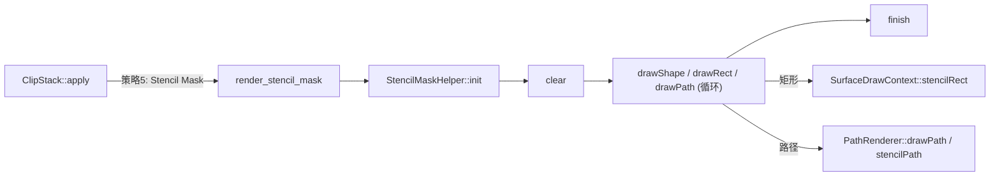

---

## 架构总览

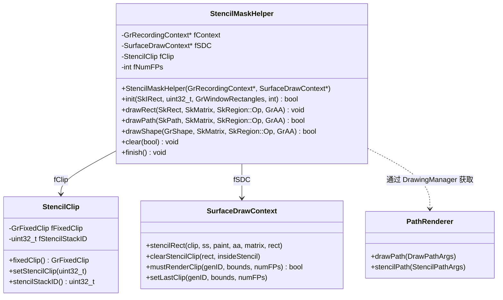

---

## 1. Stencil 设置查找表 (line 37-261)

### 1.1 `gUserToClipTable` 结构 (line 167-184)

三维查找表: `[fillInverted][op][pass]`，返回以 nullptr 结尾的 `GrUserStencilSettings*` 数组。

用于**两阶段渲染**的第二阶段 — 将用户 stencil 位合并到剪裁位。

| 维度 | 索引 | 含义 |
|------|------|------|
| 第1维 | `0` / `1` | 正向填充 / 逆向填充 |
| 第2维 | `0`-`5` | `SkRegion::Op` 枚举值 |
| 第3维 | `0`-`2` | 多 pass 设置 (nullptr 结尾) |

**正向填充操作映射**:

| Op | Pass 0 | Pass 1 | 说明 |
|----|---------|---------|------|
| kDifference | `gUserToClipDiff` | — | 单 pass |
| kIntersect | `gUserToClipIsect` | — | 单 pass |
| kUnion | `gUserToClipUnion` | — | 单 pass |
| kXOR | `gUserToClipXorPass0` | `gZeroUserBits` | 需清除用户位 |
| kReverseDifference | `gUserToClipRDiffPass0` | `gZeroUserBits` | 需清除用户位 |
| kReplace | `gUserToClipReplace` | — | 单 pass |

---

### 1.2 `gDirectDrawTable` 结构 (line 235-242)

二维查找表: `[op][pass]`，用于**直接绘制**策略。

仅适用于: 非逆填充 + `kNoRestriction_StencilSupport`。

| Op | 设置 | 说明 |
|----|------|------|
| kDifference | `gDiffClip` | 在 clip 内时清零 clip bit |
| kIntersect | nullptr | 不支持直接绘制 |
| kUnion | `gUnionClip` | 不在 clip 内时设置 clip bit |
| kXOR | `gXorClip` | 反转 clip bit |
| kReverseDifference | nullptr | 不支持直接绘制 |
| kReplace | `gReplaceClip` | 无条件设置 clip bit |

---

### 1.3 `gDrawToStencil` (line 253-261)

用于两阶段渲染的**第一阶段** — 将几何体写入用户 stencil 位。

设置: `test=kAlways, passOp=kIncMaybeClamp, failOp=kIncMaybeClamp`

作用: 无条件递增用户 stencil 位，标记被几何体覆盖的区域。

---

## 2. 辅助函数 (line 274-357)

### 2.1 `get_stencil_passes()` (line 274-295)

核心决策函数: 根据 op / stencilSupport / fillInverted 选择渲染策略。

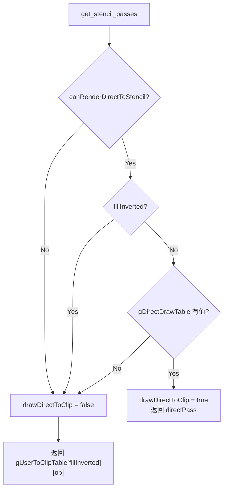

**参数**:
- `op`: 布尔运算类型
- `stencilSupport`: 路径渲染器的 stencil 支持等级
- `fillInverted`: 是否逆填充
- `drawDirectToClip` (输出): 是否可直接绘制到剪裁位

**返回**: nullptr 结尾的 `GrUserStencilSettings*` 数组

---

### 2.2 `draw_stencil_rect()` (line 297-306)

封装矩形 stencil 绘制，禁用颜色写入。

| 步骤 | 操作 |
|------|------|
| 1 | 创建 `GrPaint`，设置 `GrDisableColorXPFactory` |
| 2 | 调用 `sdc->stencilRect(clip, ss, paint, aa, matrix, rect)` |

---

### 2.3 `draw_path()` (line 308-334)

封装路径绘制到 stencil，使用指定的 stencil settings。

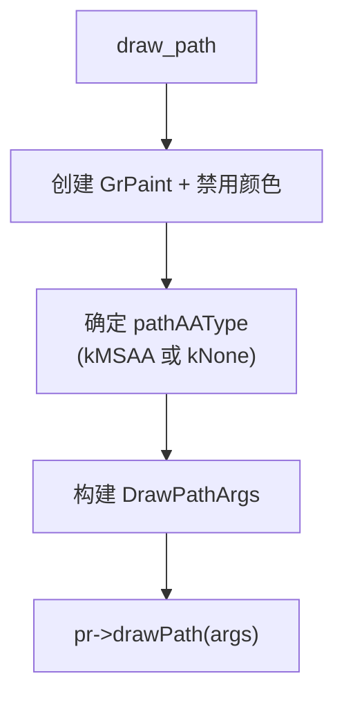

与 `stencil_path` 的区别: `draw_path` 允许传入任意 `GrUserStencilSettings`，用于直接绘制策略。

---

### 2.4 `stencil_path()` (line 336-353)

仅做 stencil 渲染（不绘制颜色/不指定自定义 stencil settings）。

用于**两阶段渲染的第一阶段** — 当 PathRenderer 的 stencilSupport 不是 `kNoRestriction` 时使用。

| 字段 | 值 |
|------|------|
| `fContext` | rContext |
| `fSurfaceDrawContext` | sdc |
| `fClip` | fixedClip |
| `fClipConservativeBounds` | clip.scissorRect() |
| `fViewMatrix` | matrix |
| `fShape` | shape |
| `fDoStencilMSAA` | aa |

---

### 2.5 `supported_aa()` (line 355-357)

判断当前 render target 是否支持 MSAA stencil。

```
return GrAA(sdc->numSamples() > 1 || sdc->canUseDynamicMSAA())
```

注意: 忽略传入的 `aa` 参数，仅由 render target 能力决定。

---

## 3. 生命周期管理 (line 363-385, 515-517)

### 3.1 构造函数 (line 363-368)

```cpp
StencilMaskHelper(GrRecordingContext* rContext, SurfaceDrawContext* sdc)
    : fContext(rContext), fSDC(sdc), fClip(sdc->dimensions()) {}
```

初始化成员指针，`StencilClip` 以 render target 尺寸构造。

---

### 3.2 `init()` (line 370-385)

配置 stencil mask 的绘制区域和状态。返回 `true` 表示需要重绘，`false` 表示缓存有效。

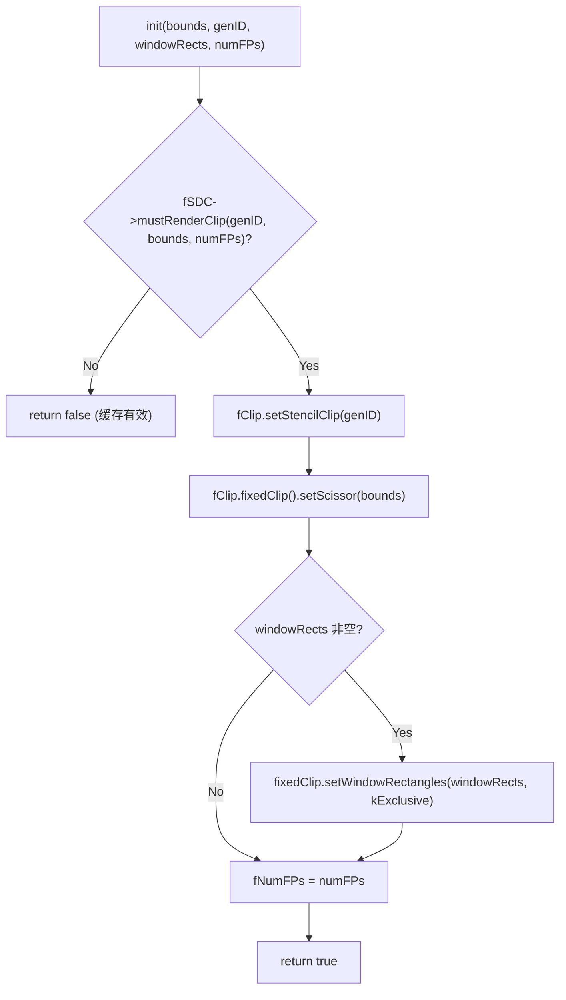

---

### 3.3 `finish()` (line 515-517)

标记当前 render target 的最后一次 stencil clip 渲染结果，供后续 `mustRenderClip` 缓存判断使用。

```cpp
fSDC->setLastClip(fClip.stencilStackID(), fClip.fixedClip().scissorRect(), fNumFPs);
```

---

## 4. 绘制操作 (line 387-501)

### 4.1 `drawRect()` (line 387-415)

将矩形绘制到 stencil 剪裁位。矩形始终视为 `kNoRestriction` + 非逆填充。

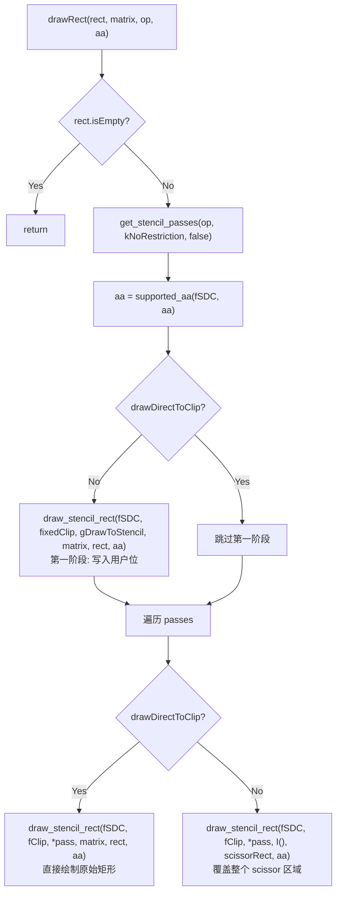

**关键区别**:
- 直接绘制: 用原始变换和矩形
- 两阶段覆盖: 用单位矩阵 + scissor 矩形作为覆盖区域

---

### 4.2 `drawPath()` (line 417-489)

将路径绘制到 stencil 剪裁位。最复杂的绘制函数。

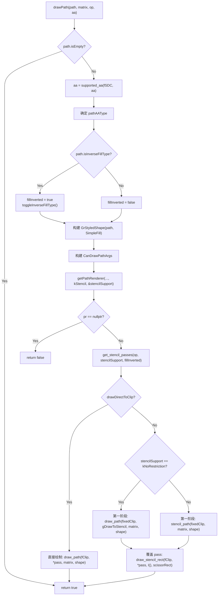

**路径预处理** (line 437-441):
- 检测逆填充: `path.isInverseFillType()`
- 若逆填充: toggle 回正向，交由 stencil settings 处理逆转逻辑
- 确保 `shape.inverseFilled() == false`

**PathRenderer 选择** (line 446-458):
- 通过 `DrawingManager::getPathRenderer()` 获取
- 查询类型: `DrawType::kStencil`
- 同时获取 `stencilSupport` 输出

---

### 4.3 `drawShape()` (line 491-501)

形状绘制入口，分派到 `drawRect` 或 `drawPath`。

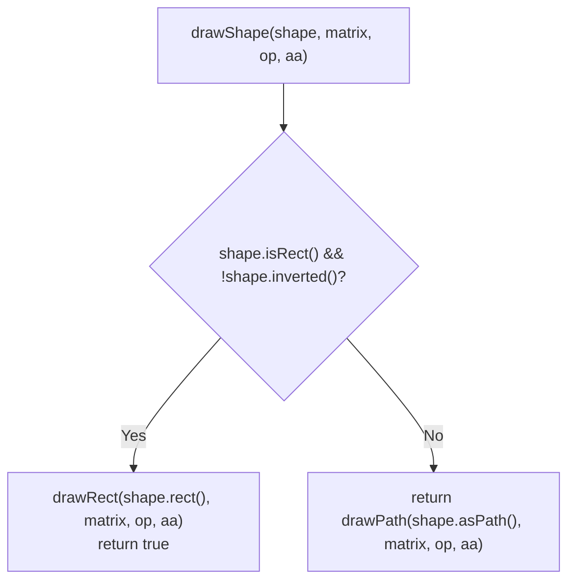

---

## 5. 状态操作 (line 503-513)

### 5.1 `clear()` (line 503-513)

重置 stencil buffer 的剪裁位。

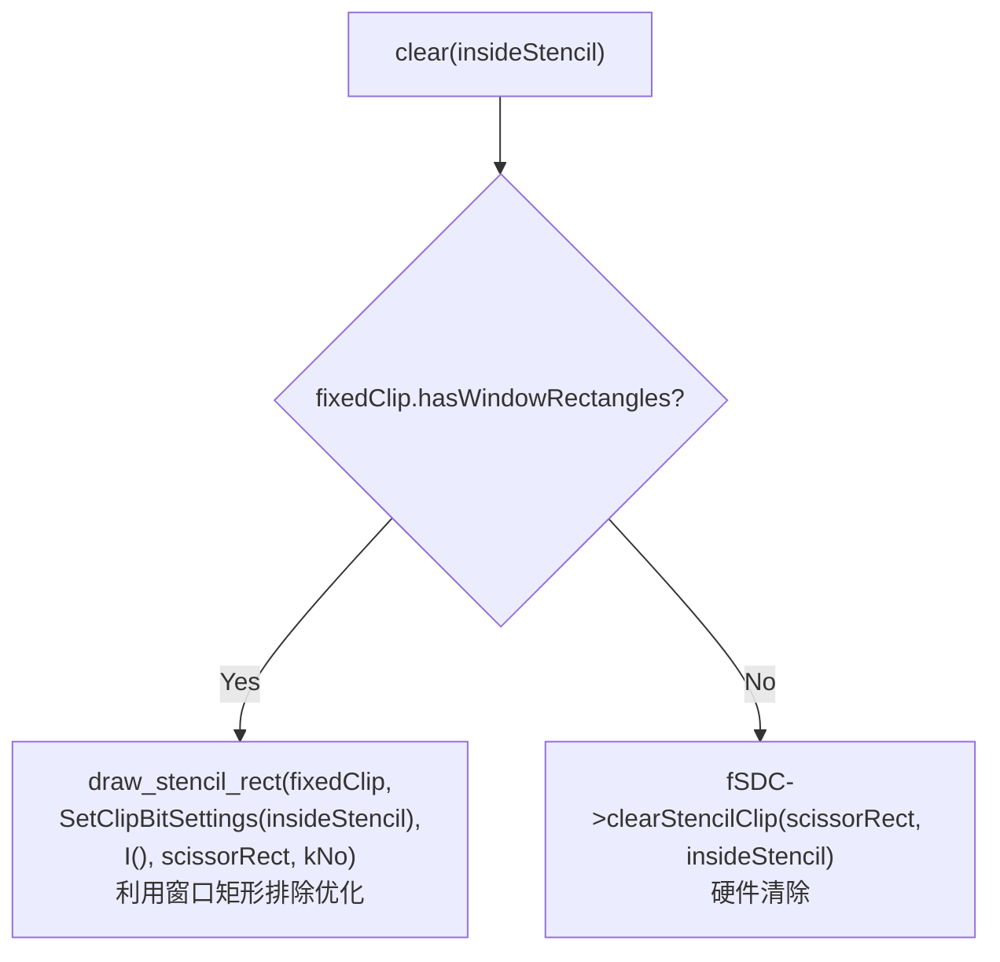

**窗口矩形优化**: 当存在 window rects 时，使用绘制而非硬件清除，这样 GPU 可以跳过被 window rects 排除的区域，对大尺寸 MSAA buffer 性能提升显著。

---

## 附录 A: Stencil 操作状态机

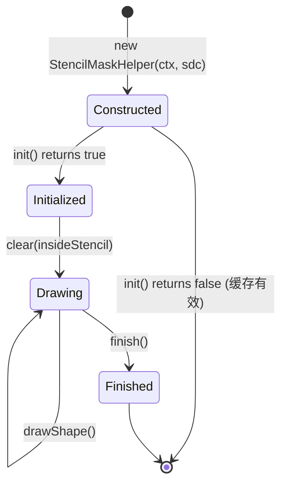

---

## 附录 B: Stencil 设置查找逻辑

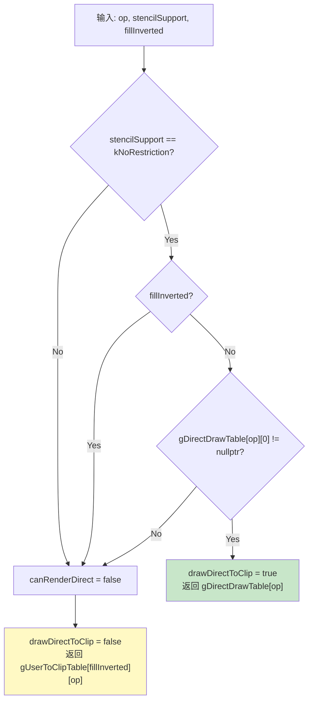

**可直接绘制的组合** (绿色路径):
- 非逆填充 + kNoRestriction + (Difference / Union / XOR / Replace)

**需两阶段的情况** (黄色路径):
- 任何逆填充
- stencilSupport 不是 kNoRestriction
- Intersect 和 ReverseDifference 操作

---

## 附录 C: drawPath 两阶段渲染策略

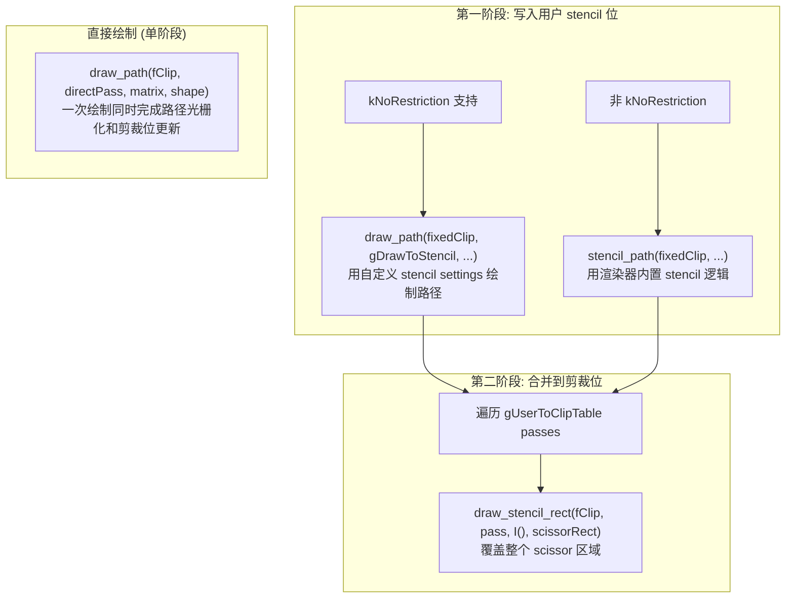

**两种第一阶段策略的区别**:
- `kNoRestriction`: PathRenderer 接受任意 stencil settings → 使用 `gDrawToStencil` (递增用户位)
- 非 `kNoRestriction`: PathRenderer 只能使用内置 stencil-then-cover → 调用 `stencilPath()` 让渲染器自行管理 stencil

---

## 附录 D: Stencil 写入管线 — 从 stencilRect 到 GPU 命令

展示 `GrUserStencilSettings` 如何从 `SurfaceDrawContext` 一路传递到 GPU 硬件，最终开启 stencil buffer 写入。

### 完整调用链

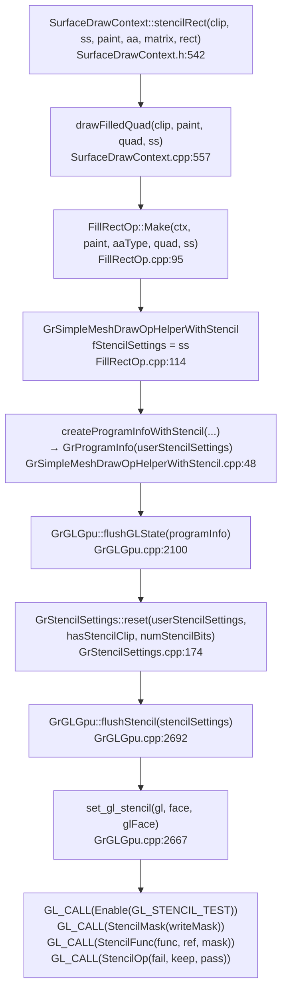

### 关键传递节点

| 阶段 | 文件 | 行号 | 作用 |
|------|------|------|------|
| 用户入口 | `SurfaceDrawContext.h` | 542-555 | 构造 DrawQuad，转发到 drawFilledQuad |
| Op 分派 | `SurfaceDrawContext.cpp` | 557-587 | 确定 aaType，创建 FillRectOp |
| Op 存储 | `FillRectOp.cpp` | 90-114 | ss 存入 `GrSimpleMeshDrawOpHelperWithStencil.fStencilSettings` |
| ProgramInfo 构建 | `GrSimpleMeshDrawOpHelperWithStencil.cpp` | 48-71 | 将 stencilSettings 传入 `CreateProgramInfo` |
| GL 状态刷新 | `GrGLGpu.cpp` | 2100-2127 | `flushGLState` 调用 `stencil.reset()` + `flushStencil()` |
| User→Hardware 转换 | `GrStencilSettings.cpp` | 174-218 | `Face::reset()` 将抽象语义转为硬件值 |
| GL 命令发射 | `GrGLGpu.cpp` | 2667-2714 | `set_gl_stencil` 调用 `glStencilFunc/Mask/Op` |

### User → Hardware 转换核心 (`Face::reset`, line 174-218)

转换发生在 `GrGLGpu::flushGLState` 内部 (line 2120-2125):

```cpp
GrStencilSettings stencil;
if (programInfo.isStencilEnabled()) {
    stencil.reset(*programInfo.userStencilSettings(),
                  programInfo.pipeline().hasStencilClip(),
                  glRT->numStencilBits(useMultisampleFBO));
}
```

`Face::reset()` 的三个关键计算:

**1. writeMask 计算** — 决定哪些 stencil 位可写:

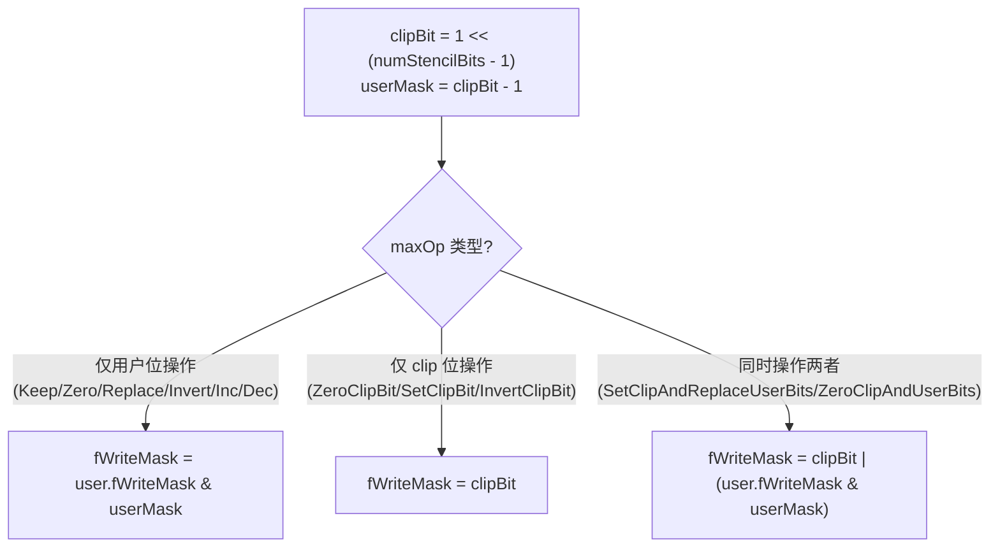

**2. 操作映射**: `gUserStencilOpToRaw[]` 查找表将 `GrUserStencilOp` → `GrStencilOp` (硬件枚举)

**3. 测试条件映射**: 根据 `hasStencilClip` 和 test 类型:

| 条件 | testMask | test |
|------|----------|------|
| 无 clip 或 test > kLastClippedStencilTest | `user.fTestMask & userMask` | `gUserStencilTestToRaw[test]` |
| 有 clip 且 test ≠ kAlwaysIfInClip | `clipBit \| (user.fTestMask & userMask)` | `gUserStencilTestToRaw[test]` |
| 有 clip 且 test == kAlwaysIfInClip | `clipBit` | `GrStencilTest::kEqual` |

### 设计动机: 为什么分两层?

`GrUserStencilSettings` (抽象层) 使用 clip-aware 语义:
- 操作: `kSetClipBit` / `kInvertClipBit` / `kZeroClipBit` — 逻辑意图
- 测试: `kAlwaysIfInClip` / `kEqualIfInClip` — clip 感知条件
- 好处: 调用方无需知道 clip bit 在哪一位，无需关心 stencil buffer 位宽

`GrStencilSettings` (硬件层) 直接映射 GL/VK API:
- `StencilMask(writeMask)` — 精确的位掩码
- `StencilFunc(func, ref, testMask)` — 硬件测试条件
- `StencilOp(fail, depthFail, pass)` — 硬件操作

转换时 `numStencilBits` 参数确定 clip bit 位置 (最高有效位)，使得抽象层与具体硬件解耦。
