# SurfaceDrawContext 函数实现参考

> 源码: `src/gpu/ganesh/SurfaceDrawContext.cpp` (2130行)
> 头文件: `src/gpu/ganesh/SurfaceDrawContext.h` (721行)

---

## 类型速查

阅读后续函数流程图前，建议先熟悉以下类型。按职责分为 7 组。

### 1. 自身类型

| 类型 | 含义 |
|------|------|
| `SurfaceDrawContext` | GrRenderTarget 的绘制命令调度器，继承自 SurfaceFillContext |
| `QuadOptimization` | 私有枚举 (`kDiscarded` / `kSubmitted` / `kClipApplied` / `kCropped`) |
| `DrawQuad` | 结构体，包含 `fDevice` (GrQuad) + `fLocal` (GrQuad) + `fEdgeFlags` (GrQuadAAFlags) |
| `WillAddOpFn` | 回调签名 `void(GrOp*, uint32_t opsTaskID)`，Op 加入列表前调用 |

### 2. 几何/数学类型

| 类型 | 含义 |
|------|------|
| `SkMatrix` | 3×3 变换矩阵 |
| `SkRect` | 浮点矩形 |
| `SkIRect` | 整数矩形 |
| `SkRRect` | 圆角矩形 |
| `SkPath` | 路径 |
| `SkPoint` / `SkPoint3` | 2D / 3D 点 |
| `GrQuad` | 四边形 (4 个 2D/3D 点，支持透视) |
| `GrQuadAAFlags` | 四边形边 AA 标志 (`kLeft` / `kTop` / `kRight` / `kBottom` / `kAll` / `kNone`) |
| `GrStyledShape` | 形状统一封装 (Rect / RRect / Path / Arc / Line) + 样式 |
| `GrStyle` | 样式 (stroke + pathEffect) |
| `SkStrokeRec` | 描边参数 (宽度/Cap/Join/Style) |
| `SkArc` | 弧线参数 |
| `SkRegion` | 整数区域 (由多个矩形构成) |
| `GrQuadSetEntry` | 批量四边形条目 |

### 3. 操作策略

| 类型 | 含义 |
|------|------|
| `GrAA` | 抗锯齿开关 (`kYes` / `kNo`) |
| `GrAAType` | AA 类型 (`kNone` / `kCoverage` / `kMSAA`) |
| `GrClip` | 裁剪接口基类 |
| `GrClip::Effect` | `apply` 返回值 (`kClippedOut` / `kClipped` / `kUnclipped`) |
| `GrClip::PreClipResult` | `preApply` 返回值 (Effect + optional SkRRect) |
| `GrAppliedClip` | 裁剪应用结果输出容器 |
| `GrHardClip` | 硬件裁剪接口 (stencil/scissor) |
| `GrUserStencilSettings` | 用户自定义 stencil 配置 |
| `GrScissorState` | 剪刀测试状态 |
| `SkClipOp` | 裁剪操作枚举 (`kIntersect` / `kDifference`) |

### 4. 渲染上下文

| 类型 | 含义 |
|------|------|
| `GrRecordingContext` | GPU 录制上下文 |
| `GrDirectContext` | GPU 直接上下文 (可执行命令) |
| `GrCaps` | GPU 能力查询 |
| `SurfaceFillContext` | 父类，基础填充操作上下文 |
| `OpsTask` | Op 列表任务 (一个 render pass 的所有 Op) |
| `GrDrawingManager` | 绘制管理器，调度 OpsTask |
| `PathRenderer` | 路径渲染器抽象基类 |
| `PathRendererChain` | 路径渲染器链 (按优先级选择) |

### 5. 着色器/处理器

| 类型 | 含义 |
|------|------|
| `GrPaint` | GPU 绘制参数 (颜色 FP + 覆盖 FP + XP) |
| `GrFragmentProcessor` | Fragment Processor 基类 |
| `GrColorSpaceXform` | 颜色空间转换 |
| `GrProcessorSet` | 处理器集合 (finalize 后分析结果) |
| `GrXferProcessor` / `GrXPFactory` | 混合处理器 / 工厂 |
| `GrBlendFragmentProcessor` | 混合 FP |
| `GrTextureEffect` | 纹理采样 FP |
| `GrDisableColorXPFactory` | 禁用颜色写入的 XP 工厂 |

### 6. 纹理/代理/资源

| 类型 | 含义 |
|------|------|
| `GrSurfaceProxy` | Surface 代理基类 |
| `GrRenderTargetProxy` | RT 代理 |
| `GrTextureProxy` | 纹理代理 |
| `GrSurfaceProxyView` | 代理 + origin + swizzle 组合视图 |
| `GrBackendFormat` | 后端纹理格式 |
| `GrBackendTexture` | 后端纹理句柄 |
| `GrColorType` | 颜色格式 (`kRGBA_8888` 等) |
| `GrSurfaceOrigin` | 纹理原点方向 (`kTopLeft` / `kBottomLeft`) |
| `GrDstProxyView` | 目标代理视图 (XP 混合读回用) |
| `GrDstSampleFlags` | 目标采样标志 |
| `GrSamplerState` | 纹理采样器状态 (Filter + MipmapMode + WrapMode) |
| `skgpu::Swizzle` | 颜色通道重排 |
| `SkBackingFit` | 纹理分配策略 (`kExact` / `kApprox`) |
| `skgpu::Budgeted` | 是否纳入 GPU 内存预算 |
| `skgpu::Mipmapped` | 是否 mipmap |
| `GrProtected` | 是否受保护内存 |
| `GrTextureSetEntry` | 批量纹理绘制条目 |

### 7. 容器/工具

| 类型 | 含义 |
|------|------|
| `SkSurfaceProps` | Surface 属性 (像素几何/DynamicMSAA 标志) |
| `SkCanvas::SrcRectConstraint` | 源矩形约束 (`kStrict` / `kFast`) |
| `SkBlendMode` | 混合模式枚举 |
| `GrOp::Owner` | Op 智能指针 (`std::unique_ptr<GrOp>`) |
| `sk_sp<T>` | 引用计数智能指针 |
| `TArray<T>` | 动态数组 |
| `GrPrimitiveType` | 图元类型 |

---

## SurfaceDrawContext 在 Skia 工程中的架构位置

| 属性 | 说明 |
|------|------|
| **归属** | `skgpu::ganesh::Device` 持有 `SurfaceDrawContext` 实例 |
| **继承** | `SurfaceDrawContext` → `SurfaceFillContext` → `SurfaceContext` |
| **接口** | 提供所有 2D 绘制命令接口 (rect/rrect/path/texture/shadow 等) |
| **上游** | `SkCanvas.drawXxx` → `Device.drawXxx` → `SurfaceDrawContext.drawXxx` |
| **下游** | `addDrawOp` → `OpsTask` → `GrDrawingManager::flush` → GPU 执行 |

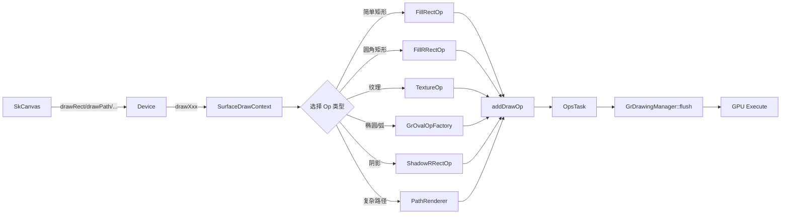
```mermaid
flowchart LR
    A[SkCanvas] -->|drawRect/drawPath/...| B[Device]
    B -->|drawXxx| C[SurfaceDrawContext]
    C --> D{选择 Op 类型}
    D -->|简单矩形| E[FillRectOp]
    D -->|圆角矩形| F[FillRRectOp]
    D -->|纹理| G[TextureOp]
    D -->|椭圆/弧| H[GrOvalOpFactory]
    D -->|阴影| I[ShadowRRectOp]
    D -->|复杂路径| J[PathRenderer]
    E & F & G & H & I & J --> K[addDrawOp]
    K --> L[OpsTask]
    L --> M[GrDrawingManager::flush]
    M --> N[GPU Execute]
```

---

## 架构总览

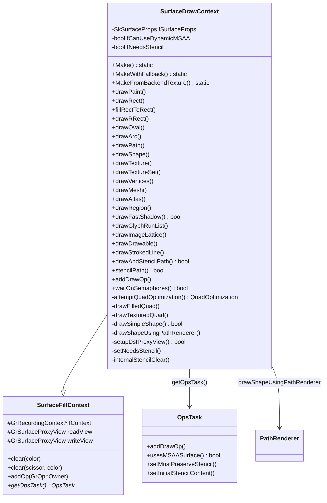
```mermaid
classDiagram
    class SurfaceFillContext {
        #GrRecordingContext* fContext
        #GrSurfaceProxyView readView
        #GrSurfaceProxyView writeView
        +clear(color)
        +clear(scissor, color)
        +addOp(GrOp::Owner)
        +getOpsTask() OpsTask*
    }

    class SurfaceDrawContext {
        -SkSurfaceProps fSurfaceProps
        -bool fCanUseDynamicMSAA
        -bool fNeedsStencil
        +Make() static
        +MakeWithFallback() static
        +MakeFromBackendTexture() static
        +drawPaint()
        +drawRect()
        +fillRectToRect()
        +drawRRect()
        +drawOval()
        +drawArc()
        +drawPath()
        +drawShape()
        +drawTexture()
        +drawTextureSet()
        +drawVertices()
        +drawMesh()
        +drawAtlas()
        +drawRegion()
        +drawFastShadow() bool
        +drawGlyphRunList()
        +drawImageLattice()
        +drawDrawable()
        +drawStrokedLine()
        +drawAndStencilPath() bool
        +stencilPath() bool
        +addDrawOp()
        +waitOnSemaphores() bool
        -attemptQuadOptimization() QuadOptimization
        -drawFilledQuad()
        -drawTexturedQuad()
        -drawSimpleShape() bool
        -drawShapeUsingPathRenderer()
        -setupDstProxyView() bool
        -setNeedsStencil()
        -internalStencilClear()
    }

    class OpsTask {
        +addDrawOp()
        +usesMSAASurface() bool
        +setMustPreserveStencil()
        +setInitialStencilContent()
    }

    SurfaceDrawContext --|> SurfaceFillContext
    SurfaceDrawContext --> OpsTask : getOpsTask()
    SurfaceDrawContext --> PathRenderer : drawShapeUsingPathRenderer
```

---

## 1. 匿名命名空间工具函数

### 1.1 `op_bounds()` (line 112-136)

计算 Op 的边界矩形，处理零面积 Op 的边界膨胀。

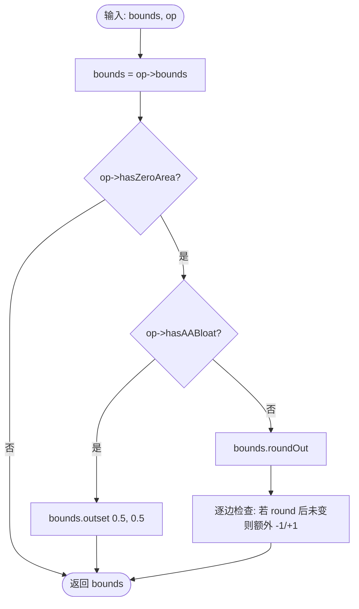
```mermaid
flowchart TD
    Start([输入: bounds, op]) --> GetBounds[bounds = op->bounds]
    GetBounds --> ZeroArea{op->hasZeroArea?}
    ZeroArea -->|否| Done([返回 bounds])
    ZeroArea -->|是| AABloat{op->hasAABloat?}
    AABloat -->|是| Outset05[bounds.outset 0.5, 0.5]
    AABloat -->|否| RoundOut[bounds.roundOut]
    RoundOut --> CheckEdges[逐边检查: 若 round 后未变则额外 -1/+1]
    Outset05 --> Done
    CheckEdges --> Done
```

---

## 2. 静态工厂方法

### 2.1 `Make(proxy)` (line 144-167)

从已有 proxy 创建 SurfaceDrawContext。

| 步骤 | 操作 |
|------|------|
| 1 | 验证 rContext、proxy、colorType 非空/非 unknown |
| 2 | 从 caps 获取 readSwizzle 和 writeSwizzle |
| 3 | 构造 readView 和 writeView |
| 4 | 调用构造函数创建实例 |

---

### 2.2 `Make(format+swizzle)` (line 169-216)

使用自定义 swizzle 创建新纹理代理并构建 SDC。

| 步骤 | 操作 |
|------|------|
| 1 | 检查 context 是否 abandoned |
| 2 | 通过 proxyProvider 创建 GrTextureProxy (Renderable) |
| 3 | 构造 readView 和 writeView |
| 4 | 创建 SDC (colorType = kUnknown) |
| 5 | 调用 `discard()` 标记初始内容可丢弃 |

---

### 2.3 `Make(colorType)` (line 218-258)

使用默认纹理格式创建 SDC，内部调用 Make(proxy)。

| 步骤 | 操作 |
|------|------|
| 1 | 从 caps 获取 colorType 的默认 BackendFormat |
| 2 | 通过 proxyProvider 创建 proxy |
| 3 | 委托给 Make(proxy) 完成构造 |

---

### 2.4 `MakeWithFallback()` (line 260-280)

尝试备选 ColorType 创建 SDC，保证通道数和精度不低于原始类型。

| 步骤 | 操作 |
|------|------|
| 1 | 从 caps 获取 fallback ColorType |
| 2 | 若 fallback 为 kUnknown 则返回 nullptr |
| 3 | 委托给 Make(colorType) |

---

### 2.5 `MakeFromBackendTexture()` (line 282-301)

包装已有 GrBackendTexture 创建 SDC。

| 步骤 | 操作 |
|------|------|
| 1 | 通过 proxyProvider 的 `wrapRenderableBackendTexture` 获取 proxy |
| 2 | 委托给 Make(proxy) |

---

## 3. 构造/析构与任务管理

### 3.1 构造函数 (line 307-322)

初始化 SurfaceDrawContext，设置 surfaceProps 和 dynamicMSAA 能力。

| 字段 | 初始化 |
|------|------|
| `fSurfaceProps` | 传入参数 |
| `fCanUseDynamicMSAA` | `DynamicMSAA_Flag && caps.supportsDynamicMSAA(proxy)` |

---

### 3.2 析构函数 (line 324-326)

仅执行 `ASSERT_SINGLE_OWNER` 检查。

---

### 3.3 `willReplaceOpsTask()` (line 328-342)

OpsTask 替换时的回调：保存/恢复 stencil 状态。

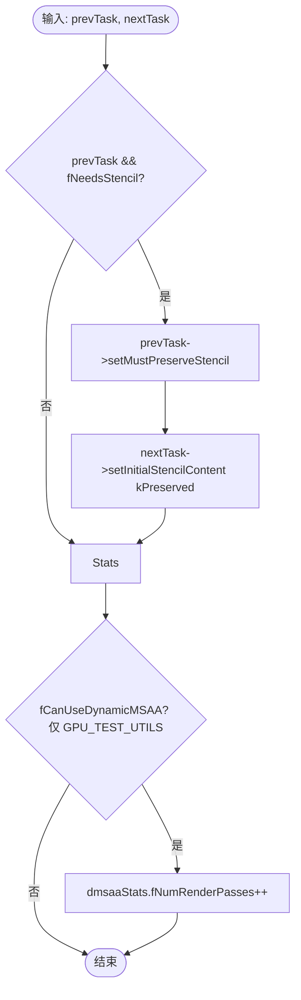
```mermaid
flowchart TD
    Start([输入: prevTask, nextTask]) --> HasPrev{prevTask && fNeedsStencil?}
    HasPrev -->|否| Stats
    HasPrev -->|是| Preserve[prevTask->setMustPreserveStencil]
    Preserve --> Reload[nextTask->setInitialStencilContent kPreserved]
    Reload --> Stats
    Stats --> DynMSAA{fCanUseDynamicMSAA? 仅 GPU_TEST_UTILS}
    DynMSAA -->|是| IncrPass[dmsaaStats.fNumRenderPasses++]
    DynMSAA -->|否| Done([结束])
    IncrPass --> Done
```

---

## 4. 文本绘制

### 4.1 `drawGlyphRunList()` (line 344-378)

通过 TextBlobRedrawCoordinator 分发文本绘制到 AtlasTextOp。

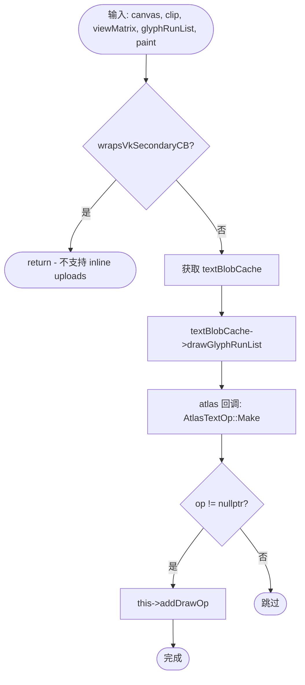
```mermaid
flowchart TD
    Start([输入: canvas, clip, viewMatrix, glyphRunList, paint]) --> VkCheck{wrapsVkSecondaryCB?}
    VkCheck -->|是| Return([return - 不支持 inline uploads])
    VkCheck -->|否| GetCache[获取 textBlobCache]
    GetCache --> DrawList[textBlobCache->drawGlyphRunList]
    DrawList --> AtlasDelegate[atlas 回调: AtlasTextOp::Make]
    AtlasDelegate --> AddOp{op != nullptr?}
    AddOp -->|是| DoAdd[this->addDrawOp]
    AddOp -->|否| Skip([跳过])
    DoAdd --> Done([完成])
```

---

## 5. 填充/Quad 优化核心

### 5.1 `drawPaint()` (line 380-397)

全屏填充：无 FP 时直接 fillRectToRect；有 FP 时使用逆 viewMatrix 作为 localMatrix。

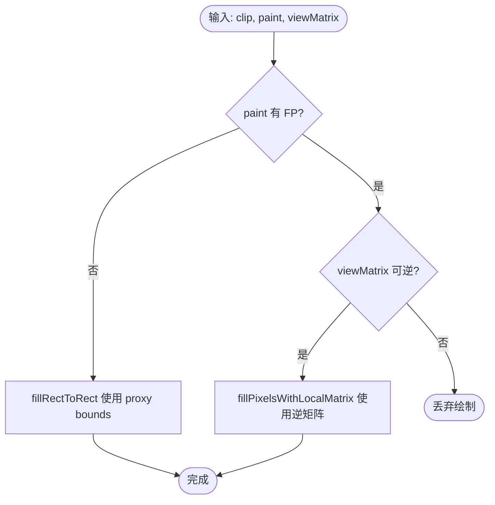
```mermaid
flowchart TD
    Start([输入: clip, paint, viewMatrix]) --> HasFP{paint 有 FP?}
    HasFP -->|否| FillDirect[fillRectToRect 使用 proxy bounds]
    HasFP -->|是| Invert{viewMatrix 可逆?}
    Invert -->|是| FillLocal[fillPixelsWithLocalMatrix 使用逆矩阵]
    Invert -->|否| Drop([丢弃绘制])
    FillDirect --> Done([完成])
    FillLocal --> Done
```

---

### 5.2 `attemptQuadOptimization()` (line 414-555)

核心优化决策：尝试将 quad 绘制优化为 discard/clear/clipApply/crop。

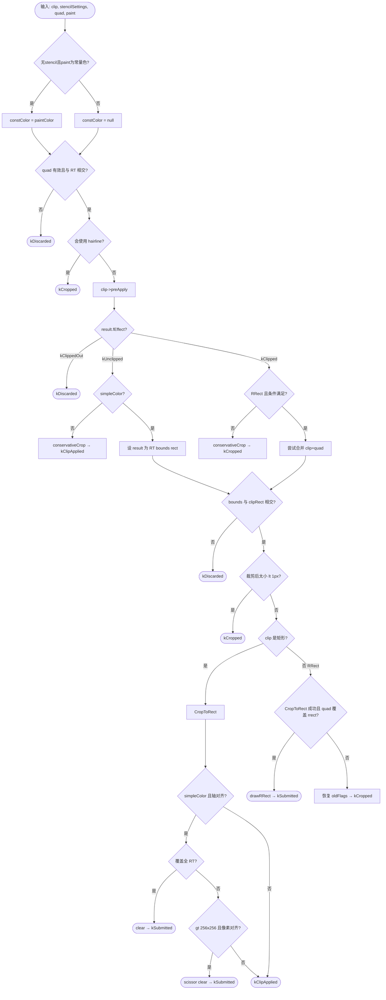
```mermaid
flowchart TD
    Start([输入: clip, stencilSettings, quad, paint]) --> ConstColor{无stencil且paint为常量色?}
    ConstColor -->|是| SetConst[constColor = paintColor]
    ConstColor -->|否| NullConst[constColor = null]
    SetConst --> CheckBounds
    NullConst --> CheckBounds

    CheckBounds{quad 有效且与 RT 相交?}
    CheckBounds -->|否| Discard1([kDiscarded])
    CheckBounds -->|是| Hairline{会使用 hairline?}
    Hairline -->|是| Crop1([kCropped])
    Hairline -->|否| PreApply[clip->preApply]

    PreApply --> Effect{result.fEffect?}
    Effect -->|kClippedOut| Discard2([kDiscarded])
    Effect -->|kUnclipped| Unclipped{simpleColor?}
    Unclipped -->|否| ConsCrop[conservativeCrop → kClipApplied]
    Unclipped -->|是| FallToRect[设 result 为 RT bounds rect]
    Effect -->|kClipped| Complex{RRect 且条件满足?}
    Complex -->|否| ConsCrop2[conservativeCrop → kCropped]
    Complex -->|是| FallToRect2[尝试合并 clip+quad]

    FallToRect --> Intersect
    FallToRect2 --> Intersect
    Intersect{bounds 与 clipRect 相交?}
    Intersect -->|否| Discard3([kDiscarded])
    Intersect -->|是| TooSmall{裁剪后太小 lt 1px?}
    TooSmall -->|是| Crop2([kCropped])
    TooSmall -->|否| IsRect{clip 是矩形?}

    IsRect -->|是| CropToRect[CropToRect]
    CropToRect --> AxisAligned{simpleColor 且轴对齐?}
    AxisAligned -->|是| FullScreen{覆盖全 RT?}
    FullScreen -->|是| Clear([clear → kSubmitted])
    FullScreen -->|否| LargeEnough{gt 256x256 且像素对齐?}
    LargeEnough -->|是| ScissorClear([scissor clear → kSubmitted])
    LargeEnough -->|否| ClipApplied([kClipApplied])
    AxisAligned -->|否| ClipApplied

    IsRect -->|否 RRect| RRectOpt{CropToRect 成功且 quad 覆盖 rrect?}
    RRectOpt -->|是| DrawRRect([drawRRect → kSubmitted])
    RRectOpt -->|否| RestoreFlags[恢复 oldFlags → kCropped]
```

---

### 5.3 `drawFilledQuad()` (line 557-587)

填充四边形的统一入口：先调用 attemptQuadOptimization，再按结果生成 FillRectOp。

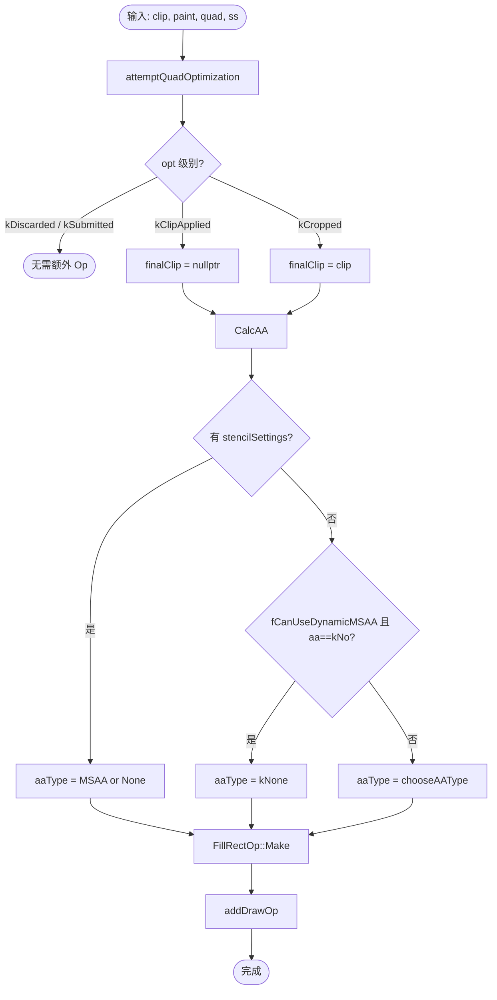
```mermaid
flowchart TD
    Start([输入: clip, paint, quad, ss]) --> Opt[attemptQuadOptimization]
    Opt --> Level{opt 级别?}
    Level -->|kDiscarded / kSubmitted| Done([无需额外 Op])
    Level -->|kClipApplied| NoClip[finalClip = nullptr]
    Level -->|kCropped| KeepClip[finalClip = clip]
    NoClip --> CalcAA
    KeepClip --> CalcAA
    CalcAA --> HasSS{有 stencilSettings?}
    HasSS -->|是| MSAA[aaType = MSAA or None]
    HasSS -->|否| DynMSAA{fCanUseDynamicMSAA 且 aa==kNo?}
    DynMSAA -->|是| NoAA[aaType = kNone]
    DynMSAA -->|否| Choose[aaType = chooseAAType]
    MSAA --> MakeOp
    NoAA --> MakeOp
    Choose --> MakeOp
    MakeOp[FillRectOp::Make] --> AddOp[addDrawOp]
    AddOp --> Done2([完成])
```

---

## 6. 纹理绘制

### 6.1 `drawTexture()` (line 589-646)

绘制纹理子矩形到目标矩形。DMSAA 模式下走 FillRRectOp 路径。

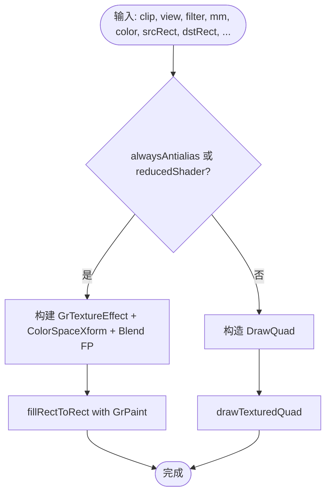
```mermaid
flowchart TD
    Start([输入: clip, view, filter, mm, color, srcRect, dstRect, ...]) --> DMSAA{alwaysAntialias 或 reducedShader?}
    DMSAA -->|是| BuildFP[构建 GrTextureEffect + ColorSpaceXform + Blend FP]
    BuildFP --> FillRect[fillRectToRect with GrPaint]
    DMSAA -->|否| BuildQuad[构造 DrawQuad]
    BuildQuad --> TexQuad[drawTexturedQuad]
    FillRect --> Done([完成])
    TexQuad --> Done
```

---

### 6.2 `drawTexturedQuad()` (line 648-684)

纹理四边形绘制：执行 quad 优化后生成 TextureOp。

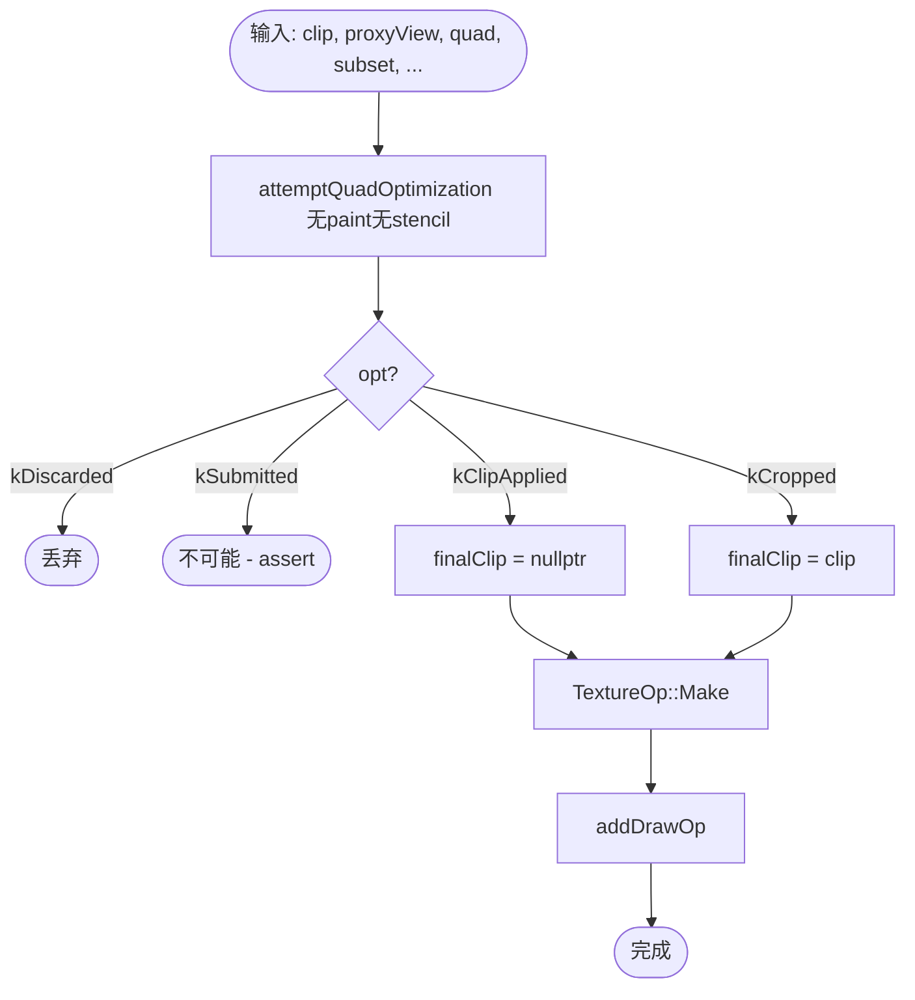
```mermaid
flowchart TD
    Start([输入: clip, proxyView, quad, subset, ...]) --> Opt[attemptQuadOptimization 无paint无stencil]
    Opt --> Result{opt?}
    Result -->|kDiscarded| Drop([丢弃])
    Result -->|kSubmitted| Never([不可能 - assert])
    Result -->|kClipApplied| NoClip[finalClip = nullptr]
    Result -->|kCropped| KeepClip[finalClip = clip]
    NoClip --> MakeOp
    KeepClip --> MakeOp
    MakeOp[TextureOp::Make] --> AddOp[addDrawOp]
    AddOp --> Done([完成])
```

---

### 6.3 `drawTextureSet()` (line 904-928)

批量纹理绘制：委托给 TextureOp::AddTextureSetOps。

| 步骤 | 操作 |
|------|------|
| 1 | 选择 aaType (始终 GrAA::kYes) |
| 2 | 计算 saturate 类型 |
| 3 | 调用 `TextureOp::AddTextureSetOps` 批量添加 |

---

## 7. 矩形绘制

### 7.1 `drawRect()` (line 686-735)

矩形绘制：fill 走 fillRectToRect，stroke 走 StrokeRectOp，否则 fallback 到 path renderer。

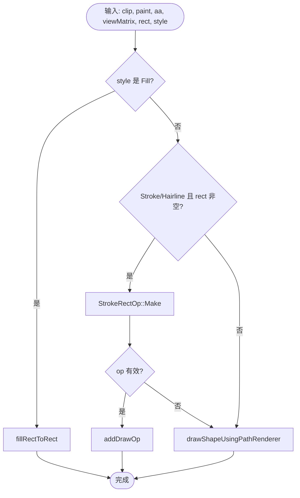
```mermaid
flowchart TD
    Start([输入: clip, paint, aa, viewMatrix, rect, style]) --> Fill{style 是 Fill?}
    Fill -->|是| FillRect[fillRectToRect]
    Fill -->|否| Stroke{Stroke/Hairline 且 rect 非空?}
    Stroke -->|是| MakeOp[StrokeRectOp::Make]
    MakeOp --> OpOK{op 有效?}
    OpOK -->|是| AddOp[addDrawOp]
    OpOK -->|否| PathFallback
    Stroke -->|否| PathFallback[drawShapeUsingPathRenderer]
    FillRect --> Done([完成])
    AddOp --> Done
    PathFallback --> Done
```

---

### 7.2 `fillRectToRect()` (line 737-791)

矩形填充：DMSAA 模式优先使用 FillRRectOp，否则走 drawFilledQuad。

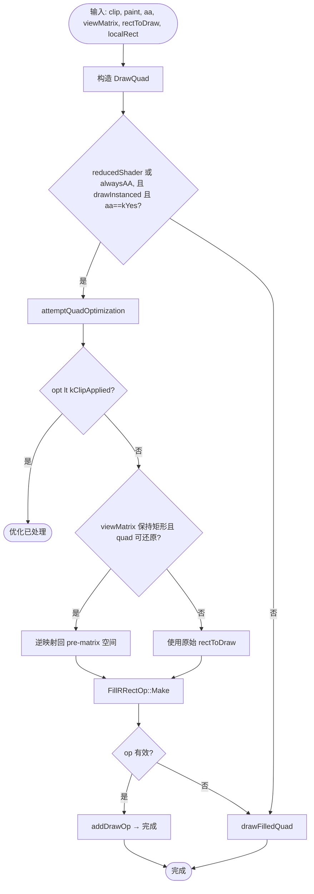
```mermaid
flowchart TD
    Start([输入: clip, paint, aa, viewMatrix, rectToDraw, localRect]) --> BuildQuad[构造 DrawQuad]
    BuildQuad --> DMSAA{reducedShader 或 alwaysAA, 且 drawInstanced 且 aa==kYes?}
    DMSAA -->|是| QuadOpt[attemptQuadOptimization]
    QuadOpt --> OptLevel{opt lt kClipApplied?}
    OptLevel -->|是| Done([优化已处理])
    OptLevel -->|否| CropRect{viewMatrix 保持矩形且 quad 可还原?}
    CropRect -->|是| MapBack[逆映射回 pre-matrix 空间]
    CropRect -->|否| UseOrig[使用原始 rectToDraw]
    MapBack --> FillRRect[FillRRectOp::Make]
    UseOrig --> FillRRect
    FillRRect --> OpOK{op 有效?}
    OpOK -->|是| AddOp[addDrawOp → 完成]
    OpOK -->|否| Fallback
    DMSAA -->|否| Fallback[drawFilledQuad]
    Fallback --> Done2([完成])
    AddOp --> Done2
```

---

### 7.3 `drawQuadSet()` (line 793-802)

批量四边形：直接委托 `FillRectOp::AddFillRectOps`。

---

## 8. Stencil 管理

### 8.1 `canDiscardPreviousOpsOnFullClear()` (line 808-821)

判断 full clear 时是否可丢弃之前的 ops：当不需要 stencil 时可丢弃。

| 条件 | 结果 |
|------|------|
| `fPreserveOpsOnFullClear_TestingOnly` | kNo |
| `fNeedsStencil == true` | kNo |
| 其他 | kYes |

---

### 8.2 `setNeedsStencil()` (line 823-839)

标记需要 stencil 缓冲区，首次调用时初始化 stencil。

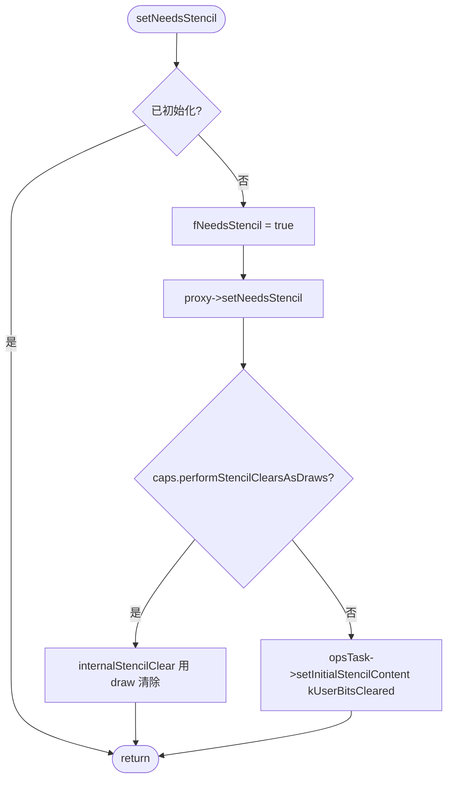
```mermaid
flowchart TD
    Start([setNeedsStencil]) --> Already{已初始化?}
    Already -->|是| Done([return])
    Already -->|否| SetFlag[fNeedsStencil = true]
    SetFlag --> ProxyStencil[proxy->setNeedsStencil]
    ProxyStencil --> Driver{caps.performStencilClearsAsDraws?}
    Driver -->|是| DrawClear[internalStencilClear 用 draw 清除]
    Driver -->|否| OpsClear[opsTask->setInitialStencilContent kUserBitsCleared]
    DrawClear --> Done
    OpsClear --> Done
```

---

### 8.3 `internalStencilClear()` (line 841-864)

清除 stencil 缓冲区：根据 caps 选择 draw-based 或 native clear。

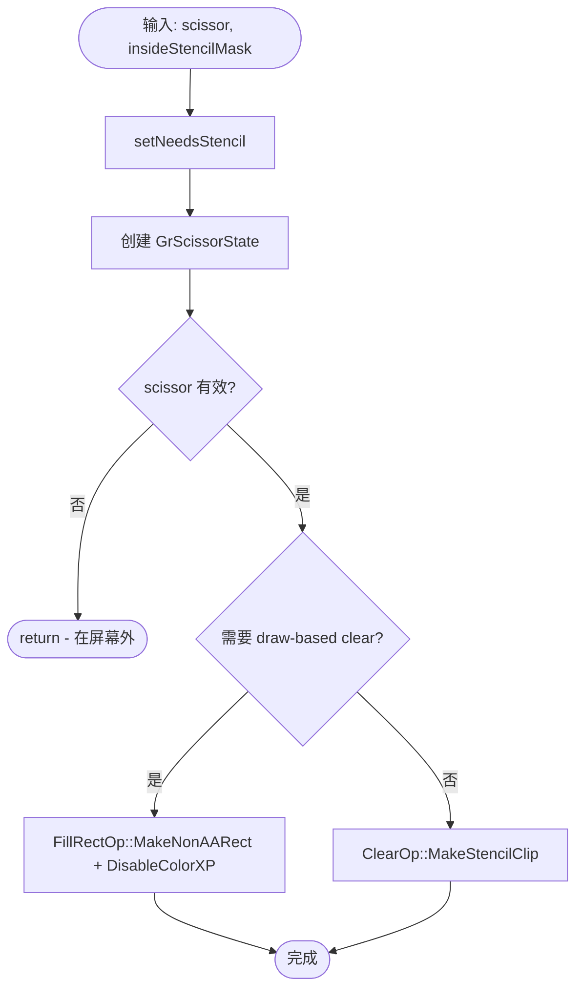
```mermaid
flowchart TD
    Start([输入: scissor, insideStencilMask]) --> EnsureStencil[setNeedsStencil]
    EnsureStencil --> SetScissor[创建 GrScissorState]
    SetScissor --> ValidScissor{scissor 有效?}
    ValidScissor -->|否| Return([return - 在屏幕外])
    ValidScissor -->|是| Method{需要 draw-based clear?}
    Method -->|是| DrawRect[FillRectOp::MakeNonAARect + DisableColorXP]
    Method -->|否| ClearOp[ClearOp::MakeStencilClip]
    DrawRect --> Done([完成])
    ClearOp --> Done
```

---

### 8.4 `stencilPath()` (line 866-902)

仅写入 stencil 不写颜色，通过 PathRenderer (DrawType::kStencil) 实现。

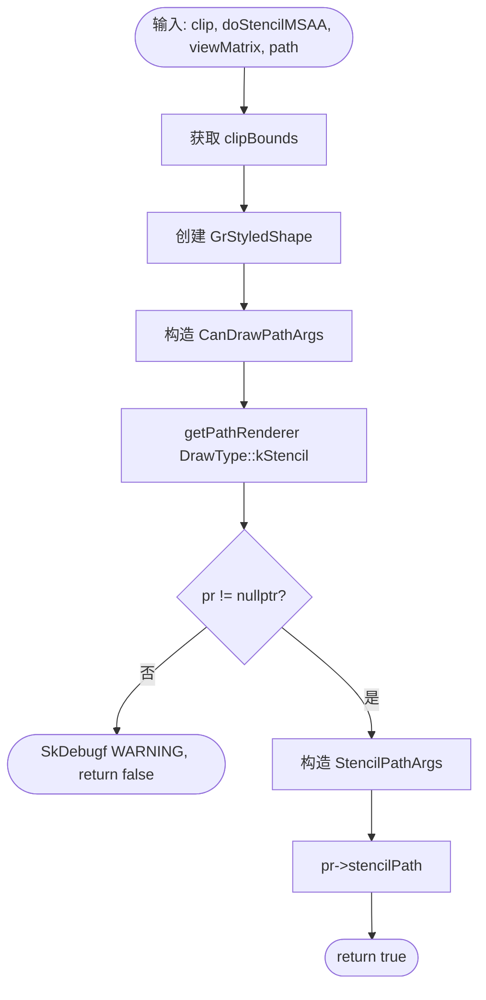
```mermaid
flowchart TD
    Start([输入: clip, doStencilMSAA, viewMatrix, path]) --> GetBounds[获取 clipBounds]
    GetBounds --> MakeShape[创建 GrStyledShape]
    MakeShape --> CanDraw[构造 CanDrawPathArgs]
    CanDraw --> GetPR[getPathRenderer DrawType::kStencil]
    GetPR --> Found{pr != nullptr?}
    Found -->|否| Warn([SkDebugf WARNING, return false])
    Found -->|是| BuildArgs[构造 StencilPathArgs]
    BuildArgs --> Stencil[pr->stencilPath]
    Stencil --> Success([return true])
```

---

## 9. 顶点/Mesh/Atlas 绘制

### 9.1 `drawVertices()` (line 930-952)

绘制顶点数据，通过 DrawMeshOp 实现。

| 步骤 | 操作 |
|------|------|
| 1 | 获取颜色空间变换 (skipColorXform 时为 nullptr) |
| 2 | 确定 aaType (DMSAA 时用 MSAA，否则无 AA) |
| 3 | `DrawMeshOp::Make` 创建 Op |
| 4 | `addDrawOp` |

---

### 9.2 `drawMesh()` (line 954-979)

绘制自定义 SkMesh，同样通过 DrawMeshOp。

| 步骤 | 操作 |
|------|------|
| 1 | 从 mesh spec 获取颜色空间变换 |
| 2 | 确定 aaType |
| 3 | `DrawMeshOp::Make` (传入 children FP) |
| 4 | `addDrawOp` |

---

### 9.3 `drawAtlas()` (line 983-999)

绘制 atlas 精灵：直接创建 DrawAtlasOp。

| 步骤 | 操作 |
|------|------|
| 1 | aaType = chooseAAType(kNo) |
| 2 | `DrawAtlasOp::Make` |
| 3 | `addDrawOp` |

---

## 10. 圆角矩形绘制

### 10.1 `drawRRect()` (line 1003-1096)

圆角矩形绘制：尝试多种专用 Op，最终 fallback 到 path renderer。

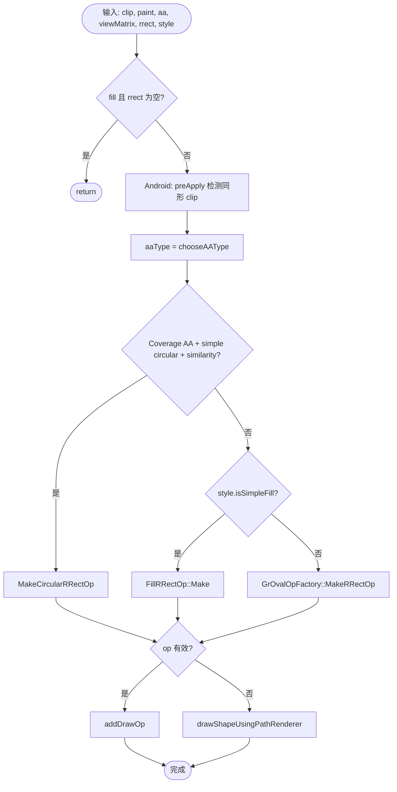
```mermaid
flowchart TD
    Start([输入: clip, paint, aa, viewMatrix, rrect, style]) --> Empty{fill 且 rrect 为空?}
    Empty -->|是| Return([return])
    Empty -->|否| AndroidClipOpt[Android: preApply 检测同形 clip]
    AndroidClipOpt --> ChooseAA[aaType = chooseAAType]
    ChooseAA --> CircularRRect{Coverage AA + simple circular + similarity?}
    CircularRRect -->|是| CircOp[MakeCircularRRectOp]
    CircularRRect -->|否| SimpleFill{style.isSimpleFill?}
    SimpleFill -->|是| FillRRectOp[FillRRectOp::Make]
    SimpleFill -->|否| OvalFactory
    CircOp --> OpOK
    FillRRectOp --> OpOK
    OvalFactory[GrOvalOpFactory::MakeRRectOp] --> OpOK{op 有效?}
    OpOK -->|是| AddOp[addDrawOp]
    OpOK -->|否| Fallback[drawShapeUsingPathRenderer]
    AddOp --> Done([完成])
    Fallback --> Done
```

---

## 11. 阴影绘制

### 11.1 `drawFastShadow()` (line 1100-1303)

快速阴影渲染：仅处理 RRect/Rect/Circle 的环境光和聚光阴影。

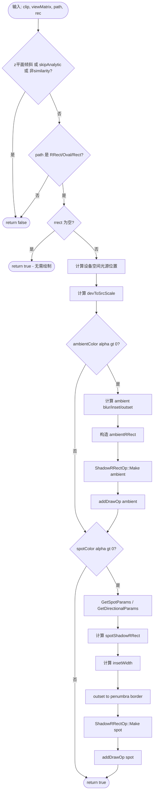
```mermaid
flowchart TD
    Start([输入: clip, viewMatrix, path, rec]) --> Validate{z平面倾斜 或 skipAnalytic 或 非similarity?}
    Validate -->|是| Fail([return false])
    Validate -->|否| Shape{path 是 RRect/Oval/Rect?}
    Shape -->|否| Fail
    Shape -->|是| Empty{rrect 为空?}
    Empty -->|是| TrueEarly([return true - 无需绘制])
    Empty -->|否| CalcLight[计算设备空间光源位置]

    CalcLight --> CalcScale[计算 devToSrcScale]
    CalcScale --> Ambient{ambientColor alpha gt 0?}
    Ambient -->|是| AmbientCalc[计算 ambient blur/inset/outset]
    AmbientCalc --> AmbientRRect[构造 ambientRRect]
    AmbientRRect --> AmbientOp[ShadowRRectOp::Make ambient]
    AmbientOp --> AmbientAdd[addDrawOp ambient]
    Ambient -->|否| SpotCheck

    AmbientAdd --> SpotCheck{spotColor alpha gt 0?}
    SpotCheck -->|是| SpotCalc[GetSpotParams / GetDirectionalParams]
    SpotCalc --> SpotTransform[计算 spotShadowRRect]
    SpotTransform --> SpotInset[计算 insetWidth]
    SpotInset --> SpotOutset[outset to penumbra border]
    SpotOutset --> SpotOp[ShadowRRectOp::Make spot]
    SpotOp --> SpotAdd[addDrawOp spot]
    SpotCheck -->|否| Success
    SpotAdd --> Success([return true])
```

---

## 12. 区域/椭圆/弧线绘制

### 12.1 `drawRegion()` (line 1307-1339)

区域绘制：简单整数平移时降级为 kNo AA，复杂样式/AA 走 drawPath。

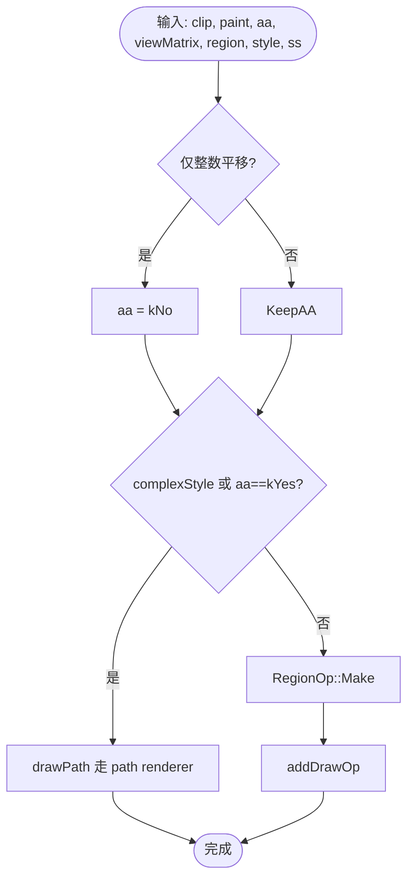
```mermaid
flowchart TD
    Start([输入: clip, paint, aa, viewMatrix, region, style, ss]) --> IntTranslate{仅整数平移?}
    IntTranslate -->|是| NoAA[aa = kNo]
    IntTranslate -->|否| KeepAA
    NoAA --> Complex{complexStyle 或 aa==kYes?}
    KeepAA --> Complex
    Complex -->|是| DrawPath[drawPath 走 path renderer]
    Complex -->|否| RegionOp[RegionOp::Make]
    RegionOp --> AddOp[addDrawOp]
    DrawPath --> Done([完成])
    AddOp --> Done
```

---

### 12.2 `drawOval()` (line 1341-1405)

椭圆绘制：依次尝试 CircleOp → FillRRectOp → OvalOp → path fallback。

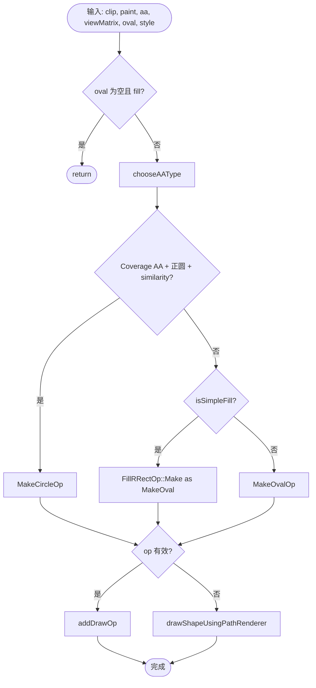
```mermaid
flowchart TD
    Start([输入: clip, paint, aa, viewMatrix, oval, style]) --> EmptyFill{oval 为空且 fill?}
    EmptyFill -->|是| Return([return])
    EmptyFill -->|否| ChooseAA[chooseAAType]
    ChooseAA --> Circle{Coverage AA + 正圆 + similarity?}
    Circle -->|是| CircleOp[MakeCircleOp]
    Circle -->|否| SimpleFill{isSimpleFill?}
    SimpleFill -->|是| FillRRect[FillRRectOp::Make as MakeOval]
    SimpleFill -->|否| OvalOp
    CircleOp --> Check
    FillRRect --> Check
    OvalOp[MakeOvalOp] --> Check{op 有效?}
    Check -->|是| AddOp[addDrawOp]
    Check -->|否| Fallback[drawShapeUsingPathRenderer]
    AddOp --> Done([完成])
    Fallback --> Done
```

---

### 12.3 `drawArc()` (line 1407-1443)

弧线绘制：Coverage AA 时尝试 MakeArcOp，否则走 path renderer。

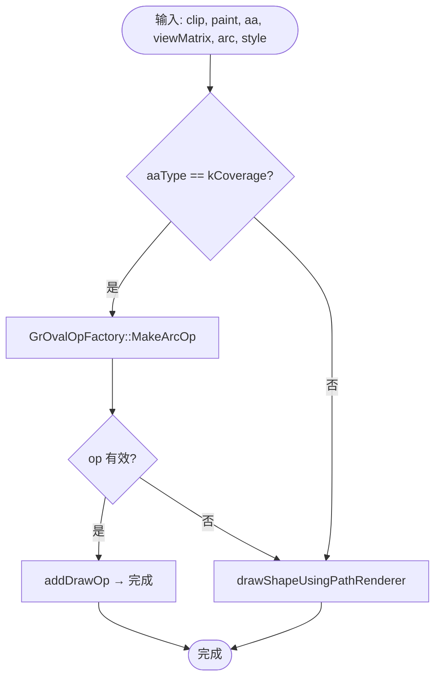
```mermaid
flowchart TD
    Start([输入: clip, paint, aa, viewMatrix, arc, style]) --> AA{aaType == kCoverage?}
    AA -->|是| MakeArc[GrOvalOpFactory::MakeArcOp]
    MakeArc --> OpOK{op 有效?}
    OpOK -->|是| AddOp[addDrawOp → 完成]
    OpOK -->|否| Fallback
    AA -->|否| Fallback[drawShapeUsingPathRenderer]
    Fallback --> Done([完成])
    AddOp --> Done
```

---

## 13. 九宫格/Drawable/Clip 状态

### 13.1 `drawImageLattice()` (line 1445-1463)

九宫格纹理绘制：直接创建 LatticeOp。

| 步骤 | 操作 |
|------|------|
| 1 | `LatticeOp::MakeNonAA` 创建 Op |
| 2 | `addDrawOp` |

---

### 13.2 `drawDrawable()` (line 1465-1474)

将 GPU DrawHandler 包装为 DrawableOp 加入 Op 列表。

| 步骤 | 操作 |
|------|------|
| 1 | `DrawableOp::Make` |
| 2 | `addOp` (非 addDrawOp，无 clip) |

---

### 13.3 `setLastClip()` (line 1476-1483)

记录最后一次渲染到 stencil 的 clip 信息到 OpsTask。

| 字段 | 写入值 |
|------|------|
| `fLastClipStackGenID` | clipStackGenID |
| `fLastDevClipBounds` | devClipBounds |
| `fLastClipNumAnalyticElements` | numClipAnalyticElements |

---

### 13.4 `mustRenderClip()` (line 1485-1492)

判断是否需要重新渲染 clip 到 stencil：genID 不同或 bounds 不包含或元素数不同。

---

## 14. GPU 同步与路径绘制

### 14.1 `waitOnSemaphores()` (line 1494-1526)

等待 GPU 信号量：包装后端信号量并创建 wait render task。

```mermaid
flowchart TD
    Start([输入: numSemaphores, waitSemaphores, deleteAfterWait]) --> Support{caps.backendSemaphoreSupport?}
    Support -->|否| Fail([return false])
    Support -->|是| Direct{asDirectContext?}
    Direct -->|否| Fail
    Direct -->|是| Wrap[逐个 wrapBackendSemaphore]
    Wrap --> NewTask[drawingManager.newWaitRenderTask]
    NewTask --> Success([return true])
```

---

### 14.2 `drawPath()` (line 1528-1541)

路径绘制入口：包装为 GrStyledShape 后委托 drawShape。

---

### 14.3 `drawShape()` (line 1543-1563)

形状绘制入口：空形状处理后委托 drawShapeUsingPathRenderer。

```mermaid
flowchart TD
    Start([输入: clip, paint, aa, viewMatrix, shape]) --> Empty{shape.isEmpty?}
    Empty -->|是| Inv{inverseFilled?}
    Inv -->|是| DrawPaint[drawPaint 全屏填充]
    Inv -->|否| Return([return])
    Empty -->|否| PathRenderer[drawShapeUsingPathRenderer attemptDrawSimple=true]
    DrawPaint --> Done([完成])
    PathRenderer --> Done
```

---

## 15. DrawAndStencil/Budget/StrokedLine

### 15.1 `drawAndStencilPath()` (line 1569-1635)

同时绘制颜色和写 stencil：用于 ClipStack 的复合裁剪路径渲染。

```mermaid
flowchart TD
    Start([输入: clip, ss, op, invert, aa, viewMatrix, path]) --> EmptyInverse{path 空且 inverseFill?}
    EmptyInverse -->|是| StencilRect[stencilRect 全 RT]
    EmptyInverse -->|否| SetupPaint[paint.setCoverageSetOpXPFactory]
    StencilRect --> Success([return true])
    SetupPaint --> CanDrawArgs[构造 CanDrawPathArgs]
    CanDrawArgs --> GetPR[getPathRenderer DrawType::kStencilAndColor]
    GetPR --> Found{pr?}
    Found -->|否| Fail([return false])
    Found -->|是| DrawArgs[构造 DrawPathArgs with ss]
    DrawArgs --> Draw[pr->drawPath]
    Draw --> Success2([return true])
```

---

### 15.2 `isBudgeted()` (line 1637-1647)

返回 Surface 是否纳入 GPU 内存预算。

---

### 15.3 `drawStrokedLine()` (line 1649-1718)

绘制描边线段：转换为矩形四边形或 FillRRectOp。

```mermaid
flowchart TD
    Start([输入: clip, paint, aa, viewMatrix, points, stroke]) --> TooThin{halfWidth le 0?}
    TooThin -->|是| Discard([return - 太细])
    TooThin -->|否| CalcVec[计算 parallel/ortho 向量]
    CalcVec --> SquareCap{square cap?}
    SquareCap -->|是| Extend[p0 -= parallel, p1 += parallel]
    SquareCap -->|否| Skip
    Extend --> DMSAA
    Skip --> DMSAA{drawInstanced 且需 DMSAA?}
    DMSAA -->|是| LocalMatrix[构造 localMatrix]
    LocalMatrix --> FillRRect[FillRRectOp::Make]
    FillRRect --> OpOK{op?}
    OpOK -->|是| AddOp([addDrawOp → return])
    OpOK -->|否| Quad
    DMSAA -->|否| Quad[构造四角 corners]
    Quad --> FillQuad[fillQuadWithEdgeAA]
    FillQuad --> Done([完成])
    AddOp --> Done
```

---

## 16. 简单形状检测与路径渲染器

### 16.1 `drawSimpleShape()` (line 1720-1781)

尝试将形状匹配为简单图元 (line/rect/oval/rrect/nested-rects) 直接绘制。

```mermaid
flowchart TD
    Start([输入: clip, paint, aa, viewMatrix, shape]) --> PathEffect{有 pathEffect?}
    PathEffect -->|是| Fail([return false])
    PathEffect -->|否| AsLine{shape 是 stroke line?}
    AsLine -->|是| CoverageOrThick{coverage AA 或非 hairline?}
    CoverageOrThick -->|是| StrokedLine[drawStrokedLine → return true]
    CoverageOrThick -->|否| TryRRect
    AsLine -->|否| TryRRect{shape 是 RRect?}
    TryRRect -->|是| IsRect{rrect.isRect?}
    IsRect -->|是| DrawRect[drawRect → return true]
    IsRect -->|否| IsOval{rrect.isOval?}
    IsOval -->|是| DrawOval[drawOval → return true]
    IsOval -->|否| DrawRRect[drawRRect → return true]
    TryRRect -->|否| NestedRects{coverage AA + simpleFill + rectStaysRect?}
    NestedRects -->|是| AsNested{shape.asNestedRects?}
    AsNested -->|是| NestedOp[StrokeRectOp::MakeNested]
    NestedOp --> OpOK{op?}
    OpOK -->|是| AddOp([addDrawOp → return true])
    OpOK -->|否| Fail
    AsNested -->|否| Fail
    NestedRects -->|否| Fail
```

---

### 16.2 `drawShapeUsingPathRenderer()` (line 1783-1898)

最终路径渲染：依次尝试 tessellation PR、简化后重试简单形状、逐步应用样式、SW fallback。

```mermaid
flowchart TD
    Start([输入: clip, paint, aa, viewMatrix, shape, attemptDrawSimple]) --> Valid{viewMatrix 和 bounds 有限?}
    Valid -->|否| Return([return])
    Valid -->|是| GetBounds[获取 clipConservativeBounds]
    GetBounds --> CalcAA[aaType = DMSAA 则 kMSAA 否则 chooseAAType]
    CalcAA --> HasStroke{非 fill 且非空?}
    HasStroke -->|是| TryTess[tessellation PR.canDrawPath?]
    TryTess -->|是| UseTess[pr = tess]
    TryTess -->|否| Simplify
    HasStroke -->|否| Simplify

    Simplify[shape.simplify] --> EmptyCheck{shape 空且非 inverseFill?}
    EmptyCheck -->|是| Return
    EmptyCheck -->|否| DrawSimple{attemptDrawSimple 或 shape.simplified?}
    DrawSimple -->|是| TrySimple[drawSimpleShape]
    TrySimple -->|成功| Return
    TrySimple -->|失败| FirstTry
    DrawSimple -->|否| FirstTry

    FirstTry[getPathRenderer 无样式应用] --> Found1{pr?}
    Found1 -->|是| DoDraw
    Found1 -->|否| ScaleCheck[计算 styleScale]
    ScaleCheck --> Zero{scale == 0?}
    Zero -->|是| Return
    Zero -->|否| PathEffect{有 pathEffect?}
    PathEffect -->|是| ApplyPE[applyStyle PathEffectOnly]
    ApplyPE --> Found2{getPathRenderer?}
    Found2 -->|是| DoDraw
    Found2 -->|否| FullStyle
    PathEffect -->|否| FullStyle
    FullStyle{style.applies?}
    FullStyle -->|是| ApplyAll[applyStyle PathEffectAndStrokeRec]
    ApplyAll --> Found3{getPathRenderer?}
    Found3 -->|是| DoDraw
    Found3 -->|否| SWFallback
    FullStyle -->|否| SWFallback

    SWFallback[getSoftwarePathRenderer] --> DoDraw
    UseTess --> DoDraw
    DoDraw[pr->drawPath with DrawPathArgs]
    DoDraw --> Done([完成])
```

---

## 17. Op 提交与 Dst 管理

### 17.1 `addDrawOp()` (line 1900-2017)

核心 Op 提交函数：应用 clip、finalize、设置 dst proxy、提交到 OpsTask。

```mermaid
flowchart TD
    Start([输入: clip, op, willAddFn]) --> Abandoned{context abandoned?}
    Abandoned -->|是| Return([return])
    Abandoned -->|否| CalcBounds[op_bounds 计算边界]
    CalcBounds --> ApplyClip{有 clip?}
    ApplyClip -->|是| ClipApply[clip->apply]
    ClipApply --> Clipped{clippedOut?}
    Clipped -->|是| Return
    Clipped -->|否| Continue
    ApplyClip -->|否| IntersectRT[bounds.intersect RT bounds]
    IntersectRT --> NoIntersect{不相交?}
    NoIntersect -->|是| Return
    NoIntersect -->|否| Continue

    Continue --> Finalize[drawOp->finalize]
    Finalize --> SetBounds[op->setClippedBounds]
    SetBounds --> DMSAA_Attach{opTriggersDMSAAAttachment?}
    DMSAA_Attach -->|是| SplitCheck{已有 texture barrier?}
    SplitCheck -->|是| ReplaceTask[replaceOpsTask + setCannotMergeBackward]
    SplitCheck -->|否| DstCheck
    DMSAA_Attach -->|否| DstCheck

    DstCheck{analysis.requiresDstTexture?}
    DstCheck -->|是| SetupDst[setupDstProxyView]
    SetupDst --> DstOK{成功?}
    DstOK -->|否| Return
    DstOK -->|是| WillAdd
    DstCheck -->|否| WillAdd

    WillAdd{willAddFn?}
    WillAdd -->|是| Callback[willAddFn op, taskID]
    WillAdd -->|否| Stencil
    Callback --> Stencil{opUsesStencil?}
    Stencil -->|是| SetStencil[setNeedsStencil]
    Stencil -->|否| Submit
    SetStencil --> Submit

    Submit[opsTask->addDrawOp] --> Done([完成])
```

---

### 17.2 `setupDstProxyView()` (line 2019-2121)

为需要 dst texture 的 XP 准备目标代理视图：优先 barrier → DMSAA resolve → copy。

```mermaid
flowchart TD
    Start([输入: opBounds, opRequiresMSAA, dstProxyView]) --> VkCheck{wrapsVkSecondaryCB?}
    VkCheck -->|是| Fail([return false])
    VkCheck -->|否| GetFlags[getDstSampleFlagsForProxy]

    GetFlags --> NoBarrier{无 barrier 且 DMSAA 且 task 已 MSAA 且 op 不需 MSAA?}
    NoBarrier -->|是| RetryFlags[以非 MSAA 重新获取 flags]
    RetryFlags --> HasBarrierNow{新 flags 有 barrier?}
    HasBarrierNow -->|是| SplitTask[replaceOpsTask + setCannotMergeBackward]
    HasBarrierNow -->|否| CheckBarrier
    NoBarrier -->|否| CheckBarrier
    SplitTask --> CheckBarrier

    CheckBarrier{flags 有 kRequiresTextureBarrier?}
    CheckBarrier -->|是| SelfRead[setProxyView = readSurfaceView, offset=0,0]
    SelfRead --> Success1([return true])

    CheckBarrier -->|否| DMSAA_Resolve{DMSAA + MSAA + textureProxy + 可同 pass 使用?}
    DMSAA_Resolve -->|是| ReplaceMod[replaceOpsTaskIfModifiesColor]
    ReplaceMod --> SelfRead2[setProxyView = readSurfaceView]
    SelfRead2 --> Success2([return true])

    DMSAA_Resolve -->|否| Copy[GrSurfaceProxy::Copy]
    Copy --> Restrict{restrictions.fMustCopyWholeSrc?}
    Restrict -->|是| FullCopy[copyRect = full backing store]
    Restrict -->|否| Partial[copyRect = opBounds.roundOut + 1px padding]
    FullCopy --> DoCopy
    Partial --> DoCopy
    DoCopy[执行 Copy] --> SetView[dstProxyView->setProxyView copy]
    SetView --> Success3([return true])
```

---

### 17.3 `replaceOpsTaskIfModifiesColor()` (line 2123-2128)

如果当前 OpsTask 有颜色修改 Op，则替换为新 OpsTask。

| 条件 | 操作 |
|------|------|
| `!getOpsTask()->isColorNoOp()` | `replaceOpsTask()` |
| 否则 | 保持当前 task |

---

## 附录: QuadOptimization 状态机

```mermaid
stateDiagram-v2
    [*] --> CheckBounds: 输入 quad
    CheckBounds --> kDiscarded: 无效/不相交
    CheckBounds --> kCropped: hairline
    CheckBounds --> PreApply: 正常

    PreApply --> kDiscarded: ClippedOut
    PreApply --> kClipApplied: Unclipped + 非 simpleColor
    PreApply --> TryMerge: Unclipped + simpleColor
    PreApply --> kCropped: Clipped + 复杂条件
    PreApply --> TryMerge: Clipped + RRect/Rect

    TryMerge --> kDiscarded: 不相交
    TryMerge --> kCropped: 裁剪后太小

    TryMerge --> RectPath: clip 是矩形
    TryMerge --> RRectPath: clip 是圆角矩形

    RectPath --> kSubmitted: clear full/scissor
    RectPath --> kClipApplied: CropToRect 成功
    RectPath --> kCropped: CropToRect 失败

    RRectPath --> kSubmitted: quad 覆盖 rrect 则 drawRRect
    RRectPath --> kCropped: 无法优化
```

---

## 附录: PathRenderer 选择流程

```mermaid
flowchart TD
    Start([drawShapeUsingPathRenderer]) --> TessCheck{非 fill stroke?}
    TessCheck -->|是| TessPR{tessellation PR 可处理?}
    TessPR -->|是| UseTess([使用 tessellation PR])
    TessPR -->|否| SimplifyShape
    TessCheck -->|否| SimplifyShape

    SimplifyShape[shape.simplify] --> Retry{可重试简单形状?}
    Retry -->|是 成功| Exit([drawSimpleShape 处理])
    Retry -->|否 或 失败| PR1[getPathRenderer 原始形状]
    PR1 -->|找到| Draw([pr->drawPath])
    PR1 -->|未找到| ApplyPE{有 pathEffect?}
    ApplyPE -->|是| PE[applyStyle PathEffectOnly]
    PE --> PR2[getPathRenderer]
    PR2 -->|找到| Draw
    PR2 -->|未找到| ApplyFull
    ApplyPE -->|否| ApplyFull{style.applies?}
    ApplyFull -->|是| Full[applyStyle All]
    Full --> PR3[getPathRenderer]
    PR3 -->|找到| Draw
    PR3 -->|未找到| SW
    ApplyFull -->|否| SW[getSoftwarePathRenderer]
    SW --> Draw
```
