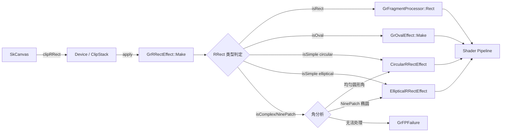
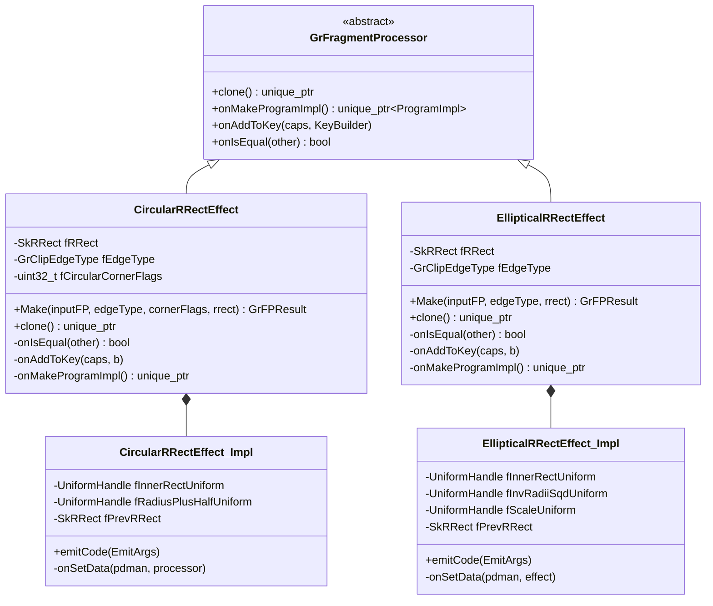
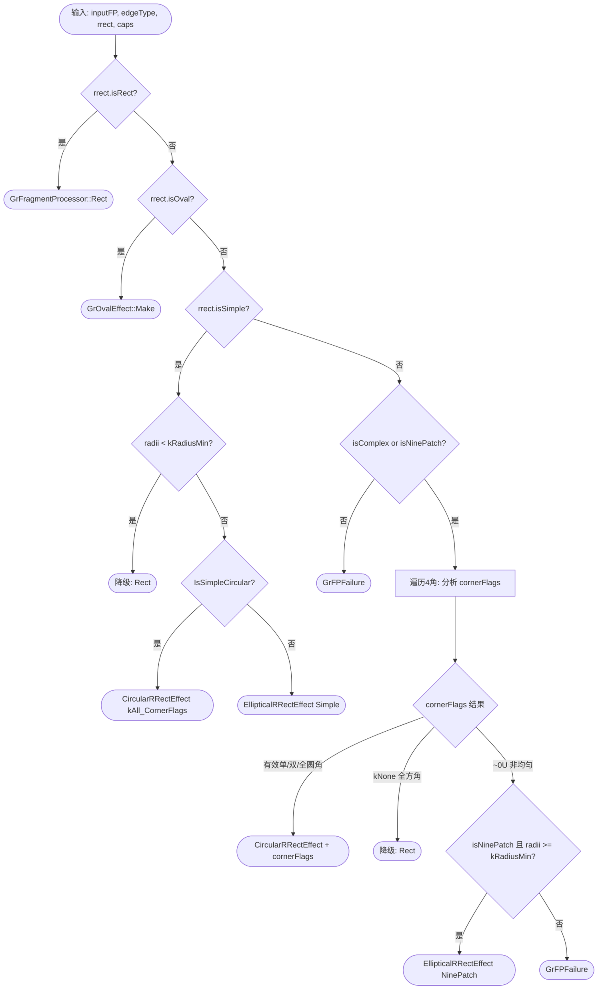
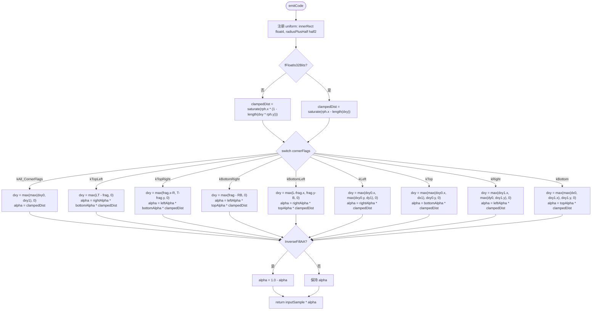
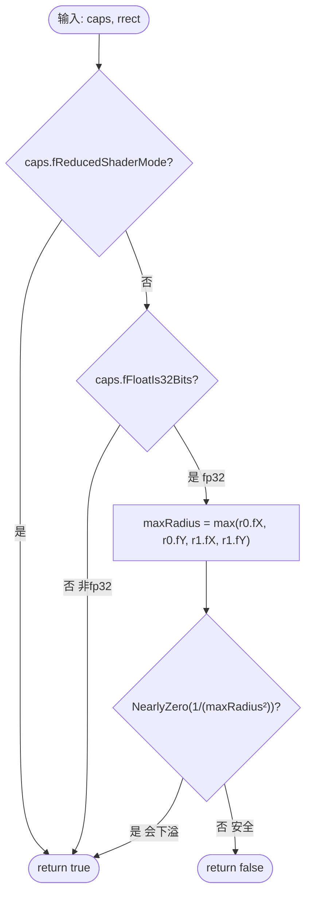
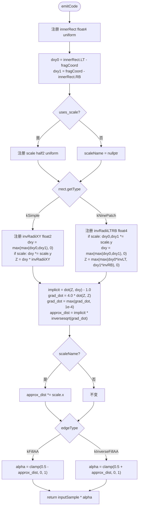

# GrRRectEffect 函数实现参考

> 源码: `src/gpu/ganesh/effects/GrRRectEffect.cpp` (820行)
> 头文件: `src/gpu/ganesh/effects/GrRRectEffect.h`

---

## 类型速查

阅读后续函数流程图前，建议先熟悉以下类型。按职责分为 7 组。

### 1. 自身类型

| 类型 | 含义 |
|------|------|
| `CircularRRectEffect` | 匿名命名空间内部类，处理圆形圆角的片段处理器 |
| `EllipticalRRectEffect` | 匿名命名空间内部类，处理椭圆形圆角的片段处理器 |
| `CornerFlags` | `CircularRRectEffect` 内枚举，位标志标识哪些角为圆形 |
| `GrFPResult` | Fragment Processor 创建结果 (`std::tuple<bool, unique_ptr<GrFP>>`) |
| `CircularRRectEffect::Impl` | 圆形圆角着色器实现 (ProgramImpl 子类) |
| `EllipticalRRectEffect::Impl` | 椭圆圆角着色器实现 (ProgramImpl 子类) |

### 2. 几何数学

| 类型 | 含义 |
|------|------|
| `SkRRect` | 圆角矩形，支持 Rect/Oval/Simple/NinePatch/Complex 类型 |
| `SkRect` | 浮点矩形 (fLeft/fTop/fRight/fBottom) |
| `SkPoint` | 2D 点 (fX, fY) |
| `SkVector` | 2D 向量，同 SkPoint |
| `SkScalar` | 浮点标量 (float) |

### 3. 操作策略

| 类型 | 含义 |
|------|------|
| `GrClipEdgeType` | 裁剪边缘类型 (`kFillAA` / `kInverseFillAA` / `kFillBW` / `kInverseFillBW`) |
| `kRadiusMin` | 文件级常量 (`SK_ScalarHalf = 0.5`)，最小可处理圆角半径 |
| `kGrClipEdgeTypeCnt` | 边缘类型总数，用于位编码校验 |

### 4. 渲染上下文

| 类型 | 含义 |
|------|------|
| `GrShaderCaps` | 着色器硬件能力查询 (`fFloatIs32Bits` / `fReducedShaderMode`) |
| `GrCaps` | GPU 全局能力查询 |
| `GrProcessorTestData` | 单元测试数据上下文 |

### 5. 着色器

| 类型 | 含义 |
|------|------|
| `GrFragmentProcessor` | 片段处理器基类 |
| `ProgramImpl` | `GrFragmentProcessor::ProgramImpl`，着色器程序实现基类 |
| `GrGLSLUniformHandler` | Uniform 变量注册管理器 |
| `GrGLSLProgramDataManager` | Uniform 数据运行时设置接口 |
| `GrGLSLProgramDataManager::UniformHandle` | Uniform 句柄 |
| `GrGLSLFPFragmentBuilder` | 片段着色器代码构建器 |
| `SkSLType` | SkSL 类型枚举 (`kFloat4` / `kFloat2` / `kHalf2`) |

### 6. 纹理资源

| 类型 | 含义 |
|------|------|
| `GrOvalEffect` | 椭圆裁剪效果，RRect 的降级目标 |
| `GrFragmentProcessor::Rect` | 矩形裁剪静态工厂方法 |

### 7. 容器工具

| 类型 | 含义 |
|------|------|
| `skgpu::KeyBuilder` | 着色器缓存键构建器 |
| `SkTCopyOnFirstWrite<T>` | 写时复制包装器 |
| `SkString` | Skia 字符串，用于着色器代码拼接 |
| `SkRRectPriv` | SkRRect 内部工具 (`IsSimpleCircular` / `GetSimpleRadii`) |

---

## GrRRectEffect 在 Skia 工程中的架构位置

| 属性 | 说明 |
|------|------|
| **归属** | `src/gpu/ganesh/effects/` 效果处理层 |
| **接口** | 命名空间工厂 `GrRRectEffect::Make()` → 返回 `GrFragmentProcessor` |
| **上游** | `ClipStack::apply()` / `Device` 裁剪系统调用 |
| **下游** | 生成的 FP 进入 shader pipeline，参与片段着色阶段 |



---

## 架构总览



---

## 1. 工厂函数

### 1.1 `GrRRectEffect::Make()` (line 713-819)

公共入口工厂函数，根据 SkRRect 几何特征自动分发到最优处理器。



---

### 1.2 `CircularRRectEffect::Make()` (line 95-103)

静态工厂，校验 edgeType 后构造 CircularRRectEffect。

| 步骤 | 逻辑 |
|------|------|
| 1 | 检查 edgeType 是否为 `kFillAA` 或 `kInverseFillAA` |
| 2 | 非法类型 → `GrFPFailure(inputFP)` |
| 3 | 合法 → 构造 CircularRRectEffect 并返回 `GrFPSuccess` |

---

### 1.3 `EllipticalRRectEffect::Make()` (line 432-440)

静态工厂，逻辑与 CircularRRectEffect::Make 一致。

| 步骤 | 逻辑 |
|------|------|
| 1 | 检查 edgeType 是否为 `kFillAA` 或 `kInverseFillAA` |
| 2 | 非法类型 → `GrFPFailure(inputFP)` |
| 3 | 合法 → 构造 EllipticalRRectEffect 并返回 `GrFPSuccess` |

---

## 2. CircularRRectEffect 生命周期

### 2.1 构造函数 (line 105-116)

```cpp
CircularRRectEffect(inputFP, edgeType, circularCornerFlags, rrect)
```

| 操作 | 说明 |
|------|------|
| 调用基类 | 传入 `kCircularRRectEffect_ClassID`，计算优化标志 |
| 存储字段 | fRRect, fEdgeType, fCircularCornerFlags |
| 注册子 FP | `registerChild(inputFP)` 作为 child 0 |

---

### 2.2 `clone()` (line 124-126)

拷贝构造，调用私有拷贝构造函数 (line 118-122) 复制所有字段和子处理器。

---

### 2.3 `onIsEqual()` (line 128-132)

比较 `fEdgeType` 和 `fRRect`。注释说明 cornerFlags 可由 fRRect 推导，无需单独比较。

---

### 2.4 `onAddToKey()` (line 390-393)

将 cornerFlags (高位) 和 edgeType (低3位) 编码为单个 uint32 写入 KeyBuilder。

```
key = (fCircularCornerFlags << 3) | edgeType
```

---

### 2.5 `onMakeProgramImpl()` (line 395-397)

返回 `std::make_unique<Impl>()`。

---

## 3. CircularRRectEffect::Impl 着色器实现

### 3.1 `emitCode()` (line 171-306)

为各种 cornerFlags 组合生成距离计算着色器代码。



---

### 3.2 `onSetData()` (line 308-386)

根据 cornerFlags 计算 innerRect uniform 的偏移方式，并设置 radiusPlusHalf。

| cornerFlags | 取 radius 来源 | innerRect 调整 |
|---|---|---|
| `kAll` | SimpleRadii.fX | rect.inset(r, r) |
| `kTopLeft` | UpperLeft.fX | L+=r, T+=r, R+=0.5, B+=0.5 |
| `kTopRight` | UpperRight.fX | L-=0.5, T+=r, R-=r, B+=0.5 |
| `kBottomRight` | LowerRight.fX | L-=0.5, T-=0.5, R-=r, B-=r |
| `kBottomLeft` | LowerLeft.fX | L+=r, T-=0.5, R+=0.5, B-=r |
| `kLeft` | UpperLeft.fX | L+=r, T+=r, R+=0.5, B-=r |
| `kTop` | UpperLeft.fX | L+=r, T+=r, R-=r, B+=0.5 |
| `kRight` | UpperRight.fX | L-=0.5, T+=r, R-=r, B-=r |
| `kBottom` | LowerLeft.fX | L+=r, T-=0.5, R-=r, B-=r |

最后设置 `radiusPlusHalf = (radius + 0.5, 1.0 / (radius + 0.5))`。使用 `fPrevRRect` 缓存避免重复计算。

---

## 4. EllipticalRRectEffect 生命周期

### 4.1 构造函数 (line 442-451)

```cpp
EllipticalRRectEffect(inputFP, edgeType, rrect)
```

| 操作 | 说明 |
|------|------|
| 调用基类 | 传入 `kEllipticalRRectEffect_ClassID`，计算优化标志 |
| 存储字段 | fRRect, fEdgeType |
| 注册子 FP | `registerChild(inputFP)` |

---

### 4.2 `clone()` (line 458-460)

通过私有拷贝构造函数 (line 453-456) 复制 fRRect 和 fEdgeType。

---

### 4.3 `onIsEqual()` (line 462-465)

比较 `fEdgeType` 和 `fRRect`。

---

### 4.4 `onAddToKey()` (line 699-705)

编码三个维度到 KeyBuilder:

| 位段 | 内容 |
|------|------|
| 2 bits | `fEdgeType` (kFillAA / kInverseFillAA) |
| 3 bits | `fRRect.getType()` (Simple / NinePatch) |
| 1 bit | `elliptical_effect_uses_scale()` 是否启用缩放 |

---

### 4.5 `onMakeProgramImpl()` (line 707-709)

返回 `std::make_unique<Impl>()`。

---

## 5. EllipticalRRectEffect::Impl 着色器实现

### 5.1 `elliptical_effect_uses_scale()` (line 513-530)

独立函数，判定是否需要坐标缩放以避免精度问题。



---

### 5.2 `emitCode()` (line 545-636)

生成椭圆距离着色器代码，分 Simple 和 NinePatch 两条路径。



---

### 5.3 `onSetData()` (line 638-695)

设置 innerRect、invRadiiSqd、scale 三组 uniform，根据 RRect 类型分支。

| 类型 | innerRect 计算 | invRadiiSqd | scale |
|---|---|---|---|
| **Simple** | `rect.inset(r0.fX, r0.fY)` | 无 scale: `(1/r0.x², 1/r0.y²)` | `(max(r0.x,r0.y), 1/max)` |
| **Simple + scale** | 同上 | `(1, r0.x²/r0.y²)` 或 `(r0.y²/r0.x², 1)` | 取较大半径 |
| **NinePatch** | `L+=r0.x, T+=r0.y, R-=r1.x, B-=r1.y` | 无 scale: `(1/r0.x², 1/r0.y², 1/r1.x², 1/r1.y²)` | — |
| **NinePatch + scale** | 同上 | `(s²/r0.x², s²/r0.y², s²/r1.x², s²/r1.y²)` | `(s, 1/s)` s=maxRadius |

使用 `fPrevRRect` 缓存避免每帧重复计算。

---

## 附录 A: Make() 分发策略状态机

```mermaid
stateDiagram-v2
    [*] --> Rect : isRect()
    [*] --> Oval : isOval()
    [*] --> Simple : isSimple()
    [*] --> ComplexOrNine : isComplex/isNinePatch()

    Simple --> RectFallback : radii < 0.5
    Simple --> CircularAll : IsSimpleCircular
    Simple --> EllipticalSimple : 椭圆形半径

    ComplexOrNine --> CornerAnalysis : 遍历4角

    CornerAnalysis --> CircularTab : 有效 cornerFlags 组合
    CornerAnalysis --> RectFallback : kNone_CornerFlags
    CornerAnalysis --> EllipticalNine : NinePatch 且 radii 合法
    CornerAnalysis --> Failure : 无法处理

    Rect --> [*] : GrFragmentProcessor::Rect
    Oval --> [*] : GrOvalEffect::Make
    RectFallback --> [*] : GrFragmentProcessor::Rect
    CircularAll --> [*] : CircularRRectEffect
    CircularTab --> [*] : CircularRRectEffect
    EllipticalSimple --> [*] : EllipticalRRectEffect
    EllipticalNine --> [*] : EllipticalRRectEffect
    Failure --> [*] : GrFPFailure
```

---

## 附录 B: CornerFlags 位标志组合

`CircularRRectEffect` 的 `fCircularCornerFlags` 支持 10 种有效组合：

| 枚举名 | 值 (二进制) | 语义 |
|---|---|---|
| `kNone_CornerFlags` | `0000` | 全方角 → 降级为矩形 |
| `kTopLeft_CornerFlag` | `0001` | 仅左上圆角 |
| `kTopRight_CornerFlag` | `0010` | 仅右上圆角 |
| `kBottomRight_CornerFlag` | `0100` | 仅右下圆角 |
| `kBottomLeft_CornerFlag` | `1000` | 仅左下圆角 |
| `kLeft_CornerFlags` | `1001` | 左侧两角圆形 |
| `kTop_CornerFlags` | `0011` | 顶部两角圆形 |
| `kRight_CornerFlags` | `0110` | 右侧两角圆形 |
| `kBottom_CornerFlags` | `1100` | 底部两角圆形 |
| `kAll_CornerFlags` | `1111` | 四角全圆形 |

着色器变体数：10 组合 × 2 edgeType = 20 个变体。

---

## 附录 C: 着色器精度优化策略

| 条件 | CircularRRectEffect | EllipticalRRectEffect |
|---|---|---|
| **fp32 设备** | `saturate(rph.x - length(dxy))` 直接计算 | 直接 `1/r²`，无缩放 |
| **非 fp32 设备** | `saturate(rph.x * (1.0 - length(dxy * rph.y)))` 归一化避免溢出 | 启用 scale uniform，坐标归一化后再还原 |
| **大半径 fp32** | 无特殊处理 (圆形 length 无下溢风险) | 检测 `1/r²≈0` 时启用 scale |
| **reducedShaderMode** | 无影响 | 强制启用 scale 保持着色器一致性 |

**EllipticalRRectEffect 缩放原理**:
1. 选择最大半径 `s = max(all radii)` 作为缩放因子
2. 坐标空间除以 `s`：`dxy *= 1/s`
3. invRadii 预乘 `s²`：`invRadiiSqd *= s²`
4. 计算出的 approx_dist 再乘回 `s`
5. 效果：将运算移到 `[0,1]` 附近，避免小数下溢
