# GrTextureEffect 函数实现参考

> 源码: `src/gpu/ganesh/effects/GrTextureEffect.cpp` (871行)
> 头文件: `src/gpu/ganesh/effects/GrTextureEffect.h` (219行)

---

## 类型速查

阅读后续函数流程图前，建议先熟悉以下类型。按职责分为 7 组。

### 1. 自身类型

| 类型 | 含义 |
|------|------|
| `GrTextureEffect` | 纹理采样 Fragment Processor，继承 `GrFragmentProcessor` |
| `GrTextureEffect::Impl` | ProgramImpl 子类，负责 emitCode 和 onSetData |
| `GrTextureEffect::Sampling` | 内部结构体，封装 HW/Shader 采样策略决策结果 |
| `ShaderMode` | 枚举 (9 种)，描述 wrap mode 的 shader 实现方式 |
| `Sampling::Span` | 内部辅助结构体，表示一维 [fA, fB] 区间 |
| `Sampling::Result1D` | 内部辅助结构体，单轴解析结果 (ShaderMode + subset + clamp + HWWrap) |

### 2. 几何/数学

| 类型 | 含义 |
|------|------|
| `SkMatrix` | 3x3 变换矩阵，用于坐标变换 (Make 参数、coordAdjustmentMatrix) |
| `SkRect` | 浮点矩形 (fSubset / fClamp / subset / domain 参数) |
| `SkIRect` | 整数矩形 (由 SkRect::Make 转换 proxy dimensions) |
| `SkISize` | 整数尺寸 (proxy.backingStoreDimensions() 返回值) |
| `SkPoint` | 2D 点 (.h 头文件 include) |
| `SkVector` | 2D 向量 (linearFilterInset 参数类型，等同于 SkPoint) |

### 3. 纹理/代理资源

| 类型 | 含义 |
|------|------|
| `GrSurfaceProxyView` | 代理 + origin + swizzle 组合视图 (fView 字段) |
| `GrTextureProxy` | 纹理代理 (延迟分配的纹理句柄) |
| `GrSurfaceProxy` | 代理基类 (Sampling 构造函数参数) |
| `GrTexture` | 实际 GPU 纹理对象 (texture() 返回) |
| `GrTextureType` | 纹理类型枚举 (`k2D` / `kRectangle` / `kExternal`) |
| `GrSurfaceOrigin` | 纹理原点方向 (`kTopLeft_GrSurfaceOrigin` / `kBottomLeft_GrSurfaceOrigin`) |
| `skgpu::Mipmapped` | 是否有 mipmap (`kYes` / `kNo`) |

### 4. 采样配置

| 类型 | 含义 |
|------|------|
| `GrSamplerState` | 采样器状态 (wrap mode x filter x mipmap) |
| `GrSamplerState::Filter` | 滤波模式枚举 (`kNearest` / `kLinear`) |
| `GrSamplerState::WrapMode` | 环绕模式枚举 (`kClamp` / `kRepeat` / `kMirrorRepeat` / `kClampToBorder`) |
| `GrSamplerState::MipmapMode` | Mipmap 模式枚举 (`kNone` / `kNearest` / `kLinear`) |
| `SkAlphaType` | Alpha 类型枚举 (`kPremul` / `kUnpremul` / `kOpaque`) |
| `SkFilterMode` | 滤波模式 (aniso 降级时使用 `SkFilterMode::kLinear`) |
| `SkSamplingOptions` | 采样选项 (.h include，封装 filter + mipmap) |

### 5. Fragment Processor 框架

| 类型 | 含义 |
|------|------|
| `GrFragmentProcessor` | Fragment Processor 基类 |
| `GrFragmentProcessor::ProgramImpl` | GPU 程序实现基类 |
| `GrMatrixEffect` | 坐标变换 FP，包装 GrTextureEffect 处理矩阵 |
| `GrCaps` | GPU 能力查询 (ClampToBorder / NPOT / aniso 支持) |
| `GrShaderCaps` | Shader 能力查询 |
| `skgpu::KeyBuilder` | Program cache key 构建器 |
| `GrProcessorUnitTest` / `GrProcessorTestData` | 单元测试框架 (TestCreate) |
| `kGrTextureEffect_ClassID` | FP 类唯一标识常量 |

### 6. Shader 构建

| 类型 | 含义 |
|------|------|
| `GrGLSLShaderBuilder` | GLSL shader 代码构建器 |
| `GrGLSLFragmentShaderBuilder` | Fragment shader 特化构建器 (emitCode 中 `args.fFragBuilder`) |
| `GrGLSLProgramDataManager` | Uniform 数据管理器 (set2fv / set4fv) |
| `GrGLSLUniformHandler` | Uniform 声明/注册器 |
| `GrGLSLShaderBuilder::SamplerHandle` | 纹理采样器句柄 |
| `UniformHandle` | Uniform 变量句柄 (fSubsetUni / fClampUni / fIDimsUni / fBorderUni) |
| `SkSLType` | SkSL 类型枚举 (`kFloat2` / `kFloat4` / `kHalf4`，声明 uniform 时使用) |
| `kFragment_GrShaderFlag` | Shader 阶段标志 (声明 fragment uniform 时使用) |
| `SkString` | 字符串工具 (emitCode 中构建归一化坐标表达式) |

### 7. 容器/工具

| 类型 | 含义 |
|------|------|
| `std::unique_ptr<GrFragmentProcessor>` | FP 智能指针 (工厂方法返回值) |
| `std::copy_n` | 数组拷贝 (复制 border[4] 和 fBorder) |
| `std::swap` | 交换 (onSetData 中 Y 翻转后 swap rect[1]/rect[3]) |
| `std::floor` / `std::ceil` | 数学取整 (resolve 中 nearest filter 的 isubset 计算) |
| `SkRandom` | 随机数生成器 (TestCreate 中使用) |
| `GrTest::TestWrapModes` / `GrTest::TestMatrix` | 测试工具函数 |

---

## GrTextureEffect 在 Skia 工程中的架构位置

| 属性 | 说明 |
|------|------|
| **归属** | `src/gpu/ganesh/effects/` — Ganesh Fragment Processor 效果层 |
| **基类** | `GrFragmentProcessor` |
| **上游** | 图像绘制、着色器效果、`GrYUVtoRGBEffect` 等所有需纹理采样的场景 |
| **下游** | 被 `GrMatrixEffect::Make()` 包装后加入 FP 树 -> GPU pipeline -> 纹理采样 |
| **设计模式** | 工厂模式 (静态 `Make`/`MakeSubset` 方法) + 策略模式 (Sampling 选择 HW/Shader) |

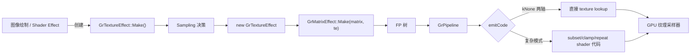

---

## 架构总览

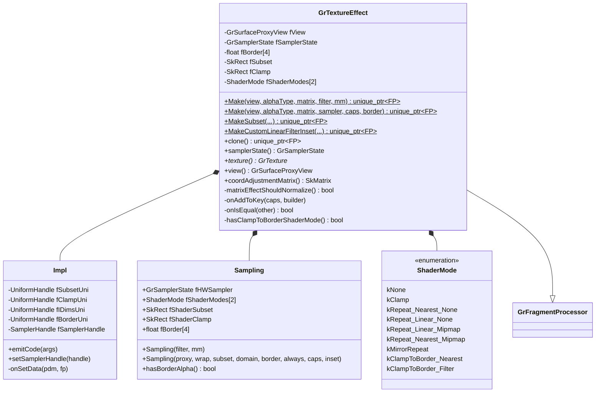

---

## 1. 工厂方法 (line 217-301)

所有工厂方法共享模式:
1. 构造 `Sampling` 对象决定 HW/Shader 策略
2. `new GrTextureEffect(view, alphaType, sampling)` 创建实例
3. `GrMatrixEffect::Make(matrix, te)` 包装坐标变换

---

### 1.1 `Make(view, alphaType, matrix, filter, mm)` (line 217-227)

最简版本，使用硬件 Clamp 模式，无 subset 约束。

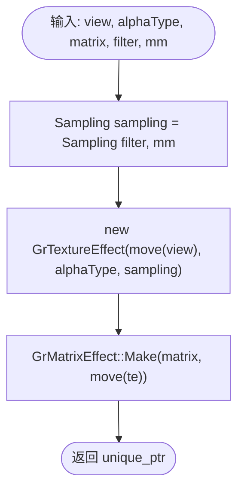

`Sampling(filter, mm)` 只设置 `fHWSampler`，两轴 ShaderMode 默认 `kNone`。

---

### 1.2 `Make(view, alphaType, matrix, sampler, caps, border)` (line 229-246)

完整采样器版本，subset 为代理的完整尺寸，domain 为 nullptr。

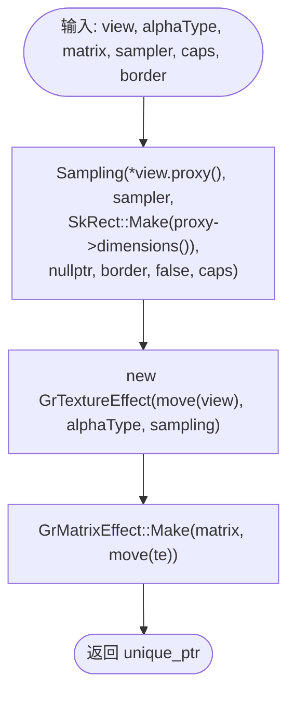

---

### 1.3 `MakeSubset(view, ..., subset, caps, border, alwaysUseShaderTileMode)` (line 248-267)

带显式 subset 约束，无 domain 优化。

---

### 1.4 `MakeSubset(view, ..., subset, domain, caps, border)` (line 269-282)

带 subset + domain 的版本。domain 用于优化：若已知坐标范围不超出 subset，可跳过 shader 裁剪。

---

### 1.5 `MakeCustomLinearFilterInset(...)` (line 284-301)

自定义线性滤波 inset 距离。强制使用 `Filter::kLinear`，允许 subset 边界处的邻近像素参与滤波。

```cpp
GrSamplerState sampler(wx, wy, Filter::kLinear);
Sampling sampling(*view.proxy(), sampler, subset, domain, border, false, caps, inset);
```

---

## 2. Sampling 策略决策 (line 58-204)

`Sampling` 构造函数是整个类的核心决策逻辑，为每个轴独立选择 HW 硬件模式或 Shader 软件模式。

---

### 2.1 Sampling 构造函数总体流程 (line 58-204)

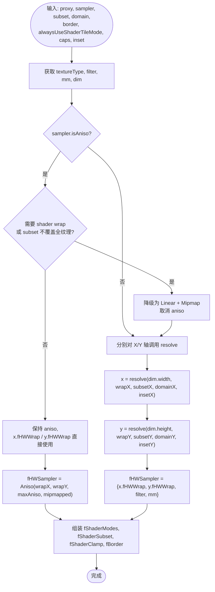

---

### 2.2 `canDoWrapInHW()` 硬件支持检测 (line 90-107)

闭包函数，判断某轴是否可用硬件 wrap mode。

| 检查条件 | 不可用时原因 |
|---------|------------|
| `alwaysUseShaderTileMode == true` | 调用者强制要求 shader 模式 |
| `ClampToBorder && (!caps.clampToBorderSupport() \|\| border非零)` | HW 不支持 border color 或需非黑色 border |
| `非 Clamp && !caps.npotTextureTileSupport() && !SkIsPow2(size)` | NPOT 纹理不支持 repeat/mirror |
| `非 k2D 纹理类型 && 非 Clamp/ClampToBorder` | Rectangle/External 纹理只支持 Clamp |

---

### 2.3 各向异性降级逻辑 (line 116-133)

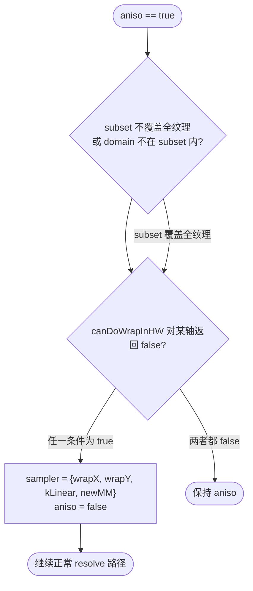

`newMM` 取决于纹理是否有 mipmap: 有则 `kLinear`，无则 `kNone`。

---

### 2.4 `resolve()` 单轴解析 — 核心决策逻辑 (line 135-174)

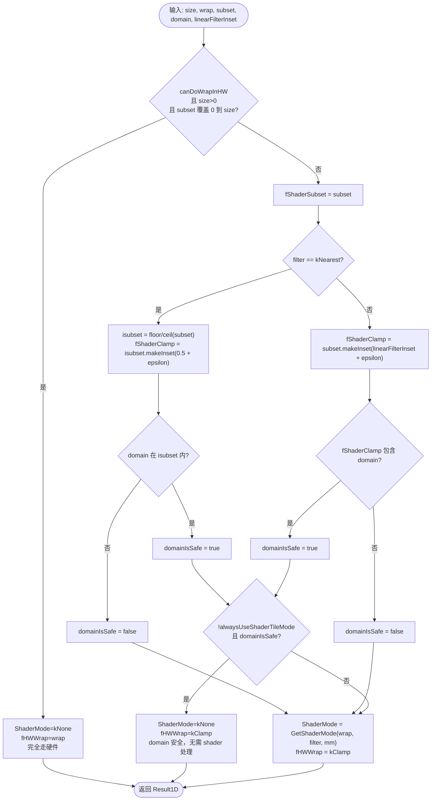

**域安全优化** (domainIsSafe): 当已知坐标范围不会访问 subset 外的纹素时，wrap mode 实际无效果，可安全使用硬件 Clamp 跳过所有 shader 逻辑。

---

### 2.5 `hasBorderAlpha()` (line 206-215)

判断采样结果是否可能包含非不透明 border alpha:
- HW wrapMode 为 ClampToBorder -> `true`
- Shader ClampToBorder 模式 + `fBorder[3] < 1.0` -> `true`

---

## 3. ShaderMode 选择与辅助 (line 321-370)

---

### 3.1 `GetShaderMode()` — Wrap x Filter x Mipmap 映射 (line 321-351)

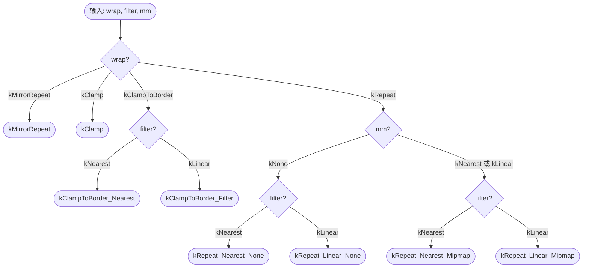

---

### 3.2 `ShaderModeIsClampToBorder()` / `ShaderModeRequiresUnormCoord()` (line 353-370)

| ShaderMode | IsClampToBorder | RequiresUnormCoord |
|------------|:---:|:---:|
| kNone | - | - |
| kClamp | - | - |
| kRepeat_Nearest_None | - | - |
| kRepeat_Linear_None | - | Y |
| kRepeat_Nearest_Mipmap | - | Y |
| kRepeat_Linear_Mipmap | - | Y |
| kMirrorRepeat | - | - |
| kClampToBorder_Nearest | Y | Y |
| kClampToBorder_Filter | Y | Y |

`RequiresUnormCoord` 为 true 的模式需要在 shader 中使用非归一化坐标计算，最终通过 `idims` uniform 归一化后采样。

---

## 4. Shader 代码生成 — `Impl::emitCode()` (line 372-735)

这是整个文件最复杂的函数，负责根据 ShaderMode 生成 GLSL 代码。

---

### 4.1 简单路径 (line 378-383)

当两轴都是 `ShaderMode::kNone` 时，直接输出纹理查找:

```glsl
return sample(sampler, coord);
```

---

### 4.2 复杂路径总体流程 (line 384-734)

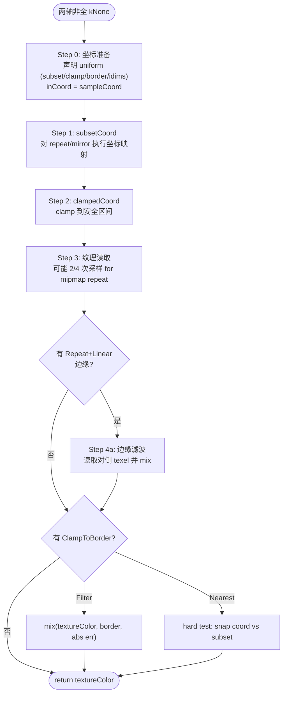

---

### 4.3 Step 0: 坐标准备 + uniform 声明 (line 402-471)

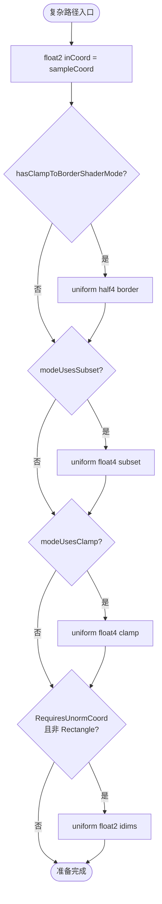

---

### 4.4 Step 1: `subsetCoord()` — repeat/mirror 坐标映射 (line 487-555)

lambda 函数，按 ShaderMode 生成不同的坐标映射代码:

| ShaderMode | 坐标计算 |
|-----------|---------|
| kNone / kClamp / kClampToBorder_* | `subsetCoord = inCoord` (pass-through) |
| kRepeat_*_None | `mod(inCoord - subset.start, subset.stop - subset.start) + subset.start` |
| kRepeat_*_Mipmap | 双相位 mirror-repeat + 权重 (用于 LOD 混合) |
| kMirrorRepeat | `mix(m, w2-m, step(w, m)) + subset.start` |

**Mipmap Repeat 原理**: 生成两组相位相反的坐标 (`subsetCoord` + `extraRepeatCoord`)，通过锯齿波权重 (`repeatCoordWeight`) 在反射点附近平滑过渡，避免 mipmap 采样跨 subset 边界。

---

### 4.5 Step 2: `clampCoord()` — 子集内 clamp (line 557-569)

```glsl
// 当 useClamp 为 true:
clampedCoord = clamp(subsetCoord, clamp.xy, clamp.zw);
// 否则:
clampedCoord = subsetCoord;
```

对 mipmap repeat 的 `extraRepeatCoord` 也执行额外的 clamp (line 608-617)。

---

### 4.6 Step 3: 纹理读取 (line 619-643)

根据 mipmap repeat 模式决定采样次数:

| 条件 | 采样次数 | 混合方式 |
|------|---------|---------|
| mipmapRepeatX && mipmapRepeatY | 4 | `mix(mix(s00, s10, wX), mix(s01, s11, wX), wY)` |
| 仅 mipmapRepeatX | 2 | `mix(s0, s1, wX)` |
| 仅 mipmapRepeatY | 2 | `mix(s0, s1, wY)` |
| 两者都不是 | 1 | 直接 `sample(clampedCoord)` |

---

### 4.7 Step 4a: Repeat+Linear 边缘滤波 (line 645-703)

当 `kRepeat_Linear_*` 模式时，处理 subset 边缘处的滤波跨界问题:

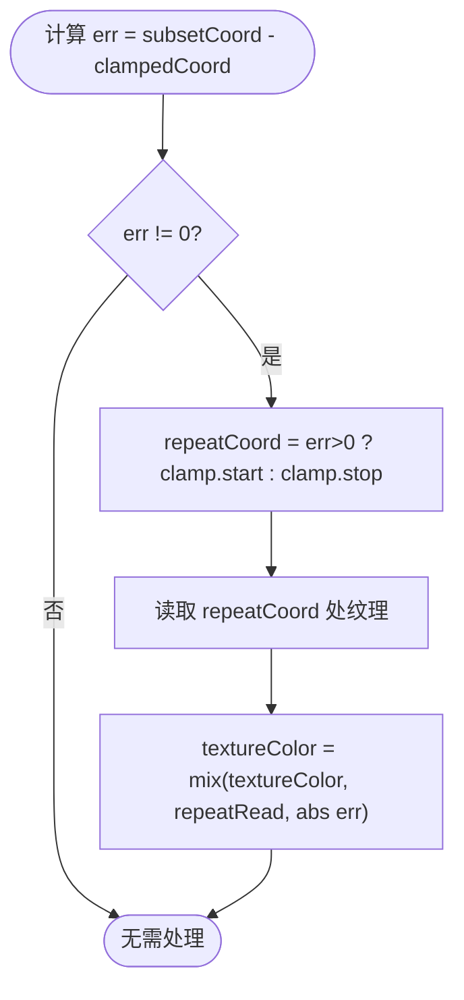

当两轴都是 Repeat+Linear 时，可能需要 3 次额外读取 (corner case: `errX != 0 && errY != 0` -> 4 个采样点双线性混合)。

---

### 4.8 Step 4b: ClampToBorder 边缘处理 (line 705-733)

**kClampToBorder_Filter** (软边缘, line 707-712):
```glsl
textureColor = mix(textureColor, border, min(abs(err), 1));
```

**kClampToBorder_Nearest** (硬边缘, line 714-732):
```glsl
float snapped = floor(inCoord + 0.001) + 0.5;
if (snapped < subset.start || snapped > subset.stop) {
    textureColor = border;
}
```

---

## 5. Uniform 数据设置 — `Impl::onSetData()` (line 737-781)

---

### 5.1 坐标空间转换逻辑 (line 737-768)

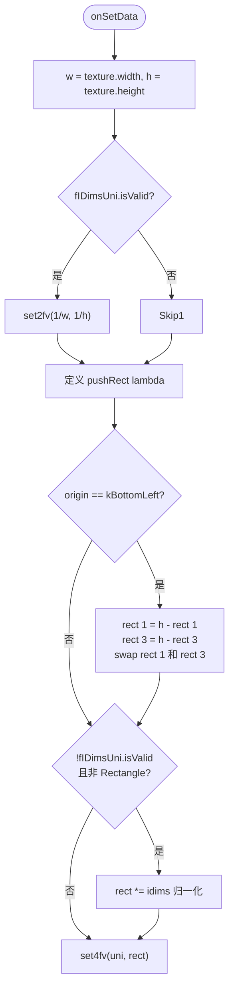

---

### 5.2 subset/clamp/border uniform 更新 (line 770-781)

| Uniform | 条件 | 数据来源 |
|---------|------|---------|
| `fSubsetUni` | `isValid()` | `te.fSubset` 经 pushRect 变换 |
| `fClampUni` | `isValid()` | `te.fClamp` 经 pushRect 变换 |
| `fBorderUni` | `isValid()` | `te.fBorder[4]` 直接上传 |

---

## 6. 其他关键方法 (line 303-852)

---

### 6.1 `coordAdjustmentMatrix()` (line 303-319)

计算 `GrMatrixEffect` 需要的额外坐标变换矩阵:

| 条件 | 矩阵 |
|------|------|
| `matrixEffectShouldNormalize()` + `kBottomLeft` | `ScaleTranslate(1/w, -1/h, 0, 1)` |
| `matrixEffectShouldNormalize()` + `kTopLeft` | `Scale(1/w, 1/h)` |
| 不需归一化 + `kBottomLeft` | `ScaleTranslate(1, -1, 0, h)` |
| 不需归一化 + `kTopLeft` | `Identity` |

---

### 6.2 `onAddToKey()` (line 787-793)

将两个轴的 ShaderMode 写入 program cache key:

```cpp
b->addBits(8, static_cast<uint32_t>(fShaderModes[0]), "shaderMode0");
b->addBits(8, static_cast<uint32_t>(fShaderModes[1]), "shaderMode1");
```

---

### 6.3 `onIsEqual()` (line 795-813)

判断两个 GrTextureEffect 是否等价:

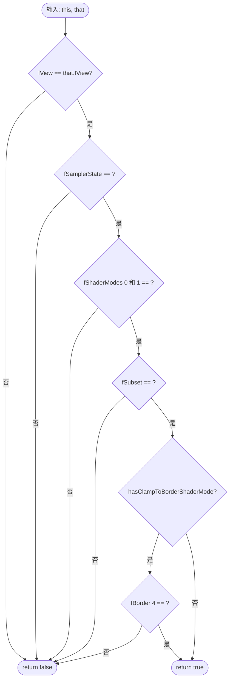

---

### 6.4 `matrixEffectShouldNormalize()` (line 815-819)

返回 true 当满足: 纹理非 Rectangle **且** 两轴都不需要非归一化坐标。

此时 `GrMatrixEffect` 可在坐标变换中直接预乘 `1/w, 1/h` 归一化，避免 shader 中额外的 `idims` 乘法。

---

### 6.5 构造函数 (line 821-848)

**主构造函数** (line 821-837):
- 设置 `ClassID = kGrTextureEffect_ClassID`
- 调用 `ModulateForSamplerOptFlags(alphaType, hasBorderAlpha)` 计算优化标志
- 拷贝 `fView`, `fSamplerState`, `fSubset`, `fClamp`, `fShaderModes`, `fBorder`
- 调用 `setUsesSampleCoordsDirectly()` 标记直接使用采样坐标
- Assert: ShaderMode 为 kNone 时 subset 必须为 `{0, 0, 0, 0}`

**拷贝构造函数** (line 839-848):
- 用于 `clone()`，直接复制所有字段

---

### 6.6 `clone()` (line 850-852)

```cpp
return std::unique_ptr<GrFragmentProcessor>(new GrTextureEffect(*this));
```

---

### 6.7 `onMakeProgramImpl()` (line 783-785)

```cpp
return std::make_unique<Impl>();
```

---

### 6.8 `TestCreate()` (line 856-871)

`#if defined(GPU_TEST_UTILS)` 条件编译的测试工厂，使用随机 wrap mode、filter、matrix 创建 GrTextureEffect 实例用于 fuzzing。

---

## 附录 A: ShaderMode x WrapMode 完整映射表

| WrapMode | Filter | MipmapMode | ShaderMode | 特征 |
|----------|--------|-----------|------------|------|
| Clamp | * | * | kClamp | 简单 shader clamp |
| Repeat | Nearest | None | kRepeat_Nearest_None | mod 映射 |
| Repeat | Linear | None | kRepeat_Linear_None | mod + 边缘混合 |
| Repeat | Nearest | Nearest/Linear | kRepeat_Nearest_Mipmap | 双相位 + LOD 权重 |
| Repeat | Linear | Nearest/Linear | kRepeat_Linear_Mipmap | 双相位 + LOD + 边缘混合 |
| MirrorRepeat | * | * | kMirrorRepeat | mirror-mod 映射 |
| ClampToBorder | Nearest | * | kClampToBorder_Nearest | 硬边缘 snap 测试 |
| ClampToBorder | Linear/Mipmap | * | kClampToBorder_Filter | 软边缘 err 混合 |

---

## 附录 B: Sampling 决策状态图

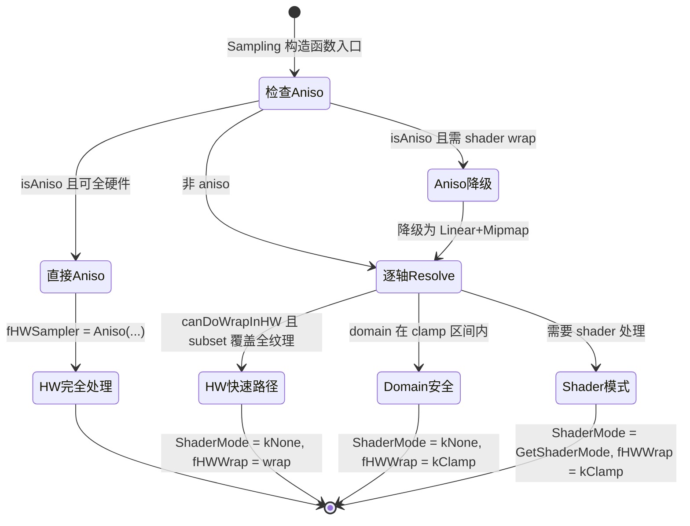

---

## 附录 C: emitCode 生成的 GLSL 代码结构示例

以 `kRepeat_Linear_None` (X轴) + `kNone` (Y轴) 为例:

```glsl
// Step 0: 坐标准备
float2 inCoord = sk_TransformedCoords2D[0];

// Step 1: subsetCoord (X 轴 repeat)
float2 subsetCoord;
subsetCoord.x = mod(inCoord.x - subset.x, subset.z - subset.x) + subset.x;
subsetCoord.y = inCoord.y;  // Y 轴 pass-through

// Step 2: clampedCoord
float2 clampedCoord;
clampedCoord = clamp(subsetCoord, clamp.xy, clamp.zw);

// Step 3: 纹理读取
half4 textureColor = sample(sampler, clampedCoord * idims);

// Step 4a: Repeat+Linear 边缘滤波 (仅 X 轴)
half errX = half(subsetCoord.x - clampedCoord.x);
if (errX != 0) {
    float repeatCoordX = errX > 0 ? clamp.x : clamp.z;
    half4 repeatSample = sample(sampler, float2(repeatCoordX, clampedCoord.y) * idims);
    textureColor = mix(textureColor, repeatSample, abs(errX));
}

return textureColor;
```

**关键点**:
- `subset` uniform 存储 repeat 周期的起止坐标
- `clamp` uniform 存储安全采样区间 (inset 0.5 + epsilon)
- `idims` = `{1/width, 1/height}` 用于最终归一化
- `errX` 非零意味着坐标被 clamp 移动了，需要从 subset 另一侧采样并混合

---

## 附录 D: 纹理绑定管线 — fView 如何到达 GPU

> **核心问题**: 为什么在 `onSetData()` 中看不到 `setUniform(texture)` 的调用？
>
> 因为纹理**不是**普通 uniform。GPU API (GL/VK/Metal) 将纹理绑定到独立的 **sampler slot**（纹理单元），
> 而非 uniform buffer。Skia 通过 **编译时注册 sampler handle + 运行时遍历绑定** 两阶段完成纹理传递，
> 完全绕过了 `onSetData` / `GrGLSLProgramDataManager` 路径。

---

### D.1 编译时: Sampler Handle 注册

程序编译阶段，`GrGLSLProgramBuilder` 遍历 FP 树为每个 `GrTextureEffect` 注册一个 sampler：

```
GrGLSLProgramBuilder::emitTextureSamplersForFPs()          // line 153-175
  └─ fp.visitWithImpls([&](fp, impl) {
        if (auto* te = fp.asTextureEffect()) {
            name = "TextureSampler_N"                       // 全局递增编号
            format   = te->view().proxy()->backendFormat()
            swizzle  = te->view().swizzle()
            state    = te->samplerState()
            handle   = this->emitSampler(format, state, swizzle, name)   // line 450-456
            impl.setSamplerHandle(handle)                   // 存入 Impl::fSamplerHandle
        }
     })
```

`emitSampler()` 最终调用 `uniformHandler()->addSampler()`：

| 步骤 | 函数 | 位置 |
|------|------|------|
| 1. 生成 mangled 名称 | `nameVariable('u', name)` | `GrGLUniformHandler.cpp:89` |
| 2. 确定 sampler 类型 | `SkSLCombinedSamplerTypeForTextureType(type)` | `GrGLUniformHandler.cpp:94-95` |
| 3. 创建 GLUniformInfo | 设置 visibility=Fragment | `GrGLUniformHandler.cpp:93-100` |
| 4. 写入 fSamplers 数组 | `fSamplers.push_back(info)` | `GrGLUniformHandler.cpp:102` |
| 5. 记录 swizzle | `fSamplerSwizzles.push_back(swizzle)` | `GrGLUniformHandler.cpp:103` |
| 6. 返回 handle (索引) | `SamplerHandle(fSamplers.count()-1)` | `GrGLUniformHandler.cpp:106` |

> **源码**: `src/gpu/ganesh/gl/GrGLUniformHandler.cpp` line 80-107

---

### D.2 Shader 代码生成: appendTextureLookup

`GrTextureEffect::Impl::emitCode()` 中通过 `fSamplerHandle` 生成采样调用：

```cpp
// src/gpu/ganesh/glsl/GrGLSLShaderBuilder.cpp line 101-107
void GrGLSLShaderBuilder::appendTextureLookup(SkString* out,
                                              SamplerHandle samplerHandle,
                                              const char* coordName) const {
    const char* sampler = fProgramBuilder->samplerVariable(samplerHandle);
    out->appendf("sample(%s, %s)", sampler, coordName);
    append_texture_swizzle(out, fProgramBuilder->samplerSwizzle(samplerHandle));
}
```

生成的 GLSL 类似：
```glsl
uniform sampler2D u_TextureSampler_0;   // 由 addSampler 声明
...
vec4 color = sample(u_TextureSampler_0, coord).rgba;
```

---

### D.3 运行时: 纹理绑定 (绕过 onSetData)

每次 draw 调用时，backend 通过 `GrPipeline::visitTextureEffects()` 遍历所有 `GrTextureEffect`，
直接从 `fView` 中提取 GPU 纹理对象并绑定到对应 slot：

**GL 路径** (`src/gpu/ganesh/gl/GrGLProgram.cpp` line 136-162):

```cpp
void GrGLProgram::bindTextures(..., const GrPipeline& pipeline) {
    // 1. 绑定 GeometryProcessor 纹理
    int nextTexSamplerIdx = geomProc.numTextureSamplers();
    // 2. 绑定 dst texture (如果有)
    if (dstTexture) { fGpu->bindTexture(nextTexSamplerIdx++, ...); }
    // 3. 绑定所有 FP 纹理 — 这里就是 GrTextureEffect 的纹理!
    pipeline.visitTextureEffects([&](const GrTextureEffect& te) {
        GrSamplerState samplerState = te.samplerState();
        skgpu::Swizzle swizzle = te.view().swizzle();
        auto* texture = static_cast<GrGLTexture*>(te.texture());
        fGpu->bindTexture(nextTexSamplerIdx++, samplerState, swizzle, texture);
    });
}
```

**Vulkan 路径** (`src/gpu/ganesh/vk/GrVkPipelineState.cpp` line 161-165):

```cpp
pipeline.visitTextureEffects([&](const GrTextureEffect& te) {
    GrSamplerState samplerState = te.samplerState();
    auto* texture = static_cast<GrVkTexture*>(te.texture());
    samplerBindings[currTextureBinding++] = {samplerState, texture};
});
```

**GrPipeline::visitTextureEffects** (`src/gpu/ganesh/GrPipeline.cpp` line 103-108):

```cpp
void GrPipeline::visitTextureEffects(
        const std::function<void(const GrTextureEffect&)>& func) const {
    for (auto& fp : fFragmentProcessors) {
        fp->visitTextureEffects(func);   // 递归遍历 FP 树
    }
}
```

**GrFragmentProcessor::visitTextureEffects** (`src/gpu/ganesh/GrFragmentProcessor.cpp` line 68-78):

```cpp
void GrFragmentProcessor::visitTextureEffects(
        const std::function<void(const GrTextureEffect&)>& func) const {
    if (auto* te = this->asTextureEffect()) {
        func(*te);                       // 自身是 TE 则调用
    }
    for (auto& child : fChildProcessors) {
        if (child) {
            child->visitTextureEffects(func);  // 递归子节点
        }
    }
}
```

---

### D.4 完整数据流图

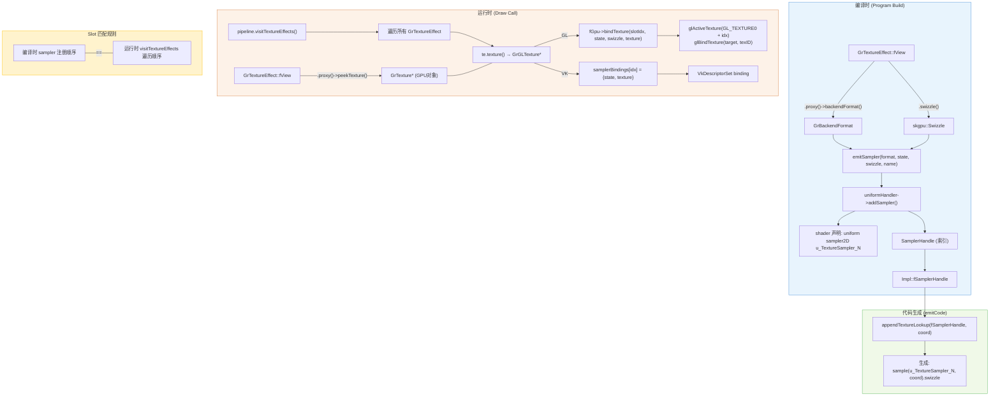

---

### D.5 为什么顺序能对上？

编译时和运行时都使用 **相同的 FP 树遍历顺序**（深度优先，先自身后子节点）：

| 阶段 | 遍历方法 | 作用 |
|------|----------|------|
| 编译时 | `fp.visitWithImpls()` in `emitTextureSamplersForFPs` | 按序分配 sampler 索引 0, 1, 2... |
| 运行时 | `pipeline.visitTextureEffects()` → `fp.visitTextureEffects()` | 按序绑定到 slot 0, 1, 2... |

两者都递归遍历 `fChildProcessors`，顺序一致，因此 shader 中 `sampler2D u_TextureSampler_0` 一定对应运行时绑定到 texture unit 0 的那个纹理。

---

### D.6 关键源码引用表

| 功能 | 源文件 | 行号 |
|------|--------|------|
| 遍历 FP 树注册 sampler | `src/gpu/ganesh/glsl/GrGLSLProgramBuilder.cpp` | 153-175 |
| emitSampler 转发 | `src/gpu/ganesh/glsl/GrGLSLProgramBuilder.cpp` | 450-456 |
| GL addSampler 实现 | `src/gpu/ganesh/gl/GrGLUniformHandler.cpp` | 80-107 |
| appendTextureLookup 代码生成 | `src/gpu/ganesh/glsl/GrGLSLShaderBuilder.cpp` | 101-107 |
| setSamplerHandle 存储 | `src/gpu/ganesh/effects/GrTextureEffect.h` | 149-151 |
| GL bindTextures 运行时绑定 | `src/gpu/ganesh/gl/GrGLProgram.cpp` | 136-162 |
| VK visitTextureEffects 绑定 | `src/gpu/ganesh/vk/GrVkPipelineState.cpp` | 161-165 |
| GrPipeline::visitTextureEffects | `src/gpu/ganesh/GrPipeline.cpp` | 103-108 |
| GrFragmentProcessor::visitTextureEffects | `src/gpu/ganesh/GrFragmentProcessor.cpp` | 68-78 |
