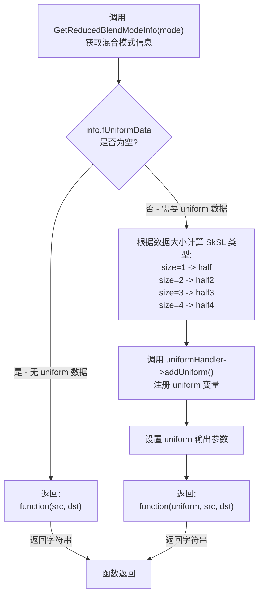
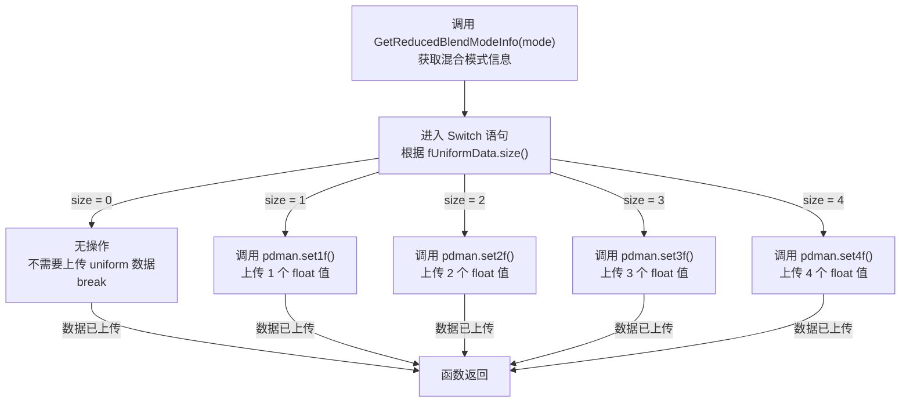
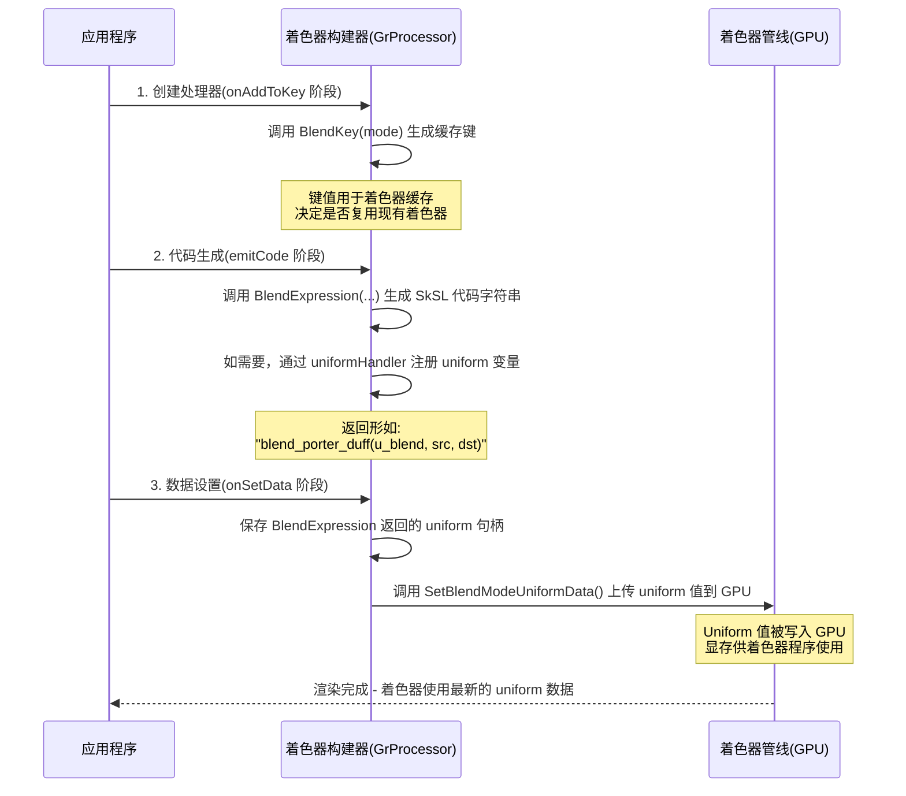

# GrGLSLBlend

> 源文件
> - src/gpu/ganesh/glsl/GrGLSLBlend.h
> - src/gpu/ganesh/glsl/GrGLSLBlend.cpp

## 概述

`GrGLSLBlend` 是 Ganesh GPU 后端中用于在 GLSL 着色器中生成混合模式表达式的工具命名空间。它提供了一组函数，用于将 Skia 的 `SkBlendMode` 转换为对应的 SkSL 混合表达式代码，并管理混合操作所需的 uniform 数据。该模块是 Ganesh 渲染管线中处理高级混合模式的关键组件，使得各种混合效果能够通过着色器代码实现。

## 架构位置

`GrGLSLBlend` 位于 Ganesh GPU 后端的 GLSL 层，处于以下架构层次：

```
Skia Core (SkBlendMode)
    ↓
Ganesh GPU Backend
    ↓
GLSL Layer (GrGLSLBlend) ← 当前模块
    ↓
Shader Code Generation
```

该模块作为 GLSL 代码生成器的一部分，负责将高层的混合模式抽象转换为低层的着色器代码字符串。它与 `GrGLSLProgramBuilder`、`GrGLSLUniformHandler` 等着色器构建组件紧密配合。

## 主要类与结构体

该模块是一个命名空间，不包含类定义，仅提供三个工具函数：

| 函数名 | 功能描述 |
|--------|----------|
| `BlendExpression` | 生成混合表达式的 SkSL 代码字符串 |
| `BlendKey` | 为混合模式生成 cache key |
| `SetBlendModeUniformData` | 设置混合操作所需的 uniform 数据 |

## 公共 API 函数

### BlendExpression

```cpp
std::string BlendExpression(const GrProcessor* processor,
                            GrGLSLUniformHandler* uniformHandler,
                            GrGLSLProgramDataManager::UniformHandle* uniform,
                            const char* srcColor,
                            const char* dstColor,
                            SkBlendMode mode);
```

**功能**：生成混合源颜色和目标颜色的 SkSL 表达式字符串。

**参数说明**：
- `processor`: 调用该函数的处理器，用于关联 uniform
- `uniformHandler`: uniform 处理器，用于注册所需的 uniform 变量
- `uniform`: 输出参数，返回分配的 uniform 句柄
- `srcColor`: 源颜色变量名（字符串）
- `dstColor`: 目标颜色变量名（字符串）
- `mode`: Skia 混合模式

**返回值**：包含混合表达式的 SkSL 代码字符串。

#### 实现流程图



**关键说明**：
- 混合函数名称（如 `blend_porter_duff`、`blend_hslc`）来自 `GetReducedBlendModeInfo` 返回的 `fFunction` 字段
- Uniform 类型映射：1 float → `half`, 2 float → `half2`, 3 float → `half3`, 4 float → `half4`
- 示例 1（无 uniform）：Screen 混合模式 → `"blend_screen(srcColor, dstColor)"`
- 示例 2（有 uniform）：SrcOver 混合 → `"blend_porter_duff(blend, srcColor, dstColor)"` （blend 为 half4 uniform）

### BlendKey

```cpp
int BlendKey(SkBlendMode mode);
```

**功能**：为指定的混合模式生成唯一的键值，用于着色器 cache。

**参数说明**：
- `mode`: 混合模式

**返回值**：整数键值，对于某些相似的混合模式返回相同的负数键值以实现代码复用。

**键值映射**：
- `-1`: Porter-Duff 混合模式（SrcOver, DstOver, SrcIn 等）
- `-2`: HSLC 混合模式（Hue, Saturation, Luminosity, Color）
- `-3`: Overlay 类混合（Overlay, HardLight）
- `-4`: Darken 类混合（Darken, Lighten）
- 其他：返回混合模式的枚举值

#### 实现流程图

```mermaid
flowchart TD
    A["输入: SkBlendMode mode"] --> B["进入 Switch 语句"]
    B --> C["Porter-Duff 组
SrcOver, DstOver, SrcIn,
DstIn, SrcOut, DstOut,
SrcATop, DstATop, Xor"]
    B --> D["HSLC 组
Hue, Saturation,
Luminosity, Color"]
    B --> E["Overlay 组
Overlay, HardLight"]
    B --> F["Darken 组
Darken, Lighten"]
    B --> G["其他模式
Default 分支"]
    C -->|return -1| H["返回值: -1
→ blend_porter_duff"]
    D -->|return -2| I["返回值: -2
→ blend_hslc"]
    E -->|return -3| J["返回值: -3
→ blend_overlay"]
    F -->|return -4| K["返回值: -4
→ blend_darken"]
    G -->|return (int)mode| L["返回值: (int)mode
→ 各自独立的函数"]
    H --> M["函数返回"]
    I --> M
    J --> M
    K --> M
    L --> M
```

**关键说明**：
- **负数键值机制**：多个 `SkBlendMode` 映射到相同的负整数，表示它们共享同一个着色器函数
- **缓存优化**：这种设计显著减少着色器变体数量，提高 cache 命中率
- **同步要求**：此函数的 Switch 语句必须与 `src/gpu/Blend.cpp` 中的 `GetReducedBlendModeInfo` 保持完全同步

### SetBlendModeUniformData

```cpp
void SetBlendModeUniformData(const GrGLSLProgramDataManager& pdman,
                             GrGLSLProgramDataManager::UniformHandle uniform,
                             SkBlendMode mode);
```

**功能**：为混合操作设置 uniform 数据。

**参数说明**：
- `pdman`: 程序数据管理器
- `uniform`: 之前通过 `BlendExpression` 获得的 uniform 句柄
- `mode`: 混合模式

#### 实现流程图



**关键说明**：
- **数据来源**：所有数据值均从 `GetReducedBlendModeInfo` 返回的 `fUniformData` 数组获取
- **具体数据示例**：
  - SrcOver: `[1.0, 1.0, 0.0, -1.0]` → 4 个 float，编码 Porter-Duff 算法系数
  - Hue: `[0.0, 1.0]` → 2 个 float，控制色相混合的参数
  - Overlay: `[0.0]` → 1 个 float，标志是否反转 src/dst
- **调用时机**：在每一帧渲染前，用 uniform 值更新 GPU 显存
- **与 BlendExpression 的关联**：此函数使用的 `uniform` 句柄必须与 `BlendExpression` 返回的句柄相同

## 函数协作流程

三个函数的配合使用模式形成了完整的 Ganesh 混合模式处理流程：



**三个阶段的关键点**：

1. **着色器 Key 生成阶段**（`onAddToKey`）
   - 调用：`key.appendInt(GrGLSLBlend::BlendKey(mode))`
   - 目的：为该处理器生成唯一的缓存键，确定是否需要编译新着色器
   - 示例：SrcOver 模式 → Key 值包含 `-1`

2. **代码生成阶段**（着色器构建）
   - 调用：`std::string expr = GrGLSLBlend::BlendExpression(processor, uniformHandler, &blendUniform, src, dst, mode)`
   - 目的：生成可以直接嵌入到 SkSL 代码中的混合表达式
   - 示例：返回 `"blend_porter_duff(u_blend, src, dst)"`
   - 注意：需要保存返回的 `blendUniform` 句柄，用于后续数据上传

3. **数据上传阶段**（`onSetData`）
   - 调用：`GrGLSLBlend::SetBlendModeUniformData(pdman, savedBlendUniform, mode)`
   - 目的：将具体的 uniform 数据值传递到 GPU，供着色器程序使用
   - 时机：每次调用 `onSetData` 时（通常是每帧或数据改变时）

**调用同步要求**：
- 三个函数必须使用**完全相同**的 `SkBlendMode` 参数
- `BlendExpression` 返回的 `uniform` 句柄必须在 `SetBlendModeUniformData` 中复用
- 不遵循此规则会导致着色器 cache miss、uniform 不匹配等问题

## 内部实现细节

### 混合表达式生成机制

`BlendExpression` 函数的实现流程：

1. **获取简化的混合模式信息**：调用 `skgpu::GetReducedBlendModeInfo(mode)` 获取混合模式的简化表示
2. **判断是否需要 uniform 数据**：
   - 如果 `info.fUniformData.empty()`，说明混合函数不需要额外参数，直接返回函数调用字符串
   - 否则需要为混合参数分配 uniform
3. **分配 uniform**：根据 uniform 数据的大小（1-4 个 float）确定 SkSL 类型（half 到 half4）
4. **生成表达式**：返回包含 uniform 名称的完整函数调用字符串

### 混合模式分组

`BlendKey` 函数将多个 `SkBlendMode` 映射到相同的键值，实现代码复用。下表展示了所有混合模式的映射关系：

| SkBlendMode | 着色器函数 | Uniform 数据 | BlendKey 返回值 | 用途说明 |
|-------------|-----------|------------|----------------|--------|
| **Porter-Duff 组** |  |  |  |  |
| SrcOver | `blend_porter_duff` | 4 float `[1, 1, 0, -1]` | -1 | 标准 Over 合成 |
| DstOver | `blend_porter_duff` | 4 float `[1, 1, -1, 0]` | -1 | 反向 Over 合成 |
| SrcIn | `blend_porter_duff` | 4 float `[0, 0, 1, 0]` | -1 | Src 交集模式 |
| DstIn | `blend_porter_duff` | 4 float `[0, 0, 0, 1]` | -1 | Dst 交集模式 |
| SrcOut | `blend_porter_duff` | 4 float `[1, 0, -1, 0]` | -1 | Src 差集模式 |
| DstOut | `blend_porter_duff` | 4 float `[0, 1, 0, -1]` | -1 | Dst 差集模式 |
| SrcATop | `blend_porter_duff` | 4 float `[0, 1, 1, -1]` | -1 | Src ATop 模式 |
| DstATop | `blend_porter_duff` | 4 float `[1, 0, -1, 1]` | -1 | Dst ATop 模式 |
| Xor | `blend_porter_duff` | 4 float `[1, 1, -1, -1]` | -1 | XOR 模式 |
| **HSLC 组** |  |  |  |  |
| Hue | `blend_hslc` | 2 float `[0, 1]` | -2 | 色相混合 |
| Saturation | `blend_hslc` | 2 float `[1, 1]` | -2 | 饱和度混合 |
| Color | `blend_hslc` | 2 float `[0, 0]` | -2 | 色彩混合 |
| Luminosity | `blend_hslc` | 2 float `[1, 0]` | -2 | 亮度混合 |
| **Overlay 组** |  |  |  |  |
| Overlay | `blend_overlay` | 1 float `[0]` | -3 | 标准 Overlay |
| HardLight | `blend_overlay` | 1 float `[1]` | -3 | HardLight（反向） |
| **Darken 组** |  |  |  |  |
| Darken | `blend_darken` | 1 float `[1]` | -4 | 变暗模式 |
| Lighten | `blend_darken` | 1 float `[-1]` | -4 | 变亮模式 |
| **其他模式（各自独立）** |  |  |  |  |
| Clear | `blend_clear` | 无 uniform | 0 | 清空 |
| Src | `blend_src` | 无 uniform | 1 | 源颜色 |
| Dst | `blend_dst` | 无 uniform | 2 | 目标颜色 |
| Plus | `blend_plus` | 无 uniform | 12 | 加法混合 |
| Modulate | `blend_modulate` | 无 uniform | 13 | 调制混合 |
| Screen | `blend_screen` | 无 uniform | 14 | 屏幕混合 |
| ColorDodge | `blend_color_dodge` | 无 uniform | 16 | 颜色减淡 |
| ColorBurn | `blend_color_burn` | 无 uniform | 17 | 颜色加深 |
| SoftLight | `blend_soft_light` | 无 uniform | 19 | 柔光 |
| Difference | `blend_difference` | 无 uniform | 20 | 差值 |
| Exclusion | `blend_exclusion` | 无 uniform | 21 | 排斥 |
| Multiply | `blend_multiply` | 无 uniform | 22 | 乘法混合 |

**分组详解**：

**Porter-Duff 组（返回 -1）**：
- 9 种标准合成模式共享 `blend_porter_duff` 函数实现
- 通过 4 个 float 参数区分不同的合成算法
- 每组值编码了不同的系数组合

**HSLC 组（返回 -2）**：
- 4 种色彩空间混合模式共享 `blend_hslc` 函数
- 使用 2 个 float 参数控制色相/饱和度/亮度的处理
- 通过 uniform 标志位区分色彩分量的混合方式

**Overlay 组（返回 -3）**：
- Overlay 和 HardLight 共享 `blend_overlay` 函数
- 单个 float 参数作为"反向"标志：0 表示 Overlay，1 表示 HardLight

**Darken 组（返回 -4）**：
- Darken 和 Lighten 共享 `blend_darken` 函数
- 单个 float 参数控制比较方向：1 表示变暗，-1 表示变亮

**其他模式**：
- 每个模式各自对应独立的着色器函数
- 大多数不需要 uniform 数据，直接在着色器代码中固定实现

### Uniform 数据设置

`SetBlendModeUniformData` 根据混合模式所需的 uniform 数据数量调用相应的 `set1f`、`set2f`、`set3f` 或 `set4f` 方法。数据从 `GetReducedBlendModeInfo` 返回的 `fUniformData` 数组中获取。

## 依赖关系

### 依赖的模块

| 模块 | 用途 |
|------|------|
| `SkBlendMode` | 混合模式枚举定义 |
| `GrGLSLUniformHandler` | 管理 uniform 变量的注册 |
| `GrGLSLProgramDataManager` | 管理程序数据和 uniform 更新 |
| `skgpu::GetReducedBlendModeInfo` | 获取混合模式的简化信息和参数 |
| `SkSL::String` | SkSL 字符串工具 |
| `GrProcessor` | 着色器处理器基类 |

### 被依赖的模块

| 模块 | 使用场景 |
|------|----------|
| `GrProcessor` 子类 | 在 `onAddToKey` 和 `onSetData` 中调用 |
| `GrGLSLProgramBuilder` | 构建着色器程序时生成混合表达式 |
| 各种 Fragment Processor | 需要自定义混合效果的片段处理器 |

## 设计模式与设计决策

### 命名空间而非类

选择使用命名空间而不是类的原因：
- 这些函数是纯工具函数，不需要维护状态
- 避免不必要的对象实例化
- 提供清晰的 API 边界

### 三步走 API 设计

API 设计遵循三个阶段的使用模式：
1. **Key 生成阶段**（`onAddToKey`）：使用 `BlendKey` 生成 cache key
2. **代码生成阶段**（着色器构建）：使用 `BlendExpression` 生成 SkSL 代码
3. **数据设置阶段**（`onSetData`）：使用 `SetBlendModeUniformData` 上传数据

这种设计与 Ganesh 的着色器构建和数据更新流程完美匹配。

### 混合模式简化策略

通过 `GetReducedBlendModeInfo` 集中管理混合模式的简化逻辑：
- 将多个相似的混合模式映射到相同的着色器函数
- 通过 uniform 参数区分具体行为
- 减少着色器变体数量，提高 cache 命中率

### 延迟 Uniform 分配

只有在需要参数的混合模式下才分配 uniform，避免资源浪费。

## 性能考量

### Shader Cache 优化

通过 `BlendKey` 的负数返回值策略，多个混合模式共享相同的着色器代码，显著减少：
- 着色器编译次数
- 着色器程序数量
- Cache 内存占用

### Uniform 数据压缩

混合参数以 1-4 个 float 的形式传递，而不是更复杂的数据结构，减少了：
- GPU 内存带宽消耗
- Uniform 更新开销

### 字符串生成效率

使用 `SkSL::String::printf` 进行字符串格式化，避免多次字符串拼接操作。

### 代码复用

- Porter-Duff 混合：9 种模式共享一个着色器函数
- HSLC 混合：4 种模式共享一个着色器函数
- 其他分组混合：进一步减少代码重复

## 相关文件

| 文件路径 | 关系说明 |
|----------|----------|
| `src/gpu/Blend.h/cpp` | 定义 `GetReducedBlendModeInfo` 函数 |
| `src/gpu/ganesh/glsl/GrGLSLUniformHandler.h` | Uniform 注册接口 |
| `src/gpu/ganesh/glsl/GrGLSLProgramDataManager.h` | Uniform 数据管理 |
| `include/core/SkBlendMode.h` | 混合模式枚举定义 |
| `src/gpu/ganesh/glsl/GrGLSLFragmentShaderBuilder.h` | 片段着色器构建器 |
| `src/gpu/ganesh/GrFragmentProcessor.h` | 片段处理器基类 |
| `src/sksl/SkSLString.h` | SkSL 字符串工具 |
