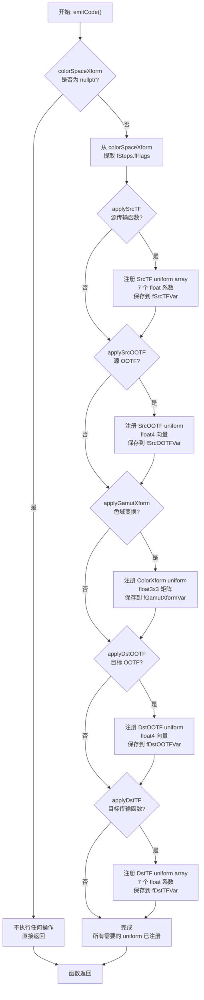
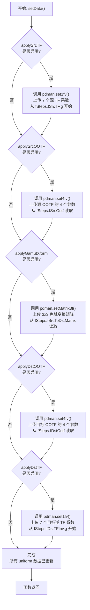
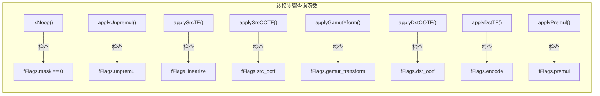
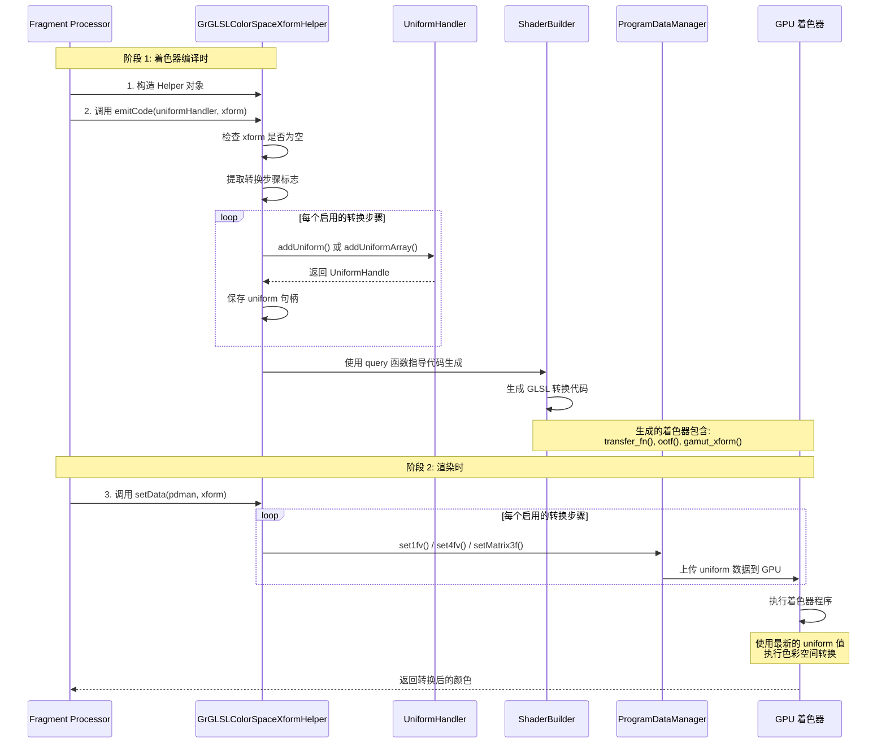
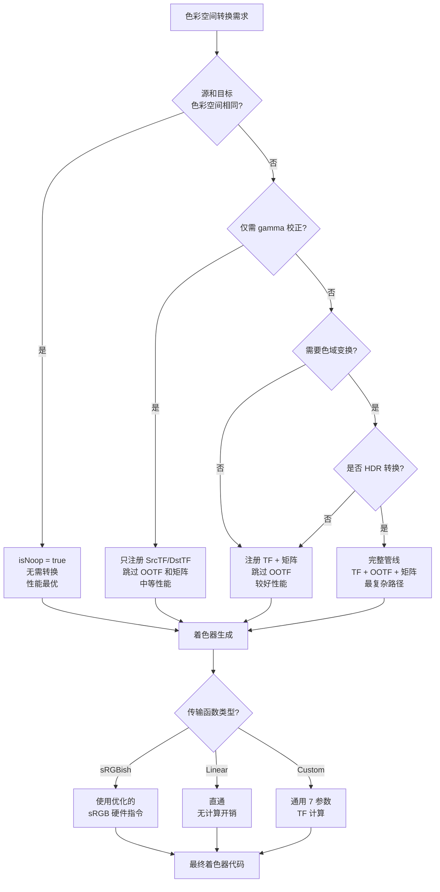

# GrGLSLColorSpaceXformHelper

> 源文件: src/gpu/ganesh/glsl/GrGLSLColorSpaceXformHelper.h

## 概述

`GrGLSLColorSpaceXformHelper` 是 Skia Ganesh GPU 后端中用于辅助在着色器中实现色彩空间转换的工具类。该类封装了色彩空间转换所需的所有 Uniform 变量管理，并能自动生成相应的着色器代码，使得 Fragment Processor（FP）可以轻松地在 GPU 上执行准确的色彩空间转换操作。

该类作为 `GrColorSpaceXform` 的 GLSL 层辅助工具，负责处理传输函数（Transfer Function）、OOTF（Opto-Optical Transfer Function）、色域矩阵变换等复杂的色彩处理步骤，确保渲染管线中的色彩准确性。

## 架构位置

在 Skia 的 GPU 渲染架构中的位置：

```
skia/
├── src/
    └── gpu/
        └── ganesh/
            ├── GrColorSpaceXform.h       # 色彩空间转换核心逻辑
            └── glsl/
                ├── GrGLSLColorSpaceXformHelper.h  # 本文件
                ├── GrGLSLUniformHandler.h         # Uniform 管理
                └── GrGLSLFragmentProcessor.cpp     # 片段处理器基类
```

该类在渲染管线中的角色：
- **输入层**: 接收 `GrColorSpaceXform` 对象，提取转换参数
- **中间层**: 管理着色器 Uniform 变量，生成转换代码
- **输出层**: 在片段着色器中应用色彩空间转换

## 主要类与结构体

### GrGLSLColorSpaceXformHelper

**继承关系：**
```cpp
class GrGLSLColorSpaceXformHelper : public SkNoncopyable
```

**核心成员变量：**

```cpp
private:
    // Uniform 句柄
    GrGLSLProgramDataManager::UniformHandle fSrcTFVar;      // 源传输函数系数
    GrGLSLProgramDataManager::UniformHandle fSrcOOTFVar;    // 源 OOTF 参数
    GrGLSLProgramDataManager::UniformHandle fGamutXformVar; // 色域变换矩阵
    GrGLSLProgramDataManager::UniformHandle fDstOOTFVar;    // 目标 OOTF 参数
    GrGLSLProgramDataManager::UniformHandle fDstTFVar;      // 目标传输函数系数

    // 转换步骤标志
    SkColorSpaceXformSteps::Flags fFlags;

    // 传输函数类型
    skcms_TFType fSrcTFType;
    skcms_TFType fDstTFType;
```

**设计特点：**
- 不可复制（继承 `SkNoncopyable`），避免意外的状态复制
- 封装所有 Uniform 句柄，提供统一的管理接口
- 支持选择性启用转换步骤，优化性能

## 公共 API 函数

### 构造函数

```cpp
GrGLSLColorSpaceXformHelper()
```

**功能：** 创建空的辅助对象，所有 Uniform 句柄初始化为无效状态

**使用场景：** 在 Fragment Processor 的 `onEmitCode` 方法中创建

### emitCode

```cpp
void emitCode(GrGLSLUniformHandler* uniformHandler,
              const GrColorSpaceXform* colorSpaceXform,
              uint32_t visibility = kFragment_GrShaderFlag)
```

**功能：** 注册色彩空间转换所需的所有 Uniform 变量

**参数说明：**
- `uniformHandler`：Uniform 管理器，用于注册变量
- `colorSpaceXform`：色彩空间转换对象，提供转换参数
- `visibility`：Uniform 可见性标志（默认仅片段着色器可见）

**工作流程：**
1. 检查是否需要源传输函数转换，注册 `fSrcTFVar`
2. 检查是否需要源 OOTF 转换，注册 `fSrcOOTFVar`
3. 检查是否需要色域矩阵变换，注册 `fGamutXformVar`
4. 检查是否需要目标 OOTF 转换，注册 `fDstOOTFVar`
5. 检查是否需要目标传输函数转换，注册 `fDstTFVar`

**关键细节：**
- 传输函数使用数组 Uniform（7 个系数）
- OOTF 使用 `float4` 向量
- 色域变换使用 `float3x3` 矩阵

#### emitCode() 函数流程图



### setData

```cpp
void setData(const GrGLSLProgramDataManager& pdman,
             const GrColorSpaceXform* colorSpaceXform)
```

**功能：** 在渲染时更新 Uniform 变量的值

**参数说明：**
- `pdman`：程序数据管理器，用于设置 Uniform 值
- `colorSpaceXform`：提供实际的转换参数数据

**工作流程：**
根据注册的 Uniform，依次设置：
- 源传输函数 7 个系数（g, a, b, c, d, e, f）
- 源 OOTF 的 4 个参数
- 3×3 色域变换矩阵
- 目标 OOTF 的 4 个参数
- 目标逆传输函数 7 个系数

#### setData() 函数流程图



### 状态查询函数

```cpp
bool isNoop() const              // 是否为无操作转换
bool applyUnpremul() const       // 是否需要解预乘
bool applySrcTF() const          // 是否应用源传输函数（线性化）
bool applySrcOOTF() const        // 是否应用源 OOTF
bool applyGamutXform() const     // 是否应用色域变换
bool applyDstOOTF() const        // 是否应用目标 OOTF
bool applyDstTF() const          // 是否应用目标传输函数（编码）
bool applyPremul() const         // 是否需要重新预乘
```

**功能：** 查询当前配置需要执行哪些转换步骤

**使用场景：**
- 着色器代码生成时，根据标志选择性地生成转换代码
- 性能优化，跳过不必要的计算步骤

#### 转换步骤查询函数速查表



### 类型查询函数

```cpp
skcms_TFType srcTFType() const   // 源传输函数类型
skcms_TFType dstTFType() const   // 目标传输函数类型
```

**功能：** 返回传输函数的类型（sRGB、线性、PQ、HLG 等）

**用途：** 着色器生成器可根据类型选择优化的计算路径

### Uniform 访问函数

```cpp
GrGLSLProgramDataManager::UniformHandle srcTFUniform() const
GrGLSLProgramDataManager::UniformHandle srcOOTFUniform() const
GrGLSLProgramDataManager::UniformHandle gamutXformUniform() const
GrGLSLProgramDataManager::UniformHandle dstOOTFUniform() const
GrGLSLProgramDataManager::UniformHandle dstTFUniform() const
```

**功能：** 返回各个 Uniform 变量的句柄

**使用场景：** 着色器生成器需要引用这些 Uniform 来生成 GLSL 代码

## 色彩空间转换管线

### 完整的 7 步转换流程

该类实现的色彩空间转换是一个完整的线性管线，包括以下转换步骤：

```mermaid
flowchart LR
    A["输入颜色
(预乘 RGBA)"] --> B{"applyUnpremul()"}
    B -->|是| C["解预乘
color.rgb /= color.a"]
    B -->|否| D{"applySrcTF()"}
    C --> D
    D -->|是| E["线性化
应用源传输函数
使用 7 个 TF 系数"]
    D -->|否| F{"applySrcOOTF()"}
    E --> F
    F -->|是| G["源 OOTF 转换
Y = dot rgb,coeffs.rgb
rgb *= pow Y,coeffs.a"]
    F -->|否| H{"applyGamutXform()"}
    G --> H
    H -->|是| I["色域变换
rgb = matrix × rgb
3x3 矩阵乘法"]
    H -->|否| J{"applyDstOOTF()"}
    I --> J
    J -->|是| K["目标 OOTF 转换
Y = dot rgb,coeffs.rgb
rgb *= pow Y,coeffs.a"]
    J -->|否| L{"applyDstTF()"}
    K --> L
    L -->|是| M["编码
应用目标逆传输函数
使用 7 个逆 TF 系数"]
    L -->|否| N{"applyPremul()"}
    M --> N
    N -->|是| O["重新预乘
color.rgb *= color.a"]
    N -->|否| P["输出颜色
最终 RGBA"]
    O --> P
```



### 转换管线说明

**特点：**
- 7 个转换步骤可选，每个步骤由 Flags 独立控制
- 所有步骤都是可选的，配置灵活
- 支持从完全无操作到完整 HDR 转换

**常见转换场景：**

| 场景 | 启用的步骤 | 用途 |
|-----|---------|------|
| 无操作 | 无 | 源和目标色彩空间相同 |
| sRGB → Linear | SrcTF | Gamma 校正（线性化） |
| Linear → sRGB | DstTF | Gamma 编码 |
| Rec.709 → Rec.2020 | Gamut Xform | HDR 色域变换 |
| P3 → sRGB (HDR) | 全部 | 完整 HDR 到 SDR 转换 |

## 内部实现细节

### 传输函数参数

```cpp
static const int kNumTransferFnCoeffs = 7;
```

传输函数使用 7 个系数定义：
- **g**: gamma 指数
- **a, b, c, d, e, f**: 分段函数参数

标准形式：
```
f(x) = { (a*x + b)^g + e,  x >= d
       { c*x + f,          x < d
```

常见类型：
- **sRGB**: 特殊的 gamma 2.2 近似曲线
- **Linear**: g=1, 所有其他系数为 0
- **PQ (Perceptual Quantizer)**: HDR 标准
- **HLG (Hybrid Log-Gamma)**: 广播 HDR 标准

### 函数协作时序图

该类与其他组件在编译时和运行时的交互如下：



### OOTF（Opto-Optical Transfer Function）

OOTF 描述场景光到显示光的转换，使用 `float4` 参数：
```cpp
pdman.set4fv(fSrcOOTFVar, 1, colorSpaceXform->fSteps.fSrcOotf);
```

**用途：**
- HDR 到 SDR 的色调映射
- 不同观看环境的适配
- 广播标准合规性

### 色域变换矩阵

3×3 矩阵实现不同 RGB 色域间的转换：
```cpp
pdman.setMatrix3f(fGamutXformVar, colorSpaceXform->fSteps.fSrcToDstMatrix);
```

**常见转换：**
- sRGB ↔ Adobe RGB
- sRGB ↔ Display P3
- Rec.709 ↔ Rec.2020（HDR）

### 转换步骤标志

```cpp
SkColorSpaceXformSteps::Flags fFlags;
```

使用位标志控制启用的转换步骤：
```cpp
struct Flags {
    bool unpremul;          // 是否解预乘
    bool linearize;         // 是否线性化（应用源 TF）
    bool src_ootf;          // 是否应用源 OOTF
    bool gamut_transform;   // 是否色域变换
    bool dst_ootf;          // 是否应用目标 OOTF
    bool encode;            // 是否编码（应用目标 TF）
    bool premul;            // 是否重新预乘
};
```

## 依赖关系

### 直接依赖

1. **skcms** (modules/skcms/skcms.h)
   - 提供色彩管理系统核心功能
   - 定义传输函数类型和参数结构

2. **SkColorSpaceXformSteps** (src/core/SkColorSpaceXformSteps.h)
   - 定义转换步骤和标志
   - 提供转换逻辑的 CPU 版本

3. **GrColorSpaceXform** (src/gpu/ganesh/GrColorSpaceXform.h)
   - GPU 色彩空间转换的核心类
   - 提供转换参数和配置

4. **GrGLSLUniformHandler** (src/gpu/ganesh/glsl/GrGLSLUniformHandler.h)
   - 管理着色器 Uniform 变量
   - 提供注册和查询接口

### 被依赖模块

1. **Fragment Processors**
   - 各种效果处理器使用该类实现正确的色彩空间处理
   - 如 `GrTextureEffect`, `GrYUVtoRGBEffect` 等

2. **着色器生成器**
   - `GrGLSLFragmentShaderBuilder` 使用查询函数生成转换代码

3. **Pipeline 构建**
   - `GrPipeline` 在构建时配置色彩空间转换

## 设计模式与设计决策

### 1. 辅助类模式（Helper Pattern）

将复杂的 Uniform 管理逻辑封装在独立的辅助类中：

**优势：**
- Fragment Processor 代码更简洁
- 统一的色彩空间转换接口
- 易于维护和测试

### 2. 延迟初始化

```cpp
GrGLSLColorSpaceXformHelper() {}  // 空构造
void emitCode(...)                 // 实际初始化
```

**原因：**
- Fragment Processor 创建时可能不需要色彩空间转换
- 避免不必要的 Uniform 注册
- 支持条件性启用功能

### 3. 选择性功能启用

通过 `Flags` 控制启用的转换步骤：

**优势：**
- 减少不必要的 Uniform 变量
- 优化着色器性能
- 支持精确的转换控制

### 4. 不可复制设计

```cpp
: public SkNoncopyable
```

**原因：**
- Uniform 句柄是唯一的资源
- 避免意外的状态复制导致错误
- 强制正确的生命周期管理

### 5. 统一的接口设计

所有步骤使用一致的命名模式：
- `apply*()`: 查询是否启用
- `*Uniform()`: 获取 Uniform 句柄
- `*Type()`: 查询参数类型

**优势：**
- 代码可读性强
- 便于代码生成自动化
- 降低学习成本

## 性能考量

### 优化决策树

该类提供多个优化策略，使用以下决策树选择合适的配置：



**优化策略说明：**
- **无操作优化**: 当源和目标相同时，不生成任何代码，直接通过输入
- **选择性启用**: 根据需要启用转换步骤，减少 Uniform 注册
- **类型优化**: 根据传输函数类型选择硬件加速路径

### 1. Uniform 数量优化

仅注册实际需要的 Uniform：

```cpp
if (this->applySrcTF()) {
    fSrcTFVar = uniformHandler->addUniformArray(...);
}
```

**性能影响：**
- 减少 GPU 寄存器压力
- 降低驱动程序开销
- 优化 Uniform 上传带宽

**最佳实践：**
- 对于 sRGB → sRGB 的无操作转换，不注册任何 Uniform
- 使用 `isNoop()` 在着色器生成前提前退出

### 2. 传输函数类型优化

通过 `skcms_TFType` 选择优化的实现：

**类型分类：**
- **sRGBish**: 使用硬件加速的 sRGB 指令
- **Linear**: 直接传递，无计算
- **Custom**: 通用路径，但可优化常见情况

**着色器优化示例：**
```glsl
// 优化的 sRGB 线性化
if (srcTFType == sRGB) {
    color.rgb = pow(color.rgb, vec3(2.2));
} else {
    // 通用传输函数计算
}
```

### 3. 批量 Uniform 更新

使用数组 Uniform 减少设置调用次数：

```cpp
pdman.set1fv(fSrcTFVar, kNumTransferFnCoeffs, &colorSpaceXform->fSteps.fSrcTF.g);
```

**性能优势：**
- 单次 API 调用设置多个值
- 减少驱动程序开销
- 提高缓存利用率

### 4. 预乘/解预乘优化

**问题：**
- 解预乘和重新预乘在转换边界可能导致精度损失
- 每个像素需要额外的除法和乘法操作

**优化策略：**
- 尽可能在预乘空间中工作
- 使用 `applyUnpremul()` 和 `applyPremul()` 标志避免不必要的转换
- 对于不透明图像，跳过这些步骤

### 5. 矩阵变换缓存

色域变换矩阵在同一渲染批次中通常不变：

**优化机制：**
- 矩阵在 CPU 端预计算
- GPU 端直接使用，避免重复计算
- 可与其他变换矩阵合并

## 相关文件

### 核心依赖
- `modules/skcms/skcms.h` - skcms 色彩管理系统
- `src/core/SkColorSpacePriv.h` - 色彩空间私有实现
- `src/core/SkColorSpaceXformSteps.h` - 转换步骤定义
- `src/gpu/ganesh/GrColorSpaceXform.h` - GPU 色彩空间转换

### GLSL 相关
- `src/gpu/ganesh/glsl/GrGLSLUniformHandler.h` - Uniform 管理
- `src/gpu/ganesh/glsl/GrGLSLFragmentShaderBuilder.h` - 着色器生成
- `src/gpu/ganesh/glsl/GrGLSLProgramDataManager.h` - 程序数据管理

### 使用示例
- `src/gpu/ganesh/effects/GrTextureEffect.cpp` - 纹理效果
- `src/gpu/ganesh/effects/GrYUVtoRGBEffect.cpp` - YUV 转 RGB
- `src/gpu/ganesh/GrFragmentProcessor.cpp` - 片段处理器基类

### 测试文件
- `tests/ColorSpaceXformTest.cpp` - 色彩空间转换测试
- `tests/GrColorSpaceXformTest.cpp` - GPU 色彩空间转换测试
