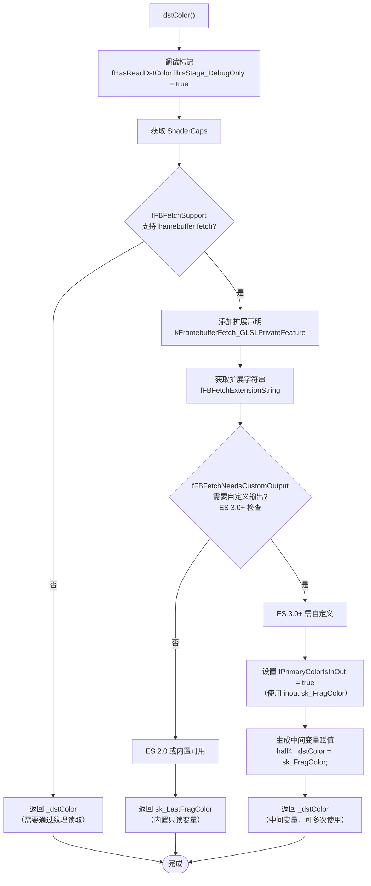
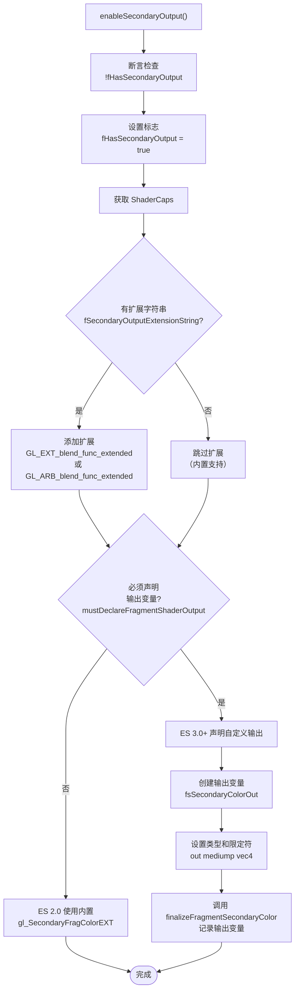
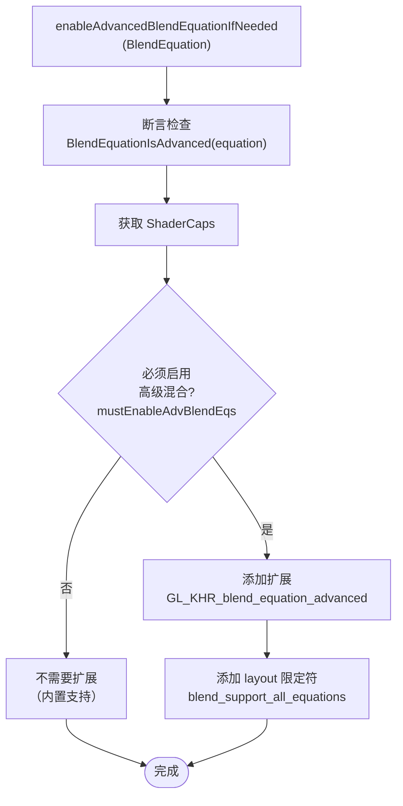
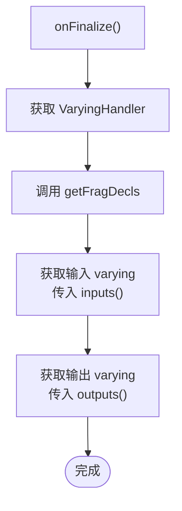

# GrGLSLFragmentShaderBuilder

> 源文件: `src/gpu/ganesh/glsl/GrGLSLFragmentShaderBuilder.h` (137 行), `src/gpu/ganesh/glsl/GrGLSLFragmentShaderBuilder.cpp` (97 行)

## 1. 概述

`GrGLSLFragmentShaderBuilder` 是片段着色器代码生成的核心类，通过**钻石继承**同时实现 `GrGLSLFPFragmentBuilder`（供片段处理器使用）和 `GrGLSLXPFragmentBuilder`（供混合处理器使用）两个接口。

它管理以下片段着色器特有功能：
- **目标颜色读取（dst color）** - 通过 framebuffer fetch 或纹理采样读取当前像素颜色
- **Framebuffer Fetch 支持** - 支持多种 GPU 扩展（GL_EXT、GL_NV、GL_ARM）和平台差异（ES 2.0 vs 3.0+）
- **双源混合（Dual Source Blending）** - 启用第二个片段着色器输出用于高级混合
- **高级混合方程** - 为 14 种复杂混合模式启用 GPU 扩展支持

### 核心特点
- **钻石继承设计** - FP 和 XP 接口虽然相同，但在逻辑上分离，便于类型检查和接口清晰性
- **平台适配** - 自动处理 ES 2.0/3.0+、Android/iOS 等平台的着色器语法差异
- **延迟声明** - 仅在实际需要时才添加扩展指令和输出声明，避免冗余
- **调试支持** - 通过 `fHasReadDstColorThisStage_DebugOnly` 验证处理器声明与实现的一致性

## 2. 架构位置

### 2.1 继承关系（钻石继承）

```
                    GrGLSLShaderBuilder（抽象基类）
                            ↑
                            │
        ┌───────────────────┼───────────────────┐
        │                   │                   │
   GrGLSLFPFragmentBuilder  │  GrGLSLXPFragmentBuilder
   （FP 接口）              │  （XP 接口）
        ↑                   │                   ↑
        │ virtual           │            virtual│
        │                   │                   │
        └───────────────────┼───────────────────┘
                            │
            GrGLSLFragmentShaderBuilder
            （统一实现，同时实现两个接口）
```

### 2.2 在 GrGLSLProgramBuilder 中的位置

```
GrGLSLProgramBuilder
    │
    ├── fVS: GrGLSLVertexBuilder（顶点着色器）
    │
    ├── fFS: GrGLSLFragmentShaderBuilder（片段着色器）
    │        ├── 目标颜色读取（framebuffer fetch）
    │        ├── 双源混合输出管理
    │        ├── 高级混合方程支持
    │        └── Fragment varying 声明
    │
    ├── fGS: GrGLSLGeometryBuilder（几何着色器，可选）
    │
    └── [其他处理器引用]
         ├── Uniform Handler
         ├── Varying Handler
         └── Texture Handler
```

### 2.3 在完整渲染管线中的位置

```
着色器代码生成阶段
    │
    ├── GeometryProcessor.emitCode(args)
    │   └── 填充 vBuilder（顶点位置、varying）
    │
    ├── FragmentProcessor.emitCode(args)
    │   └── 填充 fBuilder（片段处理逻辑、读取 dst）
    │       ├── 可能调用 fBuilder.dstColor()
    │       ├── 可能调用 fBuilder.forceHighPrecision()
    │       └── 生成片段处理代码
    │
    └── XferProcessor.emitCode(args)
        └── 填充 fBuilder（混合逻辑）
            ├── 可能调用 fBuilder.dstColor()
            ├── 可能调用 fBuilder.enableSecondaryOutput()
            ├── 可能调用 fBuilder.enableAdvancedBlendEquationIfNeeded()
            └── 生成混合代码

            ▼
    着色器字符串拼接 (finalize)

            ▼
    GLSL 编译与链接

            ▼
    GPU 执行
```

## 3. 类层次结构详解

### 3.1 GrGLSLFPFragmentBuilder — 片段处理器接口

**源文件** `.h:25-58`

```cpp
class GrGLSLFPFragmentBuilder : virtual public GrGLSLShaderBuilder {
public:
    enum class ScopeFlags { /* 作用域标志 */ };
    virtual void forceHighPrecision() = 0;
    virtual const char* dstColor() = 0;
private:
    char fPadding[4];  // ASAN 对齐修复
};
```

**职责：**
- 定义片段处理器（FP）看到的接口
- 提供作用域标志枚举，用于指示代码执行上下文（顶层、条件分支、循环等）
- 声明 `forceHighPrecision()` - 强制高精度计算
- 声明 `dstColor()` - 读取目标像素颜色

**关键成员：**
| 成员 | 类型 | 说明 |
|------|------|------|
| `ScopeFlags` | enum | 作用域标志：`kTopLevel`, `kInsidePerPrimitiveBranch`, `kInsidePerPixelBranch`, `kInsideLoop` |
| `fPadding[4]` | char[] | 虚继承对齐修复（ASAN 要求 16 字节对齐） |

### 3.2 GrGLSLXPFragmentBuilder — 混合处理器接口

**源文件** `.h:65-80`

```cpp
class GrGLSLXPFragmentBuilder : virtual public GrGLSLShaderBuilder {
public:
    virtual bool hasSecondaryOutput() const = 0;
    virtual const char* dstColor() = 0;
    virtual void enableAdvancedBlendEquationIfNeeded(skgpu::BlendEquation) = 0;
};
```

**职责：**
- 定义混合处理器（XP）看到的接口
- 声明 `hasSecondaryOutput()` - 查询是否启用双源混合
- 声明 `dstColor()` - 读取目标像素颜色
- 声明 `enableAdvancedBlendEquationIfNeeded()` - 启用高级混合方程

**关键方法：**
| 方法 | 返回值 | 说明 |
|------|--------|------|
| `hasSecondaryOutput()` | `bool` | 返回 `fHasSecondaryOutput` 标志 |
| `dstColor()` | `const char*` | 返回目标颜色变量名 |
| `enableAdvancedBlendEquationIfNeeded()` | `void` | 为高级混合启用扩展 |

### 3.3 GrGLSLFragmentShaderBuilder — 统一实现

**源文件** `.h:85-134`

```cpp
class GrGLSLFragmentShaderBuilder : public GrGLSLFPFragmentBuilder,
                                   public GrGLSLXPFragmentBuilder {
public:
    GrGLSLFragmentShaderBuilder(GrGLSLProgramBuilder* program);

    // 两个接口共享的方法
    const char* dstColor() override;

    // FP 接口
    void forceHighPrecision() override { fForceHighPrecision = true; }

    // XP 接口
    bool hasSecondaryOutput() const override { return fHasSecondaryOutput; }
    void enableAdvancedBlendEquationIfNeeded(skgpu::BlendEquation) override;
private:
    // 私有成员和方法
    void enableSecondaryOutput();
    const char* getPrimaryColorOutputName() const;
    const char* getSecondaryColorOutputName() const;
    bool primaryColorOutputIsInOut() const;
    GrSurfaceOrigin getSurfaceOrigin() const;
    void onFinalize() override;

    // 状态标志
    bool fPrimaryColorIsInOut = false;
    bool fSetupFragPosition = false;
    bool fHasSecondaryOutput = false;
    bool fHasModifiedSampleMask = false;
    bool fForceHighPrecision = false;

    // 调试标志
    bool fHasReadDstColorThisStage_DebugOnly = false;
};
```

**职责：**
- 同时实现 FP 和 XP 接口
- 管理所有状态标志
- 处理 framebuffer fetch 逻辑（支持 3 种扩展和 2 种 ES 版本）
- 管理双源混合输出变量声明
- 处理高级混合方程的扩展和 layout 限定符

**与两个接口的分工：**
| 功能 | FP 接口 | XP 接口 | 实现类 |
|------|--------|--------|-------|
| 强制高精度 | ✅ `forceHighPrecision()` | ❌ | 实现类 |
| 读取目标颜色 | ✅ `dstColor()` | ✅ `dstColor()` | 实现类（共享） |
| 双源混合查询 | ❌ | ✅ `hasSecondaryOutput()` | 实现类 |
| 启用高级混合 | ❌ | ✅ `enableAdvancedBlendEquationIfNeeded()` | 实现类 |

## 4. 关键成员变量

### 4.1 从 GrGLSLShaderBuilder 继承的成员

| 成员 | 类型 | 说明 |
|------|------|------|
| `fProgramBuilder` | `GrGLSLProgramBuilder*` | 反向引用到程序构建器，用于查询 ShaderCaps、origin、varying handler 等 |
| `fShaderStrings` | `STArray<kPrealloc, SkString>` | 代码段数组（10 个段：扩展、定义、精度、布局、uniform、输入、输出、函数、主函数、代码） |
| `fInputs` | `VarArray` | 输入变量（fragment varying 和顶点属性） |
| `fOutputs` | `VarArray` | 输出变量（fragment 着色器输出） |
| `fFeaturesAddedMask` | `uint32_t` | 扩展特性位掩码，防止重复添加 #extension |

### 4.2 GrGLSLFragmentShaderBuilder 特有的成员

| 成员 | 类型 | 默认值 | 说明 |
|------|------|--------|------|
| `fPrimaryColorIsInOut` | `bool` | `false` | **Framebuffer Fetch 标志** - 当需要自定义输出时为 true（ES 3.0+ 且 fFBFetchNeedsCustomOutput） |
| `fSetupFragPosition` | `bool` | `false` | 是否需要设置片段位置（gl_FragCoord） |
| `fHasSecondaryOutput` | `bool` | `false` | **双源混合标志** - 启用第二输出变量时为 true |
| `fHasModifiedSampleMask` | `bool` | `false` | 是否修改了样本掩码（gl_SampleMask） |
| `fForceHighPrecision` | `bool` | `false` | **高精度标志** - FP 调用 forceHighPrecision() 时为 true |
| `fHasReadDstColorThisStage_DebugOnly` | `bool` (debug only) | `false` | **调试标志** - 验证处理器声明与实现的一致性 |

### 4.3 静态常量

| 常量 | 值 | 说明 |
|------|-----|------|
| `kDstColorName` | `"_dstColor"` | 中间变量名，用于 framebuffer fetch 需要自定义输出时 |
| `DeclaredColorOutputName()` | `"sk_FragColor"` | 主输出变量名 |
| `DeclaredSecondaryColorOutputName()` | `"fsSecondaryColorOut"` | 双源混合第二输出名 |

## 5. 函数详解

### 5.1 构造函数 (.cpp:18-19)

```cpp
GrGLSLFragmentShaderBuilder::GrGLSLFragmentShaderBuilder(GrGLSLProgramBuilder* program)
        : GrGLSLShaderBuilder(program) {}
```

**职责：** 初始化片段着色器构建器

**执行流程：**
1. 调用基类 `GrGLSLShaderBuilder` 的构造函数
   - 绑定 `fProgramBuilder` 指针
   - 初始化代码段数组（10 个段）
   - 初始化计数器和标志
2. 所有成员变量自动初始化为默认值（`fPrimaryColorIsInOut = false` 等）

**钻石继承特殊性：**
- `GrGLSLFPFragmentBuilder` 有 4 字节 padding（用于 ASAN 对齐）
- `GrGLSLXPFragmentBuilder` 没有额外成员
- `GrGLSLShaderBuilder` 在虚基类链中只初始化一次

---

### 5.2 dstColor() (.cpp:21-41) **【重点，复杂功能】**

```cpp
const char* GrGLSLFragmentShaderBuilder::dstColor() {
    SkDEBUGCODE(fHasReadDstColorThisStage_DebugOnly = true;)

    const GrShaderCaps* shaderCaps = fProgramBuilder->shaderCaps();
    if (shaderCaps->fFBFetchSupport) {
        this->addFeature(1 << kFramebufferFetch_GLSLPrivateFeature,
                         shaderCaps->fFBFetchExtensionString);

        const char* fbFetchColorName = "sk_LastFragColor";
        if (shaderCaps->fFBFetchNeedsCustomOutput) {
            fPrimaryColorIsInOut = true;
            fbFetchColorName = DeclaredColorOutputName();
            this->codeAppendf("half4 %s = %s;", kDstColorName, fbFetchColorName);
        } else {
            return fbFetchColorName;
        }
    }
    return kDstColorName;
}
```

**职责：** 返回目标颜色变量名，支持 framebuffer fetch 扩展

**详细流程图（Framebuffer Fetch 决策树）：**



**三种执行路径的详细说明：**

#### 路径 1: 无 Framebuffer Fetch 支持
```
条件: fFBFetchSupport = false
返回: "_dstColor"
用途: 通过纹理采样或输入附件读取目标颜色
     （在 GrGLSLProgramBuilder::emitAndInstallDstTexture 中处理）
```

#### 路径 2: Framebuffer Fetch 且内置可用（ES 2.0）
```
条件: fFBFetchSupport = true && !fFBFetchNeedsCustomOutput
扩展: GL_EXT_shader_framebuffer_fetch (或 GL_NV_、GL_ARM_ 版本)
返回: "sk_LastFragColor" (内置只读)
GLSL 代码示例:
    #extension GL_EXT_shader_framebuffer_fetch : require
    void main() {
        vec4 dst = sk_LastFragColor;
        ...
    }
```

#### 路径 3: Framebuffer Fetch 需要自定义输出（ES 3.0+）
```
条件: fFBFetchSupport = true && fFBFetchNeedsCustomOutput
扩展: GL_EXT_shader_framebuffer_fetch
状态: fPrimaryColorIsInOut = true (使用 inout 限定符)
生成代码示例:
    #extension GL_EXT_shader_framebuffer_fetch : require
    layout(location = 0) inout mediump vec4 sk_FragColor;
    void main() {
        half4 _dstColor = sk_FragColor;  // 生成的赋值语句
        ...
    }
返回: "_dstColor" (中间变量)
```

**调用场景：**
1. **XferProcessor** - 需要读取目标颜色进行混合计算
   - 示例：混合模式为 `SrcOver` 需要计算 `src + dst * (1-src.a)`

2. **FragmentProcessor** - 特定的 FP 需要读取目标颜色
   - 示例：`SurfaceColorProcessor` 用于获取背景颜色

3. **调用行为：** 处理器在 `emitCode()` 中调用 `fBuilder->dstColor()`，获得变量名后直接使用

---

### 5.3 enableSecondaryOutput() (.cpp:54-71) **【重点，双源混合】**

```cpp
void GrGLSLFragmentShaderBuilder::enableSecondaryOutput() {
    SkASSERT(!fHasSecondaryOutput);
    fHasSecondaryOutput = true;
    const GrShaderCaps& caps = *fProgramBuilder->shaderCaps();
    if (const char* extension = caps.fSecondaryOutputExtensionString) {
        this->addFeature(1 << kBlendFuncExtended_GLSLPrivateFeature, extension);
    }

    if (caps.mustDeclareFragmentShaderOutput()) {
        fOutputs.emplace_back(DeclaredSecondaryColorOutputName(), SkSLType::kHalf4,
                              GrShaderVar::TypeModifier::Out);
        fProgramBuilder->finalizeFragmentSecondaryColor(fOutputs.back());
    }
}
```

**职责：** 启用双源混合输出，添加扩展和声明第二输出变量

**详细流程图（双源混合启用流程）：**



**两种平台的差异对比表：**

| 方面 | ES 2.0 | ES 3.0+ / Desktop |
|------|--------|-------------------|
| **扩展** | `GL_EXT_blend_func_extended` | `GL_EXT_blend_func_extended` 或 `GL_ARB_blend_func_extended` |
| **内置变量** | `gl_SecondaryFragColorEXT` (内置) | 无内置 |
| **自定义声明** | 不需要（使用内置） | 必须声明 `fsSecondaryColorOut` |
| **限定符** | 无 | `layout(location = 1) out mediump vec4 fsSecondaryColorOut` |
| **mustDeclareFragmentShaderOutput()** | false | true |
| **输出变量名** | `gl_SecondaryFragColorEXT` | `fsSecondaryColorOut` |

**GLSL 代码示例：**

**ES 2.0:**
```glsl
#extension GL_EXT_blend_func_extended : require
void main() {
    gl_FragColor = vec4(...);           // 主输出
    gl_SecondaryFragColorEXT = vec4(...); // 双源输出（内置）
}
```

**ES 3.0+:**
```glsl
#extension GL_EXT_blend_func_extended : require
layout(location = 0) out mediump vec4 sk_FragColor;
layout(location = 1) out mediump vec4 fsSecondaryColorOut;
void main() {
    sk_FragColor = vec4(...);           // 主输出
    fsSecondaryColorOut = vec4(...);    // 双源输出（自定义）
}
```

**调用场景：**
1. **PorterDuffXferProcessor** - 某些 Porter-Duff 混合模式需要双源
2. **LCD 文本渲染** - RGB 子像素覆盖需要分通道混合系数
3. **高级颜色混合** - 需要精细控制混合过程

---

### 5.4 enableAdvancedBlendEquationIfNeeded() (.cpp:43-52) **【重点，高级混合】**

```cpp
void GrGLSLFragmentShaderBuilder::enableAdvancedBlendEquationIfNeeded(
        skgpu::BlendEquation equation) {
    SkASSERT(skgpu::BlendEquationIsAdvanced(equation));

    if (fProgramBuilder->shaderCaps()->mustEnableAdvBlendEqs()) {
        this->addFeature(1 << kBlendEquationAdvanced_GLSLPrivateFeature,
                         "GL_KHR_blend_equation_advanced");
        this->addLayoutQualifier("blend_support_all_equations", kOut_InterfaceQualifier);
    }
}
```

**职责：** 为高级混合方程启用 GL_KHR_blend_equation_advanced 扩展

**简单流程图（高级混合启用流程）：**



**高级混合方程完整列表（14 种）：**

| 序号 | 混合方程 | SkBlendMode | 说明 | 应用场景 |
|------|--------|-----------|------|---------|
| 1 | `kScreen` | `kScreen` | `1 - (1-a)*(1-b)` | 屏幕混合，类似加法 |
| 2 | `kMultiply` | `kMultiply` | `a * b` | 正片叠底 |
| 3 | `kOverlay` | `kOverlay` | 混合 Screen 和 Multiply | Photoshop 叠加 |
| 4 | `kDarken` | `kDarken` | `min(a, b)` | 变暗 |
| 5 | `kLighten` | `kLighten` | `max(a, b)` | 变亮 |
| 6 | `kColorDodge` | `kColorDodge` | `a / (1-b)` (clipped) | 色光减淡 |
| 7 | `kColorBurn` | `kColorBurn` | `1 - (1-a) / b` (clipped) | 色光加深 |
| 8 | `kHardlight` | `kHardLight` | 混合 Multiply 和 Screen | 强光 |
| 9 | `kSoftlight` | `kSoftLight` | 柔和版本 | 柔光 |
| 10 | `kDifference` | `kDifference` | `|a - b|` | 差值 |
| 11 | `kExclusion` | `kExclusion` | `a + b - 2*a*b` | 排斥 |
| 12 | `kHSLHue` | `kHue` | HSL 色相 | 改变色相 |
| 13 | `kHSLSaturation` | `kSaturation` | HSL 饱和度 | 改变饱和度 |
| 14 | `kHSLColor` | `kColor` | HSL 颜色（色相+饱和度） | 改变颜色 |
| 15 | `kHSLLuminosity` | `kLuminosity` | HSL 亮度 | 改变亮度 |

**GLSL 代码示例：**

```glsl
#extension GL_KHR_blend_equation_advanced : require
layout(blend_support_all_equations) out;  // 启用所有混合方程
layout(location = 0) out mediump vec4 sk_FragColor;

void main() {
    sk_FragColor = vec4(...);
    // GPU 自动按当前混合方程进行混合计算
    // 不需要在着色器中手动计算混合
}
```

**与 Porter-Duff 的区别：**

| 特性 | Porter-Duff | 高级混合方程 |
|------|-----------|-----------|
| **混合方式** | 固定功能混合（blend func） | 复杂的 GPU 数学运算 |
| **混合系数** | 固定：SrcAlpha、OneMinusSrcAlpha 等 | 像素级动态计算 |
| **支持的模式** | 12+ 种 | 14 种 SVG/PDF 标准 |
| **硬件支持** | 所有 GPU | 需要 KHR 扩展 |
| **性能** | 最快（固定功能） | 快速（硬件加速） |
| **质量** | 基础 | 高级效果（Photoshop 风格） |

**调用场景：**
1. **CustomXfermode** - SVG 混合模式（Screen、Multiply 等）
2. **PDF 渲染** - PDF 规范定义的混合模式
3. **高级图形效果** - 需要复杂混合的特殊效果

---

### 5.5 onFinalize() (.cpp:94-96) **【简单，变量声明】**

```cpp
void GrGLSLFragmentShaderBuilder::onFinalize() {
    fProgramBuilder->varyingHandler()->getFragDecls(&this->inputs(), &this->outputs());
}
```

**职责：** 在着色器最终化时，从 VaryingHandler 获取 fragment varying 声明

**简单流程图（变量声明获取流程）：**



**执行流程详细说明：**
1. `onFinalize()` 由 `GrGLSLProgramBuilder::finalize()` 虚方法调用
2. 通过 `fProgramBuilder->varyingHandler()` 获取 VaryingHandler 指针
3. 调用 `getFragDecls(&inputs, &outputs)` 获取：
   - **输入变量** - 从顶点/几何着色器传入的 varying
   - **输出变量** - 从片段着色器输出的 varying（如果有）
4. 这些变量会在 `finalize()` 中作为着色器的输入/输出声明段

**代码示例：**
```glsl
// getFragDecls 会追加类似的声明到输入/输出段
in mediump vec2 vTexCoord;         // 从顶点着色器传入
in mediump vec3 vNormal;            // 从顶点着色器传入
out mediump vec4 vFragColor;        // 片段着色器输出（如果有）
```

---

### 5.6 简单访问函数（无需流程图）

#### forceHighPrecision() (.h:93)
```cpp
void forceHighPrecision() override { fForceHighPrecision = true; }
```
**职责：** 标记片段着色器需要高精度计算
**使用场景：** 某些 FP 需要高精度（如 HDR 处理）
**影响：** 可能降低移动设备性能

#### hasSecondaryOutput() (.h:96)
```cpp
bool hasSecondaryOutput() const override { return fHasSecondaryOutput; }
```
**职责：** 查询是否已启用双源混合输出
**返回值：** `true` 表示已调用 `enableSecondaryOutput()`，可输出两个颜色

#### getPrimaryColorOutputName() (.cpp:73-75)
```cpp
const char* GrGLSLFragmentShaderBuilder::getPrimaryColorOutputName() const {
    return DeclaredColorOutputName();
}
```
**职责：** 返回主输出变量名
**返回值：** `"sk_FragColor"`

#### getSecondaryColorOutputName() (.cpp:81-88)
```cpp
const char* GrGLSLFragmentShaderBuilder::getSecondaryColorOutputName() const {
    if (this->hasSecondaryOutput()) {
        return (fProgramBuilder->shaderCaps()->mustDeclareFragmentShaderOutput())
                ? DeclaredSecondaryColorOutputName()
                : "sk_SecondaryFragColor";
    }
    return nullptr;
}
```
**职责：** 根据平台返回双源混合第二输出名
**返回值：**
- ES 3.0+: `"fsSecondaryColorOut"`
- ES 2.0: `"sk_SecondaryFragColor"`
- 未启用双源: `nullptr`

#### primaryColorOutputIsInOut() (.cpp:77-79)
```cpp
bool GrGLSLFragmentShaderBuilder::primaryColorOutputIsInOut() const {
    return fPrimaryColorIsInOut;
}
```
**职责：** 查询是否使用 inout 限定符
**返回值：** `true` 表示主输出是 `inout sk_FragColor`（用于 framebuffer fetch）

#### getSurfaceOrigin() (.cpp:90-92)
```cpp
GrSurfaceOrigin GrGLSLFragmentShaderBuilder::getSurfaceOrigin() const {
    return fProgramBuilder->origin();
}
```
**职责：** 获取渲染目标的原点方向
**返回值：** `kTopLeft_GrSurfaceOrigin` 或 `kBottomLeft_GrSurfaceOrigin`
**影响：** 片段坐标 `gl_FragCoord` 的 Y 轴需要调整

---

## 6. Framebuffer Fetch 详解

### 6.1 概念与原理

**Framebuffer Fetch** 是 GPU 扩展技术，允许片段着色器直接读取当前像素的颜色值（帧缓冲中的颜色），无需额外纹理采样。这对需要读取目标颜色的混合和效果处理至关重要。

### 6.2 三种扩展对比

| 扩展 | 厂商 | 支持的 GPU | 首次引入 | 可用性 | 备注 |
|------|------|----------|--------|--------|------|
| **GL_EXT_shader_framebuffer_fetch** | Khronos | ARM Mali, Qualcomm Adreno | 2010 | 广泛支持，主流 | 通用标准扩展 |
| **GL_NV_shader_framebuffer_fetch** | NVIDIA | NVIDIA Tegra | 2011 | NVIDIA 移动设备 | NVIDIA 特定版本 |
| **GL_ARM_shader_framebuffer_fetch** | ARM | ARM Mali | 2010 | ARM Mali 初期 | 已基本被 EXT 版本取代 |

### 6.3 ES 版本差异

#### ES 2.0 版本
```glsl
#extension GL_EXT_shader_framebuffer_fetch : require
varying mediump vec4 gl_FragColor;  // 内置，可读写

void main() {
    // 直接读取当前像素颜色
    vec4 dst = gl_FragColor;  // 只读

    // 计算新颜色
    vec4 src = texture2D(sampler, coord);
    vec4 result = mix(src, dst, 0.5);

    // 输出新颜色
    gl_FragColor = result;  // 写回
}
```

**特点：**
- `gl_FragColor` 既可读也可写
- `sk_LastFragColor` 作为只读别名（兼容性考虑）
- 无需声明，直接使用内置变量

#### ES 3.0+ 版本
```glsl
#extension GL_EXT_shader_framebuffer_fetch : require
layout(location = 0) inout mediump vec4 sk_FragColor;  // 自定义 inout

void main() {
    // 第一步：保存原始值（因为马上会覆盖）
    half4 _dstColor = sk_FragColor;

    // 计算新颜色
    vec4 src = texture(sampler, coord);
    vec4 result = mix(src, _dstColor, 0.5);

    // 输出新颜色
    sk_FragColor = result;
}
```

**特点：**
- 需要显式声明输出
- 使用 `inout` 限定符（既输入也输出）
- 需要中间变量保存原始值（避免覆盖）

### 6.4 中间变量 _dstColor 的必要性

```cpp
// 代码生成过程（在 dstColor() 中）
if (shaderCaps->fFBFetchNeedsCustomOutput) {
    fPrimaryColorIsInOut = true;
    // 生成: half4 _dstColor = sk_FragColor;
    this->codeAppendf("half4 %s = %s;", kDstColorName, fbFetchColorName);
}
```

**为什么需要 _dstColor？**
1. **ES 3.0+ 的 `inout` 限定符** - `sk_FragColor` 既是输入也是输出
2. **避免覆盖** - 如果直接使用 `sk_FragColor`，赋值后原始值丢失
3. **多次读取** - FP/XP 可能需要多次读取目标颜色进行不同计算
4. **解决方案** - 在首次 `dstColor()` 调用时生成赋值语句：`half4 _dstColor = sk_FragColor`

**代码示例：**
```glsl
// 生成的着色器代码
layout(location = 0) inout mediump vec4 sk_FragColor;

void main() {
    // dstColor() 首次调用时生成这一行
    half4 _dstColor = sk_FragColor;

    // 处理器代码1：读取目标颜色
    vec4 dst1 = _dstColor;  // 使用中间变量

    // 处理器代码2：再次读取目标颜色
    vec4 dst2 = _dstColor;  // 仍然正确（不受后续赋值影响）

    // 混合计算
    vec4 result = mix(dst1, dst2, 0.5);

    // 最终输出
    sk_FragColor = result;  // 此时覆盖 sk_FragColor，但 _dstColor 已保存
}
```

### 6.5 性能优势

| 方法 | 优势 | 劣势 | 适用场景 |
|------|------|------|---------|
| **Framebuffer Fetch** | - 无纹理采样<br/>- 减少内存带宽<br/>- 缓存友好<br/>- 移动设备高效 | 需要扩展支持 | **移动 GPU**（ARM Mali、Qualcomm Adreno） |
| **纹理采样** | - 通用<br/>- 所有平台支持 | - 额外纹理单位<br/>- 更多内存访问<br/>- 带宽压力 | **桌面 GPU** 或无扩展时 |
| **输入附件** | - 减少采样<br/>- tiler 架构优化 | - 仅 Vulkan/某些 OpenGL | **移动 Tiler 架构**（Qualcomm） |

### 6.6 GPU 支持矩阵

| GPU 类型 | Framebuffer Fetch | 扩展 | ES 版本 | 优化 |
|---------|------------------|------|--------|------|
| ARM Mali-G71+ | ✅ | GL_EXT_shader_framebuffer_fetch | ES 3.0+ | fFBFetchNeedsCustomOutput = true |
| Qualcomm Adreno 530+ | ✅ | GL_EXT_shader_framebuffer_fetch | ES 3.0+ | 支持 |
| NVIDIA Tegra | ✅ | GL_NV_shader_framebuffer_fetch | ES 2.0 | 无需自定义输出 |
| 桌面 GPU (Intel/NVIDIA/AMD) | ❌ | 无 | - | 使用纹理采样 |

---

## 7. 双源混合机制

### 7.1 概念与原理

**双源混合（Dual Source Blending）** 允许片段着色器输出两个颜色值，混合硬件可以针对每个颜色使用不同的混合系数。这用于实现某些无法用单一混合公式表达的复杂混合效果。

**标准混合公式：**
```
Cout = Csrc * F(Csrc, Cdst) + Cdst * G(Csrc, Cdst)
```

**双源混合公式：**
```
Cout = Csrc * F(Csrc, Cdst, Csrc2) + Cdst * G(Csrc, Cdst, Csrc2)
```
其中 `Csrc2` 是第二个源颜色（来自 `fsSecondaryColorOut`）

### 7.2 混合系数

| 系数 | 名称 | 描述 |
|------|------|------|
| `kS2C` | Source2 Color | 使用第二个源颜色 RGB |
| `kIS2C` | Inverse Source2 Color | 使用 (1 - 第二个源颜色 RGB) |
| `kS2A` | Source2 Alpha | 使用第二个源颜色的 Alpha |
| `kIS2A` | Inverse Source2 Alpha | 使用 (1 - 第二个源颜色的 Alpha) |

### 7.3 扩展支持

| 扩展 | 平台 | GLSL 版本 | 双源变量 |
|------|------|---------|---------|
| GL_EXT_blend_func_extended | OpenGL ES | ES 2.0+ | `gl_SecondaryFragColorEXT` (ES 2.0) 或 `fsSecondaryColorOut` (ES 3.0+) |
| GL_ARB_blend_func_extended | OpenGL Desktop | 1.30+ | `gl_SecondaryFragColorARB` |

### 7.4 启用条件详细分析

```cpp
// 在 XferProcessor 中的典型调用
if (blendFormula.hasSecondaryOutput()) {
    // 检查混合系数是否引用第二个源
    if (BlendCoeffRefsSrc2(blendFormula.fSrcCoeff) ||
        BlendCoeffRefsSrc2(blendFormula.fDstCoeff)) {
        fBuilder->enableSecondaryOutput();
    }
}
```

**启用条件：**
1. `BlendFormula::hasSecondaryOutput()` 返回 `true`
2. 至少一个混合系数引用 `Src2` (kS2C, kIS2C, kS2A, kIS2A)

### 7.5 ES 2.0 vs 3.0+ 的实现差异

#### ES 2.0
```glsl
#extension GL_EXT_blend_func_extended : require
varying mediump vec4 gl_FragColor;            // 主输出
varying mediump vec4 gl_SecondaryFragColorEXT; // 双源输出（内置）

void main() {
    gl_FragColor = vec4(...);              // 主颜色
    gl_SecondaryFragColorEXT = vec4(...);  // 双源颜色
}
```

#### ES 3.0+
```glsl
#extension GL_EXT_blend_func_extended : require
layout(location = 0) out mediump vec4 sk_FragColor;
layout(location = 1) out mediump vec4 fsSecondaryColorOut;

void main() {
    sk_FragColor = vec4(...);       // 主颜色
    fsSecondaryColorOut = vec4(...); // 双源颜色
}
```

### 7.6 使用场景

#### LCD 文本渲染（最常见）
```
场景: 文本抗锯齿，每个像素分 RGB 三个子像素
问题: 不同颜色通道需要不同的覆盖率
解决: 用双源混合
-  主输出: RGB = 覆盖率，A = 1.0
-  副输出: RGB = gamma 校正值，A = 备用
```

#### Porter-Duff 混合优化
```
某些 Porter-Duff 模式的最优实现需要两个源颜色参数
示例: DstIn = Cdst * Csrc.a
      需要副输出提供 alpha 通道
```

#### 复杂的色彩计算
```
当单一源颜色无法表达所需的混合参数时
副输出可以提供额外的参数通道
```

---

## 8. 高级混合方程

### 8.1 14 种高级混合方程详解

#### SVG 标准混合模式

| # | 方程 | 公式 | 说明 | SkBlendMode |
|---|------|------|------|-----------|
| **1** | Screen | `1 - (1-a)*(1-b)` | 屏幕，亮化效果 | `kScreen` |
| **2** | Multiply | `a * b` | 正片叠底，暗化效果 | `kMultiply` |
| **3** | Overlay | `(b < 0.5) ? 2*a*b : 1-2*(1-a)*(1-b)` | 覆盖，亮暗对比 | `kOverlay` |
| **4** | Darken | `min(a, b)` | 变暗，取最小值 | `kDarken` |
| **5** | Lighten | `max(a, b)` | 变亮，取最大值 | `kLighten` |
| **6** | ColorDodge | `b == 0 ? 0 : a == 1 ? 1 : min(1, b/(1-a))` | 色光减淡，极亮化 | `kColorDodge` |
| **7** | ColorBurn | `b == 1 ? 1 : a == 0 ? 0 : 1-min(1, (1-b)/a)` | 色光加深，极暗化 | `kColorBurn` |
| **8** | HardLight | `(a < 0.5) ? 2*a*b : 1-2*(1-a)*(1-b)` | 强光，Overlay 反转 | `kHardLight` |
| **9** | SoftLight | 复杂公式 | 柔光，柔和对比 | `kSoftLight` |
| **10** | Difference | `|a - b|` | 差值，显示差异 | `kDifference` |
| **11** | Exclusion | `a + b - 2*a*b` | 排斥，特殊差异 | `kExclusion` |
| **12** | HSLHue | HSL 色相分离 | 改变色相 | `kHue` |
| **13** | HSLSaturation | HSL 饱和度分离 | 改变饱和度 | `kSaturation` |
| **14** | HSLColor | HSL 色相+饱和度 | 改变颜色 | `kColor` |
| **15** | HSLLuminosity | HSL 亮度分离 | 改变亮度 | `kLuminosity` |

### 8.2 GL_KHR_blend_equation_advanced 扩展

**主要特性：**
- 允许 GPU 直接支持 14 种高级混合方程
- 无需在着色器中计算混合（完全由硬件完成）
- 支持动态切换混合方程

**Layout 限定符：**
```glsl
#extension GL_KHR_blend_equation_advanced : require
layout(blend_support_all_equations) out;  // 支持所有方程

void main() {
    // GPU 会根据当前混合方程自动计算
}
```

### 8.3 交互模式

| 交互模式 | 值 | 说明 | 使用场景 |
|---------|-----|------|---------|
| **NotSupported** | 0 | GPU 不支持高级混合 | 桌面 GPU、旧移动设备 |
| **Automatic** | 1 | 自动检测并启用（NVIDIA） | NVIDIA Tegra |
| **GeneralEnable** | 2 | 需要显式启用 | ARM Mali、Qualcomm Adreno |

### 8.4 与 Porter-Duff 的对比

| 特性 | Porter-Duff | 高级混合方程 |
|------|-----------|-----------|
| **标准** | OpenGL 标准 | SVG/PDF 标准 |
| **方程数** | 12 种 | 14 种 |
| **实现方式** | 固定功能混合 | 像素级着色计算 |
| **混合系数** | `kOne`, `kZero`, `kSrcAlpha` 等固定值 | 像素级动态计算 |
| **GPU 支持** | 所有 GPU | 需要 KHR 扩展 |
| **性能** | 最快（固定硬件） | 快速（硬件加速） |
| **效果质量** | 基础 | 高级（Photoshop 风格） |
| **适用工具** | 传统 2D | Photoshop、Illustrator、PDF |

### 8.5 代码生成示例

```cpp
// 在 CustomXfermode 中的调用
void CustomXfermode::emitCode(args) {
    GrGLSLXPFragmentBuilder* fBuilder = args.fXPBuilder;

    // 检查是否为高级混合
    if (BlendEquationIsAdvanced(fBlendEquation)) {
        // 启用扩展和 layout 限定符
        fBuilder->enableAdvancedBlendEquationIfNeeded(fBlendEquation);
    }

    // 生成代码（不需要手动计算混合，GPU 会自动做）
    fBuilder->codeAppendf("// Advanced blend already enabled\n");
}
```

---

## 9. 使用场景与真实示例

### 9.1 XferProcessor 中的使用

#### CustomXfermode - 高级混合
```cpp
// src/gpu/ganesh/effects/GrCustomXfermode.cpp (132-145)
void CustomXferModeXP::emitFragmentCode(GrGLSLXPFragmentBuilder* xpBuilder, ...) {
    if (BlendEquationIsAdvanced(fBlendEquation)) {
        xpBuilder->enableAdvancedBlendEquationIfNeeded(fBlendEquation);
    }

    // 生成混合代码
    xpBuilder->codeAppendf("half4 blend_result = blend_func(src, dst);");
    xpBuilder->codeAppendf("outColor = blend_result;");
}
```

#### PorterDuffXferProcessor - 双源混合
```cpp
// src/gpu/ganesh/effects/GrPorterDuffXferProcessor.cpp (111-130)
void PorterDuffXP::emitFragmentCode(GrGLSLXPFragmentBuilder* xpBuilder, ...) {
    if (BlendFormula.hasSecondaryOutput()) {
        xpBuilder->enableSecondaryOutput();
        xpBuilder->codeAppendf("outSecondary = calc_secondary();");
    }

    // 主输出
    xpBuilder->codeAppendf("outColor = %s;", xpBuilder->dstColor());
}
```

### 9.2 FragmentProcessor 中的使用

#### SurfaceColorProcessor - 读取目标颜色
```cpp
// src/gpu/ganesh/GrFragmentProcessor.cpp (512-548)
void SurfaceColorProcessor::emitFragmentCode(GrGLSLFPFragmentBuilder* fpBuilder, ...) {
    // 读取目标颜色
    const char* dstColor = fpBuilder->dstColor();
    if (dstColor) {
        fpBuilder->codeAppendf("vec4 surfaceColor = %s;", dstColor);
        fpBuilder->codeAppendf("outColor = mix(outColor, surfaceColor, alpha);");
    }
}
```

#### HighPrecision 包装器 - 高精度
```cpp
// src/gpu/ganesh/GrFragmentProcessor.cpp (810-856)
class HighPrecision : public GrFragmentProcessor {
    void emitFragmentCode(GrGLSLFPFragmentBuilder* fpBuilder, ...) {
        fpBuilder->forceHighPrecision();
        // 生成高精度计算代码
        fpBuilder->codeAppend("highp vec4 result = expensive_calc();");
    }
};
```

### 9.3 生成的 GLSL 代码示例

#### 完整的 Framebuffer Fetch 示例
```glsl
#version 300 es
#extension GL_EXT_shader_framebuffer_fetch : require
precision highp float;

layout(location = 0) inout mediump vec4 sk_FragColor;

uniform sampler2D uSampler;
in mediump vec2 vTexCoord;

void main() {
    // dstColor() 生成的赋值
    half4 _dstColor = sk_FragColor;

    // 采样源颜色
    vec4 src = texture(uSampler, vTexCoord);

    // 混合计算
    vec4 result = mix(src, _dstColor, 0.5);

    // 输出最终颜色
    sk_FragColor = result;
}
```

#### 双源混合 + 高级混合示例
```glsl
#version 300 es
#extension GL_EXT_blend_func_extended : require
#extension GL_KHR_blend_equation_advanced : require
precision highp float;

layout(blend_support_all_equations) out;
layout(location = 0) out mediump vec4 sk_FragColor;
layout(location = 1) out mediump vec4 fsSecondaryColorOut;

void main() {
    // 计算主颜色
    sk_FragColor = vec4(1.0, 0.5, 0.2, 1.0);

    // 计算双源颜色
    fsSecondaryColorOut = vec4(0.0, 0.5, 1.0, 0.5);

    // GPU 根据混合方程自动混合
}
```

---

## 10. 与 GrGLSLProgramBuilder 的交互

### 10.1 初始化流程

```cpp
// GrGLSLProgramBuilder::GrGLSLProgramBuilder() 中
GrGLSLProgramBuilder::GrGLSLProgramBuilder(...)
    : ...
    , fFS(this)  // 初始化片段着色器构建器
    , ...
{
    // fFS 在这里被构造，传入 this（GrGLSLProgramBuilder*）
}
```

### 10.2 emitAndInstallDstTexture 中的使用

```cpp
// GrGLSLProgramBuilder::emitAndInstallDstTexture (330-403)
void emitAndInstallDstTexture(GrTexture* dstTexture, ...) {
    // 检查是否需要目标纹理
    if (!shaderCaps()->fFBFetchSupport) {
        // 添加 uniform 采样器
        // 添加代码读取纹理
        fFS.codeAppendf("vec4 dst = texture(sampler, coord);");
    }
    // 否则使用 framebuffer fetch，在 dstColor() 中处理
}
```

### 10.3 emitAndInstallXferProc 中的使用

```cpp
// GrGLSLProgramBuilder::emitAndInstallXferProc (405-448)
void emitAndInstallXferProc(GrXferProcessor* xp, ...) {
    // 1. 检查是否需要双源混合
    if (BlendFormula.hasSecondaryOutput() &&
        BlendCoeffRefsSrc2(...)) {
        fFS.enableSecondaryOutput();
    }

    // 2. 调用 XP 的 emitFragmentCode
    xp->emitFragmentCode(fFS, ...);

    // 3. 获取输出变量名
    const char* primaryOut = fFS.getPrimaryColorOutputName();
    const char* secondaryOut = fFS.getSecondaryColorOutputName();

    // 4. 最终化输出
    finalizeFragmentPrimaryColor(primaryOut);
    if (secondaryOut) {
        finalizeFragmentSecondaryColor(secondaryOut);
    }
}
```

### 10.4 finalize 阶段的调用链

```
GrGLSLProgramBuilder::finalize()
    ├── 调用 fFS.onFinalize()
    │   └── 调用 varyingHandler()->getFragDecls()
    │       └── 追加 varying 声明
    │
    ├── 调用 fFS.finalize()（继承自 GrGLSLShaderBuilder）
    │   └── 拼接所有代码段：扩展 + 定义 + ... + 代码
    │
    └── 返回完整的片段着色器源码
```

---

## 11. 设计模式

### 11.1 钻石继承模式

**目的：** 同时提供两个接口（FP 和 XP），但共享同一实现

**好处：**
- 类型安全 - FP 接收 `GrGLSLFPFragmentBuilder*`，XP 接收 `GrGLSLXPFragmentBuilder*`
- 接口清晰 - 每个接口只暴露相关方法
- 共享实现 - 不重复代码

**缺点：**
- ASAN 对齐问题 - 需要 padding 字段修复
- 代码复杂度 - 虚继承增加理解难度

### 11.2 模板方法模式

**在 onFinalize() 中体现：**
```cpp
class GrGLSLShaderBuilder {
    virtual void onFinalize() = 0;  // 虚函数
};

class GrGLSLFragmentShaderBuilder {
    void onFinalize() override {    // 具体实现
        fProgramBuilder->varyingHandler()->getFragDecls(...);
    }
};

// 使用
void finalize() {
    onFinalize();  // 调用虚函数，自动调用正确的实现
}
```

### 11.3 能力查询模式

**通过 ShaderCaps 查询后端能力：**
```cpp
if (shaderCaps()->fFBFetchSupport) {
    // 使用 framebuffer fetch
}
if (shaderCaps()->mustEnableAdvBlendEqs()) {
    // 启用高级混合方程
}
if (shaderCaps()->mustDeclareFragmentShaderOutput()) {
    // 声明输出变量
}
```

### 11.4 延迟声明模式

**特征：** 只在实际使用时才声明扩展和变量

```cpp
// dstColor() 中：只有在实际调用时才添加扩展
if (shaderCaps->fFBFetchSupport) {
    this->addFeature(...);  // 延迟到首次调用
}

// enableSecondaryOutput() 中：只有启用时才声明变量
if (caps.mustDeclareFragmentShaderOutput()) {
    fOutputs.emplace_back(...);  // 延迟到启用时
}
```

**优点：** 避免冗余声明，着色器更简洁

### 11.5 Padding 技巧

**问题：** 虚继承下 ASAN 要求所有虚基类指针 16 字节对齐

**解决方案：** 添加 4 字节 padding
```cpp
class GrGLSLFPFragmentBuilder : virtual public GrGLSLShaderBuilder {
private:
    char fPadding[4] = {};  // 修复 ASAN 对齐
};
```

---

## 12. 性能考量

### 12.1 Framebuffer Fetch 性能优势

| 指标 | 优势 | 实现 |
|------|------|------|
| **纹理采样** | ✅ 无采样 | 直接读取帧缓冲，不占用纹理单位 |
| **内存带宽** | ✅ 减少 | 避免额外的纹理内存访问 |
| **缓存友好** | ✅ 高效 | 读取当前像素数据，可能在 L1 缓存中 |
| **移动设备** | ✅ 最优 | Tile-based renderer 架构的特殊优化 |

### 12.2 双源混合性能对比

| 方案 | 性能 | 优点 | 缺点 |
|------|------|------|------|
| **双源混合** | 快速 | 硬件直接支持 | 需要扩展 |
| **着色器模拟** | 慢速 | 通用 | 需要手动计算混合 |
| **分离通道渲染** | 最慢 | 完全控制 | 多倍渲染开销 |

### 12.3 高级混合方程性能

| 方案 | 性能 | 说明 |
|------|------|------|
| **硬件加速** | 最快 | GPU 直接支持（GL_KHR_blend_equation_advanced） |
| **着色器计算** | 中等 | 在着色器中手动计算混合公式 |
| **CPU 计算** | 最慢 | 完全不推荐 |

### 12.4 高精度的性能影响

```cpp
// forceHighPrecision() 的影响
void forceHighPrecision() override { fForceHighPrecision = true; }
```

**影响：**
- **寄存器压力** - highp float 占用更多寄存器
- **ALU 执行** - 某些操作可能需要更多周期
- **功耗** - 移动设备电池消耗增加
- **带宽** - 可能需要更多内存访问

**何时使用：**
- HDR 色彩处理
- 需要高精度的数学运算
- 特殊视觉效果

---

## 13. 相关文件

### 13.1 核心定义文件

| 文件 | 行数 | 说明 |
|------|------|------|
| `src/gpu/ganesh/glsl/GrGLSLFragmentShaderBuilder.h` | 137 | 类定义和接口声明 |
| `src/gpu/ganesh/glsl/GrGLSLFragmentShaderBuilder.cpp` | 97 | 实现 |
| `src/gpu/ganesh/glsl/GrGLSLShaderBuilder.h` | 295 | 基类定义 |
| `src/gpu/ganesh/glsl/GrGLSLShaderBuilder.cpp` | 349 | 基类实现 |

### 13.2 主要使用者

#### XferProcessor 相关
| 文件 | 行数 | 说明 | 关键使用 |
|------|------|------|---------|
| `src/gpu/ganesh/GrXferProcessor.cpp` | 117-124 | 通用 XP 代码生成 | 调用 `dstColor()` |
| `src/gpu/ganesh/effects/GrCustomXfermode.cpp` | 132-145 | 自定义混合模式 | 调用 `enableAdvancedBlendEquationIfNeeded()` |
| `src/gpu/ganesh/effects/GrPorterDuffXferProcessor.cpp` | 111-130 | Porter-Duff 混合 | 调用 `enableSecondaryOutput()` |

#### FragmentProcessor 相关
| 文件 | 行数 | 说明 | 关键使用 |
|------|------|------|---------|
| `src/gpu/ganesh/GrFragmentProcessor.cpp` | 512-548 | SurfaceColorProcessor | 读取 `dstColor()` |
| `src/gpu/ganesh/GrFragmentProcessor.cpp` | 810-856 | HighPrecision 包装器 | 调用 `forceHighPrecision()` |

### 13.3 能力查询

| 文件 | 行数 | 说明 |
|------|------|------|
| `src/gpu/ganesh/GrShaderCaps.h` | - | 着色器能力接口定义 |
| `src/gpu/ganesh/gl/GrGLCaps.cpp` | 428-445 | 双源混合检测 |
| `src/gpu/ganesh/gl/GrGLCaps.cpp` | 991-1020 | Framebuffer fetch 检测 |
| `src/gpu/ganesh/gl/GrGLCaps.cpp` | 1197-1210 | 高级混合交互模式 |

### 13.4 混合系统

| 文件 | 说明 |
|------|------|
| `src/gpu/Blend.h` | 混合方程和混合系数定义 |
| `src/gpu/BlendFormula.h` | BlendFormula、输出类型 |

### 13.5 Pipeline 配置

| 文件 | 行数 | 说明 |
|------|------|------|
| `src/gpu/ganesh/glsl/GrGLSLProgramBuilder.h` | - | `fFS` 成员定义 |
| `src/gpu/ganesh/glsl/GrGLSLProgramBuilder.cpp` | 61-81 | 初始化和成员变量 |
| `src/gpu/ganesh/glsl/GrGLSLProgramBuilder.cpp` | 330-403 | emitAndInstallDstTexture |
| `src/gpu/ganesh/glsl/GrGLSLProgramBuilder.cpp` | 405-448 | emitAndInstallXferProc |

### 13.6 Varying 系统

| 文件 | 说明 |
|------|------|
| `src/gpu/ganesh/glsl/GrGLSLVarying.h` | Varying 处理和声明 |
| `src/gpu/ganesh/glsl/GrGLSLVaryingHandler.cpp` | VaryingHandler 实现 |

---

## 14. 扩展阅读与参考

### 14.1 相关标准和规范

- **OpenGL 规范** - `GL_EXT_shader_framebuffer_fetch`
- **OpenGL 规范** - `GL_KHR_blend_equation_advanced`
- **OpenGL 规范** - `GL_EXT_blend_func_extended`
- **SVG 混合模式规范** - W3C Compositing and Blending Level 1
- **PDF 规范** - PDF 参考手册 - 混合模式

### 14.2 相关 Skia 文档

- `docs/yuanlin/src/gpu/ganesh/glsl/GrGLSLShaderBuilder.cn.md` - 基类详解
- `docs/yuanlin/src/gpu/ganesh/glsl/GrGLSLVertexGeoBuilder.cn.md` - 顶点/几何着色器
- `docs/yuanlin/src/gpu/ganesh/glsl/GrGLSLProgramBuilder.cn.md` - 程序构建器
