# GrGLSLProgramBuilder

> 源文件: `src/gpu/ganesh/glsl/GrGLSLProgramBuilder.h` (213 行), `src/gpu/ganesh/glsl/GrGLSLProgramBuilder.cpp` (548 行)

## 1. 概述

`GrGLSLProgramBuilder` 是 Ganesh GPU 渲染管线中 **GLSL 着色器程序构建的核心抽象基类**。它通过模板方法模式定义了完整的 GLSL 生成流程：协调几何处理器（GP）、片段处理器（FP）和混合处理器（XP）三种处理器的代码生成，管理 uniform 变量、纹理采样器、varying 变量的声明，以及着色器阶段之间的变量名称修饰（mangling）。

所有后端（GL、Vulkan、Metal、D3D、Dawn）的着色器构建器都继承此类，通过实现纯虚方法 `uniformHandler()` 和 `varyingHandler()` 提供后端特定的行为，而着色器生成的核心逻辑全部在本类中完成。

## 2. 架构位置

### 继承关系

```
GrGLSLProgramBuilder（抽象基类）
├── GrGLProgramBuilder          (GL 后端)
├── GrVkPipelineStateBuilder    (Vulkan 后端)
├── GrMtlPipelineStateBuilder   (Metal 后端)
├── GrD3DPipelineStateBuilder   (D3D 后端)
└── GrDawnProgramBuilder        (Dawn 后端)
```

### 在渲染管线中的位置

```
GrProgramInfo（管线描述）
    │
    ▼
GrGLSLProgramBuilder（代码生成）
    ├── fVS: 顶点着色器源码
    └── fFS: 片段着色器源码
          │
          ▼
    后端编译（GLSL / SPIR-V / Metal Shading Language / HLSL）
          │
          ▼
    GPU 程序对象（缓存复用）
```

## 3. 关键成员变量

### Public 数据成员 (.h:135-148)

| 成员 | 类型 | 说明 |
|------|------|------|
| `fVS` | `GrGLSLVertexBuilder` | 顶点着色器构建器，负责积累顶点着色器代码 |
| `fFS` | `GrGLSLFragmentShaderBuilder` | 片段着色器构建器，负责积累片段着色器代码 |
| `fDesc` | `const GrProgramDesc&` | 程序描述符，用于着色器缓存键 |
| `fProgramInfo` | `const GrProgramInfo&` | 管线信息，包含 GP、FP 链、XP、origin 等 |
| `fUniformHandles` | `GrGLSLBuiltinUniformHandles` | 内置 uniform 句柄集合（RTAdjust、RTFlip、DstTextureCoords） |
| `fGPImpl` | `unique_ptr<GrGeometryProcessor::ProgramImpl>` | GP 的着色器实现实例 |
| `fXPImpl` | `unique_ptr<GrXferProcessor::ProgramImpl>` | XP 的着色器实现实例 |
| `fFPImpls` | `vector<unique_ptr<GrFragmentProcessor::ProgramImpl>>` | 所有根 FP 的着色器实现实例 |
| `fDstTextureSamplerHandle` | `SamplerHandle` | 目标纹理采样器句柄（用于需要读取 dst 的混合模式） |
| `fDstTextureOrigin` | `GrSurfaceOrigin` | 目标纹理的 origin（影响 Y 轴翻转） |

### Private 数据成员 (.h:192-210)

| 成员 | 类型 | 说明 |
|------|------|------|
| `fNumFragmentSamplers` | `int` | 片段着色器中已注册的采样器数量，用于限制检查 |
| `fFPCoordsMap` | `GrGeometryProcessor::ProgramImpl::FPCoordsMap` | FP 坐标映射表，记录哪些 FP 的坐标已被提升到 varying |
| `fLocalCoordsVar` | `GrShaderVar` | 本地坐标变量，由 GP 的 emitCode 返回 |
| `fStageIndex` | `int` (初始 -1) | 当前阶段索引，用于名称修饰。GP=0, FP1=1, FP2=2, ..., XP=last |
| `fSubstageIndices` | `TArray<int>` | 子阶段索引栈，递归处理 FP 树时跟踪层级位置 |

## 4. 类型别名

```cpp
using UniformHandle = GrGLSLUniformHandler::UniformHandle;  // (.h:41)
using SamplerHandle = GrGLSLUniformHandler::SamplerHandle;  // (.h:42)
```

这两个句柄类型用于引用已注册的 uniform 变量和纹理采样器。

## 5. GLSL 生成完整流程（核心章节）

这是整个类的核心功能。`emitAndInstallProcs()` 作为主入口，按固定顺序编排六个步骤，逐步构建完整的顶点着色器和片段着色器源码。

### 5.1 完整调用树

```
emitAndInstallProcs()                                   [.cpp:61-81]
│
├── 1. emitAndInstallPrimProc(&inputColor, &inputCoverage)  [.cpp:83-133]
│   ├── advanceStage()                   → fStageIndex = 0
│   ├── nameExpression(outputColor)      → "outputColor_S0"
│   ├── nameExpression(outputCoverage)   → "outputCoverage_S0"
│   ├── uniformHandler()->addUniform(RTAdjust)
│   ├── geomProc.makeProgramImpl()       → fGPImpl
│   ├── emitSampler() × N               → GP 纹理采样器
│   └── fGPImpl->emitCode(args)          → 返回 {fFPCoordsMap, fLocalCoordsVar}
│
├── 2. emitAndInstallDstTexture()                           [.cpp:330-403]
│   ├── [纹理模式] usesDstTexture():
│   │   ├── emitSampler(DstTextureSampler)
│   │   ├── addUniform(DstTextureCoords)
│   │   ├── 计算 _dstTexCoord（含 origin 翻转）
│   │   └── fFS.appendTextureLookup() → _dstColor
│   └── [输入附件模式] usesDstInputAttachment():
│       ├── emitInputSampler(DstTextureInput)
│       └── fFS.appendInputLoad() → _dstColor
│
├── 3. emitAndInstallFragProcs(&inputColor, &inputCoverage) [.cpp:135-151]
│   └── for each root FP:
│       ├── fp.makeProgramImpl()         → fFPImpls[i]
│       └── emitRootFragProc(fp, impl, inOut, output)       [.cpp:198-225]
│           ├── advanceStage()           → fStageIndex++
│           ├── nameExpression(&output)  → "output_S<n>"
│           ├── emitTextureSamplersForFPs(fp, impl)         [.cpp:153-175]
│           │   └── visitWithImpls(): 遍历 FP 树
│           │       └── 对每个 GrTextureEffect: emitSampler()
│           ├── writeFPFunction(fp, impl)                   [.cpp:245-328]
│           │   ├── 构造函数参数列表（inputColor/dstColor/coords）
│           │   ├── 处理 fFPCoordsMap 坐标提升
│           │   ├── writeChildFPFunctions(fp, impl)         [.cpp:227-243]
│           │   │   └── 递归: writeFPFunction(childFP, childImpl)
│           │   ├── impl.emitCode(args)
│           │   ├── impl.setFunctionName(mangledName)
│           │   └── fFS.emitFunction(half4, name, params, code)
│           └── invokeFP(fp, impl, input, "half4(1)", coords)
│               → fFS: "output_S<n> = funcName_S<n>(_input, _coords);"
│
├── 4. emitAndInstallXferProc(inputColor, inputCoverage)    [.cpp:405-448]
│   ├── advanceStage()                   → fStageIndex = last
│   ├── xp.makeProgramImpl()             → fXPImpl
│   ├── [若 xp.hasSecondaryOutput()] fFS.enableSecondaryOutput()
│   └── fXPImpl->emitCode(args)          → 写入最终颜色
│
├── 5. fGPImpl->emitTransformCode(&fVS, uniformHandler)     [坐标变换]
│   └── 将 FP 坐标变换的矩阵运算编码到顶点着色器，输出为 varying
│
└── 6. checkSamplerCounts()                                 [.cpp:463-470]
    └── 验证 fNumFragmentSamplers <= shaderCaps.fMaxFragmentSamplers
```

### 5.2 步骤详解

#### 步骤 1: emitAndInstallPrimProc — 几何处理器代码生成 (.cpp:83-133)

这是着色器生成的第一步，负责为几何处理器（GP）生成顶点着色器和片段着色器中的代码。

**流程:**
1. `advanceStage()` 将 `fStageIndex` 从 -1 推进到 0（GP 永远是阶段 0）
2. `nameExpression` 创建两个输出变量名：`outputColor_S0` 和 `outputCoverage_S0`
3. 注册 `sk_RTAdjust` uniform（float4），用于顶点着色器中的裁剪空间变换
4. 调用 `geomProc.makeProgramImpl()` 创建 GP 的着色器实现实例
5. 为 GP 拥有的每个纹理采样器调用 `emitSampler()`
6. 调用 `fGPImpl->emitCode(args)`，GP 实现在此时：
   - 向 `fVS` 写入顶点着色器代码（属性读取、坐标变换等）
   - 向 `fFS` 写入片段着色器代码（输出颜色/覆盖率的计算）
   - 返回 `{fFPCoordsMap, fLocalCoordsVar}`，告诉后续的 FP 生成阶段哪些坐标已提升到 varying

**数据流:**
```
输入: GrGeometryProcessor（来自 fProgramInfo）
输出: outputColor_S0, outputCoverage_S0 → 传递给后续 FP/XP
副作用: fGPImpl 被创建, fFPCoordsMap/fLocalCoordsVar 被设置
```

#### 步骤 2: emitAndInstallDstTexture — 目标纹理设置 (.cpp:330-403)

某些混合模式（如 Porter-Duff 之外的高级混合）需要读取目标像素的当前颜色。此步骤设置读取机制。

**两种模式:**

**(A) 纹理模式** (`usesDstTexture()`)：将渲染目标拷贝到纹理中，通过纹理采样读取。
- 注册采样器 `DstTextureSampler`
- 添加 uniform `DstTextureCoords`（half4: xy=偏移, zw=缩放比例或 z=高度）
- 生成片段着色器代码计算 `_dstTexCoord`：
  - 2D 纹理: `(sk_FragCoord.xy - offset) * scale`
  - Rectangle 纹理: `sk_FragCoord.xy - offset`
  - 若 origin 为 BottomLeft，翻转 Y 坐标
- 通过 `appendTextureLookup` 采样得到 `_dstColor`

**(B) 输入附件模式** (`usesDstInputAttachment()`)：在 tiler GPU（移动端）上直接读取帧缓冲。
- 注册输入采样器 `DstTextureInput`
- 通过 `appendInputLoad` 加载得到 `_dstColor`

**数据流:**
```
输入: pipeline().dstProxyView()
输出: 片段着色器中的 _dstColor 全局变量
副作用: fDstTextureSamplerHandle, fDstTextureOrigin 被设置
```

#### 步骤 3: emitAndInstallFragProcs — 片段处理器代码生成 (.cpp:135-151)

遍历管线中所有根 FP，为每个 FP 及其子 FP 树生成独立的 SkSL 函数。

**流程:**
1. 遍历 `pipeline().numFragmentProcessors()` 个根 FP
2. 区分颜色 FP 和覆盖率 FP（通过 `isColorFragmentProcessor(i)`）
3. 为每个根 FP 调用 `makeProgramImpl()` 创建实现实例，存入 `fFPImpls`
4. 调用 `emitRootFragProc()` 生成代码

每个根 FP 的处理由 `emitRootFragProc()` 完成 (.cpp:198-225)：
1. `advanceStage()` 推进阶段索引（第 1 个 FP 为 S1，第 2 个为 S2，以此类推）
2. `nameExpression(&output, "output")` 创建输出变量名
3. `emitTextureSamplersForFPs()` 遍历 FP 树，为所有 `GrTextureEffect` 注册采样器
4. `writeFPFunction()` 生成 FP 的 SkSL 函数（详见步骤 3a）
5. `invokeFP()` 生成调用表达式，将上一阶段的输出作为输入

**数据流（链式传递）:**
```
outputColor_S0 → [FP1] → output_S1 → [FP2] → output_S2 → ... → finalColor
outputCoverage_S0 → [FPn] → output_Sn → ... → finalCoverage
```

**步骤 3a: writeFPFunction — FP 函数生成核心 (.cpp:245-328):**

这是 FP 代码生成中最复杂的部分。每个 FP 被编译为一个独立的 SkSL 函数。

1. **构造函数参数列表** (最多 3 个参数)：
   - 参数 1: `_input` (half4) — 输入颜色。若是 blend 函数则命名为 `_src`
   - 参数 2 (可选): `_dst` (half4) — 仅 blend 函数需要
   - 参数 3 (可选): `_coords` (float2) — 采样坐标（可能被省略，见坐标处理）

2. **坐标处理** (查询 `fFPCoordsMap`)：
   - FP 不在 map 中：若 FP 使用坐标，添加 `_coords` 参数
   - FP 在 map 中且 `hasCoordsParam=true`：添加 `_coords` 参数
   - FP 在 map 中且 `hasCoordsParam=false`：坐标已提升到 varying，无需参数
     - varying 类型为 `kFloat2`：直接使用 varying 变量名
     - varying 类型为 `kFloat3`：在片段着色器中做透视除法 `xy/z`
     - varying 类型为 `kVoid`：FP 不直接使用坐标

3. **递归处理子 FP**: 调用 `writeChildFPFunctions()` 先生成所有子 FP 的函数（深度优先）

4. **调用 `impl.emitCode(args)`**: FP 实现向 `fFS` 的当前阶段写入函数体代码

5. **注册函数**: `fFS.emitFunction(half4, mangledName, params, code)` 将积累的代码封装为一个命名函数

#### 步骤 4: emitAndInstallXferProc — 混合处理器代码生成 (.cpp:405-448)

负责生成最终的颜色混合逻辑。

**流程:**
1. `advanceStage()` 推进到最后的阶段索引
2. 创建 XP 的 `ProgramImpl`
3. 若 XP 有次要输出（dual source blending），启用 `fFS.enableSecondaryOutput()`
4. 在片段着色器中打开一个作用域块 `{ // Xfer Processor: ... }`
5. 调用 `fXPImpl->emitCode(args)`，传入：
   - 最终的 inputColor 和 coverage
   - 主/次颜色输出变量名
   - 目标纹理采样器句柄和 origin
   - 管线的 writeSwizzle

**数据流:**
```
输入: finalColor, finalCoverage, _dstColor(若有)
输出: sk_FragColor (主输出), secondaryOutput(若有)
```

#### 步骤 5: emitTransformCode — 坐标变换代码

调用 `fGPImpl->emitTransformCode(&fVS, uniformHandler)`，将在步骤 1 中记录的 FP 坐标变换表达式（矩阵乘法等）编码到顶点着色器中，作为 varying 输出到片段着色器。这实现了坐标计算从片段着色器到顶点着色器的"提升"优化。

#### 步骤 6: checkSamplerCounts — 采样器数量验证 (.cpp:463-470)

检查 `fNumFragmentSamplers` 是否超出 `shaderCaps.fMaxFragmentSamplers`。若超出则打印调试信息并返回 false，阻止着色器编译。

## 6. 函数详解

### A. 构造与析构

#### 构造函数 (.h:151, .cpp:40-46)
```cpp
explicit GrGLSLProgramBuilder(const GrProgramDesc& desc, const GrProgramInfo& programInfo);
```
Protected 构造函数。初始化 `fVS(this)`, `fFS(this)`（着色器构建器持有 builder 的反向指针），绑定 `fDesc` 和 `fProgramInfo` 引用，将 `fNumFragmentSamplers` 置零。由后端子类在其构造函数中调用。

**执行流程图:**
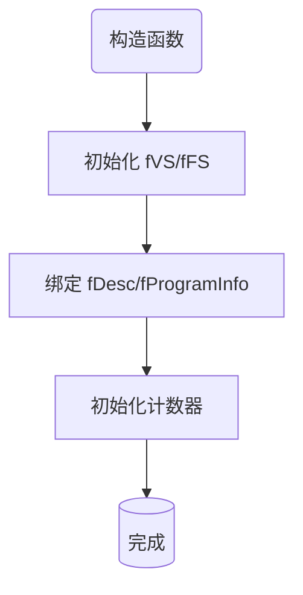

#### 析构函数 (.h:44, .cpp:48)
```cpp
virtual ~GrGLSLProgramBuilder();
```
默认实现。虚析构确保通过基类指针删除子类时行为正确。`fGPImpl`、`fXPImpl`、`fFPImpls` 中的 `unique_ptr` 自动释放。

**执行流程图:**
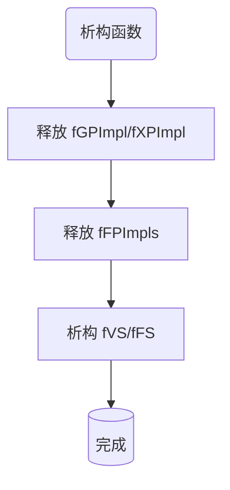

### B. 主流程编排

#### emitAndInstallProcs (.h:155, .cpp:61-81)
```cpp
bool emitAndInstallProcs();
```
**作用:** 整个 GLSL 生成的主入口。按固定顺序执行六个步骤（见第 5 节）。

**实现:** 顺序调用 `emitAndInstallPrimProc` → `emitAndInstallDstTexture` → `emitAndInstallFragProcs` → `emitAndInstallXferProc` → `emitTransformCode` → `checkSamplerCounts`。任何步骤返回 false 则立即终止并返回 false。

**调用场景:** 由后端子类在其 `build()` / `finalize()` 方法中调用，是着色器生成流程的唯一入口。

**执行流程图:**
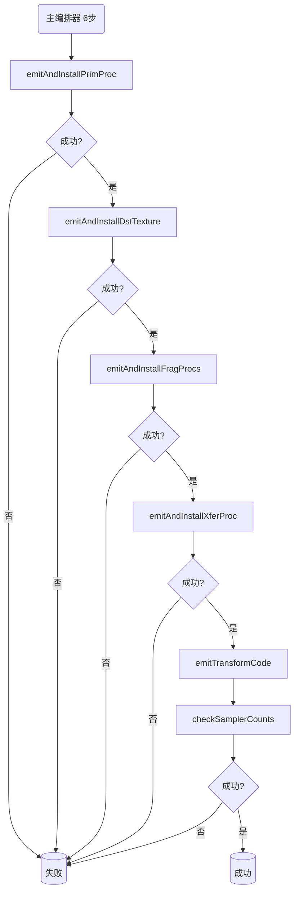

### C. 阶段处理器发射

#### emitAndInstallPrimProc (.h:167, .cpp:83-133)
```cpp
bool emitAndInstallPrimProc(SkString* outputColor, SkString* outputCoverage);
```
**作用:** 生成几何处理器的着色器代码。详见第 5.2 节步骤 1。

**关键点:** 返回的 `fFPCoordsMap` 和 `fLocalCoordsVar` 是后续 FP 坐标处理的基础，它们记录了哪些 FP 的坐标变换已被 GP 提升到 varying 中。

**执行流程图:**
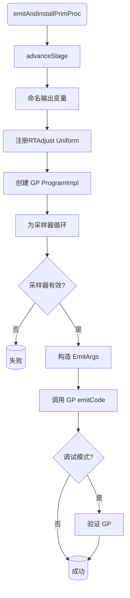

#### emitAndInstallDstTexture (.h:168, .cpp:330-403)
```cpp
bool emitAndInstallDstTexture();
```
**作用:** 设置目标颜色读取机制。详见第 5.2 节步骤 2。

**关键点:** 此函数不调用 `advanceStage()`，因为它不是独立的处理器阶段，而是管线基础设施的一部分。纹理模式和输入附件模式是互斥的，由 `pipeline()` 的状态决定。

**执行流程图:**
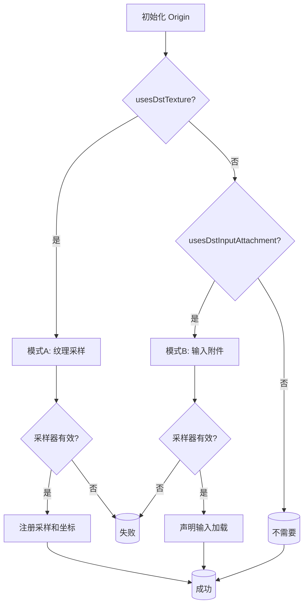

#### emitAndInstallFragProcs (.h:170, .cpp:135-151)
```cpp
bool emitAndInstallFragProcs(SkString* colorInOut, SkString* coverageInOut);
```
**作用:** 遍历管线中所有根 FP，为每个 FP 生成代码。详见第 5.2 节步骤 3。

**关键点:** 颜色 FP 和覆盖率 FP 共享同一个循环，通过 `isColorFragmentProcessor(i)` 选择操作 `colorInOut` 还是 `coverageInOut`。每个 FP 的输出成为下一个同类型 FP 的输入（链式传递）。

**执行流程图:**
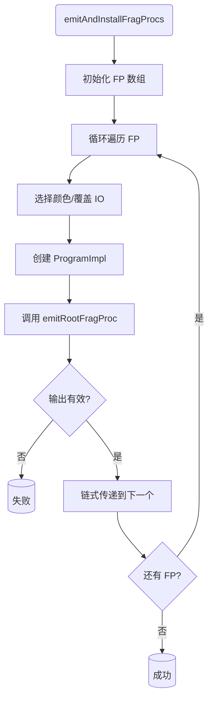

**链式数据流示例:**
```
color初值   → [FP0(颜色)] → output_S1 → [FP2(颜色)] → output_S3 → ...
coverage初值 → [FP1(覆盖)] → output_S2 → [FP3(覆盖)] → output_S4 → ...
```

#### emitRootFragProc (.h:172-175, .cpp:198-225)
```cpp
SkString emitRootFragProc(const GrFragmentProcessor& fp,
                          GrFragmentProcessor::ProgramImpl& impl,
                          const SkString& input, SkString output);
```
**作用:** 处理单个根 FP 的完整代码生成。

**实现:**
1. `advanceStage()` + `nameExpression` 设置阶段状态
2. 声明 `half4 output_S<n>;` 变量
3. `emitTextureSamplersForFPs` 注册 FP 树中所有 TextureEffect 的采样器
4. `writeFPFunction` 递归生成 FP 函数
5. `invokeFP` 生成调用表达式：`output_S<n> = funcName(input, coords);`
6. Debug 模式下 `verify(fp)` 检查 dst color 读取一致性

**返回:** 输出变量名（如 `"output_S1"`）。空字符串表示失败。

**执行流程图:**
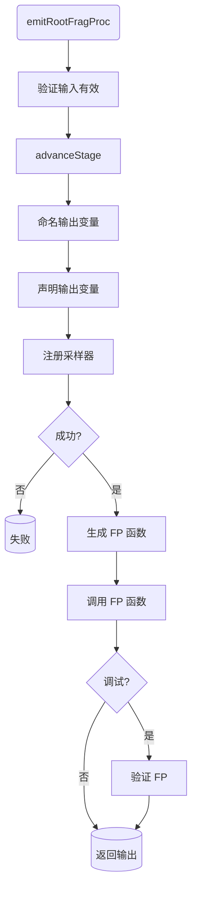

#### emitAndInstallXferProc (.h:179, .cpp:405-448)
```cpp
bool emitAndInstallXferProc(const SkString& colorIn, const SkString& coverageIn);
```
**作用:** 生成混合处理器的着色器代码。详见第 5.2 节步骤 4。

**关键点:** 若 `colorIn` 为空，使用 `"float4(1)"` 作为默认输入颜色。XP 代码被包裹在作用域块 `{}` 中以避免变量名冲突。

**执行流程图:**
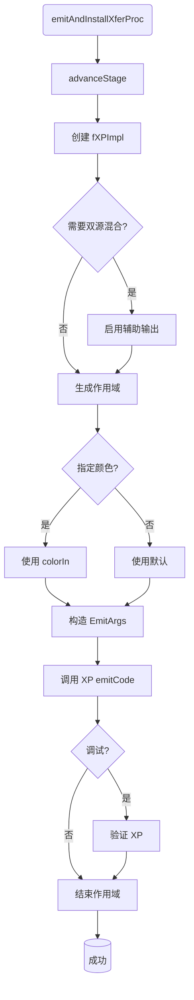

### D. FP 函数生成

#### writeFPFunction (.h:107, .cpp:245-328)
```cpp
void writeFPFunction(const GrFragmentProcessor& fp, GrFragmentProcessor::ProgramImpl& impl);
```
**作用:** 为单个 FP 生成完整的 SkSL 函数。这是 FP 代码生成的核心。详见第 5.2 节步骤 3a。

**生成的函数签名示例:**
```glsl
// 普通 FP
half4 TextureEffect_S1(half4 _input, float2 _coords) { ... }

// Blend FP
half4 BlendMode_S2(half4 _src, half4 _dst) { ... }

// 坐标已提升到 varying 的 FP
half4 ColorFilter_S3(half4 _input) { ... }
```

**执行流程图:**
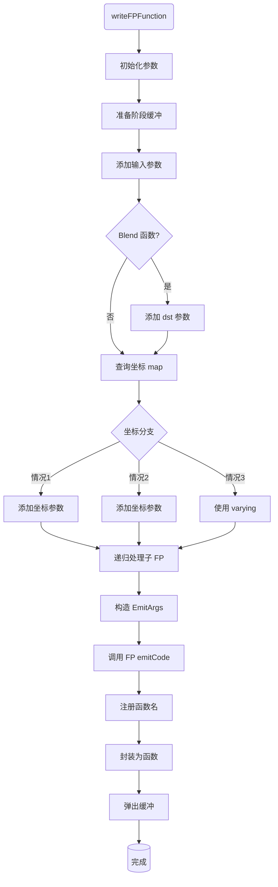

#### writeChildFPFunctions (.h:177-178, .cpp:227-243)
```cpp
void writeChildFPFunctions(const GrFragmentProcessor& fp,
                           GrFragmentProcessor::ProgramImpl& impl);
```
**作用:** 递归地为 FP 的所有子处理器生成函数。

**实现:**
1. 将 0 压入 `fSubstageIndices` 栈
2. 遍历所有子处理器，对每个非空子处理器调用 `writeFPFunction()`（递归）
3. 每处理完一个子处理器，递增栈顶计数器
4. 弹出栈顶

这确保了子 FP 的函数在父 FP 之前生成，使得父 FP 的函数体可以调用子 FP 的函数。

**执行流程图:**
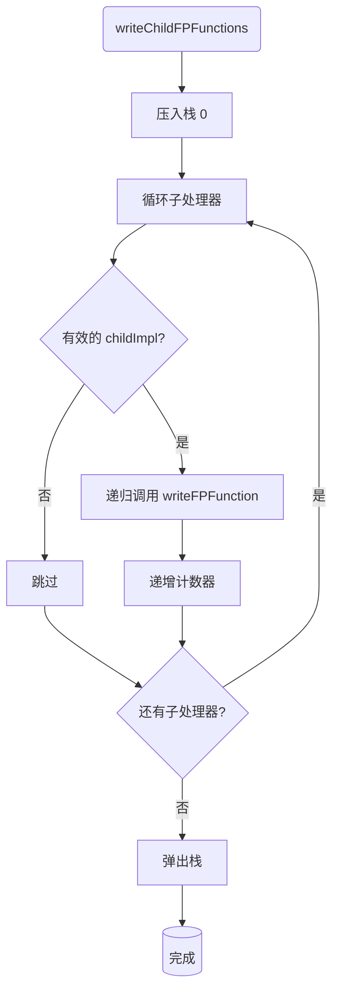

**栈状态演变示例:**
```
初始: fSubstageIndices = []

处理FP1 (S1):
  push(0)  → fSubstageIndices = [0]
  处理child[0] (S1_c0):
    递归调用writeFPFunction
    后 ++  → fSubstageIndices = [1]
  处理child[1] (S1_c1):
    递归调用writeFPFunction
    后 ++  → fSubstageIndices = [2]
  pop()    → fSubstageIndices = []

FP树结构与修饰示例:
FP1 (S1)
├── child[0] (S1_c0)          ← getMangleSuffix() = "_S1_c0"
│   ├── child[0] (S1_c0_c0)   ← getMangleSuffix() = "_S1_c0_c0"
│   └── child[1] (S1_c0_c1)   ← getMangleSuffix() = "_S1_c0_c1"
├── child[1] (S1_c1)          ← getMangleSuffix() = "_S1_c1"
└── child[2] (S1_c2)          ← getMangleSuffix() = "_S1_c2"
    └── child[0] (S1_c2_c0)   ← getMangleSuffix() = "_S1_c2_c0"
```

#### invokeFP (.h:113-117, .cpp:177-196)
```cpp
std::string invokeFP(const GrFragmentProcessor& fp,
                     const GrFragmentProcessor::ProgramImpl& impl,
                     const char* inputColor, const char* destColor,
                     const char* coords) const;
```
**作用:** 生成 FP 函数的调用表达式字符串。

**根据 FP 类型和坐标情况生成不同的调用形式:**

| isBlendFunction | hasCoordsParam | 生成表达式 |
|:---:|:---:|---|
| true | true | `funcName(inputColor, destColor, coords)` |
| true | false | `funcName(inputColor, destColor)` |
| false | true | `funcName(inputColor, coords)` |
| false | false | `funcName(inputColor)` |

**执行流程图:**
```mermaid
flowchart TD
    A(invokeFP) --> B{Blend 函数?}
    B -->|是| C{有坐标?}
    B -->|否| D{有坐标?}
    C -->|是| E[返回 func(src,dst,coords)]
    C -->|否| F[返回 func(src,dst)]
    D -->|是| G[返回 func(input,coords)]
    D -->|否| H[返回 func(input)]
    E --> I[(完成)]
    F --> I
    G --> I
    H --> I
```

**调用表达式示例:**

| isBlendFunction | hasCoordsParam | 调用表达式 |
|:---:|:---:|---|
| T | T | `BlendMode_S2(src, dst, coords)` |
| T | F | `BlendMode_S2(src, dst)` |
| F | T | `TextureEffect_S1(input, coords)` |
| F | F | `ColorFilter_S3(input)` |

#### fragmentProcessorHasCoordsParam (.h:122, .cpp:537-541)
```cpp
bool fragmentProcessorHasCoordsParam(const GrFragmentProcessor* fp) const;
```
**作用:** 判断 FP 函数是否需要坐标参数。

**实现:** 查询 `fFPCoordsMap`：若 FP 在 map 中，返回 `iter->second.hasCoordsParam`；否则回退到 `fp->usesSampleCoords()`。当坐标已被提升到 varying 时，`hasCoordsParam` 为 false，无需传递坐标参数。

**执行流程图:**
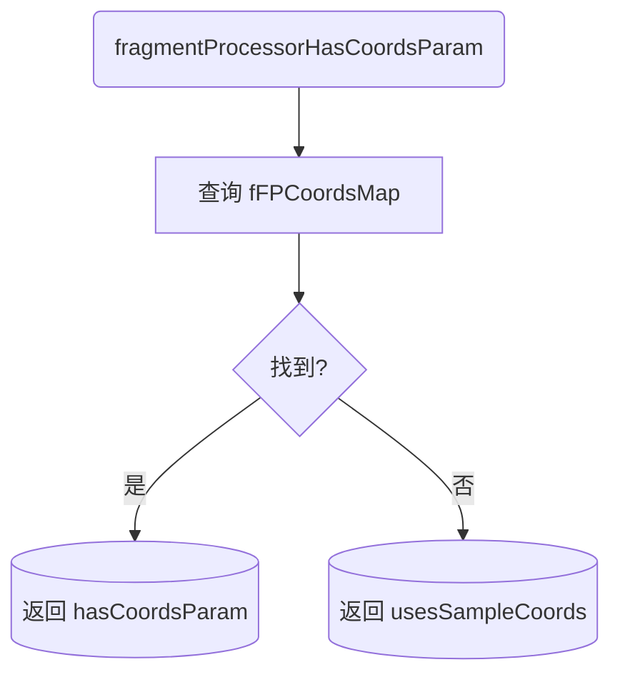

### E. 采样器管理

#### emitSampler (.h:180-181, .cpp:450-456)
```cpp
SamplerHandle emitSampler(const GrBackendFormat&, GrSamplerState,
                          const skgpu::Swizzle&, const char* name);
```
**作用:** 注册一个纹理采样器。

**实现:** 递增 `fNumFragmentSamplers`，然后委托给 `uniformHandler()->addSampler()`。返回的 `SamplerHandle` 用于后续的纹理查找操作。

**调用场景:** GP 纹理 (`emitAndInstallPrimProc`)、FP 中的 TextureEffect (`emitTextureSamplersForFPs`)、目标纹理 (`emitAndInstallDstTexture`)。

**执行流程图:**
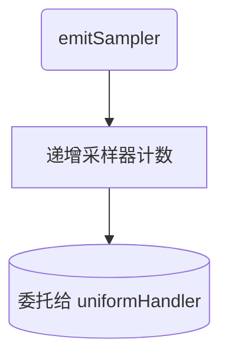

#### emitInputSampler (.h:182, .cpp:458-461)
```cpp
SamplerHandle emitInputSampler(const skgpu::Swizzle& swizzle, const char* name);
```
**作用:** 注册一个输入附件采样器（用于 Vulkan subpass input 等）。

**实现:** 委托给 `uniformHandler()->addInputSampler()`。注意：与 `emitSampler` 不同，此函数不递增 `fNumFragmentSamplers`，因为输入附件不占用普通采样器槽位。

**调用场景:** 仅在 `emitAndInstallDstTexture()` 的输入附件模式中使用。

**执行流程图:**
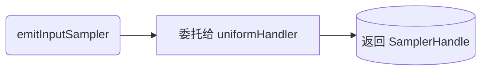

#### emitTextureSamplersForFPs (.h:91-93, .cpp:153-175)
```cpp
bool emitTextureSamplersForFPs(const GrFragmentProcessor& fp,
                               GrFragmentProcessor::ProgramImpl& impl,
                               int* samplerIndex);
```
**作用:** 遍历 FP 树，为所有 `GrTextureEffect` 节点注册采样器。

**实现:** 使用 `fp.visitWithImpls()` 访问者模式遍历 FP 树。对每个 `GrTextureEffect`：
1. 生成采样器名称 `TextureSampler_<index>`
2. 提取 `samplerState`、`backendFormat`、`swizzle`
3. 调用 `emitSampler()` 注册
4. 将返回的 handle 设置到 `GrTextureEffect::Impl` 上

**关键点:** `samplerIndex` 是传入传出参数，确保采样器在整个 FP 树中编号连续。

**执行流程图:**
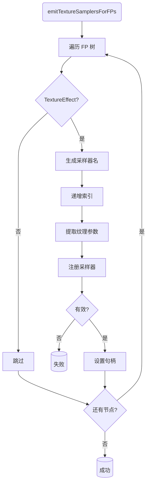

**FP树遍历与采样器编号示例:**
```
FP1树:
├── node1 (TextureEffect) → TextureSampler_0 (samplerIndex++)
├── node2 (ColorMatrix)   → 跳过 (非TextureEffect)
└── node3 (TextureEffect) → TextureSampler_1 (samplerIndex++)

FP2树:
├── node1 (TextureEffect) → TextureSampler_2 (samplerIndex++)
└── node2 (TextureEffect) → TextureSampler_3 (samplerIndex++)

[samplerIndex从0递增, 确保全局编号连续]
```

#### checkSamplerCounts (.h:183, .cpp:463-470)
```cpp
bool checkSamplerCounts();
```
**作用:** 验证注册的片段采样器数量未超出硬件限制。

**实现:** 比较 `fNumFragmentSamplers` 与 `shaderCaps.fMaxFragmentSamplers`。超出时通过 `GrCapsDebugf` 输出警告并返回 false。

**执行流程图:**
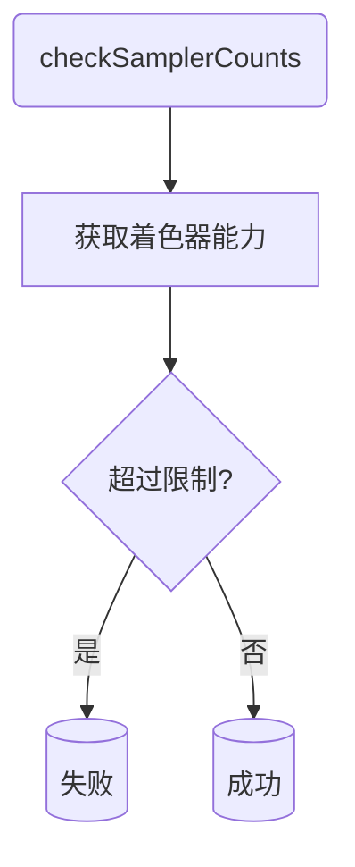

### F. 名称修饰

#### nameVariable (.h:85, .cpp:496-510)
```cpp
SkString nameVariable(char prefix, const char* name, bool mangle = true);
```
**作用:** 生成带前缀和阶段后缀修饰的变量名。

**实现:**
1. 若 `prefix` 非 `'\0'`，生成 `"<prefix><name>"`；否则直接使用 `name`
2. 若 `mangle=true`，追加 `getMangleSuffix()` 返回的后缀
3. 特殊处理：若变量名以 `_` 结尾而后缀以 `_` 开头，插入 `x` 避免产生 `__`（GLSL 保留标识符）

**示例:** `nameVariable('u', "Color")` 在阶段 1 产生 `"uColor_S1"`

**执行流程图:**
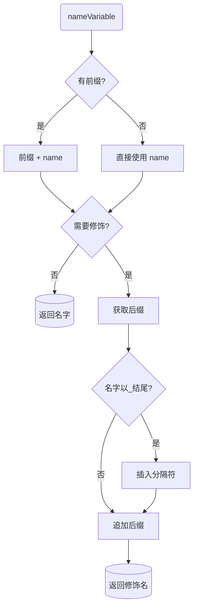

**变量名修饰示例:**

```
输入: nameVariable('u', "Color", true)  @ fStageIndex=1
处理:
  1. prefix='u' → out = "uColor"
  2. mangle=true → suffix = "_S1"
  3. out.endsWith('_')? NO → underscoreSplitter = ""
  4. out = "uColor" + "" + "_S1" = "uColor_S1"
返回: "uColor_S1"

输入: nameVariable('\0', "foo_", true)  @ fStageIndex=2, fSubstageIndices=[0,1]
处理:
  1. prefix='\0' → out = "foo_"
  2. mangle=true → suffix = "_S2_c0_c1"
  3. out.endsWith('_')? YES → underscoreSplitter = "x"
  4. out = "foo_" + "x" + "_S2_c0_c1" = "foo_x_S2_c0_c1"
返回: "foo_x_S2_c0_c1"
      [避免了 "foo__S2_c0_c1"]

输入: nameVariable('t', "Value", false)
处理:
  1. prefix='t' → out = "tValue"
  2. mangle=false → 直接返回
返回: "tValue"
```

#### nameExpression (.h:165, .cpp:512-518)
```cpp
void nameExpression(SkString* output, const char* baseName);
```
**作用:** 为阶段输出变量命名。

**实现:** 若 `output` 为空，调用 `nameVariable('\0', baseName)` 生成新名称（如 `"outputColor_S0"`）。若 `output` 已有值则不修改——这允许调用者预设变量名。

**调用场景:** 在 `emitAndInstallPrimProc` 和 `emitRootFragProc` 中为每个阶段的输出变量命名。

**执行流程图:**
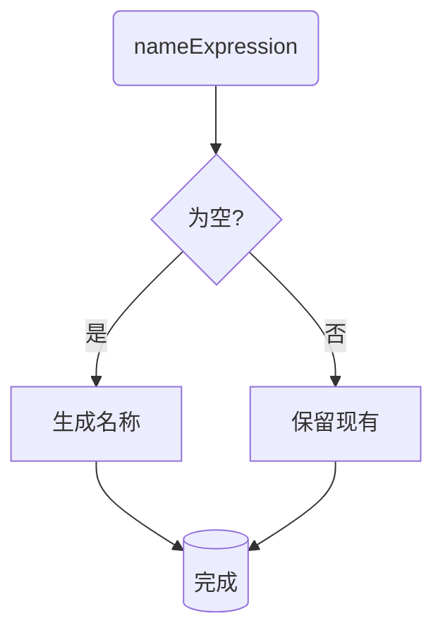

#### getMangleSuffix (.h:162, .cpp:486-494)
```cpp
SkString getMangleSuffix() const;
```
**作用:** 根据当前的 `fStageIndex` 和 `fSubstageIndices` 生成名称修饰后缀。

**实现:** 基础格式 `_S<stageIndex>`，然后为 `fSubstageIndices` 栈中的每个值追加 `_c<index>`。

**示例:** `fStageIndex=1`, `fSubstageIndices=[0, 2]` → `"_S1_c0_c2"`

**执行流程图:**
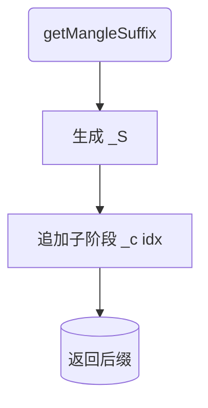

### G. Uniform 与着色器管理

#### appendUniformDecls (.h:59, .cpp:520-522)
```cpp
void appendUniformDecls(GrShaderFlags visibility, SkString* out) const;
```
**作用:** 将指定可见性的 uniform 声明追加到字符串中。

**实现:** 委托给 `uniformHandler()->appendUniformDecls()`。`visibility` 可为 `kVertex_GrShaderFlag`、`kFragment_GrShaderFlag` 或两者组合。

**调用场景:** 后端子类在最终组装着色器源码时调用。

**执行流程图:**
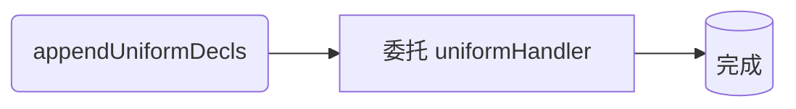

#### addRTFlipUniform (.h:79, .cpp:524-535)
```cpp
void addRTFlipUniform(const char* name);
```
**作用:** 添加渲染目标翻转 uniform（float2），用于 `dFdy`、`sk_Clockwise`、`sk_FragCoord` 的正确处理。

**实现:** 通过 `uniformHandler()->internalAddUniformArray()` 注册一个 fragment-only 的 float2 uniform。使用 `internalAddUniformArray` 而非 `addUniform`，因为这个 uniform 不应被名称修饰——它在所有阶段共享。

**关键点:** 断言 `fUniformHandles.fRTFlipUni` 尚未有效，确保只添加一次。

**执行流程图:**
```mermaid
flowchart TD
    A(addRTFlipUniform) --> B[验证未重复]
    B --> C[获取 uniformHandler]
    C --> D[注册 float2 uniform]
    D --> E[(完成)]
```

#### addFeature (.h:153, .cpp:50-59)
```cpp
void addFeature(GrShaderFlags shaders, uint32_t featureBit, const char* extensionName);
```
**作用:** 向指定的着色器添加 GLSL 扩展声明（如 `#extension GL_EXT_shader_framebuffer_fetch : require`）。

**实现:** 检查 `shaders` 标志位，分别向 `fVS` 和/或 `fFS` 添加扩展。`featureBit` 用于去重——同一扩展不会被重复声明。

**执行流程图:**
```mermaid
flowchart TD
    A(addFeature) --> B{顶点着色器?}
    B -->|是| C[添加到 fVS]
    B -->|否| D[跳过]
    C --> E{片段着色器?}
    D --> E
    E -->|是| F[添加到 fFS]
    E -->|否| G[跳过]
    F --> H[(完成)]
    G --> H
```

#### finalizeShaders (.h:157, .cpp:543-547)
```cpp
void finalizeShaders();
```
**作用:** 最终化 varying 处理器和着色器代码。

**实现:** 按顺序调用：
1. `varyingHandler()->finalize()` — 解析所有 varying 声明
2. `fVS.finalize(kVertex_GrShaderFlag)` — 完成顶点着色器
3. `fFS.finalize(kFragment_GrShaderFlag)` — 完成片段着色器

**调用场景:** 在 `emitAndInstallProcs()` 之后、后端编译之前由子类调用。

**执行流程图:**
```mermaid
flowchart TD
    A(finalizeShaders) --> B[finalize varyingHandler]
    B --> C[finalize fVS]
    C --> D[finalize fFS]
    D --> E[(完成)]
```

### H. 查询访问器

#### caps / shaderCaps (.h:46-47)
```cpp
virtual const GrCaps* caps() const = 0;          // 纯虚
const GrShaderCaps* shaderCaps() const;           // 委托给 caps()->shaderCaps()
```
**作用:** 查询 GPU 能力和着色器能力。`GrCaps` 包含纹理格式支持、最大纹理尺寸等；`GrShaderCaps` 包含 GLSL 版本、扩展支持、采样器数量限制等。

**执行流程图:**
```mermaid
flowchart LR
    A(caps) --> B[(GPU能力)]
    C(shaderCaps) --> D[调用 caps]
    D --> E[(着色器能力)]
```

#### origin / pipeline / geometryProcessor (.h:49-51)
```cpp
GrSurfaceOrigin origin() const;
const GrPipeline& pipeline() const;
const GrGeometryProcessor& geometryProcessor() const;
```
**作用:** 从 `fProgramInfo` 中提取管线信息。`origin()` 返回渲染目标的 Y 轴方向；`pipeline()` 返回包含 FP 链和 XP 的管线；`geometryProcessor()` 返回 GP。

**执行流程图:**
```mermaid
flowchart LR
    A(origin) --> B[(origin 类型)]
    C(pipeline) --> D[(GrPipeline)]
    E(geometryProcessor) --> F[(GrGeometryProcessor)]
```

#### snapVerticesToPixelCenters / hasPointSize (.h:52-55)
```cpp
bool snapVerticesToPixelCenters() const;
bool hasPointSize() const;
```
**作用:** 查询绘制配置。`snapVerticesToPixelCenters` 控制顶点是否对齐到像素中心（用于消除亚像素抗锯齿伪影）；`hasPointSize` 检查图元类型是否为 `kPoints`（需要 `gl_PointSize`）。

**执行流程图:**
```mermaid
flowchart LR
    A(snapVerticesToPixelCenters) --> B[(bool)]
    C(hasPointSize) --> D[(bool)]
```

#### desc (.h:57)
```cpp
const GrProgramDesc& desc() const;
```
**作用:** 返回程序描述符，用于着色器缓存的键。

**执行流程图:**
```mermaid
flowchart LR
    A(desc) --> B[(GrProgramDesc)]
```

#### samplerVariable / samplerSwizzle (.h:61-67)
```cpp
const char* samplerVariable(SamplerHandle handle) const;
skgpu::Swizzle samplerSwizzle(SamplerHandle handle) const;
```
**作用:** 通过句柄获取纹理采样器的 GLSL 变量名和颜色通道重排（swizzle）。委托给 `uniformHandler()`。

**执行流程图:**
```mermaid
flowchart LR
    A(samplerVariable) --> B[委托 uniformHandler]
    B --> C[(变量名)]
    D(samplerSwizzle) --> E[委托 uniformHandler]
    E --> F[(Swizzle)]
```

#### inputSamplerVariable / inputSamplerSwizzle (.h:69-75)
```cpp
const char* inputSamplerVariable(SamplerHandle handle) const;
skgpu::Swizzle inputSamplerSwizzle(SamplerHandle handle) const;
```
**作用:** 通过句柄获取输入附件采样器的 GLSL 变量名和 swizzle。委托给 `uniformHandler()`。

**执行流程图:**
```mermaid
flowchart LR
    A(inputSamplerVariable) --> B[委托 uniformHandler]
    B --> C[(变量名)]
    D(inputSamplerSwizzle) --> E[委托 uniformHandler]
    E --> F[(Swizzle)]
```

### I. 虚函数接口

#### uniformHandler (.h:124-125)
```cpp
virtual GrGLSLUniformHandler* uniformHandler() = 0;
virtual const GrGLSLUniformHandler* uniformHandler() const = 0;
```
**作用:** 纯虚函数，由后端子类实现，返回后端特定的 uniform 处理器。const 重载版本用于只读操作。

**执行流程图:**
```mermaid
flowchart LR
    A(uniformHandler) --> B[(处理器指针)]
    C(uniformHandler const) --> D[(const 处理器)]
```

#### varyingHandler (.h:126)
```cpp
virtual GrGLSLVaryingHandler* varyingHandler() = 0;
```
**作用:** 纯虚函数，由后端子类实现，返回后端特定的 varying 处理器。

**执行流程图:**
```mermaid
flowchart LR
    A(varyingHandler) --> B[(处理器指针)]
```

#### finalizeFragmentSecondaryColor (.h:130)
```cpp
virtual void finalizeFragmentSecondaryColor(GrShaderVar& outputColor) {}
```
**作用:** 虚函数，默认空实现。用于后端自定义片段着色器次要颜色输出变量。仅在着色器中显式声明了 secondary output 时使用。

**执行流程图:**
```mermaid
flowchart TD
    A(finalizeFragmentSecondaryColor) --> B{子类覆盖?}
    B -->|是| C[自定义实现]
    B -->|否| D[默认空实现]
    C --> E[(完成)]
    D --> E
```

### J. 辅助

#### fragColorIsInOut (.h:159)
```cpp
bool fragColorIsInOut() const;
```
**作用:** 查询片段颜色输出是否同时为输入和输出（`inout` 修饰）。委托给 `fFS.primaryColorOutputIsInOut()`。

这在支持 framebuffer fetch 的 GPU 上使用，此时 `gl_FragColor` 同时可读可写，XP 可以直接在其上做混合运算而无需单独的目标纹理。

**执行流程图:**
```mermaid
flowchart TD
    A(fragColorIsInOut) --> B[查询 fFS]
    B --> C{inout 修饰?}
    C -->|是| D[(true)]
    C -->|否| E[(false)]
```

#### advanceStage (.h:100-104)
```cpp
void advanceStage();
```
**作用:** 推进阶段索引，清除调试验证状态。

**实现:** `fStageIndex++`，然后在 debug 模式下调用 `fFS.debugOnly_resetPerStageVerification()` 重置 dst color 读取跟踪，再调用 `fFS.nextStage()` 准备下一个阶段的代码缓冲。

**执行流程图:**
```mermaid
flowchart TD
    A(advanceStage) --> B[递增阶段索引]
    B --> C{调试模式?}
    C -->|是| D[重置验证状态]
    C -->|否| E[准备下一阶段]
    D --> E
    E --> F[(完成)]
```

#### kVarsPerBlock (.h:133, .cpp:38)
```cpp
static const int kVarsPerBlock;  // = 8
```
**作用:** 静态常量，定义单个分配块中的变量数量。多个构建器使用此值作为内存分配粒度。

### K. 调试验证 (SK_DEBUG)

#### verify(GrGeometryProcessor&) (.h:186, .cpp:473-475)
```cpp
void verify(const GrGeometryProcessor& geomProc);
```
**作用:** 断言 GP 阶段没有读取 dst color（`fFS.fHasReadDstColorThisStage_DebugOnly == false`）。GP 不应该读取目标颜色。

**执行流程图:**
```mermaid
flowchart TD
    A(verify geomProc) --> B[断言: GP 不读取 dst]
    B --> C[(完成)]
```

#### verify(GrFragmentProcessor&) (.h:187, .cpp:477-479)
```cpp
void verify(const GrFragmentProcessor& fp);
```
**作用:** 断言 FP 声明的 `willReadDstColor()` 与实际的 `fHasReadDstColorThisStage_DebugOnly` 一致。确保 FP 的元数据与实际代码行为匹配。

**执行流程图:**
```mermaid
flowchart TD
    A(verify fp) --> B[断言: dst 声明一致]
    B --> C[(完成)]
```

#### verify(GrXferProcessor&) (.h:188, .cpp:481-483)
```cpp
void verify(const GrXferProcessor& xp);
```
**作用:** 断言 XP 声明的 `willReadDstColor()` 与实际的 `fHasReadDstColorThisStage_DebugOnly` 一致。

**执行流程图:**
```mermaid
flowchart TD
    A(verify xp) --> B[断言: dst 声明一致]
    B --> C[(完成)]
```

## 7. 名称修饰方案详解

名称修饰用于避免不同处理器阶段中同名变量的冲突。

### 阶段索引规则

| 阶段 | fStageIndex | 后缀示例 |
|------|:-----------:|----------|
| GP (几何处理器) | 0 | `_S0` |
| 第 1 个根 FP | 1 | `_S1` |
| 第 2 个根 FP | 2 | `_S2` |
| ... | ... | ... |
| XP (混合处理器) | N+1 | `_S<N+1>` |

### 子阶段格式

FP 可以有子 FP，形成树状结构。`fSubstageIndices` 栈跟踪在树中的位置：

```
阶段 1 的根 FP:           _S1
├── child[0]:             _S1_c0
│   ├── child[0]:         _S1_c0_c0
│   └── child[1]:         _S1_c0_c1
├── child[1]:             _S1_c1
└── child[2]:             _S1_c2
    └── child[0]:         _S1_c2_c0
```

### 避免 `__` 的规则

GLSL 规范保留了包含 `__`（双下划线）的标识符。当变量名以 `_` 结尾且后缀以 `_` 开头时，`nameVariable` 会插入字符 `x` 作为分隔：

```
变量名 "foo_" + 后缀 "_S1" → "foo_x_S1"  (而非 "foo__S1")
变量名 "bar"  + 后缀 "_S1" → "bar_S1"    (正常)
```

### 完整示例

假设管线有 GP + 2 个根 FP + XP，第一个 FP 有两个子 FP：

```
GP 阶段:  outputColor_S0, outputCoverage_S0
FP1 阶段: output_S1
  FP1.child[0]: 函数名后缀 _S1_c0
  FP1.child[1]: 函数名后缀 _S1_c1
FP2 阶段: output_S2
XP 阶段:  阶段索引 3 (_S3)
```

## 8. FP 坐标处理详解

### fFPCoordsMap 的来源

在 `emitAndInstallPrimProc()` 中，`fGPImpl->emitCode()` 返回一个 `std::tuple<FPCoordsMap, GrShaderVar>`。GP 实现在 emitCode 过程中分析所有 FP 的坐标使用情况，决定哪些坐标变换可以提升到顶点着色器。

### 三种坐标处理情况

**情况 1: FP 不在 fFPCoordsMap 中**

FP 的坐标未被 GP 分析或无法提升。若 FP 使用采样坐标（`usesSampleCoords() == true`），则需要 `_coords` 参数。

**情况 2: 在 map 中且 hasCoordsParam = true**

FP 的坐标变换链中存在无法提升到顶点着色器的部分（如依赖片段着色器变量的变换）。仍需通过参数传入坐标。

**情况 3: 在 map 中且 hasCoordsParam = false**

FP 的坐标变换已完全提升到顶点着色器。根据 `coordsVarying` 的类型：

| varying 类型 | 处理方式 |
|:---:|---|
| `kFloat2` | 直接使用 varying 变量名作为 `sampleCoords` |
| `kFloat3` | 在片段着色器中执行透视除法: `float2 _coords = varying.xy / varying.z;` |
| `kVoid` | FP 不直接使用坐标（可能只通过子 FP 间接使用） |

### 性能优势

将坐标变换提升到顶点着色器的好处：
- **计算量减少**: 顶点数通常远少于片段数，矩阵乘法在顶点着色器中执行后通过 varying 插值传递
- **精度足够**: 对于仿射变换（kFloat2），线性插值精度足够；对于透视变换（kFloat3），保留齐次坐标在片段着色器中做除法

## 9. 后端子类

各后端子类继承 `GrGLSLProgramBuilder`，提供以下后端特定功能：

| 后端 | 子类 | uniformHandler | varyingHandler | 编译目标 |
|------|------|:-:|:-:|------|
| GL | `GrGLProgramBuilder` | `GrGLUniformHandler` | `GrGLVaryingHandler` | GLSL 源码 → `glCompileShader` |
| Vulkan | `GrVkPipelineStateBuilder` | `GrVkUniformHandler` | `GrVkVaryingHandler` | GLSL → SPIR-V (通过 SkSL 编译器) |
| Metal | `GrMtlPipelineStateBuilder` | `GrMtlUniformHandler` | `GrMtlVaryingHandler` | SkSL → Metal Shading Language |
| D3D | `GrD3DPipelineStateBuilder` | `GrD3DUniformHandler` | `GrD3DVaryingHandler` | SkSL → HLSL |

每个后端还负责：
- 着色器编译和链接
- 程序/管线状态对象的缓存（基于 `GrProgramDesc`）
- 后端特定的 uniform block layout（如 Vulkan 的 descriptor set）

## 10. 设计模式

### 模板方法模式
`emitAndInstallProcs()` 定义了着色器生成的固定骨架（GP → DstTexture → FPs → XP → TransformCode → Check），而 `uniformHandler()` / `varyingHandler()` 等虚方法由子类提供具体实现。基类控制"做什么"和"按什么顺序做"，子类控制"用什么做"。

### 访问者模式
`emitTextureSamplersForFPs()` 通过 `fp.visitWithImpls()` 遍历 FP 树，对每个 `GrTextureEffect` 执行采样器注册操作。这避免了手动递归遍历树结构。

### FP 函数化
每个 FP 被编译为一个独立的 SkSL 函数（由 `writeFPFunction` 生成），通过函数调用（由 `invokeFP` 生成）组合在一起。这种设计：
- 使 FP 代码可以在不同上下文中复用
- 天然支持 FP 树的递归结构
- 每个 FP 有独立的局部作用域，避免变量冲突

## 11. 性能考量

- **FP 坐标提升到 varying**: 减少片段着色器中的矩阵运算，将每像素的矩阵乘法变为每顶点计算 + 硬件插值
- **采样器数量检查**: 在代码生成阶段提前发现超出硬件限制，避免无谓的编译尝试
- **目标纹理 vs 输入附件**: 在 tiler 架构的移动 GPU 上，输入附件（subpass input）直接访问 tile 内存，避免了纹理拷贝的带宽开销
- **着色器缓存复用**: 通过 `GrProgramDesc` 作为键缓存编译后的着色器程序，避免重复编译

## 12. 依赖关系与相关文件

### 直接依赖
- `GrGLSLVertexBuilder` / `GrGLSLFragmentShaderBuilder` — 顶点和片段着色器代码构建器
- `GrGLSLUniformHandler` / `GrGLSLVaryingHandler` — uniform 和 varying 管理（由子类提供）
- `GrGeometryProcessor` / `GrFragmentProcessor` / `GrXferProcessor` — 三种处理器及其 `ProgramImpl`
- `GrTextureEffect` — FP 树中纹理采样器的特殊处理
- `GrProgramDesc` / `GrProgramInfo` — 程序描述和管线信息
- `GrPipeline` — 处理器管线，提供 FP 链和混合配置

### 相关文件
- `src/gpu/ganesh/glsl/GrGLSLShaderBuilder.h` — 着色器构建器基类
- `src/gpu/ganesh/glsl/GrGLSLVertexGeoBuilder.h` — 顶点着色器构建器
- `src/gpu/ganesh/glsl/GrGLSLFragmentShaderBuilder.h` — 片段着色器构建器
- `src/gpu/ganesh/glsl/GrGLSLVarying.h` — varying 处理
- `src/gpu/ganesh/glsl/GrGLSLUniformHandler.h` — uniform 处理
- `src/gpu/ganesh/GrGeometryProcessor.h` — 几何处理器
- `src/gpu/ganesh/GrFragmentProcessor.h` — 片段处理器
- `src/gpu/ganesh/GrXferProcessor.h` — 混合处理器
- `src/gpu/ganesh/effects/GrTextureEffect.h` — 纹理效果（FP 中的采样器来源）
