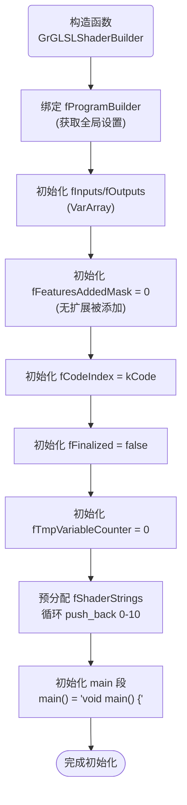
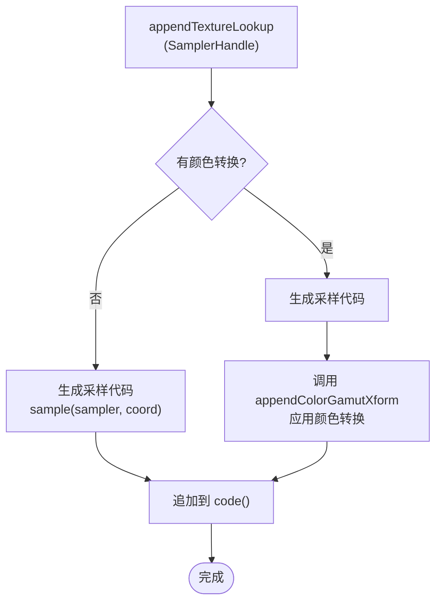
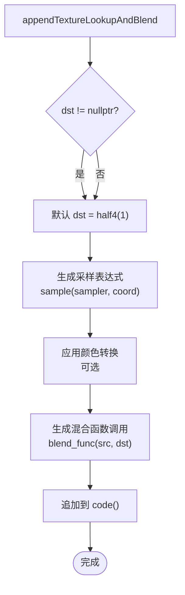
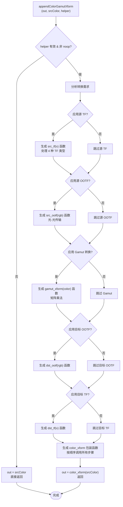
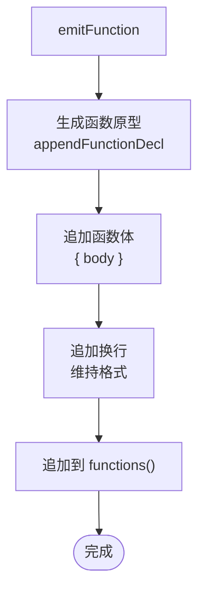
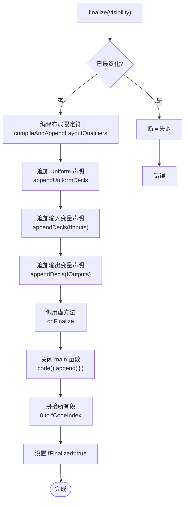
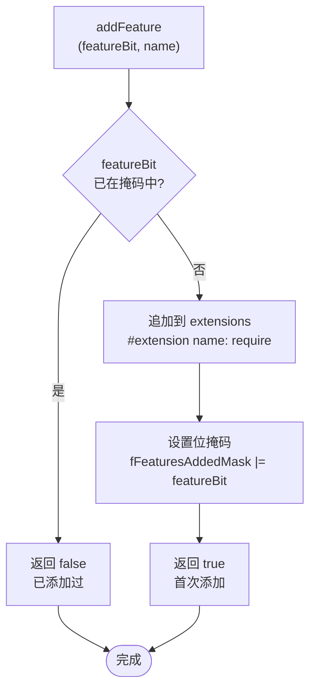
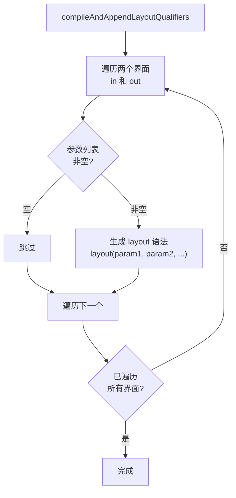

# GrGLSLShaderBuilder

> 源文件: `src/gpu/ganesh/glsl/GrGLSLShaderBuilder.h` (295 行), `src/gpu/ganesh/glsl/GrGLSLShaderBuilder.cpp` (349 行)

## 1. 概述

`GrGLSLShaderBuilder` 是所有 GLSL 着色器构建器的基类。它通过**多段式构建模式**管理着色器源码的各个部分（扩展、定义、精度、布局限定符、uniform、输入、输出、函数、主函数和代码段），为纹理查找、颜色空间转换、常量定义、函数发射等提供统一接口，并在最终化时按固定顺序将所有段拼接为完整的着色器字符串。

核心特点：
- **多段式构建** - 通过 `fShaderStrings` 数组将着色器代码按逻辑分段管理，每段有明确的用途
- **代码段堆栈** - 通过 `fCodeIndex` 支持多层代码块，用于 FP 函数化分析的递归代码生成
- **特性去重** - 通过位掩码 `fFeaturesAddedMask` 防止同一扩展被重复声明
- **临时变量生成** - 自动计数生成唯一的临时变量名，避免命名冲突

## 2. 架构位置

### 继承关系
```
GrGLSLShaderBuilder（抽象基类）
├── GrGLSLVertexBuilder       （顶点着色器）
├── GrGLSLFragmentShaderBuilder（片段着色器）
└── GrGLSLGeometryBuilder      （几何着色器）
```

### 在渲染管线中的位置
```
GrGLSLProgramBuilder
├── fVS: GrGLSLVertexBuilder   → 顶点着色器源码
└── fFS: GrGLSLFragmentShaderBuilder → 片段着色器源码
     │
     ├── 纹理操作
     ├── 颜色转换
     ├── 代码生成
     ▼
程序编译和链接
     │
     ▼
GPU 执行
```

## 3. 关键成员变量

### Public 相关

无显式 public 成员变量（所有功能通过公开方法暴露）。

### Protected 成员变量 (.h:267-284)

| 成员 | 类型 | 说明 |
|------|------|------|
| `fProgramBuilder` | `GrGLSLProgramBuilder*` | 反向引用到程序构建器，用于访问 uniform handler、shader caps 等全局设置 |
| `fCompilerString` | `std::string` | 最终的着色器源码字符串，由所有 fShaderStrings 段拼接而成 |
| `fShaderStrings` | `STArray<kPrealloc, SkString>` | 主要代码段数组，预分配 16 个段（kCode + 6），支持动态扩展 |
| `fCode` | `SkString` | 主代码段的别名引用（废弃，兼容性保留） |
| `fFunctions` | `SkString` | 函数段的别名引用（废弃，兼容性保留） |
| `fExtensions` | `SkString` | 扩展段的别名引用（废弃，兼容性保留） |
| `fDeclarations` | `SkSL::StatementArray` | 保留 SkSL AST 声明，防止在变量引用前被销毁 |
| `fInputs` | `VarArray` | 输入变量数组（由片段处理器提供的 varying 或顶点属性） |
| `fOutputs` | `VarArray` | 输出变量数组（如法向量、深度等输出） |
| `fFeaturesAddedMask` | `uint32_t` | 扩展特性位掩码，用于防止重复添加 #extension 指令 |
| `fLayoutParams` | `STArray<kLastInterfaceQualifier+1, SkString>` | 2 个数组，分别存储 in 和 out 的布局限定符参数 |
| `fCodeIndex` | `int` | 当前代码段索引（初值为 kCode），支持动态切换代码段 |
| `fFinalized` | `bool` | 是否已调用 finalize()，防止重复最终化 |
| `fTmpVariableCounter` | `int` | 临时变量计数器，用于生成唯一的临时变量名 |

## 4. 着色器段结构详解

着色器由 10 个有序的代码段组成，最终按此顺序拼接为完整着色器。每个段的作用和索引如下：

### 段索引枚举 (.h:252-265)

```cpp
enum {
    kExtensions,           // 0 - GLSL 扩展指令 (#extension)
    kDefinitions,          // 1 - 常量定义和全局变量
    kPrecisionQualifier,   // 2 - 精度限定符 (precision mediump float)
    kLayoutQualifiers,     // 3 - 默认布局限定符 (layout(location=0) in/out)
    kUniforms,             // 4 - uniform 变量声明
    kInputs,               // 5 - 输入变量（varying/顶点属性）
    kOutputs,              // 6 - 输出变量（varying 或输出）
    kFunctions,            // 7 - 辅助函数定义
    kMain,                 // 8 - main() 函数开头 "void main() {"
    kCode,                 // 9 - 动态代码段（主代码）
    kPrealloc = kCode + 6  // 预分配 16 个段
};
```

### 段的作用与内容

| 段索引 | 段名 | 用途 | 示例 | 访问器 |
|--------|------|------|------|--------|
| 0 | Extensions | GLSL 扩展指令 | `#extension GL_EXT_gpu_shader4 : require` | `extensions()` |
| 1 | Definitions | 全局常量、辅助宏定义 | `const vec4 kColorScale = ...;` | `definitions()` |
| 2 | PrecisionQualifier | 精度限定符（移动端必需） | `precision highp float;` | `precisionQualifier()` |
| 3 | LayoutQualifiers | 默认布局限定符 | `layout(location=0) in;` | `layoutQualifiers()` |
| 4 | Uniforms | uniform 变量声明 | `uniform mat4 uViewMatrix;` | `uniforms()` |
| 5 | Inputs | 输入变量（varying） | `in vec4 vColor;` | `inputs()` |
| 6 | Outputs | 输出变量 | `out vec4 outColor;` | `outputs()` |
| 7 | Functions | 辅助函数定义 | `float square(float x) { return x*x; }` | `functions()` |
| 8 | Main | main 函数头 | `void main() {` | `main()` |
| 9+ | Code | 动态代码段 | `outColor = ...;` | `code()` / 其他段 |

### 最终拼接顺序

```
着色器源码 = 段0 + 段1 + 段2 + ... + 段fCodeIndex
```

构造时初始化 11 个段（0-10），最后调用 `finalize()` 时将 0 到 fCodeIndex 的所有段拼接：

```cpp
for (int i = 0; i <= fCodeIndex; i++) {
    fCompilerString.append(fShaderStrings[i].c_str(), fShaderStrings[i].size());
}
```

### 代码段堆栈机制

通过 `nextStage()` 和 `deleteStage()` 实现多层代码段支持（用于 FP 函数化分析）：

```cpp
void nextStage() {
    fShaderStrings.push_back();  // 添加新段
    fCodeIndex++;                 // 指向新段
}

void deleteStage() {
    fShaderStrings.pop_back();   // 删除最后一段
    fCodeIndex--;                 // 指向前一段
}
```

例如：
- 初始化时 fCodeIndex = kCode (9)
- 处理第 1 个 FP 时 nextStage() → fCodeIndex = 10
- 处理第 2 个 FP 时 nextStage() → fCodeIndex = 11
- 完成后 deleteStage() → fCodeIndex = 10，回到上一段

## 5. 函数详解

### 5.1 构造与析构

#### 构造函数 (.h:36, .cpp:23-37)

```cpp
GrGLSLShaderBuilder(GrGLSLProgramBuilder* program);
```

初始化着色器构建器的所有状态，预分配 11 个代码段。

**执行流程:**



**关键细节:**
- `fInputs/fOutputs` 用块列表（SkTBlockList）实现，每块 kVarsPerBlock 个元素
- `fShaderStrings` 通过循环 `push_back()` 预分配 11 个空段，以减少后续动态分配
- `main()` 段初始化为 `"void main() {"` 作为后续代码的容器

#### 析构函数 (.h:37)

```cpp
virtual ~GrGLSLShaderBuilder() {}
```

默认虚析构，确保通过基类指针删除子类时行为正确。所有成员通过默认析构释放。

---

### 5.2 纹理操作

#### appendTextureLookup (SkString*) (.h:45, .cpp:101-107)

```cpp
void appendTextureLookup(SkString* out, SamplerHandle samplerHandle,
                         const char* coordName) const;
```

生成纹理采样代码，结果追加到 `out` 字符串（不追加到着色器代码）。

**功能:**
- 获取采样器变量名（如 `uSampler0`）
- 生成采样表达式 `sample(sampler, coord)`
- 应用 swizzle（如从 RGBA 转为 BGRA）

**代码示例:**
```glsl
// 输入: sampler=uSampler0, coord=vTexCoord, swizzle=BGRA
// 输出: sample(uSampler0, vTexCoord).bgra
```

#### appendTextureLookup (with append) (.h:48-50, .cpp:109-115)

```cpp
void appendTextureLookup(SamplerHandle samplerHandle, const char* coordName,
                         GrGLSLColorSpaceXformHelper* colorXformHelper = nullptr);
```

生成纹理采样代码并直接追加到当前着色器代码段。支持可选的颜色空间转换。

**流程图:**



**内部步骤:**
1. 调用 `appendTextureLookup(&lookup, samplerHandle, coordName)` 生成采样表达式
2. 若提供 colorXformHelper，调用 `appendColorGamutXform(lookup, helper)` 应用转换
3. 追加结果到 `code()`

#### appendTextureLookupAndBlend (.h:55-59, .cpp:117-131)

```cpp
void appendTextureLookupAndBlend(const char* dst, SkBlendMode mode,
                                 SamplerHandle samplerHandle,
                                 const char* coordName,
                                 GrGLSLColorSpaceXformHelper* colorXformHelper = nullptr);
```

结合纹理采样和混合操作：采样源颜色，与目标颜色按指定混合模式混合，结果追加到代码段。

**流程图:**



**混合表达式示例:**
```glsl
// 输入: mode=Multiply, sampler=uSampler, coord=vTexCoord, dst=vDstColor
// 输出: multiply(sample(uSampler, vTexCoord).rgba, vDstColor)
```

#### appendInputLoad (.h:62, .cpp:133-139)

```cpp
void appendInputLoad(SamplerHandle samplerHandle);
```

生成输入附件加载代码，用于直接读取帧缓冲（移动端 tiler 架构优化）。

**代码示例:**
```glsl
// 输入: samplerHandle for input attachment
// 输出: subpassLoad(uInputAttachment0).rgba
```

---

### 5.3 颜色空间转换

#### appendColorGamutXform (SkString*) (.h:68-69, .cpp:141-278)

```cpp
void appendColorGamutXform(SkString* out, const char* srcColor,
                           GrGLSLColorSpaceXformHelper* colorXformHelper);
```

最复杂的核心函数。生成完整的颜色空间转换函数链，包括源/目标传输函数、OOTF、gamut 矩阵转换，最后输出到 `out` 字符串。

**核心流程图:**



**详细步骤:**

1. **检查 noop** - 若 `colorXformHelper->isNoop()`，直接设置 `out = srcColor`

2. **源传输函数** - 若 `applySrcTF()`：
   - 生成 `src_tf(float x)` 函数
   - 支持 4 种类型：sRGBish、PQish、HLGish、HLGinvish
   - 每种类型有不同的数学公式（见 .cpp:172-188）

3. **源 OOTF** - 若 `applySrcOOTF()`：
   - 生成 `src_ootf(vec3 color)` 函数
   - 计算亮度加权 `Y = dot(color, luma_coeffs)`

4. **Gamut 转换** - 若 `applyGamutXform()`：
   - 生成 `gamut_xform(vec4 color)` 函数
   - `color.rgb = xform_matrix * color.rgb`

5. **目标 OOTF** - 若 `applyDstOOTF()`：
   - 生成 `dst_ootf(vec3 color)` 函数

6. **目标传输函数** - 若 `applyDstTF()`：
   - 生成 `dst_tf(float x)` 函数

7. **包装函数** - 生成 `color_xform(vec4 color)` 函数：
   - 若 `applyUnpremul()` - 拆分 alpha：`color = unpremul(color)`
   - 逐通道应用源 TF
   - 应用源 OOTF（RGB）
   - 应用 Gamut 转换
   - 应用目标 OOTF（RGB）
   - 逐通道应用目标 TF
   - 若 `applyPremul()` - 重新乘 alpha：`color.rgb *= color.a`
   - 返回 `half4(color)`

#### appendColorGamutXform (wrapper) (.h:72, .cpp:280-285)

```cpp
void appendColorGamutXform(const char* srcColor,
                           GrGLSLColorSpaceXformHelper* colorXformHelper);
```

简化包装，调用上述 `appendColorGamutXform(SkString*)` 版本，自动追加到 `code()`。

---

### 5.4 代码追加与定义

#### codeAppend/codeAppendf/codePrependf (.h:113-129, .cpp 隐含)

| 函数 | 签名 | 说明 |
|------|------|------|
| `codeAppend(str)` | `void codeAppend(const char* str)` | 追加字符串到当前代码段 |
| `codeAppend(str, len)` | `void codeAppend(const char* str, size_t length)` | 追加指定长度的字符串 |
| `codeAppendf(fmt, ...)` | `void codeAppendf(const char format[], ...)` | 格式化追加（类似 sprintf） |
| `codePrependf(fmt, ...)` | `void codePrependf(const char format[], ...)` | 格式化前插到代码段 |

**使用示例:**
```cpp
builder->codeAppendf("vec4 color = %s;\n", inputColor);
builder->codePrependf("// TODO: fix this\n");
```

#### defineConstant / defineConstantf (.h:77-97)

| 函数 | 签名 | 说明 |
|------|------|------|
| `defineConstant(type, name, value)` | 三参数 | `const type name = value;` |
| `defineConstant(name, int)` | 两参数（int） | `const int name = value;` |
| `defineConstant(name, float)` | 两参数（float） | `const float name = value;` |
| `defineConstantf(type, name, fmt, ...)` | 可变参数 | `const type name = <格式化值>;` |

**追加到** `definitions()` 段。

**使用示例:**
```cpp
builder->defineConstant("vec4", "kScale", "vec4(2.0)");
builder->defineConstant("MAX_SAMPLES", 16);
builder->defineConstantf("float", "kThreshold", "%.6f", 0.001);
```

#### definitionAppend (.h:99)

```cpp
void definitionAppend(const char* str) { this->definitions().append(str); }
```

直接追加字符串到 definitions 段。用于自定义全局定义。

---

### 5.5 变量声明与管理

#### declAppend (.h:134, .cpp:39-43)

```cpp
void declAppend(const GrShaderVar& var);
```

向当前代码段追加变量声明（用于局部变量）。

**流程:**
1. 调用 `var.appendDecl()` 生成完整声明字符串
2. 追加到 `code()` 段，末尾带 `;`

**代码示例:**
```cpp
GrShaderVar localVar("temp", SkSLType::kFloat4);
builder->declAppend(localVar);
// 生成: "half4 temp;"
```

#### declareGlobal (.h:101, .cpp:45-48)

```cpp
void declareGlobal(const GrShaderVar& v);
```

向 definitions 段追加全局变量声明。

**代码示例:**
```cpp
GrShaderVar globalVar("gCounter", SkSLType::kInt, GrShaderVar::kOut_TypeModifier);
builder->declareGlobal(globalVar);
// 生成: "out int gCounter;" (in definitions 段)
```

#### newTmpVarName (.h:105-108)

```cpp
SkString newTmpVarName(const char* suffix) {
    int tmpIdx = fTmpVariableCounter++;
    return SkStringPrintf("_tmp_%d_%s", tmpIdx, suffix);
}
```

生成唯一的临时变量名，便于临时表达式存储。不实际声明，仅返回名称。

**使用示例:**
```cpp
SkString tmpColor = builder->newTmpVarName("color");
// 返回: "_tmp_0_color", "_tmp_1_color", ...
builder->codeAppendf("half4 %s = sample(...);\n", tmpColor.c_str());
```

---

### 5.6 函数管理

#### getMangledFunctionName (.h:140, .cpp:50-52)

```cpp
SkString getMangledFunctionName(const char* baseName);
```

生成带修饰的函数名，避免多个着色器构建器间的函数名冲突。

**实现:**
```cpp
return fProgramBuilder->nameVariable('\0', baseName);
// 返回: "baseName_S<stage_index>" 或类似形式
```

**使用示例:**
```cpp
SkString funcName = builder->getMangledFunctionName("apply_color_transform");
// 返回: "apply_color_transform_0" (如果是第 0 个 stage)
```

#### emitFunctionPrototype (.h:143-147)

| 版本 | 签名 | 说明 |
|------|------|------|
| 版本 1 | `emitFunctionPrototype(SkSLType returnType, const char* mangledName, SkSpan<const GrShaderVar> args)` | 根据类型、名称、参数生成原型 |
| 版本 2 | `emitFunctionPrototype(const char* declaration)` | 直接追加声明字符串 |

**追加到** `functions()` 段，末尾加 `;`。

**代码示例:**
```cpp
SkString funcName = builder->getMangledFunctionName("scale");
GrShaderVar args[] = {GrShaderVar("x", SkSLType::kFloat)};
builder->emitFunctionPrototype(SkSLType::kFloat, funcName.c_str(), args);
// 生成: "float scale_0(float x);"
```

#### emitFunction (.h:150-155)

| 版本 | 签名 | 说明 |
|------|------|------|
| 版本 1 | `emitFunction(SkSLType returnType, const char* mangledName, SkSpan<const GrShaderVar> args, const char* body)` | 根据类型、名称、参数、函数体生成完整函数 |
| 版本 2 | `emitFunction(const char* declaration, const char* body)` | 直接追加声明和函数体 |

**流程图:**



**代码示例:**
```cpp
GrShaderVar args[] = {
    GrShaderVar("x", SkSLType::kFloat),
    GrShaderVar("y", SkSLType::kFloat)
};
builder->emitFunction(
    SkSLType::kFloat,
    "add_values",
    args,
    "return x + y;"
);
// 生成:
// float add_values(float x, float y) {
//     return x + y;
// }
```

---

### 5.7 最终化

#### finalize (.h:160, .cpp:332-348)

```cpp
void finalize(uint32_t visibility);
```

最关键的最终化函数。将所有段按顺序拼接为完整的着色器源码字符串，准备编译。

**流程图:**



**详细步骤:**

1. **检查状态** - 确保 `!fFinalized`，防止重复调用
2. **编译布局限定符** - `compileAndAppendLayoutQualifiers()`：
   - 将积累的布局参数（in/out）编译为 GLSL 语法
3. **追加 Uniform 声明** - `fProgramBuilder->appendUniformDecls()`：
   - 根据 visibility 标志选择顶点/片段 uniform
4. **追加输入变量** - `appendDecls(fInputs, &this->inputs())`：
   - 遍历 fInputs，追加每个变量的声明
5. **追加输出变量** - `appendDecls(fOutputs, &this->outputs())`：
   - 遍历 fOutputs，追加每个变量的声明
6. **调用虚方法** - `onFinalize()`：
   - 由子类实现，添加平台特定的收尾工作
7. **关闭 main** - 追加 `}` 关闭 `void main() {`
8. **拼接所有段** - 循环将 `fShaderStrings[0..fCodeIndex]` 追加到 `fCompilerString`
9. **标记完成** - 设置 `fFinalized = true`

---

### 5.8 内部函数

#### addFeature (.h:210, .cpp:287-294)

```cpp
bool addFeature(uint32_t featureBit, const char* extensionName);
```

添加 GLSL 扩展，防止重复。通过位掩码去重。

**流程图:**



**使用示例:**
```cpp
const uint32_t GPU_SHADER4_BIT = 1 << 0;
bool firstTime = builder->addFeature(GPU_SHADER4_BIT, "GL_EXT_gpu_shader4");
// 第一次: 返回 true，追加 "#extension GL_EXT_gpu_shader4 : require"
// 第二次: 返回 false，不重复添加
```

#### compileAndAppendLayoutQualifiers (.h:227, .cpp:309-330)

```cpp
void compileAndAppendLayoutQualifiers();
```

将积累的布局参数（通过 `addLayoutQualifier()` 添加）编译为 GLSL 语法，追加到 layoutQualifiers 段。

**流程图:**



**生成示例:**
```glsl
// 输入: fLayoutParams[kIn_InterfaceQualifier] = ["location=0", "flat"]
//       fLayoutParams[kOut_InterfaceQualifier] = []
// 输出:
// layout(location=0, flat) in;
```

#### addLayoutQualifier (.h:225)

```cpp
void addLayoutQualifier(const char* param, InterfaceQualifier);
```

添加单个布局参数到指定的界面限定符数组（in 或 out）。参数稍后在 `finalize()` 时编译。

**使用示例:**
```cpp
builder->addLayoutQualifier("location=0", kIn_InterfaceQualifier);
builder->addLayoutQualifier("flat", kIn_InterfaceQualifier);
// 最终生成: layout(location=0, flat) in;
```

#### appendDecls (.h:186, .cpp:296-301)

```cpp
void appendDecls(const VarArray& vars, SkString* out) const;
```

遍历变量数组，为每个变量追加完整的声明字符串。

**代码逻辑:**
```cpp
for (const auto& v : vars.items()) {
    v.appendDecl(shaderCaps(), out);  // 生成声明
    out->append(";\n");               // 添加分号和换行
}
```

#### appendFunctionDecl (.h:188-190, .cpp:54-66)

```cpp
void appendFunctionDecl(SkSLType returnType, const char* mangledName,
                        SkSpan<const GrShaderVar> args);
```

生成函数声明（不含分号），追加到 functions 段。由 `emitFunctionPrototype()` 和 `emitFunction()` 内部使用。

**流程:**
1. 追加 `"<returnType> <mangledName>("`
2. 遍历参数，用 `, ` 分隔
3. 为每个参数调用 `appendDecl()`
4. 追加 `)` 关闭括号

**生成示例:**
```glsl
// 输入: returnType=kFloat4, mangledName="apply_xform", args=[("color", kFloat4)]
// 输出: "half4 apply_xform(half4 color)"
```

#### nextStage / deleteStage (.h:229-237)

```cpp
void nextStage() {
    fShaderStrings.push_back();  // 添加新段
    fCodeIndex++;                 // 指向新段
}

void deleteStage() {
    fShaderStrings.pop_back();   // 删除最后一段
    fCodeIndex--;                 // 指向前一段
}
```

管理代码段堆栈，用于 FP 函数化分析中的嵌套代码生成。

**使用场景:**
- 处理 FP 子树时，为每个 FP 创建独立的代码段
- 完成后回退到父 FP 的代码段

**示例:**
```
初始: fCodeIndex = kCode (9)
处理 FP1: nextStage() → fCodeIndex = 10
处理 FP2: nextStage() → fCodeIndex = 11
完成 FP2: deleteStage() → fCodeIndex = 10
```

---

## 6. ShaderBlock 辅助类

RAII 类用于自动管理着色器代码中的 `{...}` 块。构造时追加 `{`，析构时追加 `}`。

### 定义 (.h:170-182)

```cpp
class ShaderBlock {
public:
    ShaderBlock(GrGLSLShaderBuilder* builder) : fBuilder(builder) {
        fBuilder->codeAppend("{");
    }
    ~ShaderBlock() {
        fBuilder->codeAppend("}");
    }
private:
    GrGLSLShaderBuilder* fBuilder;
};
```

### 使用示例

```cpp
{
    ShaderBlock block(builder);
    builder->codeAppend("if (x > 0) ");
    // 在 block 作用域内生成 if 块
    builder->codeAppendf("  outColor = mix(colorA, colorB, t);");
    // block 析构时自动追加 "}"
}
// 生成:
// {
//     if (x > 0)
//         outColor = mix(colorA, colorB, t);
// }
```

---

## 7. 代码段访问器

所有访问器返回对应段的引用，用于直接操作特定段：

| 访问器 | 段索引 | 用途 |
|--------|--------|------|
| `extensions()` | kExtensions | 添加 `#extension` 指令 |
| `definitions()` | kDefinitions | 添加常量定义 |
| `precisionQualifier()` | kPrecisionQualifier | 设置精度限定符 |
| `layoutQualifiers()` | kLayoutQualifiers | 设置默认布局 |
| `uniforms()` | kUniforms | 添加 uniform 声明 |
| `inputs()` | kInputs | 添加输入变量 |
| `outputs()` | kOutputs | 添加输出变量 |
| `functions()` | kFunctions | 添加辅助函数 |
| `main()` | kMain | 获取 main 函数 |
| `code()` | fCodeIndex | 获取当前代码段 |

**使用示例:**
```cpp
builder->definitions().appendf("const float PI = %.6f;\n", 3.14159f);
builder->uniforms().appendf("uniform mat4 uMatrix;");
builder->code().appendf("gl_FragColor = vec4(1.0);");
```

---

## 8. 扩展特性管理

### GLSLPrivateFeature 枚举 (.h:195-203)

```cpp
enum GLSLPrivateFeature {
    kFragCoordConventions_GLSLPrivateFeature,      // 片段坐标约定
    kBlendEquationAdvanced_GLSLPrivateFeature,     // 高级混合方程
    kBlendFuncExtended_GLSLPrivateFeature,         // 双源混合
    kFramebufferFetch_GLSLPrivateFeature,          // 帧缓冲读取
    kNoPerspectiveInterpolation_GLSLPrivateFeature,// 透视无关插值
    kSampleVariables_GLSLPrivateFeature,           // 采样器变量
    kLastGLSLPrivateFeature = kSampleVariables_GLSLPrivateFeature
};
```

### 功能介绍

| 特性 | 扩展名 | 用途 |
|------|--------|------|
| FragCoordConventions | `GL_ARB_fragment_coord_conventions` | 控制片段坐标原点（左下角/左上角） |
| BlendEquationAdvanced | `GL_KHR_blend_equation_advanced` | 支持 Multiply、Screen、Overlay 等混合模式 |
| BlendFuncExtended | `GL_EXT_blend_func_extended` | 支持双源混合（src0 + src1） |
| FramebufferFetch | `GL_EXT_shader_framebuffer_fetch` | 直接在着色器中读取渲染目标 |
| NoPerspectiveInterpolation | `GL_NV_fragment_shader_barycentric` | 支持无透视插值限定符 `noperspective` |
| SampleVariables | `GL_OES_sample_variables` | 支持 `gl_SamplePosition` 等采样变量 |

---

## 9. 设计模式与设计决策

### 1. 多段式构建

**模式**: 将着色器分解为 10 个独立段，各段独立管理，最后按固定顺序拼接。

**优势**:
- 逻辑清晰 - 每段有明确的职责
- 灵活性高 - 段可按需添加，而不被其他段打断
- 易于调试 - 可独立检查每段的内容

**实现**:
```cpp
// 构造时初始化所有段
for (int i = 0; i <= kCode; i++) {
    fShaderStrings.push_back();
}

// finalize 时拼接所有段
for (int i = 0; i <= fCodeIndex; i++) {
    fCompilerString.append(fShaderStrings[i].c_str(), fShaderStrings[i].size());
}
```

### 2. 代码段堆栈

**模式**: 通过 `fCodeIndex` 动态指向不同的代码段，支持临时切换。

**应用**: FP 函数化分析时，为每个 FP 创建独立的代码段。

### 3. 特性位掩码去重

**模式**: 使用 `uint32_t fFeaturesAddedMask` 跟踪已添加的扩展，防止重复。

**实现**:
```cpp
bool addFeature(uint32_t featureBit, const char* extensionName) {
    if (featureBit & fFeaturesAddedMask) {
        return false;  // 已存在
    }
    extensions().appendf("#extension %s: require\n", extensionName);
    fFeaturesAddedMask |= featureBit;
    return true;
}
```

### 4. RAII 自动化管理

**模式**: `ShaderBlock` 利用析构函数自动关闭代码块。

**优势**: 避免遗漏 `}`，保证配对。

### 5. 虚方法模板

**模式**: `onFinalize()` 虚方法允许子类进行平台特定的收尾工作。

**实现**:
```cpp
virtual void onFinalize() = 0;  // 由 GrGLSLVertexBuilder 等实现
```

---

## 10. 性能考量

### 1. 预分配机制

```cpp
enum {
    ...
    kPrealloc = kCode + 6,  // 预分配 16 个段
};
```

预分配足够的段数（16 个），减少 FP 嵌套过程中的动态内存分配。

### 2. 颜色转换函数复用

颜色空间转换函数在着色器中只生成**一次**，多次调用共享同一函数，避免重复代码。

### 3. 临时变量计数器

使用 `int fTmpVariableCounter` 为临时变量生成唯一名称，仅在 CPU 端进行计数操作，无运行时开销。

### 4. Swizzle 优化

纹理查找后仅在非 RGBA swizzle 时追加 swizzle 后缀：
```cpp
if (swizzle != skgpu::Swizzle::RGBA()) {
    out->appendf(".%s", swizzle.asString().c_str());
}
```

---

## 11. 相关文件

- `src/gpu/ganesh/glsl/GrGLSLVertexGeoBuilder.h` - 顶点着色器构建器实现
- `src/gpu/ganesh/glsl/GrGLSLFragmentShaderBuilder.h` - 片段着色器构建器实现
- `src/gpu/ganesh/glsl/GrGLSLColorSpaceXformHelper.h` - 颜色空间转换辅助类
- `src/gpu/ganesh/glsl/GrGLSLProgramBuilder.h` - 程序级构建器
- `src/gpu/ganesh/GrShaderVar.h` - 着色器变量表示
- `src/gpu/ganesh/GrShaderCaps.h` - 着色器能力查询
