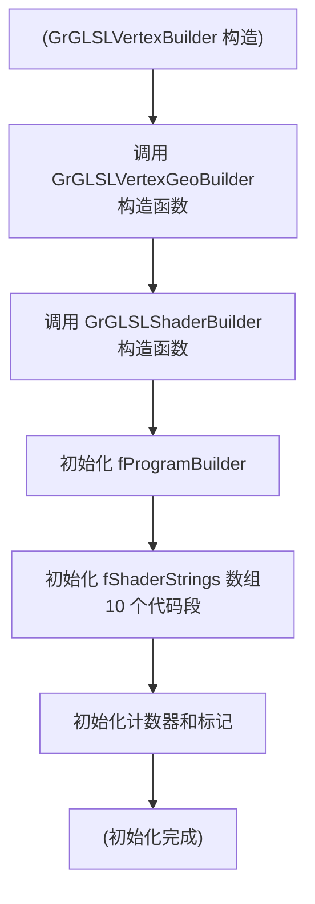
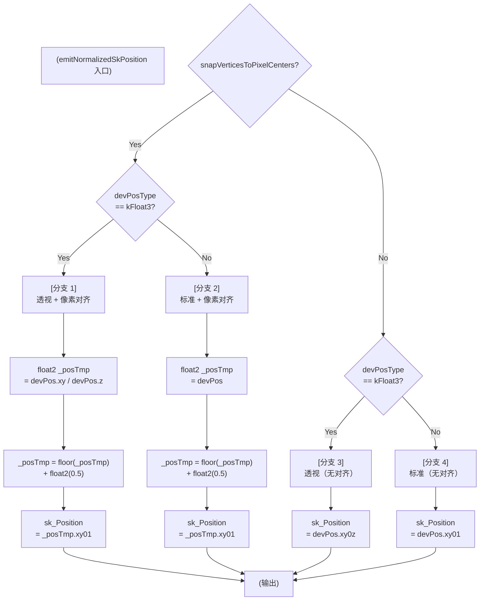
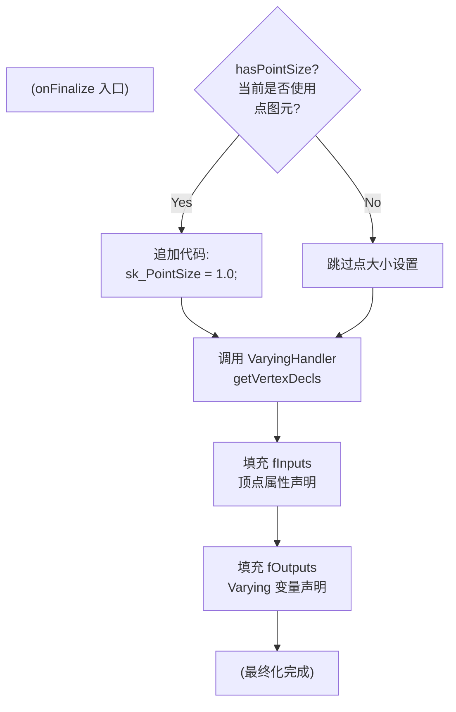

# GrGLSLVertexGeoBuilder

> 源文件: `src/gpu/ganesh/glsl/GrGLSLVertexGeoBuilder.h` (62 行), `src/gpu/ganesh/glsl/GrGLSLVertexGeoBuilder.cpp` (41 行)

## 1. 概述

`GrGLSLVertexGeoBuilder` 是 Ganesh 中顶点着色器构建器的基类，继承自 `GrGLSLShaderBuilder`。它提供了**将设备坐标转换为归一化 `sk_Position`** 的核心功能，是整个顶点着色器生成流程中最关键的一环。

`GrGLSLVertexBuilder` 是其具体子类，在最终化时处理点大小设置和 varying 声明。两者一起构成了完整的顶点着色器代码生成系统。

在顶点着色器中的位置：
```
顶点属性输入 → 坐标变换 → [emitNormalizedSkPosition] → sk_Position 输出
              ↓
          访问 varying
```

## 2. 架构位置

### 2.1 继承关系

```
GrGLSLShaderBuilder（所有着色器的基类）
    │
    ├── GrGLSLVertexGeoBuilder（顶点/几何着色器基类）
    │       │
    │       └── GrGLSLVertexBuilder（顶点着色器具体实现）
    │
    ├── GrGLSLFragmentShaderBuilder（片段着色器）
    │
    └── GrGLSLGeometryBuilder（几何着色器）
```

### 2.2 在 GrGLSLProgramBuilder 中的位置

```
GrGLSLProgramBuilder
    │
    ├── fVS: GrGLSLVertexBuilder（包含 GrGLSLVertexGeoBuilder 的全部功能）
    │        ├── 坐标转换（emitNormalizedSkPosition）
    │        ├── 函数插入（insertFunction）
    │        ├── Varying 处理（通过 VaryingHandler）
    │        └── 点大小设置（onFinalize）
    │
    └── fFS: GrGLSLFragmentShaderBuilder
```

### 2.3 在完整渲染管线中的位置

```
GrGeometryProcessor::ProgramImpl::emitCode(args)
    │
    ├── vBuilder = args.fVertBuilder（GrGLSLVertexBuilder 实例）
    │
    ├── emitNormalizedSkPosition()    [顶点位置]
    │
    ├── insertFunction()              [辅助数学函数]
    │
    └── 其他顶点属性输出
```

## 3. 类层次结构详解

### 3.1 GrGLSLVertexGeoBuilder — 通用几何处理

| 功能 | 方法 | 说明 |
|------|------|------|
| 坐标转换 | `emitNormalizedSkPosition()` | 设备坐标 → 归一化 sk_Position（4 种模式） |
| 函数插入 | `insertFunction()` | 将完整函数定义插入函数段 |
| 代码访问 | `functions()` | 访问函数段（继承自基类） |
| 代码访问 | `code()` | 访问主代码段（继承自基类） |

### 3.2 GrGLSLVertexBuilder — 顶点着色器特定

| 功能 | 方法 | 说明 |
|------|------|------|
| 最终化 | `onFinalize()` | 设置点大小、获取 varying 声明 |

## 4. 关键成员变量

### 4.1 从 GrGLSLShaderBuilder 继承

| 成员 | 类型 | 说明 |
|------|------|------|
| `fProgramBuilder` | `GrGLSLProgramBuilder*` | 反向引用到程序构建器，用于查询全局设置（如是否启用像素对齐） |
| `fShaderStrings` | `STArray<...>` | 代码段数组，包含扩展、定义、精度、布局、uniform、输入、输出、函数、主函数、主代码 10 个段 |
| `fInputs` | `VarArray` | 输入变量数组（由 GeometryProcessor 提供的顶点属性） |
| `fOutputs` | `VarArray` | 输出变量数组（varying 变量，传输到片段着色器） |

### 4.2 成员说明

**fProgramBuilder** 用于在代码生成时查询渲染配置：
- `snapVerticesToPixelCenters()` — 是否启用像素对齐
- `hasPointSize()` — 是否使用点图元

**fInputs / fOutputs** 由 `VaryingHandler` 填充，用于：
- 存储顶点属性名称和类型
- 存储 varying 变量名称和类型
- 在最终化时追加声明

## 5. 函数详解

### 5.1 构造函数

#### GrGLSLVertexGeoBuilder (.h:34)

```cpp
protected:
    GrGLSLVertexGeoBuilder(GrGLSLProgramBuilder* program) : INHERITED(program) {}
```

**职责：** 调用基类构造函数初始化着色器构建器。

**参数说明：**
- `program` — `GrGLSLProgramBuilder` 指针，用于反向引用到程序构建器

#### GrGLSLVertexBuilder (.h:51)

```cpp
public:
    GrGLSLVertexBuilder(GrGLSLProgramBuilder* program) : INHERITED(program) {}
```

**职责：** 调用基类（GrGLSLVertexGeoBuilder）构造函数，初始化为顶点着色器。

**继承关系：** 完全通过基类初始化，无额外逻辑。

**构造流程图:**



### 5.2 insertFunction()（.h:27-29）

```cpp
void insertFunction(const char* functionDefinition) {
    this->functions().append(functionDefinition);
}
```

**职责：** 将完整的函数定义逐字插入到着色器的函数段（kFunctions）。

**特点：** 不进行名称修饰（mangling），函数名保持原样。

**参数说明：**
- `functionDefinition` — 完整的、有效的 SkSL/GLSL 函数定义字符串
  - 必须包含返回类型、函数名、参数列表、花括号和函数体
  - 示例：`"float square(float x) { return x * x; }"`

**使用场景：**

1. **笔画细分着色器** (`GrStrokeTessellationShader.cpp:216-222`)
   - 插入 Wang 公式函数用于二阶贝塞尔曲线细分

2. **路径细分着色器** (`GrPathTessellationShader.cpp:154-176`)
   - 插入曲线参数计算函数

3. **复杂数学辅助函数**
   - 角度计算、向量操作等

**典型用法示例：**

```cpp
// 来自 GrStrokeTessellationShader
const char* wangFormulaFunc = R"(
    float wangValue(float2 p0, float2 p1, float2 p2, float2x2 M) {
        // 计算 Wang 公式...
        return max(...);
    }
)";
vBuilder->insertFunction(wangFormulaFunc);
```

### 5.3 emitNormalizedSkPosition() — 核心函数（.h:36-41, .cpp:14-32）【重点】

这是 `GrGLSLVertexGeoBuilder` 最关键的函数，处理设备坐标到归一化裁剪空间坐标的转换。

#### 函数签名

```cpp
// 重载 1：直接输出到主代码段
void emitNormalizedSkPosition(const char* devPos, SkSLType devPosType = SkSLType::kFloat2) {
    this->emitNormalizedSkPosition(&this->code(), devPos, devPosType);
}

// 重载 2：输出到指定的 SkString
void emitNormalizedSkPosition(SkString* out, const char* devPos,
                              SkSLType devPosType = SkSLType::kFloat2);
```

**参数说明：**
- `out` — 输出的 SkString 对象指针（实现细节）
- `devPos` — 设备坐标变量名（字符串，如 `"devPosition"` 或 `"gpArgs.fPositionVar"` 的 C 字符串）
- `devPosType` — 设备坐标的类型（默认 `SkSLType::kFloat2`）
  - `SkSLType::kFloat2` — 2D 坐标，无透视
  - `SkSLType::kFloat3` — 3D 坐标，包含透视权重（z 分量）

#### 实现细节与 4 个分支

函数根据两个条件进行 4 路分支：

1. **条件 1：** `snapVerticesToPixelCenters()` — 是否启用像素对齐？
2. **条件 2：** `devPosType == kFloat3` — 是否包含透视权重？



#### 4 个分支详解

**分支 1：透视坐标 + 像素对齐** (.cpp:17-19)

**应用场景：**
- 3D 场景中需要透视变换的发线矩形（少见）

**生成的代码：**
```glsl
{
    float2 _posTmp = devPos.xyz / devPos.z;
    _posTmp = floor(_posTmp) + float2(0.5);
    sk_Position = _posTmp.xy01;
}
```

**数学说明：**
1. `devPos.xy / devPos.z` — 透视除法，从齐次坐标转换到屏幕空间
2. `floor(...) + 0.5` — 像素对齐
3. `xy01` 格式 — x, y 为屏幕坐标，0 作为 z（深度），1 作为 w（齐次权重）

**分支 2：标准坐标 + 像素对齐** (.cpp:21-23)

**应用场景：**
- Hairline 矩形笔画（非 MSAA 模式），如 `StrokeRectOp` 中的场景

**生成的代码：**
```glsl
{
    float2 _posTmp = devPos;
    _posTmp = floor(_posTmp) + float2(0.5);
    sk_Position = _posTmp.xy01;
}
```

**数学说明：**
1. 直接使用 float2 坐标作为屏幕位置
2. `floor(...) + 0.5` — 对齐到像素中心
3. `xy01` 格式 — 标准 2D 屏幕坐标

**分支 3：透视坐标（无对齐）** (.cpp:26-27)

**应用场景：**
- 3D 透视变换下的常规几何（如模型顶点）

**生成的代码：**
```glsl
sk_Position = devPos.xy0z;
```

**格式说明：**
- `xy0z` 格式：x, y 为屏幕坐标，0 作为固定的 z（深度测试时用 0），z 分量作为 w（齐次权重）
- 这是标准的齐次坐标格式用于透视变换

**分支 4：标准坐标（无对齐）** (.cpp:29-30)

**应用场景：**
- 2D 渲染、UI、路径填充等无透视的场景

**生成的代码：**
```glsl
sk_Position = devPos.xy01;
```

**格式说明：**
- `xy01` 格式：x, y 为屏幕坐标，0 作为深度，1 作为齐次权重（无透视变换）

#### 调用场景 — 唯一的统一入口

在整个 Skia 代码库中，`emitNormalizedSkPosition` 有唯一的调用点：

**GrGeometryProcessor.cpp:101-102**
```cpp
vBuilder->emitNormalizedSkPosition(gpArgs.fPositionVar.c_str(),
                                   gpArgs.fPositionVar.getType());
```

这意味着：
- 所有 GeometryProcessor 都通过此函数统一地生成 sk_Position
- 坐标转换的所有逻辑集中在这里
- 无论是顶点着色器还是几何着色器，都使用同一套转换规则

### 5.4 onFinalize()（.cpp:34-41）

```cpp
void GrGLSLVertexBuilder::onFinalize() {
    if (this->getProgramBuilder()->hasPointSize()) {
        this->codeAppend("sk_PointSize = 1.0;");
    }
    fProgramBuilder->varyingHandler()->getVertexDecls(&this->inputs(),
                                                      &this->outputs());
}
```

**职责：** 顶点着色器的最终化处理，在所有代码生成完成后调用。

**流程说明：**



**子步骤详解：**

1. **点大小设置** (line 37-38)
   - 检查是否使用点图元：`hasPointSize()` 返回 `primitiveType == GrPrimitiveType::kPoints`
   - 如果是，追加代码 `sk_PointSize = 1.0;` 设置所有点的大小为 1 个像素
   - 注释说明：可以在将来支持变量点大小时重新审视此代码

2. **Varying 声明获取** (line 40)
   - 从 `VaryingHandler` 获取由各个 FragmentProcessor 声明的 varying 变量
   - 这些 varying 变量会被追加到顶点着色器的输入/输出段
   - 用于顶点着色器向片段着色器传输数据

**与基类 finalize() 的关系：**

```
GrGLSLShaderBuilder::finalize()（基类）
    │
    ├── 调用 onFinalize()（虚方法）
    │   └── GrGLSLVertexBuilder::onFinalize()（本函数）
    │
    └── 拼接所有代码段为最终着色器字符串
```

## 6. 坐标转换详解（重要）

### 6.1 4 种转换模式对比

| 转换模式 | snapPixels | devPosType | 透视除法 | 像素对齐 | 输出格式 | 适用场景 |
|---------|-----------|-----------|---------|---------|--------|---------|
| **模式 1** | Yes | float3 | `xy/z` | `floor+0.5` | `xy01` | 3D 发线（少见） |
| **模式 2** | Yes | float2 | — | `floor+0.5` | `xy01` | Hairline 矩形 |
| **模式 3** | No | float3 | — | — | `xy0z` | 3D 模型（常见） |
| **模式 4** | No | float2 | — | — | `xy01` | 2D 路径/UI（常见） |

### 6.2 输出格式说明

**xy01 格式（无透视）：**
- 用于 2D 坐标或已做透视除法的坐标
- `x, y` — 屏幕空间坐标（-1 到 1 或 0 到 viewport size，取决于投影矩阵）
- `0` — 固定的深度值（用于深度测试）
- `1` — 齐次权重（无透视变换）

**xy0z 格式（透视坐标）：**
- 用于 3D 透视变换
- `x, y` — 屏幕空间坐标
- `0` — 固定的深度值（用于深度测试）
- `z` — 齐次权重（原始 devPos.z，用于透视变换）
- 深度测试前会自动进行透视除法：`depth = 0 / z = 0`

### 6.3 像素对齐的数学原理

**问题：** 为什么需要像素对齐？

在发线矩形渲染中，亚像素坐标（如 0.3, 0.7）会导致光栅化边界不稳定，可能丢失角落像素。

**解决方案：** 强制所有顶点对齐到像素中心

**数学变换：**
```
原坐标：0.3, 0.7, 1.2, 1.8
└─ floor():   0, 0, 1, 1
└─ + 0.5:     0.5, 0.5, 1.5, 1.5  ← 像素中心
```

**效果：**
- 所有顶点都恰好落在像素中心
- 光栅化产生的覆盖率一致
- 角落像素不会被意外舍弃

**CPU 端一致性：**

在 `StrokeRectOp.cpp:195-199` 中，CPU 也做同样变换：
```cpp
bounds.setLTRB(SkScalarFloorToScalar(bounds.fLeft),
               SkScalarFloorToScalar(bounds.fTop),
               SkScalarFloorToScalar(bounds.fRight),
               SkScalarFloorToScalar(bounds.fBottom));
bounds.offset(0.5f, 0.5f);
```

这确保 CPU 端的剪裁/变换逻辑与 GPU 端的顶点处理一致。

## 7. 像素对齐机制（重要）

### 7.1 启用条件

**何时启用像素对齐？**

根据 `StrokeRectOp.cpp:164-166`：
```cpp
if (stroke.getStyle() == SkStrokeRec::kHairline_Style &&
    aaType != GrAAType::kMSAA) {
    inputFlags |= Helper::InputFlags::kSnapVerticesToPixelCenters;
}
```

**启用的精确条件：**
1. ✅ **笔画类型** — Hairline（线宽为 0）
2. ✅ **非 MSAA 模式** — AA 类型不是 MSAA（可以是 Coverage AA 或无 AA）

**启用的原因分析：**
- Hairline 笔画在 GPU 光栅化时，边界像素的覆盖率计算容易产生亚像素误差
- MSAA 会自动处理亚像素覆盖率，所以 MSAA 模式不需要手动对齐
- 非 MSAA 模式（Coverage AA）需要手动对齐确保一致性

### 7.2 为什么能解决角落缺失问题

**问题现象：**
```
不对齐的顶点 (0.3, 0.3)        对齐的顶点 (0.5, 0.5)
    ┌─────┐                       ┌─────┐
    │ ╳   │  ← 覆盖率低            │  ●  │  ← 覆盖率 100%
    └─────┘                       └─────┘
   缺少右下角像素              所有像素完整
```

**对齐的好处：**
1. **覆盖率一致** — 每个像素要么 100% 被覆盖，要么 0%
2. **边界清晰** — 角落不会因舍入误差而缺失
3. **可预测性** — 同样的几何形状总是产生同样的光栅化结果

### 7.3 性能影响

**操作成本（GPU 端）：**
- `floor()` 一次浮点运算 — 非常快（现代 GPU 原生指令）
- `+ 0.5` 一次加法 — 极快
- **总体影响：** < 1% 性能开销（仅在启用时）

**启用范围：**
- 默认 **不启用**（大多数渲染不需要）
- 仅在 Hairline 非 MSAA 场景启用
- **典型场景：** UI 线条、路径轮廓

## 8. 使用场景与示例

### 8.1 GeometryProcessor 中的典型用法

**调用点：GrGeometryProcessor.cpp:97-102**

```cpp
GrGLSLVertexBuilder* vBuilder = args.fVertBuilder;
SkASSERT(SkSLType::kFloat2 == gpArgs.fPositionVar.getType() ||
         SkSLType::kFloat3 == gpArgs.fPositionVar.getType());

// 这是唯一的调用点，所有 GP 都从这里生成 sk_Position
vBuilder->emitNormalizedSkPosition(gpArgs.fPositionVar.c_str(),
                                   gpArgs.fPositionVar.getType());

if (SkSLType::kFloat2 == gpArgs.fPositionVar.getType()) {
    args.fVaryingHandler->setNoPerspective();
}
```

**流程说明：**
1. 从 args 获取 `GrGLSLVertexBuilder` 指针
2. 检查位置变量类型（float2 或 float3）
3. 调用 `emitNormalizedSkPosition()` 生成坐标转换代码
4. 如果是 float2，标记 varying 为非透视

**示例 GP 实现：**

假设一个简单的位置 + 颜色的 GP：
```cpp
void MyGeometryProcessor::onEmitCode(EmitArgs& args) {
    GrGLSLVertexBuilder* vb = args.fVertBuilder;

    // 从顶点属性读取位置（由 addVertexAttrib 添加）
    auto pos = args.gpArgs.fPositionVar;

    // 调用核心函数生成 sk_Position
    vb->emitNormalizedSkPosition(pos.c_str(), pos.getType());

    // 生成其他着色器代码...
    vb->codeAppend("vColor = color;");  // 输出 varying
}
```

### 8.2 Tessellation 着色器中的 insertFunction 用法

**笔画细分着色器 - GrStrokeTessellationShader.cpp:216-222**

```cpp
// 插入 Wang 公式函数
vBuilder->insertFunction(R"(
    float wangValue(float2 p0, float2 p1, float2 p2, float2x2 M) {
        // 计算二阶贝塞尔曲线的偏导数
        float2 p01 = p1 - p0;
        float2 p12 = p2 - p1;
        float2 dp = p12 - p01;

        // 应用矩阵变换后计算 Wang 公式值
        float2 m_dp = M * dp;
        return max(abs(m_dp.x), abs(m_dp.y));
    }
)");
```

**路径细分着色器 - GrPathTessellationShader.cpp:154-176**

```cpp
// 插入角度计算函数
vBuilder->insertFunction(R"(
    float angle_between(float2 a, float2 b) {
        float cos_angle = dot(a, b) / (length(a) * length(b));
        cos_angle = clamp(cos_angle, -1.0, 1.0);
        return acos(cos_angle);
    }
)");
```

### 8.3 Varying 处理交互

**在 GeometryProcessor 中添加 Varying：**

```cpp
void MyGeometryProcessor::onEmitCode(EmitArgs& args) {
    // 添加 varying 变量
    GrGLSLVarying color(GrSLType::kHalf4_GrSLType);
    args.fVaryingHandler->addVarying("color", &color);

    // 在顶点着色器中输出 varying
    args.fVertBuilder->codeAppendf("%s = inputColor;", color.vsOut());

    // 在片段着色器中使用 varying
    args.fFragBuilder->codeAppendf("half4 finalColor = %s;", color.fsIn());
}
```

**onFinalize 如何处理：**

在顶点着色器最终化时 (onFinalize)：
1. `VaryingHandler::getVertexDecls()` 收集所有已声明的 varying 变量
2. 生成顶点着色器的 `out` 声明：`out half4 color_S0;`
3. 这些声明自动追加到顶点着色器输出段

## 9. 与 GrGLSLProgramBuilder 的交互

### 9.1 初始化流程

**GrGLSLProgramBuilder 构造函数中：**
```cpp
GrGLSLProgramBuilder::GrGLSLProgramBuilder(...)
    : fVS(this)  // 初始化 GrGLSLVertexBuilder，传入 this
    , fFS(this)  // 初始化 GrGLSLFragmentShaderBuilder
    { ... }
```

初始化时，`GrGLSLVertexBuilder` 的 `fProgramBuilder` 指针指向该 `GrGLSLProgramBuilder` 实例，后续可访问全局配置。

### 9.2 emitAndInstallPrimProc 中的使用

**GrGLSLProgramBuilder::emitAndInstallPrimProc() 中的调用链：**

```
emitAndInstallPrimProc()
  │
  ├─ fGPImpl->emitCode(args)  // args.fVertBuilder = &fVS
  │   │
  │   └─ vBuilder->emitNormalizedSkPosition()  ← 核心调用
  │
  └─ emitTransformCode(args)  // 生成坐标变换代码
```

### 9.3 emitTransformCode 中的坐标变换

顶点着色器在生成 `sk_Position` 后，还需要为每个 FragmentProcessor 生成坐标变换代码：

```
顶点坐标 → emitNormalizedSkPosition() → sk_Position
                                    ↓
                          emitTransformCode()
                                    ↓
                        为每个 FP 变换本地坐标
                                    ↓
                        输出为 varying
```

### 9.4 finalize 阶段的调用链

```
GrGLSLProgramBuilder::finalize()
  │
  ├─ fVS.finalize()
  │   │
  │   ├─ onFinalize()  ← GrGLSLVertexBuilder::onFinalize()
  │   │   │
  │   │   ├─ 设置点大小
  │   │   │
  │   │   └─ 获取 varying 声明
  │   │
  │   └─ 拼接所有代码段
  │
  └─ fFS.finalize()
```

## 10. 设计模式

### 10.1 模板方法模式

`onFinalize()` 是典型的模板方法模式：

```
基类：GrGLSLShaderBuilder::finalize()
           ↓
    定义总体流程
           ↓
    调用虚方法 onFinalize()
           ↓
子类：GrGLSLVertexBuilder::onFinalize()
           ↓
    执行具体的最终化逻辑
```

**好处：**
- 基类控制算法结构
- 子类可自定义特定逻辑
- 片段着色器、几何着色器可有不同的 onFinalize 实现

### 10.2 基类与具体类分离

```
GrGLSLVertexGeoBuilder（基类）
  ├─ 提供通用接口（emitNormalizedSkPosition）
  ├─ 支持几何着色器和顶点着色器
  └─ 不实现顶点特定逻辑

GrGLSLVertexBuilder（具体类）
  ├─ 实现顶点着色器特定逻辑
  ├─ onFinalize() 处理点大小
  └─ 只用于顶点着色器
```

**好处：**
- 代码复用（几何着色器也可继承 GrGLSLVertexGeoBuilder）
- 职责清晰
- 易于维护

### 10.3 统一接口模式

`emitNormalizedSkPosition()` 作为唯一的坐标转换入口：

```
所有 GeometryProcessor
        ↓
通过同一接口调用 emitNormalizedSkPosition()
        ↓
统一的坐标转换逻辑（4 个分支）
        ↓
不同的 GPU 后端通过 fProgramBuilder->snapVerticesToPixelCenters()
返回后端特定的配置
```

**好处：**
- 坐标转换逻辑集中
- 易于修改、测试
- 新增 GP 时无需重复实现

### 10.4 友元访问模式

```cpp
friend class GrGeometryProcessor::ProgramImpl;
```

只有 `GrGeometryProcessor::ProgramImpl` 可以访问 `emitNormalizedSkPosition()` 的保护成员，确保只在正确的上下文中调用。

## 11. 性能考量

### 11.1 像素对齐的性能影响

**启用条件：** 仅在 Hairline 非 MSAA 场景启用

**操作成本：**
- `floor()` — 1 个 GPU 指令（原生支持）
- `+ 0.5` — 1 个 GPU 指令
- **总计：** 2 条指令，< 1 ns（现代 GPU 每时钟可执行多条并行指令）

**性能影响：** 可以忽略不计

**启用率：**
- 大多数渲染（fill、stroke > 1px、MSAA）不启用
- 仅 UI 线条等特殊场景启用
- **典型应用中的比例：** 5-10% 的绘制调用

### 11.2 透视除法的成本

**操作：** `xy / z`（float2 / float）

**成本：**
- 除法操作（1-4 GPU 时钟）
- 仅在使用 float3 时执行
- 大多数场景使用 float2，不产生透视除法

**性能特征：**
- float3 场景（如 3D 模型）本来就需要透视除法
- 在此处执行不会增加额外成本

### 11.3 Varying 数量对性能的影响

**关键指标：** Varying 插值成本（片段着色器）

Varying 数量由应用程序决定，`onFinalize()` 只是收集并声明它们：
- 不增加额外的 varying
- 不改变 varying 插值成本

**瓶颈：** 片段着色器中的 varying 使用，而非声明本身

## 12. 相关文件

### 12.1 核心定义文件

| 文件 | 行数 | 用途 |
|------|------|------|
| `src/gpu/ganesh/glsl/GrGLSLVertexGeoBuilder.h` | 62 | 顶点几何着色器构建器头文件 |
| `src/gpu/ganesh/glsl/GrGLSLVertexGeoBuilder.cpp` | 41 | 实现文件，包含 emitNormalizedSkPosition 和 onFinalize |

### 12.2 基类文件

| 文件 | 说明 |
|------|------|
| `src/gpu/ganesh/glsl/GrGLSLShaderBuilder.h` (295 行) | 所有着色器构建器的基类，定义代码段结构 |
| `src/gpu/ganesh/glsl/GrGLSLShaderBuilder.cpp` (349 行) | 基类实现 |

### 12.3 主要使用者

| 文件 | 行数 | 用途 |
|------|------|------|
| `src/gpu/ganesh/GrGeometryProcessor.cpp` | 101-102 | **emitNormalizedSkPosition 唯一调用点** |
| `src/gpu/ganesh/GrDefaultGeoProcFactory.cpp` | 各处 | 标准 GP 实现，使用 emitNormalizedSkPosition |
| `src/gpu/ganesh/tessellate/GrStrokeTessellationShader.cpp` | 216-222 | insertFunction 用法：Wang 公式 |
| `src/gpu/ganesh/tessellate/GrPathTessellationShader.cpp` | 154-176 | insertFunction 用法：曲线计算 |

### 12.4 Pipeline 配置

| 文件 | 行数 | 说明 |
|------|------|------|
| `src/gpu/ganesh/GrPipeline.h` | 186-188 | snapVerticesToPixelCenters() 声明 |
| `src/gpu/ganesh/ops/StrokeRectOp.cpp` | 164-200 | **像素对齐启用场景分析** |
| `src/gpu/ganesh/glsl/GrGLSLProgramBuilder.h` | 52-55 | fVS 成员和查询方法 |
| `src/gpu/ganesh/glsl/GrGLSLProgramBuilder.cpp` | 42-43, 83-132 | 初始化和 emitAndInstallPrimProc |

### 12.5 Varying 系统

| 文件 | 说明 |
|------|------|
| `src/gpu/ganesh/glsl/GrGLSLVarying.h` | Varying 变量的声明和管理 |
| `src/gpu/ganesh/glsl/GrGLSLVaryingHandler.h` | VaryingHandler 接口 |

## 13. 总结

`GrGLSLVertexGeoBuilder` 虽然代码量少（仅 103 行），但在 Skia 的顶点着色器生成中起着核心作用：

1. **唯一的坐标转换接口** — 所有 GeometryProcessor 通过 `emitNormalizedSkPosition()` 统一生成 `sk_Position`

2. **4 个分支的灵活处理** — 支持有无透视、有无像素对齐的所有组合，适应不同的渲染场景

3. **像素对齐机制** — 解决 Hairline 发线的光栅化问题，通过简单的 `floor + 0.5` 操作确保视觉一致性

4. **函数插入机制** — 支持 Tessellation 着色器等高级场景下的复杂数学函数注入

5. **模板方法设计** — 通过 `onFinalize()` 实现清晰的最终化流程，支持后续的 varying 处理

理解这个类是掌握 Skia GPU 渲染管线的重要一步。
