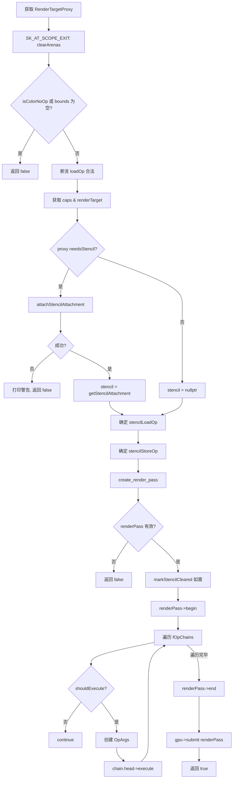
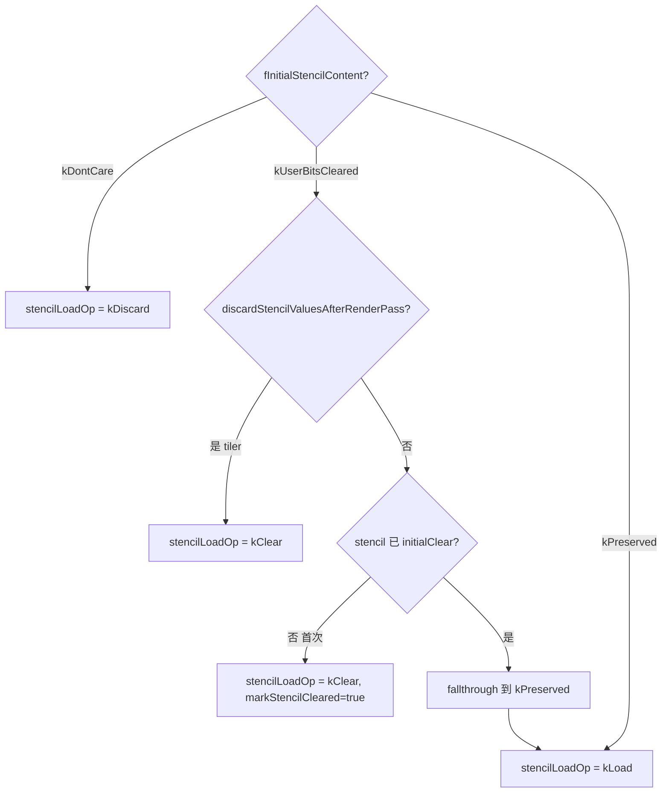

# OpsTask · Flush 管线

> 源码: `src/gpu/ganesh/ops/OpsTask.cpp` (1101行)
> 主文档: [OpsTask.cn.md](./OpsTask.cn.md)

---

## 5. Flush 管线

### 5.1 `onPrePrepare()` (line 489-511)

提前准备阶段 (DDL 录制时调用)。跳过 colorNoOp 或空 bounds 的情况，然后遍历每条 OpChain 调用 `head()->prePrepare()`。

---

### 5.2 `onPrepare()` (line 514-553)

Flush 时的准备阶段。设置 sampledProxies，遍历每条 OpChain 创建 `OpArgs` 后调用 `head()->prepare(flushState)`。

---

### 5.3 `onExecute()` (line 558-679)

**最核心的函数**: 创建 RenderPass 并执行所有 Op。

**stencilLoadOp 决策子流程** (line 590-618):

