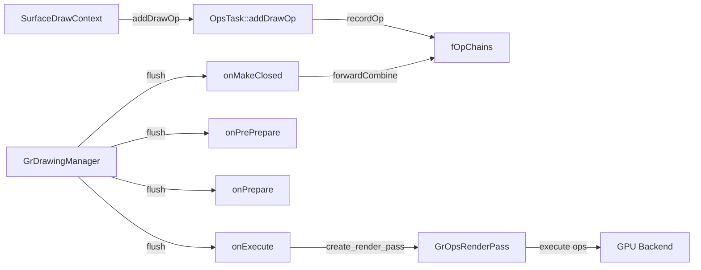
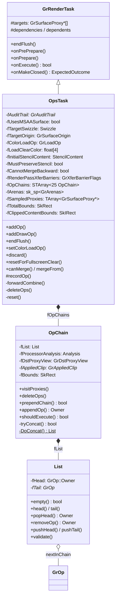
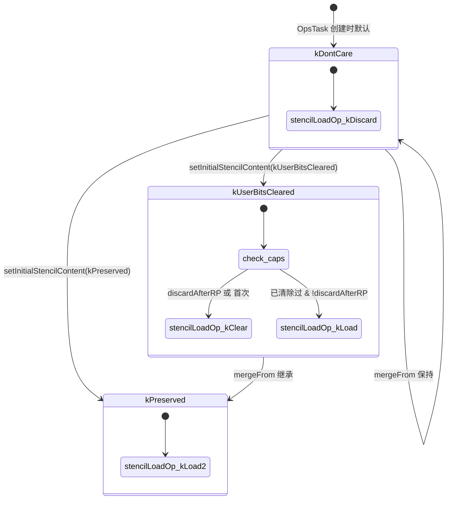
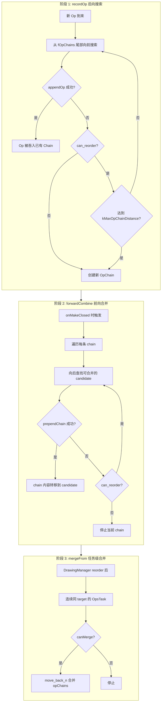
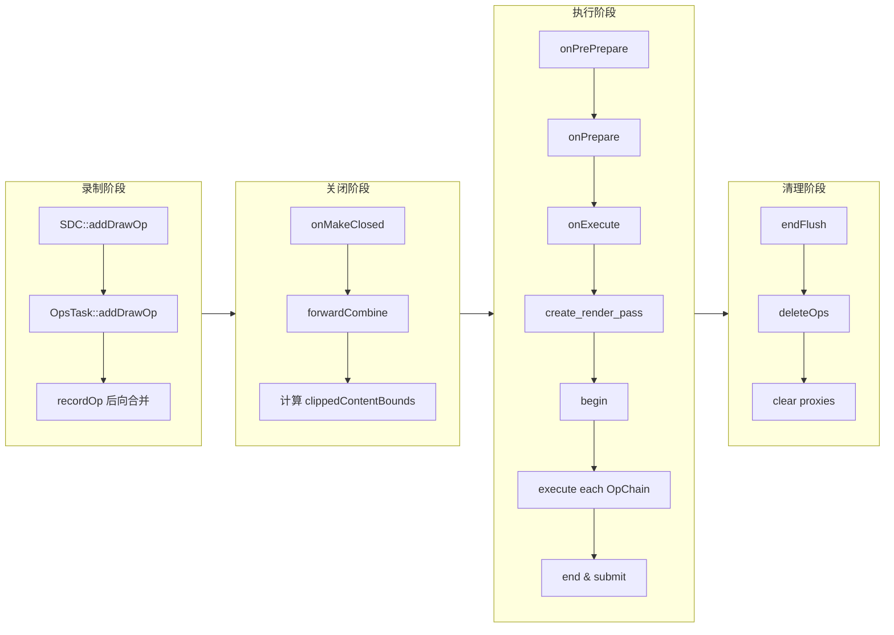

# OpsTask 函数实现参考

> 源码: `src/gpu/ganesh/ops/OpsTask.cpp` (1101行)
> 头文件: `src/gpu/ganesh/ops/OpsTask.h` (314行)

---

## 文档导航

| 子文档 | 内容 | 源码范围 |
|--------|------|----------|
| [数据结构](./OpsTask.数据结构.cn.md) | OpChain::List + OpChain 方法 | line 99-406 |
| [录制与合并](./OpsTask.录制与合并.cn.md) | 生命周期 + recordOp + forwardCombine | line 410-487, 917-1099 |
| [Flush管线](./OpsTask.Flush管线.cn.md) | onPrePrepare / onPrepare / onExecute | line 489-679 |
| [状态与调试](./OpsTask.状态与调试.cn.md) | 状态管理 + 任务合并 + 调试 | line 681-915 |

---

## 类型速查

阅读后续函数流程图前，建议先熟悉以下类型。按职责分为 7 组。

### 1. OpsTask 自身类型

| 类型 | 含义 |
|------|------|
| `OpsTask` | Ganesh 延迟渲染任务，管理一个 RenderPass 内的全部 GrOp |
| `OpChain` | 操作链，将同类型、同裁剪/dst 的 Op 组织在一起 |
| `OpChain::List` | 侵入式单向 Op 链表 (fHead / fTail，通过 nextInChain 链接) |
| `StencilContent` | 枚举 (`kDontCare` / `kUserBitsCleared` / `kPreserved`)，Stencil 初始内容 |
| `CanDiscardPreviousOps` | 枚举 (`kYes` / `kNo`)，全屏清除时是否允许丢弃已有 Op |

### 2. Op 操作类型

| 类型 | 含义 |
|------|------|
| `GrOp` | GPU 操作基类 |
| `GrOp::Owner` | `std::unique_ptr<GrOp>`，Op 唯一所有权 |
| `GrOp::CombineResult` | 合并结果枚举 (`kCannotCombine` / `kMayChain` / `kMerged`) |
| `GrOp::ChainRange<T>` | Op 链遍历迭代器，用于 for-each 遍历 |

### 3. 处理器 / 裁剪

| 类型 | 含义 |
|------|------|
| `GrAppliedClip` | 已确定的裁剪 (scissor / window rect / coverage FP) |
| `GrProcessorSet::Analysis` | 处理器分析结果 (是否需要 dst 纹理、非重叠绘制、非相干混合等) |
| `GrDstProxyView` | Dst 读取混合所需的目标代理视图 (proxy + offset + sampleFlags) |
| `GrVisitProxyFunc` | 代理遍历回调 `std::function<void(GrSurfaceProxy*, Mipmapped)>` |

### 4. 渲染管线 / 上下文

| 类型 | 含义 |
|------|------|
| `GrRenderTask` | 渲染任务基类 (OpsTask 继承自此) |
| `GrDrawingManager` | 全局任务调度器，管理所有 RenderTask 的依赖与调度 |
| `GrRecordingContext` | GPU 录制上下文，提供 caps / allocator |
| `GrOpFlushState` | Flush 时传递的状态 (gpu / resourceProvider / sampledProxies) |
| `GrOpsRenderPass` | 渲染通道抽象 (begin / end / submit) |
| `SurfaceDrawContext` | 绘制上下文，OpsTask 的友元 |

### 5. Surface / Proxy

| 类型 | 含义 |
|------|------|
| `GrSurfaceProxy` | GPU 表面代理基类 |
| `GrRenderTargetProxy` | 渲染目标代理 (可 wrapsVkSecondaryCB) |
| `GrTextureProxy` | 纹理代理 |
| `GrSurfaceProxyView` | proxy + origin + swizzle 组合视图 |
| `GrRenderTarget` | 已实例化的渲染目标 |
| `GrAttachment` | Stencil 附件 |

### 6. GPU 能力 / 资源

| 类型 | 含义 |
|------|------|
| `GrGpu` | GPU 后端抽象 (getOpsRenderPass / submit) |
| `GrCaps` | GPU 能力查询 (performColorClearsAsDraws / discardStencilValuesAfterRenderPass 等) |
| `GrResourceProvider` | 资源提供者 (attachStencilAttachment) |
| `GrResourceAllocator` | 资源分配器 (addInterval / incOps) |
| `GrArenas` / `sk_sp<GrArenas>` | Arena 内存池容器 |
| `SkArenaAlloc` | 单调增长分配器 (clip / op 存储) |
| `GrAuditTrail` | 调试审计追踪 |
| `GrTextureResolveManager` | 纹理 resolve 管理 |

### 7. 状态 / 容器

| 类型 | 含义 |
|------|------|
| `GrLoadOp` | 加载操作 (`kLoad` / `kClear` / `kDiscard`) |
| `GrStoreOp` | 存储操作 (`kStore` / `kDiscard`) |
| `GrXferBarrierFlags` | 传输屏障标志 (`kNone` / `kTexture` / `kBlend`) |
| `GrDstSampleFlags` | Dst 采样标志 (`kAsInputAttachment` / `kRequiresTextureBarrier`) |
| `GrSurfaceOrigin` | 表面原点方向枚举 (`kTopLeft_GrSurfaceOrigin` / `kBottomLeft_GrSurfaceOrigin`) |
| `skgpu::Swizzle` | 颜色通道重排 |
| `skia_private::STArray<N, T>` | 栈分配小数组 (fOpChains 使用 `STArray<25, OpChain>`) |
| `skia_private::TArray<T>` | 动态数组 (fSampledProxies 等) |
| `SkRect` / `SkIRect` | 浮点/整数矩形 |

---

## OpsTask 在 Skia 工程中的架构位置

| 属性 | 说明 |
|------|------|
| **归属** | `GrDrawingManager` 创建并持有 `OpsTask` 实例 |
| **父类** | 继承 `GrRenderTask`，实现其 flush 生命周期虚函数 |
| **上游** | `SurfaceDrawContext::addDrawOp()` → `OpsTask::addDrawOp()` |
| **下游** | `GrDrawingManager::flush()` → `onPrePrepare` → `onPrepare` → `onExecute` → `GrOpsRenderPass` |



---

## 架构总览



---

## 1. 匿名命名空间辅助函数

### 1.1 `can_reorder()` (line 59)

单行内联函数：判断两个 `SkRect` 是否 **不重叠** (可重排)。

```cpp
inline bool can_reorder(const SkRect& a, const SkRect& b) { return !GrRectsOverlap(a, b); }
```

核心语义：两个 Op 的边界不重叠时，它们之间无 painter's order 依赖，可以安全重排或跳过合并。

---

### 1.2 `create_render_pass()` (line 61-91)

工厂函数，将所有渲染通道参数打包后调用 `GrGpu::getOpsRenderPass()`。

| 参数 | 含义 |
|------|------|
| `gpu` | GPU 后端 |
| `rt` | 已实例化渲染目标 |
| `useMSAASurface` | 是否使用 MSAA |
| `stencil` | Stencil 附件 (可 null) |
| `origin` | 表面原点 |
| `bounds` | 裁剪后内容边界 |
| `colorLoadOp` / `loadClearColor` | 颜色加载操作及清除颜色 |
| `stencilLoadOp` / `stencilStoreOp` | Stencil 加载/存储操作 |
| `sampledProxies` | 采样的代理列表 |
| `renderPassXferBarriers` | 传输屏障标志 |

返回 `GrOpsRenderPass*`，失败返回 `nullptr`。

---

## 附录 A: StencilContent 状态机



---

## 附录 B: Op 合并策略流程 (三阶段)

OpsTask 的 Op 合并分为三个阶段，逐步最大化合并效率：



---

## 附录 C: Flush 管线阶段总览


