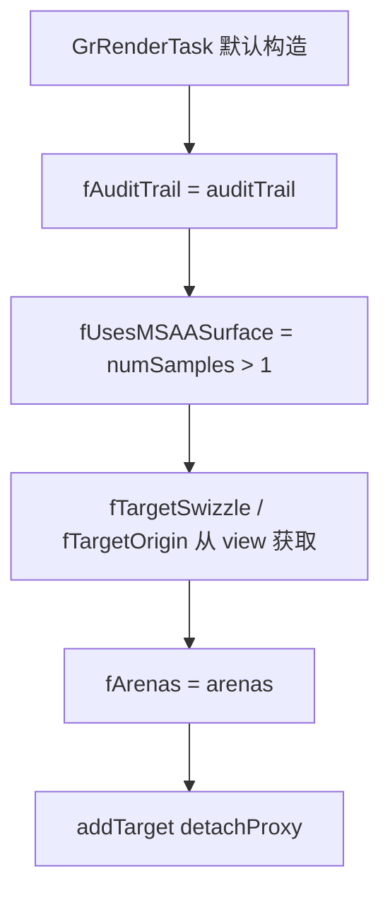
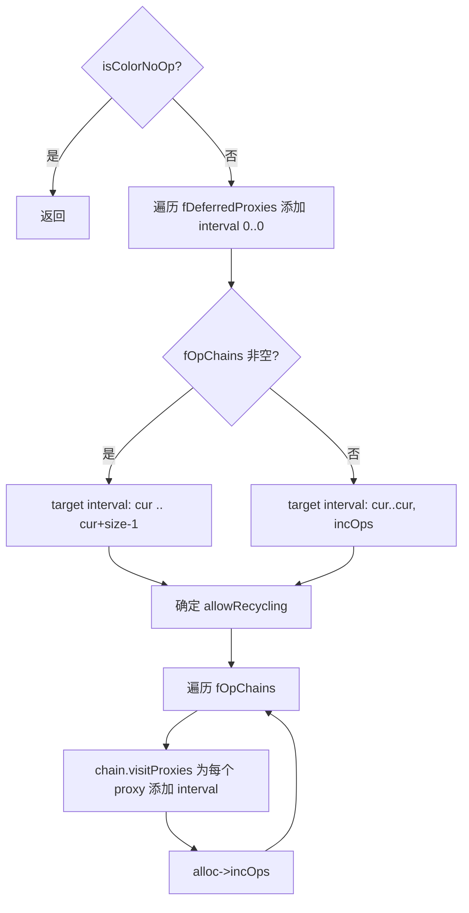
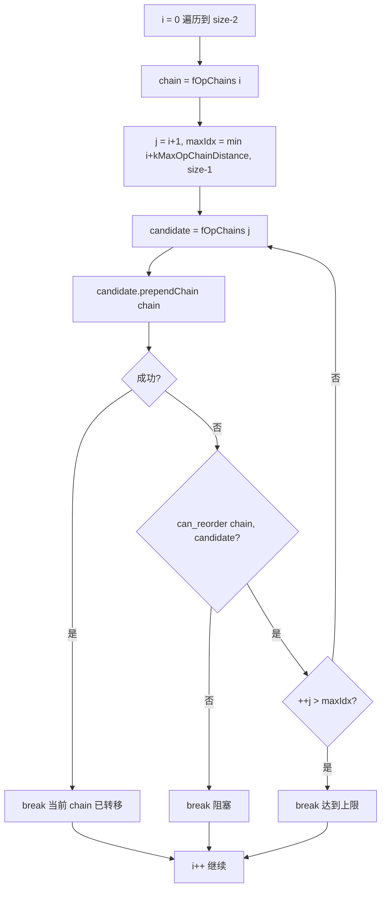
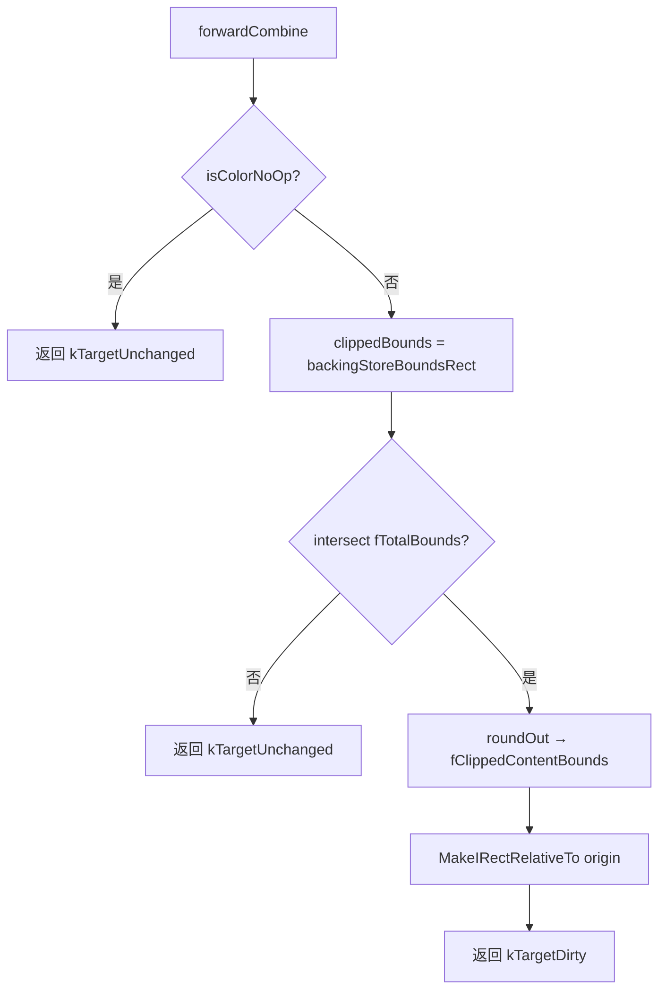

# OpsTask · 录制与合并

> 源码: `src/gpu/ganesh/ops/OpsTask.cpp` (1101行)
> 主文档: [OpsTask.cn.md](./OpsTask.cn.md)

---

## 4. OpsTask 生命周期

### 4.1 `OpsTask()` 构造 (line 410-422)



---

### 4.2 `deleteOps()` (line 424-429)

遍历 `fOpChains` 对每条链调用 `chain.deleteOps()`，然后 `fOpChains.clear()`。

---

### 4.3 `~OpsTask()` (line 431-433)

调用 `this->deleteOps()` 释放所有 Op 内存。

---

### 4.4 `addOp()` (line 435-445)

非绘制 Op 的入口 (如 copy op)。遍历 Op 代理添加依赖，然后以空 Analysis/clip 调用 `recordOp`。

---

### 4.5 `addDrawOp()` (line 447-476)

绘制 Op 的入口，处理完整的依赖/屏障逻辑。

```mermaid
flowchart TD
    A[定义 addDependency lambda] --> B[op->visitProxies 添加依赖]
    B --> C[clip.visitProxies 添加依赖]
    C --> D{dstProxyView 有效?}
    D -->|是| E{非 InputAttachment?}
    E -->|是| F[addSampledTexture]
    E -->|否| G[跳过]
    D -->|否| H[继续]
    F --> I{kRequiresTextureBarrier?}
    I -->|是| J[fRenderPassXferBarriers |= kTexture]
    I -->|否| K[继续]
    G --> K
    J --> K
    K --> L[addDependency dstProxy]
    L --> H
    H --> M{usesNonCoherentHWBlending?}
    M -->|是| N[fRenderPassXferBarriers |= kBlend]
    M -->|否| O[继续]
    N --> O
    O --> P[recordOp]
```

---

### 4.6 `endFlush()` (line 478-487)

Flush 结束后的清理：重置 clipStackGenID、删除所有 Op、清除代理列表、调用基类 `endFlush`。

---

## 8. 资源管理与 Op 记录

### 8.1 `gatherProxyIntervals()` (line 917-975)

为资源分配器 (`GrResourceAllocator`) 收集所有代理的使用区间。



---

### 8.2 `recordOp()` (line 977-1046)

**Op 后向搜索合并算法**: 新 Op 到来时尝试与已有 OpChain 合并。

```mermaid
flowchart TD
    A[调试验证 & 有限性检查] --> B{bounds 有限?}
    B -->|否| Z[直接返回丢弃]
    B -->|是| C[fUsesMSAASurface |= usesMSAA]
    C --> D[fTotalBounds.join op->bounds]
    D --> E[计算 maxCandidates = min kMaxOpChainDistance, size]
    E --> F{maxCandidates > 0?}
    F -->|否| G[跳过搜索]
    F -->|是| H[i = 0, 从尾部向前]
    H --> I[candidate.appendOp]
    I --> J{op 已被消费?}
    J -->|是| K[返回]
    J -->|否| L{can_reorder? bounds 不重叠?}
    L -->|否| M[break 阻塞]
    L -->|是| N{++i == maxCandidates?}
    N -->|是| O[break 达到上限]
    N -->|否| H
    M --> P[分配 clip 到 arena]
    O --> P
    G --> P
    P --> Q[fOpChains.emplace_back 新建 OpChain]
```

---

### 8.3 `forwardCombine()` (line 1048-1077)

**前向合并算法**: 在 `onMakeClosed` 时调用，尝试将每条链与后续链合并。



---

### 8.4 `onMakeClosed()` (line 1079-1099)

任务关闭时的收尾：先调用 `forwardCombine`，然后计算 `fClippedContentBounds` (总边界与 backingStore 的交集)。


