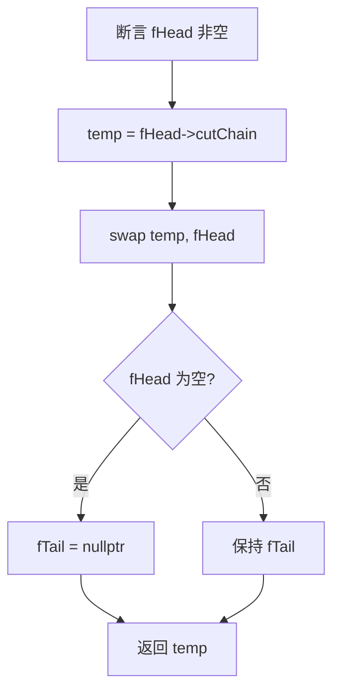
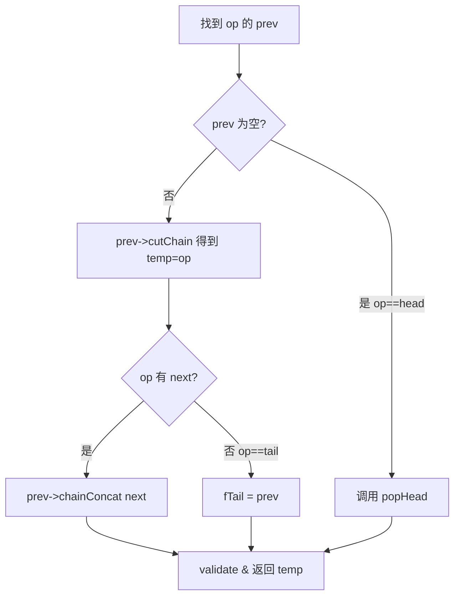
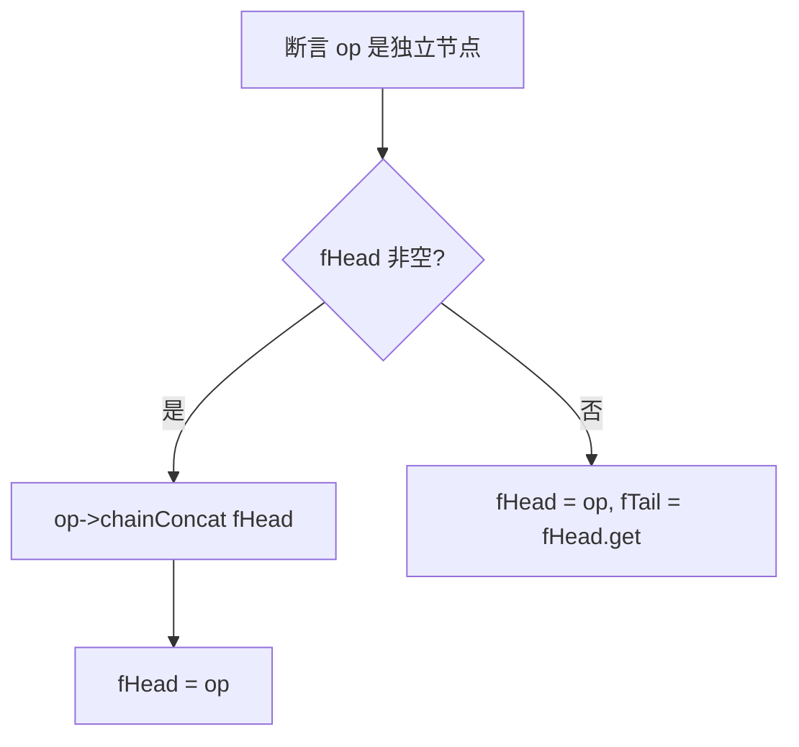
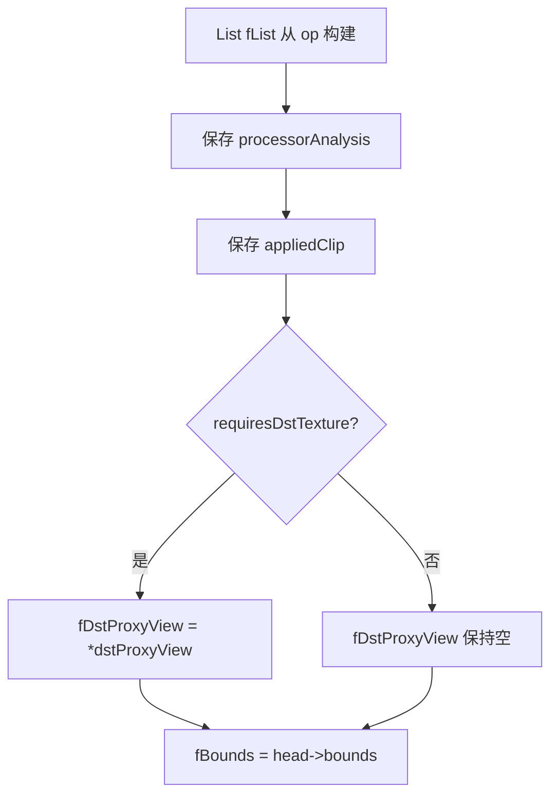
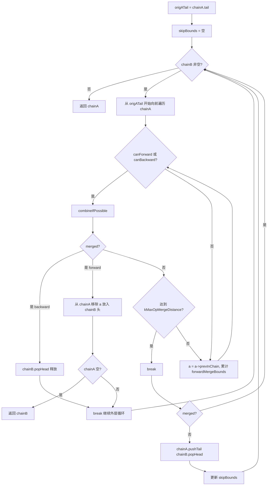
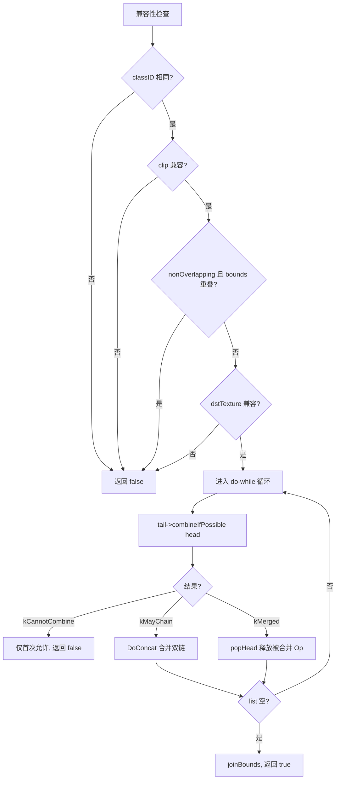

# OpsTask · 数据结构

> 源码: `src/gpu/ganesh/ops/OpsTask.cpp` (1101行)
> 主文档: [OpsTask.cn.md](./OpsTask.cn.md)

---

## 2. OpChain::List 方法

### 2.1 `List(GrOp::Owner)` 构造 (line 99-102)

从单个 Op 构建链表：`fHead = op`, `fTail = fHead.get()`。

---

### 2.2 `List(List&&)` 移动构造 (line 104)

委托给 `operator=(List&&)`。

---

### 2.3 `operator=(List&&)` (line 106-112)

移动 fHead 和 fTail，清空源链表的 fTail。

---

### 2.4 `popHead()` (line 114-123)

---

### 2.5 `removeOp()` (line 125-145)

从链表中移除指定 Op 并返回其 Owner。

---

### 2.6 `pushHead()` (line 147-158)

将 Op 插入链表头部。

---

### 2.7 `pushTail()` (line 160-164)

将 Op 追加到链表尾部：`fTail->chainConcat(op)`, 然后更新 `fTail = fTail->nextInChain()`。

---

### 2.8 `validate()` (line 166-173)

调试断言：若 fHead 非空则验证 fTail 非空且 `fHead->validateChain(fTail)` 通过。

---

## 3. OpChain 方法

### 3.1 `OpChain()` 构造 (line 177-187)

---

### 3.2 `visitProxies()` (line 189-202)

遍历链中每个 Op 调用 `op.visitProxies(func)`，再访问 `fDstProxyView.proxy()` 和 `fAppliedClip`。

---

### 3.3 `deleteOps()` (line 204-209)

循环 `fList.popHead()` 直到链表为空，利用 `GrOp::Owner` 的析构释放内存。

---

### 3.4 `DoConcat()` (line 213-287)

**核心合并算法**: 将 chainB 的每个 Op 合并到 chainA 中。

**三种结局**:
1. **backward merge**: B 的 head 被合并入 A 的某个 Op (B.popHead 释放)
2. **forward merge**: A 的某个 Op 被合并入 B 的 head (该 Op 从 A 移到 B 头部，重新处理)
3. **无法合并**: B.head 弹出追加到 A 尾部

---

### 3.5 `tryConcat()` (line 291-349)

尝试将外部 List 拼接到当前 OpChain。

---

### 3.6 `prependChain()` (line 351-372)

将 `that` 的链合并到自身前面：调用 `that->tryConcat(&fList, ...)` 反向拼接，成功后将结果移回。

---

### 3.7 `appendOp()` (line 374-395)

将单个 Op 追加到链中：将 Op 包装为 List 后调用 `tryConcat`。失败则返回 Op 给调用者。

---

### 3.8 `validate()` (line 397-406)

调试断言：验证链表有效，且每个 Op 的 bounds 都包含在 fBounds 内。
