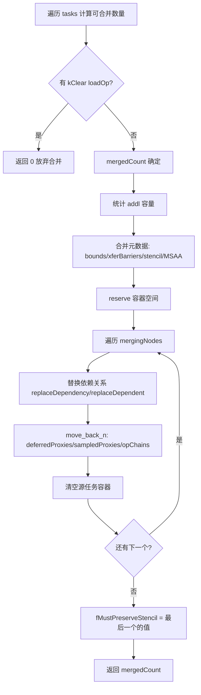
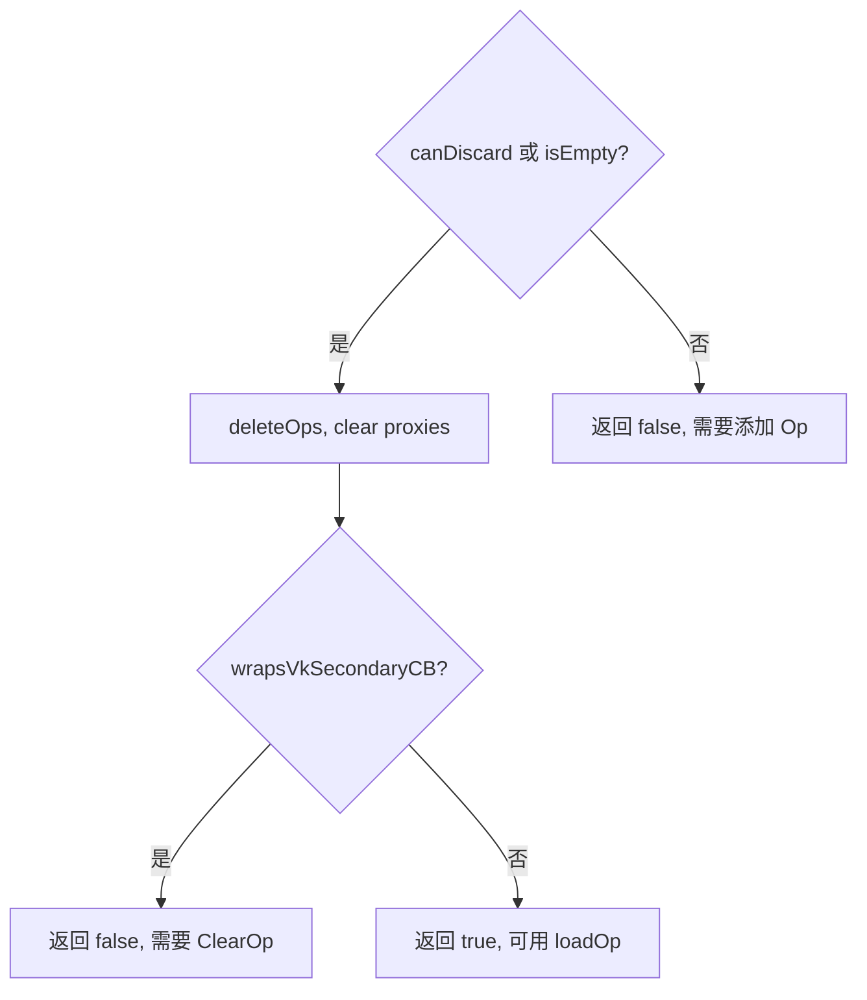

# OpsTask · 状态与调试

> 源码: `src/gpu/ganesh/ops/OpsTask.cpp` (1101行)
> 主文档: [OpsTask.cn.md](./OpsTask.cn.md)

---

## 6. 状态管理与任务合并

### 6.1 `setColorLoadOp()` (line 681-689)

设置颜色加载操作和清除颜色。若为 `kClear` 则将 `fTotalBounds` 扩展到整个 backingStore。

---

### 6.2 `reset()` (line 691-698)

完全重置 OpsTask 状态：清除代理列表、bounds、deleteOps、重置 XferBarriers。用于合并算法中被跳过的任务。

---

### 6.3 `canMerge()` (line 700-704)

判断另一个 OpsTask 是否可合并到当前任务：要求 target 相同、arenas 相同、且目标未设置 `fCannotMergeBackward`。

---

### 6.4 `mergeFrom()` (line 706-777)

**任务合并核心算法**: 将多个连续 OpsTask 合并为一个。

---

### 6.5 `resetForFullscreenClear()` (line 779-793)

全屏清除时的预处理。

---

### 6.6 `discard()` (line 795-803)

丢弃操作：仅在 OpsTask 为空时生效，设置 `fColorLoadOp = kDiscard`，stencil 设为 `kDontCare`，清空 bounds。

---

## 7. 调试与诊断

### 7.1 `dump()` (line 808-871)

`GPU_TEST_UTILS` 条件编译。输出颜色 loadOp、stencil 内容、所有 OpChain 的名称和边界信息。

---

### 7.2 `visitProxies_debugOnly()` (line 874-884)

`SK_DEBUG` 条件编译。遍历所有 OpChain 调用 `visitProxies` 用于调试验证。

---

### 7.3 `onMakeSkippable()` (line 888-893)

标记任务可跳过：deleteOps、clear deferredProxies、将 loadOp 重置为 `kLoad` (使 `isColorNoOp()` 返回 true)。

---

### 7.4 `onIsUsed()` (line 895-915)

检查指定 proxy 是否被当前任务采样。线性遍历 `fSampledProxies`，调试模式下与 `visitProxies_debugOnly` 交叉验证。
