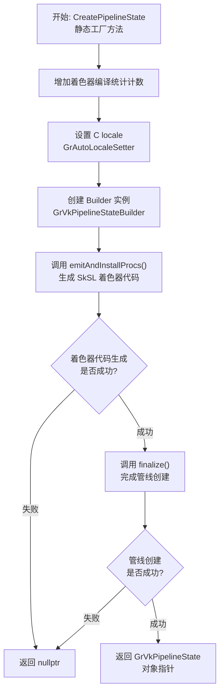
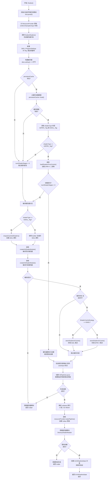
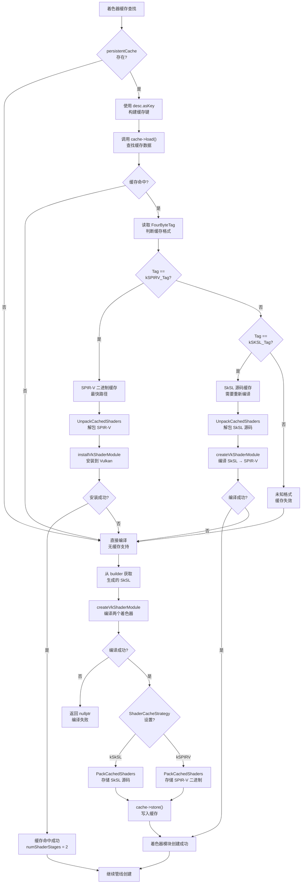
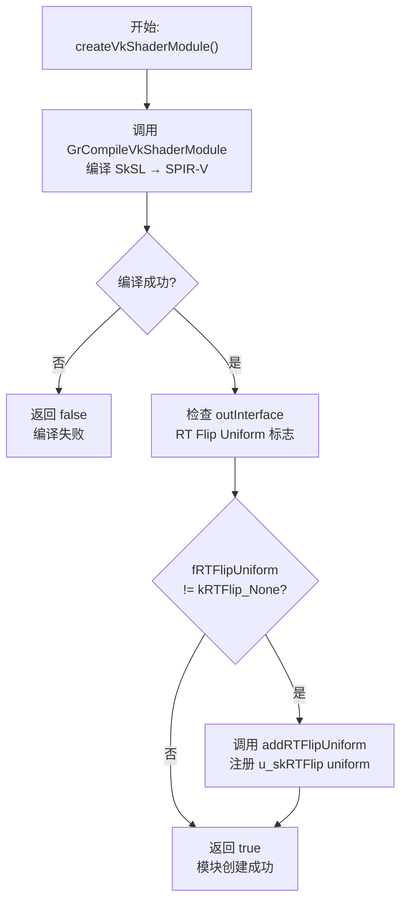
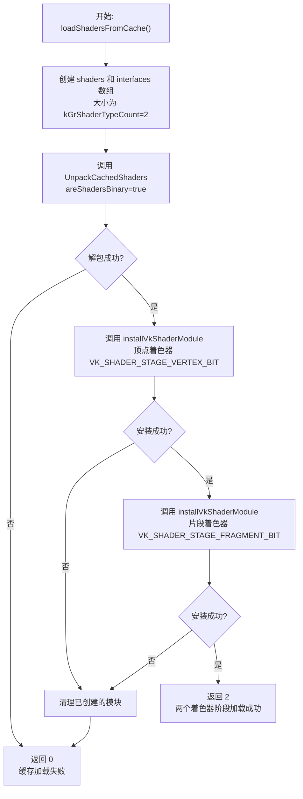
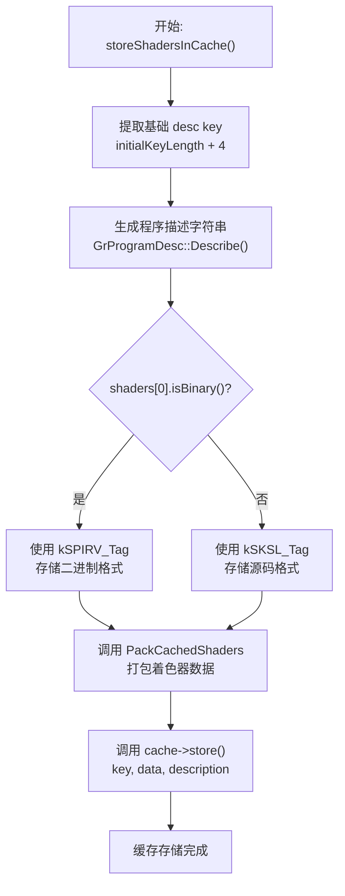
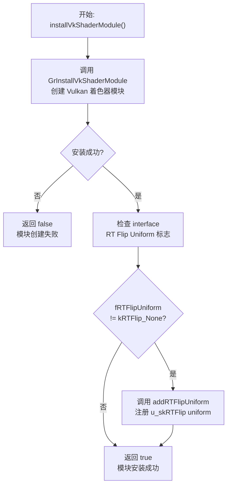
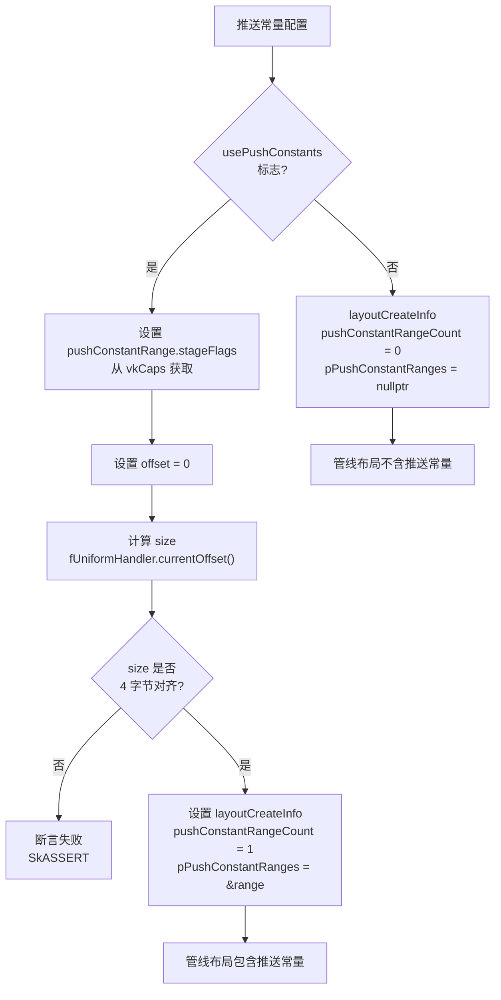
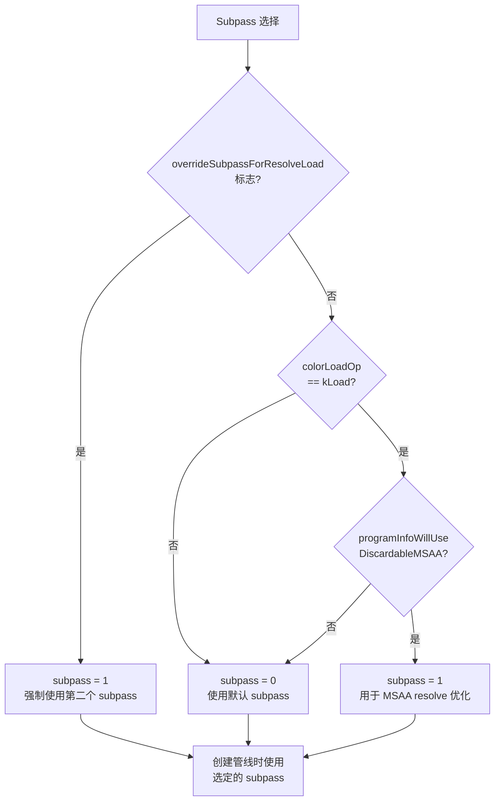
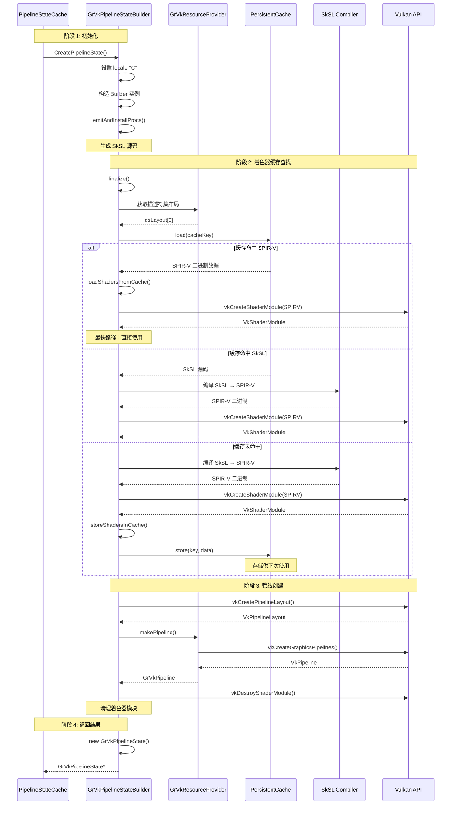

# GrVkPipelineStateBuilder

> 源文件
> - src/gpu/ganesh/vk/GrVkPipelineStateBuilder.h
> - src/gpu/ganesh/vk/GrVkPipelineStateBuilder.cpp

## 概述

`GrVkPipelineStateBuilder` 是 Skia Ganesh Vulkan 后端中负责构建完整管线状态的核心类。它继承自 `GrGLSLProgramBuilder`，专门处理 Vulkan 着色器的编译、缓存、以及管线状态对象的创建。该类是连接高层渲染程序描述和底层 Vulkan 管线实现的关键桥梁。

主要职责包括：
- 编译 SkSL 着色器代码为 SPIR-V 二进制
- 支持持久化着色器缓存（SPIR-V 和 SkSL 格式）
- 创建和配置 Vulkan 着色器模块
- 设置描述符集布局和推送常量
- 生成完整的 `GrVkPipelineState` 对象

该类实现了完整的着色器编译流程，包括缓存查找、编译、缓存存储等步骤。

## 架构位置

`GrVkPipelineStateBuilder` 在 Ganesh 渲染管线构建系统中的位置：

```
Skia Ganesh 渲染系统
  └─ 程序构建子系统
      ├─ GrGLSLProgramBuilder (平台无关基类)
      │   ├─ GrGLProgramBuilder (OpenGL 实现)
      │   └─ GrVkPipelineStateBuilder (Vulkan 实现) ← 当前类
      └─ 支撑组件
          ├─ GrVkUniformHandler (uniform 处理)
          ├─ GrVkVaryingHandler (varying 处理)
          └─ GrPersistentCacheUtils (持久化缓存)
```

该类位于程序构建流程的核心，协调着色器编译、uniform/varying 处理、以及最终管线状态的创建。

## 主要类与结构体

### 继承关系

| 类名 | 父类 | 说明 |
|------|------|------|
| `GrVkPipelineStateBuilder` | `GrGLSLProgramBuilder` | Vulkan 管线状态构建器 |
| `GrGLSLProgramBuilder` | 无 | 平台无关的程序构建基类 |

### 关键成员变量

| 成员变量 | 类型 | 说明 |
|----------|------|------|
| `fGpu` | `GrVkGpu*` | 关联的 Vulkan GPU 对象 |
| `fVaryingHandler` | `GrVkVaryingHandler` | 处理顶点着色器和片段着色器间的 varying 变量 |
| `fUniformHandler` | `GrVkUniformHandler` | 处理 uniform 变量的布局和绑定 |
| `fVS` | 继承自基类 | 顶点着色器构建器 |
| `fFS` | 继承自基类 | 片段着色器构建器 |
| `fProgramInfo` | 继承自基类 | 程序渲染信息 |

## 公共 API 函数

### 静态工厂方法

```cpp
static GrVkPipelineState* CreatePipelineState(
    GrVkGpu* gpu,
    const GrProgramDesc& desc,
    const GrProgramInfo& programInfo,
    VkRenderPass compatibleRenderPass,
    bool overrideSubpassForResolveLoad);
```
主要入口点，创建完整的管线状态对象。这是唯一的公共创建接口，确保了对象创建流程的一致性。

### 能力查询

```cpp
const GrCaps* caps() const override;
```
返回 Vulkan 设备能力对象，用于查询硬件特性。

```cpp
GrVkGpu* gpu() const;
```
返回关联的 GPU 对象。

### 着色器定制

```cpp
void finalizeFragmentSecondaryColor(GrShaderVar& outputColor) override;
```
配置片段着色器的次要颜色输出（用于双源混合），添加适当的布局限定符。

## 内部实现细节

### 管线状态创建流程

`CreatePipelineState` 方法实现了完整的构建流程：
1. 设置 C locale 确保浮点数格式一致
2. 创建构建器实例
3. 调用 `emitAndInstallProcs()` 生成着色器代码
4. 调用 `finalize()` 完成管线创建

#### CreatePipelineState() 整体流程图



### finalize() 详细流程

`finalize()` 是完成管线创建的核心方法，它实现了复杂的着色器缓存查找、编译、以及管线创建的完整逻辑：

#### finalize() 详细流程图



### 着色器编译与缓存

**缓存层次**：
该实现支持两级着色器缓存：
- **SPIR-V 缓存**：存储编译后的二进制，最快的加载方式
- **SkSL 缓存**：存储格式化的源代码，便于调试和跨驱动兼容

**缓存键生成**：
```cpp
sk_sp<SkData> key = SkData::MakeWithoutCopy(
    desc.asKey(),
    desc.initialKeyLength() + 4);  // +4 包含 Vulkan 特定标识
```

**着色器加载流程**：
```cpp
// 1. 尝试从缓存加载 SPIR-V
if (kSPIRV_Tag == shaderType) {
    numShaderStages = loadShadersFromCache(...);
}

// 2. 如果缓存未命中，从源码编译
if (!numShaderStages) {
    // 尝试加载 SkSL 缓存
    if (kSKSL_Tag == shaderType) {
        UnpackCachedShaders(...);
    }

    // 编译 SkSL 到 SPIR-V
    createVkShaderModule(...);

    // 存储到缓存
    storeShadersInCache(...);
}
```

#### 着色器缓存策略决策树



### 着色器模块创建

`createVkShaderModule` 方法封装了 SkSL 到 SPIR-V 的完整编译流程：
```cpp
bool createVkShaderModule(
    VkShaderStageFlagBits stage,
    const std::string& sksl,
    VkShaderModule* shaderModule,
    VkPipelineShaderStageCreateInfo* stageInfo,
    const SkSL::ProgramSettings& settings,
    SkSL::NativeShader* outSPIRV,
    SkSL::Program::Interface* outInterface);
```

关键配置：
- **RT Flip 处理**：检测 `fRTFlipUniform` 并自动添加必要的 uniform
- **程序设置**：配置 RT flip 绑定、纹理锐化、推送常量等选项
- **精度控制**：根据 `fForceHighPrecision` 强制使用高精度浮点

#### createVkShaderModule() 流程图



#### loadShadersFromCache() 流程图



#### storeShadersInCache() 流程图



#### installVkShaderModule() 流程图



### 描述符集布局配置

`finalize` 方法中配置三个描述符集：
1. **Uniform Buffer 描述符集**：存储 uniform 数据
2. **采样器描述符集**：存储纹理采样器
3. **输入附件描述符集**：用于 subpass 输入（如果需要）

```cpp
dsLayout[kUniformBufferDescSet] = resourceProvider.getUniformDSLayout();
dsLayout[kSamplerDescSet] = resourceProvider.getSamplerDSLayout(samplerDSHandle);
dsLayout[kInputDescSet] = resourceProvider.getInputDSLayout();
```

### 推送常量配置

当 uniform 数据较小时，使用推送常量优化性能：
```cpp
if (usePushConstants) {
    pushConstantRange.stageFlags = fGpu->vkCaps().getPushConstantStageFlags();
    pushConstantRange.offset = 0;
    pushConstantRange.size = fUniformHandler.currentOffset();
    layoutCreateInfo.pushConstantRangeCount = 1;
    layoutCreateInfo.pPushConstantRanges = &pushConstantRange;
}
```

推送常量大小必须是 4 字节的倍数。

#### 推送常量配置流程图



### Subpass 选择

根据 MSAA 和加载操作选择合适的 subpass：
```cpp
uint32_t subpass = 0;
if (overrideSubpassForResolveLoad ||
    (fProgramInfo.colorLoadOp() == GrLoadOp::kLoad &&
     fGpu->vkCaps().programInfoWillUseDiscardableMSAA(fProgramInfo))) {
    subpass = 1;
}
```

这支持 discardable MSAA 的优化，将 resolve 加载到 MSAA 附件的操作放在单独的 subpass 中。

#### Subpass 选择决策图



### 资源清理

严格的资源管理确保不会泄漏 Vulkan 对象：
```cpp
// 清理着色器模块（已嵌入管线中，不再需要）
for (int i = 0; i < kGrShaderTypeCount; ++i) {
    if (shaderModules[i]) {
        GR_VK_CALL(fGpu->vkInterface(),
                   DestroyShaderModule(fGpu->device(), shaderModules[i], nullptr));
    }
}

// 失败时清理管线布局
if (!pipeline) {
    GR_VK_CALL(fGpu->vkInterface(),
               DestroyPipelineLayout(fGpu->device(), pipelineLayout, nullptr));
}
```

### 组件交互流程

`GrVkPipelineStateBuilder` 在创建管线过程中与多个关键组件进行协作。下面的时序图展示了完整的交互流程，包括着色器缓存查找、编译、以及最终的管线创建：



## 依赖关系

### 依赖的模块

| 模块 | 用途 |
|------|------|
| `GrGLSLProgramBuilder` | 基类，提供平台无关的程序构建框架 |
| `GrVkGpu` | Vulkan 设备和接口访问 |
| `GrVkUniformHandler` | Uniform 布局和绑定管理 |
| `GrVkVaryingHandler` | Varying 变量处理 |
| `GrVkResourceProvider` | 创建 Vulkan 资源（管线、描述符集等） |
| `GrPersistentCacheUtils` | 着色器持久化缓存工具 |
| `SkSL 编译器` | 将 SkSL 编译为 SPIR-V |
| `GrProgramDesc` | 程序描述符（缓存键） |
| `GrProgramInfo` | 程序渲染信息 |

### 被依赖的模块

| 模块 | 使用方式 |
|------|----------|
| `GrVkPipelineStateCache` | 调用 `CreatePipelineState` 创建新的管线状态 |
| `GrVkResourceProvider` | 通过资源提供者调用构建器 |

## 设计模式与设计决策

### 构建器模式
继承自 `GrGLSLProgramBuilder` 的构建器模式，通过多个步骤逐步构建复杂的管线状态对象。各个着色器阶段、uniform 处理器、varying 处理器作为构建器的组成部分协同工作。

### 工厂模式
使用静态 `CreatePipelineState` 方法作为唯一的公共入口，隐藏构造细节，确保对象正确初始化。

### 缓存策略模式
支持多种缓存策略（SPIR-V 缓存、SkSL 缓存），通过配置选择：
```cpp
if (options().fShaderCacheStrategy == ShaderCacheStrategy::kSkSL) {
    storeShadersInCache(prettySkSL, interfaces);  // 存储 SkSL
} else {
    storeShadersInCache(shaders, interfaces);     // 存储 SPIR-V
}
```

### 资源所有权转移
使用 `std::move` 转移处理器实现的所有权到最终的管线状态对象：
```cpp
return new GrVkPipelineState(
    fGpu,
    std::move(pipeline),
    samplerDSHandle,
    ...,
    std::move(fGPImpl),
    std::move(fXPImpl),
    std::move(fFPImpls));
```

### 局部设置保护
使用 `GrAutoLocaleSetter` 确保浮点数格式化一致性，避免在不同 locale 下生成不同的着色器代码：
```cpp
GrAutoLocaleSetter als("C");
```

## 性能考量

### 着色器缓存优化
持久化缓存大幅减少着色器编译开销。SPIR-V 缓存避免了重复的 SkSL 到 SPIR-V 编译，SkSL 缓存提供了跨驱动的兼容性。

### 推送常量优化
对于小量 uniform 数据，使用推送常量避免了创建和绑定 uniform buffer 的开销，降低了驱动的负担。

### 着色器模块即时销毁
着色器模块在创建管线后立即销毁，因为管线对象已经包含了必要的着色器信息，这减少了内存占用。

### 描述符集布局复用
通过资源提供者获取共享的描述符集布局，避免重复创建相同的布局对象。

### 条件性输入附件
仅在实际使用输入附件时才配置相应的描述符集，减少不必要的绑定：
```cpp
uint32_t layoutCount = usesInput ? kDescSetCount : (kDescSetCount - 1);
```

### 编译追踪
使用 `TRACE_EVENT` 标记关键编译阶段，便于性能分析和识别编译热点。

## 相关文件

| 文件路径 | 关系 | 说明 |
|----------|------|------|
| `src/gpu/ganesh/glsl/GrGLSLProgramBuilder.h` | 父类 | 平台无关的程序构建基类 |
| `src/gpu/ganesh/vk/GrVkGpu.h` | 依赖 | Vulkan GPU 设备 |
| `src/gpu/ganesh/vk/GrVkPipelineState.h` | 生成 | 构建的目标对象 |
| `src/gpu/ganesh/vk/GrVkPipeline.h` | 依赖 | Vulkan 管线封装 |
| `src/gpu/ganesh/vk/GrVkUniformHandler.h` | 组件 | Uniform 处理器 |
| `src/gpu/ganesh/vk/GrVkVaryingHandler.h` | 组件 | Varying 处理器 |
| `src/gpu/ganesh/vk/GrVkResourceProvider.h` | 依赖 | 资源提供者 |
| `src/gpu/ganesh/GrPersistentCacheUtils.h` | 依赖 | 缓存工具 |
| `src/gpu/ganesh/GrProgramDesc.h` | 依赖 | 程序描述符 |
| `src/sksl/SkSLCompiler.h` | 依赖 | SkSL 编译器 |
