# ClipStack 函数实现参考

> 源码: `src/gpu/graphite/ClipStack.cpp` (1948行)
> 本文档为每个函数提供签名、Mermaid 流程图和关键实现细节。

---

## 架构总览

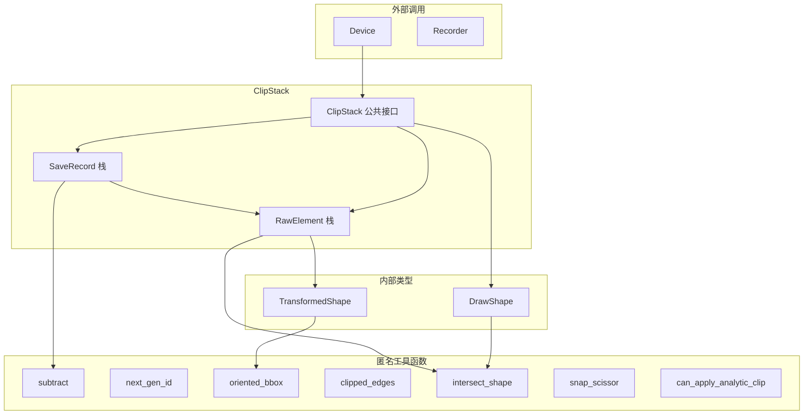
```mermaid
flowchart TD
    subgraph 外部调用
        Device[Device]
        Recorder[Recorder]
    end

    subgraph ClipStack
        CS[ClipStack 公共接口]
        SR[SaveRecord 栈]
        EL[RawElement 栈]
    end

    subgraph 内部类型
        TS[TransformedShape]
        DS[DrawShape]
    end

    subgraph 匿名工具函数
        subtract
        next_gen_id
        oriented_bbox
        clipped_edges
        intersect_shape
        snap_scissor
        can_apply_analytic_clip
    end

    Device --> CS
    CS --> SR
    CS --> EL
    SR --> EL
    EL --> TS
    CS --> DS
    DS --> intersect_shape
    EL --> intersect_shape
    TS --> oriented_bbox
    SR --> subtract
```

---

## 1. 匿名命名空间工具函数

### 1.1 `subtract()`

```cpp
Rect subtract(const Rect& a, const Rect& b, bool exact);
```

从矩形 A 中减去矩形 B，返回剩余区域的矩形近似。

**实现**: 直接调用 `SkRectPriv::Subtract`。若 `exact=true` 且无法精确表示差集，则返回原始 A；否则返回被 B 排除的子矩形。函数仅 ~10 行，无需流程图。

---

### 1.2 `next_gen_id()`

```cpp
uint32_t next_gen_id();
```

生成唯一 clip generation ID（原子递增，0-2 为保留值）。

**实现**: 使用 `std::atomic<uint32_t>` 的 `fetch_add`，若结果 < 3 则重试。简单循环，无需流程图。

---

### 1.3 `oriented_bbox_intersection()`

```cpp
bool oriented_bbox_intersection(const Rect& a, const Transform& aXform,
                                const Rect& b, const Transform& bXform);
```

使用分离轴定理(SAT)检测两个经仿射变换的矩形是否相交。

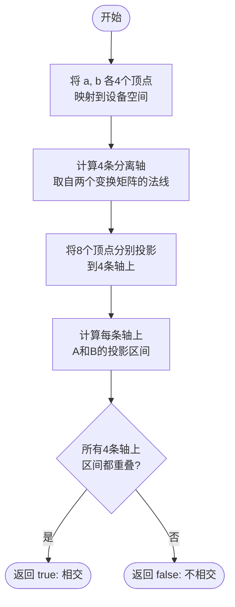
```mermaid
flowchart TD
    A([开始]) --> B[将 a, b 各4个顶点<br/>映射到设备空间]
    B --> C[计算4条分离轴<br/>取自两个变换矩阵的法线]
    C --> D[将8个顶点分别投影<br/>到4条轴上]
    D --> E[计算每条轴上<br/>A和B的投影区间]
    E --> F{所有4条轴上<br/>区间都重叠?}
    F -->|是| G([返回 true: 相交])
    F -->|否| H([返回 false: 不相交])
```

**关键细节**:
- 排除透视变换(前置 assert)
- 使用 SIMD `skvx::float4` 并行处理 4 条轴
- `all(overlaps)` 一次判断所有轴

---

### 1.4 `clipped_edges()`

```cpp
SkEnumBitMask<EdgeAAQuad::Flags> clipped_edges(const Rect& shape, const Rect& other);
```

检测 `other` 的哪些边被 `shape` 的对应边裁切（即 other 的边在 shape 边的内侧）。

**实现**: 利用 `Rect::vals()` 中 RB 取负存储的特性，一次 SIMD 比较 `other.vals() >= shape.vals()` 得到 LTRB 4个布尔值，组合成 EdgeAAQuad::Flags 位掩码。~5行，无需流程图。

---

### 1.5 `intersect_shape()`

```cpp
bool intersect_shape(const Transform& otherToDevice, const Shape& otherShape,
                     const Transform& localToDevice, Shape* shape,
                     SkEnumBitMask<EdgeAAQuad::Flags>* edgeFlags);
```

尝试将 `otherShape`（裁剪形状）直接合并到 `shape`（绘制形状）中，产生精确交集。

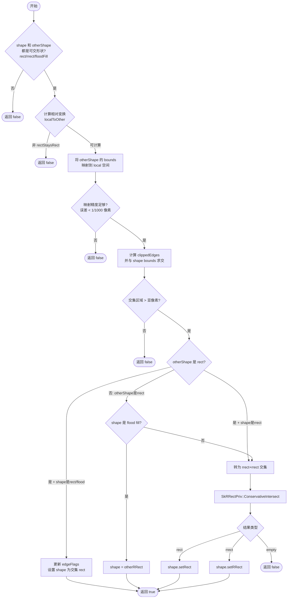
```mermaid
flowchart TD
    A([开始]) --> B{shape 和 otherShape<br/>都是可交形状?<br/>rect/rrect/floodFill}
    B -->|否| Z1([返回 false])
    B -->|是| C{计算相对变换<br/>localToOther}
    C -->|非 rectStaysRect| Z2([返回 false])
    C -->|可计算| D[将 otherShape 的 bounds<br/>映射到 local 空间]
    D --> E{映射精度足够?<br/>误差 < 1/1000 像素}
    E -->|否| Z3([返回 false])
    E -->|是| F[计算 clippedEdges<br/>并与 shape bounds 求交]
    F --> G{交集区域 > 亚像素?}
    G -->|否| Z4([返回 false])
    G -->|是| H{otherShape 是 rect?}
    H -->|是 + shape是rect/flood| I[更新 edgeFlags<br/>设置 shape 为交集 rect]
    H -->|是 + shape是rrect| J[转为 rrect+rrect 交集]
    H -->|否: otherShape是rrect| K{shape 是 flood fill?}
    K -->|是| L[shape = otherRRect]
    K -->|否| J
    J --> M[SkRRectPriv::ConservativeIntersect]
    M --> N{结果类型}
    N -->|rect| O[shape.setRect]
    N -->|rrect| P[shape.setRRect]
    N -->|empty| Z5([返回 false])
    I --> Q([返回 true])
    L --> Q
    O --> Q
    P --> Q
```

**关键细节**:
- 处理 4 种坐标空间关系: 相同、other=I、local=I、一般情况
- 使用 `inverseMapRect` + `mapRect` 往返验证精度
- 对 EdgeAAQuad 的非 AA 边有特殊处理

---

### 1.6 `snap_scissor()`

```cpp
Rect snap_scissor(const Rect& a, const Rect& deviceBounds);
```

将矩形向外对齐到 4 像素边界（减少 scissor 状态切换），并裁切到设备边界。

**实现**: 先 outset `kRes-1`，再除以 4 取整扩大，再乘 4 并与 deviceBounds 求交。~4行，无需流程图。

---

### 1.7 `can_apply_analytic_clip()`

```cpp
AnalyticClip can_apply_analytic_clip(const Shape& shape, const Transform& localToDevice);
```

判断形状是否适合用解析 clip（shader 中计算覆盖度），仅支持设备空间的 rect 和近似圆形 rrect。

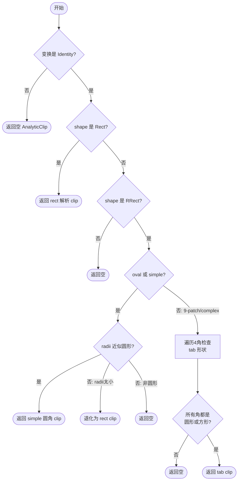
```mermaid
flowchart TD
    A([开始]) --> B{变换是 Identity?}
    B -->|否| Z1([返回空 AnalyticClip])
    B -->|是| C{shape 是 Rect?}
    C -->|是| D([返回 rect 解析 clip])
    C -->|否| E{shape 是 RRect?}
    E -->|否| Z2([返回空])
    E -->|是| F{oval 或 simple?}
    F -->|是| G{radii 近似圆形?}
    G -->|是| H([返回 simple 圆角 clip])
    G -->|否: radii太小| I([退化为 rect clip])
    G -->|否: 非圆形| Z3([返回空])
    F -->|否: 9-patch/complex| J[遍历4角检查<br/>tab 形状]
    J --> K{所有角都是<br/>圆形或方形?}
    K -->|否| Z4([返回空])
    K -->|是| L([返回 tab clip])
```

---

## 2. TransformedShape 方法

### 2.1 `intersects()`

```cpp
bool ClipStack::TransformedShape::intersects(const TransformedShape& o) const;
```

检测两个变换后形状是否相交。

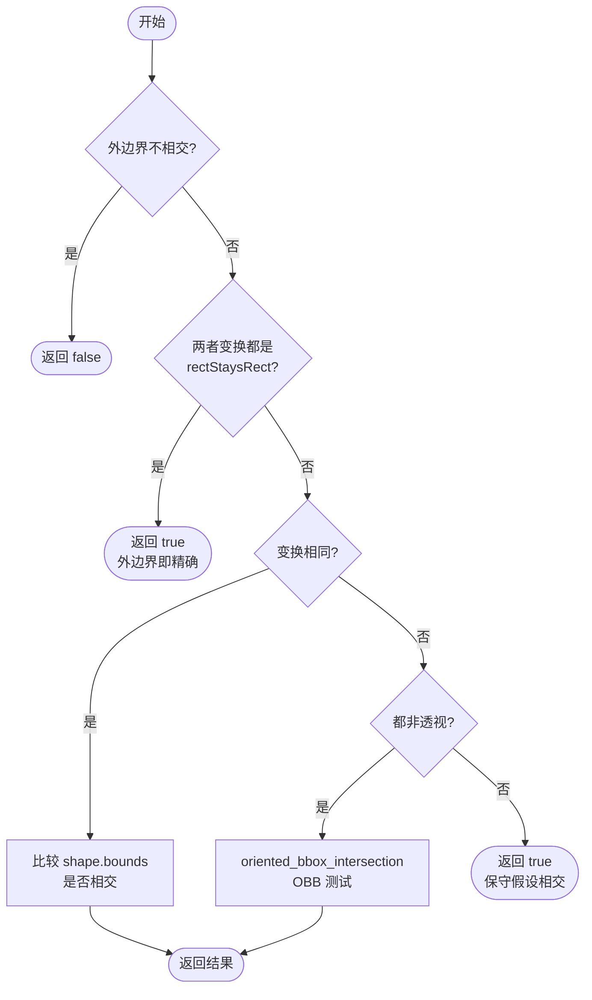
```mermaid
flowchart TD
    A([开始]) --> B{外边界不相交?}
    B -->|是| C([返回 false])
    B -->|否| D{两者变换都是<br/>rectStaysRect?}
    D -->|是| E([返回 true<br/>外边界即精确])
    D -->|否| F{变换相同?}
    F -->|是| G[比较 shape.bounds<br/>是否相交]
    F -->|否| H{都非透视?}
    H -->|是| I[oriented_bbox_intersection<br/>OBB 测试]
    H -->|否| J([返回 true<br/>保守假设相交])
    G --> K([返回结果])
    I --> K
```

---

### 2.2 `contains()`

```cpp
bool ClipStack::TransformedShape::contains(const TransformedShape& o) const;
```

检测 this 是否完全包含 o。

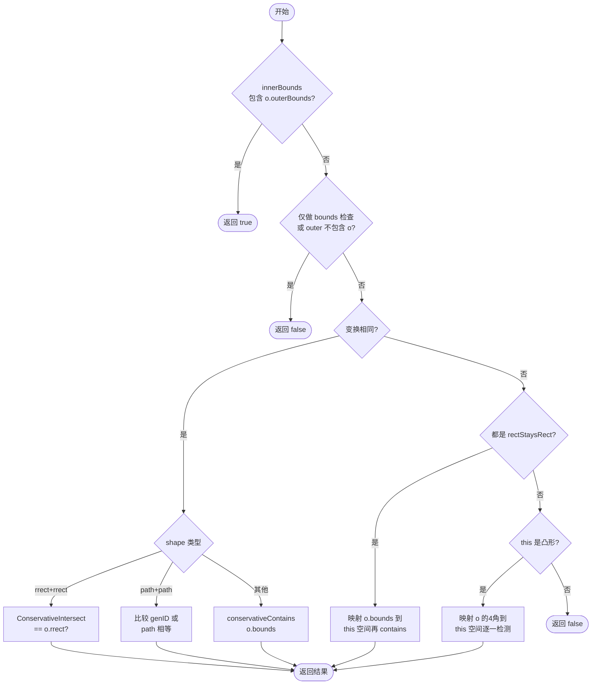
```mermaid
flowchart TD
    A([开始]) --> B{innerBounds<br/>包含 o.outerBounds?}
    B -->|是| C([返回 true])
    B -->|否| D{仅做 bounds 检查<br/>或 outer 不包含 o?}
    D -->|是| E([返回 false])
    D -->|否| F{变换相同?}
    F -->|是| G{shape 类型}
    G -->|rrect+rrect| H[ConservativeIntersect<br/>== o.rrect?]
    G -->|path+path| I[比较 genID 或<br/>path 相等]
    G -->|其他| J[conservativeContains<br/>o.bounds]
    F -->|否| K{都是 rectStaysRect?}
    K -->|是| L[映射 o.bounds 到<br/>this 空间再 contains]
    K -->|否| M{this 是凸形?}
    M -->|是| N[映射 o 的4角到<br/>this 空间逐一检测]
    M -->|否| O([返回 false])
    H --> P([返回结果])
    I --> P
    J --> P
    L --> P
    N --> P
```

**关键细节**:
- path 比较限制最大 16 个控制点
- 凸形检测需处理 W=0 平面裁剪

---

## 3. 静态方法

### 3.1 `Simplify()`

```cpp
static SimplifyResult Simplify(const TransformedShape& a, const TransformedShape& b);
```

根据两个形状的 clip op 组合（II/ID/DI/DD），判断交集可简化为 Empty/AOnly/BOnly/Both。

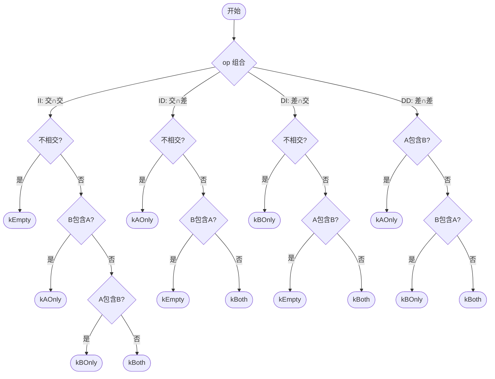
```mermaid
flowchart TD
    A([开始]) --> B{op 组合}
    B -->|II: 交∩交| C{不相交?}
    C -->|是| D([kEmpty])
    C -->|否| E{B包含A?}
    E -->|是| F([kAOnly])
    E -->|否| G{A包含B?}
    G -->|是| H([kBOnly])
    G -->|否| I([kBoth])

    B -->|ID: 交∩差| J{不相交?}
    J -->|是| K([kAOnly])
    J -->|否| L{B包含A?}
    L -->|是| M([kEmpty])
    L -->|否| N([kBoth])

    B -->|DI: 差∩交| O{不相交?}
    O -->|是| P([kBOnly])
    O -->|否| Q{A包含B?}
    Q -->|是| R([kEmpty])
    Q -->|否| S([kBoth])

    B -->|DD: 差∩差| T{A包含B?}
    T -->|是| U([kAOnly])
    T -->|否| V{B包含A?}
    V -->|是| W([kBOnly])
    V -->|否| X([kBoth])
```

---

### 3.2 `SimplifyForDraw()`

```cpp
static DrawInfluence SimplifyForDraw(const TransformedShape& clip, const TransformedShape& draw);
```

将 `Simplify` 结果映射为 DrawInfluence 枚举（kClipsOutDraw / kReplacesDraw / kNone / kComplexInteraction）。

**实现**: 直接调用 `Simplify(clip, draw)` 并 `static_cast` 结果。利用 `static_assert` 保证枚举值一一对应。~5行，无需流程图。

---

## 4. RawElement 方法

### 4.1 构造函数

```cpp
RawElement(const Rect& deviceBounds, const Transform& localToDevice,
           const Shape& shape, SkClipOp op, PixelSnapping snapping);
```

初始化裁剪元素：规范化形状、计算边界、应用变换优化。

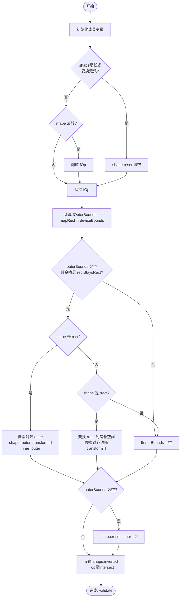
```mermaid
flowchart TD
    A([开始]) --> B[初始化成员变量]
    B --> C{shape是线或<br/>变换无效?}
    C -->|是| D[shape.reset 置空]
    C -->|否| E{shape 反转?}
    E -->|是| F[翻转 fOp]
    E -->|否| G[保持 fOp]
    F --> G
    D --> G
    G --> H[计算 fOuterBounds =<br/>mapRect ∩ deviceBounds]
    H --> I{outerBounds 非空<br/>且变换是 rectStaysRect?}
    I -->|否| J[fInnerBounds = 空]
    I -->|是| K{shape 是 rect?}
    K -->|是| L[像素对齐 outer<br/>shape=outer, transform=I<br/>inner=outer]
    K -->|否| M{shape 是 rrect?}
    M -->|是| N[变换 rrect 到设备空间<br/>像素对齐边缘<br/>transform=I]
    M -->|否| J
    L --> O{outerBounds 为空?}
    N --> O
    J --> O
    O -->|是| P[shape.reset, inner=空]
    O -->|否| Q[设置 shape.inverted<br/>= op是Intersect]
    P --> Q
    Q --> R([完成, validate])
```

**关键细节**:
- `PixelSnapping::kYes` 会将 rect 对齐到整像素、rrect 的直边对齐到整像素
- 最终 shape 的 inverted 状态编码了 clip op（intersect = inverted）

---

### 4.2 `drawClip()`

```cpp
void RawElement::drawClip(Device* device);
```

将累积的裁剪绘制提交到设备（延迟执行）。

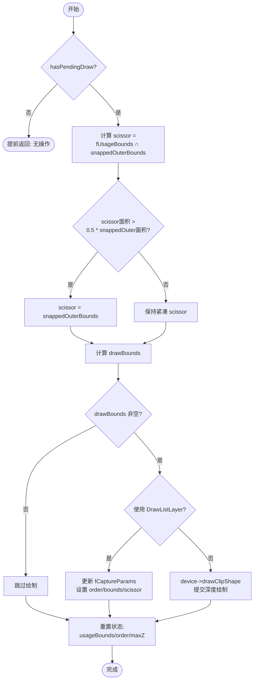
```mermaid
flowchart TD
    A([开始]) --> B{hasPendingDraw?}
    B -->|否| C([提前返回: 无操作])
    B -->|是| D[计算 scissor =<br/>fUsageBounds ∩ snappedOuterBounds]
    D --> E{scissor面积 ><br/>0.5 * snappedOuter面积?}
    E -->|是| F[scissor = snappedOuterBounds]
    E -->|否| G[保持紧凑 scissor]
    F --> H[计算 drawBounds]
    G --> H
    H --> I{drawBounds 非空?}
    I -->|否| J[跳过绘制]
    I -->|是| K{使用 DrawListLayer?}
    K -->|是| L[更新 fCaptureParams<br/>设置 order/bounds/scissor]
    K -->|否| M[device->drawClipShape<br/>提交深度绘制]
    J --> N[重置状态:<br/>usageBounds/order/maxZ]
    L --> N
    M --> N
    N --> O([完成])
```

**关键细节**:
- DrawOrder 使用 `fMaxZ.next()` 确保裁剪绘制的深度大于所有被裁剪的绘制
- 重置状态允许元素在 flush 后继续累积新的使用

---

### 4.3 `drawClipImmediate()`

```cpp
void RawElement::drawClipImmediate(Device* device, const Rect& snappedOuterBounds);
```

立即提交裁剪绘制（用于 DrawListLayer 模式），不等待延迟执行。

**实现**: 直接调用 `device->drawClipShapeImmediate()`，获取并保存 `fCaptureParams` 和 `fInsertion`。~10行，无需流程图。

---

### 4.4 `validate()`

```cpp
void RawElement::validate() const;
```

调试断言：验证 shape/bounds/op 之间的一致性。仅在 debug 构建中有效，无需流程图。

---

### 4.5 `markInvalid()` / `restoreValid()`

```cpp
void RawElement::markInvalid(const SaveRecord& current);
void RawElement::restoreValid(const SaveRecord& current);
```

- `markInvalid`: 记录使此元素失效的活动元素索引
- `restoreValid`: 若当前 save record 的 firstActiveIndex < invalidatedByIndex，恢复有效

两者各 ~3行，无需流程图。

---

### 4.6 `combine()`

```cpp
bool RawElement::combine(const RawElement& other, const SaveRecord& current);
```

尝试将 `other` 的几何形状合并到 this 中（仅处理 intersect+intersect）。

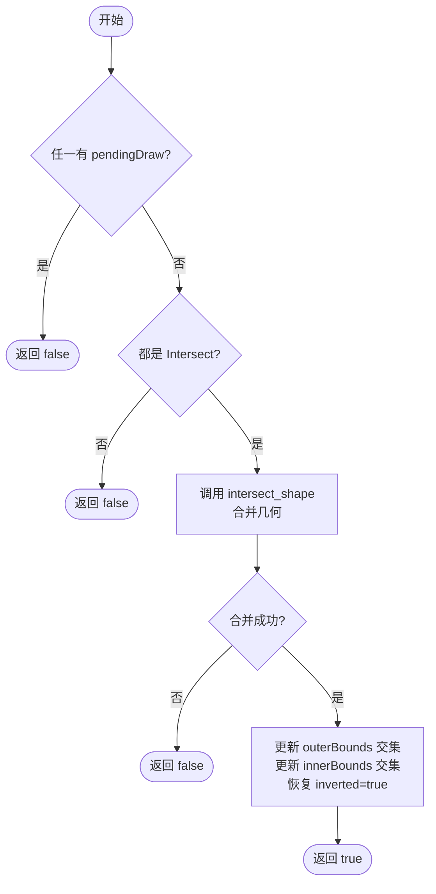
```mermaid
flowchart TD
    A([开始]) --> B{任一有 pendingDraw?}
    B -->|是| C([返回 false])
    B -->|否| D{都是 Intersect?}
    D -->|否| E([返回 false])
    D -->|是| F[调用 intersect_shape<br/>合并几何]
    F --> G{合并成功?}
    G -->|否| H([返回 false])
    G -->|是| I[更新 outerBounds 交集<br/>更新 innerBounds 交集<br/>恢复 inverted=true]
    I --> J([返回 true])
```

---

### 4.7 `updateForElement()`

```cpp
void RawElement::updateForElement(RawElement* added, const SaveRecord& current);
```

当新元素加入时，更新已有元素的有效性。

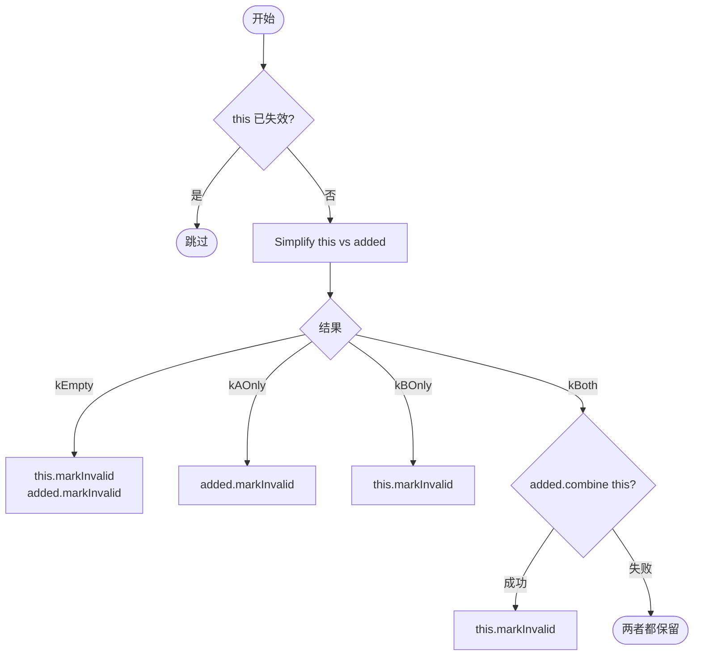
```mermaid
flowchart TD
    A([开始]) --> B{this 已失效?}
    B -->|是| C([跳过])
    B -->|否| D[Simplify this vs added]
    D --> E{结果}
    E -->|kEmpty| F[this.markInvalid<br/>added.markInvalid]
    E -->|kAOnly| G[added.markInvalid]
    E -->|kBOnly| H[this.markInvalid]
    E -->|kBoth| I{added.combine this?}
    I -->|成功| J[this.markInvalid]
    I -->|失败| K([两者都保留])
```

---

### 4.8 `testForDraw()`

```cpp
DrawInfluence RawElement::testForDraw(const TransformedShape& draw) const;
```

检测此元素对某次绘制的影响。

**实现**: 若 `isInvalid()` 返回 `kNone`，否则调用 `SimplifyForDraw(*this, draw)`。~5行，无需流程图。

---

### 4.9 `updateForDraw()`

```cpp
pair<CompressedPaintersOrder, Insertion> RawElement::updateForDraw(
    Device*, const BoundsManager*, const Rect& deviceBounds,
    const Rect& snappedDrawBounds, PaintersDepth drawZ);
```

当绘制使用此裁剪元素时，更新其使用边界和深度。

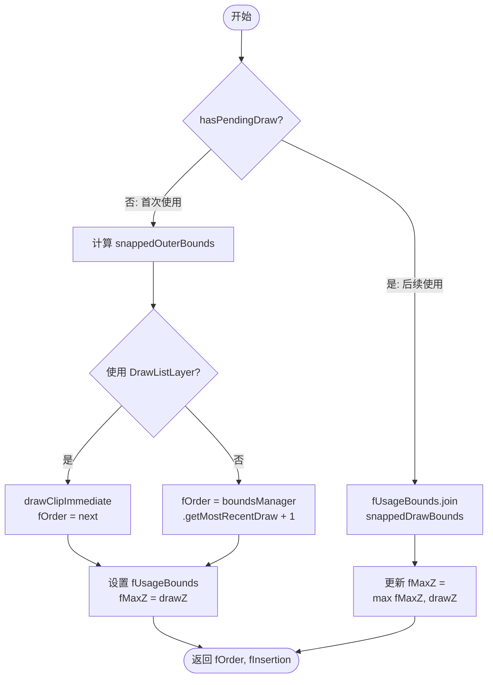
```mermaid
flowchart TD
    A([开始]) --> B{hasPendingDraw?}
    B -->|否: 首次使用| C[计算 snappedOuterBounds]
    C --> D{使用 DrawListLayer?}
    D -->|是| E[drawClipImmediate<br/>fOrder = next]
    D -->|否| F[fOrder = boundsManager<br/>.getMostRecentDraw + 1]
    E --> G[设置 fUsageBounds<br/>fMaxZ = drawZ]
    F --> G
    B -->|是: 后续使用| H[fUsageBounds.join<br/>snappedDrawBounds]
    H --> I[更新 fMaxZ =<br/>max fMaxZ, drawZ]
    G --> J([返回 fOrder, fInsertion])
    I --> J
```

**关键细节**:
- 延迟确定 order 的好处：无效元素不浪费 BoundsManager 查询；多个绘制触发同一元素时可共享 order
- 使用 snap_scissor 对齐后的 outer bounds 查询 order

---

### 4.10 `clipType()`

```cpp
ClipState RawElement::clipType() const;
```

将内部 Shape 类型映射为 ClipState 枚举。

**实现**: switch on `fShape.type()`：Empty→kEmpty，Rect+Identity+Intersect→kDeviceRect，RRect+Identity+Intersect→kDeviceRRect，其余→kComplex。~15行，无需流程图。

---

## 5. SaveRecord 方法

### 5.1 构造函数

```cpp
SaveRecord(const Rect& deviceBounds);                       // 根记录
SaveRecord(const SaveRecord& prior, int startingElementIndex); // 嵌套记录
```

- 根记录: 初始化为 WideOpen，bounds = deviceBounds
- 嵌套记录: 继承 prior 的 bounds/state/shader，设置新的 startingElementIndex

简单赋值，无需流程图。

---

### 5.2 `genID()`

```cpp
uint32_t SaveRecord::genID() const;
```

返回当前 clip 状态的 generation ID（Empty→1, WideOpen→2, 其他→fGenID）。~5行，无需流程图。

---

### 5.3 `state()`

```cpp
ClipState SaveRecord::state() const;
```

返回 clip 状态，若有 shader 且非 Empty 则强制返回 kComplex。~5行，无需流程图。

---

### 5.4 `testForDraw()`

```cpp
DrawInfluence SaveRecord::testForDraw(const TransformedShape& draw) const;
```

用 SaveRecord 的 outer/inner bounds 构造 TransformedShape 代理，调用 SimplifyForDraw。

**实现**: 创建 identity 变换 + outerBounds 形状的 TransformedShape（containsChecksOnlyBounds=true），调用 SimplifyForDraw。~5行，无需流程图。

---

### 5.5 `removeElements()` / `restoreElements()`

```cpp
void SaveRecord::removeElements(RawElement::Stack* elements, Device* device);
void SaveRecord::restoreElements(RawElement::Stack* elements);
```

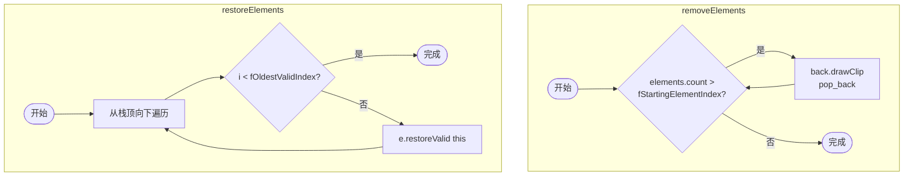
```mermaid
flowchart TD
    subgraph removeElements
        A1([开始]) --> B1{elements.count ><br/>fStartingElementIndex?}
        B1 -->|是| C1[back.drawClip<br/>pop_back]
        C1 --> B1
        B1 -->|否| D1([完成])
    end

    subgraph restoreElements
        A2([开始]) --> B2[从栈顶向下遍历]
        B2 --> C2{i < fOldestValidIndex?}
        C2 -->|是| D2([完成])
        C2 -->|否| E2[e.restoreValid this]
        E2 --> B2
    end
```

---

### 5.6 `addShader()`

```cpp
void SaveRecord::addShader(sk_sp<SkShader> shader);
```

累积 clip shader：若无已有 shader 则直接赋值，否则用 `SkShaders::Blend(kSrcIn)` 组合（乘法）。~5行，无需流程图。

---

### 5.7 `addElement()`

```cpp
bool SaveRecord::addElement(RawElement&& toAdd, RawElement::Stack* elements, Device* device);
```

将新裁剪元素加入当前 save record，处理简化和边界更新。

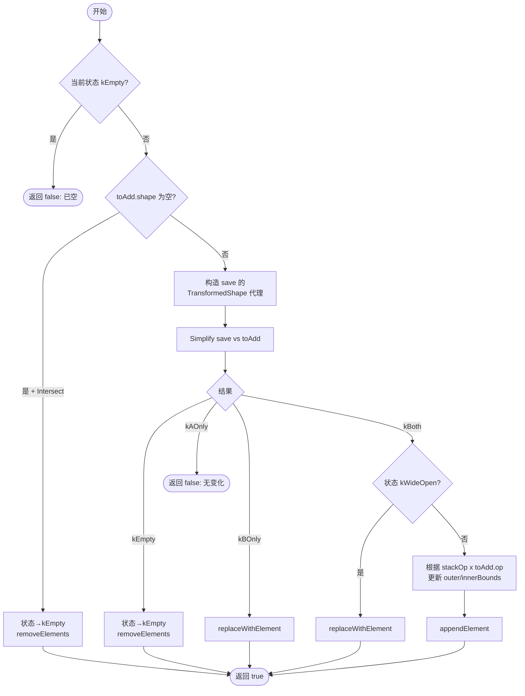
```mermaid
flowchart TD
    A([开始]) --> B{当前状态 kEmpty?}
    B -->|是| C([返回 false: 已空])
    B -->|否| D{toAdd.shape 为空?}
    D -->|是 + Intersect| E[状态→kEmpty<br/>removeElements]
    D -->|否| F[构造 save 的<br/>TransformedShape 代理]
    F --> G[Simplify save vs toAdd]
    G --> H{结果}
    H -->|kEmpty| I[状态→kEmpty<br/>removeElements]
    H -->|kAOnly| J([返回 false: 无变化])
    H -->|kBOnly| K[replaceWithElement]
    H -->|kBoth| L{状态 kWideOpen?}
    L -->|是| M[replaceWithElement]
    L -->|否| N[根据 stackOp x toAdd.op<br/>更新 outer/innerBounds]
    N --> O[appendElement]
    E --> P([返回 true])
    I --> P
    K --> P
    M --> P
    O --> P
```

**关键细节**:
- 4种 op 组合（II/ID/DI/DD）各有不同的 bounds 更新逻辑
- kBOnly 和 WideOpen+kBoth 走 `replaceWithElement` 快速路径

---

### 5.8 `appendElement()`

```cpp
bool SaveRecord::appendElement(RawElement&& toAdd, RawElement::Stack* elements, Device* device);
```

将元素实际追加到栈中，处理与已有元素的交互和失效清理。

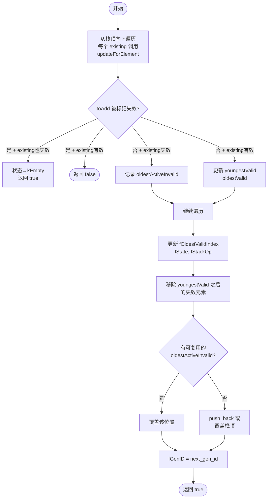
```mermaid
flowchart TD
    A([开始]) --> B[从栈顶向下遍历<br/>每个 existing 调用<br/>updateForElement]
    B --> C{toAdd 被标记失效?}
    C -->|是 + existing也失效| D[状态→kEmpty<br/>返回 true]
    C -->|是 + existing有效| E([返回 false])
    C -->|否 + existing失效| F[记录 oldestActiveInvalid]
    C -->|否 + existing有效| G[更新 youngestValid<br/>oldestValid]
    F --> H[继续遍历]
    G --> H
    H --> I[更新 fOldestValidIndex<br/>fState, fStackOp]
    I --> J[移除 youngestValid 之后<br/>的失效元素]
    J --> K{有可复用的<br/>oldestActiveInvalid?}
    K -->|是| L[覆盖该位置]
    K -->|否| M[push_back 或<br/>覆盖栈顶]
    L --> N[fGenID = next_gen_id]
    M --> N
    N --> O([返回 true])
```

**关键细节**:
- 追踪 youngestValid / oldestValid / oldestActiveInvalid 三个索引
- 优先复用已失效元素的内存位置，减少栈增长
- 被删除的元素会先调用 `drawClip` 提交其累积绘制

---

### 5.9 `replaceWithElement()`

```cpp
void SaveRecord::replaceWithElement(RawElement&& toAdd, RawElement::Stack* elements, Device* device);
```

用单个新元素替换当前 save record 的所有活动元素。

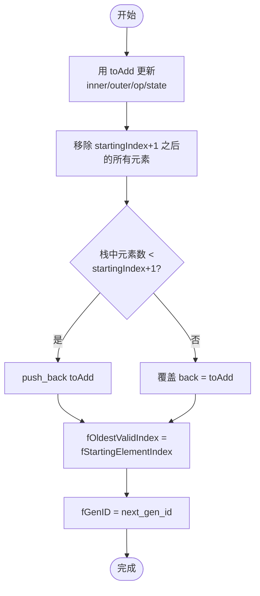
```mermaid
flowchart TD
    A([开始]) --> B[用 toAdd 更新<br/>inner/outer/op/state]
    B --> C[移除 startingIndex+1 之后<br/>的所有元素]
    C --> D{栈中元素数 <<br/>startingIndex+1?}
    D -->|是| E[push_back toAdd]
    D -->|否| F[覆盖 back = toAdd]
    E --> G[fOldestValidIndex =<br/>fStartingElementIndex]
    F --> G
    G --> H[fGenID = next_gen_id]
    H --> I([完成])
```

---

## 6. DrawShape 方法

### 6.1 构造函数

```cpp
DrawShape(const Transform& localToDevice, const Geometry& geometry);
```

从绘制几何构造 DrawShape：提取形状和 edge flags，判断是否可被裁剪修改。

**实现**: 若 geometry 是 Shape 则直接使用；否则用 bounds 代替（EdgeAAQuad 保留 edge flags）。设置 `fShapeCompatibleWithIntersectShape` 标志。~25行构造函数，逻辑直接。

---

### 6.2 `applyStyle()`

```cpp
bool DrawShape::applyStyle(const SkStrokeRec& style, const Rect& deviceBounds);
```

根据描边样式扩展形状边界，计算设备空间 outer/inner bounds。

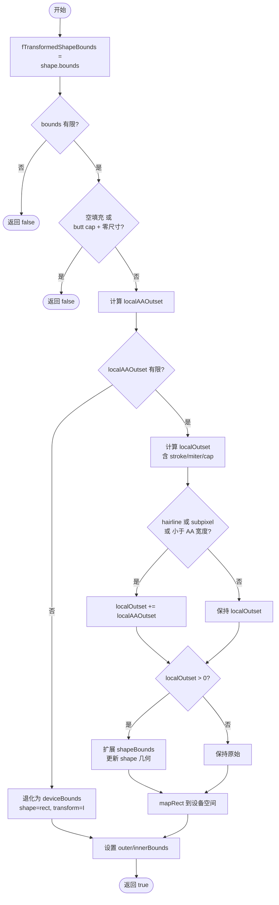
```mermaid
flowchart TD
    A([开始]) --> B[fTransformedShapeBounds =<br/>shape.bounds]
    B --> C{bounds 有限?}
    C -->|否| D([返回 false])
    C -->|是| E{空填充 或<br/>butt cap + 零尺寸?}
    E -->|是| F([返回 false])
    E -->|否| G[计算 localAAOutset]
    G --> H{localAAOutset 有限?}
    H -->|否| I[退化为 deviceBounds<br/>shape=rect, transform=I]
    H -->|是| J[计算 localOutset<br/>含 stroke/miter/cap]
    J --> K{hairline 或 subpixel<br/>或 小于 AA 宽度?}
    K -->|是| L[localOutset += localAAOutset]
    K -->|否| M[保持 localOutset]
    L --> N{localOutset > 0?}
    M --> N
    N -->|是| O[扩展 shapeBounds<br/>更新 shape 几何]
    N -->|否| P[保持原始]
    O --> Q[mapRect 到设备空间]
    P --> Q
    I --> R[设置 outer/innerBounds]
    Q --> R
    R --> S([返回 true])
```

**关键细节**:
- RRect 扩展保留圆角（`rrect.outset`）
- 闭合形状（rect/rrect）无 cap 贡献
- 非 path 形状无 miter 贡献

---

### 6.3 `applyScissor()`

```cpp
void DrawShape::applyScissor(const Rect& scissor);
```

将 scissor 矩形应用到 outer/inner bounds。

**实现**: `fScissor.intersect(scissor)`, `fOuterBounds.intersect(scissor)`, `fInnerBounds.intersect(scissor)`。~3行，无需流程图。

---

### 6.4 `toClip()`

```cpp
Clip DrawShape::toClip(Geometry* geometry, const NonMSAAClip& analyticClip, const SkShader* clipShader);
```

将修改后的形状同步回 geometry，返回最终 Clip 对象。

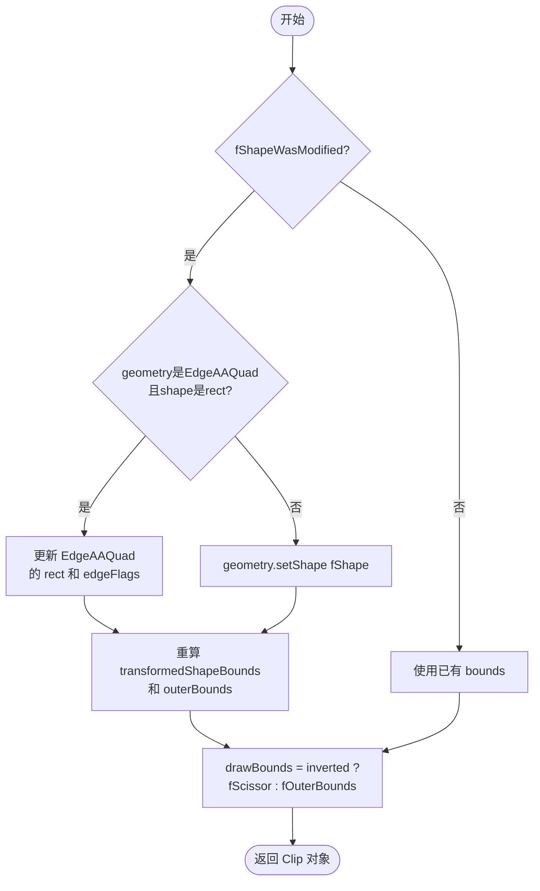
```mermaid
flowchart TD
    A([开始]) --> B{fShapeWasModified?}
    B -->|是| C{geometry是EdgeAAQuad<br/>且shape是rect?}
    C -->|是| D[更新 EdgeAAQuad<br/>的 rect 和 edgeFlags]
    C -->|否| E[geometry.setShape fShape]
    D --> F[重算 transformedShapeBounds<br/>和 outerBounds]
    E --> F
    B -->|否| G[使用已有 bounds]
    F --> H[drawBounds = inverted ?<br/>fScissor : fOuterBounds]
    G --> H
    H --> I([返回 Clip 对象])
```

---

### 6.5 `resetToFloodFill()`

```cpp
void DrawShape::resetToFloodFill();
```

将绘制形状重置为 flood fill（反转的空形状），表示绘制覆盖整个裁剪区域。

**实现**: 若 `shapeCanBeModified()` 且非已有 flood fill，则 `shape.reset()`, `setInverted(true)`, bounds 置空, 标记 modified。~5行，无需流程图。

---

### 6.6 `intersectClipElement()`

```cpp
bool DrawShape::intersectClipElement(const RawElement& clip);
```

尝试将裁剪元素的形状直接合并到绘制形状中。

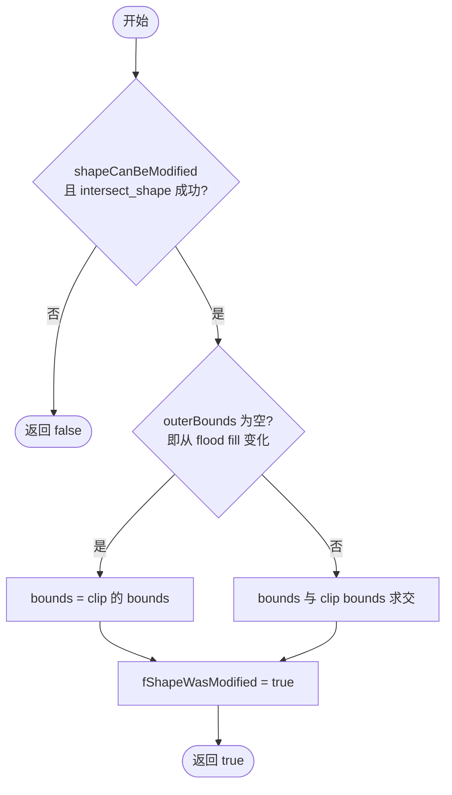
```mermaid
flowchart TD
    A([开始]) --> B{shapeCanBeModified<br/>且 intersect_shape 成功?}
    B -->|否| C([返回 false])
    B -->|是| D{outerBounds 为空?<br/>即从 flood fill 变化}
    D -->|是| E[bounds = clip 的 bounds]
    D -->|否| F[bounds 与 clip bounds 求交]
    E --> G[fShapeWasModified = true]
    F --> G
    G --> H([返回 true])
```

---

## 7. ClipStack 公共方法

### 7.1 构造函数 / 析构函数

```cpp
ClipStack(Device* owningDevice);
~ClipStack();
```

构造时创建初始 WideOpen 的 SaveRecord。析构为默认。

---

### 7.2 `save()` / `restore()`

```cpp
void ClipStack::save();
void ClipStack::restore();
```

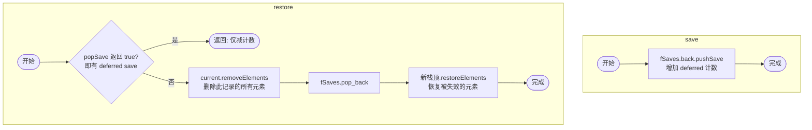
```mermaid
flowchart TD
    subgraph save
        S1([开始]) --> S2[fSaves.back.pushSave<br/>增加 deferred 计数]
        S2 --> S3([完成])
    end

    subgraph restore
        R1([开始]) --> R2{popSave 返回 true?<br/>即有 deferred save}
        R2 -->|是| R3([返回: 仅减计数])
        R2 -->|否| R4[current.removeElements<br/>删除此记录的所有元素]
        R4 --> R5[fSaves.pop_back]
        R5 --> R6[新栈顶.restoreElements<br/>恢复被失效的元素]
        R6 --> R7([完成])
    end
```

---

### 7.3 `clipShape()`

```cpp
void ClipStack::clipShape(const Transform& localToDevice, const Shape& shape,
                          SkClipOp op, PixelSnapping snapping);
```

向裁剪栈添加形状元素。

```mermaid
flowchart TD
    A([开始]) --> B{当前状态 kEmpty?}
    B -->|是| C([提前返回])
    B -->|否| D[构造 RawElement]
    D --> E{shape 为空?}
    E -->|是 + Difference| F([返回: 无效果])
    E -->|是 + Intersect 或<br/>shape 非空| G[获取 writableSaveRecord]
    G --> H[save.addElement]
    H --> I{添加成功?}
    I -->|否 + wasDeferred| J[撤销: pop save record<br/>恢复 deferred count]
    I -->|是 或 非deferred| K([完成])
    J --> K
```

**关键细节**:
- `writableSaveRecord` 在需要时会展开 deferred save
- 如果 addElement 未生效且刚创建了新 save record，需要撤回

---

### 7.4 `clipShader()`

```cpp
void ClipStack::clipShader(sk_sp<SkShader> shader);
```

添加 clip shader（不影响几何元素）。

**实现**: 若当前 kEmpty 则返回，否则调用 `writableSaveRecord.addShader(shader)`。~5行，无需流程图。

---

### 7.5 `deviceBounds()` / `conservativeBounds()`

```cpp
Rect ClipStack::deviceBounds() const;
Rect ClipStack::conservativeBounds() const;
```

- `deviceBounds`: 返回 `Rect::WH(device->width(), device->height())`
- `conservativeBounds`: 根据状态返回保守裁剪边界：Empty→InfiniteInverted，WideOpen→deviceBounds，Difference→subtract(device, inner)，Intersect→outerBounds

---

### 7.6 `writableSaveRecord()`

```cpp
SaveRecord& ClipStack::writableSaveRecord(bool* wasDeferred);
```

获取可写的 save record：若当前可更新则直接返回，否则展开 deferred save 创建新记录。~10行，无需流程图。

---

### 7.7 `visitClipStackForDraw()`

```cpp
Clip ClipStack::visitClipStackForDraw(const Transform& localToDevice, Geometry* geometry,
                                      const SkStrokeRec& style,
                                      ElementList* outEffectiveElements) const;
```

为一次绘制访问裁剪栈，返回最终 Clip 和需要 MSAA 处理的元素列表。

```mermaid
flowchart TD
    A([开始]) --> B{SaveRecord状态 kEmpty?}
    B -->|是| C([返回 clippedOut])
    B -->|否| D[构造 DrawShape<br/>applyStyle]
    D --> E{applyStyle 失败?}
    E -->|是| F([返回 clippedOut])
    E -->|否| G[计算 scissor 并 applyScissor]
    G --> H[SaveRecord.testForDraw]
    H --> I{结果}
    I -->|kClipsOutDraw| J([返回 clippedOut])
    I -->|kNone| K([返回 draw.toClip<br/>无需遍历元素])
    I -->|kReplacesDraw| L[draw.resetToFloodFill]
    I -->|kComplexInteraction| M[遍历元素]
    L --> M

    M --> N[对每个有效 RawElement<br/>调用 testForDraw]
    N --> O{元素结果}
    O -->|kClipsOutDraw| P([清空列表, 返回 clippedOut])
    O -->|kNone| Q[跳过此元素]
    O -->|kReplacesDraw| R[resetToFloodFill]
    O -->|kComplexInteraction| S{尝试4级处理}

    R --> S
    S --> S1{1. intersectClipElement<br/>几何合并?}
    S1 -->|成功| Q
    S1 -->|失败| S2{2. 可做 scissor<br/>整像素rect?}
    S2 -->|成功| Q
    S2 -->|失败| S3{3. 可做解析 clip<br/>shader?}
    S3 -->|成功| Q
    S3 -->|失败| S4[4. 加入 effectiveElements]

    S4 --> T{遍历完成}
    Q --> T
    T --> U{有 ClipAtlas 且<br/>列表非空?}
    U -->|是| V[尝试 atlas 查找/创建]
    V --> W{找到 atlas?}
    W -->|是| X[设置 atlasClip<br/>清空列表]
    W -->|否| Y[保留列表]
    U -->|否| Y
    X --> Z([返回 draw.toClip])
    Y --> Z
```

**关键细节**:
- 4级裁剪处理优先级: 几何合并 > scissor > 解析shader > depth/atlas
- ClipAtlas 通过 genID 缓存裁剪蒙版，避免重复光栅化
- 解析 clip 仅支持一个元素（首个可用的 rect/circular-rrect）

---

### 7.8 `updateClipStateForDraw()`

```cpp
pair<CompressedPaintersOrder, Insertion> ClipStack::updateClipStateForDraw(
    const Clip& clip, const ElementList& effectiveElements,
    const BoundsManager* boundsManager, PaintersDepth z);
```

为绘制更新裁剪状态（分配 order 和 depth）。

```mermaid
flowchart TD
    A([开始]) --> B{clip.isClippedOut?}
    B -->|是| C([返回 kNoIntersection])
    B -->|否| D[计算 snappedDrawBounds]
    D --> E[遍历 effectiveElements]
    E --> F[对每个元素调用<br/>updateForDraw]
    F --> G[maxClipOrder =<br/>max 所有返回 order]
    G --> H[latestInsertion =<br/>max 所有返回 insertion]
    H --> I([返回 maxClipOrder,<br/>latestInsertion])
```

**关键细节**:
- 所有元素的 order 取最大值，确保绘制排在所有裁剪之后
- Insertion 比较仅考虑 layer，相同 layer 保留更早的 insertion

---

### 7.9 `recordDeferredClipDraws()`

```cpp
void ClipStack::recordDeferredClipDraws();
```

遍历所有元素，提交其累积的裁剪绘制。

**实现**: `for (auto& e : fElements.items()) { e.drawClip(fDevice); }` 单行循环，无需流程图。

---

## 附录: 类型关系图

```mermaid
classDiagram
    class ClipStack {
        -RawElement::Stack fElements
        -SaveRecord::Stack fSaves
        -Device* fDevice
        +save()
        +restore()
        +clipShape()
        +clipShader()
        +visitClipStackForDraw()
        +updateClipStateForDraw()
        +recordDeferredClipDraws()
    }

    class SaveRecord {
        -Rect fInnerBounds
        -Rect fOuterBounds
        -sk_sp~SkShader~ fShader
        -int fStartingElementIndex
        -int fOldestValidIndex
        -ClipState fState
        -SkClipOp fStackOp
        +addElement()
        +appendElement()
        +replaceWithElement()
        +testForDraw()
    }

    class RawElement {
        -Rect fUsageBounds
        -CompressedPaintersOrder fOrder
        -PaintersDepth fMaxZ
        -int fInvalidatedByIndex
        +drawClip()
        +combine()
        +updateForElement()
        +updateForDraw()
        +testForDraw()
    }

    class TransformedShape {
        +Transform fLocalToDevice
        +Shape fShape
        +Rect fOuterBounds
        +Rect fInnerBounds
        +SkClipOp fOp
        +intersects()
        +contains()
    }

    class DrawShape {
        -Transform fLocalToDevice
        -Shape fShape
        -Rect fOuterBounds
        -Rect fInnerBounds
        +applyStyle()
        +applyScissor()
        +toClip()
        +intersectClipElement()
    }

    ClipStack *-- SaveRecord : 栈管理
    ClipStack *-- RawElement : 栈管理
    ClipStack ..> DrawShape : 绘制时创建
    RawElement ..|> TransformedShape : 隐式转换
    DrawShape ..|> TransformedShape : 隐式转换
    SaveRecord --> RawElement : 管理生命周期
```
