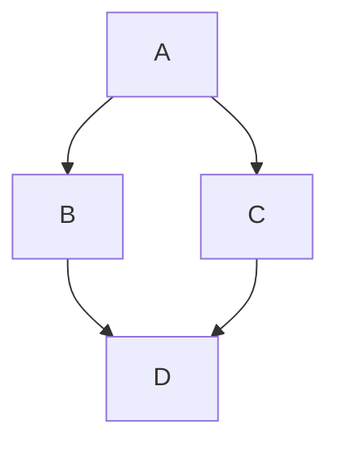

本站使用 [Hugo](https://gohugo.io/) 和 [Docsy](https://www.docsy.dev/) 构建。

你放在 `/site/` 下的任何扩展名为 `.md` 的文件都将被处理为 Markdown。所有其他文件将直接提供服务。例如，可以添加图像，它们将被正确提供并可从 Markdown 文件中引用。

在准备站点文档的代码审查时，你可以通过访问 [Gerrit issue](https://skia-review.googlesource.com/c/skia/+/862957/####) 并点击文件左侧的眼睛图标来预览页面的渲染效果：


有关如何配置和使用 Docsy 的更多详细信息，请参阅 [Docsy 文档](https://www.docsy.dev/docs/)。例如，[导航](https://www.docsy.dev/docs/adding-content/navigation/)部分解释了需要向页面添加哪些前置元数据 (frontmatter) 才能使其出现在顶部导航栏中。

## 前置元数据 (Frontmatter)

每个页面都需要一个提供该页面信息的前置元数据部分。例如：

```
---
title: 'Markdown'
linkTitle: 'Markdown'
---
```

这对 Markdown 和 HTML 页面都适用。有关更多详细信息，请参阅[关于前置元数据的 Docsy 文档](https://www.docsy.dev/docs/adding-content/content/#page-frontmatter)。

## 样式和图标

Docsy 同时支持 [Bootstrap](https://getbootstrap.com/docs/5.0/getting-started/introduction/) 和 [Font-Awesome](https://fontawesome.com/)。请查看它们的文档了解所提供的功能。

Bootstrap 包含许多类，允许你避免通过 CSS 设置样式。例如，仅使用类，我们就可以更改字体、内边距和颜色：

```html
<p class="font-monospace p-2 text-danger">This is in monospace</p>
```

渲染效果为：

<p class="font-monospace p-2 text-danger">This is in monospace</p>

## 图表

[Mermaid](https://mermaid-js.github.io/mermaid/#/) 图表已启用，因此这样写：

````markdown

````

将渲染为：


## 代码片段

要在代码片段中获得语法高亮，你需要指定语言，语言在第一个代码围栏后指定，例如以下是显示 HTML 标记的方式：

````
```html
<p class="font-monospace p-2 text-danger">This is in monospace</p>
```
````

## 配置

Hugo 配置文件是 `config.toml`，位于 site 目录中。
